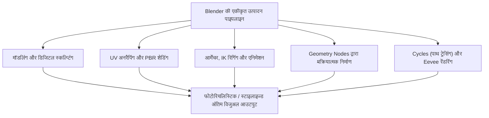
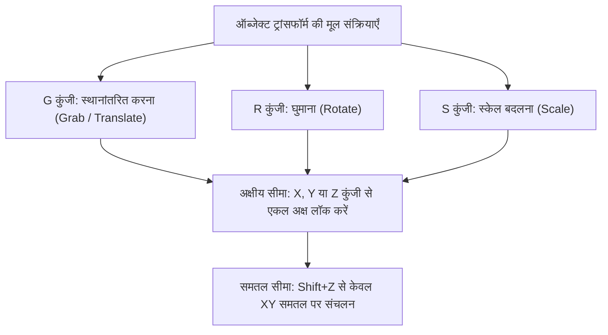
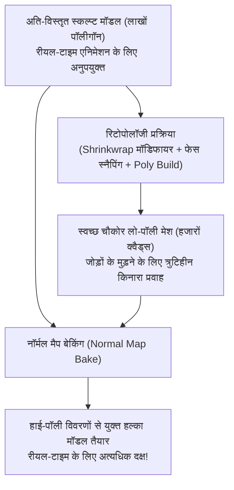
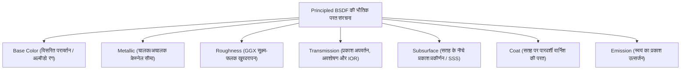
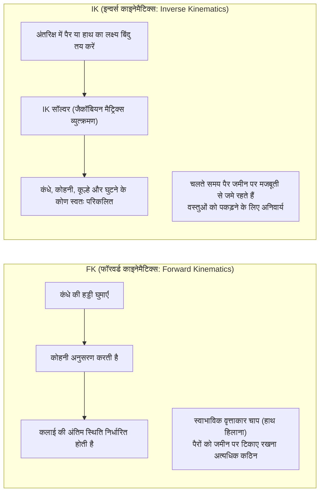
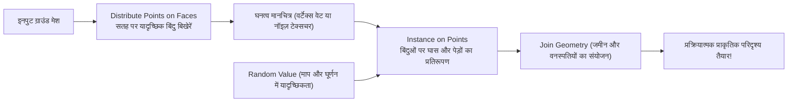
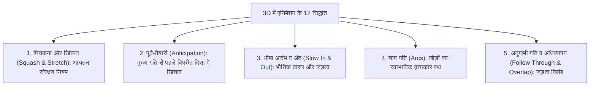

## 1. प्रस्तावना: ओपन-सोर्स 3DCG क्रांति के रूप में Blender

### 1.1 टॉन रूसेन्डाल और Blender फाउंडेशन का चमत्कारी इतिहास

1990 के दशक की शुरुआत में डच एनिमेशन स्टूडियो NeoGeo के एक इन-हाउस टूल के रूप में जन्मा "Blender", आज वैश्विक डिजिटल मनोरंजन उद्योग, गेम विकास, हॉलीवुड वीएफएक्स (VFX), आर्किटेक्चरल विज़ुअलाइज़ेशन और अत्याधुनिक वैज्ञानिक अनुसंधान की नींव को संभालने वाला दुनिया का सबसे शक्तिशाली ओपन-सोर्स 3DCG सॉफ्टवेयर बन चुका है।

इसका इतिहास किसी चमत्कारिक गाथा से कम नहीं है। NeoGeo के दिवालिया होने के बाद, लेनदारों ने Blender के बौद्धिक संपदा अधिकारों को जब्त कर लिया, जिससे इसके विकास के हमेशा के लिए बंद होने का खतरा मंडराने लगा। 1998 में, इसके संस्थापक टॉन रूसेन्डाल (Ton Roosendaal) ने "Blender Foundation" की स्थापना की और एक अभूतपूर्व क्राउडफंडिंग अभियान चलाया। दुनिया भर के कलाकारों से 100,000 यूरो का दान जुटाकर उन्होंने लेनदारों से स्रोत कोड (source code) को वापस खरीदा। 13 अक्टूबर 2002 को, GNU जनरल पब्लिक लाइसेंस (GPL) के तहत Blender को दुनिया के लिए पूरी तरह से मुफ्त और ओपन-सोर्स घोषित कर दिया गया।

जहाँ महंगे मालिकाना सॉफ्टवेयर (जैसे Maya, 3ds Max, Cinema 4D) सालाना लाखों रुपये का सब्सक्रिप्शन शुल्क वसूलते हैं, वहीं Blender अपने उदात्त संकल्प पर दृढ़ता से कायम है: **"किसी को भी वंचित न करना; दुनिया भर के प्रत्येक कलाकार को उत्कृष्ट निर्माण उपकरण हमेशा के लिए पूरी तरह से निःशुल्क उपलब्ध कराना।"**



---

### 1.2 2.80 का युगांतरकारी UI सुधार और 4.x युग में उद्योग मानक का दर्जा

कई वर्षों तक, अपने बेहद विचित्र और जटिल यूजर इंटरफेस (विशेष रूप से दाएँ क्लिक से चयन करने की शैली) के कारण मुख्यधारा के पेशेवर कलाकार Blender से कतराते थे।

लेकिन 2019 में जारी हुए "Blender 2.80" ने पूरे कंप्यूटर ग्राफिक्स जगत में भूकंप ला दिया: इंटरफेस का पूर्ण नवीनीकरण किया गया, बाएँ क्लिक से चयन को मानक बनाया गया, और रियल-टाइम PBR व्यूपोर्ट इंजन "Eevee" को शामिल किया गया। Epic Games (Unreal Engine), Ubisoft, Unity, NVIDIA, AMD, Apple, Microsoft और Amazon जैसे वैश्विक तकनीकी दिग्गजों ने कॉर्पोरेट संरक्षकों (Corporate Patrons) के रूप में Blender विकास कोष में भारी निवेश किया।

वर्तमान "Blender 4.x" पीढ़ी में, डिफ़ॉल्ट रूप से AgX कलर मैनेजमेंट, लाइट लिंकिंग (Light Linking), Principled BSDF v2 का भौतिकीय पुनर्गठन, और Geometry Nodes के अपार विस्तार ने Blender को विश्वस्तरीय वाणिज्यिक स्टूडियोज की मुख्य पाइपलाइन के रूप में मजबूती से स्थापित कर दिया है।

---

## 2. आधारभूत आर्किटेक्चर, UI और शॉर्टकट प्रणाली

Blender को सीखने में सबसे बड़ी बाधा — और महारत हासिल करने के बाद किसी भी अन्य सीजी सॉफ्टवेयर की तुलना में अद्वितीय गति प्रदान करने वाला रहस्य — इसका "शॉर्टकट-संचालित परिष्कृत इंटरफ़ेस" है।

### 2.1 3D अंतरिक्ष की ज्यामितीय निर्देशांक प्रणाली और ट्रांसफॉर्म

Blender का त्रि-आयामी आभासी स्थान कार्तीय निर्देशांक प्रणाली ($X$-अक्ष: बाएँ/दाएँ / लाल, $Y$-अक्ष: आगे/पीछे / हरा, $Z$-अक्ष: ऊपर/नीचे / नीला) द्वारा परिभाषित होता है और दाहिने हाथ के नियम का पालन करता है।



- **निर्देशांक प्रणालियों के प्रकार**:
  - **Global**: संपूर्ण आभासी ब्रह्मांड की पूर्ण और निश्चित दिशाएँ।
  - **Local**: ऑब्जेक्ट के अपने घूर्णन कोण पर आधारित सापेक्ष निर्देशांक ($Z$ को दो बार दबाने पर ऑब्जेक्ट के स्थानीय $Z$-अक्ष के अनुदिश संचलन होता है)।
  - **Normal**: चयनित बहुभुज फलक (Face) के अभिलंब (Normal) की दिशा के अनुसार चलने वाली प्रणाली।
- **धुरी बिंदु (Pivot Points)**:
  - बाउंडिंग बॉक्स केंद्र, माध्य बिंदु (Median Point), व्यक्तिगत मूल (Individual Origins), सक्रिय तत्व, और सर्वाधिक महत्वपूर्ण **"3D कर्सर"**।
  - 3D कर्सर (Shift + दाएँ क्लिक द्वारा अंतरिक्ष में कहीं भी स्थापित किया जा सकता है) घूर्णन धुरी या नए ऑब्जेक्ट के निर्माण बिंदु के रूप में कार्य करता है, जो Blender की विशिष्ट तीव्र कार्यप्रणाली को संभव बनाता है।

---

### 2.2 एडिट मोड (Edit Mode) के 8 अनिवार्य शॉर्टकट

किसी ऑब्जेक्ट का चयन करके `Tab` कुंजी दबाने पर आप ऑब्जेक्ट मोड (जो संपूर्ण ऑब्जेक्ट का संचालन करता है) से एडिट मोड (जहाँ बहुभुज ज्यामिति को सीधे संपादित किया जाता है) में पहुँच जाते हैं। जाली (Mesh) संपादन के मूल आठ शॉर्टकट निम्नलिखित हैं:

| शॉर्टकट | संक्रिया | आंतरिक तंत्र और व्यावहारिक विकल्प |
| :---: | :--- | :--- |
| **`E`** | **एक्सट्रूड (Extrude)** | चयनित फलक, किनारे या शीर्ष को उनके अभिलंब या अक्ष के अनुदिश खींचकर नई ज्यामिति बनाता है। `Alt + E` व्यक्तिगत फलक या अभिलंब के अनुदिश एक्सट्रूड करने के विकल्प देता है। |
| **`I`** | **इनसेट (Inset)** | चयन के भीतर एक समान मार्जिन के साथ संकेंद्री नए फलक बनाता है। बॉर्डर, फ्रेम और पैनल रेखाएँ बनाने का मुख्य टूल। |
| **`Ctrl + B`** | **बेवेल (Bevel)** | नुकीले किनारों को तिरछा काटता है। माउस व्हील घुमाने से सेगमेंट बढ़ते हैं और किनारे गोलाकार चिकने हो जाते हैं। `V` कुंजी शीर्ष बेवेल में बदलती है। |
| **`Ctrl + R`** | **लूप कट (Loop Cut)** | मेश की चौकोर टोपोलॉजी के साथ चारों ओर काटने वाला एक निरंतर किनारा लूप डालता है। व्हील से कट संख्या बढ़ती है; बाएँ क्लिक के बाद खिसकाया जा सकता है। |
| **`K`** | **नाइफ टूल (Knife)** | मेश की सतह पर फ्रीहैंड क्लिक करके सीधी रेखाओं से बहुभुजों को काटता और विभाजित करता है। `C` से कोण लॉक होता है; `Z` से आर-पार कटिंग होती है। |
| **`Alt + M` / `M`** | **मर्ज (Merge)** | कई चयनित शीर्षों को एक बिंदु में मिलाता है ("केंद्र में", "कर्सर पर", "प्रथम/अंतिम पर")। Auto Merge चालू होने पर निकटवर्ती शीर्ष स्वतः जुड़ जाते हैं। |
| **`GG`** | **वर्टेक्स / एज स्लाइड** | शीर्ष या किनारे का चयन करके `G` को तेज़ी से दो बार दबाने पर वह सतह की वक्रता को बदले बिना निकटवर्ती किनारों की पटरी पर सरकता है। |
| **`F`** | **किनारा / फलक बनाना** | दो चयनित शीर्षों के बीच किनारा बनाता है, या तीन या अधिक शीर्षों/किनारों से घिरे क्षेत्र में नया फलक उत्पन्न करता है। |

---

## 3. पॉलीगॉन मॉडलिंग और सबडिवीजन सतहों की पराकाष्ठा

### 3.1 टोपोलॉजी के बुनियादी नियम और चौकोर बहुभुजों (Quads) की अनिवार्यता

3D पॉलीगॉन मॉडलिंग में फलकों को शीर्षों की संख्या के आधार पर तीन वर्गों में बाँटा गया है:
1. **त्रिभुज (Tris: 3 शीर्ष)**: हमेशा समतलीय रहते हैं और रीयल-टाइम गेम इंजनों में अनिवार्य रूप से उपयोग किए जाते हैं, लेकिन सबडिवीजन एल्गोरिदम और स्केलेटल विकृति (deforming) में अवांछित खिंचाव और सिलवटें (pinching) पैदा करते हैं।
2. **चतुर्भुज (Quads: 4 शीर्ष)**: **पेशेवर मॉडलिंग का निर्विवाद सर्वोच्च मानक**। इनके किनारों का प्रवाह (Edge Flow) सुव्यवस्थित रहता है और सबडिवीजन सतहों की गणना निर्दोष रूप से होती है।
3. **बहुभुज (N-gons: 5 या अधिक शीर्ष)**: प्रारंभिक समतल चरणों को छोड़कर, **मुड़ी हुई सतहों या जोड़ों के गतिशील हिस्सों में N-gon छोड़ना घोर अपराध माना जाता है**। एल्गोरिदम यह तय नहीं कर पाता कि इन्हें कैसे विभाजित किया जाए, जिससे रेंडरिंग में भयानक काले धब्बे और शेडिंग की खामियाँ पैदा होती हैं।

इसके अलावा, जहाँ 5 या उससे अधिक किनारे मिलते हैं (E-पोल) या केवल 3 किनारे मिलते हैं (N-पोल), वे किनारे के प्रवाह को मोड़ने वाले केंद्र (Poles) बन जाते हैं। इन ध्रुवों को जोड़ों के मुड़ने वाले स्थानों और चेहरे की मांसपेशियों से दूर रखना एक कुशल मॉडलर की पहचान है।

```mermaid
flowchart LR
    subgraph टोपोलॉजी गुणवत्ता मानक
        Q["चतुर्भुज (Quads)<br/>उत्कृष्ट वक्र विकृति और किनारा प्रवाह"]
        T["त्रिभुज (Tris)<br/>गेम निर्यात के लिए ठीक; वक्रों पर सावधानी रखें"]
        N["बहुभुज (N-gons: 5+ शीर्ष)<br/>विकृत होने वाली सतहों पर पूर्णतः वर्जित!"]
    end
    Q --> SUBDIV["सबडिवीजन सरफेस लागू करें"]
    SUBDIV --> SMOOTH["पूर्णतः चिकनी और प्राकृतिक वक्र सतह"]
```

---

### 3.2 सबडिवीजन सरफेस (Catmull-Clark विधि) का गणित

सिनेमाई फिल्मों के पात्रों की कोमल त्वचा और सुपरकारों के सुव्यवस्थित वायुगतिकीय शरीर खुरदरे बेस मेश पर **"Subdivision Surface मॉडिफायर"** (`Ctrl + 1~3`) लागू करके बनाए जाते हैं।

Blender द्वारा प्रयुक्त Catmull-Clark एल्गोरिदम, 1978 में एडविन कैटमुल और जिम क्लार्क द्वारा प्रस्तुत किया गया था, जो प्रत्येक पुनरावृत्ति (iteration) पर तीन गणनाएँ करता है:

1. **फलक बिंदु (Face Point)**: फलक के सभी शीर्षों का गुरुत्व केंद्र (औसत):
   $$F = \frac{1}{n} \sum_{i=1}^n V_i$$
2. **किनारा बिंदु (Edge Point)**: किनारे के दोनों सिरों के शीर्षों और उस किनारे को साझा करने वाले दोनों निकटवर्ती फलकों के Face Points का औसत:
   $$E = \frac{V_1 + V_2 + F_1 + F_2}{4}$$
3. **नया शीर्ष बिंदु (Vertex Point)**: मूल शीर्ष $V$ के लिए, इसके नए निर्देशांक $V'$ निकटवर्ती फलक बिंदुओं के औसत $Q$, निकटवर्ती किनारों के मध्यबिंदुओं के औसत $R$, और शीर्ष की संयोजकता $n$ से निर्धारित होते हैं:
   $$V' = \frac{Q + 2R + (n-3)V}{n}$$

इस एल्गोरिदम के बार-बार लागू होने से कोणीय खुरदरा मेश गणितीय रूप से त्रिघात B-स्प्लाइन सीमा सतह में निर्बाध रूप से परिवर्तित हो जाता है।

#### सपोर्ट लूप्स और क्रीज (Support Loops & Crease)
सबडिवीजन लागू करते समय तीखे कोनों को बनाए रखने के लिए मुख्य किनारे के बिल्कुल पास **"सपोर्ट लूप्स (सुरक्षा किनारे)"** चलाए जाते हैं। समानांतर किनारों के बीच जितनी कम दूरी होगी, Catmull-Clark का गोलाई प्रभाव उतना ही कम होगा, जिससे धातु या प्लास्टिक के तीखे हाइलाइट्स उभरेंगे (इसे Crease वेट से भी नियंत्रित किया जा सकता है)।

---

### 3.3 मॉडिफायर स्टैक (Modifier Stack) का गैर-विनाशकारी वर्कफ़्लो

Blender मॉडलिंग का वास्तविक सामर्थ्य इसके **मॉडिफायर स्टैक** में है, जो मूल मेश डेटा को नष्ट किए बिना रीयल-टाइम में प्राचलिक (parametric) ज्यामितीय परिवर्तन लागू करता है।

| मॉडिफायर | श्रेणी | कार्यप्रणाली और व्यावहारिक उपयोग |
| :--- | :---: | :--- |
| **Mirror (दर्पण)** | Generate | निर्दिष्ट अक्ष (प्रायः X-अक्ष) पर सममित मेश स्वतः बनाता है। "Clipping" चालू करने पर केंद्र रेखा के शीर्ष निर्बाध रूप से जुड़ जाते हैं। चरित्र और वाहन निर्माण की नींव। |
| **Array (व्यूह)** | Generate | निश्चित दूरी या घूर्णन (Object Offset) के आधार पर मेश की कई प्रतियाँ बनाता है। सीढ़ियाँ, जंजीरें, बाड़ और वृत्ताकार बोल्ट पैटर्न बनाने में उपयोगी। |
| **Boolean (बूलियन)** | Generate | ठोस ज्यामितीय संक्रियाएँ (संघ, अंतर, प्रतिच्छेदन)। Exact और Fast मोड। हार्ड-सरफेस मॉडलिंग में खांचे और छेद तुरंत बनाने के लिए आवश्यक। |
| **Solidify (ठोस बनाना)** | Generate | बिना मोटाई वाले सपाट तलों को अभिलंब के अनुदिश समान मोटाई प्रदान करता है। कपड़े, कांच की बोतलें और ऑटोमोबाइल बॉडी शीट के लिए अनिवार्य। |
| **Bevel (बेवेल)** | Edit | नुकीले किनारों को गैर-विनाशकारी तरीके से ढालू बनाता है। भार या कोण सीमा ($\ge 30^\circ$) द्वारा नियंत्रित होकर बिना मेश भारी किए सुंदर हाइलाइट देता है। |
| **Weighted Normal** | Modify | छोटे बेवेल की तुलना में बड़े सपाट फलकों के अभिलंबों को प्राथमिकता देकर पुनर्गणना करता है। सबसर्फ के बिना लो-पॉली सतहों से शेडिंग विकृतियाँ मिटाता है। |

---

## 4. डिजिटल स्कल्प्टिंग और रिटोपोलॉजी

डिजिटल मिट्टी की तरह सहज रूप से जीवों, मानव मांसपेशियों और त्वचा की सिलवटों को आकार देने की कला "स्कल्प्ट मोड (Sculpt Mode)" कहलाती है।

### 4.1 मुख्य स्कल्प्ट ब्रश और उनकी विशेषताएँ

- **Draw**: सतह के अभिलंब के अनुदिश उभार बनाता है; `Ctrl` दबाने पर गड्ढा करता है।
- **Clay Strips**: चौकोर पट्टियों की तरह मिट्टी चढ़ाता है, जिससे अस्थि-पंजर और मांसपेशियों के आयतन को बहुत तेजी से गढ़ा जा सकता है।
- **Grab**: मेश के बड़े हिस्से को पकड़कर खींचता है, जिससे समग्र शरीर और अनुपात को तुरंत सुधारा जा सकता है।
- **Crease**: संकरी गहरी सिलवटें और खांचे काटता है, जो त्वचा की झुर्रियों और कपड़ों की सिलवटों के लिए अपरिहार्य है।
- **Smooth**: सतह की विषमताओं को चिकना करता है (`Shift` दबाकर किसी भी ब्रश से तुरंत सक्रिय किया जा सकता है)।
- **Inflate**: चयनित क्षेत्र को गुब्बारे की तरह सभी दिशाओं में बाहर की ओर फुलाता है।

---

### 4.2 डायनामिक टोपोलॉजी (Dyntopo) बनाम वॉक्सेल रीमेश

लाखों पॉलीगॉन वाले अति-विस्तृत मॉडल को तराशते समय मेश के घनत्व का गतिशील प्रबंधन अत्यंत महत्वपूर्ण होता है।

1. **डायनामिक टोपोलॉजी (Dyntopo)**:
   - केवल ब्रश के स्ट्रोक वाले क्षेत्र में ही रीयल-टाइम में नए त्रिकोण जोड़ता है।
   - शेष शरीर को हल्का रखते हुए केवल उंगलियों, पलकों और कानों जैसे सूक्ष्म भागों पर स्थानीय रूप से उच्च घनत्व प्रदान करता है।
2. **वॉक्सेल रीमेश (Voxel Remesh: `Ctrl + R`)**:
   - 3D अंतरिक्ष को समान घनाकार ग्रिड (जैसे $0.01\,\text{m}$) में विभाजित करता है और पूरे मॉडल को एक समान चौकोर जाली में पुनर्गठित करता है।
   - बूलियन से जोड़े गए हिस्सों के जोड़ों को तुरंत पिघलाकर मिला देता है और खिंचे हुए बहुभुजों को ठीक करके एकसमान मिट्टी जैसी स्थिति में लौटा देता है।

---

### 4.3 रिटोपोलॉजी (Retopology) के सिद्धांत और अनुप्रयोग

स्कल्प्ट किए गए उच्च-रिज़ॉल्यूशन मॉडल (लाखों से करोड़ों पॉलीगॉन) में अत्यधिक डेटा होता है, जिससे उन्हें गेम इंजन में चलाना या हड्डियों से जोड़कर एनिमेट करना असंभव होता है।

**"रिटोपोलॉजी"** उस प्रक्रिया को कहते हैं जिसमें उच्च-रिज़ॉल्यूशन स्कल्प्ट की बाहरी सतह पर चिपकते हुए, अनुकूलित चौकोर बहुभुजों (हजारों से दसियों हजार क्वैड्स) द्वारा सही एनाटॉमिकल किनारा प्रवाह के साथ हल्का मेश पुनः बनाया जाता है।



1. **Shrinkwrap मॉडिफायर** और **Face Project** स्नैपिंग चालू करें।
2. आँखों, मुँह और नाक के चारों ओर संकेंद्री वलय स्थापित करें।
3. जबड़े से गर्दन और कंधों की ओर रेखाएँ जोड़ें; कोहनी और घुटनों पर मुड़ने पर पिचकने से बचाने के लिए 3 सुरक्षा लूप (जॉइंट रिंग) लगाएँ।
4. इसके बाद, हाई-पॉली मॉडल के सूक्ष्म छिद्रों और झुर्रियों को लो-पॉली पर **नॉर्मल मैप (Normal Map)** के रूप में बेक किया जाता है।

---

## 5. मटीरियल शेडिंग और भौतिकी-आधारित रेंडरिंग (PBR) का विज्ञान

Blender में मटीरियल का निर्माण नोड-आधारित "Shader Editor" में किया जाता है। आधुनिक उद्योग का मानक "PBR (Physically Based Rendering)" प्रकाश के विद्युत-चुंबकीय व्यवहार (परावर्तन, अपवर्तन, अवशोषण, प्रकीर्णन) का भौतिक नियमों के आधार पर सटीक अनुकरण करता है।

### 5.1 Principled BSDF v2 का गणितीय विश्लेषण

Blender का मुख्य शेडर नोड "Principled BSDF", 2012 में डिज्नी द्वारा प्रस्तुत "Disney Principled BRDF" पर आधारित है, जिसे Blender 4.0 में सूक्ष्म-फलक ऊर्जा संरक्षण के अनुसार पूरी तरह से पुनर्गठित किया गया है।



1. **Base Color (आधार रंग / अल्बीडो)**:
   - अचालकों (विद्युतरूद्धियों) के लिए: वह विसरित प्रकाश का रंग जो सतह में प्रवेश करता है, बिखरता है और बाहर निकलता है।
   - चालकों (धातुओं) के लिए: अंदर जाने वाला प्रकाश मुक्त इलेक्ट्रॉनों द्वारा तुरंत अवशोषित हो जाता है, अतः विसरित परावर्तन शून्य होता है। Base Color सीधे लंबवत आपतन पर परावर्तन रंग ($F_0$) निर्धारित करता है (सोना पीला, तांबा लालिमायुक्त)।
2. **Metallic (धात्विकता: $0.0 \sim 1.0$)**:
   - भौतिकी में पदार्थ बाइनरी होते हैं: या तो **अधातु (Metallic = 0.0)** या **शुद्ध धातु (Metallic = 1.0)**। धूल या जंग के संक्रमण क्षेत्रों को छोड़कर 0.5 जैसे मान प्रकृति में मौजूद नहीं होते।
3. **Roughness (खुरदरापन)**:
   - GGX सूक्ष्म-फलक वितरण फलन के फैलाव को नियंत्रित करता है।
   - $0.0$: पूर्ण दर्पण (प्रकाश किरणें बिना भटके परावर्तित होती हैं)।
   - $1.0$: अत्यधिक खुरदरा (प्रकाश चाक या सूखी मिट्टी की तरह सभी दिशाओं में समान रूप से बिखरता है)।
4. **IOR (अपवर्तनांक / Index of Refraction)**:
   - स्नेल के नियम ($n_1 \sin \theta_1 = n_2 \sin \theta_2$) के अनुसार प्रकाश का मुड़ना।
   - वायु: $1.0003$, जल: $1.333$, ऐक्रेलिक: $1.49$, सामान्य कांच: $1.52$, हीरा: $2.417$।
5. **सबसरफेस स्कैटरिंग (Subsurface Scattering / SSS)**:
   - अर्धपारदर्शी पदार्थों (मानव त्वचा, संगमरमर, मोम, दूध, जेड) में प्रकाश सतह के नीचे घुसकर अनगिनत बार टकराता है और निकटवर्ती बिंदुओं से बाहर निकलता है।
   - मानव त्वचा नीले प्रकाश को जल्दी सोखती है, जबकि हीमोग्लोबिन के कारण लाल तरंगदैर्ध्य गहराई तक जाती है, जिससे तेज रोशनी के सामने कान और उँगलियाँ लाल चमकती हैं (Subsurface Radius द्वारा RGB नियंत्रण)।

---

### 5.2 UV अनरैपिंग और टेक्सल घनत्व (Texel Density)

त्रि-आयामी मेश पर बिना किसी खिंचाव के 2D इमेज टेक्सचर (रंग, खुरदरापन, नॉर्मल मैप) चिपकाने के लिए मेश को कपड़े के पैटर्न की तरह 2D समतल पर खोला जाता है, जिसे **"UV Unwrapping"** कहते हैं।

- **सीम (Seam: जोड़ रेखाएँ) लगाने की रणनीति**:
  - शॉर्टकट `Ctrl + E` $\rightarrow$ "Mark Seam"।
  - टेलर की तरह सीम को कैमरे से छिपे स्थानों (जांघों के अंदर, बालों की रेखा के नीचे, पीठ के बीच) में रखना चाहिए।
- **टेक्सल घनत्व (Texel Density) की एकरूपता**:
  - 3D अंतरिक्ष की प्रति इकाई भौतिक लंबाई में आवंटित टेक्सचर पिक्सल संख्या ($\text{px/cm}$)।
  - यदि चेहरे पर $20.48\,\text{px/cm}$ और धड़ पर केवल $2.56\,\text{px/cm}$ का रिज़ॉल्यूशन होगा, तो दृश्य में भारी असंतुलन दिखेगा। सभी UV द्वीपों को एक समान स्केल करके $[0, 1]$ अंतरिक्ष में सघनता से पैक किया जाना चाहिए।

---

## 6. आर्मेचर रिगिंग और एनिमेशन यांत्रिकी

स्थैतिक 3D मॉडल में प्राण फूंकने और उसे वांछित रूप से गतिमान करने के लिए आंतरिक कंकाल पदानुक्रम ("Armature") का निर्माण करने की तकनीक को "रिगिंग (Rigging)" कहते हैं।

### 6.1 फॉरवर्ड काइनेमैटिक्स (FK) बनाम इन्वर्स काइनेमैटिक्स (IK) का गणितीय द्वंद्व

चरित्र के अंगों को नियंत्रित करने के लिए दो विपरीत गणितीय प्रणालियाँ हैं:



- **FK (Forward Kinematics)**: घूर्णन माता-पिता की हड्डी से संतान की हड्डी में क्रमिक रूप से नीचे जाता है। हवा में हाथ हिलाने जैसी चाप वाली गतियों के लिए यह सर्वोत्तम है, परंतु जब पैरों को जमीन पर रखते हुए कमर झुकानी हो, तो पैर जमीन में धंस जाते हैं और फ्रेम-दर-फ्रेम सुधार करना नरक बन जाता है।
- **IK (Inverse Kinematics)**: छोर की हड्डी (कलाई या टखना) अंतरिक्ष में स्थिर की जाती है; **IK सॉल्वर (जैसे CCD-IK या FABRIK)** मूल हड्डियों (जांघ, पिंडली) के कोणों की स्वतः उलटी गणना करता है। चलने के एनिमेशन में पैरों को जमीन पर लॉक करने के लिए यह अनिवार्य है।
- **पोल टारगेट (Pole Target)**: IK गणना में घुटने या कोहनी को किस दिशा में मुड़ना चाहिए, यह बताने वाला मार्गदर्शक वेक्टर (हड्डी), जो जोड़ों को अस्वाभाविक दिशा में मुड़ने से रोकता है।

---

### 6.2 वेट पेंटिंग (Weight Painting)

हड्डी के हिलने पर मेश का कौन सा शीर्ष कितना प्रभावित होगा, इसे $0.0 \sim 1.0$ (नीला $= 0$, हरा $= 0.5$, लाल $= 1.0$) के मानों से रंगा जाता है।
- जोड़ों के स्वाभाविक मुड़ाव के लिए कोहनी या घुटने के भीतरी हिस्से में तीखे बदलाव और बाहरी हिस्से में कोमल ढालू रंग की आवश्यकता होती है।
- प्रत्येक शीर्ष के लिए सभी हड्डियों के भार का कुल योग हमेशा "Normalize All" द्वारा $1.0$ पर सामान्यीकृत होना चाहिए, अन्यथा हड्डी घुमाते ही मेश फट जाएगा।

---

## 7. प्रक्रियात्मक निर्माण की क्रांति: Geometry Nodes

Blender 3.0 के बाद से दुनिया भर के तकनीकी कलाकारों को आकर्षित करने वाली तकनीक **"Geometry Nodes"** है, जो नोड्स को जोड़कर गणितीय एल्गोरिदम द्वारा असीमित 3D आकार स्वतः उत्पन्न करती है।

### 7.1 फील्ड्स (Fields) डेटाफ्लो आर्किटेक्चर

Geometry Nodes एकल तत्वों पर चलने वाले धीमे लूप के बजाय "Fields" डेटाफ्लो मॉडल का उपयोग करता है। नोड्स के बीच जाने वाला डेटा केवल स्थैतिक मेश नहीं होता, बल्कि संपूर्ण ज्यामिति पर मूल्यांकित होने वाला गणितीय फलन (function) होता है।



### 7.2 व्यावहारिक उदाहरण: Geometry Nodes द्वारा प्रक्रियात्मक जंगल

1. सतह की जमीन को बेस मेश के रूप में दें (`Group Input`)।
2. **Distribute Points on Faces**: पॉइसन डिस्क (Poisson Disk) सैंपलिंग द्वारा सतह पर न्यूनतम दूरी बनाए रखते हुए यादृच्छिक बिंदु बिखेरें।
3. **Noise Texture** नोड को बिंदु घनत्व (`Density`) से जोड़कर घने जंगलों और खुले मैदानों का प्राकृतिक संतुलन बनाएँ।
4. **Instance on Points**: उत्पन्न बिंदुओं पर पूर्व-निर्मित पेड़ों के संग्रह (`Collection Info`) को स्थापित करें।
5. **Rotate Instances / Scale Instances**: **Random Value** नोड जोड़कर $Z$-अक्ष घूर्णन ($0 \sim 2\pi$) और आकार को $0.7$ से $1.3$ के बीच सामान्य वितरण में विविधता दें।
6. अब एडिट मोड में जमीन की बनावट बदलते ही पूरा जंगल रीयल-टाइम में अपने आप अनुकूलित हो जाएगा।

नवीनतम **"Simulation Nodes"** की मदद से हवा में झूलती घास, गुरुत्वाकर्षण से गिरते रेत के कण, बारिश की बूँदें और सरल तरल सिमुलेशन भी Geometry Nodes के भीतर ही किए जा सकते हैं।

---

## 8. रेंडर इंजन की भौतिकी: Cycles बनाम Eevee Next

Blender में विभिन्न उत्पादन आवश्यकताओं के लिए दो अत्याधुनिक रेंडर इंजन शामिल हैं।

### 8.1 Cycles: मोंटे कार्लो पाथ ट्रेसिंग (Path Tracing) की भौतिकी

Cycles एक निष्पक्ष (Unbiased), भौतिकी-आधारित पाथ-ट्रेसिंग प्रोडक्शन इंजन है जो प्रकाश के संचरण का पूर्ण यथार्थ के साथ अनुकरण करता है।

यह कैमरा सेंसर से दृश्य में विपरीत दिशा में आभासी प्रकाश किरणें छोड़ता है और मोंटे कार्लो समाकलन (integration) का उपयोग करके मटीरियल के BSDF फलनों के अनुसार हजारों बार यादृच्छिक उछालों की गणना करता है:

$$L_o(p, \omega_o) = L_e(p, \omega_o) + \int_{\Omega} f_r(p, \omega_i, \omega_o) L_i(p, \omega_i) (\omega_i \cdot n) d\omega_i$$

- **काजिया रेंडरिंग समीकरण (Kajiya's Rendering Equation)** को हल करके, ग्लोबल इल्यूमिनेशन (GI), कलर ब्लीडिंग (लाल दीवार के पास का सफेद फर्श हल्का लाल दिखना), कांच का अपवर्तन, कॉस्टिक्स और कोमल छायाएँ बिना किसी कृत्रिम चाल के स्वाभाविक रूप से उत्पन्न होती हैं।
- **एआई डिनॉइज़िंग (Denoising)**: प्रारंभिक मोंटे कार्लो शोर को डीप-लर्निंग एआई (Intel Open Image Denoise / NVIDIA OptiX) द्वारा तुरंत हटा दिया जाता है, जिससे कम नमूनों (128 से 512 सैंपल) में भी साफ और स्पष्ट छवियां मिलती हैं।

---

### 8.2 Eevee Next: रीयल-टाइम रास्टराइज़ेशन की चरम सीमा

गेम इंजन की तरह दर्जनों फ्रेम प्रति सेकंड की रीयल-टाइम व्यूपोर्ट गति प्रदान करने वाला इंजन "Eevee" है।
नए "Eevee Next" ने स्क्रीन स्पेस रिफ्लेक्शन (SSR) को काफी उन्नत किया है, वर्चुअल शैडो मैप्स (VSM) के माध्यम से रिज़ॉल्यूशन सीमाओं को समाप्त किया है, और स्क्रीन-स्पेस SSS तथा एम्बिएंट रोधन (GTAO) को एकीकृत किया है, जिससे कुछ ही सेकंड में Cycles के करीब परिणाम मिलते हैं।

---

### 8.3 रंग प्रबंधन: AgX का विज्ञान

Blender 4.0 से डिफ़ॉल्ट बनाया गया **"AgX" कलर मैनेजमेंट सिस्टम**, पुराने sRGB और Filmic में अत्यधिक चमक वाले क्षेत्रों में होने वाली विकृति (रंग का जलकर अचानक प्लास्टिक जैसा सफेद हो जाना) को पूरी तरह समाप्त करता है।

मानव आँख की शंकु कोशिकाओं और सिनेमाई फिल्म के लॉगरिदमिक (Log) एक्सपोज़र की नकल करते हुए, AgX अत्यधिक रोशनी में भी रंग (Hue) की शुद्धता बनाए रखता है। आग की लपटें, नीयन संकेत और धूप में दमकती त्वचा सिनेमाई फिल्म जैसी समृद्धि के साथ रेंडर होती है।

---

## 6.4 एनिमेशन की जीवनरेखा: 3D में डिज्नी के 12 सिद्धांत और F-कर्व्स

हड्डियों पर केवल कीफ्रेम (`I`) लगाने से गति रोबोट जैसी अकड़ी हुई बन जाती है जो अस्वाभाविक लगती है। चरित्र में सजीवता भरने के लिए 1930 के दशक में वॉल्ट डिज़्नी के महान एनिमेटरों ("Nine Old Men") द्वारा स्थापित **"एनिमेशन के 12 बुनियादी सिद्धांतों"** को Blender के Graph Editor में गणितीय रूप से लागू करना आवश्यक है।



### 1. Squash and Stretch में आयतन संरक्षण
जब उछलती हुई गेंद जमीन से टकराती है, तो वह पिचकती है (Squash); उछलते समय वह गति की दिशा में खिंचती है (Stretch)।
- **सर्वोच्च भौतिक नियम**: विरूपण के दौरान, **ऑब्जेक्ट का कुल आयतन हमेशा स्थिर रहना चाहिए (Volume Preservation)**।
- यदि $Z$-अक्ष पर वस्तु संकुचित होकर $0.5$ गुना हो जाती है, तो आयतन बनाए रखने के लिए $X$ और $Y$ अक्षों पर इसे $\sqrt{1 / 0.5} \approx 1.414$ गुना फैलना चाहिए। Blender में "Stretch To" बोन कंस्ट्रेंट इस गणना को पूरी तरह स्वचालित कर देता है।

### 2. Graph Editor और त्रिघात बेज़ियर अंतर्वेशन
Graph Editor समय के साथ मानों के परिवर्तन को द्वि-आयामी "F-Curves" के रूप में प्रदर्शित करता है।
- **रैखिक अंतर्वेशन (Linear)**: स्थिर गति से चलने वाला रोबोटिक संचलन, जिसमें वजन का अभाव होता है।
- **बेज़ियर अंतर्वेशन (Bézier)**: हैंडल स्पर्शरेखा को समायोजित करके आरंभ में धीरे-धीरे गति पकड़ना (Ease-In) और रुकने से पहले सुचारू रूप से धीमा होना (Ease-Out) उत्पन्न किया जाता है।
- चाल चक्र (Walk Cycle) में कूल्हे, पैरों और हाथों के संचलन में कुछ फ्रेम का अंतर रखने से (Overlapping Action) मानवीय शरीर के जटिल गुरुत्वाकर्षण संतुलन का यथार्थवादी अनुकरण होता है।

---

## 7.5 Python API (`bpy`) द्वारा प्रक्रियात्मक स्क्रिप्टिंग स्वचालन

Blender का सबसे बड़ा स्थापत्य लाभ यह है कि इसके सभी टूल्स, डेटा संरचनाएँ और इंटरफ़ेस तत्व पूरी तरह से "Python" से जुड़े हैं। किसी भी बटन पर कर्सर ले जाने पर उसका आंतरिक Python कोड पथ प्रदर्शित होता है।

`Scripting` वर्कस्पेस में पायथन स्क्रिप्ट चलाकर जटिल गणितीय आकृतियों को क्षण भर में बनाया जा सकता है।

### पायथन स्क्रिप्ट: मोबियस स्ट्रिप (Möbius Strip) का स्वतः निर्माण
```python
import bpy
import math

# मौजूदा दृश्य से सभी मेश ऑब्जेक्ट हटाएं
bpy.ops.object.select_all(action='SELECT')
bpy.ops.object.delete()

# मोबियस स्ट्रिप के पैरामीटर
R = 3.0           # मुख्य त्रिज्या
w = 1.0           # पट्टी की आधी चौड़ाई
u_segments = 120  # परिधि की दिशा में विभाजन
v_segments = 20   # चौड़ाई की दिशा में विभाजन

verts = []
faces = []

for i in range(u_segments):
    u = 2.0 * math.pi * i / u_segments
    for j in range(v_segments + 1):
        v = -w + (2.0 * w * j / v_segments)
        
        # मोबियस पट्टी के प्राचलिक समीकरण
        x = (R + v * math.cos(u / 2.0)) * math.cos(u)
        y = (R + v * math.cos(u / 2.0)) * math.sin(u)
        z = v * math.sin(u / 2.0)
        
        verts.append((x, y, z))

# फलकों के इंडेक्स उत्पन्न करें
for i in range(u_segments):
    next_i = (i + 1) % u_segments
    for j in range(v_segments):
        p1 = i * (v_segments + 1) + j
        p2 = i * (v_segments + 1) + (j + 1)
        
        # लूप पूरा होने पर आधे घुमाव को उलटा जोड़ना
        if next_i == 0:
            p3 = next_i * (v_segments + 1) + (v_segments - (j + 1))
            p4 = next_i * (v_segments + 1) + (v_segments - j)
        else:
            p3 = next_i * (v_segments + 1) + (j + 1)
            p4 = next_i * (v_segments + 1) + j
            
        faces.append((p1, p2, p3, p4))

# नया मेश बनाएं और ऑब्जेक्ट को दृश्य से जोड़ें
mesh = bpy.data.meshes.new(name="Mobius_Strip_Mesh")
mesh.from_pydata(verts, [], faces)
mesh.update()

obj = bpy.data.objects.new(name="Mobius_Strip", object_data=mesh)
bpy.context.collection.objects.link(obj)

# स्मूथ शेडिंग लागू करें
for poly in mesh.polygons:
    poly.use_smooth = True
```

Python API (`bpy`) के माध्यम से Blender केवल एक कलात्मक सॉफ्टवेयर न रहकर आर्किटेक्चरल डिज़ाईन, मेडिकल सीटी स्कैन विज़ुअलाइज़ेशन और आर्टिफिशियल इंटेलिजेंस के लिए सिंथेटिक डेटासेट रेंडर करने वाला एक शक्तिशाली वैज्ञानिक मंच बन जाता है।

---

## 8.4 स्टूडियो लाइटिंग की भौतिकी और कंपोजिटर (Compositor) की कला

मॉडल चाहे कितना भी परिष्कृत क्यों न हो और PBR शेडर्स कितने भी सटीक क्यों न हों, यदि प्रकाश योजना लचर है, तो दृश्य सपाट और कृत्रिम दिखेगा।

### 1. क्लासिक थ्री-पॉइंट लाइटिंग (Three-Point Lighting)
त्रि-आयामी गहराई और बनावट को उभारने का स्वर्णिम सूत्र:

```mermaid
flowchart TD
    subgraph स्टूडियो प्रकाश व्यवस्था की भौतिक स्थिति
        KEY["मुख्य प्रकाश: Key Light<br/>कैमरे से 45 डिग्री, ऊपर। मुख्य प्रकाश और छाया तय करता है"]
        FILL["पूरक प्रकाश: Fill Light<br/>Key Light के विपरीत। गहरी छाया को हल्का कर कंट्रास्ट नियंत्रित करता है"]
        RIM["बैक लाइट: Rim / Back Light<br/>मॉडल के पीछे, ऊपर। किनारों पर चमक पैदा कर पृष्ठभूमि से अलग करता है"]
    end
    KEY --> MODEL["3D मॉडल"]
    FILL --> MODEL
    RIM --> MODEL
```

- **कंट्रास्ट अनुपात (Key to Fill)**:
  - व्यावसायिक / हास्य दृश्य: $2:1 \sim 3:1$ (हल्की छायाएँ, उज्ज्वल वातावरण)।
  - नाटकीय / फिल्म नोइर (Film Noir): $8:1 \sim 16:1$ (गहरी छायाएँ और रहस्यमयी कंट्रास्ट)।
- **प्रकाश स्रोत का आकार और छाया की कोमलता (Shadow Penumbra)**:
  - बिंदु प्रकाश स्रोत नुकीली, कठोर छायाएँ (Hard Shadows) बनाता है।
  - बड़ा प्रकाश स्रोत (सॉफ्टबॉक्स, एरिया लाइट) किनारों पर मुड़कर कोमल छायाएँ (Soft Shadows) बनाता है।

### 2. कंपोजिटर में सिनेमाई पोस्ट-प्रोडक्शन
रेंडर से निकली कच्ची छवि एक डिजिटल नेगेटिव की तरह होती है। Blender का नोड कंपोजिटर इसे हॉलीवुड स्तर का अंतिम रूप देता है:

1. **Glare Node**: "Fog Glow" मोड में तीव्र चमक के चारों ओर वायुमंडलीय धुंध (Bloom) जोड़ता है; "Streaks" मोड में एनामॉर्फिक लेंस जैसा क्षैतिज प्रकाश उत्पन्न करता है।
2. **डेप्थ ऑफ फील्ड (Depth of Field)**: वास्तविक कैमरे के फोकल लेंथ और एफ-स्टॉप के आधार पर पृष्ठभूमि को स्वाभाविक रूप से धुंधला (Bokeh) करके दर्शक का ध्यान मुख्य पात्र पर केंद्रित करता है।
3. **लेंस विकृति (Lens Distortion & Dispersion)**: सूक्ष्म वर्ण विपथन ($0.01 \sim 0.02$) किनारों पर RGB रंगों को थोड़ा अलग करता है, जिससे डिजिटल छवियों की अस्वाभाविक सफाई मिट जाती है और असली लेंस जैसी गर्माहट आती है।

---

## 8.5 भौतिकी सिमुलेशन प्रणालियों की यांत्रिकी

Blender में शास्त्रीय यांत्रिकी के नियमों की गणना करने वाले कई इंजन शामिल हैं:

1. **दृढ़ पिंड सिमुलेशन (Rigid Body)**:
   - न्यूटन के नियमों के आधार पर वस्तुओं के टकराने, उछलने और गिरने की गणना करता है।
   - वस्तुओं को "Active" (गतिशील) या "Passive" (स्थिर आधार) के रूप में सेट करें, और टकराव के आकार को "Convex Hull" या सटीक "Mesh" चुनें।
2. **कपड़ा सिमुलेशन (Cloth)**:
   - स्प्रिंग-मास मॉडल (Mass-Spring System) द्वारा कपड़ों और झंडों के लहराने और सिलवटों की गणना करता है।
   - संरचनात्मक कठोरता, मुड़ाव प्रतिरोध और "Self-Collision" को सक्रिय करके कपड़े को आपस में कटने से रोकता है।
3. **तरल और धुआँ सिमुलेशन (Mantaflow)**:
   - नेवियर-स्टोक्स समीकरणों (Navier-Stokes equations) पर आधारित उच्च-सटीक गणनाएँ।
   - वॉक्सेल डोमेन के भीतर पानी के छींटे, आग की लपटें और धुएँ के भंवरों (Vorticity) को यथार्थ के साथ बेक करता है।

---

## 9. निष्कर्ष: 3D रचनाकारों का भविष्य और Blender द्वारा खोला गया नया क्षितिज

Blender को सीखना एक बहुविषयक यात्रा है जहाँ गणित, भौतिकी, प्रकाशिकी, शरीर रचना विज्ञान, रंग सिद्धांत और कलात्मक संवेदना का मिलन होता है।

डिफ़ॉल्ट क्यूब (Default Cube) को हटाकर पहला शीर्ष बनाने से लेकर:
- Catmull-Clark सबडिवीजन द्वारा सजीव आकृतियाँ तराशने;
- भौतिकी-आधारित शेडर्स द्वारा प्रकाश की गाथा लिखने;
- कंकाल और गतिकी द्वारा शरीर में प्राण फूंकने;
- Geometry Nodes द्वारा एल्गोरिदम से अनंत संसार रचने;
- और Cycles द्वारा अरबों फोटॉनों को समेटकर यथार्थवादी दृश्यों में बदलने तक।

जो कार्य कभी लाखों रुपये के वर्कस्टेशनों और हॉलीवुड स्टूडियो तक सीमित था, वह आज एक सामान्य कंप्यूटर और Blender के साथ दुनिया के हर व्यक्ति के लिए स्वतंत्र रूप से उपलब्ध है।

"जो कुछ भी आप सोच सकते हैं, उसे आप साकार कर सकते हैं।"
Blender के पंखों के साथ, रचनाकार के सामने एक असीम ब्रह्मांड फैला है, जिसकी एकमात्र सीमा उसकी अपनी कल्पना है।
