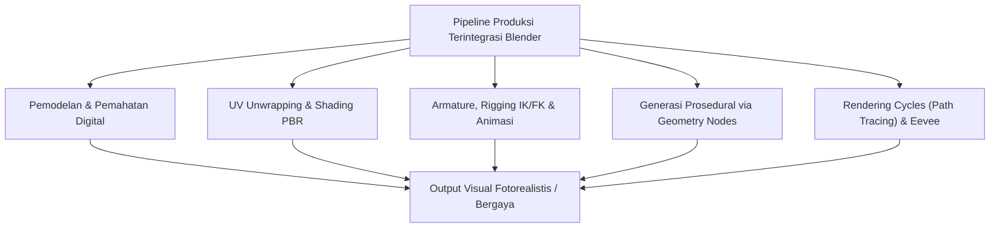
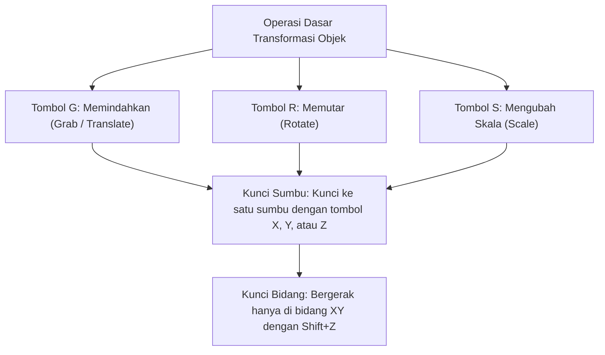
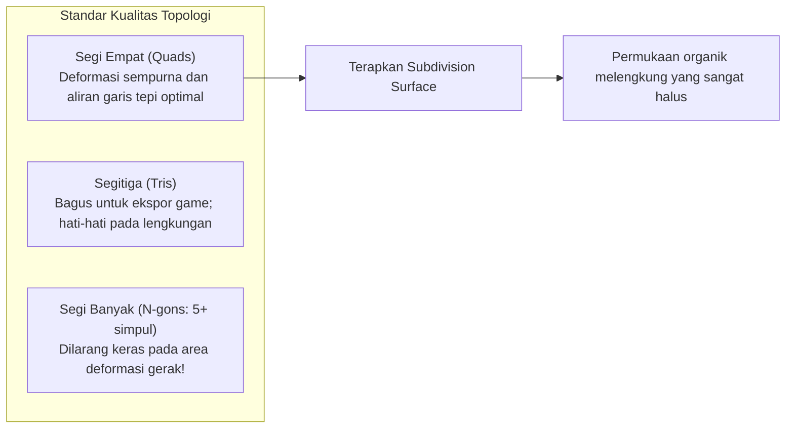
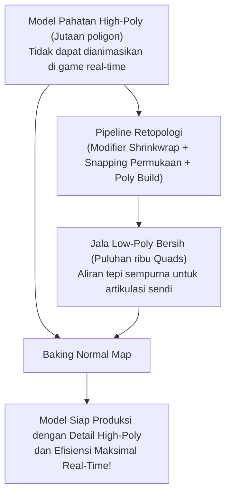
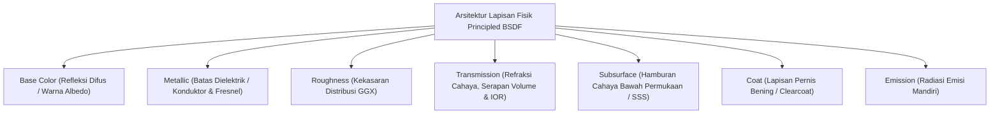
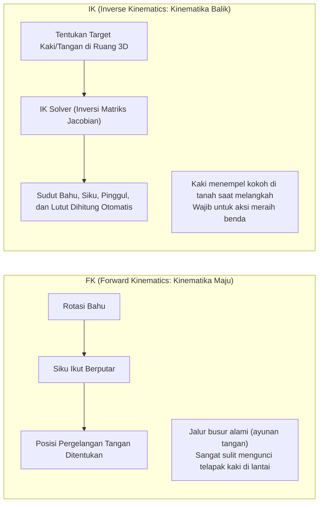
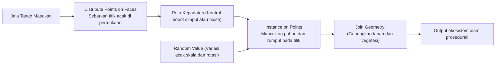
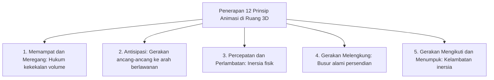
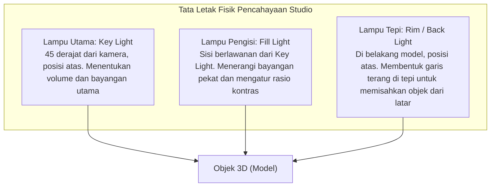

## 1. Pengantar: Blender sebagai Revolusi 3DCG Sumber Terbuka

### 1.1 Sejarah Luar Biasa Ton Roosendaal dan Blender Foundation

Lahir pada awal 1990-an sebagai alat internal di studio animasi Belanda NeoGeo, "Blender" kini telah menjelma menjadi paket perangkat lunak 3DCG sumber terbuka terkuat di dunia. Aplikasi ini menopang industri hiburan digital global, pengembangan game, efek visual (VFX) Hollywood, visualisasi arsitektur, hingga riset akademis mutakhir.

Sejarahnya sarat dengan drama dan keajaiban. Menyusul kebangkrutan NeoGeo, hak kekayaan intelektual Blender disita oleh kreditur, sehingga pengembangannya terancam dihentikan selamanya. Pada tahun 1998, sang pendiri, Ton Roosendaal, mendirikan "Blender Foundation" dan meluncurkan kampanye urun dana (crowdfunding) yang belum pernah terjadi sebelumnya. Berhasil menghimpun donasi sebesar 100.000 euro dari para kreator di seluruh dunia, ia membeli kembali kode sumber dari tangan kreditur. Pada 13 Oktober 2002, Blender secara resmi dilepaskan ke seluruh dunia sebagai perangkat lunak bebas di bawah lisensi GNU General Public License (GPL).

Ketika perangkat lunak komersial mahal (seperti Maya, 3ds Max, dan Cinema 4D) membebankan biaya langganan ribuan dolar setiap tahun, Blender tetap setia pada prinsip luhurnya: **"Tidak mengecualikan siapa pun; menyediakan alat kreasi terbaik bagi semua seniman di seluruh dunia secara cuma-cuma, untuk selamanya."**



---

### 1.2 Perombakan Besar UI pada Versi 2.80 dan Pencapaian Standar Industri di Era 4.x

Selama bertahun-tahun, Blender sering dihindari oleh seniman profesional karena antarmuka penggunanya yang sangat unik dan membingungkan, terutama kebiasaan seleksi menggunakan klik kanan mouse.

Namun, perilisan "Blender 2.80" pada tahun 2019 memicu pergeseran paradigma luar biasa di industri grafis komputer: antarmuka dirombak total, seleksi klik kiri distandardisasi, dan mesin viewport PBR real-time "Eevee" diperkenalkan. Raksasa teknologi dunia seperti Epic Games (Unreal Engine), Ubisoft, Unity, NVIDIA, AMD, Apple, Microsoft, dan Amazon berbondong-bondong mendanai Blender Development Fund sebagai Patron Korporat.

Kini, pada generasi "Blender 4.x", adopsi manajemen warna AgX secara bawaan, fitur Light Linking (penautan cahaya), pembaruan fisik Principled BSDF v2, serta lonjakan kapabilitas Geometry Nodes telah mengukuhkan Blender sebagai perangkat lunak utama dalam pipeline studio komersial kelas dunia.

---

## 2. Arsitektur Fundamental, Antarmuka, dan Filosofi Pintasan

Hambatan terbesar saat pertama kali mempelajari Blender — yang sekaligus menjadi kunci kecepatan kerja yang tak tertandingi oleh perangkat lunak CG lain setelah dikuasai — terletak pada "antarmukanya yang sangat optimal dan digerakkan oleh pintasan keyboard".

### 2.1 Sistem Koordinat Geometris dan Transformasi dalam Ruang 3D

Ruang virtual tiga dimensi Blender didefinisikan oleh sistem koordinat Kartesius ortogonal (sumbu $X$: Kiri/Kanan / Merah, sumbu $Y$: Depan/Belakang / Hijau, sumbu $Z$: Atas/Bawah / Biru), mengikuti aturan tangan kanan.



- **Mode Sistem Koordinat**:
  - **Global**: Orientasi arah mutlak dari seluruh dunia virtual.
  - **Local**: Koordinat relatif yang selaras dengan orientasi rotasi objek itu sendiri (menekan $Z$ dua kali akan mengunci gerak di sepanjang sumbu $Z$ lokal objek).
  - **Normal**: Sistem koordinat yang tegak lurus terhadap arah normal permukaan poligon yang dipilih.
- **Titik Pusat Transformasi (Pivot Point)**:
  - Pusat Bounding Box, Titik Median, Asal Masing-Masing (Individual Origins), Elemen Aktif, dan yang paling penting **"Kursor 3D (3D Cursor)"**.
  - Kursor 3D (dapat ditempatkan di mana saja dalam ruang 3D melalui Shift + Klik Kanan) berfungsi sebagai pusat rotasi atau titik kemunculan objek baru, memungkinkan alur kerja secepat kilat khas Blender.

---

### 2.2 Delapan Pintasan Utama dalam Mode Edit (Edit Mode)

Memilih objek dan menekan tombol `Tab` akan memindahkan Anda dari Mode Objek (mengatur objek secara utuh) ke Mode Edit (mengedit geometri poligon secara langsung). Fondasi pemodelan poligon bertumpu pada delapan pintasan utama berikut:

| Pintasan | Operasi | Mekanisme Internal & Opsi Praktis |
| :---: | :--- | :--- |
| **`E`** | **Ekstrusi (Extrude)** | Menarik permukaan (face), tepi (edge), atau simpul (vertex) yang dipilih sepanjang normalnya untuk membentuk geometri baru. `Alt + E` membuka menu ekstrusi individual atau sepanjang normal. |
| **`I`** | **Sisipkan Permukaan (Inset)** | Membuat permukaan baru konsentris di dalam seleksi dengan margin offset yang merata. Alat dasar untuk membuat bingkai dan panel. |
| **`Ctrl + B`** | **Bevel** | Memangkas tepi tajam secara miring. Memutar roda mouse menambah segmen untuk menghasilkan lengkungan halus. Tombol `V` beralih ke bevel simpul. |
| **`Ctrl + R`** | **Potongan Melingkar (Loop Cut)** | Menyisipkan loop tepi kontinu yang melintasi topologi empat sisi pada jala. Scroll mouse menambah jumlah potongan; klik kiri memungkinkan penggeseran. |
| **`K`** | **Pisau (Knife)** | Memotong dan membelah poligon secara bebas menggunakan garis lurus langsung di atas permukaan. `C` mengunci sudut; `Z` memotong tembus hingga ke geometri belakang. |
| **`Alt + M` / `M`** | **Gabungkan (Merge)** | Menggabungkan beberapa simpul terpilih menjadi satu titik ("Di Tengah", "Di Kursor", "Di Pertama/Terakhir"). Fitur Auto Merge menggabungkan simpul yang berdekatan secara otomatis. |
| **`GG`** | **Geser Simpul / Tepi (Slide)** | Menekan `G` dua kali dengan cepat memungkinkan Anda menggeser simpul atau tepi di sepanjang jalur tepi di dekatnya tanpa merusak kelengkungan permukaan. |
| **`F`** | **Buat Tepi / Permukaan (Make Edge/Face)** | Menghubungkan dua simpul dengan sebuah tepi, atau menutup tiga atau lebih simpul/tepi menjadi sebuah permukaan poligon tertutup. |

---

## 3. Pemodelan Poligon dan Puncak Permukaan Subdivisi

### 3.1 Aturan Dasar Topologi dan Supremasi Mutlak Poligon Empat Sisi (Quads)

Dalam pemodelan poligon 3D, permukaan dikelompokkan menjadi tiga jenis berdasarkan jumlah simpulnya:
1. **Segitiga (Tris: 3 simpul)**: Selalu planar dan menjadi standar pemrosesan pada game engine real-time, tetapi rentan menimbulkan kerutan yang tidak diinginkan (pinching) saat diterapkan algoritma subdivisi atau animasi skeletal.
2. **Segi Empat (Quads: 4 simpul)**: **Standar emas mutlak dalam industri produksi profesional**. Aliran garis tepi (Edge Flow) mengalir secara teratur dan membelah secara sempurna di bawah algoritma penghalusan subdivisi.
3. **Segi Banyak (N-gons: 5 simpul atau lebih)**: Kecuali pada permukaan datar sempurna pada tahap awal, **membiarkan N-gon pada permukaan melengkung atau area artikulasi gerak adalah pantangan keras**. Algoritma kelengkungan tidak dapat menentukan pembagian internal secara konsisten, sehingga menghasilkan noda hitam dan cacat shading pada render.

Selain itu, simpul tempat bertemunya 5 tepi atau lebih (E-pole) atau hanya 3 tepi (N-pole) bertindak sebagai simpul pengalih arah aliran tepi (Pole). Menjauhkan pole dari sumbu tekukan sendi dan area otot ekspresi wajah adalah tolok ukur keahlian seorang pemodel 3D.



---

### 3.2 Matematika Permukaan Subdivisi: Metode Catmull-Clark

Bentuk karakter film yang mulus dan bodi mobil yang aerodinamis dihasilkan dengan menerapkan modifier **"Subdivision Surface"** (`Ctrl + 1~3`) pada model dasar berkepadatan rendah.

Algoritma subdivisi Catmull-Clark, yang dirumuskan pada tahun 1978 oleh Edwin Catmull dan Jim Clark, menghitung tiga koordinat geometris utama pada setiap langkah pembagian:

1. **Titik Permukaan (Face Point)**: Rata-rata dari semua simpul yang menyusun permukaan:
   $$F = \frac{1}{n} \sum_{i=1}^n V_i$$
2. **Titik Tepi (Edge Point)**: Rata-rata dari dua ujung simpul tepi dan titik permukaan dari dua permukaan yang berbagi tepi tersebut:
   $$E = \frac{V_1 + V_2 + F_1 + F_2}{4}$$
3. **Titik Simpul Baru (Vertex Point)**: Untuk simpul awal $V$, koordinat barunya $V'$ dihitung dengan menggabungkan rata-rata titik permukaan sekitar $Q$, rata-rata titik tengah tepi sekitar $R$, dan simpul itu sendiri dengan valensi $n$:
   $$V' = \frac{Q + 2R + (n-3)V}{n}$$

Dengan menerapkan algoritma ini secara berulang, jala poligon bersudut kasar akan memusat secara matematis menuju permukaan limit B-spline kubik yang sangat halus dan kontinu.

#### Garis Penahan dan Loop Pendukung (Holding / Support Loops)
Untuk mempertahankan ketajaman sudut saat subdivisi diterapkan, letakkan **loop pendukung (support loops)** sangat dekat dengan tepi struktural utama. Semakin rapat jarak antar tepi paralel, semakin terbatas efek pembulatan Catmull-Clark, menghasilkan pantulan cahaya tajam khas logam atau plastik cetak (dapat juga diatur via pembobotan Crease).

---

### 3.3 Alur Kerja Non-Destruktif Tumpukan Modifier (Modifier Stack)

Keunggulan utama pemodelan di Blender berakar pada **Tumpukan Modifier (Modifier Stack)**, yang memungkinkan penerapan transformasi geometris parametrik secara real-time tanpa mengubah atau merusak data jala dasar secara permanen.

| Modifier | Kategori | Mekanisme & Praktik Industri Terbaik |
| :--- | :---: | :--- |
| **Mirror** | Generate | Menduplikasi jala secara simetris di sepanjang sumbu (biasanya X). Opsi "Clipping" menyatukan simpul pada garis tengah tanpa celah. Dasar pemodelan karakter dan kendaraan. |
| **Array** | Generate | Menggandakan geometri secara berulang berdasarkan jarak offset tetap atau rotasi objek (Object Offset). Cocok untuk tangga, rantai, pagar, dan susunan baut melingkar. |
| **Boolean** | Generate | Menjalankan operasi himpunan padat (Union, Difference, Intersect). Menyediakan mesin solver Exact dan Fast. Membuka lubang dan rongga secara instan pada hard-surface. |
| **Solidify** | Generate | Memberikan ketebalan dinding seragam sepanjang normal pada permukaan tipis tanpa volume. Sangat penting untuk pakaian, botol kaca, dan pelat bodi mobil. |
| **Bevel** | Edit | Memangkas sudut tajam secara non-destruktif berdasarkan bobot atau sudut ambang ($\ge 30^\circ$). Menghasilkan pantulan tepi yang realistis tanpa membebani poligon. |
| **Weighted Normal** | Modify | Menghitung ulang normal simpul dengan memprioritaskan permukaan datar lebar dibandingkan bevel kecil. Menghilangkan artefak shading pada permukaan datar low-poly tanpa Subsurf. |

---

## 4. Pemahatan Digital dan Retopologi

"Mode Pahat (Sculpt Mode)" menghadirkan pendekatan intuitif layaknya memanipulasi tanah liat digital, sangat cocok untuk anatomi makhluk hidup, tubuh manusia, dan lipatan kain.

### 4.1 Kuas Utama Pemahatan dan Karakteristiknya

- **Draw**: Menaikkan permukaan sepanjang arah normal; menahan `Ctrl` akan mengukir ke dalam.
- **Clay Strips**: Mengoleskan lempengan tanah liat persegi untuk membentuk struktur tulang dan massa otot utama dengan cepat.
- **Grab**: Menarik area jala yang luas untuk mengubah siluet dan proporsi tubuh secara dramatis.
- **Crease**: Mengukir lipatan sempit yang dalam dan tajam, penting untuk kerutan kulit dan lipatan kain.
- **Smooth**: Menghaluskan permukaan yang tidak rata (dapat dipanggil dari kuas apa pun dengan menahan `Shift`).
- **Inflate**: Mengembangkan area terpilih ke arah luar normalnya seperti balon udara.

---

### 4.2 Topologi Dinamis (Dyntopo) vs. Voxel Remesh

Saat memahat model ultra-detail yang mencapai jutaan poligon, manajemen kepadatan geometri menjadi kunci utama.

1. **Topologi Dinamis (Dyntopo)**:
   - Secara adaptif membagi dan menambahkan poligon segitiga hanya di area yang tersapu oleh goresan kuas secara langsung.
   - Memungkinkan pembuatan detail mikro (mata, kuku, telinga) tanpa menambah beban poligon di area tubuh lainnya.
2. **Remesh Voxel (Voxel Remesh: `Ctrl + R`)**:
   - Membagi ruang 3D menjadi kisi voxel kubik seragam (misalnya $0,01\,\text{m}$), merekonstruksi seluruh model menjadi kisi poligon segi empat yang homogen.
   - Menyatukan sambungan komponen terpisah hasil operasi Boolean secara instan, melenyapkan poligon yang melar, dan mengembalikan jala menjadi blok tanah liat yang seragam.

---

### 4.3 Teori dan Praktik Retopologi

Model hasil pahatan berkualitas tinggi (berisi jutaan hingga puluhan juta poligon) membawa data yang terlalu berat untuk digunakan di game engine atau digerakkan oleh tulang animasi.

**"Retopologi"** adalah proses membangun kembali jala segi empat yang bersih dan optimal (berkisar antara ribuan hingga puluhan ribu face) yang menempel tepat pada permukaan pahatan beresolusi tinggi dengan aliran tepi anatomi yang benar.



1. Aktifkan modifier **Shrinkwrap** bersamaan dengan snapping permukaan (**Face Project**).
2. Buat loop melingkar konsentris di sekitar area dengan deformasi ekspresif tinggi (kelopak mata, bibir, hidung).
3. Sambungkan aliran tepi dari rahang menuju leher dan bahu; pasang tiga cincin tepi pelindung pada siku dan lutut agar volume tidak kempis saat ditekuk.
4. Setelah selesai, pori-pori dan kerutan mikro dari high-poly dipindahkan ke model low-poly melalui pemanggangan tekstur menjadi **Normal Map**.

---

## 5. Shading Material dan Sains Rendering Berbasis Fisika (PBR)

Pembuatan material di Blender berpusat pada Shader Editor berbasis node. Standar industri modern, "PBR (Physically Based Rendering)", menyimulasikan interaksi gelombang elektromagnetik cahaya (refleksi, refraksi, absorpsi, dan hamburan) berdasarkan hukum fisika optik.

### 5.1 Analisis Matematis Principled BSDF v2

Shader universal utama Blender, "Principled BSDF", mengadopsi model Disney Principled BRDF tahun 2012 yang disempurnakan pada Blender 4.0 demi menjaga hukum kekekalan energi permukaan mikro secara ketat.



1. **Base Color (Warna Dasar / Albedo)**:
   - Untuk isolator (dielektrik): Warna cahaya pantulan difus yang menembus lapisan luar, mengalami hamburan di dalam material, dan keluar kembali.
   - Untuk logam (konduktor): Cahaya yang masuk langsung diserap oleh elektron bebas, sehingga pantulan difus bernilai nol. Base Color secara langsung menentukan warna pantulan spekular pada sudut tegak lurus ($F_0$) (emas berwarna kuning berkilau, tembaga berwarna kemerahan).
2. **Metallic ($0.0 \sim 1.0$)**:
   - Di alam fisik, materi bersifat biner: **non-logam (dielektrik: Metallic = 0.0)** atau **logam murni (konduktor: Metallic = 1.0)**. Nilai di antaranya (seperti 0.5) tidak eksis secara fisik, kecuali pada permukaan transisi berdebu atau berkarat.
3. **Roughness (Kekasaran Permukaan)**:
   - Mengatur dispersi fungsi distribusi normal mikropermukaan GGX.
   - $0.0$: Cermin pantul sempurna.
   - $1.0$: Permukaan sangat kasar di mana cahaya tersebar ke segala arah secara seragam, seperti kapur atau tanah liat kering.
4. **IOR (Indeks Bias / Index of Refraction)**:
   - Menentukan pembiasan cahaya menurut Hukum Snellius ($n_1 \sin \theta_1 = n_2 \sin \theta_2$).
   - Udara: $1.0003$, Air: $1.333$, Akrilik: $1.49$, Kaca jendela: $1.52$, Berlian: $2.417$.
5. **Subsurface Scattering (SSS / Hamburan Bawah Permukaan)**:
   - Fenomena optik pada medium semi-transparan (kulit manusia, marmer, lilin, susu, giok) di mana foton menembus permukaan, bertumbukan di dalam, lalu memancar keluar di lokasi sekitar.
   - Kulit manusia menyerap cahaya biru di lapisan luar, sementara gelombang merah menembus lebih dalam melalui hemoglobin, menciptakan pendaran merah khas pada daun telinga dan ujung jari saat terkena cahaya dari belakang (diatur via radius Subsurface Radius kanal RGB).

---

### 5.2 UV Unwrapping dan Kerapatan Teksel (Texel Density)

Untuk memproyeksikan tekstur gambar 2D (warna, kekasaran, peta normal) ke permukaan model 3D tanpa distorsi, jala harus dihamparkan mendatar seperti pola pakaian melalui **"UV Unwrapping"**.

- **Penempatan Jahitan (Seams)**:
  - Pintasan `Ctrl + E` $\rightarrow$ "Mark Seam (Tandai Jahitan)".
  - Layaknya menjahit busana, tempatkan garis jahitan di area yang tersembunyi dari pandangan kamera (pangkal paha dalam, garis rambut, punggung).
- **Standardisasi Kerapatan Teksel (Texel Density)**:
  - Jumlah piksel tekstur yang dialokasikan untuk setiap unit panjang fisik ruang 3D (misalnya $\text{px/cm}$).
  - Jika area wajah memiliki kerapatan $20,48\,\text{px/cm}$ sedangkan badan hanya $2,56\,\text{px/cm}$, akan timbul ketimpangan resolusi yang sangat mengganggu. Seluruh pulau UV harus diskalakan seragam dan dipadatkan secara efisien dalam ruang $[0, 1]$.

---

## 6. Rigging Armature dan Dinamika Animasi

Rigging adalah seni rekayasa untuk menyusun struktur hierarki tulang internal ("Armature") yang memungkinkan model 3D statis dapat digerakkan dan berdeformasi secara meyakinkan.

### 6.1 Konflik Matematis: Kinematika Maju (FK) vs. Kinematika Balik (IK)

Pengendalian anggota tubuh karakter didasarkan pada dua paradigma matematis yang saling melengkapi:



- **FK (Forward Kinematics)**: Rotasi diteruskan secara hierarkis dari tulang induk ke tulang anak. Sangat baik untuk gerakan bebas di udara (melambaikan tangan atau mengayun pedang), tetapi merepotkan saat kaki harus menapak di lantai: ketika pinggul diturunkan, kaki akan menembus lantai sehingga membutuhkan koreksi manual di setiap frame.
- **IK (Inverse Kinematics)**: Posisi ujung ekstremitas (pergelangan tangan atau kaki) dikunci di ruang dunia; sebuah **solver kinematika balik (seperti CCD-IK atau FABRIK)** menghitung secara otomatis sudut rotasi yang dibutuhkan oleh tulang induknya (paha, betis). Esensial untuk siklus berjalan agar kaki tetap menempel kokoh di tanah.
- **Target Kutub (Pole Target)**: Vektor pemandu arah tekukan siku atau lutut di ruang 3D, mencegah persendian berputar ke arah yang salah.

---

### 6.2 Pengecatan Bobot (Weight Painting)

Menentukan seberapa besar pengaruh rotasi tulang ($0.0 \sim 1.0$, dari biru $= 0$, hijau $= 0.5$, hingga merah $= 1.0$) terhadap deformasi simpul-simpul jala di sekitarnya.
- Agar tekukan persendian tampak alami, bagian dalam siku atau lutut memerlukan transisi bobot yang tegas, sedangkan bagian luar memerlukan gradasi halus untuk menjaga volume.
- Jumlah total pengaruh tulang pada setiap simpul harus dinormalkan ke nilai tepat $1.0$ ("Normalize All"). Mengabaikan langkah ini akan membuat jala meledak atau robek saat tulang digerakkan.

---

## 7. Revolusi Generasi Prosedural: Geometry Nodes

Sejak Blender 3.0, para technical artist terpukau oleh **"Geometry Nodes"**, sebuah paradigma pemrograman visual berbasis node yang mampu menghasilkan variasi bentuk 3D tanpa batas secara algoritmik dan real-time.

### 7.1 Arsitektur Bidang (Fields)

Geometry Nodes menggantikan pemrosesan loop elemen demi elemen yang lambat dengan model aliran data "Fields". Data yang mengalir bukanlah geometri statis semata, melainkan fungsi matematika yang dievaluasi serentak di seluruh konteks geometri.



### 7.2 Contoh Nyata: Pembuatan Hutan Prosedural dengan Geometry Nodes

1. Masukkan jala permukaan tanah melalui `Group Input`.
2. **Distribute Points on Faces**: Buat sebaran titik acak di permukaan menggunakan metode Poisson Disk untuk menjaga jarak aman minimum antar pohon.
3. Hubungkan node **Noise Texture** ke soket kerapatan (`Density`) untuk membedakan antara rumpun hutan lebat dan lapangan terbuka secara alami.
4. **Instance on Points**: Tautkan koleksi model pohon (`Collection Info`) untuk dimunculkan pada titik-titik tersebut secara acak.
5. **Rotate Instances / Scale Instances**: Hubungkan node **Random Value** untuk mengacak rotasi sumbu $Z$ ($0 \sim 2\pi$) dan memvariasikan skala antara $0.7$ hingga $1.3$ dengan distribusi normal.
6. Sekarang, setiap perubahan bentuk tanah pada Mode Edit akan memperbarui posisi seluruh vegetasi secara real-time dan parametrik.

Melalui **"Simulation Nodes"**, simulasi rumput bergoyang tertiup angin, butiran pasir yang jatuh akibat gravitasi, tetesan hujan, hingga dinamika fluida ringan dapat dikerjakan seluruhnya di dalam Geometry Nodes.

---

## 8. Fisika Mesin Render: Cycles vs. Eevee Next

Blender mengintegrasikan dua mesin render mutakhir yang dirancang untuk kebutuhan produksi berbeda.

### 8.1 Cycles: Fisika Path Tracing Monte Carlo

Cycles adalah mesin render produksi berbasis fisik tanpa bias (Unbiased Path Tracing) yang menyimulasikan perambatan cahaya secara akurat.

Mesin ini menembakkan sinar virtual dari sensor kamera ke dalam adegan, menghitung ribuan pantulan stokastik berdasarkan fungsi BSDF material menggunakan integrasi Monte Carlo:

$$L_o(p, \omega_o) = L_e(p, \omega_o) + \int_{\Omega} f_r(p, \omega_i, \omega_o) L_i(p, \omega_i) (\omega_i \cdot n) d\omega_i$$

- Dengan menyelesaikan **Persamaan Rendering Kajiya**, pencahayaan global (GI), pembiasan warna (color bleeding: dinding merah yang membiaskan rona hangat ke lantai putih di dekatnya), refraksi kaca realistis, kaustik, dan bayangan lembut hadir secara alami tanpa trik rekayasa rasterisasi.
- **Pembersihan Derau Berbasis AI (Denoising)**: Derau acak bawaan path tracing dihilangkan seketika oleh jaringan syaraf tiruan (Intel Open Image Denoise / NVIDIA OptiX), menghasilkan gambar bersih dan tajam bahkan pada jumlah sampel yang relatif rendah (128 hingga 512 sampel).

---

### 8.2 Eevee Next: Batas Terdepan Rasterisasi Real-Time

Untuk alur kerja interaktif yang menuntut puluhan frame per detik di viewport, "Eevee" menjadi solusi utama.
Arsitektur "Eevee Next" menyempurnakan pantulan ruang layar (Screen Space Reflections: SSR), meniadakan batasan resolusi peta bayangan melalui Virtual Shadow Maps (VSM), serta mengintegrasikan hamburan bawah permukaan ruang layar dan oklusi ambien GTAO, memberikan hasil visual mendekati Cycles dalam hitungan detik.

---

### 8.3 Manajemen Warna: Ilmu di Balik AgX

Ditetapkan sebagai standar utama di Blender 4.0, sistem manajemen warna **"AgX"** mengatasi masalah perubahan warna abnormal dan saturasi berlebih yang merusak profil lawas sRGB dan Filmic pada area sorotan cahaya tinggi.

Dengan meniru kepekaan spektral sel kerucut retina manusia dan kurva logaritmik (Log) film seluloid, AgX mempertahankan kemurnian rona warna (Hue) meskipun dalam pencahayaan sangat terang melalui roll-off kecerahan yang mulus. Api membara, lampu neon, dan kulit yang disinari terik matahari terender dengan kedalaman dinamis layaknya film layar lebar.

---

## 6.4 Nyawa Animasi: Penerapan 3D dari 12 Prinsip Disney dan Kurva-F

Hanya menaruh keyframe (`I`) pada tulang akan menghasilkan gerakan kaku layaknya robot yang jatuh ke dalam lembah keanehan (Uncanny Valley). Menghidupkan karakter membutuhkan penerapan **"12 Prinsip Dasar Animasi"** — yang dirumuskan pada 1930-an oleh para animator legendaris Walt Disney ("Nine Old Men") — ke dalam kurva numerik di Graph Editor Blender.



### 1. Kekekalan Volume pada Squash and Stretch
Saat bola memantul menghantam tanah, bentuknya memipih (Squash); saat melenting ke atas, bentuknya memanjang mengikuti arah gerak (Stretch).
- **Hukum Fisika Mutlak**: Selama deformasi berlangsung, **total volume objek harus selalu konstan**.
- Jika sumbu $Z$ menyusut menjadi $0.5$, sumbu $X$ dan $Y$ harus mengembang sebesar $\sqrt{1 / 0.5} \approx 1.414$ kali untuk menjaga massa. Di Blender, pembatas tulang (bone constraint) "Stretch To" dapat mengotomatisasi kompensasi volume ini.

### 2. Graph Editor dan Dinamika Interpolasi Kurva Bézier Kubik
Graph Editor memvisualisasikan perubahan nilai transformasi terhadap waktu dalam bentuk kurva dua dimensi ("F-Curves").
- **Interpolasi Linier**: Menghasilkan gerakan berkecepatan konstan yang kaku dan mekanis.
- **Interpolasi Bézier**: Menyesuaikan tuas kurva menghasilkan akselerasi halus saat mulai (Ease-In) dan deselerasi anggun sebelum berhenti (Ease-Out) berbasis polinomial kubik.
- Dalam siklus berjalan (Walk Cycle), menggeser selisih fase ayunan pinggul, langkah kaki, dan ayunan tangan sebanyak beberapa frame (Overlapping Action) mampu mereplikasi perpindahan pusat gravitasi manusia secara meyakinkan.

---

## 7.5 Otomatisasi Skrip Prosedural dengan Python API (`bpy`)

Kekuatan arsitektur terbesar Blender adalah keterbukaan seluruh fungsi, struktur data, dan elemen antarmuka terhadap bahasa "Python". Mengarahkan kursor mouse ke tombol apa pun di layar akan langsung menampilkan jalur properti Python di baliknya.

Di ruang kerja `Scripting`, skrip Python dapat dijalankan untuk memodelkan bentuk matematika rumit dalam hitungan detik.

### Skrip Python: Generasi Prosedural Pita Möbius
```python
import bpy
import math

# Bersihkan objek jala yang ada di dalam adegan
bpy.ops.object.select_all(action='SELECT')
bpy.ops.object.delete()

# Parameter geometris pita Möbius
R = 3.0           # Radius utama
w = 1.0           # Setengah lebar pita
u_segments = 120  # Resolusi keliling melingkar
v_segments = 20   # Resolusi arah lebar

verts = []
faces = []

for i in range(u_segments):
    u = 2.0 * math.pi * i / u_segments
    for j in range(v_segments + 1):
        v = -w + (2.0 * w * j / v_segments)
        
        # Persamaan parametrik pita Möbius
        x = (R + v * math.cos(u / 2.0)) * math.cos(u)
        y = (R + v * math.cos(u / 2.0)) * math.sin(u)
        z = v * math.sin(u / 2.0)
        
        verts.append((x, y, z))

# Pembuatan indeks permukaan poligon
for i in range(u_segments):
    next_i = (i + 1) % u_segments
    for j in range(v_segments):
        p1 = i * (v_segments + 1) + j
        p2 = i * (v_segments + 1) + (j + 1)
        
        # Pembalikan topologi saat penutupan lingkaran (setengah puntiran)
        if next_i == 0:
            p3 = next_i * (v_segments + 1) + (v_segments - (j + 1))
            p4 = next_i * (v_segments + 1) + (v_segments - j)
        else:
            p3 = next_i * (v_segments + 1) + (j + 1)
            p4 = next_i * (v_segments + 1) + j
            
        faces.append((p1, p2, p3, p4))

# Buat jala baru dan tautkan objek ke dalam koleksi adegan
mesh = bpy.data.meshes.new(name="Mobius_Strip_Mesh")
mesh.from_pydata(verts, [], faces)
mesh.update()

obj = bpy.data.objects.new(name="Mobius_Strip", object_data=mesh)
bpy.context.collection.objects.link(obj)

# Aktifkan bayangan halus (Smooth Shading)
for poly in mesh.polygons:
    poly.use_smooth = True
```

Melalui Python API (`bpy`), Blender melampaui perannya sebagai alat seni visual konvensional, bertransformasi menjadi platform ilmiah dan industri untuk desain arsitektur parametrik, rekonstruksi tomografi 3D medis, hingga rendering batch kumpulan data sintetis (Synthetic Datasets) untuk kecerdasan buatan.

---

## 8.4 Fisika Pencahayaan Studio dan Seni Kompositing

Sebagus apa pun topologi model dan seakurat apa pun shader PBR-nya, pencahayaan yang amatir akan membuat karya terlihat datar dan artifisial.

### 1. Menguasai Pencahayaan Tiga Titik Klasik (Three-Point Lighting)
Skema standar untuk menonjolkan bentuk, kedalaman, dan tekstur objek tiga dimensi:



- **Rasio Kontras (Key ke Fill)**:
  - Gaya komersial / ceria: $2:1 \sim 3:1$ (Adegan terang merata dengan bayangan tipis).
  - Gaya dramatis / Film Noir: $8:1 \sim 16:1$ (Bayangan pekat dan kontras tajam).
- **Ukuran Sumber Cahaya dan Penumbra Bayangan**:
  - Sumber cahaya titik dengan radius mendekati nol menghasilkan bayangan tajam dan tegas (Hard Shadows).
  - Memperbesar dimensi fisik emitor (Softbox, Area Light) membuat cahaya menyelimuti tepi objek, menciptakan gradasi bayangan lembut (Soft Shadows).

### 2. Pasca-Produksi Sinematik di Compositor
Hasil render mentah ibarat lembaran klise negatif digital. Node Compositor di Blender memberikan sentuhan akhir setingkat film bioskop:

1. **Node Glare**: Dalam mode "Fog Glow", menambahkan pendaran atmosferik (Bloom) pada area yang sangat terang; mode "Streaks" menghasilkan kilau lensa horizontal khas lensa anamorfik.
2. **Kedalaman Ruang (Depth of Field)**: Menyesuaikan panjang fokus kamera dan bukaan diafragma (F-Stop) untuk menghasilkan keburaman optik (Bokeh) alami, mengarahkan fokus mata penonton ke objek utama.
3. **Penyimpangan Lensa dan Dispersi (Lens Distortion & Dispersion)**: Nilai dispersi kecil ($0.01 \sim 0.02$) memisahkan spektrum RGB di pinggiran bingkai, menghapus kesan steril digital komputer dan menghadirkan kehangatan lensa optik fisik.

---

## 8.5 Dinamika Sistem Simulasi Fisika

Blender memuat mesin komputasi numerik terintegrasi untuk menyimulasikan hukum fisika klasik:

1. **Dinamika Benda Tegar (Rigid Body)**:
   - Menghitung benturan, pantulan, gesekan, dan runtuhan domino sesuai mekanika Newton.
   - Tetapkan objek sebagai "Active" (dinamis terkena gaya) atau "Passive" (statis sebagai penahan), dengan bentuk tabrakan dari "Convex Hull" hingga "Mesh" presisi.
2. **Simulasi Kain (Cloth)**:
   - Memodelkan pakaian, kain, dan bendera melalui sistem pegas-massa (Mass-Spring System).
   - Mengatur kekakuan struktur, ketahanan tekuk, hambatan udara, serta mengaktifkan "Self-Collision" guna mencegah kain menembus dirinya sendiri.
3. **Dinamika Fluida dan Asap (Mantaflow)**:
   - Perhitungan hidrodinamika berakurasi tinggi berdasarkan persamaan Navier-Stokes.
   - Memanggang (Bake) cipratan cairan, lidah api pembakaran, dan turbulensi asap (Vorticity) di dalam volume domain voxel.

---

## 9. Kesimpulan: Masa Depan Kreator 3D dan Cakrawala Baru Bersama Blender

Menjelajahi Blender adalah perjalanan multidisipliner tempat bertemunya matematika, optika, anatomi, teori warna, dan cita rasa seni murni dalam satu kesatuan harmonis.

Dimulai dari menghapus Kubus Bawaan (Default Cube) dan mengekstrusi simpul pertama:
- Subdivisi Catmull-Clark memahat bentuk kehidupan organik yang ekspresif;
- Node shader fisik mengabadikan drama interaksi cahaya pada materi;
- Armature dan kinematika meniupkan napas kehidupan pada gerak tubuh;
- Geometry Nodes membangun bentang alam tak terhingga secara algoritmik;
- Dan path tracing Cycles merekam perjalanan miliaran foton menjadi karya fotorealistis yang memukau.

Dunia 3DCG yang dahulunya merupakan hak istimewa workstation berharga ratusan juta rupiah di studio Hollywood kini telah bebas diakses oleh siapa saja yang memiliki komputer dan Blender.

"Apa pun yang dapat Anda bayangkan, dapat Anda wujudkan menjadi nyata."
Dengan sayap kebebasan yang diberikan oleh Blender, para kreator berdiri di hadapan kosmos penciptaan tak terbatas, di mana batas akhirnya hanyalah imajinasi mereka sendiri.
