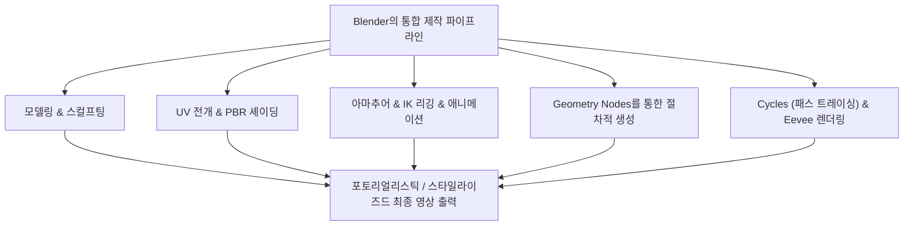
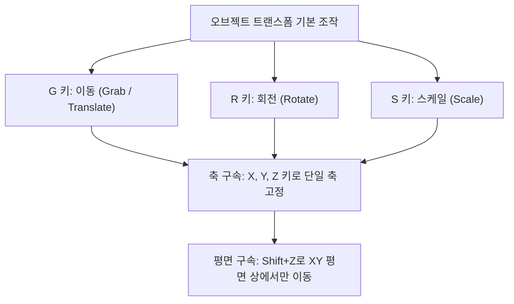
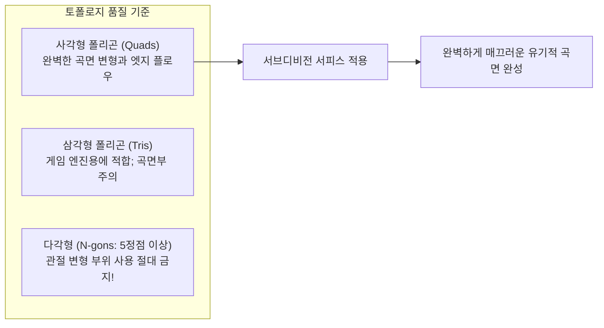
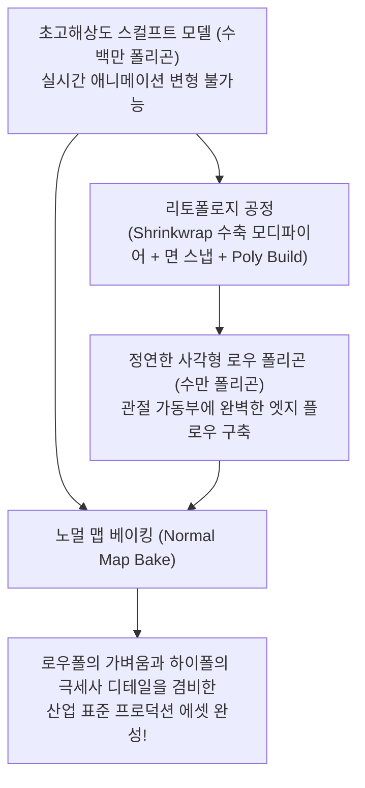
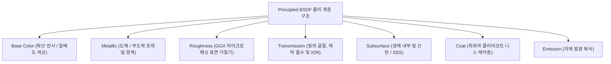
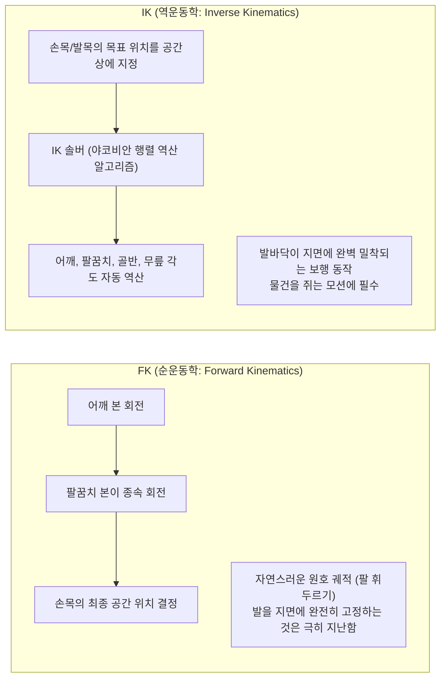
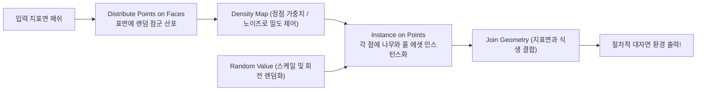
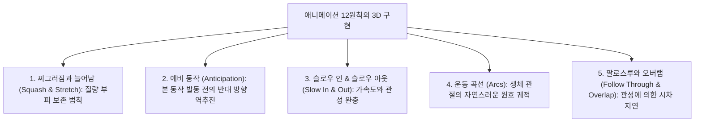
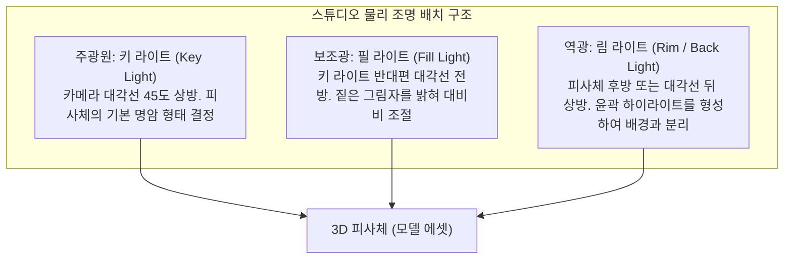

## 1. 서론: 오픈 소스 3DCG 혁명으로서의 Blender

### 1.1 톤 로센달과 Blender 재단의 기적 같은 역사

1990년대 초 네덜란드의 애니메이션 스튜디오 NeoGeo의 사내 툴로 탄생한 "Blender"는 오늘날 전 세계 디지털 엔터테인먼트 산업, 게임 개발, 할리우드 VFX, 건축 시각화, 학술 연구의 근간을 지탱하는 세계 최강의 오픈 소스 3DCG 소프트웨어로 진화했다.

그 역사는 실로 드라마틱한 기적으로 가득 차 있다. NeoGeo의 파산과 함께 Blender의 지적재산권은 채권자들에게 압류되었고, 개발이 영구 중단될 위기에 처했다. 1998년, 창립자 톤 로센달(Ton Roosendaal)은 "Blender 재단(Blender Foundation)"을 설립하고 전례 없는 크라우드 펀딩 캠페인을 전개했다. 전 세계 크리에이터들로부터 10만 유로의 기부금을 모아 채권자들로부터 소스 코드를 되샀으며, 2002년 10월 13일 GNU 일반 공중 사용 허가서(GPL) 하에 Blender를 전 세계에 완전한 오픈 소스로 전격 공개했다.

고가의 상용 소프트웨어(Maya, 3ds Max, Cinema 4D 등)가 연간 수백만 원의 구독료를 부과하는 가운데, Blender는 **"누구도 배제하지 않으며, 전 세계 모든 아티스트에게 최고봉의 제작 도구를 영원히 무료로 제공한다"** 는 숭고한 이념을 굳건히 지켜오고 있다.



---

### 1.2 2.80의 UI 대혁신과 4.x 세대에서의 업계 표준 도달

오랜 기간 Blender는 "우클릭 선택"을 비롯한 지극히 독특하고 난해한 사용자 인터페이스(UI)로 인해 주류 상업 아티스트들로부터 외면받기 일쑤였다.

그러나 2019년에 출시된 "Blender 2.80"은 UI 전면 개편, 좌클릭 선택의 표준화, 실시간 PBR 뷰포트 "Eevee"의 탑재를 통해 CG 업계에 전례 없는 지각변동을 일으켰다. Epic Games(Unreal Engine), Ubisoft, Unity, NVIDIA, AMD, Apple, Microsoft, Amazon 등 세계 정상급 테크 거인들이 앞다투어 Blender 개발 기금(Corporate Patron)에 거액의 투자를 발표했다.

그리고 현대의 "Blender 4.x" 세대에 이르러서는 AgX 컬러 매니지먼트의 기본 탑재, 라이트 링킹(Light Linking), Principled BSDF v2의 물리적 혁신, Geometry Nodes의 기능 폭발을 통해 상업 스튜디오의 메인 파이프라인으로 당당히 채택되기에 이르렀다.

---

## 2. Blender 기초 아키텍처와 UI/단축키 체계

Blender를 학습할 때 가장 큰 장벽이자, 한 번 숙달되면 다른 어떤 CG 소프트웨어보다 압도적인 작업 속도를 보장하는 핵심은 바로 "극도로 정제된 단축키 중심의 UI"이다.

### 2.1 3D 공간의 기하학적 좌표계와 트랜스폼

Blender의 가상 3차원 공간은 데카르트 직교 좌표계($X$축: 좌우/적색, $Y$축: 전후/녹색, $Z$축: 상하/청색)로 정의되며, 오른손 법칙을 따른다.



- **좌표계 전환**:
  - **글로벌 좌표(Global)**: 가상 월드 전체의 절대적인 기준 방위.
  - **로컬 좌표(Local)**: 오브젝트 자체의 회전 방향을 기준으로 하는 상대 좌표($Z$를 두 번 누르면 로컬 $Z$축을 따라 이동).
  - **노멀 좌표(Normal)**: 선택한 메쉬 표면의 법선 방향을 기준으로 하는 좌표계.
- **피벗 포인트(변형의 중심축)**:
  - 바운딩 박스 중심, 무게중심(Median Point), 개별 원점(Individual Origins), 액티브 요소, 그리고 가장 중요한 **"3D 커서(3D Cursor)"**.
  - 3D 커서(Shift + 우클릭으로 공간 내 임의의 위치에 배치 가능)는 회전 중심이나 새로운 오브젝트 생성 기준점으로 활용되어 Blender 특유의 번개 같은 워크플로를 가능케 한다.

---

### 2.2 편집 모드(Edit Mode) 필수 8대 단축키

오브젝트를 선택하고 `Tab` 키를 누르면 전체를 다루는 '오브젝트 모드'에서 폴리곤의 기하 구조를 직접 편집하는 '편집 모드'로 진입한다. 메쉬 모델링의 핵심은 다음 8가지 단축키 조합이다:

| 단축키 | 기능명 | 내부 동작 메커니즘 및 실무 옵션 |
| :---: | :--- | :--- |
| **`E`** | **돌출 (Extrude)** | 선택한 면, 변, 정점을 법선 방향(또는 지정 축)으로 뽑아내어 새로운 폴리곤을 생성한다. `Alt + E`로 '개별 면 돌출' 및 '법선 방향 돌출' 실행 가능. |
| **`I`** | **면 삽입 (Inset)** | 선택한 면 안쪽에 일정한 오프셋 폭을 가진 동심원 형태의 새로운 면을 생성한다. 테두리 및 패널 라인 제작의 기본. |
| **`Ctrl + B`** | **베벨 (Bevel)** | 날카로운 모서리를 비스듬히 모따기한다. 마우스 휠을 굴려 세그먼트(분할 수)를 늘려 매끄러운 곡면을 형성한다. `V` 키로 정점 베벨 전환. |
| **`Ctrl + R`** | **루프 컷 (Loop Cut)** | 사각형 토폴로지를 따라 메쉬 전체를 한 바퀴 관통하는 엣지 루프를 삽입한다. 휠 조작으로 컷 수 조절, 좌클릭 후 슬라이드 이동 가능. |
| **`K`** | **나이프 툴 (Knife)** | 메쉬 표면을 자유롭게 클릭하여 임의의 직선으로 폴리곤을 직접 절단 분할한다. `C`로 각도 고정, `Z`로 뒷면 숨은 지오메트리까지 관통 절단. |
| **`Alt + M` / `M`** | **병합 (Merge)** | 선택한 여러 정점을 한 점으로 결합한다('중심에', '커서 위치에', '처음/마지막 선택 정점에'). 자동 병합(Auto Merge) 활성화 시 근접 정점 자동 결합. |
| **`GG`** | **정점/변 슬라이드** | 정점이나 변을 선택하고 `G`를 빠르게 두 번 누르면 기존 표면 경사를 엄격히 유지한 채 레일 위를 미끄러지듯 위치를 미세 조정할 수 있다. |
| **`F`** | **면 생성 (Make Edge/Face)** | 선택한 두 정점 사이에 엣지를 생성하거나, 3개 이상의 정점/엣지로 둘러싸인 폴리곤 면을 생성한다. |

---

## 3. 폴리곤 모델링과 서브디비전 서피스의 극치

### 3.1 위상수학(토폴로지) 기본 규칙과 사각형 폴리곤의 절대성

3DCG 폴리곤 모델링에서 면은 정점의 개수에 따라 세 가지로 분류된다:
1. **삼각형 폴리곤 (Tris: 3정점)**: 항상 완벽한 평면을 유지하여 실시간 게임 엔진의 최종 출력에 기본 사용되지만, 곡면 세분화 및 스켈레탈 변형 애니메이션에서 원치 않는 찌그러짐(Pinching)을 유발하기 쉽다.
2. **사각형 폴리곤 (Quads: 4정점)**: **전문적인 프로덕션 모델링의 절대적인 표준**. 엣지 플로우(Edge Flow)가 정연하게 흐르며, 서브디비전 알고리즘 적용 시 파탄 없이 가장 유려하게 계산된다.
3. **다각형 폴리곤 (N-gons: 5정점 이상)**: 초기 평면 가공 단계를 제외하고, **곡면이나 관절 가동 부위에 N-gon을 남기는 것은 절대적인 금기(Taboo)** 이다. 세분화 알고리즘이 내부 분할 방향을 판별하지 못해 렌더링 시 치명적인 검은 얼룩과 셰이딩 아티팩트가 발생한다.

또한 단일 정점에서 5개 이상의 엣지가 뻗어나가는 점(E-폴)이나 3개만 연결된 점(N-폴)은 엣지 루프의 흐름을 전환하는 결절점(Pole)이 된다. 이러한 폴을 관절의 굽힘 축이나 안면 표정근 영역에서 배제하고, 해부학적 근육 흐름에 맞춰 유려한 토폴로지를 구축하는 것이 모델러의 핵심 역량이다.



---

### 3.2 서브디비전 서피스(Catmull-Clark 기법)의 수학적 원리

영화에 등장하는 매끄러운 캐릭터와 유선형 슈퍼카의 차체는 거친 로우 폴리곤 기본 메쉬에 **"서브디비전 서피스(Subdivision Surface) 모디파이어"**(`Ctrl + 1~3`)를 적용하여 생성된다.

Blender가 채택한 Catmull-Clark 세분화 알고리즘은 1978년 에드윈 캣멀(Edwin Catmull)과 짐 클라크(Jim Clark)가 발표한 수학적 기법으로, 매 반복 단계마다 다음 세 가지 계산을 순차적으로 수행한다:

1. **면 중심점 (Face Point)**: 해당 폴리곤 면을 구성하는 모든 정점의 무게중심을 계산한다:
   $$F = \frac{1}{n} \sum_{i=1}^n V_i$$
2. **변 중심점 (Edge Point)**: 엣지 양 끝점의 정점과 그 엣지를 공유하는 인접한 두 면의 Face Point 평균을 계산한다:
   $$E = \frac{V_1 + V_2 + F_1 + F_2}{4}$$
3. **새로운 정점 위치 (Vertex Point)**: 원래 정점 $V$에 대해 인접한 $n$개 면의 Face Point 평균 $Q$, 인접한 $n$개 엣지 중점의 평균 $R$, 그리고 정점 자체의 가중치를 조합하여 최종 수렴 위치 $V'$를 산출한다:
   $$V' = \frac{Q + 2R + (n-3)V}{n}$$

이 알고리즘을 재귀적으로 적용함으로써 각진 로우 폴리곤 메쉬는 수학적으로 엄밀한 3차 B-스플라인 극한 곡면으로 매끄럽게 수렴한다.

#### 크레스트 라인과 서포트 루프 (Holding / Support Loops)
서브디비전 서피스를 적용할 때 날카로운 기계적 모서리를 유지하려면 주 구조 엣지 바로 인접한 위치에 **"서포트 루프(보호 엣지)"** 를 배치한다. 평행한 엣지 간의 간격이 좁을수록 Catmull-Clark의 곡면 라운딩 효과가 억제되어 금속이나 플라스틱의 단단하고 선명한 하이라이트를 연출할 수 있다(Crease 주름 가중치 기능으로도 제어 가능).

---

### 3.3 모디파이어(Modifier) 스택의 비파괴적 워크플로

Blender 모델링의 진정한 백미는 원본 메쉬 데이터를 훼손(확정)하지 않고 파라메트릭하게 실시간 기하 변형을 중첩하는 **"모디파이어 스택(Modifier Stack)"** 에 있다.

| 모디파이어명 | 분류 | 동작 메커니즘 및 실무 모범 사례 |
| :--- | :---: | :--- |
| **Mirror (미러)** | 생성 | 지정 축(통상 X축)을 기준으로 선대칭 메쉬를 실시간 자동 생성. "Clipping"을 켜면 중앙 접합면 정점이 틈새 없이 완벽 결합됨. 캐릭터 및 차량 모델링의 필수 기초. |
| **Array (배열)** | 생성 | 일정한 오프셋 거리나 오브젝트 오프셋(Object Offset) 회전을 기반으로 동일 지오메트리를 대량 복제. 계단, 사슬, 울타리, 원형 볼트 배열 등을 일괄 생성. |
| **Boolean (불리언)** | 생성 | 메쉬 간의 집합 연산(합집합, 차집합, 교집합). Exact(정밀)와 Fast(고속) 모드 제공. 하드 서피스 모델링에서 홈이나 구멍을 순식간에 천공. |
| **Solidify (두께 부여)** | 생성 | 두께가 없는 단일 판 폴리곤에 법선 방향으로 균일한 두께를 부여. 의류 원단, 유리병, 자동차 외판 패널의 두께감 표현. |
| **Bevel (베벨)** | 편집 | 메쉬의 날카로운 엣지에 비파괴적으로 모따기 적용. 가중치(Weight)나 각도(Angle, 통상 $\ge 30^\circ$)로 제어하여 하이폴리곤화 없이 완벽한 반사 하이라이트 생성. |
| **Weighted Normal** | 수정 | 대형 평면 폴리곤의 법선 가중치를 작은 베벨 면보다 우선하여 재계산. Subsurf 없이도 로우폴 모델의 평탄면 왜곡을 완전히 제거하여 거울처럼 매끄러운 반사를 구현하는 핵심 기능. |

---

## 4. 디지털 스컬프팅과 리토폴로지

점토를 주무르듯 직관적으로 크리처나 인체의 근육 형태, 피부 주름을 조형하는 기법이 바로 "스컬프트 모드(Sculpt Mode)"이다.

### 4.1 핵심 스컬프트 브러시 특성 분석

- **Draw**: 표면 법선 방향을 따라 볼록하게 융기시키며, `Ctrl`을 누르면 안쪽으로 파고든다.
- **Clay Strips**: 사각 점토 띠를 덧바르듯 신속하게 뼈대 골격과 근육의 커다란 덩어리감(볼륨)을 형성한다.
- **Grab**: 메쉬의 넓은 영역을 잡아당겨 전체적인 실루엣과 신체 비율을 과감하게 수정한다.
- **Crease**: 날카롭고 깊은 주름이나 접힌 골을 조각한다. 피부 주름과 옷 주름 묘사에 필수.
- **Smooth**: 표면의 요철을 부드럽게 정돈한다(모든 브러시 상태에서 `Shift`를 누르면 즉시 호출).
- **Inflate**: 선택 영역을 풍선처럼 전 방향 법선 바깥쪽으로 부풀린다.

---

### 4.2 다이내믹 토폴로지(Dyntopo) vs 복셀 리메쉬(Voxel Remesh)

수백만 폴리곤에 달하는 초고정밀 스컬프팅을 진행할 때 지오메트리 밀도의 동적 관리는 성패를 가른다.

1. **다이내믹 토폴로지 (Dyntopo)**:
   - 브러시 스트로크가 지나간 국소 영역에만 실시간으로 삼각형 폴리곤을 적응형으로 분할 추가한다.
   - 몸통 등 기본 형태의 부하를 낮게 유지하면서 손가락, 눈꺼풀, 귓바퀴 등 미세 디테일 영역만 집중적으로 고밀도화할 수 있다.
2. **복셀 리메쉬 (Voxel Remesh: `Ctrl + R`)**:
   - 3D 공간을 균일한 정육면체 복셀 그리드(예: $0.01\,\text{m}$)로 분할하여 전체 메쉬를 균일한 사각형 폴리곤 격자로 완전히 재구성한다.
   - 불리언으로 결합된 서로 다른 파츠의 이음새를 순식간에 융합하고, 극단적으로 늘어난 폴리곤 왜곡을 초기화하여 균일한 점토 상태로 복원한다.

---

### 4.3 리토폴로지(Retopology)의 이론과 실무 적용

스컬프팅으로 완성된 하이 폴리곤 모델(수백만~수천만 폴리곤)은 방대한 데이터 크기로 인해 실시간 게임 엔진에 적용하거나 본을 심어 애니메이션 변형을 수행하기에 불가능하다.

**"리토폴로지"** 는 고해상도 메쉬의 외형 표면에 밀착(스냅)되도록 최소한의 유려한 사각형 폴리곤(수천~수만 폴리곤)으로 올바른 엣지 플로우를 수작업으로 재구축하는 공정이다.



1. **Shrinkwrap(수축 모디파이어)** 와 **Face Project(면 스냅)** 를 활성화한다.
2. 눈, 입, 비구순 주름 등 변형이 심한 안면 안와 주위에 동심원 엣지 루프를 배치한다.
3. 턱선에서 목, 쇄골로 이어지는 엣지를 연결하고, 팔꿈치와 무릎 등 굽혀지는 관절에는 볼륨 붕괴를 막기 위해 3중 보호 루프(관절 링)를 배치한다.
4. 완성 후 하이폴리곤의 미세한 모공과 주름 디테일은 **노멀 맵(Normal Map)** 으로 베이킹하여 로우폴리곤 텍스처로 전사한다.

---

## 5. 머티리얼 셰이딩과 PBR(물리 기반 렌더링)의 과학

Blender의 질감 표현은 노드 기반의 "셰이더 에디터(Shader Editor)"에서 구축된다. 현대 CG 산업의 표준인 "PBR(Physically Based Rendering: 물리 기반 렌더링)"은 빛의 전자기학적 거동(반사, 굴절, 흡수, 산란)을 엄밀한 물리 법칙에 입각하여 시뮬레이션한다.

### 5.1 프린시플드 BSDF (Principled BSDF v2) 수리 분석

Blender의 핵심 올인원 셰이더 노드인 "Principled BSDF"는 2012년 디즈니가 제창한 "Disney Principled BRDF"를 기반으로 하며, Blender 4.0에서 마이크로패싯 이론과 에너지 보존 법칙이 한층 엄밀하게 재설계되었다.



1. **Base Color (베이스 컬러 / 알베도 Albedo)**:
   - 절연체(비금속): 표면 내부로 투과된 빛이 내부 산란을 거쳐 다시 밖으로 방출되는 "확산 반사광의 색상".
   - 도체(금속): 금속 내부로 들어간 빛은 자유 전자에 충돌하여 즉각 흡수되므로 확산 반사는 정확히 0이다. Base Color는 표면에서 직접 반사되는 정반사광 자체의 색상($F_0$ 반사율)을 결정한다(금의 황금빛, 구리의 적갈색).
2. **Metallic (메탈릭: $0.0 \sim 1.0$)**:
   - 자연계의 물질은 물리학적으로 **"비금속(절연체: Metallic = 0.0)"** 또는 **"순수 금속(도체: Metallic = 1.0)"** 의 이분법으로만 존재한다. 0.5 같은 중간값은 먼지가 덮인 경계면이나 미세 부식 영역을 제외하고는 물리적으로 존재하지 않는다.
3. **Roughness (거칠기)**:
   - GGX 미세면(Microfacet) 법선 분포 함수의 분산도를 결정한다.
   - $0.0$: 수학적으로 완전한 거울면(빛이 단일 방향으로 정반사).
   - $1.0$: 극단적인 거친 면(분필이나 마른 점토처럼 빛이 전 반구 방향으로 균일하게 산란).
4. **IOR (Index of Refraction: 굴절률)**:
   - 스넬의 법칙($n_1 \sin \theta_1 = n_2 \sin \theta_2$)에 입각한 빛의 굴절비.
   - 공기: $1.0003$, 물: $1.333$, 아크릴 수지: $1.49$, 일반 창문 유리: $1.52$, 다이아몬드: $2.417$.
5. **서브서피스 스캐터링 (Subsurface Scattering / SSS)**:
   - 인간의 피부, 대리석, 양초, 우유, 옥 같은 반투명 매질 내부로 빛이 침투하여 무수한 미세 산란을 거친 뒤 인접 표면으로 빠져나오는 현상.
   - 피부 표피는 파장이 짧은 청색광을 빠르게 흡수하고 헤모글로빈이 풍부한 진피층은 파장이 긴 적색광을 깊숙이 투과시키므로, 강한 역광을 받은 귓바퀴나 손가락 끝이 붉게 투시된다(Subsurface Radius를 통한 RGB 채널별 산란 거리 제어).

---

### 5.2 UV 전개와 텍셀 밀도(Texel Density)

3차원 입체 표면에 2D 텍스처 맵(컬러, 거칠기, 노멀 맵)을 왜곡 없이 매핑하려면 종이 전개도를 펼치듯 메쉬를 2D 평면으로 펼쳐내는 **"UV 전개(UV Unwrapping)"** 가 필수적이다.

- **심(Seam: 절개선) 배치 원칙**:
  - `Ctrl + E` $\rightarrow$ "Mark Seam(심 마크)".
  - 재단사가 의류를 재단하듯 카메라 시선이 닿지 않는 사각지대(사타구니 안쪽, 헤어라인 내부, 등 뒤 정중앙)에 심을 배치한다.
- **텍셀 밀도(Texel Density) 균일화**:
  - 3D 공간상의 단위 물리 길이($1\,\text{cm}$)에 할당되는 텍스처 픽셀 수($\text{px/cm}$).
  - 얼굴의 텍셀 밀도가 $20.48\,\text{px/cm}$인데 몸통통이 $2.56\,\text{px/cm}$라면 한 화면에서 극심한 해상도 불균형이 노출된다. 모든 UV 아일랜드를 균일한 텍셀 밀도로 스케일링하고 $[0, 1]$ UV 공간에 낭비 없이 빽빽하게 패킹해야 한다.

---

## 6. 아마추어 리깅과 캐릭터 애니메이션 역학

정적인 3D 메쉬에 생명력을 불어넣고 의도대로 움직이게 만들기 위해 내부 골격 계층 구조("Armature")를 공학적으로 구축하는 기술이 바로 "리깅(Rigging)"이다.

### 6.1 순운동학(FK) vs 역운동학(IK)의 수학적 상극과 통합

캐릭터의 사지를 제어하는 방식에는 정반대의 두 가지 수학적 접근법이 존재한다:



- **FK (Forward Kinematics)**: 부모 본의 회전값이 자식 본으로 순차 전달된다. 공중에서 팔을 자유롭게 휘두르는 유려한 곡선 궤적(아크) 모션에는 이상적이지만, 발을 땅에 디딘 채 상체를 숙이는 동작을 만들 때 골반이 내려갈 때마다 발이 땅을 뚫고 들어가 끝없는 프레임 수정 지옥이 발생한다.
- **IK (Inverse Kinematics)**: 말단 본(손목이나 발목)의 위치를 월드 공간에 고정하고, 그 위치에 도달하도록 상위 관절(대퇴골, 경골 등)의 회전 각도를 **IK 역운동학 솔버(CCD-IK 또는 FABRIK 알고리즘)** 가 역산하여 자동 결정한다. 발을 지면에 딛는 보행 애니메이션의 필수불가결한 기법이다.
- **폴 타깃 (Pole Target)**: IK 계산 시 무릎이나 팔꿈치가 어느 방향을 향해 꺾여야 하는지를 공간상의 외부 구체 본(폴 벡터)으로 유도하여 관절이 기괴한 역방향으로 꺾이는 현상을 방지한다.

---

### 6.2 웨이트 페인팅(Weight Painting)

본이 움직일 때 메쉬 표면의 각 정점이 얼마나 종속되어 함께 변형될지를 $0.0 \sim 1.0$ 수치(파랑 $= 0$, 초록 $= 0.5$, 빨강 $= 1.0$)로 칠해 정의하는 공정.
- 자연스러운 관절 굽힘을 위해 팔꿈치나 무릎 안쪽은 급격한 가중치 변화를 주고, 외곽 곡률 부위는 완만한 그라데이션을 설정한다.
- 단일 정점에 부여된 모든 본 가중치의 합은 반드시 "Normalize All"을 통해 항상 $1.0$으로 정규화되어야 하며, 이를 소홀히 하면 본을 회전시키는 순간 정점이 사방으로 폭발하거나 찌그러지는 버그가 발생한다.

---

## 7. 절차적 생성의 혁명: Geometry Nodes (지오메트리 노드)

Blender 3.0 이후 전 세계 테크니컬 아티스트들을 열광시킨 혁신은 바로 프로그래밍 언어처럼 노드를 연결하여 무한한 변형의 3D 형태를 알고리즘으로 자동 생성하는 **"Geometry Nodes"** 이다.

### 7.1 필드(Fields) 데이터 플로우 아키텍처

Geometry Nodes는 개별 정점이나 면을 루프로 순회하는 기존의 무거운 방식 대신 "필드(Fields)" 아키텍처를 채택했다. 노드 간에 오가는 데이터는 단순한 고정 형상이 아니라, '지오메트리의 모든 요소에 대해 평가되는 수학적 함수식'이다.



### 7.2 실전 예제: 절차적 삼림 생태계 생성 노드 트리

1. 바닥 지형 메쉬를 기본 지오메트리로 입력받는다(`Group Input`).
2. **Distribute Points on Faces**: 지표면 메쉬 위에 포아송 디스크(Poisson Disk) 샘플링으로 개체 간 최소 거리를 보장하며 랜덤 점군을 생성.
3. **Noise Texture** 노드의 출력을 점 밀도(`Density`) 소켓에 연결하여 울창한 숲 군락과 탁 트인 빈터를 자연스러운 얼룩 형태로 분할 제어.
4. **Instance on Points**: 생성된 각 점 위에 미리 제작해 둔 여러 종류의 수목 컬렉션(`Collection Info`)을 랜덤 배치.
5. **Rotate Instances / Scale Instances**: **Random Value** 노드를 연결하여 $Z$축 회전을 $0 \sim 2\pi$로 균일하게 난수화하고, 스케일을 $0.7 \sim 1.3$ 정규분포로 흔들어준다.
6. 이제 에디트 모드에서 지형의 굴곡을 변형하거나 당기기만 해도 전체 숲의 식생 배치가 실시간으로 지형에 반응하여 자동 재배치된다.

최신 **"Simulation Nodes"** 를 활용하면 바람에 흔들리는 풀잎, 중력에 낙하하는 모래알, 빗방울 충돌 효과, 간이 유체 역학까지 지오메트리 노드 내부에서 완벽하게 시뮬레이션된다.

---

## 8. 렌더링 엔진의 물리: Cycles vs. Eevee Next

Blender에는 서로 다른 제작 목적에 최적화된 두 개의 최첨단 렌더링 엔진이 내장되어 있다.

### 8.1 Cycles: 몬테카를로 패스 트레이싱(Path Tracing)의 물리 법칙

Cycles는 빛의 물리적 전파 거동을 타협 없이 시뮬레이션하는 비편향(Unbiased) 물리 기반 패스 트레이싱 프로덕션 렌더 엔진이다.

가상 카메라 센서의 각 픽셀에서 광선(Ray)을 역방향으로 방출하여 씬 내 물체 표면에 충돌시킨 뒤, 머티리얼의 BSDF 확률 분포 함수에 따라 수천 번의 확률적 바운스를 거치는 과정을 몬테카를로 적분으로 계산하여 렌더링 방정식을 푼다:

$$L_o(p, \omega_o) = L_e(p, \omega_o) + \int_{\Omega} f_r(p, \omega_i, \omega_o) L_i(p, \omega_i) (\omega_i \cdot n) d\omega_i$$

- **카지야 렌더링 방정식(Kajiya's Rendering Equation)** 을 해석함으로써 간접 조명(컬러 블리딩: 붉은 벽 옆의 흰 바닥이 은은하게 붉게 물드는 현상), 사실적인 유리 굴절, 집광 무늬(코스틱스), 물리적 소프트 섀도가 어떠한 가짜 트릭 없이 유기적으로 구현된다.
- **AI 디노이징 (Denoising)**: 초기 몬테카를로 노이즈를 Intel Open Image Denoise(OIDN) 및 NVIDIA OptiX 딥러닝 AI가 실시간으로 재구성하여, 적은 샘플 수(128~512 샘플)에서도 노이즈 없는 초고정밀 이미지를 출력한다.

---

### 8.2 Eevee Next: 실시간 래스터라이제이션의 극치

게임 엔진과 같은 초당 수십 프레임의 압도적인 실시간 뷰포트 피드백을 제공하는 엔진이 바로 "Eevee"이다.
새롭게 업그레이드된 "Eevee Next" 아키텍처는 스크린 스페이스 반사(SSR)를 비약적으로 개선하고, 섀도 맵 해상도 한계를 철폐한 버추얼 섀도 맵(VSM), 스크린 스페이스 서브서피스 스캐터링, 앰비언트 오클루전(GTAO)을 통합하여 단 몇 초 만에 Cycles에 근접하는 수려한 결과물을 렌더링한다.

---

### 8.3 컬러 매니지먼트: AgX의 색채 과학 혁명

Blender 4.0부터 기본 표준으로 채택된 **"AgX" 컬러 매니지먼트 시스템** 은 기존의 sRGB 및 Filmic 파이프라인에서 발생하던 고휘도 하이라이트 영역의 색상 붕괴(강한 빛을 받은 영역이 비정상적으로 채도가 뭉개지며 플라스틱처럼 탁하게 타버리는 화이트아웃 현상)를 근본적으로 해결했다.

인간 망막 원추세포의 광수용 반응과 영화 촬영용 네거티브 필름의 로그(Log) 노출 감광 곡선을 모방하여, 초고휘도 영역에서도 색상(Hue)의 순도를 온전히 유지하면서 부드러운 톤 압축 롤오프를 적용한다. 이로써 불타는 화염, 네온사인, 강한 태양광을 받는 피부 질감이 영화 필름 특유의 풍부한 다이내믹 레인지와 감성적 깊이감으로 렌더링된다.

---

## 6.4 애니메이션의 생명선: 디즈니 12원칙의 3D 구현과 F-커브 보간법

3D 공간상의 본에 단순히 키프레임(`I` 키)을 찍는 것만으로는 동작이 뻣뻣한 로봇처럼 굳어 불쾌한 골짜기(Uncanny Valley)에 빠지게 된다. 캐릭터에 생명력을 불어넣으려면 1930년대 월트 디즈니 스튜디오의 전설적인 9명의 애니메이터들(Nine Old Men)이 정립한 **"애니메이션 12대 기본 원칙"** 을 Blender 그래프 에디터 상에서 수치적으로 정밀 구현해야 한다.



### 1. 찌그러짐과 늘어남 (Squash and Stretch)의 부피 보존
튀어 오르는 공이 바닥에 충돌하는 순간 납작하게 찌그러지고(Squash), 튀어 오르는 순간 진행 방향으로 길게 늘어난다(Stretch).
- **가장 중요한 물리 법칙**: 변형 중에도 **오브젝트의 총 부피는 항상 일정하게 보존(Volume Preservation)** 되어야 한다.
- $Z$축 방향으로 $0.5$배 수축되었다면 부피를 유지하기 위해 $X$축과 $Y$축으로는 $\sqrt{1 / 0.5} \approx 1.414$배 팽창해야 한다. Blender에서는 "Stretch To" 본 콘스트레인트를 활용하여 이 부피 보존 계산을 완전 자동화할 수 있다.

### 2. 그래프 에디터(Graph Editor)와 3차 베지에 보간 역학
Blender의 그래프 에디터는 시간에 따른 위치, 회전, 스케일의 변화율을 2차원의 "F-커브(Function Curve)"로 시각화한다.
- **선형 보간 (Linear)**: 일정한 속도로 직선 이동하여 기계적이고 차가운 느낌을 준다.
- **베지에 보간 (Bézier)**: 핸들 탄젠트를 조절하여 서서히 가속하고(Ease-In), 최고속도에 도달한 뒤 멈추기 전 우아하게 감속하는(Ease-Out) 3차 다항식 관성 운동을 생성한다.
- 걷기 사이클(Walk Cycle)에서 골반의 상하 진동, 다리 내딛기, 팔의 카운터 밸런스 위상을 몇 프레임씩 시차를 두고 엇갈리게(Overlapping Action) 배치함으로써 살아있는 인간 특유의 복합적인 무게중심 이동을 재현한다.

---

## 7.5 Python API(`bpy`)를 통한 절차적 스크립팅 자동화

Blender 내부 아키텍처의 가장 독보적인 강점은 모든 기능, 데이터 구조, UI가 "Python"에 100% 완벽하게 바인딩되어 있다는 점이다. 뷰포트 상의 어떤 버튼에든 마우스 커서를 올리면 그 즉시 배후에서 실행되는 Python 프로퍼티 경로가 표시된다.

`Scripting` 워크스페이스를 열고 Python 스크립트를 실행하면, 수작업으로는 며칠이 소요될 복잡한 수학적 형상을 단 몇 초 만에 알고리즘으로 자동 생성할 수 있다.

### 뫼비우스의 띠(Möbius Strip) 곡면 자동 생성 Python 스크립트
```python
import bpy
import math

# 기존 씬의 메쉬 오브젝트 초기화
bpy.ops.object.select_all(action='SELECT')
bpy.ops.object.delete()

# 뫼비우스 띠의 기하 파라미터
R = 3.0           # 주 회전 반경
w = 1.0           # 띠의 절반 폭
u_segments = 120  # 원주 방향 세그먼트 분할 수
v_segments = 20   # 폭 방향 세그먼트 분할 수

verts = []
faces = []

for i in range(u_segments):
    u = 2.0 * math.pi * i / u_segments
    for j in range(v_segments + 1):
        v = -w + (2.0 * w * j / v_segments)
        
        # 뫼비우스 띠의 3차원 매개변수 방정식
        x = (R + v * math.cos(u / 2.0)) * math.cos(u)
        y = (R + v * math.cos(u / 2.0)) * math.sin(u)
        z = v * math.sin(u / 2.0)
        
        verts.append((x, y, z))

# 면(Face) 정점 인덱스 생성
for i in range(u_segments):
    next_i = (i + 1) % u_segments
    for j in range(v_segments):
        p1 = i * (v_segments + 1) + j
        p2 = i * (v_segments + 1) + (j + 1)
        
        # 1회전 완료 시 반 바퀴 꼬임(Half-twist)의 역방향 연결 처리
        if next_i == 0:
            p3 = next_i * (v_segments + 1) + (v_segments - (j + 1))
            p4 = next_i * (v_segments + 1) + (v_segments - j)
        else:
            p3 = next_i * (v_segments + 1) + (j + 1)
            p4 = next_i * (v_segments + 1) + j
            
        faces.append((p1, p2, p3, p4))

# 메쉬 생성 및 씬 컬렉션에 오브젝트 링크
mesh = bpy.data.meshes.new(name="Mobius_Strip_Mesh")
mesh.from_pydata(verts, [], faces)
mesh.update()

obj = bpy.data.objects.new(name="Mobius_Strip", object_data=mesh)
bpy.context.collection.objects.link(obj)

# 스무스 셰이드 적용
for poly in mesh.polygons:
    poly.use_smooth = True
```

이 강력한 Python API(`bpy`)를 활용함으로써 Blender는 단순한 3D 모델링 툴을 넘어 건축 파라메트릭 디자인, 의료용 CT 단층 촬영 데이터 3D 시각화, 딥러닝 인공지능 학습용 합성 데이터셋(Synthetic Dataset)의 자동 배치 렌더링에 이르는 전방위 학술 및 산업 플랫폼으로 기능한다.

---

## 8.4 스튜디오 조명 물리학과 컴포지터(Compositor)의 극치

메쉬의 토폴로지가 아무리 정교하고 PBR 셰이더가 물리 법칙을 충실히 따르더라도, 조명 설계가 조잡하면 작품은 평평하고 조악한 CG로 전락한다.

### 1. 클래식 3점 조명(Three-Point Lighting) 마스터
피사체의 3차원 입체 볼륨감과 질감을 극대화하기 위한 절대적인 조명 공식:



- **키 라이트와 필 라이트 대비비(Contrast Ratio)**:
  - 밝고 화사한 상업 광고/코미디: $2:1 \sim 3:1$ (그림자가 옅고 투명한 룩).
  - 극적인 분위기/필름 누아르(Film Noir): $8:1 \sim 16:1$ (깊은 그림자와 강렬한 드라마틱 콘트라스트).
- **광원 크기와 그림자 부드러움(Shadow Penumbra)**:
  - 포인트 라이트 반경(Size)이 0에 수렴할수록 경계가 면도날처럼 날카로운 하드 섀도(Hard Shadow)가 생성된다.
  - 반경을 넓힐수록(소프트박스 및 면광 Area Light) 빛이 물체 윤곽을 감싸 돌아 부드러운 반음영(Penumbra)을 가진 소프트 섀도가 형성된다.

### 2. 컴포지터(Compositor)를 통한 영화적 포스트 프로덕션
렌더링 직후 출력된 이미지는 아직 현상되지 않은 "디지털 RAW 데이터"에 불과하다. Blender 내장 노드 컴포지터로 할리우드 영화에 필적하는 최종 질감을 부여한다:

1. **글레어 노드 (Glare Node)**: "Fog Glow" 모드로 강한 하이라이트 영역에 대기 산란 빛 번짐(Bloom)을 추가하고, "Streaks" 모드로 아나모픽 렌즈 특유의 수평 렌즈 플레어를 연출.
2. **피사계 심도 (Depth of Field)**: 가상 카메라의 실제 초점거리(Focal Length)와 F값(F-Stop)에 따라 자연스러운 광학 보케(Bokeh)를 생성하여 시선을 주인공에게 집중.
3. **색수차와 렌즈 왜곡 (Lens Distortion & Dispersion)**: "Dispersion"에 미세한 값($0.01 \sim 0.02$)을 입력하여 화면 외곽부에 현실의 유리 광학 렌즈 특유의 색수차(RGB 파장 분리 현상)를 의도적으로 유도함으로써 CG 특유의 인위적인 무균감을 지우고 실제 카메라 필름의 생생한 공기감을 획득한다.

---

## 8.5 물리 시뮬레이션(Physics Simulation) 역학

Blender에는 고전 물리학 법칙을 수치적으로 해석하는 통합 시뮬레이션 엔진이 내장되어 있다:

1. **강체 역학 시뮬레이션 (Rigid Body)**:
   - 물체 간의 충돌, 반발력, 마찰력, 도미노 및 블록 쓰러짐을 뉴턴 역학에 따라 정밀 계산.
   - "Active(능동 물리체)"와 "Passive(고정 지형)"를 설정하고, 충돌 형태를 "Convex Hull(볼록 껍질)" 또는 정밀한 "Mesh"로 지정한다.
2. **천 시뮬레이션 (Cloth)**:
   - 질점-스프링 모델(Mass-Spring System)을 통해 의류, 깃발, 커튼의 펄럭임과 주름을 계산.
   - 인장 강도(Structural Stiffness), 굽힘 저항(Bending), 공기 저항을 조절하고 "자가 충돌(Self-Collision)"을 활성화하여 옷감이 자기 자신을 뚫고 지나가는 결함을 원천 방지한다.
3. **유체 및 연기 시뮬레이션 (Mantaflow)**:
   - 나비에-스토크스 방정식(Navier-Stokes equations)에 기반한 유체 역학 연산.
   - 도메인(Domain) 복셀 공간 내부에서 물보라가 튀는 액체 거동과 폭발 화염, 연기 소용돌이(Vorticity)를 정밀하게 베이킹한다.

---

## 9. 결론: 3D 크리에이터의 미래와 Blender가 열어젖힌 지평

Blender라는 도구를 탐구하는 여정은 수학, 물리학, 광학, 해부학, 색채학, 그리고 순수한 예술적 감성이 한 지점에서 교차하는 "종합 예술"의 탐험이다.

화면상의 기본 큐브(Default Cube)를 지우고 첫 번째 정점을 찍어 돌출시키는 순간부터 시작하여,
- Catmull-Clark 세분할 곡면으로 유기적인 생명의 조형을 빚어내고,
- 물리 기반 셰이더 노드로 물질 표면을 스치는 빛의 서사를 기록하며,
- 본과 역운동학의 수학적 원리로 육체에 생명력 넘치는 율동을 불어넣고,
- Geometry Nodes를 통해 무한한 프랙탈 우주를 알고리즘으로 창조하며,
- 마침내 Cycles의 수조 개 광선 추적으로 현실을 뛰어넘는 빛의 향연을 정착시킨다.

한때 수억 원대 워크스테이션과 전문 할리우드 스튜디오의 전유물이었던 3DCG의 세계는, 이제 PC 한 대와 Blender를 쥔 전 세계 모든 개인의 손끝에 평등하게 해방되었다.

"상상할 수 있는 모든 것은, 현실의 형태로 빚어낼 수 있다."
Blender라는 자유의 날개를 단 크리에이터 앞에는, 오직 자신의 지성과 상상력의 한계만이 유일한 경계가 되는 무한한 창조의 대우주가 펼쳐져 있다.
