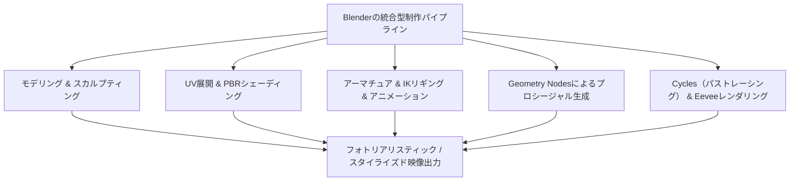
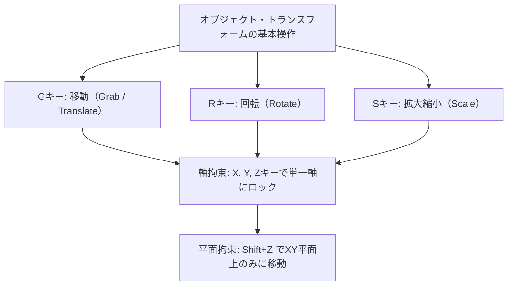
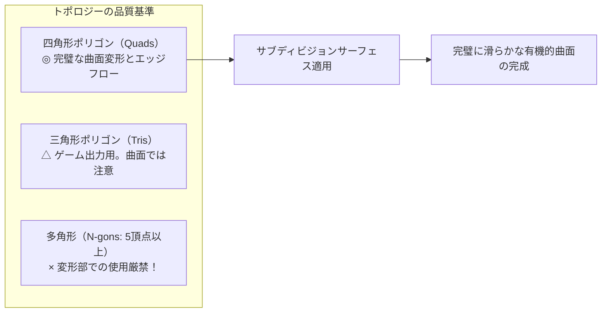
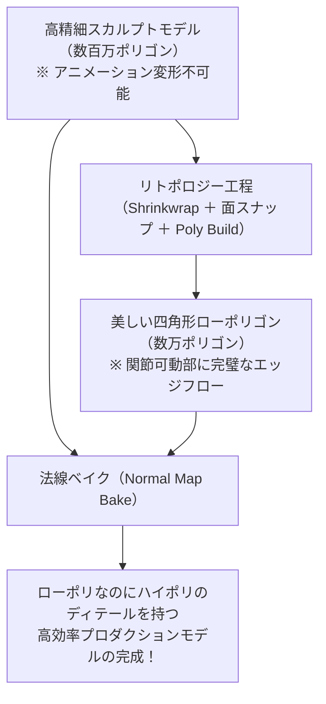
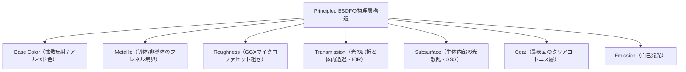
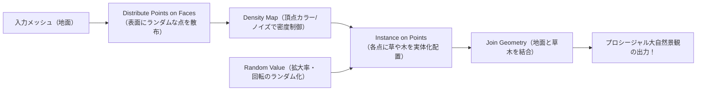
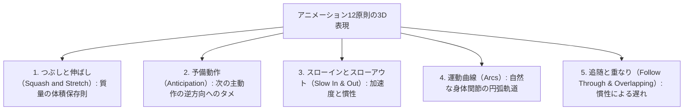
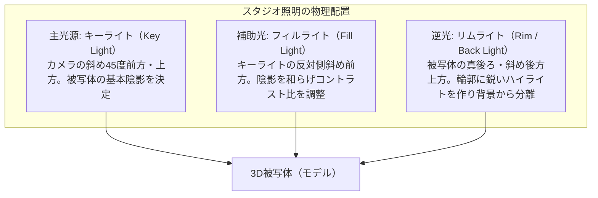

## 1. 序論：オープンソース3DCG革命としてのBlender

### 1.1 トン・ローセンダールとBlender基金の奇跡的歴史

1990年代初頭、オランダのアニメーションスタジオNeoGeoの社内ツールとして産声を上げた「Blender」は、今日、世界のデジタルエンターテインメント産業、ゲーム開発、ハリウッドVFX、建築ビジュアライゼーション、学術研究の根幹を支える世界最強のオープンソース3DCGソフトウェアへと進化を遂げた。

その歴史は、まさに奇跡的なドラマに満ちている。NeoGeoの破綻に伴い、Blenderの知的所有権は債権者に差し押さえられ、開発停止の危機に瀕した。1998年、創始者トン・ローセンダール（Ton Roosendaal）は「Blender基金」を設立し、前代未聞のクラウドファンディング運動を展開した。世界中のクリエイターから10万ユーロの寄付を集めて債権者からソースコードを買い戻し、2002年10月13日、GNU General Public License（GPL）の下でBlenderを全世界に完全オープンソースとして解放したのである。

高額なプロプライエタリ・ソフトウェア（Maya、3ds Max、Cinema 4D等）が年間数十万円のサブスクリプション費用を課す中、Blenderは **「何者も排除せず、世界中のすべてのアーティストに最高峰の制作ツールを永久に無償で提供する」** という崇高な理念を堅持し続けている。



---

### 1.2 2.80のUI大刷新と4.x世代における業界標準への到達

長年、Blenderは「右クリック選択」をはじめとする極めて独特かつ難解なユーザーインターフェース（UI）により、一般のアーティストから敬遠されがちであった。

しかし、2019年にリリースされた「Blender 2.80」は、UIの完全刷新、左クリック選択の標準化、リアルタイムPBRビューポート「Eevee」の搭載により、CG業界に未曾有の地殻変動を巻き起こした。Epic Games（Unreal Engine）、Ubisoft、Unity、NVIDIA、AMD、Apple、Microsoft、Amazonといった世界最高峰のテクノロジー巨頭が相次いでBlender開発基金（Corporate Patron）への出資を表明した。

そして現代の「Blender 4.x」世代に至っては、AgXカラーマネジメントの標準搭載、Light Linking（ライトリンク）、Principled BSDF v2の物理的刷新、Geometry Nodesの機能爆発により、商業スタジオのメインパイプラインとして堂々と採用されるに至っている。

---

## 2. Blenderの基礎アーキテクチャとUI/ショートカット体系

Blenderを習得する上で最大の障壁であり、かつ一度習得すれば他のどのCGソフトよりも圧倒的な作業速度をもたらすのが、その「極限まで洗練されたショートカット駆動型UI」である。

### 2.1 3D空間の幾何学的座標系とトランスフォーム

Blenderの仮想空間は、デカルト直交座標系（$X$ 軸：左右/赤、$Y$ 軸：前後/緑、$Z$ 軸：上下/青）によって定義される（右手系）。



- **座標系の切り替え**:
  - **グローバル座標（Global）**: 仮想ワールド全体の絶対的な天と地。
  - **ローカル座標（Local）**: オブジェクト自身が傾いた方向を基準とする相対座標（$Z$ を2回押すとローカル $Z$ 軸に沿って移動）。
  - **ノーマル座標（Normal）**: 選択した面の法線方向を基準とする座標系。
- **ピボットポイント（変形の中心）**:
  - バウンディングボックスの中心、重心（Median Point）、個々の原点（Individual Origins）、アクティブ要素、そして **「3Dカーソル」** 。
  - 3Dカーソル（Shift + 右クリックで空間内の任意の位置に配置可能）は、回転の中心や新たなオブジェクトの生成原点として、Blender特有の神速のワークフローを可能にする。

---

### 2.2 編集モード（Edit Mode）における必須8大ショートカット

オブジェクトを選択して `Tab` キーを押すことで、オブジェクト全体を扱う「オブジェクトモード」から、ポリゴンの幾何構造を直接編集する「編集モード」へと移行する。メッシュ編集の基本は、以下の8つのキーの組み合わせである。

| キー操作 | 機能名 | 詳細な内部挙動とオプション |
| :---: | :--- | :--- |
| **`E`** | **押し出し（Extrude）** | 選択した面・辺・頂点を法線方向（または指定軸）に引き伸ばし、新たなポリゴン面を生成する。`Alt + E` で「個々の面を押し出し」「法線に沿って面を押し出し」。 |
| **`I`** | **面の差し込み（Inset）** | 選択した面の内側に、一定のオフセット幅を持った同心円状の新たな面を作成する。枠線（ボーダー）を作成する際の基本。 |
| **`Ctrl + B`** | **ベベル（Bevel）** | 鋭利な角（エッジ）を斜めに面取りする。マウスホイールを回転させることで分割数（セグメント）を増やし、滑らかな丸みを与える。`V` キーで頂点ベベル。 |
| **`Ctrl + R`** | **ループカット（Loop Cut）** | ポリゴンの四角形トポロジーに沿って、メッシュ全体を一周する切断面（エッジループ）を挿入する。ホイール回転で分割数を増加、左クリック後にスライド可能。 |
| **`K`** | **ナイフツール（Knife）** | メッシュの表面上をフリーハンドでクリックして、自由な直線でポリゴンを切断・分割する。`C` で角度拘束、`Z` でオブジェクトの裏側まで貫通切断。 |
| **`Alt + M` / `M`** | **マージ（Merge）** | 選択した複数の頂点を1点に統合する。「中心に」「カーソル位置に」「最初/最後に選択した頂点に」。自動マージ（Auto Merge）有効化で近接頂点の自動結合。 |
| **`GG`** | **頂点/辺スライド** | 頂点や辺を選択して `G` を素早く2回押すと、隣接するエッジの傾きを厳密に維持したまま、レールの上を滑るように位置を微調整できる。 |
| **`F`** | **面張り（Make Edge/Face）** | 選択した2つの頂点間にエッジを張り、あるいは3つ以上の頂点・エッジから囲まれたポリゴン面を生成する。 |

---

## 3. ポリゴンモデリングとサブディビジョンサーフェスの極致

### 3.1 位相幾何学（トポロジー）の基本ルールと四角形ポリゴンの絶対性

3DCGモデリングにおいて、ポリゴンは頂点の数によって3種類に分類される。
1. **三角形ポリゴン（Tris: 3頂点）**: 常に平面を保てるためリアルタイムゲームエンジンでは最終的に三角化されるが、後述の曲面分割や変形アニメーションにおいて望ましくない歪み（ピンチング）を生みやすい。
2. **四角形ポリゴン（Quads: 4頂点）**: **プロフェッショナルモデリングにおける絶対的な至高の標準** 。エッジループ（Edge Flow）が整然と流れ、サブディビジョン曲面の計算が最も美しく破綻しない。
3. **多角形ポリゴン（N-gons: 5頂点以上）**: モデリング途中の平面部分を除き、 **曲面や関節の可動部においてN-gonを残すことは重罪（Taboo）** とされる。曲面化アルゴリズムがどこで分割してよいか判定できず、レンダリング時に陰影の壊滅的な黒ずみやアーティファクトが発生するためである。

また、1つの頂点から5本以上のエッジが放射状に伸びる点（Eポール）や、3本しか伸びない点（Nポール）は、エッジループの方向を変える結節点（Pole）となる。これらのポールを関節の曲がる部分や顔の表情筋の可動部から排除し、筋肉の流れに沿った美しいトポロジーを構築することがモデラーの腕の見せ所となる。



---

### 3.2 サブディビジョンサーフェス（Catmull-Clark法）の数理

CG映画のような滑らかなキャラクターや自動車の流線型ボディは、荒いローポリゴンモデルに対して **「サブディビジョンサーフェス（Subdivision Surface / 細分割曲面）モディファイア」** （`Ctrl + 1~3`）を適用することで生成される。

Blenderが採用しているCatmull-Clark細分割アルゴリズムは、1978年にエドウィン・キャットマルとジム・クラークによって発表された数理手法であり、各反復ステップにおいて以下の3つの計算を行う。

1. **面の中心点（Face Point）**: 各ポリゴン面の全頂点の重心を計算する。
   $$F = rac{1}{n} \sum_{i=1}^n V_i$$
2. **辺の中心点（Edge Point）**: 各エッジの両端の頂点と、そのエッジを共有する隣接する面のFace Pointの平均を計算する。
   $$E = rac{V_1 + V_2 + F_1 + F_2}{4}$$
3. **新しい頂点位置（Vertex Point）**: 元の頂点 $V$ に対し、接続する $n$ 個の面のFace Pointの平均 $Q$、接続する $n$ 個のエッジの中点の平均 $R$ を用いて、新たな位置 $V'$ を決定する。
   $$V' = rac{Q + 2R + (n-3)V}{n}$$

このアルゴリズムを再帰的に適用することで、粗い角張ったメッシュは、数学的に厳密なB-スプライン曲面（極限曲面）へと滑らかに収束する。

#### クレストラインとサポートループ
サブディビジョンサーフェスを適用した際、角のシャープさを維持したいエッジには、その直近に **「サポートループ（保護エッジ）」** を近接して走らせる。エッジ間の距離が近ければ近いほど、Catmull-Clarkの計算による丸まりが抑制され、金属やプラスチックの引き締まったエッジが表現できる（あるいはクリース：Crease機能でエッジに重み付けを行う）。

---

### 3.3 モディファイア（Modifier）スタックの非破壊ワークフロー

Blenderのモデリングの真骨頂は、元のメッシュデータを破壊（確定）せずに、リアルタイムに幾何学的変形を重ね合わせる **「モディファイア・スタック（Modifier Stack）」** にある。

| モディファイア名 | カテゴリ | 挙動と実務的ベストプラクティス |
| :--- | :---: | :--- |
| **Mirror（ミラー）** | 生成 | 指定した軸（通常X軸）を挟んで線対称のメッシュを自動生成。「Clipping」をオンにすることで、中央の境界線で頂点が隙間なく融合する。キャラクターや乗り物モデリングの基本。 |
| **Array（配列）** | 生成 | 指定したオフセット間隔や回転（Object Offset）で同一メッシュを複数複製。階段、鎖、柵、円形に並ぶボルトなどの一括生成。 |
| **Boolean（ブーリアン）** | 生成 | メッシュ同士の集合演算（結合・差分・交差）。Exact（厳密）とFast（高速）モードの使い分け。ハードサーフェスモデリングにおいて溝や穴を一瞬で穿孔する。 |
| **Solidify（厚み付け）** | 生成 | 厚みのない板ポリゴンに対して、法線方向に均一な肉厚を付与する。衣服、ガラス瓶、車の外板パネルの厚み表現。 |
| **Bevel（ベベル）** | 編集 | メッシュの鋭角エッジに対して非破壊で面取りを実行。Weight（重み）や角度（Angle: 通常30度以上）で制御し、ハイポリゴン化せずに角のハイライトを美しく反射させる。 |
| **Weighted Normal** | 修正 | 大きな平面ポリゴンの法線を小さなベベル面よりも優遇して再計算する。Subsurfを使わずに、ローポリゴンモデルの平坦面を歪みなく鏡面のように平滑に見せる神モディファイア。 |

---

## 4. デジタルスカルプティングとリトポロジー

粘土をこねるように直感的にクリーチャーや人物の肉体、シワを造形する手法が「スカルプトモード（Sculpt Mode）」である。

### 4.1 主要スカルプトブラシの特性

- **Draw**: メッシュの法線方向に沿って表面を盛り上げる/彫り込む（`Ctrl` 押し）。
- **Clay Strips**: 四角い粘土の帯を重ね塗りするように、素早く肉付けを行い骨格や筋肉の大きな塊（フォーム）を捉える。
- **Grab**: メッシュを広範囲に掴んで引っ張り、シルエットやプロポーションをダイナミックに変更する。
- **Crease**: 鋭い谷状のシワや折り目を刻み込む。皮膚のシワや衣服のドレープに必須。
- **Smooth**: 表面の凹凸を滑らかに均す（`Shift` 押しでどのブラシからでも瞬時に呼び出し可能）。
- **Inflate**: 選択領域を風船のように全方位に膨らませる。

---

### 4.2 Dyntopo vs ボクセルリメッシュ

数百万ポリゴンの超高精細スカルプトを行う際、ポリゴン密度の動的管理が焦点となる。

1. **ダイナミックトポロジー（Dyntopo）**:
   - ブラシでストロークした局所的な領域にのみ、リアルタイムに三角形ポリゴンを細分割して追加する。
   - メッシュの他の部分の解像度を維持したまま、指先や耳、目などの微小ディテール部分だけを局所的にハイポリ化できる。
2. **ボクセルリメッシュ（Voxel Remesh: `Ctrl + R`）**:
   - 3D空間を均一な立方体グリッド（ボクセル：例 $0.01m$）で満たし、メッシュ全体を均一な四角形ポリゴンで瞬時に再構成する。
   - ブーリアンで結合した異なるパーツの継ぎ目を一瞬で融合させ、トポロジーの破綻や極端なポリゴンの引き伸ばしを一掃して均一な粘土状態に戻す。

---

### 4.3 リトポロジー（Retopology）の理論と実践

スカルプトによって完成したハイポリゴンモデル（数百万〜数千万ポリゴン）は、データ量が膨大すぎてそのままではゲームエンジンで動かすことも、ボーンを入れてアニメーション変形させることもできない。

そこで、ハイポリゴンの外形表面にぴったり吸着するように、最小限の四角形ポリゴン（数千〜数万ポリゴン）で美しいエッジループを手動で再構築する工程が **「リトポロジー」** である。



1. **Shrinkwrap（シュリンクラップ）モディファイア** と **Face Project（面スナップ）** を有効化する。
2. 目、口、鼻の周囲に同心円状のリング（エッジループ）を配置する。
3. 顎から首、肩へと流れるエッジを繋ぎ、関節の曲がる部分（肘、膝）には曲げても潰れないように3本のサポートエッジ（トポロジーの関節リング）を仕込む。
4. 完成後、ハイポリゴンの極小のシワや毛穴のディテールは、後述の **「ノーマルマップ（法線マップ）」** としてローポリゴンにテクスチャとして焼き付け（ベイク）する。

---

## 5. マテリアル・シェーディングとPBR（物理ベースレンダリング）の科学

Blenderの質感表現は、ノードベースの「シェーダーエディター（Shader Editor）」において構築される。現代のCG業界標準である「PBR（Physically Based Rendering: 物理ベースレンダリング）」は、光の電磁気学的振る舞い（反射、屈折、吸収、散乱）を物理法則に基づいてシミュレートする。

### 5.1 プリンシプルBSDF（Principled BSDF v2）の数理解析

Blenderの核となるシェーダーノード「Principled BSDF」は、ディズニーが2012年に提唱した「Disney Principled BRDF」をベースとし、Blender 4.0でマイクロファセット理論とエネルギー保存則がさらに厳密化された。



1. **Base Color（ベースカラー / アルベド）**:
   - 絶縁体（非金属）の場合：表面で反射されずに物質内部に入り、散乱されて再び出てくる「拡散反射光の色」。
   - 導体（金属）の場合：金属内部に入った光は自由電子に衝突して即座に吸収されるため拡散反射はゼロ。Base Colorは「表面で直接反射される鏡面反射光そのものの色（F0反射率）」となる（金なら黄色、銅なら赤褐色）。
2. **Metallic（メタリック: $0.0 \sim 1.0$）**:
   - 自然界の物質は、 **「金属（導体：Metallic = 1.0）」** か **「非金属（絶縁体：Metallic = 0.0）」** のどちらかしか存在しない。中間の値（0.5など）は、物理的には埃や錆に覆われた境界領域を除いて存在しない。
3. **Roughness（ラフネス / 表面粗さ）**:
   - マイクロファセット（微小面）分布関数（GGX分布）のパラメータ。
   - $0.0$：完全な鏡面（光線は一方向にのみ完全反射）。
   - $1.0$：極限の粗面（チョークや粘土のように光が全方位に均等に散乱）。
4. **IOR（Index of Refraction: 屈折率）**:
   - スネルの法則（$n_1 \sin 	heta_1 = n_2 \sin 	heta_2$）に基づく屈折率。
   - 空気：$1.0003$、水：$1.333$、アクリル樹脂：$1.49$、一般的な窓ガラス：$1.52$、ダイヤモンド：$2.417$。
5. **Subsurface Scattering（SSS: 表面下散乱）**:
   - 人間の皮膚、大理石、ワックス、牛乳、翡翠などの半透明物質において、光が表面を透過して内部で無数に衝突・散乱した後に再び外に出てくる現象。
   - 皮膚の青白い光は内部の静脈や真皮で散乱され、赤色光（血液のヘモグロビン）だけが深く浸透して透過するため、強い逆光を浴びた耳たぶや指先が赤く輝く（Subsurface RadiusによるRGB波長ごとの散乱距離設定）。

---

### 5.2 UV展開とテクセル密度（Texel Density）

3Dの立体表面に2Dの画像テクスチャ（カラーマップ、ノーマルマップ）を歪みなく貼り付けるためには、折り紙を開くようにメッシュを2次元平面へと切り開く **「UV展開（UV Unwrapping）」** が不可欠である。

- **シーム（Seam: 切れ目）の配置**:
  - `Ctrl + E` → 「Mark Seam（シームをマーク）」。
  - ぬいぐるみの縫い目のように、カメラから見えにくい場所（服の内股、髪の生え際、キャラクターの背中など）にシームを走らせる。
- **テクセル密度（Texel Density）の均一化**:
  - 3Dモデル上の $1m$ あたりに割り当てられるテクスチャの解像度（ピクセル数）。
  - 顔のテクセル密度が $20.48 px/cm$ なのに、胴体が $2.56 px/cm$ であれば、並べたときに画質の解像度差が露呈してしまう。UVアイランド全体を均一なテクセル密度で拡大縮小し、UV空間（$0 \sim 1$）内に無駄な余白なく効率的に配置（パッキング）する。

---

## 6. アーマチュア・リギングとアニメーションの力学

静的な3Dモデルに生命を吹き込み、意図通りに動かすための「骨組み（Armature）」を構築する技術が「リギング（Rigging）」である。

### 6.1 FK（順運動学） vs IK（逆運動学）の数学的相克

キャラクターの腕や足を動かす制御方式には、正反対の2つの数学的アプローチが存在する。

```mermaid
flowchart LR
    subgraph FK（Forward Kinematics: 順運動学）
        SHOULDER["肩を回転"] --> ELBOW["肘が追従して回転"]
        ELBOW --> HAND["手首の位置が最終決定"]
        NOTE_FK["◎ 滑らかな円弧軌道（腕の素振り等）<br/>× 地面に足を接地させるのは不可能"]
    end
    subgraph IK（Inverse Kinematics: 逆運動学）
        GOAL["手首/足首の目標位置を空間指定"] --> SOLVER["IKソルバー（ヤコビアン行列逆算）"]
        SOLVER --> AUTO["肩・肘・股関節・膝の角度を自動計算"]
        NOTE_IK["◎ 地面に足をピタッと固定する歩行<br/>◎ 物を掴む動作に不可欠"]
    end
```

- **FK（Forward Kinematics）**: 親ボーンの回転角度が子ボーンへと順番に伝達される。空中で腕をブラブラ振るような自由な弧運動（アーク）のアニメーションには最適だが、「地面に足をぴったり固定したまま腰を落とす」ような動作を作ろうとすると、腰を動かすたびに足が地面を突き抜けてしまい、キーフレーム修正が地獄となる。
- **IK（Inverse Kinematics）**: 末端のボーン（手首や足首）の位置を空間内に固定し、その位置を満たすように親のボーン（大腿骨、脛骨）の関節角度を **逆運動学ソルバー（CCD-IKやFABRIKアルゴリズム）** が逆算して自動決定する。歩行アニメーションで足を地面にロックするために必須である。
- **ポールターゲット（Pole Target）**: IK計算において、膝や肘がどの方向を向いて曲がるべきかを空間内の球体ボーン（ポールベクター）でガイドし、関節があらぬ方向に折れ曲がるのを防ぐ。

---

### 6.2 ウェイトペイント（Weight Painting）

ボーンを動かしたときに、メッシュのどの頂点がどれくらい追従して変形するかを $0.0 \sim 1.0$ の数値（青＝0、緑＝0.5、赤＝1.0）で塗り分ける作業。
- スムーズな関節の曲がりを実現するため、肘や膝の内側は急峻なウェイト変化、外側はなだらかなグラデーションを設定する。
- 頂点ごとのウェイトの総和は常に $1.0$ に正規化（Normalize All）されなければならず、これを怠るとボーンを動かした瞬間にポリゴンが四方八方に爆発（飛び散る）するバグが発生する。

---

## 7. プロシージャル生成の革命：Geometry Nodes

Blender 3.0以降、世界中のテクニカルアーティストを熱狂させているのが、プログラミング言語のようにノードを繋ぐだけで、無限のバリエーションを持つ3D形状を数理的に自動生成する **「Geometry Nodes（ジオメトリノード）」** である。

### 7.1 フィールド（Fields）システムの概念

Geometry Nodesは「フィールド（Fields）」と呼ばれるデータフローモデルを採用している。これは、個々の頂点や面をループ処理するのではなく、「ジオメトリの全要素に対する関数（評価式）」としてデータをやり取りする。



### 7.2 実践例：プロシージャル森林生成ノードツリー
1. 地面となる平面メッシュを入力（Group Input）。
2. **Distribute Points on Faces**: 面の表面にポアソンディスク（Poisson Disk）サンプリングで互いに一定の最小距離を保ちながらランダムな点群を生成。
3. **Noise Texture** ノードの出力を点の密度（Density）に接続し、木が生い茂る群落と開けた広場を自然なムラとして制御。
4. **Instance on Points**: 生成された各点の上に、あらかじめ作成しておいた複数種類の樹木コレクション（Collection Info）をランダムに配置。
5. **Rotate Instances / Scale Instances**: ランダム値（Random Value）ノードを接続し、$Z$ 軸回転を $0 \sim 2\pi$、スケールを $0.7 \sim 1.3$ の正規分布で揺らぎを与える。
6. これにより、地面のメッシュを編集モードで変形したり拡大するだけで、リアルタイムに木々が地形に適応して再配置されるプロシージャルな大自然景観が数秒で完成する。

さらに最新の **「Simulation Nodes」** を使えば、風に揺れる草花、重力に従って落下する砂粒、雨粒の衝突、流体の簡易挙動までもがGeometry Nodesの内部で完結する。

---

## 8. レンダリングエンジンの物理：Cycles vs Eevee Next

Blenderには、目的の異なる2つの超強力なレンダリングエンジンが内蔵されている。

### 8.1 Cycles：モンテカルロ・パストレーシング（Path Tracing）の物理

Cyclesは、光の物理的挙動を極限まで忠実にシミュレートする「不偏パストレーシング・レンダーエンジン」である。

カメラの各ピクセルから仮想の光線（レイ）を逆向きに射出し、シーン内の物体表面に衝突した光線が、マテリアルのBSDF関数に従ってランダムな方向へと跳ね返る（バウンスする）プロセスをモンテカルロ法で何千回も計算する。

$$L_o(p, \omega_o) = L_e(p, \omega_o) + \int_{\Omega} f_r(p, \omega_i, \omega_o) L_i(p, \omega_i) (\omega_i \cdot n) d\omega_i$$

- **レンダリング方程式（Kajiya's Rendering Equation）** を解くことにより、間接照明（カラーブリーディング：赤い壁の近くの白い床がほんのり赤く染まる現象）、リアルなガラスの屈折、コースティクス（集光模様）、ソフトシャドウが一切のフェイクなしに自然に発生する。
- **AIデノイズ（Denoising）**: 計算初期のザラザラとしたモンテカルロノイズを、Intel Open Image Denoise（OIDN）やNVIDIA OptiXといったディープラーニングAIが瞬時に除去し、少ないサンプル数（128〜512サンプル）でノイズレスな超高精細画像を出力する。

---

### 8.2 Eevee Next：リアルタイム・ラスタライゼーションの極限

ゲームエンジンのような毎秒数十フレームの圧倒的リアルタイムプレビューを提供するのが「Eevee（イーヴイ）」である。
最新の「Eevee Next」では、スクリーンスペース反射（SSR）を大幅に進化させ、シャドウマップの解像度制約を撤廃した「バーチャルシャドウマップ（VSM）」や、スクリーンスペース・サブサーフェススキャッタリング、リアルタイム・アンビエントオクルージョン（GTAO）を搭載。Cyclesに肉薄する美麗なレンダリング結果を、わずか数秒でレンダリングする。

---

### 8.3 カラーマネジメント：AgXの科学

Blender 4.0からデフォルトとなったカラーマネジメントシステム **「AgX」** は、従来の「sRGB」や「Filmic」における致命的な色崩れ（強い光が当たったハイライト部分が黄色から突然飽和してプラスチックのように白飛びする現象）を根本から解決した。

人間の眼球の錐体細胞の光受容特性と、映画用ネガフィルムの露光特性（Logカーブ）を模倣し、高輝度領域において色相（Hue）を維持しながら自然にトーンを圧縮する。これにより、燃える炎やネオンサイン、強い太陽光を受けた肌の質感が、映画フィルムのような豊かなダイナミックレンジと情緒を湛えてレンダリングされる。

---

---

## 6.4 アニメーションの生命線：ディズニー12原則の3D実装とFカーブ補間

3D空間に配置されたモデルにキーフレーム（`I` キー）を打つだけでは、動きはロボットのように硬直した「不気味の谷」に陥る。キャラクターに生命の躍動を吹き込むためには、1930年代にウォルト・ディズニー・スタジオの伝説のアニメーターたち（ナイン・オールド・メン）が確立した **「アニメーション12の基本原則」** をBlenderのグラフエディター上で数値的に実装しなければならない。



### ① つぶしと伸ばし（Squash and Stretch）の体積保存
ボールがバウンドして床に激突する瞬間、平たく潰れる（Squash）。そして跳ね上がる瞬間、進行方向に長く伸びる（Stretch）。
- **最重要の物理法則**: 変形中、 **オブジェクトの総体積は常に一定（Volume Preservation）** でなければならない。
- $Z$ 軸方向に $0.5$ 倍に縮んだならば、体積を保つために $X$ 軸および $Y$ 軸方向には $\sqrt{1 / 0.5} pprox 1.414$ 倍に膨張させなければならない。Blenderでは「Stretch To」ボーンコンストレイントを使用することで、この体積保存計算を完全自動化できる。

### ② グラフエディター（Graph Editor）と3次ベジェ補間の力学
Blenderのグラフエディターは、時間の経過に伴う位置・回転・スケールの変化率を2次元の「Fカーブ（Function Curve）」として可視化する。
- **リニア補間（Linear）**: 一定速度で直線的に動く（機械的で冷たい印象）。
- **ベジェ補間（Bézier）**: ハンドルを調整することで、始動時にゆっくり加速し（イーズイン）、最高速に達し、停止直前に滑らかに減速する（イーズアウト）自然な慣性運動（3次ベジェ多項式）を生成する。
- 歩行サイクル（Walk Cycle）において、腰の上下運動、足の振り出し、腕のカウンターバランスの位相を数フレームずつずらす（Overlapping Action）ことで、生きている人間の複雑な重心移動が再現される。

---

## 7.5 Python API（`bpy`）によるプロシージャル・スクリプティング自動化

Blenderの内部アーキテクチャの最大の強みは、すべての機能・データ構造・UIが「Python」に完全にバインドされている点にある。画面上のいかなるボタンにマウスカーソルを乗せても、背後で実行されるPythonプロパティ名が表示される。

`Scripting` ワークスペースを開き、Pythonスクリプトを実行することで、手作業では何日もかかる複雑な数理造形を一瞬で自動生成できる。

### 数学曲面（メビウスの帯）を自動生成するPythonスクリプト例
```python
import bpy
import math

# 既存のメッシュをクリア
bpy.ops.object.select_all(action='SELECT')
bpy.ops.object.delete()

# メビウスの帯のパラメータ
R = 3.0       # 主半径
w = 1.0       # 帯の幅
u_segments = 120  # 円周方向の分割数
v_segments = 20   # 幅方向の分割数

verts = []
faces = []

for i in range(u_segments):
    u = 2.0 * math.pi * i / u_segments
    for j in range(v_segments + 1):
        v = -w + (2.0 * w * j / v_segments)
        
        # メビウスの帯の媒介変数方程式
        x = (R + v * math.cos(u / 2.0)) * math.cos(u)
        y = (R + v * math.cos(u / 2.0)) * math.sin(u)
        z = v * math.sin(u / 2.0)
        
        verts.append((x, y, z))

# 面のインデックスを生成
for i in range(u_segments):
    next_i = (i + 1) % u_segments
    for j in range(v_segments):
        p1 = i * (v_segments + 1) + j
        p2 = i * (v_segments + 1) + (j + 1)
        
        # 1周した際のひねりの反転接続処理
        if next_i == 0:
            p3 = next_i * (v_segments + 1) + (v_segments - (j + 1))
            p4 = next_i * (v_segments + 1) + (v_segments - j)
        else:
            p3 = next_i * (v_segments + 1) + (j + 1)
            p4 = next_i * (v_segments + 1) + j
            
        faces.append((p1, p2, p3, p4))

# メッシュとオブジェクトを作成してシーンにリンク
mesh = bpy.data.meshes.new(name="Mobius_Strip_Mesh")
mesh.from_pydata(verts, [], faces)
mesh.update()

obj = bpy.data.objects.new(name="Mobius_Strip", object_data=mesh)
bpy.context.collection.objects.link(obj)

# スムーズシェードを適用
for poly in mesh.polygons:
    poly.use_smooth = True
```

この強力なPython API（`bpy`）を活用することで、建築のパラメトリック設計、医療用CTスキャンデータの3Dビジュアライゼーション、深層学習用合成学習データセット（Synthetic Dataset）の自動バッチレンダリングなど、Blenderは単なるモデリングソフトを超えた「学術・産業用CGプラットフォーム」として機能する。

---

## 8.4 スタジオライティングの物理とコンポジター（Compositor）の極致

どれほど精巧にモデリングされ、完璧なPBRシェーダーが施されたモデルであっても、ライティング（照明設計）が稚拙であれば、その作品は平坦で安っぽいCGに見えてしまう。

### ① クラシック3点照明（Three-Point Lighting）のマスター
被写体の立体感、質感、奥行きを極限まで引き出すための基本設計。



- **キーライトとフィルライトの強度比（コントラスト比）**:
  - コメディ・明るいシーン：$2:1 \sim 3:1$（全体に明るく影が薄い）。
  - ドラマティック・映画的（フィルム・ノワール）：$8:1 \sim 16:1$（深い影と強いドラマ性）。
- **ライトのサイズと影の硬さ（Light Softness）**:
  - ポイントライトの半径（Size）が小さければ小さいほど、点光源に近づきエッジの鋭い硬い影（Hard Shadow）ができる。
  - 半径を大きく広げる（ソフトボックスやエリアライト）と、光線が回り込み、美しく滑らかな半影（Penumbra）を持つソフトシャドウが形成される。

### ② コンポジター（Compositor）による映画的ポストプロダクション
レンダリングが終了した直後の画像は、まだ「未現像のRAWデータ」に過ぎない。Blender内蔵のコンポジターノードを用いることで、ハリウッド映画に匹敵する最終調整を行う。

1. **グレアノード（Glare Node）**: 「Fog Glow」モードで高輝度部分にのみ大気散乱の光の滲み（ブルーム）を付加。「Streaks」でアナモルフィック・レンズ特有の水平レンズフレアを生成。
2. **被写界深度（Depth of Field: Z深度）の精査**: カメラの実焦点距離（Focal Length）とF値（F-Stop）に基づき、背景を美しくボケさせて視線を主役に誘導する。
3. **レンズ収差（Lens Distortion）**: 「Dispersion」に微小な値（$0.01 \sim 0.02$）を入力し、画面周辺部に現実のガラスレンズ特有の「色収差（RGBの波長ずれ）」を意図的に付加することで、CG特有の無菌的なデジタル感を打ち消し、実写カメラで撮影したような有機的空気感を獲得する。

---

## 8.5 物理シミュレーション（Physics Simulation）の力学

Blenderには、現実の力学法則を数値計算する統合物理演算エンジンが内蔵されている。

1. **剛体シミュレーション（Rigid Body）**:
   - 物体同士の衝突、跳ね返り、摩擦、積み木崩し、ドミノ倒しをニュートン力学に基づいて計算。
   - 「Active（動く側）」と「Passive（静止する床や壁）」を設定し、コリジョン形状を「Convex Hull（凸包）」や「Mesh（厳密形状）」から選択する。
2. **クロスシミュレーション（Cloth）**:
   - 衣服、旗、カーテンの揺らぎやシワを質点バネモデル（Mass-Spring System）で計算。
   - 伸縮性（Structural Stiffness）、曲げ耐性（Bending）、空気抵抗、および自己衝突（Self-Collision）を有効化することで、生地が自らのポリゴンを突き抜ける破綻を防止する。
3. **流体・煙シミュレーション（Mantaflow）**:
   - Navier-Stokes方程式に基づく流体力学演算。
   - ドメイン（Domain）空間内で液体が飛び散る水しぶきや、爆発・炎・煙の渦（Vorticity）をボクセル空間で精緻にベイク（Bake）する。

## 9. 結論：3Dクリエイターの未来とBlenderが拓く地平

Blenderというツールの探求は、数学、物理学、光学、解剖学、色彩学、そして純粋な美意識が一点で交差する「総合芸術」の旅である。

画面上の立方体（Default Cube）を削除し、頂点を一つ打ち出すところから始まり、
- Catmull-Clarkの細分割曲面によって有機的な生命の形を削り出し、
- 物理ベースのシェーダーノードによって物質の微細な光のドラマを記述し、
- ボーンとIKの数学によって身体の躍動を吹き込み、
- Geometry Nodesによって無限のフラクタル世界をアルゴリズムで生成し、
- そしてCyclesの光線追跡によって、現実と見紛うばかりの光子の雨を定着させる。

かつて数千万円のワークステーションと専門スタジオの独占物であった3DCGの世界は、今やPC1台とBlenderを手にした世界中のすべての個人の前に、平等に解放された。

「想像できるものは、すべて形にできる」。
Blenderという自由の翼を手に入れたアーティストの前に広がるのは、自らの知性と感性の限界だけが境界線となる、無限の創造の宇宙なのである。
