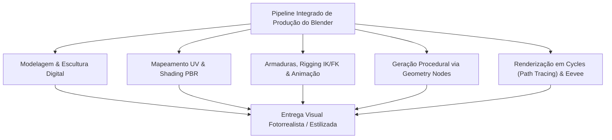
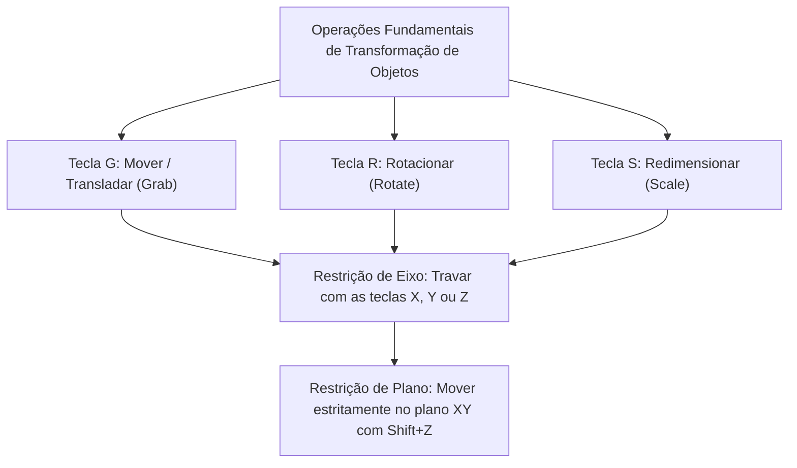
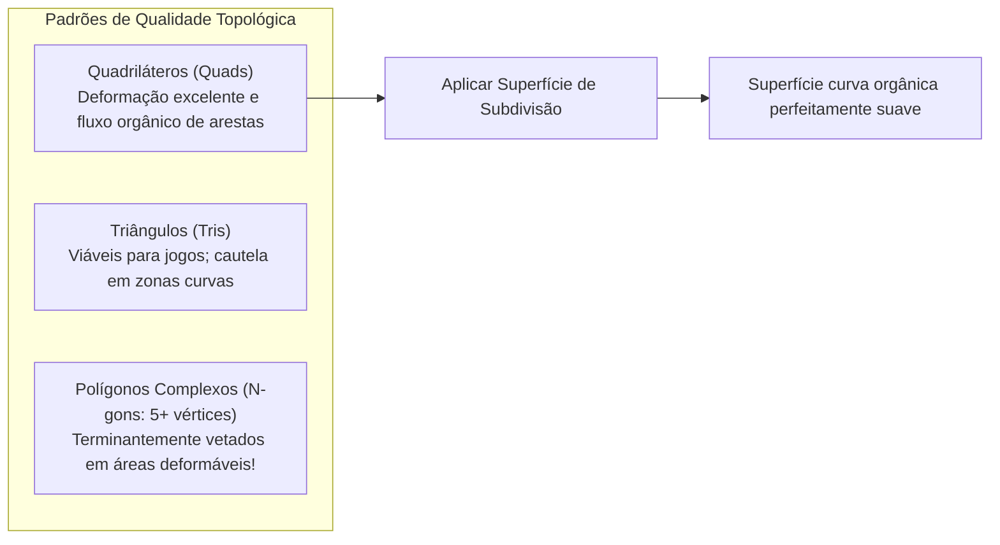
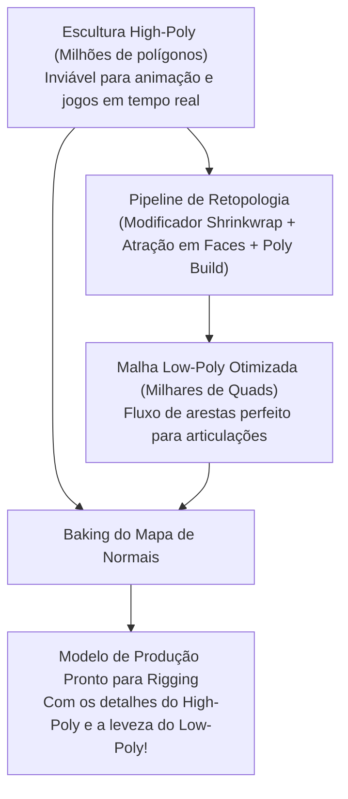
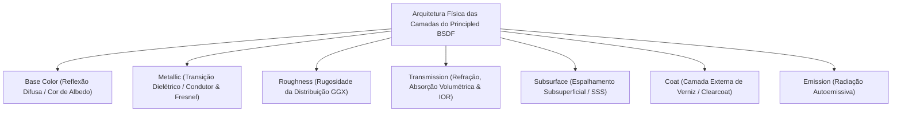
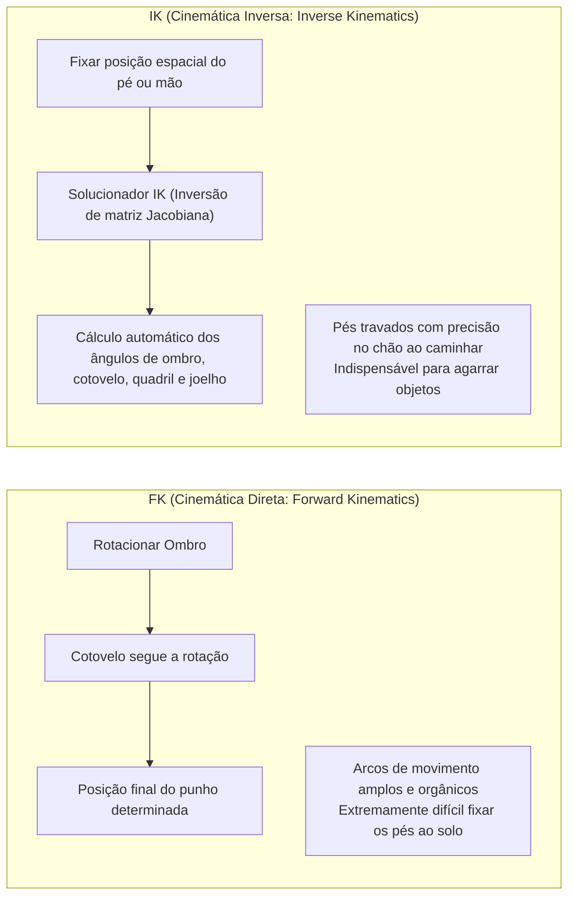
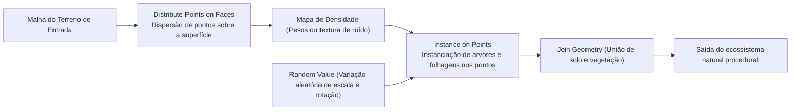
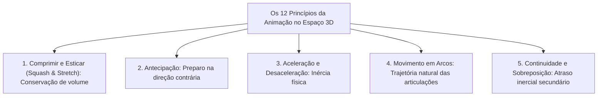
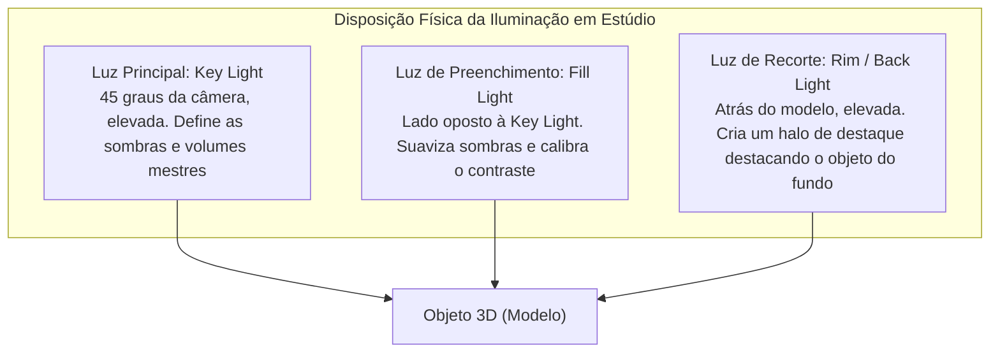

## 1. Introdução: O Blender como a Revolução do 3DCG Open Source

### 1.1 A História Milagrosa de Ton Roosendaal e da Fundação Blender

Nascido no início da década de 1990 como uma ferramenta interna para o estúdio de animação holandês NeoGeo, o "Blender" evoluiu para a suíte 3DCG de código aberto mais poderosa do mundo, servindo de alicerce para o entretenimento digital global, desenvolvimento de jogos, efeitos visuais (VFX) de Hollywood, visualização arquitetônica e pesquisa científica de ponta.

Sua trajetória é marcada por superações cinematográficas. Com a falência da NeoGeo, os direitos de propriedade intelectual do Blender foram confiscados por credores, colocando o desenvolvimento sob risco iminente de paralisação definitiva. Em 1998, o criador Ton Roosendaal fundou a "Fundação Blender" e articulou uma campanha histórica de financiamento coletivo. Arrecadando 100.000 euros em doações de artistas ao redor do mundo, recomprou o código-fonte dos credores. Em 13 de outubro de 2002, o Blender foi formalmente liberado para a humanidade sob a licença GNU General Public License (GPL).

Enquanto softwares proprietários onerosos (como Maya, 3ds Max e Cinema 4D) cobram assinaturas anuais na casa dos milhares de dólares, o Blender mantém-se inabalável em seu nobre juramento: **"Não excluir ninguém; fornecer as melhores ferramentas de criação a todos os artistas do planeta, de forma totalmente gratuita e para sempre."**



---

### 1.2 A Reformulação Histórica da UI na Versão 2.80 e a Consagração na Era 4.x

Durante muitos anos, o Blender era evitado por artistas convencionais devido à sua interface de usuário atípica, em especial a controversa seleção com o botão direito do mouse.

No entanto, o lançamento do "Blender 2.80" em 2019 desencadeou uma revolução sísmica na indústria gráfica: introduziu uma interface totalmente modernizada, padronizou a seleção pelo botão esquerdo e estreou a viewport PBR em tempo real "Eevee". Gigantes da tecnologia mundial — como Epic Games (Unreal Engine), Ubisoft, Unity, NVIDIA, AMD, Apple, Microsoft e Amazon — apressaram-se em apoiar o Fundo de Desenvolvimento do Blender como Patrocinadores Corporativos.

Na atual geração "Blender 4.x", o gerenciamento de cores AgX nativo, Light Linking (vínculo de iluminação), a reformulação estritamente física do Principled BSDF v2 e a ascensão monumental do Geometry Nodes consolidaram o Blender como peça indispensável nos pipelines dos maiores estúdios internacionais.

---

## 2. Arquitetura Fundamental, UI e Filosofia de Atalhos

A principal barreira no aprendizado do Blender — e a exata razão pela qual proporciona uma velocidade operacional inigualável após o domínio — reside em sua "interface altamente refinada e impulsionada por atalhos de teclado".

### 2.1 Sistemas de Coordenadas Geométricas e Transformações no Espaço 3D

O espaço virtual tridimensional do Blender é regido pelo sistema cartesiano ortogonal ($X$: Esquerda/Direita / Vermelho, $Y$: Frente/Trás / Verde, $Z$: Cima/Baixo / Azul), adotando a convenção da mão direita.



- **Sistemas de Coordenadas**:
  - **Global**: A orientação cardinal absoluta de todo o ambiente tridimensional.
  - **Local**: Coordenadas relativas à própria orientação rotacional do objeto (pressionar $Z$ duas vezes desloca o objeto ao longo de seu eixo $Z$ local).
  - **Normal**: Orientado rigorosamente pelas normais das superfícies poligonais selecionadas.
- **Pontos de Pivô (Centros de Transformação)**:
  - Centro da caixa delimitadora (Bounding Box), Ponto mediano (Median Point), Origens individuais, Elemento ativo e o onipresente **"Cursor 3D"**.
  - O Cursor 3D (posicionado livremente pelo espaço com Shift + Botão Direito) atua como pivô de rotação ou ponto de nascimento para novos objetos, viabilizando o fluxo ultraveloz característico do software.

---

### 2.2 Os 8 Atalhos Fundamentais do Modo de Edição (Edit Mode)

Ao selecionar um objeto e pressionar `Tab`, transita-se do Modo de Objeto para o Modo de Edição, manipulando diretamente vértices, arestas e faces. A modelagem poligonal essencial estrutura-se sobre estes oito comandos-chave:

| Atalho | Operação | Mecanismo Interno & Melhores Práticas |
| :---: | :--- | :--- |
| **`E`** | **Extrusão (Extrude)** | Projeta faces, arestas ou vértices selecionados na direção de suas normais (ou em eixos fixos), gerando nova geometria. `Alt + E` abre opções para extrudar faces individuais ou pelas normais. |
| **`I`** | **Inserção de Faces (Inset)** | Cria novas faces concêntricas no interior da seleção com recuo uniforme. Indispensável para produzir molduras e bordas de contenção. |
| **`Ctrl + B`** | **Chanfro (Bevel)** | Desbasta arestas vivas em ângulo oblíquo. Rolar a roda do mouse adiciona segmentos para arredondar cantos. A tecla `V` alterna para chanfro de vértices. |
| **`Ctrl + R`** | **Corte em Loop (Loop Cut)** | Insere um anel de arestas contínuo ao longo da topologia em quadriláteros da malha. O scroll do mouse ajusta a quantidade de divisões. |
| **`K`** | **Faca (Knife)** | Corta e subdivide polígonos livremente por meio de linhas retas desenhadas diretamente na superfície. `C` trava em ângulos; `Z` efetua corte passante no modelo. |
| **`Alt + M` / `M`** | **Mesclar (Merge)** | Solda múltiplos vértices selecionados em um único ponto ("No Centro", "No Cursor", "No Primeiro/Último"). A opção Auto Merge solda vértices contíguos de forma automática. |
| **`GG`** | **Deslizar Vértice / Aresta** | Pressionar `G` duas vezes desloca o vértice ou aresta ao longo das arestas vizinhas mantendo intacta a curvatura da superfície. |
| **`F`** | **Criar Face / Aresta (Make Edge/Face)** | Conecta dois vértices por uma aresta ou preenche três ou mais vértices/arestas formando uma face poligonal fechada. |

---

## 3. Modelagem Poligonal e o Ápice das Superfícies de Subdivisão

### 3.1 Princípios de Topologia e a Hegemonia dos Quadriláteros (Quads)

Na modelagem poligonal 3D, as faces são classificadas conforme o número de vértices:
1. **Triângulos (Tris: 3 vértices)**: Sempre conservam a coplanaridade e são o padrão final em engines de jogos em tempo real, porém causam vincos e dobras indesejadas (pinching) sob algoritmos de subdivisão e rigging esqueletizado.
2. **Quadriláteros (Quads: 4 vértices)**: **O padrão ouro absoluto da indústria profissional**. Asseguram um fluxo de arestas (Edge Flow) harmonioso e subdividem-se de forma limpa e estável.
3. **Polígonos Complexos (N-gons: 5 ou mais vértices)**: À exceção de planos absolutos nas fases preliminares, **manter N-gons em superfícies curvas ou áreas articuladas é terminantemente proibido**. Algoritmos de subdivisão não resolvem sua triangulação interna com precisão, gerando manchas escuras e graves erros de sombreamento no render.

Além disso, pontos de convergência de cinco ou mais arestas (Polos E) ou de apenas três (Polos N) atuam como encruzilhadas (Poles) que desviam a direção das arestas. Posicionar esses polos longe de áreas de flexão articular e de músculos faciais expressivos é o critério definidor de um modelador experiente.



---

### 3.2 A Matemática das Superfícies de Subdivisão: O Método Catmull-Clark

Personagens de cinema e carrocerias automobilísticas são gerados aplicando o modificador **"Subdivision Surface"** (`Ctrl + 1~3`) sobre malhas base estruturais de baixa densidade.

O algoritmo Catmull-Clark, desenvolvido em 1978 por Edwin Catmull e Jim Clark, executa três cálculos geométricos principais a cada iteração de subdivisão:

1. **Ponto de Face (Face Point)**: Centro de massa geométrico de todos os vértices que formam a face:
   $$F = \frac{1}{n} \sum_{i=1}^n V_i$$
2. **Ponto de Aresta (Edge Point)**: Média aritmética calculada a partir dos dois vértices da aresta e dos dois Pontos de Face das faces adjacentes:
   $$E = \frac{V_1 + V_2 + F_1 + F_2}{4}$$
3. **Novo Ponto de Vértice (Vertex Point)**: Para cada vértice original $V$, suas coordenadas refinadas $V'$ ponderam a média $Q$ dos Pontos de Face vizinhos, a média $R$ dos pontos médios das arestas concorrentes e a posição do próprio vértice sob valência $n$:
   $$V' = \frac{Q + 2R + (n-3)V}{n}$$

Pela aplicação recursiva deste método, malhas facetadas convergem matematicamente para superfícies limites suaves regidas por B-splines cúbicas.

#### Arestas de Suporte e Vincos (Support Loops & Crease)
Para manter arestas rígidas e angulosas ao aplicar a subdivisão, adicionam-se **arestas de suporte (holding loops)** muito próximas à aresta principal. Quanto menor o espaçamento, menor o raio de arredondamento do Catmull-Clark, reproduzindo os reflexos especulares nítidos de metais usinados e plásticos industriais (ajustável também via Edge Crease).

---

### 3.3 O Fluxo Não Destrutivo da Pilha de Modificadores (Modifier Stack)

A versatilidade do Blender apoia-se em sua **Pilha de Modificadores (Modifier Stack)**, capaz de encadear deformações geométricas paramétricas em tempo real sem consolidar nem degradar os dados originais da malha.

| Modificador | Categoria | Mecanismo de Ação & Práticas de Mercado |
| :--- | :---: | :--- |
| **Mirror (Espelho)** | Gerar | Espelha a malha simetricamente em torno de um eixo (comumente X). A opção "Clipping" solda os vértices medianos de forma contínua. Base para personagens e veículos. |
| **Array (Matriz)** | Gerar | Duplica geometrias com base em deslocamento ou rotação por objeto (Object Offset). Ideal para escadarias, correntes, cercas e anéis circulares de parafusos. |
| **Boolean (Booleana)** | Gerar | Executa operações sólidas de conjuntos (União, Diferença, Interseção). Dispõe dos modos Exact e Fast. Abre furos e encaixes instantaneamente em superfícies rígidas. |
| **Solidify (Solidificar)** | Gerar | Concede espessura física uniforme ao longo das normais para malhas laminares sem volume. Crucial para tecidos, vidrarias e chapas automotivas. |
| **Bevel (Chanfro)** | Editar | Arredonda arestas vivas parametricamente por pesos ou ângulos ($\ge 30^\circ$). Garante reflexos brilhantes nos cantos sem necessidade de subdividir a malha. |
| **Weighted Normal** | Modificar | Recalcula as normais dos vértices priorizando polígonos planos maiores sobre chanfros estreitos. Elimina manchas de sombreamento em modelos low-poly sem uso de Subsurf. |

---

## 4. Escultura Digital e Retopologia

O "Modo de Escultura (Sculpt Mode)" proporciona uma abordagem intuitiva e tátil para trabalhar malhas 3D como argila digital, ideal para criaturas vivas, anatomia e dobras têxteis.

### 4.1 Principais Pincéis de Escultura

- **Draw**: Eleva a superfície ao longo das normais; com `Ctrl` pressionado, entalha a malha.
- **Clay Strips**: Aplica fitas retangulares de argila digital para construir rapidamente a estrutura óssea e volumes musculares.
- **Grab**: Move amplas seções da malha para ajustar silhuetas e proporções anatômicas com agilidade.
- **Crease**: Esculpe vincos estreitos e ranhuras profundas, essencial para rugas e drapeados de tecido.
- **Smooth**: Suaviza descontinuidades superficiais (acessível instantaneamente a partir de qualquer pincel mantendo `Shift`).
- **Inflate**: Infla a malha outward ao longo das normais como uma câmara de ar.

---

### 4.2 Topologia Dinâmica (Dyntopo) vs. Voxel Remesh

Durante a escultura de malhas complexas com milhões de polígonos, o controle dinâmico da densidade geométrica é vital.

1. **Topologia Dinâmica (Dyntopo)**:
   - Gera e subdivide triângulos adaptativos exclusivamente sob a área percorrida pelo traço do pincel.
   - Permite concentrar polígonos em microdetalhes (pálpebras, unhas, orelhas) mantendo o tronco com baixa carga de processamento.
2. **Remalhamento por Vóxeis (Voxel Remesh: `Ctrl + R`)**:
   - Converte o volume 3D em uma grade uniforme de pequenos vóxeis cúbicos (ex.: $0,01\,\text{m}$), reconstruindo a malha inteira em uma malha isotrópica de quadriláteros.
   - Solda junções de peças unidas por booleanas, dissolvendo polígonos esticados e restabelecendo um bloco de argila perfeitamente uniforme.

---

### 4.3 Teoria e Aplicação Prática da Retopologia

Esculturas detalhadas (frequentemente com milhões de faces) contêm dados em excesso para funcionar em tempo real em jogos ou responder estavelmente a deformações por esqueleto.

A **"Retopologia"** consiste em reconstruir manualmente uma malha leve em quadriláteros (de milhares a dezenas de milhares de faces) ajustada sobre a superfície da escultura densa com excelente orientação anatômica.



1. Ativar o modificador **Shrinkwrap** combinado com o alinhamento magnético às faces (**Face Project**).
2. Construir laços concêntricos ao redor das aberturas faciais (olhos, boca, narinas).
3. Conectar as linhas da mandíbula em direção ao pescoço e ombros, inserindo três anéis de contenção em cotovelos e joelhos para preservar o volume quando flexionados.
4. Ao término, detalhes microscópicos da escultura original são transferidos para o modelo leve via assamento de textura em um **Normal Map (Mapa de Normais)**.

---

## 5. Shading de Materiais e a Ciência da Renderização Física (PBR)

A elaboração de materiais no Blender ocorre no "Shader Editor" baseado em nós. O padrão PBR (Physically Based Rendering) simula as interações da luz eletromagnética (reflexão, refração, absorção e dispersão) amparado estritamente nas leis da física óptica.

### 5.1 Análise Matemática do Principled BSDF v2

O nó principal de sombreamento do Blender, o "Principled BSDF", baseia-se no modelo Disney Principled BRDF de 2012, totalmente reformulado no Blender 4.0 para garantir a conservação estrita da energia de microfacetas.



1. **Base Color (Cor Base / Albedo)**:
   - Dielétricos (isolantes): Representa a luz difusa que penetra levemente na superfície, espalha-se e emerge refletida.
   - Condutores (metais): A luz que penetra é absorvida instantaneamente pelos elétrons livres de condução; a reflexão difusa é zero. A Base Color define a refletância especular em incidência normal ($F_0$) (ouro é amarelo brilhante, cobre é avermelhado).
2. **Metallic (Metalicidade: $0.0 \sim 1.0$)**:
   - Na física óptica, materiais são rigorosamente binários: ou são **dielétricos (Metallic = 0.0)** ou **metais puros (Metallic = 1.0)**. Valores fracionários intermediários (como 0.5) não existem na natureza, exceto como transições decorrentes de poeira ou ferrugem.
3. **Roughness (Rugosidade)**:
   - Controla a dispersão da função de distribuição de microfacetas GGX.
   - $0.0$: Espelho especular perfeito.
   - $1.0$: Rugosidade extrema em que a luz é espalhada isotropicamente em todas as direções, como no giz ou na argila seca.
4. **IOR (Índice de Refração)**:
   - Desvio do raio luminoso calculado pela Lei de Snell ($n_1 \sin \theta_1 = n_2 \sin \theta_2$).
   - Ar: $1.0003$, Água: $1.333$, Resina acrílica: $1.49$, Vidro convencional: $1.52$, Diamante: $2.417$.
5. **Espalhamento Subsuperficial (Subsurface Scattering / SSS)**:
   - Característico de meios translúcidos (pele humana, mármore, cera, leite, jade), nos quais os fótons penetram, sofrem incontáveis colisões internas e emergem em posições adjacentes.
   - A pele absorve o azul rapidamente na superfície, enquanto o comprimento de onda vermelho viaja profundamente pela hemoglobina, fazendo com que orelhas e dedos brilhem em vermelho vivo contra a luz (calibrado via Subsurface Radius em canais RGB).

---

### 5.2 Desdobramento UV e Densidade de Texels (Texel Density)

Para mapear texturas bidimensionais (cores, rugosidade, normais) sobre superfícies 3D sem deformações, a malha deve ser planificada como um molde de papel por meio do **"Desdobramento UV (UV Unwrapping)"**.

- **Estratégia de Costuras (Seams)**:
  - Atalho `Ctrl + E` $\rightarrow$ "Mark Seam (Marcar costura)".
  - A exemplo do corte e costura têxtil, as costuras devem ser posicionadas em pontos cegos da câmera (virilhas, linha interna do cabelo, centro dorsal).
- **Padronização da Densidade de Texels**:
  - Quantidade de pixels de textura alocados para cada unidade física no espaço 3D (ex.: $\text{px/cm}$).
  - Se a face possuir $20,48\,\text{px/cm}$ e o corpo apresentar apenas $2,56\,\text{px/cm}$, haverá uma discrepância visual grotesca de resolução. Todas as ilhas UV devem ser normalizadas na mesma escala e agrupadas eficientemente no espaço $[0, 1]$.

---

## 6. Rigging de Armaduras e Dinâmica da Animação

Rigging é a disciplina de estruturar um esqueleto interno hierárquico ("Armature") que capacita malhas tridimensionais a se movimentarem de forma convincente e anatomicamente correta.

### 6.1 O Dilema Matemático: Cinemática Direta (FK) vs. Cinemática Inversa (IK)

A articulação de membros corporais baseia-se em dois modelos matemáticos complementares:



- **FK (Forward Kinematics)**: As rotações propagam-se hierarquicamente do osso pai para os filhos. Ideal para gestos livres no ar (como acenos ou golpes de espada), mas problemático quando os pés precisam apoiar-se no chão: ao agachar o quadril, os pés atravessam o piso, exigindo correções quadro a quadro.
- **IK (Inverse Kinematics)**: O osso terminal (tornozelo ou punho) é ancorado em uma coordenada do mundo; um **solucionador inverso (como CCD-IK ou FABRIK)** calcula os ângulos ideais das articulações intermediárias. Essencial para que os pés permaneçam plantados no chão durante a caminhada.
- **Alvo Polar (Pole Target)**: Vetor espacial que guia a rotação e a direção para onde os joelhos ou cotovelos devem apontar ao se dobrarem, impedindo torções antinaturais nas articulações.

---

### 6.2 Pintura de Pesos (Weight Painting)

Determina o grau de influência ($0.0 \sim 1.0$, variando de azul $= 0$, verde $= 0.5$ a vermelho $= 1.0$) exercido por cada osso sobre os vértices da malha circundante.
- Para uma flexão orgânica, a parte interna dos membros (dobra do cotovelo ou joelho) exige uma transição nítida de pesos, enquanto a parte externa necessita de um degradê suave para preservar a silhueta.
- A soma dos pesos de todos os ossos sobre cada vértice deve ser sempre normalizada para $1.0$ ("Normalize All"). O descumprimento dessa regra provoca rupturas e explosões de vértices ao rotacionar os membros.

---

## 7. A Revolução da Geração Procedural: Geometry Nodes

Desde o Blender 3.0, os technical artists têm sido impulsionados pelo **"Geometry Nodes"**, um sistema de programação visual baseado em nós que gera infinitas variações tridimensionais por meio de algoritmos matemáticos em tempo real.

### 7.1 A Arquitetura de Campos (Fields)

O Geometry Nodes substitui loops iterativos por elemento pela arquitetura de fluxo de dados "Fields". Os nós processam funções matemáticas computadas globalmente sobre todo o contexto geométrico.



### 7.2 Exemplo Prático: Floresta Procedural com Geometry Nodes

1. Fornecer a malha base do terreno no `Group Input`.
2. **Distribute Points on Faces**: Gerar uma nuvem de pontos sobre a superfície com amostragem Poisson Disk, assegurando distâncias mínimas de segurança entre cada muda.
3. Conectar uma **Noise Texture** ao canal de densidade (`Density`) para alternar organicamente entre bosques densos e clareiras abertas.
4. **Instance on Points**: Instanciar coleções de árvores pré-modeladas (`Collection Info`) sobre a matriz de pontos.
5. **Rotate Instances / Scale Instances**: Conectar o nó **Random Value** para variar a rotação no eixo $Z$ ($0 \sim 2\pi$) e oscilar a escala de $0.7$ a $1.3$ sob uma curva normal.
6. A partir desse instante, qualquer deformação feita no relevo em Modo de Edição reorganiza toda a vegetação de forma instantânea e paramétrica.

Com os modernos **"Simulation Nodes"**, o movimento da relva ao vento, a queda gravitacional de grãos de areia, gotas de chuva e dinâmicas de fluidos podem ser solucionados inteiramente dentro do Geometry Nodes.

---

## 8. Física dos Motores de Render: Cycles vs. Eevee Next

O Blender integra dois motores de renderização com propostas complementares para a indústria gráfica.

### 8.1 Cycles: A Física do Rastreamento de Caminhos Monte Carlo (Path Tracing)

O Cycles é um motor de produção não enviesado (Unbiased) baseado em princípios físicos que simula o transporte da luz com fidelidade absoluta.

Ele emite raios virtuais do sensor da câmera para a cena, computando milhares de rebatimentos estocásticos conforme as distribuições BSDF dos materiais através de integração de Monte Carlo:

$$L_o(p, \omega_o) = L_e(p, \omega_o) + \int_{\Omega} f_r(p, \omega_i, \omega_o) L_i(p, \omega_i) (\omega_i \cdot n) d\omega_i$$

- Ao solucionar a **Equação de Renderização de Kajiya**, fenômenos como iluminação global (GI), sangramento de cor (color bleeding: quando uma parede vermelha tinge suavemente o piso branco adjacente), refração realista, cáusticas e sombras suaves emergem sem recorrer a aproximações de rasterização.
- **Redução de Ruído com IA (Denoising)**: O ruído estocástico das amostragens é eliminado por algoritmos de aprendizado profundo (Intel Open Image Denoise / NVIDIA OptiX), permitindo renderizar quadros limpos com contagens reduzidas de amostras (128 a 512 samples).

---

### 8.2 Eevee Next: O Limite da Rasterização em Tempo Real

Para interações dinâmicas a dezenas de quadros por segundo, o "Eevee" atua como uma solução de extrema agilidade.
A nova arquitetura "Eevee Next" aprimorou substancialmente os reflexos em espaço de tela (SSR), removeu gargalos de resolução com Virtual Shadow Maps (VSM) e introduziu dispersão subsuperficial e oclusão de ambiente (GTAO) em tempo real, atingindo resultados muito próximos aos do Cycles em questão de segundos.

---

### 8.3 Gerenciamento de Cores: A Ciência do AgX

Adotado como padrão no Blender 4.0, o sistema de gerenciamento de cores **"AgX"** resolveu os estouros artificiais de altas luzes e desvios de matiz que prejudicavam os perfis anteriores sRGB e Filmic em exposições elevadas.

Ao mimetizar a sensibilidade espectral dos cones oculares humanos e a curva de exposição logarítmica (Log) dos filmes cinematográficos, o AgX preserva a fidelidade do matiz (Hue) mesmo sob sobreexposição extrema através de uma transição suave (roll-off). Labaredas, neons intensos e peles sob sol pleno mantêm a riqueza tonal típica do cinema tradicional.

---

## 6.4 A Essência da Animação: Os 12 Princípios da Disney em 3D e Curvas F

Inserir simplesmente keyframes (`I`) sobre ossos gera animações rígidas que caem no vale da estranheza (Uncanny Valley). Para conferir peso e vida a um personagem, é necessário traduzir os **"12 Princípios Básicos de Animação"** — desenvolvidos nos anos 1930 pelos animadores históricos dos estúdios Walt Disney — em curvas numéricas no Graph Editor do Blender.



### 1. Conservação de Volume no Comprimir e Esticar (Squash and Stretch)
Ao colidir com o chão, uma bola se deforma comprimindo-se (Squash); ao saltar, estica-se na direção do movimento (Stretch).
- **Regra Fundamental**: Em qualquer deformação, **o volume total do objeto deve permanecer rigorosamente constante**.
- Se houver compressão de $0.5$ no eixo $Z$, os eixos $X$ e $Y$ devem expandir por $\sqrt{1 / 0.5} \approx 1.414$ para preservar a massa. No Blender, a restrição óssea "Stretch To" calcula essa compensação de volume de maneira automatizada.

### 2. O Graph Editor e a Dinâmica das Curvas Bézier Cúbicas
O Graph Editor registra as transformações ao longo do tempo na forma de curvas bidimensionais chamadas "Curvas F" (Function Curves).
- **Interpolação Linear**: Gera movimentos mecânicos com velocidade invariável e aspecto robótico.
- **Interpolação Bézier**: Modulando as tangentes dos pontos de controle, produz acelerações suaves (Ease-In) e desacelerações graduais (Ease-Out) por equações polinomiais cúbicas.
- Em um ciclo de caminhada (Walk Cycle), defasar os movimentos da pelve, das pernas e o balanço dos braços por alguns quadros (Ação Sobreposta) reproduz com precisão a transferência contínua de massa do corpo humano.

---

## 7.5 Automação e Scripting Procedural com a API Python (`bpy`)

O maior diferencial arquitetural do Blender é a exposição integral de todos os seus operadores, estruturas de dados e botões à linguagem "Python". Ao repousar o cursor do mouse sobre qualquer controle da interface, visualiza-se imediatamente seu comando Python correspondente.

Acessando a aba `Scripting`, é possível executar rotinas em código para modelar formas matemáticas complexas em fração de segundos.

### Script Python: Geração Procedural da Fita de Möbius
```python
import bpy
import math

# Limpar objetos de malha existentes na cena
bpy.ops.object.select_all(action='SELECT')
bpy.ops.object.delete()

# Parâmetros geométricos da Fita de Möbius
R = 3.0           # Raio maior
w = 1.0           # Meia-largura da fita
u_segments = 120  # Resolução circunferencial
v_segments = 20   # Resolução na largura

verts = []
faces = []

for i in range(u_segments):
    u = 2.0 * math.pi * i / u_segments
    for j in range(v_segments + 1):
        v = -w + (2.0 * w * j / v_segments)
        
        # Equações paramétricas da Fita de Möbius
        x = (R + v * math.cos(u / 2.0)) * math.cos(u)
        y = (R + v * math.cos(u / 2.0)) * math.sin(u)
        z = v * math.sin(u / 2.0)
        
        verts.append((x, y, z))

# Geração dos índices de faces
for i in range(u_segments):
    next_i = (i + 1) % u_segments
    for j in range(v_segments):
        p1 = i * (v_segments + 1) + j
        p2 = i * (v_segments + 1) + (j + 1)
        
        # Inversão topológica no fechamento da volta (meia-torção)
        if next_i == 0:
            p3 = next_i * (v_segments + 1) + (v_segments - (j + 1))
            p4 = next_i * (v_segments + 1) + (v_segments - j)
        else:
            p3 = next_i * (v_segments + 1) + (j + 1)
            p4 = next_i * (v_segments + 1) + j
            
        faces.append((p1, p2, p3, p4))

# Construir malha e vincular à coleção da cena
mesh = bpy.data.meshes.new(name="Mobius_Strip_Mesh")
mesh.from_pydata(verts, [], faces)
mesh.update()

obj = bpy.data.objects.new(name="Mobius_Strip", object_data=mesh)
bpy.context.collection.objects.link(obj)

# Ativar sombreamento suave (Smooth Shading)
for poly in mesh.polygons:
    poly.use_smooth = True
```

Por meio da API Python (`bpy`), o Blender atua muito além de um aplicativo artístico: constitui uma sólida plataforma de pesquisa para arquitetura paramétrica, reconstrução tomográfica 3D em medicina e renderização em lote de conjuntos de dados sintéticos (Synthetic Datasets) para aprendizado de máquina.

---

## 8.4 Física da Iluminação de Estúdio e Pós-Produção no Compositor

Mesmo que um modelo apresente topologia perfeita e shaders PBR rigorosamente calibrados, uma iluminação amadora resultará em uma composição plana e artificial.

### 1. Domínio da Iluminação Clássica em Três Pontos (Three-Point Lighting)
O protocolo fundamental para acentuar profundidade, forma e textura em três dimensões:



- **Razão de Contraste (Principal para Preenchimento)**:
  - Comercial / Comédia: $2:1 \sim 3:1$ (Cenas claras, com sombras sutis).
  - Dramático / Film Noir: $8:1 \sim 16:1$ (Sombras profundas e forte apelo expressivo).
- **Tamanho da Fonte e Penumbra (Shadow Penumbra)**:
  - Fontes pontuais de raio reduzido projetam sombras duras e cortadas (Hard Shadows).
  - Aumentar a área física da fonte (Softboxes, Area Lights) faz a luz contornar a geometria, criando uma penumbra suave e realista (Soft Shadows).

### 2. Pós-Produção Cinematográfica no Compositor
A imagem resultante do render bruto funciona como um negativo digital. O Compositor nodal do Blender permite aplicar o acabamento cinematográfico final:

1. **Nó Glare**: No modo "Fog Glow", simula o halo difuso de luz na atmosfera (Bloom); no modo "Streaks", projeta os feixes luminosos horizontais característicos de lentes anamórficas.
2. **Profundidade de Campo (Depth of Field)**: Calibrando distância focal e abertura física do diafragma (F-Stop), produz um desfoque óptico orgânico (Bokeh), conduzindo a atenção do espectador ao elemento de destaque.
3. **Aberração Cromática e Distorção (Lens Distortion)**: Aplicar valores sutis de dispersão ($0.01 \sim 0.02$) separa sutilmente os canais RGB nas bordas do enquadramento, quebrando a rigidez digital estéril para evocar o aspecto de lentes de cinema tradicionais.

---

## 8.5 Dinâmica dos Motores de Simulação Física

O Blender incorpora mecanismos de resolução numérica para simular leis da física mecânica:

1. **Dinâmica de Corpos Rígidos (Rigid Body)**:
   - Modela colisões, elasticidade, atrito e impacto de peças conforme a mecânica newtoniana.
   - Permite rotular elementos como "Active" (dinâmicos sob a gravidade) ou "Passive" (obstáculos fixos), escolhendo geometrias de colisão de "Convex Hull" a "Mesh" exato.
2. **Simulação de Tecidos (Cloth)**:
   - Modela tecidos, roupas e bandeiras por meio de sistemas massa-mola (Mass-Spring System).
   - Controla rigidez estrutural, resistência à flexão e ativa autocoisões ("Self-Collision") para evitar que o tecido transpasse a si mesmo.
3. **Fluidos e Fumaça (Mantaflow)**:
   - Cálculos hidrodinâmicos baseados nas equações de Navier-Stokes.
   - Processa e grava (Bake) em um volume definido (Domain) o espirro de líquidos, frentes de combustão de chamas e vórtices gasosos turbulentos (Vorticity).

---

## 9. Conclusão: O Futuro dos Criadores 3D e os Horizontes do Blender

Dominar o Blender é trilhar uma jornada interdisciplinar em que matemática, óptica, anatomia, teoria das cores e sensibilidade artística convergem em uma única plataforma.

Desde o instante em que apagamos o Cubo Padrão (Default Cube) e extrudamos o primeiro vértice:
- As subdivisões Catmull-Clark moldam formas orgânicas expressivas;
- Nós de sombreamento físico registram a jornada da luz sobre as superfícies;
- Armaduras esqueléticas conferem peso e dinamismo aos corpos;
- O Geometry Nodes ergue universos procedurais por pura formulação algorítmica;
- E o path tracing do Cycles condensa bilhões de fótons virtuais em imagens de realismo impressionante.

Antes privilégio de estações de trabalho de centenas de milhares de dólares e estúdios hollywoodianos exclusivos, a computação gráfica tridimensional de alto padrão encontra-se hoje democraticamente acessível a qualquer pessoa com um computador e o Blender instalado.

"Se você é capaz de imaginar, é capaz de moldar."
Sob as asas do Blender, abre-se diante do artista um infinito cosmos de criação, delimitado unicamente pelas fronteiras da sua própria mente.
