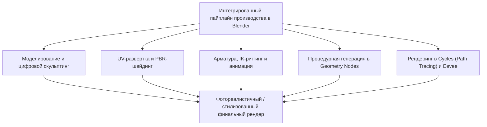
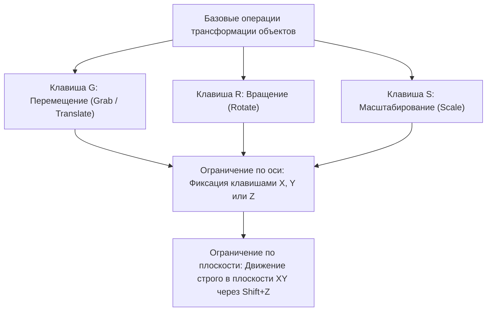
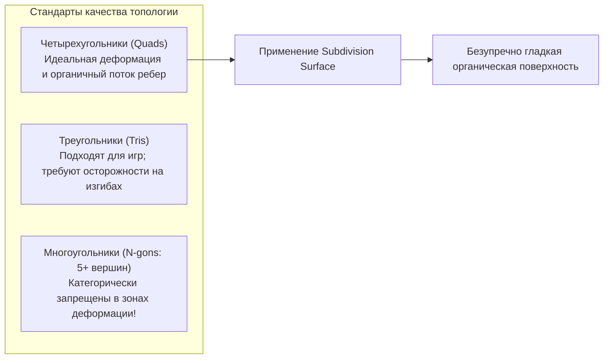
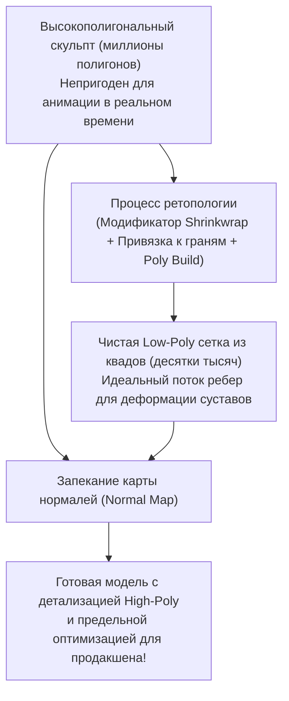
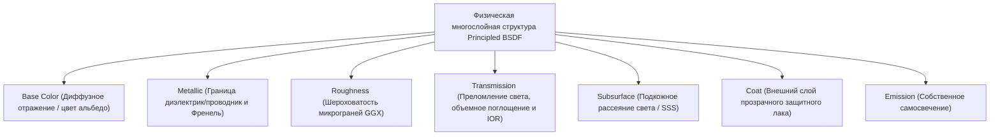
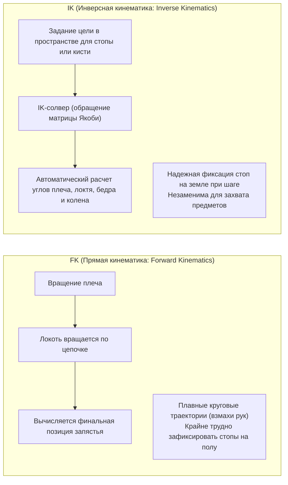
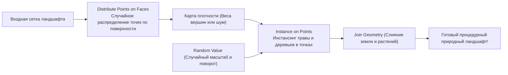
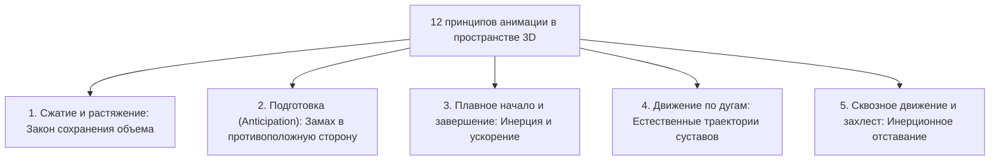
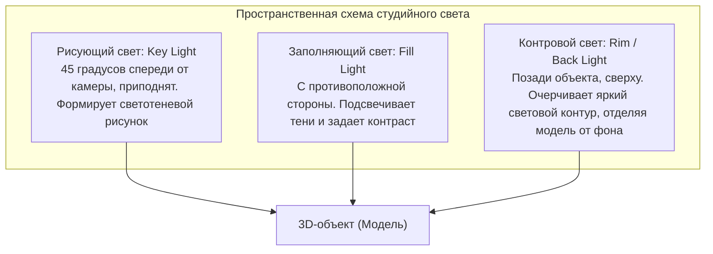

## 1. Введение: Blender как революция свободного программного обеспечения в 3DCG

### 1.1 Тон Розендал и легендарная история фонда Blender Foundation

Появившись в начале 1990-х годов как внутренний инструмент голландской анимационной студии NeoGeo, «Blender» превратился в мощнейший в мире открытый пакет трехмерной графики. Сегодня он составляет фундамент глобальной индустрии цифровых развлечений, геймдева, голливудских визуальных эффектов (VFX), архитектурной визуализации и передовых академических исследований.

История создания пакета полна драматизма. После банкротства NeoGeo права на интеллектуальную собственность Blender перешли к кредиторам, и проект оказался на грани окончательного закрытия. В 1998 году создатель программы Тон Розендал (Ton Roosendaal) основал фонд «Blender Foundation» и инициировал беспрецедентную краудфандинговую кампанию. Собрав 100 000 евро в виде пожертвований от художников по всему миру, он выкупил исходный код у кредиторов. 13 октября 2002 года Blender был официально передан человечеству под свободной лицензией GNU General Public License (GPL).

В то время как дорогостоящее проприетарное ПО (такое как Maya, 3ds Max или Cinema 4D) требует ежегодных подписок на тысячи долларов, Blender неизменно верен своему благородному идеалу: **«Никого не исключать; предоставлять передовые инструменты создания графики всем художникам планеты, навсегда и абсолютно бесплатно»**.



---

### 1.2 Масштабное обновление интерфейса 2.80 и завоевание статуса индустриального стандарта в 4.x

Долгие годы профессиональные художники избегали Blender из-за крайне специфичного и непривычного интерфейса — в частности, печально известного выделения правой кнопкой мыши по умолчанию.

Однако релиз «Blender 2.80» в 2019 году произвел тектонический сдвиг в индустрии компьютерной графики: интерфейс был полностью переработан, выделение левой кнопкой мыши стало стандартом, а вьюпорт обзавелся движком реального времени «Eevee». Крупнейшие технологические гиганты мира — Epic Games (Unreal Engine), Ubisoft, Unity, NVIDIA, AMD, Apple, Microsoft и Amazon — один за другим присоединились к фонду развития Blender в качестве корпоративных спонсоров.

В современном поколении «Blender 4.x», с внедрением системы управления цветом AgX по умолчанию, механизма Light Linking (привязка источников света), физически выверенного Principled BSDF v2 и колоссального расширения Geometry Nodes, программа уверенно заняла позиции основного производственного инструмента в ведущих коммерческих студиях.

---

## 2. Базовая архитектура, пользовательский интерфейс и горячие клавиши

Главный барьер при освоении Blender — и одновременно фактор, обеспечивающий недосягаемую для других пакетов скорость работы после изучения — заключается в его «строго выверенной системе управления на базе горячих клавиш».

### 2.1 Декартова система координат и пространственные трансформации в 3D

Виртуальное трехмерное пространство Blender определяется декартовой системой координат ($X$: Влево/Вправо / Красный, $Y$: Вперед/Назад / Зеленый, $Z$: Вверх/Вниз / Синий), основанной на правиле правой руки.



- **Режимы пространственной ориентации**:
  - **Global**: Абсолютные координаты всего виртуального мира.
  - **Local**: Относительные координаты, привязанные к собственному повороту объекта (двойное нажатие $Z$ перемещает объект вдоль его локальной оси $Z$).
  - **Normal**: Система координат, ориентированная строго по нормалям выбранных граней.
- **Точки привязки трансформации (Pivot Point)**:
  - Центр габаритного контейнера (Bounding Box), медианная точка (Median Point), индивидуальные центры, активный элемент и незаменимый **«3D-курсор»**.
  - 3D-курсор (размещаемый в любой точке пространства комбинацией Shift + Правый клик) служит произвольным центром вращения или точкой создания новых примитивов, обеспечивая молниеносный темп моделирования.

---

### 2.2 Восемь фундаментальных горячих клавиш в режиме редактирования (Edit Mode)

Выбрав объект и нажав `Tab`, пользователь переходит из «Объектного режима» в «Режим редактирования», где манипулирует полигональной геометрией напрямую. Основа моделирования строится на восьми сочетаниях:

| Клавиши | Функция | Внутренняя механика и ключевые опции |
| :---: | :--- | :--- |
| **`E`** | **Экструдирование (Extrude)** | Вытягивает выбранные грани, ребра или вершины вдоль их нормалей (или указанной оси), создавая новую геометрию. `Alt + E` открывает меню экструдирования отдельных граней или вдоль нормалей. |
| **`I`** | **Вставка граней (Inset)** | Создает концентрические грани внутри выделения с равномерным отступом от краев. Базовый прием для создания фасок, пазов и панелей. |
| **`Ctrl + B`** | **Фаска (Bevel)** | Срезает острые ребра под углом. Прокрутка колесика мыши добавляет сегменты, образуя округлую форму. Клавиша `V` включает снятие фаски с вершин. |
| **`Ctrl + R`** | **Кольцевой разрез (Loop Cut)** | Вставляет непрерывный контур ребер вдоль четырехсторонней топологии сетки. Колесико задает число разрезов; после клика доступно скольжение. |
| **`K`** | **Нож (Knife)** | Позволяет интерактивно разрезать полигоны произвольными прямыми линиями. `C` привязывает углы; `Z` активирует сквозной разрез скрытой геометрии. |
| **`Alt + M` / `M`** | **Слияние (Merge)** | Объединяет несколько выбранных вершин в одну («В центре», «В позиции курсора», «К первой/последней»). Опция Auto Merge автоматически сваривает близлежащие вершины. |
| **`GG`** | **Скольжение вершины / ребра** | Выделив вершину или ребро и дважды нажав `G`, можно перемещать элемент вдоль соседних ребер с полным сохранением исходной кривизны формы. |
| **`F`** | **Создание ребра / грани (Make Edge/Face)** | Соединяет две вершины ребром либо формирует полигональную грань из трех и более связанных вершин или ребер. |

---

## 3. Полигональное моделирование и вершина поверхностей подразделения

### 3.1 Законы топологии и абсолютный приоритет четырехугольников (Quads)

В полигональном 3D-моделировании грани классифицируются по числу образующих их вершин:
1. **Треугольники (Tris: 3 вершины)**: Всегда остаются плоскими и служат стандартом для движков реального времени, однако в алгоритмах подразделения и при скелетной деформации порождают нежелательные складки и артефакты (Pinching).
2. **Четырехугольники (Quads: 4 вершины)**: **Непререкаемый золотой стандарт профессионального моделирования**. Обеспечивают гармоничное направление потоков ребер (Edge Flow) и идеально сглаживаются алгоритмами подразделения.
3. **Многоугольники (N-gons: 5 и более вершин)**: За исключением строго плоских участков на ранних этапах, **сохранение N-гонов на искривленных или деформируемых поверхностях считается грубейшей ошибкой**. Алгоритмы сглаживания не могут однозначно триангулировать такие участки, что приводит к черным пятнам и дефектам шейдинга на рендере.

Кроме того, вершины, из которых выходит 5 и более ребер (E-полюсы) или только 3 ребра (N-полюсы), служат поворотными узлами (Poles) для направления реберных циклов. Умение уводить эти полюсы от суставов и мимических мышц лица вдоль анатомических волокон — главный признак профессионализма моделлера.



---

### 3.2 Математика поверхностей подразделения: метод Catmull-Clark

Плавные формы персонажей в кино и обтекаемые кузова суперкаров создаются применением модификатора **«Subdivision Surface»** (`Ctrl + 1~3`) к грубым низкополигональным болванкам.

Алгоритм Катмулла-Кларка (Catmull-Clark), разработанный в 1978 году Эдвином Катмуллом и Джимом Кларком, на каждом шаге итерации выполняет три базовых геометрических вычисления:

1. **Точка грани (Face Point)**: Барицентр всех вершин, составляющих грань:
   $$F = \frac{1}{n} \sum_{i=1}^n V_i$$
2. **Точка ребра (Edge Point)**: Среднее арифметическое двух концов ребра и точек граней (Face Points) двух смежных полигонов, разделяющих это ребро:
   $$E = \frac{V_1 + V_2 + F_1 + F_2}{4}$$
3. **Новая точка вершины (Vertex Point)**: Для исходной вершины $V$ ее смещенное положение $V'$ рассчитывается с учетом среднего значения $Q$ соседних точек граней, среднего значения $R$ середин примыкающих ребер и самой вершины с валентностью $n$:
   $$V' = \frac{Q + 2R + (n-3)V}{n}$$

При рекурсивном применении этого алгоритма угловатый каркас полигонов с математической точностью сходится к непрерывной гладкой предельной поверхности кубических B-сплайнов.

#### Опорные петли и вес ребер (Support Loops & Crease)
Для сохранения острых граней при сглаживании вплотную к основным структурным ребрам добавляют **опорные петли (holding / support loops)**. Чем меньше расстояние между параллельными ребрами, тем сильнее сдерживается округление алгоритма Catmull-Clark, что создает четкие механические блики на металле или пластике (также регулируется параметром жесткости Crease).

---

### 3.3 Недеструктивный пайплайн стека модификаторов (Modifier Stack)

Основополагающая сила моделирования в Blender заключается в **стеке модификаторов**, который накладывает параметрические трансформации в реальном времени без разрушения исходной геометрии.

| Модификатор | Категория | Механика работы и индустриальные стандарты |
| :--- | :---: | :--- |
| **Mirror (Симметрия)** | Генерация | Отражает сетку относительно оси (обычно X). Опция «Clipping» намертво сваривает вершины на центральной оси. Фундамент моделирования персонажей и техники. |
| **Array (Массив)** | Генерация | Тиражирует геометрию с заданным шагом смещения или вращения (Object Offset). Позволяет процедурно создавать лестницы, цепи, ограждения и радиальные массивы болтов. |
| **Boolean (Булевы операции)** | Генерация | Выполняет операции над объемами (Объединение, Разность, Пересечение). Имеет режимы Exact и Fast. Моментально вырезает пазы и отверстия в hard-surface моделировании. |
| **Solidify (Объемность)** | Генерация | Придает равномерную физическую толщину плоским поверхностям вдоль нормалей. Незаменим для одежды, стеклянной посуды и кузовных деталей. |
| **Bevel (Фаска)** | Редактирование | Недеструктивно сглаживает острые углы по весу или угловому порогу ($\ge 30^\circ$). Формирует реалистичные блики на ребрах без раздувания полигонажа. |
| **Weighted Normal** | Модификация | Пересчитывает нормали вершин в пользу крупных плоскостей перед мелкими фасками. Устраняет артефакты затенения на low-poly деталях без использования сглаживания Subsurf. |

---

## 4. Цифровой скульптинг и ретопология

Режим скульптинга («Sculpt Mode») дает художнику ощущение лепки из цифровой глины и идеально подходит для создания существ, анатомии и складок ткани.

### 4.1 Характеристики основных кистей скульптинга

- **Draw**: Наращивает геометрию вдоль нормалей; с зажатым `Ctrl` выдавливает канавки внутрь.
- **Clay Strips**: Накладывает прямоугольные полосы глины, позволяя быстро закладывать скелетную основу и объемы мышц.
- **Grab**: Захватывает и смещает обширные участки сетки для динамичной коррекции силуэта и пропорций.
- **Crease**: Прорезает глубокие резкие складки, необходима для морщин кожи и драпировок одежды.
- **Smooth**: Сглаживает неровности поверхности (доступна мгновенно из любой кисти при удержании `Shift`).
- **Inflate**: Раздувает выделенную зону наружу во всех направлениях наподобие воздушного шара.

---

### 4.2 Динамическая топология (Dyntopo) против Voxel Remesh

При скульптинге моделей с десятками миллионов полигонов управление плотностью сетки становится ключевой задачей.

1. **Динамическая топология (Dyntopo)**:
   - В реальном времени локально дробит треугольники только под кончиком кисти.
   - Позволяет детализировать микроэлементы (веки, поры, пальцы), не нагружая полигонами остальное тело.
2. **Воксельный ремеш (Voxel Remesh: `Ctrl + R`)**:
   - Разбивает все трехмерное пространство на регулярную сетку кубических вокселей (например, $0,01\,\text{м}$), полностью перестраивая модель в изотропную сетку из четырехугольников.
   - Моментально сплавляет стыки деталей, объединенных булевыми операциями, ликвидируя растянутые полигоны и возвращая сетку к состоянию монолитной глины.

---

### 4.3 Теория и практика ретопологии

Высокополигональные скульпты (миллионы полигонов) обладают чрезмерным объемом данных, что исключает их прямое внедрение в игровые движки и скелетную анимацию.

**«Ретопология»** — это процесс ручного построения оптимизированной низкополигональной сетки (от нескольких тысяч до десятков тысяч квадов), прилегающей к поверхности скульпта, с корректным анатомическим направлением ребер.



1. Активировать модификатор **Shrinkwrap** в связке с привязкой к граням (**Face Project**).
2. Заложить концентрические циклы ребер вокруг зон активной мимики (глазницы, рот, крылья носа).
3. Соединить потоки ребер от челюсти к шее и плечам; встроить тройные поддерживающие кольца на коленях и локтях для предотвращения потери объема при сгибании.
4. По завершении микрорельеф скульпта (поры, мелкие морщины) переносится на легкую модель путем запекания в **карту нормалей (Normal Map)**.

---

## 5. Шейдинг материалов и физически корректный рендеринг (PBR)

Создание материалов в Blender осуществляется в нодовом редакторе Shader Editor. Стандарт современной индустрии «PBR (Physically Based Rendering)» симулирует электромагнитное поведение света (отражение, преломление, поглощение, рассеяние) на основе законов волновой оптики.

### 5.1 Математический анализ Principled BSDF v2

Универсальный шейдерный узел Blender «Principled BSDF» базируется на модели Disney Principled BRDF 2012 года и получил глубокую модернизацию в Blender 4.0 для строгого соблюдения энергетического баланса микрограней.



1. **Base Color (Базовый цвет / Альбедо)**:
   - Для диэлектриков (изоляторов): отражает диффузный цвет фотонов, проникших под поверхность, рассеявшихся внутри и вышедших обратно.
   - Для металлов (проводников): свет внутри поглощается свободными электронами, диффузная составляющая равна нулю. Base Color напрямую задает цвет зеркального отражения при нормальном падении ($F_0$) (золото — желтое, медь — красноватая).
2. **Metallic (Металличность: $0.0 \sim 1.0$)**:
   - В природе материалы бинарны: либо **диэлектрики (Metallic = 0.0)**, либо **металлы (Metallic = 1.0)**. Промежуточные значения (например, 0.5) физически не существуют, за исключением микроскопических слоев пыли или ржавчины.
3. **Roughness (Шероховатость)**:
   - Управляет дисперсией функции распределения микрограней GGX.
   - $0.0$: Абсолютное зеркало (лучи отражаются без рассеяния).
   - $1.0$: Предельная шероховатость (свет рассеивается изотропно во всех направлениях, как у мела или сухой глины).
4. **IOR (Коэффициент преломления)**:
   - Определяет угол преломления света по закону Снеллиуса ($n_1 \sin \theta_1 = n_2 \sin \theta_2$).
   - Воздух: $1.0003$, вода: $1.333$, акрил: $1.49$, оконное стекло: $1.52$, алмаз: $2.417$.
5. **Подкожное рассеяние (Subsurface Scattering / SSS)**:
   - Происходит в полупрозрачных средах (кожа, мрамор, воск, молоко, нефрит), где свет проникает в толщу, испытывает хаотичные столкновения и выходит наружу на некотором удалении.
   - Человеческая кожа быстро поглощает синий спектр, тогда как красный свет глубоко проникает благодаря гемоглобину; поэтому на просвет уши и пальцы светятся алым (настраивается параметром Subsurface Radius для каждого RGB-канала).

---

### 5.2 UV-развертка и плотность текселей (Texel Density)

Для проецирования двумерных текстурных карт (цвет, шероховатость, нормали) на трехмерную геометрию без растяжений сетку разворачивают на плоскость — этот процесс называется **«UV-разверткой (UV Unwrapping)»**.

- **Расстановка швов (Seams)**:
  - Комбинация `Ctrl + E` $\rightarrow$ «Mark Seam (Пометить шов)».
  - Подобно портновским выкройкам, швы прячут в малозаметных местах (внутренняя сторона бедер, под волосами, вдоль позвоночника).
- **Соблюдение плотности текселей (Texel Density)**:
  - Количество пикселей текстуры на единицу физической длины в 3D-пространстве ($\text{px/cm}$).
  - Если на лицо выделено $20,48\,\text{px/cm}$, а на туловище — лишь $2,56\,\text{px/cm}$, разница в четкости текстур будет резать глаз. Все UV-островки нормализуются под единый масштаб и плотно упаковываются в квадрат $[0, 1]$.

---

## 6. Риггинг арматуры и механика анимации

Риггинг — это процесс построения внутренней иерархической скелетной системы («Арматуры»), позволяющей анатомически корректно деформировать статичную трехмерную сетку.

### 6.1 Математический конфликт: прямая (FK) и инверсная (IK) кинематика

Управление конечностями персонажа строится на двух противоположных математических подходах:



- **FK (Forward Kinematics)**: Вращение передается по иерархии от родительской кости к дочерней. Идеально подходит для свободных взмахов руками в воздухе, но при попытке присесть с опорой о землю ступни проваливаются сквозь пол, требуя покадровой ручной правки.
- **IK (Inverse Kinematics)**: Конечное звено (стопа или кисть) фиксируется в точке пространства, а **инверсный солвер (CCD-IK или FABRIK)** автоматически рассчитывает углы сгиба вышестоящих костей (бедро, голень). Необходима для походки, чтобы ноги жестко фиксировались на поверхности.
- **Полюс направления (Pole Target)**: Вектор, указывающий направление сгиба коленей или локтей, предотвращающий неестественный выворот суставов в обратную сторону.

---

### 6.2 Развесовка вершин (Weight Painting)

Определяет степень влияния ($0.0 \sim 1.0$, в палитре от синего $= 0$ через зеленый $= 0.5$ к красному $= 1.0$) каждой кости на вершины прилегающей сетки.
- Для естественного сгиба суставов внутренняя сторона сгиба требует резкого спада веса, а внешняя — плавного градиента для удержания объема.
- Сумма весов всех костей для каждой вершины обязательно нормализуется до $1.0$ («Normalize All»). Пренебрежение этим правилом ведет к разрывам сетки и искажению геометрии при анимации.

---

## 7. Революция процедурной генерации: Geometry Nodes

С версии Blender 3.0 технические художники получили в свое распоряжение **«Geometry Nodes»** — систему визуального нодового программирования, позволяющую процедурно и бесконечно генерировать сложнейшие геометрические структуры.

### 7.1 Концепция полей (Fields)

Geometry Nodes отказались от медленных поэлементных циклов в пользу потоковой модели «Fields». Данные передаются не в виде статичных полигонов, а в виде математических функций, оцениваемых глобально по всей геометрии.



### 7.2 Практический пример: процедурный лес в Geometry Nodes

1. Сетка земли подается на вход `Group Input`.
2. **Distribute Points on Faces**: Генерирует облако точек по поверхности методом Poisson Disk, задающим минимальное безопасное расстояние между объектами.
3. Нода **Noise Texture** подключается к сокету плотности (`Density`), создавая естественное чередование густых рощ и открытых полян.
4. **Instance on Points**: Инстансирует заготовки деревьев из коллекции (`Collection Info`) в сгенерированные точки.
5. **Rotate Instances / Scale Instances**: Нода **Random Value** вносит случайный поворот вокруг оси $Z$ ($0 \sim 2\pi$) и вариацию масштаба по нормальному распределению от $0.7$ до $1.3$.
6. Теперь при любой деформации рельефа в Edit Mode весь массив растительности адаптивно пересчитывается в реальном времени.

Благодаря **«Simulation Nodes»** прямо внутри Geometry Nodes можно симулировать колыхание травы на ветру, гравитационное падение песчинок, капли дождя и даже легкую гидродинамику.

---

## 8. Физика рендер-движков: Cycles против Eevee Next

Blender оснащен двумя современными рендер-движками под различные производственные задачи.

### 8.1 Cycles: Физика трассировки путей Монте-Карло (Path Tracing)

Cycles — это физически корректный, несмещенный (Unbiased) движок трассировки путей кинематографического уровня, моделирующий законы оптики с предельной точностью.

Движок испускает виртуальные лучи обратно из сенсора камеры в сцену, рассчитывая тысячи случайных переотражений в соответствии с BSDF материалов методом интегрирования Монте-Карло:

$$L_o(p, \omega_o) = L_e(p, \omega_o) + \int_{\Omega} f_r(p, \omega_i, \omega_o) L_i(p, \omega_i) (\omega_i \cdot n) d\omega_i$$

- Решая **уравнение рендеринга Каджии (Kajiya's Rendering Equation)**, движок естественным путем рассчитывает глобальное освещение, рассеяние цвета (color bleeding: красная стена мягко подкрашивает прилегающий белый пол), физическое преломление стекла, каустику и мягкие тени.
- **Шумоподавление на базе ИИ (Denoising)**: Стохастический шум Монте-Карло мгновенно устраняется нейросетями глубокого обучения (Intel Open Image Denoise / NVIDIA OptiX), что дает чистый рендер даже при умеренных сэмплах (от 128 до 512).

---

### 8.2 Eevee Next: Пик растрового рендеринга в реальном времени

Для работы с высокой частотой кадров во вьюпорте служит движок «Eevee».
Архитектура «Eevee Next» значительно улучшила экранные отражения (SSR), устранила лимиты разрешения теней с помощью виртуальных карт теней (VSM) и внедрила подповерхностное рассеяние в экранном пространстве вместе с затенением GTAO, выдавая картинку, близкую к Cycles, буквально за секунды.

---

### 8.3 Управление цветом: Наука за цветовым профилем AgX

Интегрированная по умолчанию в Blender 4.0 система управления цветом **«AgX»** решила проблему обесцвечивания и сдвига цветового тона в ярких бликах, характерную для старых профилей sRGB и Filmic.

Имитируя спектральную чувствительность колбочек человеческого глаза и логарифмическую кривую экспозиции (Log) кинопленки, AgX сохраняет чистый цветовой тон (Hue) даже при сильном пересвете благодаря плавному спаду яркости (roll-off). Пламя, неоновые вывески и освещенная солнцем кожа рендерятся с кинематографическим динамическим диапазоном.

---

## 6.4 Душа анимации: 12 принципов Диснея в 3D и F-кривые

Простая расстановка ключевых кадров (`I`) на костях приводит к неестественным роботоподобным движениям, проваливающим персонажа в «зловещую долину». Чтобы вдохнуть в анимацию жизнь, необходимо перенести **«12 базовых принципов анимации»**, выведенных в 1930-х годах легендарными аниматорами Walt Disney («Девять старцев»), в числовые графики редактора Graph Editor.



### 1. Сохранение объема при сжатии и растяжении (Squash and Stretch)
Ударяясь о землю, подпрыгивающий мяч сплющивается (Squash); отскакивая, вытягивается вдоль вектора скорости (Stretch).
- **Главный физический закон**: Во время любой деформации **общий объем тела обязан оставаться неизменным**.
- Если масштаб по оси $Z$ сжат до $0.5$, то по осям $X$ и $Y$ геометрия должна расшириться в $\sqrt{1 / 0.5} \approx 1.414$ раза. В Blender ограничитель кости «Stretch To» выполняет расчет сохранения объема автоматически.

### 2. Редактор Graph Editor и кубические сплайны Безье
Graph Editor отображает изменение параметров во времени в виде двумерных функциональных кривых («F-Curves»).
- **Линейная интерполяция**: Движение с постоянной скоростью, выглядящее безжизненно и механистично.
- **Интерполяция Безье**: Настройка рычагов касательных обеспечивает плавный разгон (Ease-In) и мягкое торможение (Ease-Out) по законам кубических полиномов.
- В цикле походки (Walk Cycle) сдвиг фаз колебаний таза, шага ног и взмахов рук на несколько кадров (захлест) воспроизводит естественное смещение центра тяжести человека.

---

## 7.5 Автоматизация и процедурные скрипты на Python API (`bpy`)

Ключевое достоинство архитектуры Blender — стопроцентная доступность всех внутренних функций, структур данных и элементов интерфейса через язык «Python». При наведении курсора на любую кнопку во всплывающей подсказке отображается путь к соответствующему свойству Python.

Открыв рабочее пространство `Scripting`, можно запускать скрипты для мгновенного математического моделирования сложнейших форм.

### Скрипт на Python: процедурная генерация ленты Мёбиуса
```python
import bpy
import math

# Очистка сцены от существующих полигональных объектов
bpy.ops.object.select_all(action='SELECT')
bpy.ops.object.delete()

# Геометрические параметры ленты Мёбиуса
R = 3.0           # Главный радиус
w = 1.0           # Полуширина ленты
u_segments = 120  # Число сегментов по окружности
v_segments = 20   # Число сегментов по ширине

verts = []
faces = []

for i in range(u_segments):
    u = 2.0 * math.pi * i / u_segments
    for j in range(v_segments + 1):
        v = -w + (2.0 * w * j / v_segments)
        
        # Параметрические уравнения ленты Мёбиуса
        x = (R + v * math.cos(u / 2.0)) * math.cos(u)
        y = (R + v * math.cos(u / 2.0)) * math.sin(u)
        z = v * math.sin(u / 2.0)
        
        verts.append((x, y, z))

# Генерация индексов граней
for i in range(u_segments):
    next_i = (i + 1) % u_segments
    for j in range(v_segments):
        p1 = i * (v_segments + 1) + j
        p2 = i * (v_segments + 1) + (j + 1)
        
        # Топологический разворот при замыкании кольца (полуоборот)
        if next_i == 0:
            p3 = next_i * (v_segments + 1) + (v_segments - (j + 1))
            p4 = next_i * (v_segments + 1) + (v_segments - j)
        else:
            p3 = next_i * (v_segments + 1) + (j + 1)
            p4 = next_i * (v_segments + 1) + j
            
        faces.append((p1, p2, p3, p4))

# Создание меша и добавление объекта в коллекцию сцены
mesh = bpy.data.meshes.new(name="Mobius_Strip_Mesh")
mesh.from_pydata(verts, [], faces)
mesh.update()

obj = bpy.data.objects.new(name="Mobius_Strip", object_data=mesh)
bpy.context.collection.objects.link(obj)

# Включение сглаженного затенения (Smooth Shading)
for poly in mesh.polygons:
    poly.use_smooth = True
```

Благодаря Python API (`bpy`) Blender выходит далеко за рамки классического редактора, выступая как мощная платформа для параметрической архитектуры, визуализации данных медицинской томографии и автоматической пакетной генерации синтетических датасетов для машинного обучения.

---

## 8.4 Физика студийного освещения и искусство композитинга

Даже безупречная сетка с выверенными PBR-материалами будет выглядеть блекло и дешево при непродуманной постановке света.

### 1. Классическая трехточечная схема освещения (Three-Point Lighting)
Проверенная временем основа для передачи объема, глубины и фактуры модели:



- **Коэффициент контраста (Рисующий к Заполняющему)**:
  - Коммерческий и светлый стиль: $2:1 \sim 3:1$ (Мягкие тени, ровное освещение).
  - Драматичный стиль и нуар (Film Noir): $8:1 \sim 16:1$ (Глубокие тени, высокий контраст).
- **Размер источника и мягкость полутеней (Shadow Penumbra)**:
  - Точечный источник света нулевого радиуса отбрасывает резкие жесткие тени (Hard Shadows).
  - Увеличение физической площади источника (софтбоксы, Area Lights) позволяет лучам огибать контуры, формируя мягкие полутени (Soft Shadows).

### 2. Кинематографический постпродакшн в нодовом Compositor
Необработанный рендер аналогичен цифровому негативу. Встроенный композитор Blender позволяет довести картинку до уровня кинотеатра:

1. **Нода Glare**: В режиме «Fog Glow» добавляет мягкое свечение в атмосфере (Bloom); в режиме «Streaks» имитирует горизонтальные блики анаморфотной оптики.
2. **Глубина резкости (Depth of Field)**: Через фокусное расстояние и диафрагму (F-Stop) симулирует оптическое боке (Bokeh), акцентируя взгляд на главном объекте.
3. **Хроматическая аберрация (Lens Distortion & Dispersion)**: Небольшое значение дисперсии ($0.01 \sim 0.02$) расслаивает спектры RGB по краям кадра, избавляя сцену от стерильной «компьютерности» и придавая теплоту настоящей кинолинзы.

---

## 8.5 Динамика физических симуляций

Blender оснащен несколькими вычислительными движками, симулирующими законы классической механики:

1. **Динамика твердых тел (Rigid Body)**:
   - Рассчитывает столкновения, отскоки, трение и падение конструкций по законам механики Ньютона.
   - Объекты делятся на «Active» (подвижные под действием сил) и «Passive» (неподвижные препятствия), с формами коллизий от «Convex Hull» до точного «Mesh».
2. **Симуляция ткани (Cloth)**:
   - Моделирует ткани, одежду и флаги через систему связанных масс и пружин (Mass-Spring System).
   - Настройка упругости, сопротивления изгибу и активация самоколлизий («Self-Collision») исключают проваливание ткани в саму себя.
3. **Гидродинамика и дым (Mantaflow)**:
   - Высокоточные расчеты на основе уравнений Навье-Стокса.
   - Запекает в воксельном объеме (Domain) брызги жидкостей, взрывы, фронты пламени и турбулентные вихри газа (Vorticity).

---

## 9. Заключение: будущее 3D-художников и горизонты, открытые Blender

Освоение Blender — это захватывающее путешествие, где соединяются математика, оптика, анатомия, колористика и чистое художественное вдохновение.

С того момента, как удаляется базовый куб (Default Cube) и выдавливается первая вершина:
- Подразделение Catmull-Clark высекает живые органические формы;
- Физические шейдеры раскрывают взаимодействие света с материей;
- Арматура и кинематика наполняют тела движением;
- Geometry Nodes алгоритмически возводят бесконечные ландшафты;
- А трассировка путей Cycles преобразует потоки виртуальных фотонов в фотореалистичные полотна.

То, что раньше было доступно лишь на сверхдорогих рабочих станциях голливудских корпораций, сегодня бесплатно открыто каждому человеку, у которого есть ПК и Blender.

«Все, что можно вообразить, можно воплотить в форму».
Перед художником, расправившим крылья с Blender, простирается бескрайний космос творчества, границы которого определяются лишь силой его мысли и воображения.
