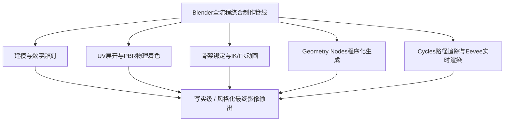
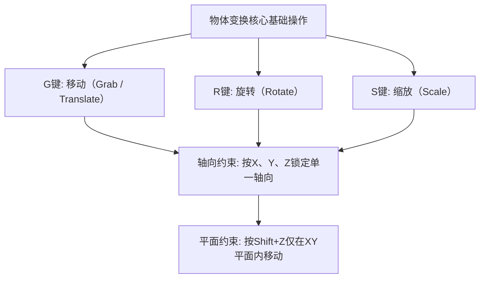
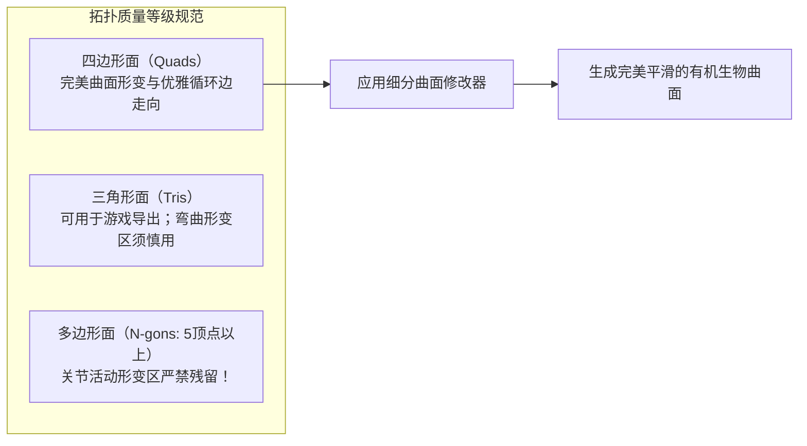
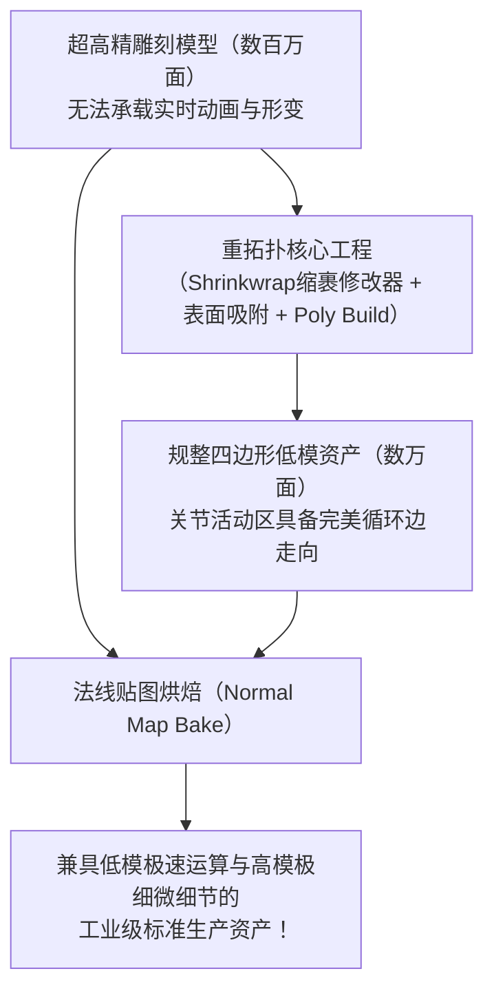
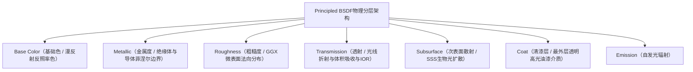
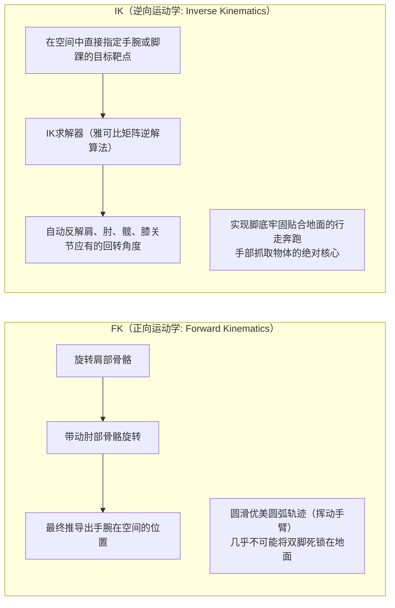
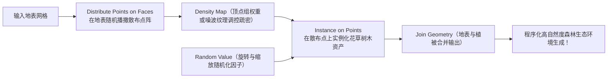
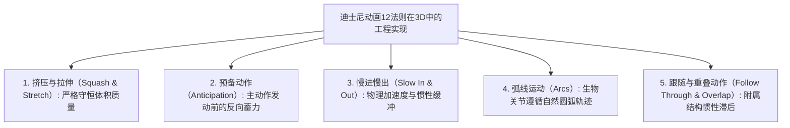
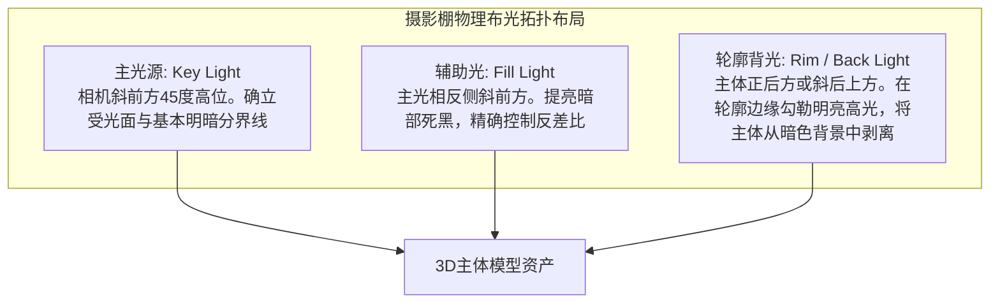

## 1. 引言：作为开源3DCG革命的Blender

### 1.1 托恩·罗斯达尔与Blender基金会的传奇历史

20世纪90年代初诞生于荷兰动画工作室NeoGeo内部工具的“Blender”，如今已演进为支撑全球数字娱乐产业、游戏开发、好莱坞视觉特效（VFX）、建筑可视化及前沿学术研究的全球最强开源3DCG套件。

其发展历程堪称波澜壮阔的奇迹。伴随NeoGeo的破产，Blender的知识产权一度被债权人扣押，项目濒临彻底停滞。1998年，创始人托恩·罗斯达尔（Ton Roosendaal）成立了“Blender基金会”，并发起了一场史无前例的众筹行动。来自全球各地的创作者慷慨解囊，筹集了10万欧元从债权人手中购回源代码。2002年10月13日，Blender在GNU通用公共许可证（GPL）下正式向全世界完全开源。

当昂贵的商业专有软件（如Maya、3ds Max、Cinema 4D等）收取每年高昂的订阅费时，Blender始终坚守着其崇高的核心信念： **“不排斥任何人，永久免费向全球所有艺术家提供最顶尖的创作工具。”**



---

### 1.2 2.80界面革新与4.x世代步入行业工业标准

长期以来，Blender因“右键选择”等极其特立独行且陡峭的交互界面，一度令主流商业艺术家望而却步。

然而，2019年发布的“Blender 2.80”彻底重构了UI交互逻辑，将左键选择确立为默认标准，并推出了革命性的实时PBR视口引擎“Eevee”，在CG行业掀起了前所未有的地壳运动。Epic Games（虚幻引擎）、育碧（Ubisoft）、Unity、NVIDIA、AMD、苹果（Apple）、微软（Microsoft）、亚马逊（Amazon）等全球科技巨头纷纷宣布注资Blender发展基金（成为企业赞助人）。

如今进入“Blender 4.x”时代，随着AgX色彩管理系统的默认集成、灯光链接（Light Linking）、Principled BSDF v2物理重构以及Geometry Nodes功能的爆发式增长，Blender已堂堂正正成为众多国际一线商业工作室的核心主力制作管线。

---

## 2. Blender基础架构与UI/快捷键体系

学习Blender初期的最大壁垒，同时也是一旦熟练后能带来超越任何其他CG软件极致工作流速度的精髓，正在于其“高度提炼的快捷键驱动型交互体系”。

### 2.1 3D空间的几何坐标系与变换操作

Blender的虚拟三维空间基于笛卡尔直角坐标系（$X$ 轴：左右/红，$Y$ 轴：前后/绿，$Z$ 轴：上下/蓝）构建，遵循右手定则。



- **坐标系模式切换** ：
  - **全局坐标（Global）** ：整个虚拟世界绝对的空间方向。
  - **局部坐标（Local）** ：以物体自身倾斜旋转角度为基准的相对坐标系（连按两次 $Z$ 即沿物体局部 $Z$ 轴移动）。
  - **法线坐标（Normal）** ：以选中几何表面的法线方向为基准的坐标系。
- **变换轴心点（Pivot Point）** ：
  - 边界框中心、质心点（Median Point）、各自原点（Individual Origins）、活动元素，以及灵魂核心 **“3D游标（3D Cursor）”** 。
  - 3D游标（通过 Shift + 右键可在空间中任意定位）不仅能作为临时的旋转缩放枢轴，还能充当新物体生成的基准原点，赋予了Blender独步天下的敏捷操作流。

---

### 2.2 编辑模式（Edit Mode）八大核心快捷键

选中网格物体并按下 `Tab` 键，即可从处理整体层级的“物体模式”切换至直接编辑多边形拓扑的“编辑模式”。网格几何塑形的核心由以下八个基础快捷键构成：

| 快捷键 | 功能名称 | 内部运行机制与实用进阶选项 |
| :---: | :--- | :--- |
| **`E`** | **挤出（Extrude）** | 沿着法线或指定轴向拉伸选中的面、边、顶点，生成全新的网格多边形。按 `Alt + E` 可调出“挤出各个面”及“沿法线挤出面”高级菜单。 |
| **`I`** | **内插面（Inset）** | 在选中面的内部生成具有均匀偏移边距的同心嵌套新面，是制作倒角边框与硬表面结构的基础。 |
| **`Ctrl + B`** | **倒角（Bevel）** | 对尖锐棱边执行非破坏性斜切倒角。滚动鼠标滚轮可动态增加细分段数以构建圆滑弧面。按 `V` 可切换为顶点倒角模式。 |
| **`Ctrl + R`** | **环切（Loop Cut）** | 顺应四边形拓扑结构，在整个网格模型上贯穿环绕切入循环边。滚动滚轮增加切割数量，左键确认后可自由滑移位置。 |
| **`K`** | **切割刀具（Knife）** | 在网格表面交互式自由连线切割多边形。按 `C` 启用角度捕捉约束，按 `Z` 开启穿透切割背面隐藏几何体。 |
| **`Alt + M` / `M`** | **合并（Merge）** | 将多个选中的顶点焊接到单一点（“到中心”、“到游标”、“到最初/最后选择点”）。开启自动合并（Auto Merge）可在顶点靠近时自动缝合。 |
| **`GG`** | **顶点/边滑移** | 选中顶点或边后连按两次 `G`，即可在严格保持既有几何表面倾角的前提下，像轨道滑块一样微调位置。 |
| **`F`** | **生成边/面（Make Edge/Face）** | 在选中的两个顶点间连接生成新边，或在三个以上顶点与边围成的封闭区域内生成多边形面。 |

---

## 3. 多边形建模与细分曲面极致之道

### 3.1 拓扑学（Topology）基本准则与四边形绝对法则

在3DCG多边形建模领域，面依据其构成的顶点数量划分为三大形态：
1. **三角形面（Tris: 3顶点）** ：永远保证共面性，实时游戏引擎最终输出阶段普遍将其三角化，但在细分算法与骨骼蒙皮变形中极易产生非预期的捏扭褶皱（Pinching）。
2. **四边形面（Quads: 4顶点）** ： **专业影视与工业建模中不可动摇的至高标准** 。循环边（Edge Flow）走向清晰明了，细分曲面算法下的计算最为纯净优雅，极耐形变。
3. **多边形面（N-gons: 5顶点及以上）** ：除了早期平坦区域的布尔过渡外， **在曲面区与关节活动区残留N-gon属于严重禁忌** 。细分算法无法明确界定内部拓扑划分，渲染时会引发灾难性的黑斑与阴影破损伪影。

此外，从单个顶点辐射出5条及以上边的汇聚点（E极点）或仅有3条边的汇聚点（N极点），是改变循环边走向的核心枢纽（Poles）。将这些极点移离关节形变区及面部肌肉表情活跃带，顺应解剖学肌理构建流畅的拓扑流，是衡量高阶建模师水平的关键标尺。



---

### 3.2 细分曲面（Catmull-Clark法）数学机制

电影级CG角色饱满柔和的皮肤以及流线型超级跑车的曲面车身，通常由低模基础网格应用 **“细分曲面修改器（Subdivision Surface）”** （`Ctrl + 1~3`）迭代计算而成。

Blender采用的Catmull-Clark细分算法由埃德温·卡特姆（Edwin Catmull）与吉姆·克拉克（Jim Clark）于1978年创立，在每一次迭代细分过程中执行以下三个核心公式计算：

1. **面中心点（Face Point）** ：计算该多边形面所有顶点的几何重心：
   $$F = \frac{1}{n} \sum_{i=1}^n V_i$$
2. **边中心点（Edge Point）** ：计算该边两端顶点以及共享该边的两个相邻面的面中心点之算术平均：
   $$E = \frac{V_1 + V_2 + F_1 + F_2}{4}$$
3. **新顶点位置（Vertex Point）** ：针对原始顶点 $V$，结合其邻接的 $n$ 个面的面点平均值 $Q$、邻接 $n$ 条边的中点平均值 $R$，以及顶点本身的权重计算其收敛坐标 $V'$：
   $$V' = \frac{Q + 2R + (n-3)V}{n}$$

通过递归迭代执行该算法，棱角分明的粗糙网格在数学层面精确收敛为平滑连续的三次B样条极限曲面。

#### 支撑环边与折痕权重（Crestlines & Support Loops）
在应用细分曲面时，为了保持硬表面锐利的机械转折棱角，必须在主结构边缘极近距离处嵌入 **“支撑环边（Holding / Support Loops）”** 。两条平行边距离越紧密，Catmull-Clark的倒角圆滑扩散效应受限越显著，从而呈现出金属或注塑塑料挺拔刚劲的高光转折（亦可通过Crease折痕权重进行参数化非破坏性控制）。

---

### 3.3 修改器堆栈（Modifier Stack）的非破坏性工作流

Blender建模的核心灵魂，在于无需破坏（固化）底层原始网格，便能在参数化视口中实时层叠几何变形的 **“修改器堆栈”** 。

| 修改器名称 | 分类 | 运行机制与一线工业最佳实践 |
| :--- | :---: | :--- |
| **Mirror（镜像）** | 生成 | 跨越指定对称轴（通常为X轴）实时生成双向镜像网格。勾选“Clipping（剪裁）”可使中心缝合处的顶点完全锁死融合，是角色与载具建模的绝对核心。 |
| **Array（阵列）** | 生成 | 按照固定偏移间距、物体偏移（Object Offset）旋转进行大量多重克隆。参数化一键生成楼梯、锁链、栏杆及环形齿轮螺栓阵列。 |
| **Boolean（布尔）** | 生成 | 执行网格实体几何布尔求并集、差集、交集。提供Exact（精确）与Fast（快速）两种解算内核。在硬表面建模中实现瞬间开槽打孔。 |
| **Solidify（实体化）** | 生成 | 为零厚度的单层薄壳网格沿表面法线方向赋予均匀的实体壁厚。广泛用于衣物布料、玻璃器皿及汽车钣金冲压件厚度构建。 |
| **Bevel（倒角）** | 编辑 | 基于权重（Weight）或角度阈值（Angle，通常 $\ge 30^\circ$）对尖锐边执行非破坏性倒角，在不增加基础面数的前提下呈现真实的边缘物理高光反光。 |
| **Weighted Normal（加权法线）** | 修改 | 赋予大面积平面以更高权重重新计算顶点法线。彻底消除低模硬表面倒角平面的黑斑阴影失真，无需Subsurf即可获得如镜面般平直的高光反射。 |

---

## 4. 数字雕刻与重拓扑

在“雕刻模式（Sculpt Mode）”下，艺术家如同揉捏真实的数字黏土，直观塑造复杂的生物肌肉动态、怪兽骨骼与皮肤褶皱。

### 4.1 核心雕刻笔刷特性解析

- **Draw（绘制）** ：沿表面法线挤出隆起，按住 `Ctrl` 变为向内凹陷刻画。
- **Clay Strips（黏土条）** ：如同堆叠矩形黏土片，能极度迅速地搭建大型骨骼形体与肌肉体积块面。
- **Grab（抓取）** ：大范围抓取并拖拽网格局部，大刀阔斧地调整生物体态剪影与结构比例。
- **Crease（折缝）** ：刻画深陷锐利的沟槽与褶皱，是表现眼角细纹与衣物布褶的必备笔刷。
- **Smooth（平滑）** ：迅速熨平表面微小杂乱凹凸（在任何笔刷状态下按住 `Shift` 均可快速调用）。
- **Inflate（膨胀）** ：如同充气气球般将所选区域沿全向法线向外膨胀扩张。

---

### 4.2 动态拓扑（Dyntopo）对比体素重构网格（Voxel Remesh）

在雕刻数百万多边形的高精细模型时，网格密度的动态调度是成败关键。

1. **动态拓扑（Dyntopo）** ：
   - 仅在笔刷划过的局部笔触区域实时自适应加密细分三角形面。
   - 在保持躯干等大部分网格低负载的前提下，精准针对眼眶、耳廓、手指等局部细节进行超高密度雕刻。
2. **体素重构（Voxel Remesh: `Ctrl + R`）** ：
   - 将整个3D空间划分为均匀微小的立方体素网格（如 $0.01\,\text{m}$），将全模型重新解构为各向同性的纯四边形网格。
   - 瞬间熔合布尔运算拼接的散落构件缝隙，一键消解极度拉伸撕裂的多边形，重置为均匀受力的原始数字黏土状态。

---

### 4.3 重拓扑（Retopology）的理论与工程落地

经雕刻完成的高精数字资产（动辄数百万乃至数千万多边形）因数据量极其庞大且缺乏规范拓扑流，既无法在游戏引擎中实时计算，也无法直接承载骨骼蒙皮动画形变。

**“重拓扑”** 即在吸附贴合高精模型外轮廓表面的基础上，完全手工以规整精炼的四边形面（通常数千至数万面）重建符合形变动力学的优雅拓扑网格。



1. 启用 **Shrinkwrap（缩裹修改器）** 与 **Face Project（面投影吸附）** 功能。
2. 在眼眶、口轮匝肌、鼻翼等高形变表情区构建同心环形循环边。
3. 将下颌线引导至颈部、锁骨，并在手肘、膝盖等弯折关节处严密埋设三道保护环边（关节环），防止大角度弯折时几何体发生体积缩瘪坍塌。
4. 完成后，高模表面的微小毛孔与微观皮肤褶皱将通过 **法线贴图（Normal Map）** 烘焙至低模表面。

---

## 5. 材质着色与基于物理渲染（PBR）的科学原理

Blender的材质表现力依托节点式“着色器编辑器（Shader Editor）”构建。现代CG工业基石“PBR（Physically Based Rendering: 基于物理的渲染）”，严格遵循麦克斯韦电磁学及光学守恒定律，模拟光线在微观界面的反射、折射、吸收与散射。

### 5.1 原理化BSDF（Principled BSDF v2）深度数理解析

Blender的核心全能着色节点“Principled BSDF”以迪士尼在2012年发表的“Disney Principled BRDF”为蓝本，并在Blender 4.0中针对微表面微观能量守恒体系进行了全面物理重构。



1. **Base Color（基础色 / 反照率 Albedo）** ：
   - 绝缘体（非金属）：代表进入介质浅表层后经多次散射再逃逸出的“漫反射光颜色”。
   - 导体（金属）：光线穿入金属内部会被自由电子碰撞完全吸收，其漫反射恒为零。Base Color 直接决定其表面镜面反射率（$F_0$ 反射色彩，如黄金的耀黄、紫铜的赤红）。
2. **Metallic（金属度: $0.0 \sim 1.0$）** ：
   - 物理自然界中的物质在电磁学上是严格二元的：要么是 **非金属（绝缘体：Metallic = 0.0）** ，要么是 **纯金属（导体：Metallic = 1.0）** 。除灰尘覆盖过渡带或微观锈蚀外，绝对不存在0.5这类中间态。
3. **Roughness（粗糙度）** ：
   - 决定GGX微表面法线分布函数的离散程度。
   - $0.0$：完全理想镜面（入射光线沿单一镜面反射角集中射出）。
   - $1.0$：极限粗糙微表面（光线漫射至全向半球空间，呈现如粉笔或干黏土般的消光质感）。
4. **IOR（Index of Refraction: 折射率）** ：
   - 基于斯涅尔定律（Snell's Law: $n_1 \sin \theta_1 = n_2 \sin \theta_2$）的光线折射偏折比。
   - 空气：$1.0003$、水：$1.333$、亚克力：$1.49$、普通窗户玻璃：$1.52$、钻石：$2.417$。
5. **次表面散射（Subsurface Scattering / SSS）** ：
   - 光线射入半透明介质（皮肤、大理石、蜡、牛奶、翡翠）内部，经无数次微观碰撞散乱后再折射出表面的物理现象。
   - 人体皮肤表层对短波蓝光吸收迅速，而富含血红蛋白的深层真皮允许长波红光深度穿透，从而在逆光照射下呈现耳垂与指尖通透温润的血红光晕（通过 Subsurface Radius 分别设定RGB三通道散射距离）。

---

### 5.2 UV展开与纹素密度（Texel Density）

要将二维位图纹理（颜色、粗糙度、法线贴图）无畸变贴合至三维曲面，必须执行如裁剪剥开纸模般的 **“UV展开（UV Unwrapping）”** 。

- **接缝（Seam）标定策略** ：
  - 快捷键 `Ctrl + E` $\rightarrow$ “标记缝合边（Mark Seam）”。
  - 效仿服装裁剪工艺，接缝应隐蔽规划在摄像机盲区（大腿内侧、发际线内部、角色背脊正中）。
- **统一纹素密度（Texel Density）** ：
  - 指单位3D空间物理尺寸（如 $1\,\text{cm}$）所分配的2D纹理像素数量（如 $\text{px/cm}$）。
  - 若角色头部纹素密度达到 $20.48\,\text{px/cm}$，而躯干仅有 $2.56\,\text{px/cm}$，并置时将产生致命的画质分辨率割裂感。必须确保全部UV岛统一缩放至等同纹素密度，并紧密排列填充在 $[0, 1]$ UV象限内。

---

## 6. 骨架绑定与角色动画力学

将静止的3D数字模型转化为生动鲜活的受控有机体，其核心枢纽即为工程化构建内部骨架层级的“绑定（Rigging）”技术。

### 6.1 正向运动学（FK）与逆向运动学（IK）的数学对立统一

控制生物四肢运动存在两套截然相反的运动学几何解算体系：



- **FK（正向运动学）** ：旋转由父级骨骼顺次向下传递至子级。极其适合在空中自由舞动形成优美圆弧轨迹的挥手动作，但在制作脚踏地面弯腰动作时，腰部下沉会导致脚底骨骼瞬间穿透地面，需要无休止地逐帧反向修正。
- **IK（逆向运动学）** ：末端骨骼（脚踝或手腕）锚定在空间指定坐标， **IK反向求解器（如CCD-IK或FABRIK算法）** 自动逆向推导大腿、小腿各关节所需的弯曲转角。这是制作角色真实行走脚步踩实地面的不可或缺之法。
- **极向目标（Pole Target）** ：在IK解算中用于约束膝盖或手肘弯曲朝向的外部空间定向向量（极向骨骼），防止四肢在极端姿态下发生反关节反向折断。

---

### 6.2 权重绘制（Weight Painting）

定义各根骨骼旋转位移时，网格表面各个顶点跟随联动的位移比例（范围 $0.0 \sim 1.0$，以蓝 $= 0$、绿 $= 0.5$、红 $= 1.0$ 的热力色谱直观展现）。
- 为实现关节自然弯曲，肘部与膝盖内侧需采用陡峭紧凑的权重分界，外侧则施加平缓柔和的渐变过渡。
- 每个顶点关联的所有骨骼权重之和必须通过“全部规格化（Normalize All）”严格强制锁定为 $1.0$。否则在骨骼旋转时将发生顶点炸裂或几何坍塌拉扯。

---

## 7. 程序化生成的革命：Geometry Nodes（几何节点）

自Blender 3.0起引发全球技术美术（Technical Artist）狂热追捧的，正是以类编程逻辑联结节点，便能算法化无穷派生复杂3D形态的 **“Geometry Nodes”** 。

### 7.1 字段（Fields）数据流体系

Geometry Nodes 彻底摒弃了传统逐点逐面串行循环的笨重设计，采用前沿的“字段（Fields）”架构。节点间流转的并非单纯的具体几何拓扑实体，而是“在整个几何上下文上求值的数学函数表达式”。



### 7.2 实战范例：程序化森林生态生成节点链

1. 地表网格作为基础几何输入（Group Input）。
2. **Distribute Points on Faces** ：在地表表面基于泊松盘（Poisson Disk）采样散布随机点云，保证生成植株间维持设定的最小安全间距。
3. 将 **Noise Texture（噪波纹理）** 节点的因子输入连接至点云的密度输入（Density），自然分离出林木茂密的树丛与空旷平整的林间空地。
4. **Instance on Points** ：将预先建模的多种树木集合（Collection Info）随机实例化锚定在各个点上。
5. **Rotate Instances / Scale Instances** ：挂接 **Random Value** 随机值节点，让树木 $Z$ 轴旋转在 $0 \sim 2\pi$ 均匀分布，缩放系数在 $0.7 \sim 1.3$ 呈正态波动。
6. 一旦搭建完成，艺术家仅需在编辑模式下拖拽修改地貌起伏，整片森林便会实时动态自适应更新拓扑分布。

在最新的 **“Simulation Nodes（模拟节点）”** 支持下，随风摇曳的草浪、重力沙漏颗粒沉降、雨滴涟漪溅射乃至轻量流体运算均可完全闭环在几何节点内部。

---

## 8. 渲染引擎物理机制：Cycles vs. Eevee Next

Blender内置了两款面向不同工业诉求的顶尖渲染引擎。

### 8.1 Cycles：蒙特卡洛路径追踪（Path Tracing）物理本质

Cycles是一款遵循物理法则的无偏路径追踪（Unbiased Path Tracing）影视级渲染引擎。

引擎从虚拟摄像机传感器发射逆向视线（Ray），穿透三维场景，在几何表面依据材质BSDF概率函数发生数千次随机漫射与镜面弹跳，并通过蒙特卡洛积分求解渲染方程：

$$L_o(p, \omega_o) = L_e(p, \omega_o) + \int_{\Omega} f_r(p, \omega_i, \omega_o) L_i(p, \omega_i) (\omega_i \cdot n) d\omega_i$$

- 求解 **卡吉亚渲染方程（Kajiya's Rendering Equation）** ，使得全局光照（GI）、颜色溢出（Color Bleeding：红色墙壁将相邻白地板自然浸染微红）、真实复杂玻璃折射、焦散光斑与物理软阴影均无需任何光栅化技巧即自然涌现。
- **AI智能降噪（Denoising）** ：原生集成 Intel Open Image Denoise（OIDN）与 NVIDIA OptiX 深度学习算法，瞬间抹平蒙特卡洛前期随机采样的颗粒噪点，在极低采样数（128至512次采样）下输出纯净剔透的超高精图像。

---

### 8.2 Eevee Next：实时光栅化渲染的工业极限

提供如游戏引擎般每秒数十帧极速交互视口预览的即为“Eevee”。
全新“Eevee Next”引擎全面进化了屏幕空间反射（SSR），引入解除分辨率瓶颈的虚拟阴影贴图（Virtual Shadow Maps: VSM），融合屏幕空间次表面散射与真实环境光遮蔽（GTAO），在数秒内即可输出逼近Cycles质感的超高画质帧。

---

### 8.3 色彩管理：AgX色彩科学革命

Blender 4.0起被确立为行业默认标准的 **“AgX”色彩管理系统** ，彻底终结了以往sRGB与Filmic在超高亮度曝光区域导致色彩严重扭曲、过早饱和并陡然惨白“死白”的致命缺陷。

AgX深刻模拟了人眼视网膜视锥细胞的光谱感应特性与现代柯达电影胶片的对数感光曲线（Log），在高亮区域维持色相（Hue）纯净稳定的同时施加优雅顺滑的高光滚降（Highlight Roll-off）。烈焰燃烧、霓虹高亮与阳光下的通透肤色得以保留电影胶片般的丰富宽容度与情绪张力。

---

## 6.4 动画的灵魂：迪士尼12法则在3D中的工程实现与F曲线插值

在三维空间中仅仅对骨骼插入关键帧（`I` 键），动作必然呈现如同冰冷木偶般的“恐怖谷”僵硬感。赋予角色生命活力的基石，在于将沃尔特·迪士尼九大长老（Nine Old Men）于20世纪30年代总结的 **“动画12条基础原则”** ，在Blender曲线编辑器中进行精确的数学化参数实现。



### 1. 挤压与拉伸（Squash and Stretch）的体积恒定法则
弹跳小球撞击地面的瞬间扁平挤压（Squash）；向上反弹的瞬间沿速度向量剧烈拉伸（Stretch）。
- **最严苛物理约束** ：形变过程中， **物体的总体积必须保持恒定（Volume Preservation）** 。
- 若 $Z$ 轴方向压缩至原尺寸的 $0.5$ 倍，为保持体积守恒，$X$ 轴与 $Y$ 轴必须同步放大 $\sqrt{1 / 0.5} \approx 1.414$ 倍。在Blender中，通过为骨骼挂载“Stretch To”骨骼约束，可全自动实时运算该体积恒定补偿。

### 2. 曲线编辑器（Graph Editor）与三次贝塞尔动力学
Blender的曲线编辑器将空间位移、旋转角、缩放随时间的演进表征为二维“F曲线（Function Curve）”。
- **线性插值（Linear）** ：匀速直线性机械运动，缺乏生命体的物理质量感。
- **贝塞尔插值（Bézier）** ：通过交互式调节操纵杆切线，实现从静止平缓起跑（Ease-In）、中段冲刺并于终止前优雅平稳减速（Ease-Out）的三次多项式惯性运动。
- 在行走循环（Walk Cycle）中，将骨盆上下起伏、双腿迈步与双臂摆动的相位故意错开数帧（重叠动作），即可精准复现真实人类行进时复杂的重心配重动态转移。

---

## 7.5 基于Python API（`bpy`）的自动化程序化脚本构建

Blender深层软件架构的最强大之处，在于其所有底层数据结构、交互按钮与内核操作均100%双向绑定至“Python”。将鼠标悬停在视口任意按钮上，即可即时窥见其对应的底层Python属性调用路径。

进入 `Scripting` 代码编辑工作区，运行Python脚本，即可在一秒之内由纯粹的数学方程直接生成繁复的有机几何构型。

### 自动生成莫比乌斯环（Möbius Strip）三维拓扑的Python脚本
```python
import bpy
import math

# 清空当前场景既有网格物体
bpy.ops.object.select_all(action='SELECT')
bpy.ops.object.delete()

# 莫比乌斯环拓扑参数
R = 3.0           # 主环旋转半径
w = 1.0           # 带体半宽度
u_segments = 120  # 沿圆周方向细分段数
v_segments = 20   # 沿带体宽度方向细分段数

verts = []
faces = []

for i in range(u_segments):
    u = 2.0 * math.pi * i / u_segments
    for j in range(v_segments + 1):
        v = -w + (2.0 * w * j / v_segments)
        
        # 莫比乌斯带的三维参数化方程
        x = (R + v * math.cos(u / 2.0)) * math.cos(u)
        y = (R + v * math.cos(u / 2.0)) * math.sin(u)
        z = v * math.sin(u / 2.0)
        
        verts.append((x, y, z))

# 拓扑连接面顶点索引生成
for i in range(u_segments):
    next_i = (i + 1) % u_segments
    for j in range(v_segments):
        p1 = i * (v_segments + 1) + j
        p2 = i * (v_segments + 1) + (j + 1)
        
        # 环绕一周闭合处的半扭转拓扑反向缝合处理
        if next_i == 0:
            p3 = next_i * (v_segments + 1) + (v_segments - (j + 1))
            p4 = next_i * (v_segments + 1) + (v_segments - j)
        else:
            p3 = next_i * (v_segments + 1) + (j + 1)
            p4 = next_i * (v_segments + 1) + j
            
        faces.append((p1, p2, p3, p4))

# 构建全新网格并将物体链接至场景集合
mesh = bpy.data.meshes.new(name="Mobius_Strip_Mesh")
mesh.from_pydata(verts, [], faces)
mesh.update()

obj = bpy.data.objects.new(name="Mobius_Strip", object_data=mesh)
bpy.context.collection.objects.link(obj)

# 开启全表面平滑着色
for poly in mesh.polygons:
    poly.use_smooth = True
```

依托全功能Python API（`bpy`），Blender早已超越传统单纯手工建模软件范畴，成为跨越建筑参数化生成、医疗断层CT三维体重建，以及深度学习合成数据训练集（Synthetic Dataset）自动化批量光线追踪生成的全能科研与工业平台。

---

## 8.4 影棚布光物理学与合成器（Compositor）高阶后期

无论前期建模多形准，PBR着色器参数多么吻合物理法则，若缺乏严谨的光影构图设计，成片必然流于平面而廉价。

### 1. 经典三点布光法（Three-Point Lighting）精粹
奠定主体三维立体体积感与空间质感的黄金范式：



- **主辅光比（Key-to-Fill Contrast Ratio）** ：
  - 喜剧或明快商业广告：$2:1 \sim 3:1$（全景通透，阴影极轻）。
  - 戏剧张力与黑色电影（Film Noir）：$8:1 \sim 16:1$（暗部深邃，反差强烈）。
- **光源尺寸与阴影柔度（Shadow Penumbra）** ：
  - 半径趋近于零的点光源会产生极其锐利割裂的硬阴影（Hard Shadow）。
  - 扩大发光体物理尺寸（柔光箱、面光Area Light）会使光线包裹边缘，生成过渡优美舒展的半影柔和光晕（Soft Shadow）。

### 2. 合成器（Compositor）电影级后期处理
渲染输出的原始帧相当于未经冲印的数码底片。利用Blender内置的节点合成器完成院线级最终润色：

1. **辉光节点（Glare Node）** ：在“Fog Glow”模式下为极端高光注入微观大气漫射的光晕光雾（Bloom）；在“Streaks”模式下生成变形宽银幕镜头独有的横向拉丝眩光。
2. **景深精准调校（Depth of Field）** ：基于物理摄像机的焦距与光圈值（F-Stop），模拟自然的光学散景模糊（Bokeh），强力聚焦叙事核心。
3. **色散与镜头畸变（Lens Distortion & Dispersion）** ：引入微量色散数值（$0.01 \sim 0.02$），在画幅边缘微量错位RGB波长，打破纯CG画面绝对无菌的虚假机械感，注入光学物理镜头的温润真实质感。

---

## 8.5 物理模拟系统（Physics Simulation）动力学

Blender内嵌了多个遵循牛顿经典力学与流体力学的数值模拟解算引擎：

1. **刚体动力学（Rigid Body）** ：
   - 依据经典力学精确计算碰撞、回弹、摩擦力、多米诺骨牌与积木倒塌。
   - 设定“Active（主动受力）”与“Passive（静止受撞地表）”，精准适配“凸包（Convex Hull）”与“网格（Mesh）”碰撞体。
2. **布料解算（Cloth）** ：
   - 基于质点弹簧模型（Mass-Spring System）解算衣物、旗帜与窗帘的受力飘拂与褶皱。
   - 细致调控结构刚度（Structural Stiffness）、抗弯曲阻尼（Bending），并开启“自碰撞（Self-Collision）”杜绝布料自身多边形穿插撕裂。
3. **流体与烟雾动力学（Mantaflow）** ：
   - 基于纳维-斯托克斯方程（Navier-Stokes equations）的高精度流体解算。
   - 在限定域（Domain）体素空间内，真实烘焙液体溅射飞沫、爆炸冲击波与烈火浓烟的复杂涡流（Vorticity）。

---

## 9. 结语：3D创作者的未来与Blender开拓的新纪元

对Blender的探索之旅，是一场数学、物理学、光学、人体解剖学、色彩理论与纯粹美学在同一时空交织碰撞的壮丽交响。

从在空无一物的世界中删除默认立方体（Default Cube）、挤出第一个几何顶点开始：
- Catmull-Clark细分算法雕琢出鲜活温润的生命形体；
- 物理着色节点编织出光线流转在万物表面的微观戏剧；
- 骨骼与逆向运动学赋予形体扎实沉稳的重力律动；
- Geometry Nodes以纯粹算法构筑出无限生长的宏大自然图景；
- 最终经由Cycles万亿次光子路径追踪，将虚幻的想象凝铸为比肩现实的光影史诗。

曾经仅属于数百万级专用工作站与好莱坞寡头工作室特权的3DCG高地，如今在一台个人电脑与完全开源的Blender面前，向全球每一个人无私敞开了大门。

“凡能被人类想象之物，皆能在此被赋予形态。”
手握Blender这双自由羽翼的创作者，眼前展开的是一片唯有自身智慧与审美才是唯一疆界的、浩瀚无垠的创世宇宙。
