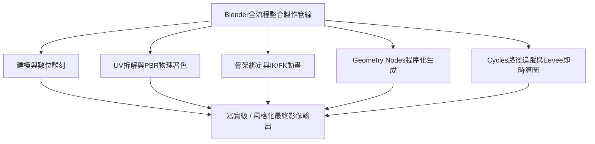
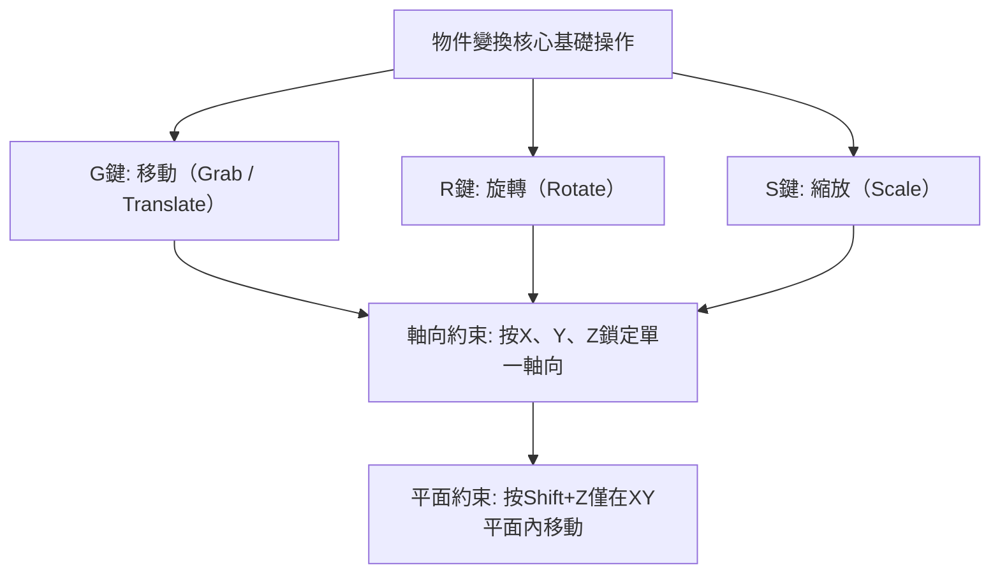
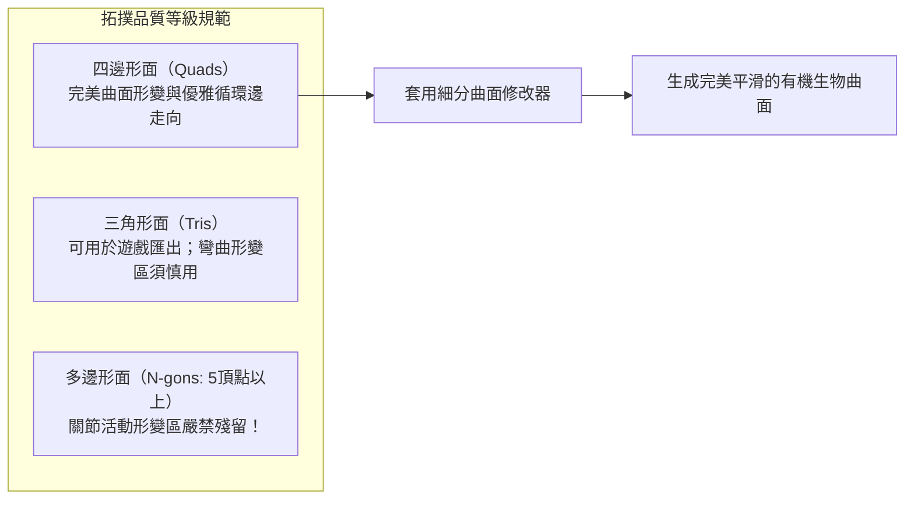
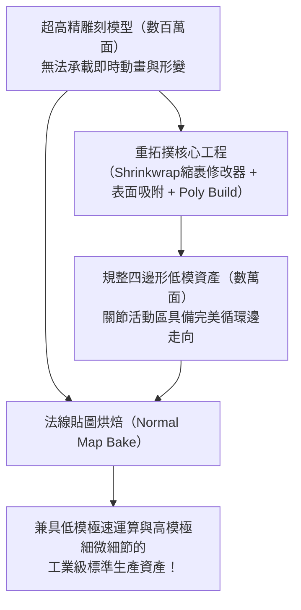
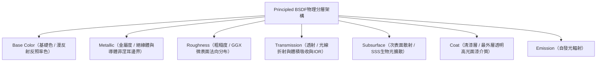
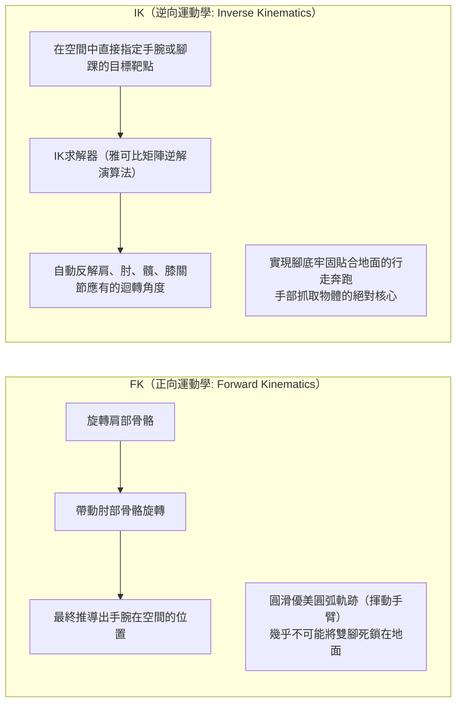
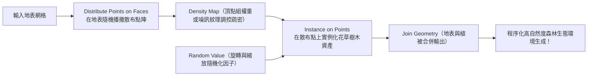
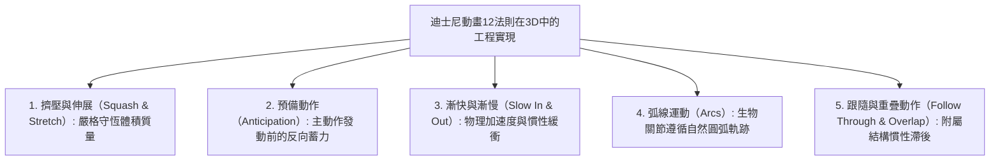
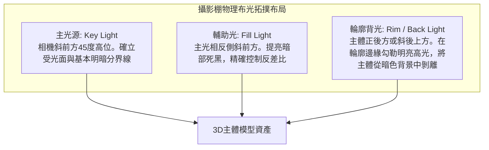

## 1. 引言：作為開源3DCG革命的Blender

### 1.1 湯·羅森達爾與Blender基金會的傳奇歷史

20世紀90年代初誕生於荷蘭動畫工作室NeoGeo內部工具的「Blender」，如今已演進為支撐全球數位娛樂產業、遊戲開發、好萊塢視覺特效（VFX）、建築視覺化及前沿學術研究的全球最強開源3DCG套件。

其發展歷程堪稱波瀾壯闊的奇蹟。伴隨NeoGeo的破產，Blender的智慧財產權一度被債權人扣押，專案瀕臨徹底停滯。1998年，創始人湯·羅森達爾（Ton Roosendaal）成立了「Blender基金會」，並發起了一場史無前例的群眾募資運動。來自全球各地的創作者慷慨解囊，籌集了10萬歐元從債權人手中買回原始碼。2002年10月13日，Blender在GNU通用公共授權條款（GPL）下正式向全世界完全開源。

當昂貴的商業專有軟體（如Maya、3ds Max、Cinema 4D等）每年收取高昂的訂閱費時，Blender始終堅守著其崇高的核心信念：**「不排斥任何人，永久免費向全球所有藝術家提供最頂尖的創作工具。」**



---

### 1.2 2.80介面革新與4.x世代步入業界標準

長期以來，Blender因「右鍵選取」等極其特立獨行且難以親近的互動介面，一度令主流商業藝術家望而卻步。

然而，2019年發布的「Blender 2.80」徹底重構了UI互動邏輯，將左鍵選取確立為預設標準，並推出了革命性的即時PBR視埠引擎「Eevee」，在CG產業掀起了前所未有的地殼變動。Epic Games（虛幻引擎）、育碧（Ubisoft）、Unity、NVIDIA、AMD、蘋果（Apple）、微軟（Microsoft）、亞馬遜（Amazon）等全球科技巨擘紛紛宣布注資Blender發展基金（成為企業贊助夥伴）。

如今進入「Blender 4.x」時代，隨著AgX色彩管理系統的預設整合、燈光連結（Light Linking）、Principled BSDF v2物理重構以及Geometry Nodes功能的爆發式成長，Blender已堂堂正正成為眾多國際一線商業工作室的核心主力製作管線。

---

## 2. Blender基礎架構與UI/快捷鍵體系

學習Blender初期的最大門檻，同時也是一旦熟練後能帶來超越任何其他CG軟體極致工作流速度的精髓，正在於其「高度提煉的快捷鍵驅動型互動體系」。

### 2.1 3D空間的幾何座標系與變換操作

Blender的虛擬三維空間基於笛卡爾直角坐標系（$X$ 軸：左右/紅，$Y$ 軸：前後/綠，$Z$ 軸：上下/藍）建構，遵循右手定則。



- **座標系模式切換**：
  - **全域座標（Global）**：整個虛擬世界絕對的空間方位。
  - **區域座標（Local）**：以物件自身傾斜旋轉角度為基準的相對座標系（連按兩次 $Z$ 即沿物件自身 $Z$ 軸移動）。
  - **法線座標（Normal）**：以選中幾何表面的法線方向為基準的座標系。
- **變換樞紐點（Pivot Point）**：
  - 外框中心、質心點（Median Point）、各自原點（Individual Origins）、作用元素，以及靈魂核心**「3D游標（3D Cursor）」**。
  - 3D游標（透過 Shift + 右鍵可在空間中任意定位）不僅能作為臨時的旋轉縮放樞紐，還能充當新物件生成的基準原點，賦予了Blender獨步天下的敏捷操作流。

---

### 2.2 編輯模式（Edit Mode）八大核心快捷鍵

選取網格物件並按下 `Tab` 鍵，即可從處理整體層級的「物件模式」切換至直接編輯多邊形拓撲的「編輯模式」。網格幾何塑形的核心由以下八個基礎快捷鍵構成：

| 快捷鍵 | 功能名稱 | 內部運作機制與實用進階選項 |
| :---: | :--- | :--- |
| **`E`** | **擠出（Extrude）** | 沿著法線或指定軸向拉伸選取的面、邊、頂點，生成全新的網格多邊形。按 `Alt + E` 可調出「擠出個別面」及「沿法線擠出面」進階選單。 |
| **`I`** | **內嵌面（Inset）** | 在選取面的內部生成具有均勻偏移邊距的同心嵌套新面，是製作邊框與硬表面結構的基礎。 |
| **`Ctrl + B`** | **倒角（Bevel）** | 對尖銳邊緣執行非破壞性斜切倒角。滾動滑鼠滾輪可動態增加細分段數以構建圓滑弧面。按 `V` 可切換為頂點倒角模式。 |
| **`Ctrl + R`** | **環切（Loop Cut）** | 順應四邊形拓撲結構，在整個網格模型上貫穿環繞切入循環邊。滾動滾輪增加切割數量，左鍵確認後可自由滑動位置。 |
| **`K`** | **切割刀具（Knife）** | 在網格表面互動式自由連線切割多邊形。按 `C` 啟用角度捕捉約束，按 `Z` 開啟穿透切割背面隱藏幾何體。 |
| **`Alt + M` / `M`** | **合併（Merge）** | 將多個選取的頂點焊接到單一點（「至中心」、「至游標」、「至最初/最後選取點」）。開啟自動合併（Auto Merge）可在頂點靠近時自動縫合。 |
| **`GG`** | **頂點/邊滑動** | 選取頂點或邊後連按兩次 `G`，即可在嚴格保持既有幾何表面傾角的前提下，像軌道滑塊一樣微調位置。 |
| **`F`** | **建立邊/面（Make Edge/Face）** | 在選取的兩個頂點間連接生成新邊，或在三個以上頂點與邊圍成的封閉區域內生成多邊形面。 |

---

## 3. 多邊形建模與細分曲面極致之道

### 3.1 拓撲學（Topology）基本準則與四邊形絕對法則

在3DCG多邊形建模領域，面依據其構成的頂點數量劃分為三大形態：
1. **三角形面（Tris: 3頂點）**：永遠保證共面性，即時遊戲引擎最終輸出階段普遍將其三角化，但在細分演算法與骨骼蒙皮變形中極易產生非預期的捏扭褶皺（Pinching）。
2. **四邊形面（Quads: 4頂點）**：**專業影視與工業建模中不可動搖的至高標準**。循環邊（Edge Flow）走向清晰明瞭，細分曲面演算法下的計算最為純淨優雅，極耐形變。
3. **多邊形面（N-gons: 5頂點及以上）**：除了早期平坦區域的布林過渡外，**在曲面區與關節活動區殘留N-gon屬於嚴重禁忌**。細分演算法無法明確界定內部拓撲劃分，算圖時會引發災難性的黑斑與陰影破損瑕疵。

此外，從單一頂點輻射出5條及以上邊的匯聚點（E極點）或僅有3條邊的匯聚點（N極點），是改變循環邊走向的核心樞紐（Poles）。將這些極點移離關節形變區及臉部肌肉表情活躍帶，順應解剖學肌理建構流暢的拓撲流，是衡量高階建模師水準的關鍵標尺。



---

### 3.2 細分曲面（Catmull-Clark法）數學機制

電影級CG角色飽滿柔和的皮膚以及流線型超級跑車的曲面車身，通常由低模基礎網格套用**「細分曲面修改器（Subdivision Surface）」**（`Ctrl + 1~3`）迭代計算而成。

Blender採用的Catmull-Clark細分演算法由艾德溫·卡特姆（Edwin Catmull）與吉姆·克拉克（Jim Clark）於1978年創立，在每一次迭代細分過程中執行以下三個核心公式計算：

1. **面中心點（Face Point）**：計算該多邊形面所有頂點的幾何重心：
   $$F = \frac{1}{n} \sum_{i=1}^n V_i$$
2. **邊中心點（Edge Point）**：計算該邊兩端頂點以及共享該邊的兩個相鄰面的面中心點之算術平均：
   $$E = \frac{V_1 + V_2 + F_1 + F_2}{4}$$
3. **新頂點位置（Vertex Point）**：針對原始頂點 $V$，結合其鄰接的 $n$ 個面的面點平均值 $Q$、鄰接 $n$ 條邊的中點平均值 $R$，以及頂點本身的權重計算其收斂座標 $V'$：
   $$V' = \frac{Q + 2R + (n-3)V}{n}$$

透過遞迴迭代執行該演算法，稜角分明的粗糙網格在數學層面精確收斂為平滑連續的三次B樣條極限曲面。

#### 支撐環邊與折痕權重（Crestlines & Support Loops）
在套用細分曲面時，為了保持硬表面銳利的機械轉折稜角，必須在主結構邊緣極近距離處嵌入**「支撐環邊（Holding / Support Loops）」**。兩條平行邊距離越緊密，Catmull-Clark的倒角圓滑擴散效應受限越顯著，從而呈現出金屬或注塑塑膠挺拔剛勁的高光轉折（亦可透過Crease折痕權重進行參數化非破壞性控制）。

---

### 3.3 修改器堆疊（Modifier Stack）的非破壞性工作流程

Blender建模的核心靈魂，在於無需破壞（固化）底層原始網格，便能在參數化視埠中即時層疊幾何變形的**「修改器堆疊」**。

| 修改器名稱 | 分類 | 運作機制與一線工業最佳實踐 |
| :--- | :---: | :--- |
| **Mirror（鏡射）** | 生成 | 跨越指定對稱軸（通常為X軸）即時生成雙向鏡射網格。勾選「Clipping（剪裁）」可使中心縫合處的頂點完全鎖死融合，是角色與載具建模的絕對核心。 |
| **Array（陣列）** | 生成 | 按照固定偏移間距、物件偏移（Object Offset）旋轉進行大量多重複製。參數化一鍵生成樓梯、鎖鏈、欄杆及環形齒輪螺栓陣列。 |
| **Boolean（布林）** | 生成 | 執行網格實體幾何布林聯集、差集、交集。提供Exact（精確）與Fast（快速）兩種解算核心。在硬表面建模中實現瞬間開槽打孔。 |
| **Solidify（實體化）** | 生成 | 為零厚度的單層薄殼網格沿表面法線方向賦予均勻的實體壁厚。廣泛用於衣物布料、玻璃器皿及汽車鈑金衝壓件厚度構建。 |
| **Bevel（倒角）** | 編輯 | 基於權重（Weight）或角度閾值（Angle，通常 $\ge 30^\circ$）對尖銳邊執行非破壞性倒角，在不增加基礎面數的前提下呈現真實的邊緣物理高光反光。 |
| **Weighted Normal（加權法線）** | 修改 | 賦予大面積平面以更高權重重新計算頂點法線。徹底消除低模硬表面倒角平面的黑斑陰影失真，無需Subsurf即可獲得如鏡面般平直的高光反射。 |

---

## 4. 數位雕刻與重拓撲

在「雕刻模式（Sculpt Mode）」下，藝術家如同揉捏真實的數位黏土，直觀塑造複雜的生物肌肉動態、怪獸骨骼與皮膚褶皺。

### 4.1 核心雕刻筆刷特性解析

- **Draw（繪製）**：沿表面法線擠出隆起，按住 `Ctrl` 變為向內凹陷刻畫。
- **Clay Strips（黏土條）**：如同堆疊矩形黏土片，能極度迅速地搭建大型骨骼形體與肌肉體積塊面。
- **Grab（抓取）**：大範圍抓取並拖曳網格局部，大刀闊斧地調整生物體態剪影與結構比例。
- **Crease（折縫）**：刻畫深陷銳利的溝槽與褶皺，是表現眼角細紋與衣物布褶的必備筆刷。
- **Smooth（平滑）**：迅速熨平表面微小雜亂凹凸（在任何筆刷狀態下按住 `Shift` 均可快速呼叫）。
- **Inflate（膨脹）**：如同充氣氣球般將所選區域沿全向法線向外膨脹擴張。

---

### 4.2 動態拓撲（Dyntopo）對比體素重構網格（Voxel Remesh）

在雕刻數百萬多邊形的高精細模型時，網格密度的動態排程是成敗關鍵。

1. **動態拓撲（Dyntopo）**：
   - 僅在筆刷劃過的局部筆觸區域即時自適應細分三角形面。
   - 在保持軀幹等大部分網格低負載的前提下，精準針對眼眶、耳廓、手指等局部細節進行超高密度雕刻。
2. **體素重構（Voxel Remesh: `Ctrl + R`）**：
   - 將整個3D空間劃分為均勻微小的立方體素網格（如 $0.01\,\text{m}$），將全模型重新解構為各向同性的純四邊形網格。
   - 瞬間熔合布林運算拼接的散落構件縫隙，一鍵消解極度拉伸撕裂的多邊形，重置為均勻受力的原始數位黏土狀態。

---

### 4.3 重拓撲（Retopology）的理論與工程實踐

經雕刻完成的高精數位資產（動輒數百萬乃至數千萬多邊形）因資料量極其龐大且缺乏規範拓撲流，既無法在遊戲引擎中即時運算，也無法直接承載骨骼蒙皮動畫形變。

**「重拓撲」** 即在吸附貼合高精模型外輪廓表面的基礎上，完全手動以規整精煉的四邊形面（通常數千至數萬面）重建符合形變動力學的優雅拓撲網格。



1. 啟用 **Shrinkwrap（縮裹修改器）** 與 **Face Project（面投影吸附）** 功能。
2. 在眼眶、口輪匝肌、鼻翼等高形變表情區構建同心環形循環邊。
3. 將下頜線引導至頸部、鎖骨，並在手肘、膝蓋等彎折關節處嚴密埋設三道保護環邊（關節環），防止大角度彎折時幾何體發生體積縮扁坍塌。
4. 完成後，高模表面的微小毛孔與微觀皮膚褶皺將透過**法線貼圖（Normal Map）** 烘焙至低模表面。

---

## 5. 材質著色與基於物理算圖（PBR）的科學原理

Blender的材質表現力依託節點式「著色器編輯器（Shader Editor）」建構。現代CG工業基石「PBR（Physically Based Rendering: 基於物理的算圖）」，嚴格遵循馬克士威電磁學及光學守恆定律，模擬光線在微觀界面的反射、折射、吸收與散射。

### 5.1 原理化BSDF（Principled BSDF v2）深度數理解析

Blender的核心全能著色節點「Principled BSDF」以迪士尼在2012年發表的「Disney Principled BRDF」為藍本，並在Blender 4.0中針對微表面微觀能量守恆體系進行了全面物理重構。



1. **Base Color（基礎色 / 反照率 Albedo）**：
   - 絕緣體（非金屬）：代表進入介質淺表層後經多次散射再逃逸出的「漫反射光顏色」。
   - 導體（金屬）：光線穿入金屬內部會被自由電子碰撞完全吸收，其漫反射恆為零。Base Color 直接決定其表面鏡面反射率（$F_0$ 反射色彩，如黃金的耀黃、紫銅的赤紅）。
2. **Metallic（金屬度: $0.0 \sim 1.0$）**：
   - 物理自然界中的物質在電磁學上是嚴格二元的：要麼是**非金屬（絕緣體：Metallic = 0.0）**，要麼是**純金屬（導體：Metallic = 1.0）**。除灰塵覆蓋過渡帶或微觀鏽蝕外，絕對不存在0.5這類中間態。
3. **Roughness（粗糙度）**：
   - 決定GGX微表面法線分布函數的離散程度。
   - $0.0$：完全理想鏡面（入射光線沿單一鏡面反射角集中射出）。
   - $1.0$：極限粗糙微表面（光線漫射至全向半球空間，呈現如粉筆或乾黏土般的消光質感）。
4. **IOR（Index of Refraction: 折射率）**：
   - 基於司乃耳定律（Snell's Law: $n_1 \sin \theta_1 = n_2 \sin \theta_2$）的光線折射偏折比。
   - 空氣：$1.0003$、水：$1.333$、壓克力：$1.49$、一般窗戶玻璃：$1.52$、鑽石：$2.417$。
5. **次表面散射（Subsurface Scattering / SSS）**：
   - 光線射入半透明介質（皮膚、大理石、蠟、牛奶、翡翠）內部，經無數次微觀碰撞散亂後再折射出表面的物理現象。
   - 人體皮膚表層對短波藍光吸收迅速，而富含血紅蛋白的深層真皮允許長波紅光深度穿透，從而在逆光照射下呈現耳垂與指尖通透溫潤的血紅光暈（透過 Subsurface Radius 分別設定RGB三通道散射距離）。

---

### 5.2 UV拆解與紋素密度（Texel Density）

要將二維點陣圖紋理（顏色、粗糙度、法線貼圖）無畸變貼合至三維曲面，必須執行如裁剪剝開紙模般的**「UV拆解（UV Unwrapping）」**。

- **接縫（Seam）標定策略**：
  - 快捷鍵 `Ctrl + E` $\rightarrow$ 「標記縫合邊（Mark Seam）」。
  - 效仿服裝裁剪工藝，接縫應隱蔽規劃在攝影機盲區（大腿內側、髮際線內部、角色背脊正中）。
- **統一紋素密度（Texel Density）**：
  - 指單位3D空間物理尺寸（如 $1\,\text{cm}$）所分配的2D紋理像素數量（如 $\text{px/cm}$）。
  - 若角色頭部紋素密度達到 $20.48\,\text{px/cm}$，而軀幹僅有 $2.56\,\text{px/cm}$，並置時將產生致命的畫質解析度割裂感。必須確保全部UV島統一縮放至等同紋素密度，並緊密排列填充在 $[0, 1]$ UV象限內。

---

## 6. 骨架綁定與角色動畫力學

將靜止的3D數位模型轉化為生動鮮活的受控有機體，其核心樞紐即為工程化建構內部骨架層級的「綁定（Rigging）」技術。

### 6.1 正向運動學（FK）與逆向運動學（IK）的數學對立統一

控制生物四肢運動存在兩套截然相反的運動學幾何解算體系：



- **FK（正向運動學）**：旋轉由父級骨骼順次向下傳遞至子級。極其適合在空中自由舞動形成優美圓弧軌跡的揮手動作，但在製作腳踏地面彎腰動作時，腰部下沉會導致腳底骨骼瞬間穿透地面，需要無休止地逐幀反向修正。
- **IK（逆向運動學）**：末端骨骼（腳踝或手腕）錨定在空間指定座標，**IK反向求解器（如CCD-IK或FABRIK演算法）** 自動逆向推導大腿、小腿各關節所需的彎曲轉角。這是製作角色真實行走腳步踩實地面的不可或缺之法。
- **極向目標（Pole Target）**：在IK解算中用於約束膝蓋或手肘彎曲朝向的外部空間定向向量（極向骨骼），防止四肢在極端姿態下發生反關節反向折斷。

---

### 6.2 權重繪製（Weight Painting）

定義各根骨骼旋轉位移時，網格表面各個頂點跟隨聯動的位移比例（範圍 $0.0 \sim 1.0$，以藍 $= 0$、綠 $= 0.5$、紅 $= 1.0$ 的熱力色譜直觀展現）。
- 為實現關節自然彎曲，肘部與膝蓋內側需採用陡峭緊湊的權重分界，外側則施加平緩柔和的漸層過渡。
- 每個頂點關聯的所有骨骼權重之和必須透過「全部規格化（Normalize All）」嚴格強制鎖定為 $1.0$。否則在骨骼旋轉時將發生頂點炸裂或幾何坍塌拉扯。

---

## 7. 程序化生成的革命：Geometry Nodes（幾何節點）

自Blender 3.0起引發全球技術美術（Technical Artist）狂熱追捧的，正是以類程式設計邏輯連結節點，便能演算法化無窮衍生複雜3D形態的**「Geometry Nodes」**。

### 7.1 欄位（Fields）資料流體系

Geometry Nodes 徹底摒棄了傳統逐點逐面循序迴圈的笨重設計，採用前沿的「欄位（Fields）」架構。節點間流轉的並非單純的具體幾何拓撲實體，而是「在整個幾何情境上求值的數學函數表達式」。



### 7.2 實戰範例：程序化森林生態生成節點鏈

1. 地表網格作為基礎幾何輸入（Group Input）。
2. **Distribute Points on Faces**：在地表表面基於帕松盤（Poisson Disk）取樣散布隨機點雲，保證生成植株間維持設定的最小安全間距。
3. 將 **Noise Texture（噪訊紋理）** 節點的因子輸入連接至點雲的密度輸入（Density），自然分離出林木茂密的樹叢與空曠平整的林間空地。
4. **Instance on Points**：將預先建模的多種樹木集合（Collection Info）隨機實例化錨定在各個點上。
5. **Rotate Instances / Scale Instances**：掛接 **Random Value** 隨機值節點，讓樹木 $Z$ 軸旋轉在 $0 \sim 2\pi$ 均勻分布，縮放係數在 $0.7 \sim 1.3$ 呈常態波動。
6. 一旦搭建完成，藝術家僅需在編輯模式下拖曳修改地貌起伏，整片森林便會即時動態自適應更新拓撲分布。

在最新的**「Simulation Nodes（模擬節點）」** 支援下，隨風搖曳的草浪、重力沙漏顆粒沉降、雨滴漣漪濺射乃至輕量流體運算均可完全閉環在幾何節點內部。

---

## 8. 算圖引擎物理機制：Cycles vs. Eevee Next

Blender內建了兩款面向不同工業訴求的頂尖算圖引擎。

### 8.1 Cycles：蒙地卡羅路徑追蹤（Path Tracing）物理本質

Cycles是一款遵循物理法則的無偏路徑追蹤（Unbiased Path Tracing）影視級算圖引擎。

引擎從虛擬攝影機感測器發射逆向視線（Ray），穿透三維場景，在幾何表面依據材質BSDF機率函數發生數千次隨機漫射與鏡面彈跳，並透過蒙地卡羅積分求解算圖方程式：

$$L_o(p, \omega_o) = L_e(p, \omega_o) + \int_{\Omega} f_r(p, \omega_i, \omega_o) L_i(p, \omega_i) (\omega_i \cdot n) d\omega_i$$

- 求解 **卡吉亞算圖方程式（Kajiya's Rendering Equation）**，使得全域光照（GI）、顏色溢出（Color Bleeding：紅色牆壁將相鄰白地板自然浸染微紅）、真實複雜玻璃折射、焦散光斑與物理軟陰影均無需任何光柵化技巧即自然湧現。
- **AI智慧降噪（Denoising）**：原生整合 Intel Open Image Denoise（OIDN）與 NVIDIA OptiX 深度學習演算法，瞬間抹平蒙地卡羅前期隨機取樣的顆粒噪點，在極低取樣數（128至512次取樣）下輸出純淨剔透的超高精圖像。

---

### 8.2 Eevee Next：即時光柵化算圖的工業極限

提供如遊戲引擎般每秒數十幀極速互動視埠預覽的即為「Eevee」。
全新「Eevee Next」引擎全面進化了螢幕空間反射（SSR），引入解除解析度瓶頸的虛擬陰影貼圖（Virtual Shadow Maps: VSM），融合螢幕空間次表面散射與真實環境光遮蔽（GTAO），在數秒內即可輸出逼近Cycles質感的超高畫質影格。

---

### 8.3 色彩管理：AgX色彩科學革命

Blender 4.0起被確立為業界預設標準的**「AgX」色彩管理系統**，徹底終結了以往sRGB與Filmic在超高亮度曝光區域導致色彩嚴重扭曲、過早飽和並陡然慘白「死白」的致命缺陷。

AgX深刻模擬了人眼視網膜視錐細胞的光譜感應特性與現代柯達電影底片的對數感光曲線（Log），在高亮區域維持色相（Hue）純淨穩定的同時施加優雅順滑的高光滾降（Highlight Roll-off）。烈焰燃燒、霓虹高亮與陽光下的通透膚色得以保留電影底片般的豐富寬容度與情緒張力。

---

## 6.4 動畫的靈魂：迪士尼12法則在3D中的工程實現與F曲線插值

在三維空間中僅僅對骨骼插入關鍵影格（`I` 鍵），動作必然呈現如同冰冷木偶般的「恐怖谷」僵硬感。賦予角色生命活力的基石，在於將華特·迪士尼九大長老（Nine Old Men）於20世紀30年代總結的**「動畫12條基礎原則」**，在Blender曲線編輯器中進行精確的數學化參數實現。



### 1. 擠壓與伸展（Squash and Stretch）的體積恆定法則
彈跳小球撞擊地面的瞬間扁平擠壓（Squash）；向上反彈的瞬間沿速度向量劇烈伸展（Stretch）。
- **最嚴苛物理約束**：形變過程中，**物件的總體積必須保持恆定（Volume Preservation）**。
- 若 $Z$ 軸方向壓縮至原尺寸的 $0.5$ 倍，為保持體積守恆，$X$ 軸與 $Y$ 軸必須同步放大 $\sqrt{1 / 0.5} \approx 1.414$ 倍。在Blender中，透過為骨骼掛載「Stretch To」骨骼約束，可全自動即時運算該體積恆定補償。

### 2. 曲線編輯器（Graph Editor）與三次貝茲動力學
Blender的曲線編輯器將空間位移、旋轉角、縮放隨時間的演進表徵為二維「F曲線（Function Curve）」。
- **線性插值（Linear）**：等速直線運動，缺乏生命體的物理質量感。
- **貝茲插值（Bézier）**：透過互動式調節操縱桿切線，實現從靜止平緩起跑（Ease-In）、中段衝刺並於終止前優雅平穩減速（Ease-Out）的三次多項式慣性運動。
- 在行走循環（Walk Cycle）中，將骨盆上下起伏、雙腿邁步與雙臂擺動的相位故意錯開數影格（重疊動作），即可精準重現真實人類行進時複雜的重心配重動態轉移。

---

## 7.5 基於Python API（`bpy`）的自動化程序化腳本構建

Blender深層軟體架構的最強大之處，在於其所有底層資料結構、互動按鈕與核心操作均100%雙向綁定至「Python」。將滑鼠懸停在視埠任意按鈕上，即可即時窺見其對應的底層Python屬性呼叫路徑。

進入 `Scripting` 程式碼編輯工作區，執行Python腳本，即可在一秒之內由純粹的數學方程式直接生成繁複的有機幾何構型。

### 自動生成莫比烏斯環（Möbius Strip）三維拓撲的Python腳本
```python
import bpy
import math

# 清空當前場景既有網格物件
bpy.ops.object.select_all(action='SELECT')
bpy.ops.object.delete()

# 莫比烏斯環拓撲參數
R = 3.0           # 主環旋轉半徑
w = 1.0           # 帶體半寬度
u_segments = 120  # 沿圓周方向細分段數
v_segments = 20   # 沿帶體寬度方向細分段数

verts = []
faces = []

for i in range(u_segments):
    u = 2.0 * math.pi * i / u_segments
    for j in range(v_segments + 1):
        v = -w + (2.0 * w * j / v_segments)
        
        # 莫比烏斯帶的三維參數化方程式
        x = (R + v * math.cos(u / 2.0)) * math.cos(u)
        y = (R + v * math.cos(u / 2.0)) * math.sin(u)
        z = v * math.sin(u / 2.0)
        
        verts.append((x, y, z))

# 拓撲連接面頂點索引生成
for i in range(u_segments):
    next_i = (i + 1) % u_segments
    for j in range(v_segments):
        p1 = i * (v_segments + 1) + j
        p2 = i * (v_segments + 1) + (j + 1)
        
        # 環繞一周閉合處的半扭轉拓撲反向縫合處理
        if next_i == 0:
            p3 = next_i * (v_segments + 1) + (v_segments - (j + 1))
            p4 = next_i * (v_segments + 1) + (v_segments - j)
        else:
            p3 = next_i * (v_segments + 1) + (j + 1)
            p4 = next_i * (v_segments + 1) + j
            
        faces.append((p1, p2, p3, p4))

# 構建全新網格並將物件連結至場景集合
mesh = bpy.data.meshes.new(name="Mobius_Strip_Mesh")
mesh.from_pydata(verts, [], faces)
mesh.update()

obj = bpy.data.objects.new(name="Mobius_Strip", object_data=mesh)
bpy.context.collection.objects.link(obj)

# 開啟全表面平滑著色
for poly in mesh.polygons:
    poly.use_smooth = True
```

依託全功能Python API（`bpy`），Blender早已超越傳統單純手動建模軟體範疇，成為跨越建築參數化生成、醫療斷層CT三維體重建，以及深度學習合成資料訓練集（Synthetic Dataset）自動化批次光線追蹤生成的全能科研與工業平台。

---

## 8.4 攝影棚布光物理學與合成器（Compositor）高階後期

無論前期建模多形準，PBR著色器參數多麼吻合物理法則，若缺乏嚴謹的光影構圖設計，成片必然流於平面而廉價。

### 1. 經典三點布光法（Three-Point Lighting）精粹
奠定主體三維立體體積感與空間質感的黃金範式：



- **主輔光比（Key-to-Fill Contrast Ratio）**：
  - 喜劇或明快商業廣告：$2:1 \sim 3:1$（全景通透，陰影極輕）。
  - 戲劇張力與黑色電影（Film Noir）：$8:1 \sim 16:1$（暗部深邃，反差強烈）。
- **光源尺寸與陰影柔度（Shadow Penumbra）**：
  - 半徑趨近於零的點光源會產生極其銳利割裂的硬陰影（Hard Shadow）。
  - 擴大發光體物理尺寸（柔光箱、面光Area Light）會使光線包裹邊緣，生成過渡優美舒展的半影柔和光暈（Soft Shadow）。

### 2. 合成器（Compositor）電影級後期處理
算圖輸出的原始影格相當於未經沖印的數位底片。利用Blender內建的節點合成器完成院線級最終潤色：

1. **輝光節點（Glare Node）**：在「Fog Glow」模式下為極端高光注入微觀大氣漫射的光暈光霧（Bloom）；在「Streaks」模式下生成變形寬銀幕鏡頭獨有的橫向拉絲眩光。
2. **景深精準調校（Depth of Field）**：基於物理攝影機的焦距與光圈值（F-Stop），模擬自然的光學散景模糊（Bokeh），強力聚焦敘事核心。
3. **色散與鏡頭畸變（Lens Distortion & Dispersion）**：引入微量色散數值（$0.01 \sim 0.02$），在畫幅邊緣微量錯位RGB波長，打破純CG畫面絕對無菌的虛假機械感，注入光學物理鏡頭的溫潤真實質感。

---

## 8.5 物理模擬系統（Physics Simulation）動力學

Blender內嵌了多個遵循牛頓經典力學與流體力學的數值模擬解算引擎：

1. **剛體動力學（Rigid Body）**：
   - 依據經典力學精確計算碰撞、回彈、摩擦力、骨牌與積木倒塌。
   - 設定「Active（主動受力）」與「Passive（靜止受撞地表）」，精準適配「凸包（Convex Hull）」與「網格（Mesh）」碰撞體。
2. **布料解算（Cloth）**：
   - 基於質點彈簧模型（Mass-Spring System）解算衣物、旗幟與窗簾的受力飄拂與褶皺。
   - 細緻調控結構剛度（Structural Stiffness）、抗彎曲阻尼（Bending），並開啟「自碰撞（Self-Collision）」杜絕布料自身多邊形穿插撕裂。
3. **流體與煙霧動力學（Mantaflow）**：
   - 基於納維-斯托克斯方程式（Navier-Stokes equations）的高精度流體解算。
   - 在限定域（Domain）體素空間內，真實烘焙液體濺射飛沫、爆炸衝擊波與烈火濃煙的複雜渦流（Vorticity）。

---

## 9. 結語：3D創作者的未來與Blender開拓的新紀元

對Blender的探索之旅，是一場數學、物理學、光學、人體解剖學、色彩理論與純粹美學在同一時空交織碰撞的壯麗交響。

從在空無一物的世界中刪除預設立方體（Default Cube）、擠出第一個幾何頂點開始：
- Catmull-Clark細分演算法雕琢出鮮活溫潤的生命形體；
- 物理著色節點編織出光線流轉在萬物表面的微觀戲劇；
- 骨骼與逆向運動學賦予形體扎實沉穩的重力律動；
- Geometry Nodes以純粹演算法構築出無限生長的宏大自然圖景；
- 最終經由Cycles萬億次光子路徑追蹤，將虛幻的想像凝鑄為比肩現實的光影史詩。

曾經僅屬於數百萬級專用工作站與好萊塢寡頭工作室特權的3DCG高地，如今在一台個人電腦與完全開源的Blender面前，向全球每一個人無私敞開了大門。

「凡能被人類想像之物，皆能在此被賦予形態。」
手握Blender這雙自由羽翼的創作者，眼前展開的是一片唯有自身智慧與審美才是唯一疆界的、浩瀚無垠的創世宇宙。
