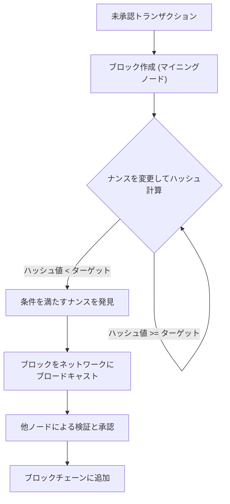
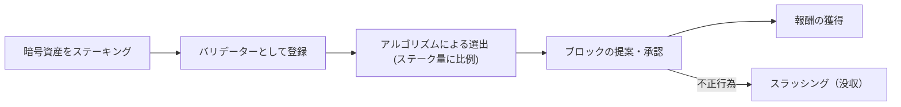
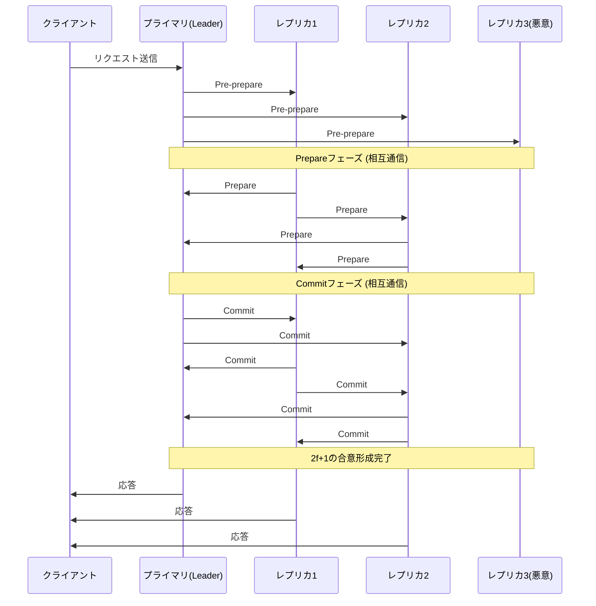

# البلوكتشين وخوارزميات الإجماع: فهم جوهر الأنظمة الموزعة

في تكنولوجيا اليوم، لا يمر يوم دون سماع كلمة "بلوكتشين". ومع ذلك، لا يفهم الكثير من الناس بعمق كيف تعمل "خوارزمية الإجماع" (Consensus Algorithm) الأساسية الخاصة بها، ولماذا هي مبتكرة.

في الأنظمة الموزعة، شكلت مشاركة الشبكة بأكملها لنفس الحالة في غياب مسؤول مركزي، والحفاظ على النظام حتى في وجود عقد ضارة، تحديًا طويل الأمد في علوم الكمبيوتر. ستتناول هذه المقالة بالتفصيل، من منظور تقني ونظري، جذور هذا التحدي بدءًا من "مشكلة الجنرال البيزنطي"، مرورًا بـ "إثبات العمل" (PoW) الرائد لساتوشي ناكاموتو، وتطوره إلى "إثبات الحصة" (PoS)، وصولاً إلى "التسامح العملي مع الأخطاء البيزنطية" (PBFT) المستخدم في شبكات الكونسورتيوم.

---

## 1. الأنظمة الموزعة وصعوبة التسامح مع الأخطاء البيزنطية (BFT)

في الأنظمة المركزية، يحمل خادم أو قاعدة بيانات واحدة "الحقيقة" المطلقة. تتم معالجة طلبات العملاء في مكان واحد، ولا يحدث تعارض في الحالة بشكل أساسي. ومع ذلك، في الأنظمة الموزعة، حيث تحتفظ كل عقدة من العقد المتعددة ببياناتها الخاصة وتتواصل عبر الشبكة، فإنها تواجه مشاكل مثل تأخير المعلومات، وفقدانها، بالإضافة إلى فشل العقد والتلاعب المتعمد.

### ما هي مشكلة الجنرال البيزنطي؟

تمت صياغة هذه المشكلة في عام 1982 من قبل ليزلي لامبورت، وروبرت شوستاك، ومارشال بيس باسم "مشكلة الجنرال البيزنطي"، وهي ترمز إلى صعوبة بناء الإجماع في الأنظمة الموزعة.

الإعداد كالتالي:
- يقوم عدة جنرالات من الإمبراطورية البيزنطية بمحاصرة مدينة معادية.
- الجنرالات متمركزون في مواقع متباعدة، ولا يمكنهم التواصل إلا من خلال الرسل.
- يجب أن يتفق جميع الجنرالات تمامًا إما على "الهجوم الشامل" أو "الانسحاب"، وإلا ستفشل الخطة ويتم إبادتهم.
- المشكلة هي أن هناك **خونة (عقد بيزنطية)** بين الجنرالات يحاولون عمداً إرسال رسائل كاذبة لتخريب الإجماع.

في وجود الخونة، كيف يمكن للجنرالات المخلصين التوصل إلى إجماع صحيح؟ يُقال إن النظام القادر على حل هذه المشكلة يمتلك "التسامح مع الأخطاء البيزنطية" (Byzantine Fault Tolerance: BFT).

من خلال الإثبات الرياضي والنظري، إذا كان عدد العقد الضارة هو $f$، فإنه من أجل تشكيل إجماع صحيح في النظام بأكمله، يجب أن يكون العدد الإجمالي للعقد $N$ هو $N \ge 3f + 1$. بعبارة أخرى، ما لم يكن على الأقل ثلثي الشبكة سليمًا، فلن يتحقق BFT.

### استحالة FLP في الشبكات غير المتزامنة

علاوة على ذلك، أثبتت نتيجة "استحالة FLP" المنشورة عام 1985 أنه في الأنظمة الموزعة غير المتزامنة تمامًا، مع إمكانية تعطل عقدة واحدة فقط، لا يمكن لخوارزمية إجماع حتمية أن تضمن دائمًا التوصل إلى اتفاق.

بسبب هذا الحد النظري، اضطر باحثو الأنظمة الموزعة إلى تغيير نهجهم من الأساليب "الحتمية" (التي تؤدي دائمًا إلى إجماع) إلى الأساليب "الاحتمالية" (التي تكاد تصل بالتأكيد إلى إجماع بمرور الوقت) أو "المتزامنة" (التي تضع حدًا أعلى لتأخير الاتصال). شكل هذا أساس تقنية البلوكتشين اللاحقة.

---

## 2. اختراق ساتوشي ناكاموتو: إثبات العمل (PoW)

في عام 2008، قدمت الورقة البيضاء للبيتكوين المنشورة بواسطة شخص أو مجموعة مجهولة تحمل اسم ساتوشي ناكاموتو حلاً "احتماليًا" جديدًا تمامًا لمشكلة BFT هذه. وهو مزيج من "إثبات العمل" (Proof of Work) و"قاعدة السلسلة الأطول" (Longest Chain Rule)، وهو ما يسمى بـ "إجماع ناكاموتو".

### آلية عمل PoW: دالة التجزئة وتعديل الصعوبة

في PoW، يقوم المشاركون في الشبكة (المعدنون) بإجراء حسابات ضخمة للمصادقة على حزم المعاملات (الكتل) وإضافتها إلى السلسلة. على وجه التحديد، يطبقون دالة تجزئة التشفير (مثل SHA-256) على معلومات رأس الكتلة و"رقم خاص" (Nonce)، ويتنافسون للعثور على رقم خاص بحيث تكون قيمة التجزئة الناتجة أصغر من "قيمة هدف" محددة تحددها الشبكة.

نظرًا لطبيعة دوال التجزئة، من المستحيل حساب المدخلات عكسياً من المخرجات، لذلك فإن الطريقة الوحيدة للعثور على رقم خاص يلبي الشرط هي تكرار الحسابات بالقوة الغاشمة. هذا بمثابة إثبات لـ "العمل".

### حل الأخطاء البيزنطية من خلال قاعدة السلسلة الأطول

جوهر إجماع ناكاموتو يكمن في آلية الدفاع الخاصة به عندما يحاول مهاجم خبيث التلاعب بالسجل التاريخي.
عندما يتم اقتراح كتلتين صالحتين في نفس الوقت على الشبكة (حدوث انقسام)، فإن العقد ستوافق مؤقتًا على الكتلة التي تستلمها أولاً، ولكنها في النهاية ستتبنى **"السلسلة التي تراكمت فيها أكبر قدر من العمل الحسابي (PoW) (السلسلة الأطول)"** باعتبارها السلسلة الصالحة.

لكي يقوم المهاجم بالتلاعب بكتلة سابقة وجعل الشبكة تقبلها ككتلة صالحة، يجب عليه إعادة حساب PoW لجميع الكتل من الكتلة المتلاعب بها وصولاً إلى الوقت الحاضر، وتجاوز سرعة إضافة الكتل الجديدة من قبل المعدنين الصادقين في الشبكة بأكملها. سيتطلب هذا التحكم في أكثر من 51٪ من القوة الحسابية للشبكة بأكملها (هجوم 51٪)، وهو أمر مكلف للغاية من الناحية الواقعية، مما يقلل من الحافز للهجوم.

من خلال دمج التشفير مع الحوافز الاقتصادية (مكافآت التعدين)، تمكن ساتوشي ناكاموتو من حل التسامح مع الأخطاء البيزنطية "بشكل احتمالي" في شبكة عامة يشارك فيها عدد غير محدد من الأشخاص.

---

## 3. تحديات PoW وصعود إثبات الحصة (PoS)

على الرغم من أن PoW خوارزمية إجماع قوية للغاية، إلا أنها كانت تعاني من عيوب كبيرة. هذه العيوب هي "الاستهلاك الهائل للطاقة" و"حدود قابلية التوسع".

مع اشتداد المنافسة في التعدين، تم تطوير أجهزة مخصصة تسمى ASIC، وبدأت بعض مجمعات التعدين الكبيرة باحتكار معدل التجزئة. كما وصل التأثير السلبي على البيئة العالمية إلى مستوى لا يمكن تجاهله.

لحل هذه المشكلة، تم ابتكار "إثبات الحصة" (PoS).

### المفهوم الأساسي لـ PoS

في PoS، بدلاً من القوة الحسابية (معدل التجزئة)، يتم اختيار مقترحي الكتل (المدققين) بناءً على كمية العملة الأساسية للشبكة المحتفظ بها (الحصة) وفترة الاحتفاظ بها. من خلال حجز العملة (التخزين)، يساهم المشاركون في أمن الشبكة ويتلقون مكافآت في المقابل.

نظرًا لعدم إجراء حسابات غير ضرورية كما في PoW، يتم تقليل استهلاك الطاقة بأكثر من 99٪ مقارنة بـ PoW (مثال: الإيثريوم بعد "الدمج").

### مشكلة "لا شيء على المحك" والقطع (Slashing)

كانت الإصدارات المبكرة من PoS تحتوي على ثغرة أمنية قاتلة تُعرف باسم "مشكلة لا شيء على المحك" (Nothing at Stake).

في PoW، عند حدوث انقسام، يجب على المعدنين تركيز قوتهم الحسابية على إحدى السلسلتين. إن تعدين كلتيهما يعني تشتيت القوة الحسابية (وبالتالي تكلفة الكهرباء)، مما يؤدي إلى خسارة. ولكن في حالة PoS، لا يحتاج المدققون إلى تكلفة إضافية حتى في حالة حدوث انقسام. لذلك، تصبح الموافقة على الكتل في كلتا السلسلتين الاستراتيجية الأفضل لعدم تفويت المكافآت، ونتيجة لذلك، لا يمكن حل الانقسامات أبدًا.

لحل هذه المشكلة، أدخلت أنظمة PoS الحديثة (مثل Casper في Ethereum) آلية عقاب تسمى **"القطع" (Slashing)**. إذا تصرف المدقق بشكل خبيث (مثل الموافقة على كتل متعددة متنافسة في نفس الوقت)، تتم مصادرة جزء أو كل الأصول المخزنة. يحل هذا مشكلة "لا شيء على المحك" من خلال عقوبة اقتصادية، مما يضمن أمان الشبكة.

---

## 4. البلوكتشين من نوع الكونسورتيوم والتسامح العملي مع الأخطاء البيزنطية (PBFT)

تعتبر PoW و PoS خوارزميات مناسبة لـ "البلوكتشين العام" حيث يمكن لأي شخص المشاركة. ومع ذلك، في "البلوكتشين من نوع الكونسورتيوم"، حيث يتم تحديد المشاركين والتصريح لهم (مثل المعاملات بين الشركات أو الأنظمة الخلفية للمؤسسات المالية)، غالبًا ما يتم اعتماد خوارزميات إجماع أخرى. المثال الأبرز هو "PBFT" (التسامح العملي مع الأخطاء البيزنطية).

### آلية عمل PBFT والمراحل الثلاث

يعتبر PBFT، الذي نُشر عام 1999 بواسطة ميغيل كاسترو وباربرا ليسكوف، خوارزمية قادرة على تحمل الأخطاء البيزنطية بكفاءة في الشبكات غير المتزامنة. يستخدم على نطاق واسع في بلوكتشين المؤسسات مثل Hyperledger Fabric.

لا يعتمد PBFT على الإجماع الاحتمالي بل يشكل إجماعًا **حتميًا**. وهذا يعني أنه لا تحدث انقسامات، وبمجرد الموافقة على الكتلة، يتم تأكيدها فورًا (النهائية المطلقة).

تتم عملية بناء الإجماع من خلال المراحل الثلاث التالية:

1. **مرحلة ما قبل الإعداد (Pre-prepare)**: تتلقى العقدة القائدة (Primary) طلبًا من العميل وتبث رسالة إلى جميع العقد الأخرى (Replicas).
2. **مرحلة الإعداد (Prepare)**: تقوم كل عقدة تتلقى الرسالة بالتحقق من صحتها وترسل رسالة "Prepare" إلى جميع العقد الأخرى. تتقدم كل عقدة إلى المرحلة التالية عندما تتلقى رسائل $2f$ (ثلثي المجموع) من نوع Prepare.
3. **مرحلة الالتزام (Commit)**: ترسل كل عقدة رسالة "Commit" إلى الشبكة بأكملها. وبالمثل، بمجرد تلقي $2f+1$ رسائل من نوع Commit، يُعتبر الإجماع مكتملاً، ويتم تحديث الحالة وإرسال استجابة إلى العميل.

### مزايا وعيوب PBFT

**المزايا:**
- **النهائية الفورية**: بدلاً من التأكيد الاحتمالي القائم على القوة الحسابية، يتم تأكيد المعاملات في لحظة الاتفاق عليها.
- **إنتاجية عالية**: نظرًا لعدم وجود تأخيرات مقصودة، يمكنه معالجة آلاف المعاملات في الثانية.
- **توفير الطاقة**: لا يتطلب عمليات حسابية ضخمة.

**العيوب:**
- **نقص قابلية التوسع**: نظرًا لأن العقد تتبادل الرسائل مع بعضها البعض، فإن حجم الاتصالات يزداد بشكل يتناسب مع مربع عدد العقد. لذلك، فهو غير مناسب للشبكات الكبيرة حيث يتجاوز عدد العقد المشاركة العشرات إلى المئات.

---

## 5. الخلاصة: مستقبل خوارزميات الإجماع

تم التغلب على المعضلة الكلاسيكية للأنظمة الموزعة، وهي "مشكلة الجنرال البيزنطي"، في البيئة القاسية للشبكات العامة من خلال إدخال اقتصاديات التشفير بواسطة PoW الخاص بساتوشي ناكاموتو. منذ ذلك الحين، حققت تكنولوجيا البلوكتشين تطورات متنوعة، وتطورت إلى PoS الذي يهدف إلى تقليل التأثير البيئي وتحسين قابلية التوسع، وإلى PBFT الذي يركز على اليقين والسرعة لتطبيقات المؤسسات.

حتى اليوم، لا يزال البحث والتطوير النشط مستمراً لحل "معضلة البلوكتشين الثلاثية" (تحدي عدم القدرة على زيادة قابلية التوسع والأمان واللامركزية في نفس الوقت)، من خلال تقنيات التقسيم (Sharding)، وحلول الطبقة الثانية (Rollups)، ونماذج الإجماع الجديدة باستخدام الرسوم البيانية الموجهة غير الدورية (DAG).

خوارزميات الإجماع ليست مجرد آليات تقنية، بل هي أساس لتجربة اجتماعية كبرى تطرح السؤال التالي: **"كيف يمكن للبشر والآلات التعاون والحفاظ على النظام من خلال الحوافز الاقتصادية في بيئة خالية من الثقة؟"**. إن فهم هذا التطور لا يقل عن فهم جوهر الإنترنت اللامركزي للجيل القادم (Web3).
