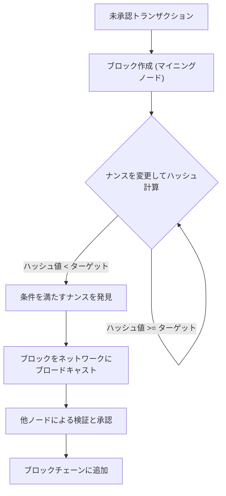
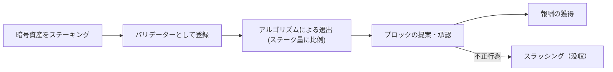
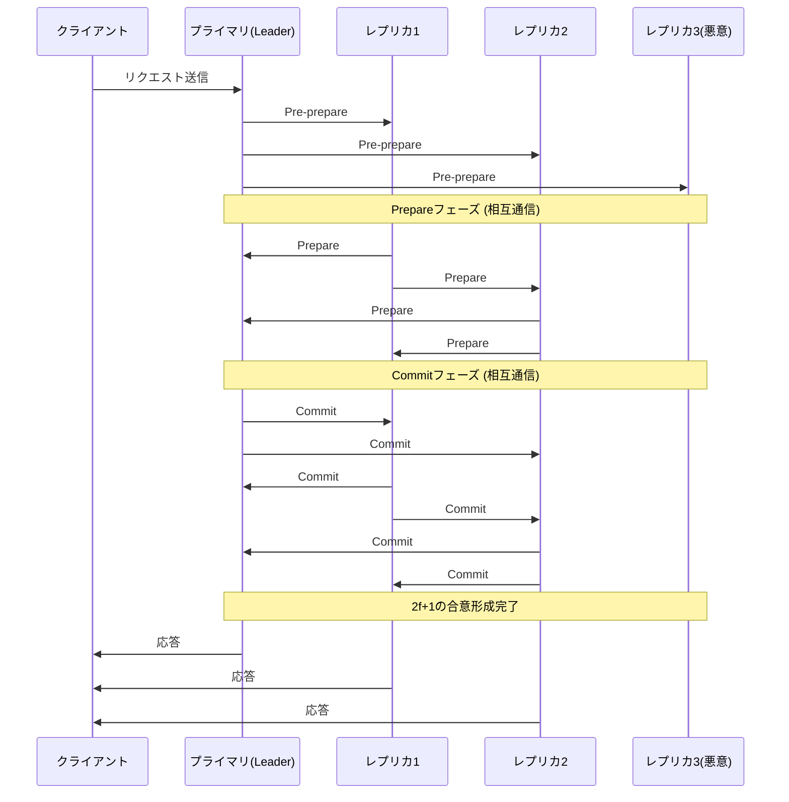

# Blockchain und Konsensalgorithmen: Den Kern dezentraler Systeme verstehen

In der heutigen Technologie vergeht kein Tag, an dem man nicht das Wort "Blockchain" hört. Allerdings verstehen nur wenige Menschen wirklich, wie der zugrunde liegende "Konsensalgorithmus" funktioniert und warum er so innovativ ist.

In verteilten Systemen war es ein langjähriges Problem in der Informatik, dass das gesamte Netzwerk ohne einen zentralen Administrator denselben Zustand (State) teilt und das System auch beim Vorhandensein böswilliger Knoten aufrechterhalten wird. In diesem Artikel erklären wir dieses Problem ausführlich aus einer technischen und theoretischen Perspektive, beginnend mit seinem Ursprung, dem "Problem der byzantinischen Generäle", über den bahnbrechenden "Proof of Work (PoW)" von Satoshi Nakamoto, seine Weiterentwicklung "Proof of Stake (PoS)" und bis hin zur "Practical Byzantine Fault Tolerance (PBFT)", die in Konsortium-Blockchains eingesetzt wird.

---

## 1. Verteilte Systeme und die Schwierigkeit der byzantinischen Fehlertoleranz (BFT)

In zentralisierten Systemen speichert ein einzelner Server oder eine Datenbank die absolute "Wahrheit". Anfragen von Clients werden an einem einzigen Ort verarbeitet, und Dateninkonsistenzen treten im Grunde nicht auf. In verteilten Systemen hingegen speichern mehrere Knoten ihre eigenen Daten und kommunizieren über ein Netzwerk, wodurch Probleme wie Verzögerungen oder Verlust von Informationen, bis hin zu Knotenausfällen und absichtlicher Manipulation, auftreten.

### Was ist das Problem der byzantinischen Generäle?

Dieses Problem wurde 1982 von Leslie Lamport, Robert Shostak und Marshall Pease als "Problem der byzantinischen Generäle (Byzantine Generals Problem)" formuliert und symbolisiert die Schwierigkeit der Konsensfindung in verteilten Systemen.

Das Szenario ist wie folgt:
- Mehrere Generäle des byzantinischen Reiches belagern eine feindliche Stadt.
- Die Generäle sind weit voneinander entfernt positioniert und können nur durch Boten kommunizieren.
- Wenn sich nicht alle Generäle vollständig auf "gemeinsamer Angriff" oder "Rückzug" einigen, schlägt die Operation fehl und sie werden vernichtet.
- Das Problem ist, dass sich unter den Generälen **Verräter (byzantinische Knoten)** befinden, die absichtlich falsche Nachrichten senden, um die Einigung zu stören.

Wie können loyale Generäle in Anwesenheit von Verrätern eine korrekte Übereinkunft erzielen? Ein System, das die Fähigkeit besitzt, dieses Problem zu lösen, wird als "byzantinisch fehlertolerant (Byzantine Fault Tolerance: BFT)" bezeichnet.

Durch mathematische und theoretische Beweise ist bekannt, dass, wenn die Anzahl der bösartigen Knoten $f$ ist, die Gesamtzahl der Knoten $N$ im Netzwerk $N \ge 3f + 1$ betragen muss, um im gesamten System einen korrekten Konsens zu erzielen. Das heißt, wenn nicht mindestens zwei Drittel des Netzwerks normal funktionieren, ist BFT nicht möglich.

### Die FLP-Unmöglichkeit in asynchronen Netzwerken

Darüber hinaus bewies das 1985 veröffentlichte "Fischer, Lynch, and Paterson impossibility result (FLP-Unmöglichkeit)", dass in einem vollständig asynchronen verteilten System deterministische Konsensalgorithmen nicht immer garantieren können, dass ein Konsens erreicht wird, selbst wenn nur ein einziger Knoten ausfallen (abstürzen) kann.

Aufgrund dieser theoretischen Grenze waren Forscher verteilter Systeme gezwungen, ihren Ansatz von "deterministischen" Methoden (die immer zu einer Einigung führen) auf "probabilistische" (die nach einiger Zeit fast sicher zu einer Einigung führen) oder "synchrone" (die eine Obergrenze für Kommunikationsverzögerungen festlegen) Methoden zu ändern. Dies wurde zur Grundlage der späteren Blockchain-Technologie.

---

## 2. Satoshi Nakamotos Durchbruch: Proof of Work (PoW)

Im Jahr 2008 präsentierte ein Whitepaper über Bitcoin, veröffentlicht von einer anonymen Person (oder Gruppe) unter dem Namen Satoshi Nakamoto, eine völlig neue "probabilistische" Lösung für dieses BFT-Problem. Es ist die Kombination aus "Proof of Work (Arbeitsnachweis)" und der "Longest Chain Rule (Regel der längsten Kette)", auch bekannt als "Nakamoto-Konsens".

### Wie PoW funktioniert: Hash-Funktionen und Schwierigkeitsanpassung

Bei PoW führen die Netzwerkteilnehmer (Miner) massive Berechnungen durch, um ein Bündel von Transaktionen (einen Block) zu verifizieren und zur Kette hinzuzufügen. Konkret nehmen sie die Header-Informationen des Blocks und einen beliebigen Wert namens "Nonce" und jagen diese durch eine kryptografische Hash-Funktion (wie SHA-256). Sie konkurrieren darum, eine Nonce zu finden, bei der der resultierende Hash-Wert kleiner ist als ein vom Netzwerk festgelegter spezifischer "Zielwert".

Aufgrund der Natur von Hash-Funktionen ist es unmöglich, die Eingabe aus der Ausgabe zurückzurechnen, so dass der einzige Weg, eine Nonce zu finden, die die Bedingungen erfüllt, darin besteht, Berechnungen durch Brute-Force zu wiederholen. Dies ist der Beweis der "Arbeit (Work)".

### Lösung des byzantinischen Fehlers durch die Regel der längsten Kette

Der Kern des Nakamoto-Konsenses liegt in seinem Verteidigungsmechanismus, wenn ein bösartiger Angreifer versucht, die Historie zu manipulieren.
Wenn dem Netzwerk gleichzeitig zwei gültige Blöcke vorgeschlagen werden (Auftreten eines Forks), akzeptieren die Knoten den zuerst empfangenen Block vorübergehend, übernehmen aber letztendlich **"die Kette mit der meisten akkumulierten Rechenleistung (PoW) (die längste Kette)"** als die gültige.

Damit ein Angreifer einen vergangenen Block manipulieren und vom Netzwerk als gültig akzeptieren lassen kann, muss er den PoW für alle Blöcke vom manipulierten Block bis in die Gegenwart neu berechnen und zudem die Geschwindigkeit übertreffen, mit der ehrliche Miner im gesamten Netzwerk neue Blöcke hinzufügen. Dies erfordert die Kontrolle über 51 % der gesamten Rechenleistung des Netzwerks (ein 51 %-Angriff), was in der Realität enorme Kosten verursacht und somit den Anreiz für einen Angriff verringert.

Satoshi Nakamoto hat die byzantinische Fehlertoleranz in öffentlichen Netzwerken mit einer unbestimmten Anzahl von Teilnehmern "probabilistisch" gelöst, indem er Kryptografie mit wirtschaftlichen Anreizen (Mining-Belohnungen) kombinierte.

---

## 3. Die Herausforderungen von PoW und der Aufstieg von Proof of Stake (PoS)

Obwohl PoW ein sehr robuster Konsensalgorithmus ist, hatte er auch große Nachteile. Diese sind "enormer Energieverbrauch" und "Grenzen der Skalierbarkeit".

Mit der Verschärfung des Mining-Wettbewerbs wurde spezielle Hardware namens ASICs entwickelt, und einige wenige große Mining-Pools begannen, die Hash-Rate zu monopolisieren. Auch die negativen Auswirkungen auf die globale Umwelt erreichten ein Ausmaß, das nicht mehr ignoriert werden konnte.

Um dies zu lösen, wurde "Proof of Stake (PoS)" erfunden.

### Grundkonzept von PoS

Anstelle der Rechenleistung (Hash-Rate) werden bei PoS Block-Vorschlagende (Validatoren) basierend auf der Menge der von ihnen gehaltenen Basiswährung des Netzwerks (Stake) und der Haltedauer ausgewählt. Durch das Sperren (Staking) der Währung trägt man zur Sicherheit des Netzwerks bei und erhält im Gegenzug eine Belohnung.

Da es keine nutzlosen Berechnungen wie bei PoW durchführt, wird der Energieverbrauch im Vergleich zu PoW um mehr als 99 % reduziert (Beispiel: Ethereum nach The Merge).

### Das "Nothing at Stake"-Problem und Slashing

In den frühen PoS-Systemen gab es eine fatale Schwachstelle, das sogenannte "Nothing at Stake (Nichts zu verlieren)"-Problem.

Wenn bei PoW ein Fork auftritt, müssen Miner ihre Rechenleistung auf eine der Ketten konzentrieren. Der Abbau auf beiden Ketten bedeutet eine Verteilung der Rechenleistung (d. h. der Stromkosten) und führt zu Verlusten. Bei PoS hingegen erfordert das Auftreten eines Forks keine zusätzlichen Kosten (Rechenleistung) für die Validatoren. Daher wird die Validierung von Blöcken auf beiden Ketten zur optimalen Strategie, um keine Belohnungen zu verpassen, was dazu führt, dass sich der Fork nicht mehr auflöst.

Um dies zu lösen, wurde im modernen PoS (wie Casper bei Ethereum) ein Strafmechanismus namens **"Slashing"** eingeführt. Wenn ein Validator bösartig handelt (z. B. durch die gleichzeitige Validierung mehrerer konkurrierender Blöcke), wird ein Teil oder die Gesamtheit der gestakten Vermögenswerte beschlagnahmt. Dadurch wird das "Nothing at Stake"-Problem durch eine wirtschaftliche Strafe gelöst und die Netzwerksicherheit gewährleistet.

---

## 4. Konsortium-Blockchains und Practical Byzantine Fault Tolerance (PBFT)

PoW und PoS sind Algorithmen, die für "öffentliche Blockchains" geeignet sind, an denen jeder teilnehmen kann. Bei "Konsortium (Permissioned) Blockchains" jedoch, bei denen die Teilnehmer identifiziert und autorisiert sind, wie z.B. bei B2B-Transaktionen oder den Backends von Finanzinstituten, werden oft andere Konsensalgorithmen eingesetzt. Ein typisches Beispiel dafür ist "PBFT (Practical Byzantine Fault Tolerance)".

### Wie PBFT funktioniert und seine 3 Phasen

PBFT, das 1999 von Miguel Castro und Barbara Liskov vorgestellt wurde, ist ein Algorithmus, der asynchrone Netzwerke effizient byzantinisch fehlertolerant macht. Es wird häufig in Enterprise-Blockchains wie Hyperledger Fabric angewendet.

PBFT führt eine **deterministische**, nicht probabilistische Konsensfindung durch. Das bedeutet, dass keine Forks auftreten und ein einmal bestätigter Block sofort final ist (Finalität besitzt).

Der Konsensprozess verläuft in den folgenden 3 Phasen:

1. **Pre-prepare-Phase**: Der Leader-Knoten (Primary) empfängt eine Anfrage vom Client und sendet eine Nachricht an alle anderen Knoten (Replikas).
2. **Prepare-Phase**: Jeder Knoten, der die Nachricht erhält, verifiziert ihre Gültigkeit und sendet eine "Prepare"-Nachricht an alle anderen Knoten. Jeder Knoten geht zur nächsten Phase über, wenn er $2f$ (zwei Drittel) Prepare-Nachrichten empfängt.
3. **Commit-Phase**: Jeder Knoten sendet eine "Commit"-Nachricht an das gesamte Netzwerk. Ebenso gilt bei Erhalt von $2f+1$ Commit-Nachrichten der Konsens als abgeschlossen; der Zustand wird aktualisiert und dem Client geantwortet.

### Vor- und Nachteile von PBFT

**Vorteile:**
- **Sofortige Finalität**: Transaktionen sind in dem Moment abgeschlossen, in dem der Konsens erreicht wird, und nicht durch probabilistische Bestätigung auf der Grundlage von Rechenleistung.
- **Hoher Durchsatz**: Da es keine absichtliche Verzögerung (Rechenarbeit) wie beim Mining gibt, können Tausende von Transaktionen pro Sekunde verarbeitet werden.
- **Energieeinsparung**: Keine groß angelegten Berechnungen erforderlich.

**Nachteile:**
- **Fehlende Skalierbarkeit**: Da Knoten sich gegenseitig Nachrichten senden, steigt das Kommunikationsvolumen (Messaging-Overhead) quadratisch mit der Anzahl der Knoten. Daher ist es nicht für große Netzwerke mit Dutzenden bis Hunderten von teilnehmenden Knoten geeignet.

---

## 5. Fazit: Die Zukunft der Konsensalgorithmen

Das klassische Problem der verteilten Systeme, das "Problem der byzantinischen Generäle", wurde in der rauen Umgebung öffentlicher Netzwerke durch die Einführung der Kryptoökonomie mit PoW durch Satoshi Nakamoto durchbrochen. Seitdem hat sich die Blockchain-Technologie auf verschiedene Weise weiterentwickelt, hin zu PoS, das darauf abzielt, die Umweltbelastung zu reduzieren und die Skalierbarkeit zu verbessern, und zu PBFT, das bei Unternehmensanwendungen Wert auf Sicherheit und Geschwindigkeit legt.

Auch heute noch wird aktiv geforscht und entwickelt, um das "Blockchain-Trilemma" (das Problem, dass es nicht möglich ist, Skalierbarkeit, Sicherheit und Dezentralisierung gleichzeitig zu maximieren) zu lösen. Dazu gehören Sharding-Technologien, Layer-2-Lösungen (Rollups) und neue Konsensmodelle, die DAGs (Directed Acyclic Graphs) verwenden.

Konsensalgorithmen sind nicht nur technische Mechanismen, sondern die Grundlage für ein groß angelegtes soziales Experiment: **"Wie können Menschen und Maschinen in einer vertrauenslosen Umgebung kooperieren und die Ordnung durch wirtschaftliche Anreize aufrechterhalten?"**. Das Verständnis ihrer Entwicklung ist nichts anderes als das Verständnis der Essenz des dezentralisierten Internets (Web3) der nächsten Generation.
