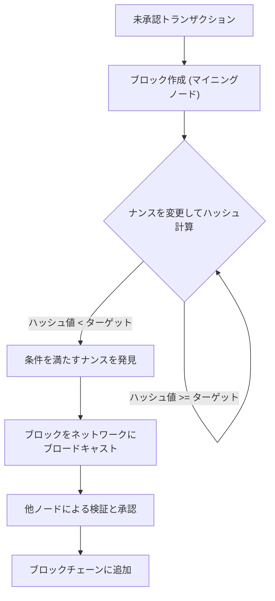
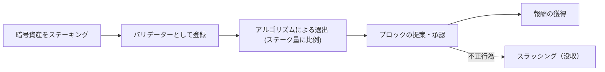
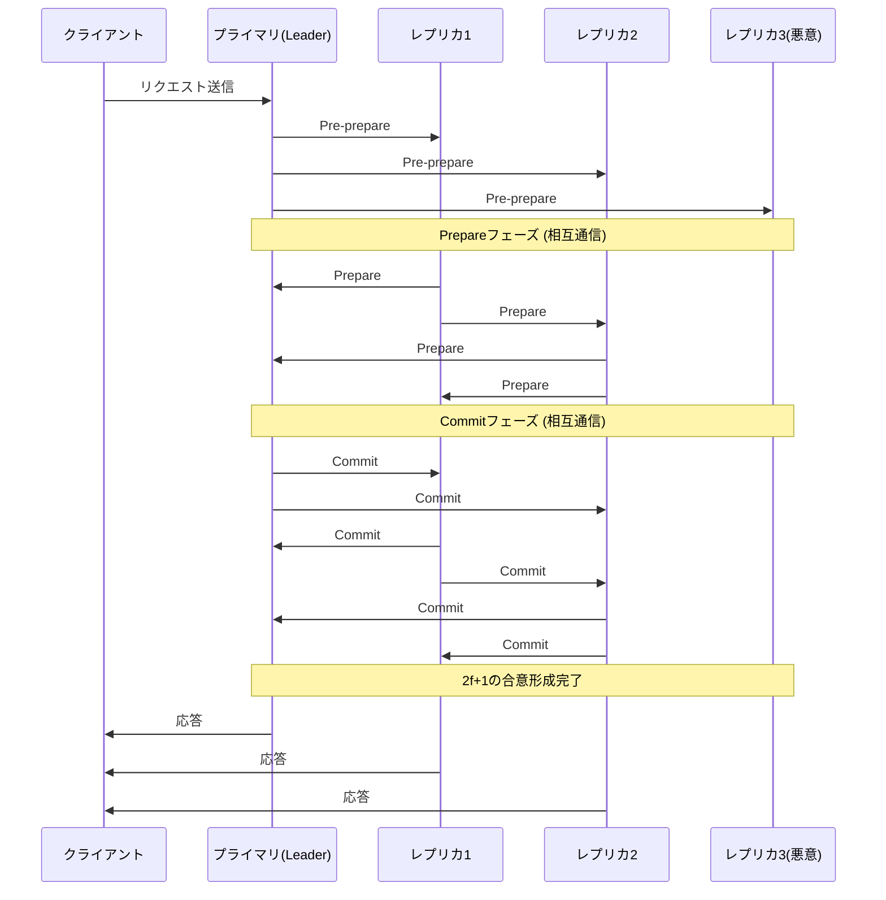

# Blockchain and Consensus Algorithms: Understanding the Core of Distributed Systems

In modern technology, not a day goes by without hearing the word "blockchain." However, not many people deeply understand how its underlying "consensus algorithms" work and why they are so innovative.

In distributed systems, allowing the entire network to share the same state without a central administrator and maintaining the system even in the presence of malicious nodes has been a long-standing challenge in computer science. This article will explain this challenge in detail from technical and theoretical perspectives, starting with its origin, the "Byzantine Generals Problem," moving to the groundbreaking "Proof of Work (PoW)" by Satoshi Nakamoto, its evolution into "Proof of Stake (PoS)," and finally "Practical Byzantine Fault Tolerance (PBFT)" utilized in consortium chains.

---

## 1. The Difficulty of Distributed Systems and Byzantine Fault Tolerance (BFT)

In centralized systems, a single server or database holds the absolute "truth." Requests from clients are processed in one place, and state inconsistencies essentially do not occur. However, in distributed systems, where multiple nodes each hold their own data and communicate over a network, they face problems such as information delay, loss, node failures, and intentional tampering.

### What is the Byzantine Generals Problem?

Formulated in 1982 by Leslie Lamport, Robert Shostak, and Marshall Pease, the "Byzantine Generals Problem" symbolizes the difficulty of achieving consensus in distributed systems.

The setup is as follows:
- Multiple generals of the Byzantine Empire are besieging an enemy city.
- The generals are located far apart and can only communicate through messengers.
- Unless all generals completely agree to either "attack at once" or "retreat," the operation will fail and they will be wiped out.
- The problem is that there are **traitors (Byzantine nodes)** among the generals who intentionally send false messages to disrupt the agreement.

How can loyal generals reach a correct agreement in the presence of traitors? A system with the ability to solve this problem is said to have "Byzantine Fault Tolerance (BFT)."

Mathematical and theoretical proofs show that if the number of malicious nodes is $f$, the total number of nodes $N$ must be $N \ge 3f + 1$ for the entire system to form a correct consensus. In other words, BFT is only viable if at least two-thirds of the network is functioning normally.

### The FLP Impossibility in Asynchronous Networks

Furthermore, the "Fischer, Lynch, and Paterson impossibility result (FLP impossibility)" published in 1985 proved that in a completely asynchronous distributed system, deterministic consensus algorithms cannot guarantee that consensus will always be reached if even a single node has the potential to fail (crash).

Due to this theoretical limit, researchers in distributed systems were forced to shift their approach from "deterministic" (always reaching consensus) methods to "probabilistic" (almost certainly reaching consensus over time) or "synchronous" (setting an upper limit on communication delay) methods. This became the foundation for subsequent blockchain technology.

---

## 2. Satoshi Nakamoto's Breakthrough: Proof of Work (PoW)

In 2008, the Bitcoin whitepaper published by an anonymous person (or group) calling themselves Satoshi Nakamoto presented a completely new "probabilistic" solution to this BFT problem. This was the combination of "Proof of Work" and the "Longest Chain Rule," known as "Nakamoto Consensus."

### How PoW Works: Hash Functions and Difficulty Adjustment

In PoW, network participants (miners) perform massive calculations to validate bundles of transactions (blocks) and add them to the chain. Specifically, they compete to find a "Nonce" (an arbitrary number) which, when run through a cryptographic hash function (such as SHA-256) along with the block's header information, produces a hash value smaller than a specific "target value" set by the network.

Due to the nature of hash functions, it is impossible to reverse-engineer the input from the output, so the only way to find a nonce that meets the condition is to repeatedly calculate it using a brute-force approach. This serves as the proof of "Work".

### Solving Byzantine Faults with the Longest Chain Rule

The essence of Nakamoto Consensus lies in its defense mechanism when a malicious attacker attempts to tamper with past history.
If two valid blocks are proposed to the network simultaneously (creating a fork), nodes temporarily accept the first block they receive, but ultimately adopt **"the chain with the most accumulated computational effort (PoW) (the longest chain)"** as the legitimate one.

For an attacker to tamper with a past block and have the network accept it as legitimate, they must recalculate the PoW for all blocks from the tampered block to the present, and moreover, exceed the speed at which the honest miners of the entire network add new blocks. This requires seizing over 51% of the entire network's computing power (a 51% attack), which realistically costs a massive amount, thereby eliminating the incentive to attack.

By fusing cryptography with economic incentives (mining rewards), Satoshi Nakamoto "probabilistically" solved Byzantine fault tolerance in a public network where an unspecified number of participants join.

---

## 3. The Challenges of PoW and the Rise of Proof of Stake (PoS)

While PoW is a highly robust consensus algorithm, it also harbored major drawbacks. These are "massive energy consumption" and "limitations in scalability."

As mining competition intensified, specialized hardware called ASICs was developed, and a few large mining pools began to monopolize the hash rate. Additionally, the negative impact on the global environment reached a level that could no longer be ignored.

To solve this, "Proof of Stake (PoS)" was devised.

### The Basic Concept of PoS

In PoS, instead of computational power (hash rate), block proposers (validators) are selected based on the amount of the network's base currency they hold (stake) and the duration they have held it. By locking up (staking) currency, they contribute to the network's security and receive rewards in return.

Because it does not perform wasteful calculations like PoW, energy consumption is reduced by over 99% compared to PoW (e.g., Ethereum after The Merge).

### The Nothing at Stake Problem and Slashing

Early PoS had a fatal vulnerability known as the "Nothing at Stake" problem.

When a fork occurs in PoW, miners must focus their computational power on one of the chains. Mining both means dividing their computational power (and thus electricity costs), resulting in a loss. However, in PoS, validators do not require additional costs (computational power) even if a fork occurs. Therefore, continuing to validate blocks on both chains becomes the optimal strategy to avoid missing out on rewards, resulting in the problem where the fork never converges.

To resolve this, modern PoS (such as Ethereum's Casper) introduced a penalty mechanism called **"Slashing."** If a validator takes malicious action (such as validating multiple competing blocks simultaneously), a portion or all of their staked assets is confiscated. As a result, the Nothing at Stake problem is solved through economic penalties, ensuring network security.

---

## 4. Consortium Blockchains and Practical Byzantine Fault Tolerance (PBFT)

PoW and PoS are algorithms suited for "public blockchains" that anyone can join. However, in "consortium (permissioned) blockchains" where participants are specified and permitted, such as in inter-company transactions or financial institution backends, different consensus algorithms are often adopted. The most representative of these is "PBFT (Practical Byzantine Fault Tolerance)."

### How PBFT Works and Its Three Phases

Published in 1999 by Miguel Castro and Barbara Liskov, PBFT is an algorithm that efficiently withstands Byzantine faults in asynchronous networks. It is widely applied in enterprise blockchains such as Hyperledger Fabric.

PBFT achieves **deterministic** consensus rather than probabilistic consensus. In other words, forks do not occur, and once a block is validated, it is immediately finalized (has finality).

The consensus process proceeds in the following three phases:

1. **Pre-prepare Phase**: A leader node (primary) receives a request from a client and broadcasts the message to all other nodes (replicas).
2. **Prepare Phase**: Each node that receives the message verifies its validity and sends a "Prepare" message to all other nodes. Each node proceeds to the next phase when it receives $2f$ (two-thirds of the total) Prepare messages.
3. **Commit Phase**: Each node sends a "Commit" message to the entire network. Similarly, upon receiving $2f+1$ Commit messages, it considers the consensus complete, updates its state, and replies to the client.

### Advantages and Disadvantages of PBFT

**Advantages:**
- **Immediate Finality**: Transactions are finalized the moment consensus is reached, rather than being probabilistically finalized based on computational effort.
- **High Throughput**: Because there are no intentional delays (computational work) like mining, it can process thousands or more transactions per second.
- **Energy Efficiency**: Does not require massive computations.

**Disadvantages:**
- **Lack of Scalability**: Because nodes send messages to each other, the communication volume (messaging overhead) increases proportionally to the square of the number of nodes. Therefore, it is unsuitable for large-scale networks with tens to hundreds of participating nodes.

---

## 5. Conclusion: The Future of Consensus Algorithms

The classic distributed system challenge known as the "Byzantine Generals Problem" was overcome in the harsh environment of public networks through the introduction of crypto-economics by Satoshi Nakamoto's PoW. Since then, blockchain technology has undergone diverse developments, evolving into PoS, which aims to reduce environmental impact and improve scalability, and PBFT, which emphasizes certainty and speed for enterprise applications.

Even today, to solve the "Blockchain Trilemma" (the problem that scalability, security, and decentralization cannot be maximized simultaneously), active research and development continues, including sharding technology, Layer 2 solutions (rollups), and new consensus models using DAGs (Directed Acyclic Graphs).

Consensus algorithms are not just technical mechanisms; they are the foundation of a grand social experiment on **"how humans and machines can cooperate in a trustless environment and maintain order through economic incentives."** Understanding their evolution is nothing less than understanding the essence of the next-generation decentralized internet (Web3).
