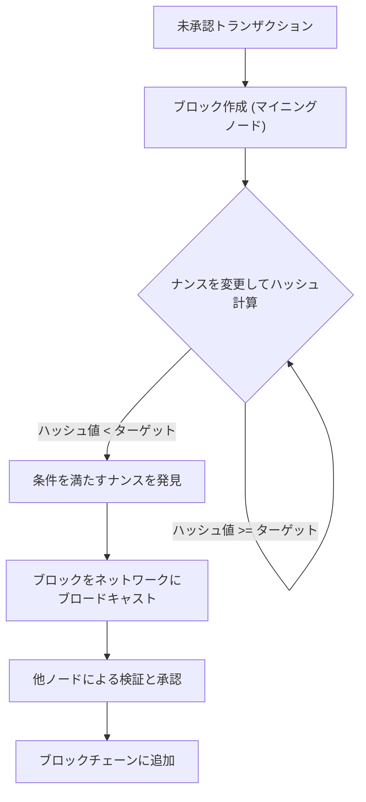
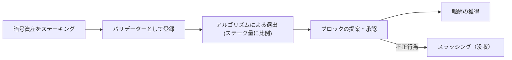
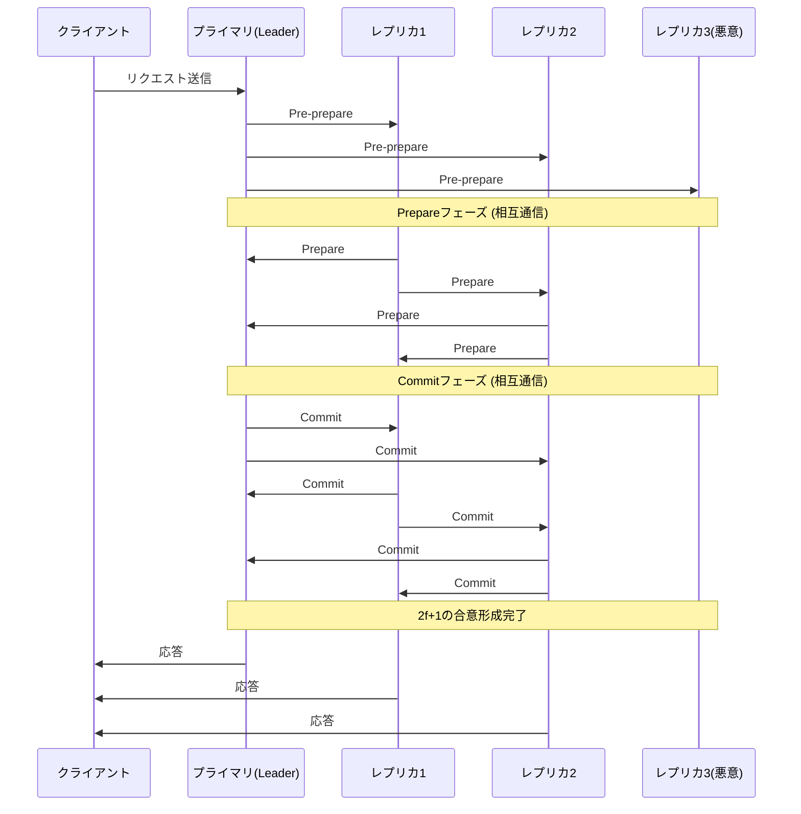

# Blockchain y algoritmos de consenso: Entendiendo el núcleo de los sistemas descentralizados

En la tecnología moderna, no pasa un día sin que escuchemos la palabra 'blockchain'. Sin embargo, pocas personas entienden profundamente cómo funcionan los 'algoritmos de consenso' subyacentes y por qué son innovadores.

En los sistemas distribuidos, compartir un mismo estado en toda la red sin un administrador central y mantener el sistema a pesar de la presencia de nodos maliciosos ha sido un desafío de larga data en la informática. En este artículo, explicaremos en detalle desde una perspectiva técnica y teórica, comenzando con el 'Problema de los Generales Bizantinos' que es el origen de este desafío, pasando por el innovador 'Proof of Work (PoW)' de Satoshi Nakamoto, su evolución 'Proof of Stake (PoS)', hasta el 'Practical Byzantine Fault Tolerance (PBFT)' utilizado en las cadenas de consorcio.

---

## 1. La dificultad de los sistemas distribuidos y la Tolerancia a Fallas Bizantinas (BFT)

En sistemas centralizados, un solo servidor o base de datos mantiene la 'verdad' absoluta. Las solicitudes de los clientes se procesan en un solo lugar y, fundamentalmente, no se producen inconsistencias de estado. Sin embargo, en los sistemas distribuidos, como múltiples nodos mantienen sus propios datos y se comunican a través de la red, se enfrentan a problemas como demoras, pérdida de información, así como fallas en los nodos y alteraciones intencionales.

### ¿Qué es el problema de los generales bizantinos?

Formulado en 1982 por Leslie Lamport, Robert Shostak y Marshall Pease como el 'Problema de los Generales Bizantinos (Byzantine Generals Problem)', este problema simboliza la dificultad de llegar a un consenso en sistemas distribuidos.

La configuración es la siguiente:
- Varios generales del Imperio Bizantino están asediando una ciudad enemiga.
- Los generales están ubicados en lugares separados y solo pueden comunicarse a través de mensajeros.
- A menos que todos los generales acuerden completamente ya sea 'atacar todos a la vez' o 'retirarse', la operación fracasará y serán aniquilados.
- El problema es que hay **traidores (nodos bizantinos)** entre los generales, que están tratando intencionalmente de enviar mensajes falsos para sabotear el consenso.

Bajo la situación donde existen traidores, ¿cómo pueden los generales leales llegar a un consenso correcto? Se dice que un sistema capaz de resolver este problema está equipado con 'Tolerancia a Fallas Bizantinas (Byzantine Fault Tolerance: BFT)'.

A través de demostraciones matemáticas y teóricas, se sabe que si el número de nodos maliciosos es $f$, para que todo el sistema alcance un consenso correcto, el número total de nodos $N$ debe ser $N \ge 3f + 1$. Es decir, BFT no se sostiene a menos que al menos dos tercios de la red sean normales.

### La imposibilidad FLP en redes asíncronas

Además, el 'resultado de imposibilidad FLP (Fischer, Lynch, and Paterson)', publicado en 1985, demostró que en un sistema distribuido completamente asíncrono, la mera posibilidad de que un solo nodo falle (crash) significa que un algoritmo de consenso determinista no puede garantizar alcanzar un acuerdo siempre.

Debido a esta limitación teórica, los investigadores de sistemas distribuidos se vieron obligados a cambiar su enfoque de métodos 'deterministas (siempre llegan a un acuerdo)' a métodos 'probabilísticos (es casi seguro que lleguen a un acuerdo con el tiempo)' o 'síncronos (se establece un límite superior a la latencia de la comunicación)'. Esto se convirtió en la base de la posterior tecnología blockchain.

---

## 2. El avance de Satoshi Nakamoto: Proof of Work (PoW)

En 2008, el whitepaper de Bitcoin publicado por una persona (o grupo) anónimo bajo el seudónimo de Satoshi Nakamoto presentó una solución 'probabilística' completamente nueva a este problema BFT. Fue una combinación de 'Proof of Work (Prueba de Trabajo)' y la 'Regla de la Cadena Más Larga (Longest Chain Rule)', el llamado 'Consenso de Nakamoto'.

### Cómo funciona PoW: Funciones Hash y ajuste de dificultad

En PoW, los participantes de la red (mineros) realizan cálculos masivos para aprobar lotes de transacciones (bloques) y agregarlos a la cadena. Específicamente, aplican una función hash criptográfica (como SHA-256) a la información del encabezado del bloque y un número arbitrario llamado 'Nonce', compitiendo para encontrar un nonce que resulte en un valor hash menor a un 'valor objetivo' específico determinado por la red.

Debido a la naturaleza de las funciones hash, es imposible calcular la entrada a partir del resultado de salida, por lo que la única forma de encontrar un nonce que cumpla la condición es repetir los cálculos mediante fuerza bruta. Esto se convierte en la prueba del 'Trabajo (Work)'.

### Resolución de fallas bizantinas mediante la regla de la cadena más larga

La esencia del Consenso de Nakamoto radica en su mecanismo de defensa cuando un atacante malicioso intenta alterar el historial pasado.
Cuando se proponen simultáneamente dos bloques válidos en la red (ocurrencia de una bifurcación), los nodos aprueban temporalmente el primer bloque recibido, pero en última instancia adoptan como válida **"la cadena con la mayor cantidad de cálculos (PoW) acumulada (la cadena más larga)"**.

Para que un atacante altere un bloque pasado y haga que la red lo acepte como válido, debe recalcular el PoW de todos los bloques desde el bloque alterado hasta el presente, y además superar la velocidad a la que los mineros honestos de toda la red agregan nuevos bloques. Esto requiere controlar más del 51% de la potencia computacional de toda la red (ataque del 51%), lo que implica costos enormes en la realidad y reduce el incentivo para atacar.

Satoshi Nakamoto resolvió 'probabilísticamente' la tolerancia a fallas bizantinas en una red pública con un número indefinido de participantes al fusionar la criptografía y los incentivos económicos (recompensas de minería).

---

## 3. Los desafíos de PoW y el surgimiento de Proof of Stake (PoS)

PoW es un algoritmo de consenso muy robusto, pero también tenía grandes defectos. Estos son el "consumo masivo de energía" y los "límites de escalabilidad".

A medida que se intensificaba la competencia por la minería, se desarrollaron hardwares dedicados llamados ASIC, y algunos grandes pools de minería comenzaron a monopolizar el hashrate. Además, el impacto negativo en el medio ambiente global alcanzó niveles que no podían ignorarse.

Para resolver esto se ideó el "Proof of Stake (PoS)".

### Conceptos básicos de PoS

En PoS, en lugar de la potencia de cálculo (hashrate), los proponentes de bloques (validadores) se seleccionan en función de la cantidad de moneda base de la red que poseen (stake) y su tiempo de tenencia. Al bloquear moneda (staking), contribuyen a la seguridad de la red y, a cambio, obtienen recompensas.

Como no se realizan cálculos innecesarios como en PoW, el consumo de energía se reduce en más de un 99% en comparación con PoW (ejemplo: después del The Merge de Ethereum).

### El problema de Nothing at Stake y Slashing

El PoS temprano tenía una vulnerabilidad fatal llamada el "problema de Nothing at Stake (nada en juego)".

En PoW, cuando ocurre una bifurcación, los mineros necesitan concentrar su poder computacional en una de las cadenas. Minar ambas significaría dispersar el poder computacional (y por lo tanto, el costo de la electricidad), lo que resultaría en una pérdida. Sin embargo, en el caso de PoS, si ocurre una bifurcación, los validadores no necesitan costos adicionales (poder computacional). Por lo tanto, seguir aprobando bloques en ambas cadenas se convierte en la estrategia óptima para no perder recompensas, lo que resulta en un problema donde la bifurcación nunca converge.

Para resolver esto, los PoS modernos (como Casper de Ethereum) introdujeron un mecanismo de penalización llamado **"Slashing"**. Si un validador realiza acciones maliciosas (como aprobar simultáneamente múltiples bloques en competencia), parte o la totalidad de los activos que había estacado son confiscados. De esta manera, el problema de Nothing at Stake se resuelve mediante una penalidad económica, garantizando la seguridad de la red.

---

## 4. Cadenas de bloques de consorcio y Practical Byzantine Fault Tolerance (PBFT)

PoW y PoS son algoritmos adecuados para "blockchains públicas" donde cualquiera puede participar. Sin embargo, en las "blockchains de consorcio (permisionadas)", donde los participantes están identificados y autorizados (como en transacciones interempresariales o en el back-end de instituciones financieras), a menudo se utilizan otros algoritmos de consenso. El principal ejemplo es "PBFT (Practical Byzantine Fault Tolerance)".

### Mecanismo de PBFT y sus 3 fases

Presentado en 1999 por Miguel Castro y Barbara Liskov, PBFT es un algoritmo que puede tolerar fallas bizantinas de manera eficiente en redes asíncronas. Se aplica ampliamente en cadenas de bloques empresariales como Hyperledger Fabric.

PBFT realiza un consenso **determinista**, no probabilístico. Es decir, no ocurren bifurcaciones, y una vez que se aprueba un bloque, se finaliza inmediatamente (tiene finalización o "finality").

El proceso de consenso se desarrolla en las siguientes 3 fases:

1. **Fase de Pre-prepare (Preparación previa)**: El nodo líder (primario) recibe una solicitud del cliente y transmite un mensaje a todos los demás nodos (réplicas).
2. **Fase de Prepare (Preparación)**: Cada nodo que recibe el mensaje verifica su validez y envía un mensaje de "Prepare" a todos los demás nodos. Cada nodo avanza a la siguiente fase cuando recibe $2f$ mensajes (dos tercios del total) de "Prepare".
3. **Fase de Commit (Confirmación)**: Cada nodo envía un mensaje de "Commit" a toda la red. De la misma manera, cuando recibe $2f+1$ mensajes de "Commit", considera que se ha completado el consenso, actualiza el estado y responde al cliente.

### Ventajas y desventajas de PBFT

**Ventajas:**
- **Finalidad inmediata**: Las transacciones se finalizan en el instante en que se alcanza el acuerdo, no de forma probabilística basada en la cantidad de cálculo.
- **Alto rendimiento (Throughput)**: Como no hay demoras intencionales (trabajo computacional) como en la minería, puede procesar miles de transacciones por segundo o más.
- **Ahorro de energía**: No requiere cálculos masivos.

**Desventajas:**
- **Falta de escalabilidad**: Dado que los nodos se envían mensajes mutuamente, el volumen de comunicación (sobrecarga de mensajería) aumenta proporcionalmente al cuadrado del número de nodos. Por lo tanto, no es adecuado para redes a gran escala donde el número de nodos participantes supera las decenas o cientos.

---

## 5. Conclusión: El futuro de los algoritmos de consenso

El difícil problema clásico de los sistemas distribuidos, el "Problema de los Generales Bizantinos", se superó en el duro entorno de las redes públicas mediante la introducción de la criptoeconomía a través del PoW de Satoshi Nakamoto. Posteriormente, la tecnología blockchain ha experimentado un desarrollo diverso, evolucionando a PoS con el objetivo de reducir la carga ambiental y mejorar la escalabilidad, y luego a PBFT, que enfatiza la certeza y la velocidad para aplicaciones empresariales.

Incluso hoy, se continúa con una activa investigación y desarrollo para resolver el "Trilema Blockchain (el desafío de que la escalabilidad, la seguridad y la descentralización no se pueden maximizar al mismo tiempo)", incluyendo tecnologías de sharding, soluciones de capa 2 (rollups) y nuevos modelos de consenso que utilizan DAG (Directed Acyclic Graph).

Los algoritmos de consenso no son solo mecanismos técnicos, sino la base de un gran experimento social sobre **"cómo los humanos y las máquinas pueden colaborar y mantener el orden a través de incentivos económicos en un entorno sin confianza"**. Comprender su evolución no es más que comprender la esencia de la Internet descentralizada de próxima generación (Web3).
