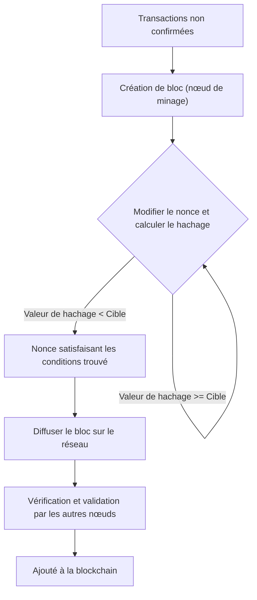
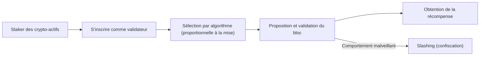
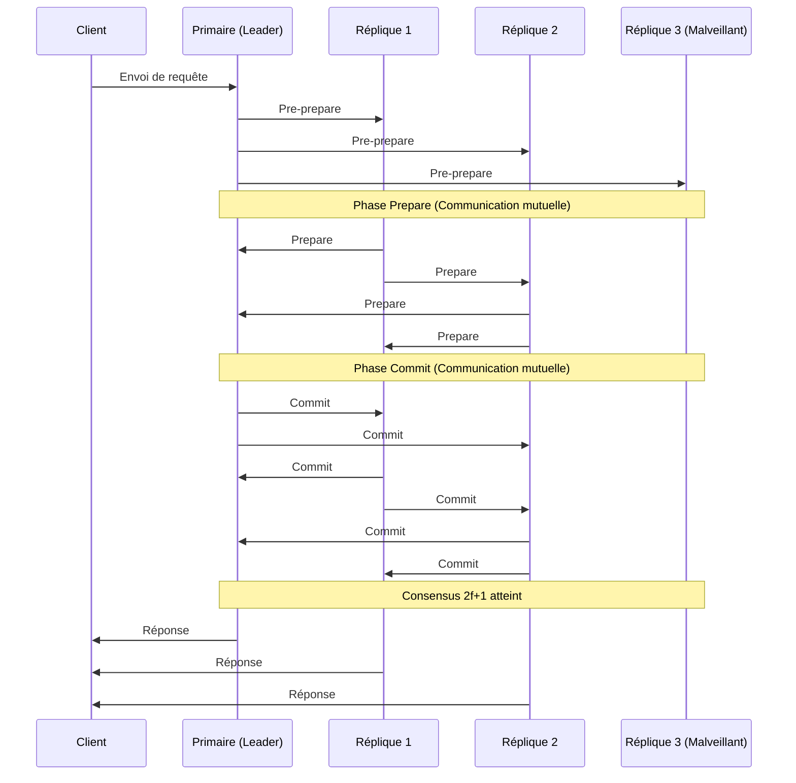

# Blockchain et Algorithmes de Consensus : Comprendre le Cœur des Systèmes Distribués

Dans la technologie moderne, il ne se passe pas un jour sans entendre le mot "blockchain". Cependant, peu de personnes comprennent profondément comment fonctionnent les "algorithmes de consensus" sous-jacents et pourquoi ils sont si révolutionnaires.

Dans les systèmes distribués, maintenir un état partagé sur l'ensemble du réseau sans administrateur central, même en présence de nœuds malveillants, a été un défi de longue date en informatique. Cet article explique en détail ce problème, de son origine dans le "problème des généraux byzantins", en passant par la percée du "Proof of Work (PoW)" par Satoshi Nakamoto, son évolution en "Proof of Stake (PoS)", jusqu'au "Practical Byzantine Fault Tolerance (PBFT)" utilisé dans les chaînes de consortium, d'un point de vue technique et théorique.

---

## 1. Systèmes Distribués et la Difficulté de la Tolérance aux Pannes Byzantines (BFT)

Dans les systèmes centralisés, un seul serveur ou base de données détient la "vérité" absolue. Les requêtes des clients sont traitées en un seul endroit, et les incohérences d'état ne se produisent généralement pas. Cependant, dans les systèmes distribués, plusieurs nœuds détiennent leurs propres données et communiquent via le réseau, ce qui les expose à des problèmes tels que les retards d'information, les pertes de données, ainsi que les pannes de nœuds ou les falsifications intentionnelles.

### Qu'est-ce que le Problème des Généraux Byzantins ?

Formulé en 1982 par Leslie Lamport, Robert Shostak et Marshall Pease comme le "problème des généraux byzantins", ce problème symbolise la difficulté d'atteindre un consensus dans les systèmes distribués.

Le scénario est le suivant :
- Plusieurs généraux de l'Empire byzantin assiègent une ville ennemie.
- Les généraux sont géographiquement séparés et ne peuvent communiquer que par des messagers.
- Si tous les généraux ne parviennent pas à un accord complet pour "attaquer ensemble" ou "battre en retraite", l'opération échoue et ils sont anéantis.
- Le problème est qu'il y a des **traîtres (nœuds byzantins)** parmi les généraux, qui tentent intentionnellement de perturber le consensus en envoyant de faux messages.

Comment les généraux loyaux peuvent-ils parvenir à un accord correct en présence de traîtres ? Un système capable de résoudre ce problème est dit posséder une "Tolérance aux Pannes Byzantines (Byzantine Fault Tolerance: BFT)".

Les preuves mathématiques et théoriques montrent que si le nombre de nœuds malveillants est $f$, le nombre total de nœuds $N$ doit être $N \ge 3f + 1$ pour que l'ensemble du système puisse former un consensus correct. En d'autres termes, la BFT ne peut être atteinte que si au moins les deux tiers du réseau sont normaux.

### L'Impossibilité FLP dans les Réseaux Asynchrones

De plus, le "résultat d'impossibilité FLP (Fischer, Lynch et Paterson)", publié en 1985, a prouvé que dans un système distribué totalement asynchrone, la possibilité qu'un seul nœud tombe en panne (crash) suffit à garantir qu'un algorithme de consensus déterministe ne peut pas toujours atteindre un accord.

En raison de cette limite théorique, les chercheurs en systèmes distribués ont été contraints de passer d'approches "déterministes" (parvenant toujours à un accord) à des approches "probabilistes" (parvenant presque certainement à un accord avec le temps) ou "synchrones" (fixant une limite supérieure au retard de communication). Cela a jeté les bases de la technologie de la blockchain qui a suivi.

---

## 2. La Percée de Satoshi Nakamoto : Proof of Work (PoW)

En 2008, le livre blanc sur le Bitcoin publié par une personne (ou un groupe) anonyme du nom de Satoshi Nakamoto a présenté une toute nouvelle solution "probabiliste" à ce problème de BFT. C'est la combinaison du "Proof of Work (Preuve de Travail)" et de la "règle de la chaîne la plus longue (Longest Chain Rule)", connue sous le nom de "Consensus de Nakamoto".

### Le Mécanisme de PoW : Fonctions de Hachage et Ajustement de la Difficulté

Dans le PoW, les participants au réseau (mineurs) effectuent des calculs massifs pour approuver un lot de transactions (bloc) et l'ajouter à la chaîne. Plus précisément, ils appliquent une fonction de hachage cryptographique (telle que SHA-256) aux informations d'en-tête du bloc et à une valeur arbitraire appelée "Nonce", et concourent pour trouver un nonce tel que la valeur de hachage résultante soit inférieure à une "valeur cible" spécifique fixée par le réseau.

En raison de la nature des fonctions de hachage, il est impossible de déduire l'entrée à partir de la sortie, donc la seule façon de trouver un nonce qui remplit les conditions est de répéter les calculs par force brute. C'est la preuve du "Travail (Work)".

### Résolution des Pannes Byzantines par la Règle de la Chaîne la Plus Longue

L'essence du Consensus de Nakamoto réside dans son mécanisme de défense lorsqu'un attaquant malveillant tente de falsifier l'historique passé.
Si deux blocs valides sont proposés simultanément sur le réseau (ce qui crée un fork), les nœuds approuvent temporairement le premier bloc qu'ils reçoivent, mais en fin de compte, ils adoptent **"la chaîne avec la plus grande quantité de puissance de calcul (PoW) accumulée (la chaîne la plus longue)"** comme la chaîne valide.

Pour qu'un attaquant falsifie un bloc passé et le fasse accepter comme valide par le réseau, il doit recalculer le PoW de tous les blocs, du bloc falsifié jusqu'au présent, et surpasser la vitesse à laquelle les mineurs honnêtes du réseau ajoutent de nouveaux blocs. Cela nécessite de contrôler plus de 51% de la puissance de calcul totale du réseau (attaque des 51%), ce qui entraîne en réalité des coûts énormes, réduisant ainsi l'incitation à l'attaque.

En combinant la cryptographie et les incitations économiques (récompenses de minage), Satoshi Nakamoto a résolu de manière "probabiliste" la tolérance aux pannes byzantines dans un réseau public ouvert à un grand nombre de participants.

---

## 3. Les Défis du PoW et l'Essor du Proof of Stake (PoS)

Bien que le PoW soit un algorithme de consensus très robuste, il présente également des inconvénients majeurs : une "consommation d'énergie énorme" et des "limites de scalabilité".

À mesure que la concurrence du minage s'intensifiait, du matériel spécialisé appelé ASIC a été développé, et certains grands pools de minage ont commencé à monopoliser le taux de hachage. De plus, son impact négatif sur l'environnement mondial a atteint un niveau qui ne pouvait être ignoré.

Pour résoudre ces problèmes, le "Proof of Stake (PoS : Preuve d'Enjeu)" a été conçu.

### Concept de Base du PoS

Dans le PoS, au lieu de la puissance de calcul (taux de hachage), les proposants de blocs (validateurs) sont sélectionnés sur la base de la quantité de monnaie de base du réseau qu'ils détiennent (enjeu) et de la durée de détention. En verrouillant (staking) de la monnaie, les utilisateurs contribuent à la sécurité du réseau et sont récompensés en retour.

Puisqu'il n'effectue pas de calculs inutiles comme le PoW, la consommation d'énergie est réduite de plus de 99% par rapport au PoW (par exemple : Ethereum après The Merge).

### Le Problème du "Nothing at Stake" et le Slashing

Les premières versions du PoS présentaient une vulnérabilité fatale connue sous le nom de problème "Nothing at Stake" (Rien à perdre).

Lorsqu'un fork se produit dans le PoW, les mineurs doivent concentrer leur puissance de calcul sur l'une des chaînes. Miner les deux signifierait diviser la puissance de calcul (et donc les coûts d'électricité), ce qui entraînerait des pertes. Cependant, dans le PoS, si un fork se produit, les validateurs n'ont pas besoin de coûts supplémentaires (puissance de calcul). Par conséquent, continuer à valider des blocs sur les deux chaînes devient la stratégie optimale pour éviter de manquer des récompenses, ce qui empêche la résolution du fork.

Pour résoudre ce problème, le PoS moderne (comme Ethereum Casper) a introduit un mécanisme de pénalité appelé **"Slashing"**. Si un validateur agit avec malveillance (comme la validation simultanée de plusieurs blocs concurrents), une partie ou la totalité de ses actifs stakés est confisquée. Ainsi, le problème "Nothing at Stake" est résolu par des pénalités économiques, garantissant la sécurité du réseau.

---

## 4. Blockchains de Consortium et Practical Byzantine Fault Tolerance (PBFT)

Le PoW et le PoS sont des algorithmes adaptés aux "blockchains publiques" où tout le monde peut participer. Cependant, dans les "blockchains de consortium (à permission)", où les participants sont identifiés et autorisés, comme pour les transactions interentreprises ou les systèmes backend des institutions financières, d'autres algorithmes de consensus sont souvent adoptés. Le représentant le plus célèbre est le "PBFT (Practical Byzantine Fault Tolerance)".

### Le Mécanisme du PBFT et ses 3 Phases

Publié en 1999 par Miguel Castro et Barbara Liskov, le PBFT est un algorithme capable de tolérer efficacement les pannes byzantines dans des réseaux asynchrones. Il est largement utilisé dans les blockchains d'entreprise telles que Hyperledger Fabric.

Le PBFT parvient à un consensus **déterministe** plutôt que probabiliste. Cela signifie que les forks ne se produisent pas, et qu'une fois approuvé, un bloc est immédiatement finalisé (possède une finalité instantanée).

Le processus de consensus se déroule en 3 phases :

1. **Phase de Pre-prepare (Pré-préparation)** : Le nœud leader (primaire) reçoit une requête du client et diffuse le message à tous les autres nœuds (répliques).
2. **Phase de Prepare (Préparation)** : Chaque nœud qui reçoit le message vérifie sa validité et envoie un message "Prepare" à tous les autres nœuds. Lorsqu'un nœud reçoit $2f$ messages "Prepare" (les deux tiers du total), il passe à la phase suivante.
3. **Phase de Commit (Validation)** : Chaque nœud envoie un message "Commit" à l'ensemble du réseau. De même, s'il reçoit $2f+1$ messages "Commit", il considère que le consensus est atteint, met à jour son état et répond au client.

### Avantages et Inconvénients du PBFT

**Avantages :**
- **Finalité immédiate** : Les transactions sont confirmées à l'instant où le consensus est atteint, plutôt que par une certitude probabiliste basée sur la puissance de calcul.
- **Débit élevé** : Puisqu'il n'y a pas de retard intentionnel comme dans le minage (travail de calcul), il peut traiter des milliers de transactions par seconde.
- **Efficacité énergétique** : Ne nécessite pas de calculs à grande échelle.

**Inconvénients :**
- **Manque de scalabilité** : Étant donné que les nœuds s'envoient des messages entre eux, le volume de communication (frais généraux de messagerie) augmente proportionnellement au carré du nombre de nœuds. Il est donc inadapté aux réseaux à grande échelle comptant plus de quelques dizaines à centaines de nœuds.

---

## 5. Conclusion : L'Avenir des Algorithmes de Consensus

Le problème classique des systèmes distribués, le "problème des généraux byzantins", a été surmonté dans le rude environnement des réseaux publics grâce à l'introduction de la crypto-économie avec le PoW par Satoshi Nakamoto. Depuis, la technologie blockchain s'est diversifiée, évoluant vers le PoS, qui vise à réduire l'impact environnemental et à améliorer la scalabilité, et vers le PBFT, qui met l'accent sur la certitude et la vitesse pour les applications d'entreprise.

Aujourd'hui encore, la recherche et le développement se poursuivent activement pour résoudre le "trilemme de la blockchain" (le défi de ne pas pouvoir maximiser simultanément la scalabilité, la sécurité et la décentralisation) grâce à des technologies de sharding, des solutions de couche 2 (rollups) et de nouveaux modèles de consensus basés sur le DAG (Graphe Orienté Acyclique).

Les algorithmes de consensus ne sont pas de simples mécanismes techniques, mais le fondement d'une expérience sociale grandiose : **"Comment les humains et les machines peuvent collaborer et maintenir l'ordre grâce à des incitations économiques dans un environnement sans confiance"**. Comprendre leur évolution n'est rien d'autre que de comprendre l'essence de l'Internet distribué de nouvelle génération (Web3).
