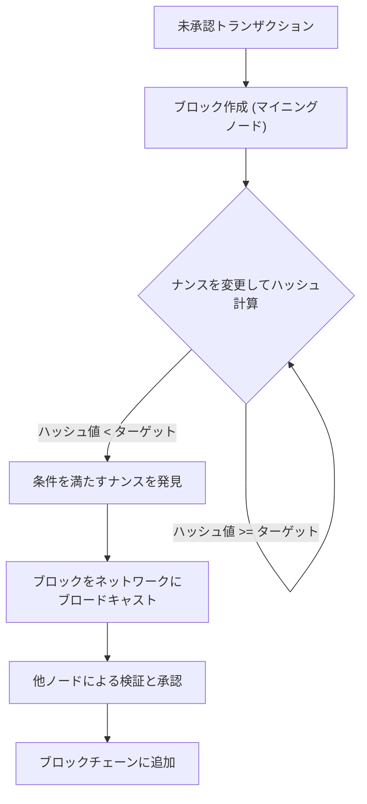
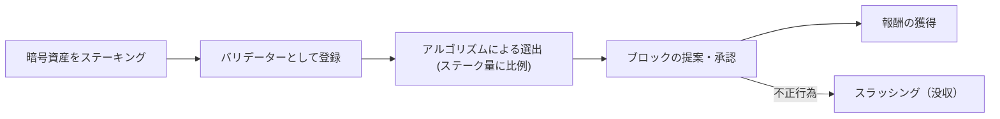
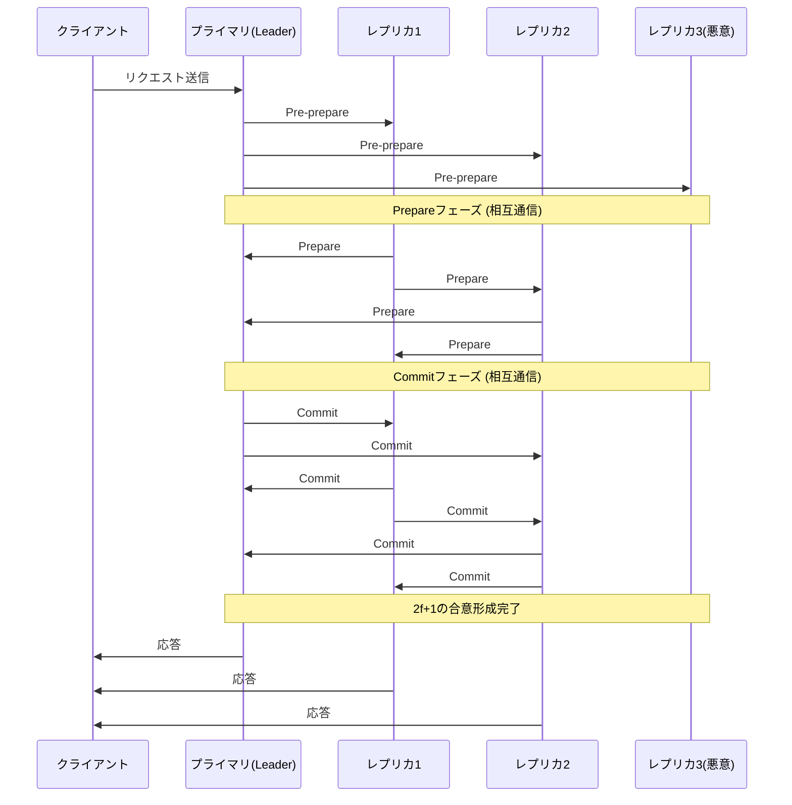

# ब्लॉकचेन और कंसेंसस एल्गोरिदम: वितरित प्रणालियों के मूल को समझना

आज की तकनीक में ऐसा कोई दिन नहीं जाता जब हम "ब्लॉकचेन" शब्द न सुनें। हालांकि, बहुत कम लोग गहराई से समझते हैं कि अंतर्निहित "कंसेंसस एल्गोरिदम" (सहमति निर्माण एल्गोरिदम) कैसे काम करता है और यह इतना क्रांतिकारी क्यों है।

वितरित प्रणालियों में, केंद्रीय व्यवस्थापक के बिना पूरे नेटवर्क द्वारा एक ही स्थिति (स्टेट) को साझा करना और दुर्भावनापूर्ण नोड्स की उपस्थिति में भी प्रणाली को बनाए रखना कंप्यूटर विज्ञान में एक लंबे समय से चली आ रही चुनौती रही है। इस लेख में, हम इस चुनौती के मूल "बीजान्टिन जनरल्स प्रॉब्लम" से शुरू करके, सातोशी नाकामोटो के क्रांतिकारी "प्रूफ ऑफ वर्क (PoW)", इसके विकसित रूप "प्रूफ ऑफ स्टेक (PoS)", और कंसोर्टियम चेन में उपयोग किए जाने वाले "प्रैक्टिकल बीजान्टिन फॉल्ट टॉलरेंस (PBFT)" तक, तकनीकी और सैद्धांतिक दृष्टिकोण से विस्तार से चर्चा करेंगे।

---

## 1. वितरित प्रणाली और बीजान्टिन फॉल्ट टॉलरेंस (BFT) की कठिनाई

केंद्रीकृत प्रणालियों में, एक एकल सर्वर या डेटाबेस पूर्ण "सत्य" रखता है। क्लाइंट के अनुरोधों को एक स्थान पर संसाधित किया जाता है, और स्थिति की विसंगतियां मूल रूप से उत्पन्न नहीं होती हैं। हालांकि, वितरित प्रणालियों में, कई नोड्स अपना स्वयं का डेटा रखते हैं और नेटवर्क पर संचार करते हैं, इसलिए वे सूचना में देरी, हानि, और यहां तक कि नोड विफलता या जानबूझकर की गई छेड़छाड़ जैसी समस्याओं का सामना करते हैं।

### बीजान्टिन जनरल्स प्रॉब्लम क्या है?

1982 में, लेस्ली लैम्पोर्ट (Leslie Lamport), रॉबर्ट शोस्टाक (Robert Shostak), और मार्शल पीज़ (Marshall Pease) द्वारा "बीजान्टिन जनरल्स प्रॉब्लम" के रूप में तैयार की गई यह समस्या वितरित प्रणालियों में सहमति बनाने की कठिनाई का प्रतीक है।

स्थितियां इस प्रकार हैं:
- बीजान्टिन साम्राज्य के कई जनरलों ने दुश्मन के शहर को घेर लिया है।
- जनरलों को दूर-दूर तैनात किया गया है और वे केवल दूतों के माध्यम से ही संवाद कर सकते हैं।
- यदि सभी जनरल "एक साथ हमले" या "वापसी" पर पूरी तरह सहमत नहीं होते हैं, तो अभियान विफल हो जाएगा और वे नष्ट हो जाएंगे।
- समस्या यह है कि जनरलों के बीच **गद्दार (बीजान्टिन नोड्स)** हैं जो जानबूझकर झूठे संदेश भेजकर सहमति को बाधित करने का प्रयास कर रहे हैं।

गद्दारों की उपस्थिति में, वफादार जनरल कैसे सही सहमति तक पहुंच सकते हैं? इस समस्या को हल करने की क्षमता वाली प्रणाली को "बीजान्टिन फॉल्ट टॉलरेंस (BFT)" से सुसज्जित कहा जाता है।

गणितीय और सैद्धांतिक प्रमाणों के अनुसार, यदि दुर्भावनापूर्ण नोड्स की संख्या $f$ है, तो पूरे सिस्टम में सही सहमति बनाने के लिए कुल नोड्स $N$ को $N \ge 3f + 1$ होना चाहिए। दूसरे शब्दों में, BFT तब तक स्थापित नहीं हो सकता जब तक कि नेटवर्क का कम से कम दो-तिहाई हिस्सा सामान्य न हो।

### एसिंक्रोनस नेटवर्क में FLP असंभवता

इसके अलावा, 1985 में प्रकाशित "FLP असंभवता (Fischer, Lynch, and Paterson impossibility result)" ने साबित किया कि पूरी तरह से एसिंक्रोनस वितरित प्रणाली में, भले ही केवल एक नोड के डाउन (क्रैश) होने की संभावना हो, एक नियतात्मक (deterministic) कंसेंसस एल्गोरिदम हमेशा सहमति तक पहुंचने की गारंटी नहीं दे सकता है।

इस सैद्धांतिक सीमा के कारण, वितरित प्रणालियों के शोधकर्ताओं को "नियतात्मक (निश्चित रूप से सहमति तक पहुंचने)" दृष्टिकोण से "संभाव्य (probabilistic - समय के साथ लगभग निश्चित रूप से सहमति तक पहुंचने)" या "सिंक्रोनस (संचार देरी पर एक ऊपरी सीमा निर्धारित करने)" दृष्टिकोण में अपना रुख बदलना पड़ा। यही बाद में ब्लॉकचेन तकनीक का आधार बना।

---

## 2. सातोशी नाकामोटो की सफलता: Proof of Work (PoW)

2008 में, सातोशी नाकामोटो नाम के एक अज्ञात व्यक्ति (या समूह) द्वारा प्रकाशित बिटकॉइन व्हाइटपेपर ने इस BFT समस्या के लिए पूरी तरह से नया "संभाव्य" समाधान प्रस्तुत किया। यह "प्रूफ ऑफ वर्क (PoW)" और "लॉन्गेस्ट चेन रूल (Longest Chain Rule)" का संयोजन है, जिसे "नाकामोटो कंसेंसस" कहा जाता है।

### PoW तंत्र: हैश फ़ंक्शन और कठिनाई समायोजन

PoW में, नेटवर्क प्रतिभागी (माइनर्स) लेनदेन के बंडल (ब्लॉक) को स्वीकृत करने और उन्हें चेन में जोड़ने के लिए बड़े पैमाने पर गणना करते हैं। विशेष रूप से, वे ब्लॉक के हेडर जानकारी और "नॉन्स (Nonce)" नामक एक यादृच्छिक संख्या को क्रिप्टोग्राफिक हैश फ़ंक्शन (जैसे SHA-256) के माध्यम से गुजारते हैं, और एक ऐसे नॉन्स को खोजने के लिए प्रतिस्पर्धा करते हैं जिसका परिणामी हैश मान नेटवर्क द्वारा निर्धारित विशिष्ट "लक्ष्य मान" से छोटा हो।

हैश फ़ंक्शन की प्रकृति के कारण, आउटपुट से इनपुट की गणना करना असंभव है, इसलिए शर्तों को पूरा करने वाले नॉन्स को खोजने का एकमात्र तरीका ब्रूट-फोर्स द्वारा गणना को दोहराना है। यह "कार्य (Work)" का प्रमाण बन जाता है।

### लॉन्गेस्ट चेन रूल द्वारा बीजान्टिन फॉल्ट का समाधान

नाकामोटो कंसेंसस का सार अतीत के इतिहास से छेड़छाड़ करने का प्रयास करने वाले दुर्भावनापूर्ण हमलावरों के खिलाफ इसकी रक्षा तंत्र में निहित है।
जब नेटवर्क पर एक साथ दो वैध ब्लॉक प्रस्तावित किए जाते हैं (फोर्क की घटना), तो नोड्स अस्थायी रूप से पहले प्राप्त ब्लॉक को स्वीकृत करते हैं, लेकिन अंततः **"वह चेन जिसमें सबसे अधिक गणना (PoW) जमा हुई है (सबसे लंबी चेन)"** को वैध के रूप में अपनाया जाता है।

एक हमलावर द्वारा पिछले ब्लॉक से छेड़छाड़ करने और उसे नेटवर्क द्वारा वैध के रूप में मान्यता दिलाने के लिए, उसे छेड़छाड़ किए गए ब्लॉक से लेकर वर्तमान तक के सभी ब्लॉकों के PoW की पुनर्गणना करनी होगी, और नेटवर्क में ईमानदार माइनर्स द्वारा नए ब्लॉक जोड़े जाने की गति को भी पार करना होगा। इसके लिए नेटवर्क की कुल गणना शक्ति (51% हमला) के 51% से अधिक को नियंत्रित करने की आवश्यकता है, और यथार्थवादी रूप से इसकी लागत इतनी बड़ी होगी कि हमले का प्रोत्साहन खत्म हो जाता है।

क्रिप्टोग्राफी और आर्थिक प्रोत्साहन (माइनिंग इनाम) को मिलाकर, सातोशी नाकामोटो ने एक सार्वजनिक नेटवर्क में बीजान्टिन फॉल्ट टॉलरेंस को "संभाव्य रूप से" हल किया जहां अनिश्चित संख्या में लोग भाग लेते हैं।

---

## 3. PoW की चुनौतियां और Proof of Stake (PoS) का उदय

PoW एक बहुत ही मजबूत कंसेंसस एल्गोरिदम है, लेकिन इसकी प्रमुख कमियां भी थीं। वे हैं "विशाल ऊर्जा खपत" और "स्केलेबिलिटी की सीमाएं"।

जैसे-जैसे माइनिंग प्रतिस्पर्धा तेज हुई, ASIC नामक विशेष हार्डवेयर विकसित किए गए, और कुछ बड़े माइनिंग पूलों ने हैशरेट पर एकाधिकार करना शुरू कर दिया। इसके अतिरिक्त, वैश्विक पर्यावरण पर पड़ने वाले नकारात्मक प्रभाव उस स्तर तक पहुंच गए जिन्हें नजरअंदाज नहीं किया जा सकता था।

इसे हल करने के लिए "प्रूफ ऑफ स्टेक (PoS)" तैयार किया गया था।

### PoS की मूल अवधारणा

PoS में, गणना शक्ति (हैशरेट) के बजाय, ब्लॉक के प्रस्तावक (वैलिडेटर्स) को नेटवर्क की मूल मुद्रा की होल्डिंग राशि (स्टेक) और होल्डिंग अवधि के आधार पर चुना जाता है। मुद्रा को लॉक (स्टेकिंग) करके, आप नेटवर्क की सुरक्षा में योगदान करते हैं और बदले में इनाम प्राप्त करते हैं।

चूंकि यह PoW जैसी अनावश्यक गणना नहीं करता है, इसलिए ऊर्जा खपत PoW की तुलना में 99% से अधिक कम हो जाती है (उदाहरण के लिए: एथेरियम के The Merge के बाद)।

### नथिंग एट स्टेक (Nothing at Stake) समस्या और स्लैशिंग

शुरुआती PoS में "नथिंग एट स्टेक (Nothing at Stake)" समस्या नामक एक गंभीर भेद्यता मौजूद थी।

जब PoW में फोर्क होता है, तो माइनर्स को अपनी गणना शक्ति को किसी एक चेन पर केंद्रित करने की आवश्यकता होती है। दोनों को माइन करने का अर्थ है गणना शक्ति (यानी बिजली की लागत) को फैलाना, जिसके परिणामस्वरूप नुकसान होगा। हालांकि, PoS के मामले में, फोर्क होने पर भी वैलिडेटर्स को अतिरिक्त लागत (गणना शक्ति) की आवश्यकता नहीं होती है। इसलिए, दोनों चेन पर ब्लॉक को स्वीकृत करना जारी रखना पुरस्कारों को न खोने की इष्टतम रणनीति बन जाता है, जिससे अंततः फोर्क कभी हल नहीं होता है।

इसे हल करने के लिए, आधुनिक PoS (जैसे एथेरियम का Casper) में **"स्लैशिंग (Slashing)"** नामक एक दंड तंत्र पेश किया गया था। यदि कोई वैलिडेटर दुर्भावनापूर्ण तरीके से कार्य करता है (जैसे एक साथ कई प्रतिस्पर्धी ब्लॉकों को स्वीकृत करना), तो उनके स्टेक किए गए परिसंपत्तियों का कुछ या पूरा हिस्सा जब्त कर लिया जाता है। इसके परिणामस्वरूप, नथिंग एट स्टेक समस्या आर्थिक दंड द्वारा हल हो जाती है, और नेटवर्क की सुरक्षा सुनिश्चित हो जाती है।

---

## 4. कंसोर्टियम ब्लॉकचेन और Practical Byzantine Fault Tolerance (PBFT)

PoW और PoS ऐसे एल्गोरिदम हैं जो "पब्लिक ब्लॉकचेन" के लिए उपयुक्त हैं जहां कोई भी भाग ले सकता है। हालांकि, व्यावसायिक लेनदेन और वित्तीय संस्थानों के बैकएंड जैसे "कंसोर्टियम-प्रकार (अनुमति प्राप्त) ब्लॉकचेन" में, जहां प्रतिभागियों को पहचाना और अनुमति दी जाती है, अक्सर एक अलग कंसेंसस एल्गोरिदम अपनाया जाता है। इसका एक प्रमुख उदाहरण "PBFT (Practical Byzantine Fault Tolerance)" है।

### PBFT तंत्र और 3 चरण

1999 में मिगुएल कास्त्रो (Miguel Castro) और बारबरा लिसकोव (Barbara Liskov) द्वारा प्रकाशित PBFT, एक ऐसा एल्गोरिदम है जो एसिंक्रोनस नेटवर्क में बीजान्टिन दोषों का कुशलतापूर्वक सामना कर सकता है। यह हाइपरलेजर फैब्रिक जैसे एंटरप्राइज़ ब्लॉकचेन में व्यापक रूप से लागू किया गया है।

PBFT संभाव्य नहीं बल्कि **नियतात्मक (deterministic)** सहमति बनाता है। दूसरे शब्दों में, कोई फोर्क नहीं होता है, और एक बार स्वीकृत होने के बाद ब्लॉक तुरंत अंतिम रूप (फाइनालिटी) ले लेता है।

सहमति प्रक्रिया निम्नलिखित 3 चरणों में आगे बढ़ती है:

1. **Pre-prepare (पूर्व-तैयारी) चरण**: लीडर नोड (प्राइमरी) क्लाइंट से अनुरोध प्राप्त करता है और अन्य सभी नोड्स (रेप्लिका) को संदेश प्रसारित करता है।
2. **Prepare (तैयारी) चरण**: संदेश प्राप्त करने वाला प्रत्येक नोड इसकी वैधता की पुष्टि करता है और अन्य सभी नोड्स को "Prepare" संदेश भेजता है। प्रत्येक नोड अगले चरण में आगे बढ़ता है जब वह $2f$ (कुल का दो-तिहाई) Prepare संदेश प्राप्त करता है।
3. **Commit (कमिट) चरण**: प्रत्येक नोड पूरे नेटवर्क में "Commit" संदेश भेजता है। इसी तरह, जब $2f+1$ Commit संदेश प्राप्त होते हैं, तो सहमति पूरी मानी जाती है, स्थिति अपडेट की जाती है और क्लाइंट को उत्तर दिया जाता है।

### PBFT के फायदे और नुकसान

**फायदे:**
- **तत्काल फाइनालिटी**: यह गणना शक्ति के कारण संभाव्य पुष्टिकरण नहीं है; सहमति बनने के क्षण में लेनदेन की पुष्टि हो जाती है।
- **उच्च थ्रूपुट**: चूंकि माइनिंग (कम्प्यूटेशनल कार्य) जैसी कोई जानबूझकर देरी नहीं होती है, इसलिए यह प्रति सेकंड हजारों लेनदेन को संसाधित कर सकता है।
- **ऊर्जा की बचत**: इसे बड़े पैमाने पर गणना की आवश्यकता नहीं है।

**नुकसान:**
- **स्केलेबिलिटी की कमी**: चूंकि नोड्स एक-दूसरे को संदेश भेजते हैं, इसलिए ट्रैफ़िक (मैसेजिंग ओवरहेड) नोड्स की संख्या के वर्ग के अनुपात में बढ़ता है। इसलिए, यह बड़े पैमाने के नेटवर्क के लिए अनुपयुक्त है जहां भाग लेने वाले नोड्स की संख्या दसियों या सैकड़ों से अधिक है।

---

## 5. निष्कर्ष: कंसेंसस एल्गोरिदम का भविष्य

"बीजान्टिन जनरल्स प्रॉब्लम" नामक वितरित प्रणालियों की क्लासिक चुनौती को सातोशी नाकामोटो द्वारा PoW के माध्यम से क्रिप्टो-इकोनॉमिक्स की शुरूआत के साथ सार्वजनिक नेटवर्क के कठोर वातावरण में दूर किया गया था। तब से, ब्लॉकचेन तकनीक ने विविध विकास किए हैं, पर्यावरण प्रभाव को कम करने और स्केलेबिलिटी में सुधार करने के उद्देश्य से PoS के रूप में विकसित हुआ है, और एंटरप्राइज़ अनुप्रयोगों के लिए निश्चितता और गति पर जोर देने वाले PBFT में।

यहां तक कि आज भी, "ब्लॉकचेन ट्रिलेम्मा (स्केलेबिलिटी, सुरक्षा, और विकेंद्रीकरण इन तीनों को एक साथ अधिकतम नहीं किया जा सकता है, यह चुनौती)" को हल करने के लिए सक्रिय अनुसंधान और विकास जारी है, जैसे शार्डिंग तकनीक, लेयर 2 समाधान (रोल-अप), और DAG (Directed Acyclic Graph) का उपयोग करने वाले नए कंसेंसस मॉडल।

कंसेंसस एल्गोरिदम केवल एक तकनीकी तंत्र नहीं है, बल्कि एक भव्य सामाजिक प्रयोग का आधार है कि **"कैसे मनुष्य और मशीनें सहयोग कर सकते हैं और विश्वास रहित वातावरण में आर्थिक प्रोत्साहन के माध्यम से व्यवस्था बनाए रख सकते हैं।"** इसके विकास को समझना अगली पीढ़ी के विकेंद्रीकृत इंटरनेट (Web3) के सार को समझने से कम नहीं है。
