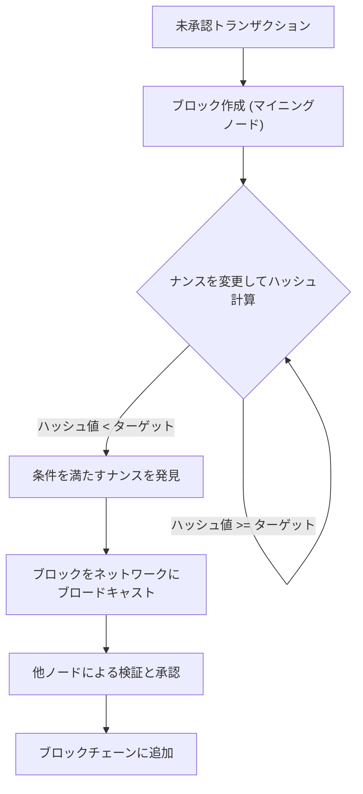
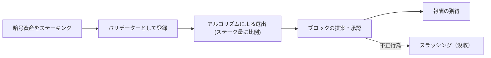
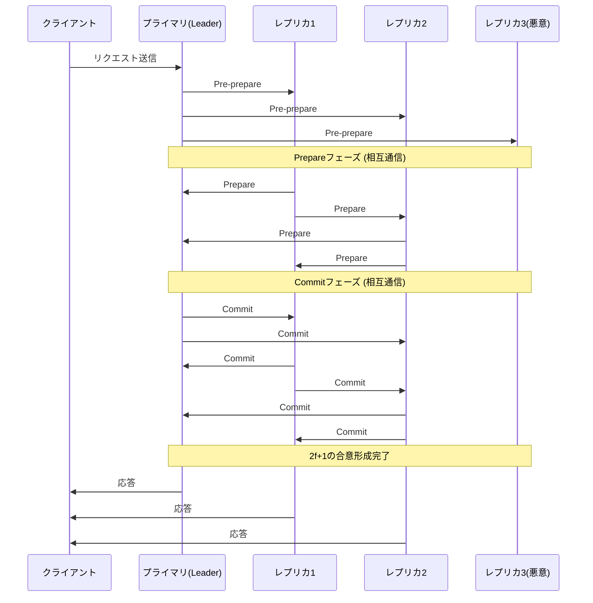

# Blockchain dan Algoritma Konsensus: Memahami Inti dari Sistem Terdistribusi

Di dunia teknologi modern, tidak ada hari tanpa mendengar kata "blockchain". Namun, tidak banyak orang yang sangat memahami bagaimana "algoritma konsensus" yang mendasarinya bekerja dan mengapa itu inovatif.

Dalam sistem terdistribusi, di mana tidak ada administrator pusat dan seluruh jaringan berbagi state yang sama, mempertahankan sistem bahkan ketika terdapat node jahat telah menjadi tantangan lama dalam ilmu komputer. Artikel ini membahas secara rinci dari sudut pandang teknis dan teoretis, dimulai dari asal usul tantangan ini yaitu "Masalah Jenderal Bizantium", hingga penemuan revolusioner Satoshi Nakamoto "Proof of Work (PoW)", evolusinya "Proof of Stake (PoS)", dan "Practical Byzantine Fault Tolerance (PBFT)" yang digunakan dalam konsorsium chain.

---

## 1. Sistem Terdistribusi dan Kesulitan Toleransi Kesalahan Bizantium (Byzantine Fault Tolerance / BFT)

Dalam sistem terpusat, sebuah server atau basis data tunggal memegang "kebenaran" mutlak. Permintaan dari klien diproses di satu tempat, dan inkonsistensi state pada dasarnya tidak terjadi. Namun, dalam sistem terdistribusi, banyak node yang masing-masing menyimpan datanya sendiri dan berkomunikasi melalui jaringan, sehingga menghadapi masalah seperti penundaan, hilangnya informasi, serta kegagalan node atau pemalsuan yang disengaja.

### Apa itu Masalah Jenderal Bizantium?

Dirumuskan pada tahun 1982 oleh Leslie Lamport, Robert Shostak, dan Marshall Pease sebagai "Masalah Jenderal Bizantium (Byzantine Generals Problem)", masalah ini melambangkan kesulitan pembentukan konsensus dalam sistem terdistribusi.

Pengaturannya adalah sebagai berikut:
- Beberapa jenderal Kekaisaran Bizantium mengepung sebuah kota musuh.
- Para jenderal ditempatkan di lokasi yang berjauhan dan hanya dapat berkomunikasi melalui utusan.
- Kecuali jika semua jenderal sepenuhnya sepakat antara "serangan serentak" atau "mundur", operasi tersebut akan gagal dan mereka akan hancur.
- Masalahnya adalah, di antara para jenderal, terdapat **pengkhianat (node Bizantium)** yang sengaja mencoba mengganggu konsensus dengan mengirimkan pesan palsu.

Dalam situasi di mana ada pengkhianat, bagaimana para jenderal yang setia dapat mencapai konsensus yang benar? Sistem yang memiliki kemampuan untuk memecahkan masalah ini dikatakan memiliki "Toleransi Kesalahan Bizantium (Byzantine Fault Tolerance: BFT)".

Melalui bukti matematis dan teoretis, telah diketahui bahwa jika jumlah node jahat adalah $f$, agar seluruh sistem dapat membentuk konsensus yang benar, total jumlah node $N$ harus $N \ge 3f + 1$. Artinya, setidaknya dua pertiga dari jaringan harus normal agar BFT dapat terwujud.

### Ketidakmungkinan FLP dalam Jaringan Asinkron

Selain itu, "Ketidakmungkinan FLP (Fischer, Lynch, and Paterson impossibility result)" yang diterbitkan pada tahun 1985 membuktikan bahwa dalam sistem terdistribusi yang sepenuhnya asinkron, meskipun hanya ada kemungkinan satu node mati (crash), algoritma konsensus deterministik tidak dapat selalu menjamin pencapaian konsensus.

Karena batasan teoretis ini, para peneliti sistem terdistribusi terpaksa mengubah pendekatan mereka dari metode "deterministik (pasti mencapai konsensus)" menjadi metode "probabilistik (hampir pasti mencapai konsensus seiring berjalannya waktu)" atau "sinkron (menetapkan batas atas pada penundaan komunikasi)". Hal ini kemudian menjadi dasar bagi teknologi blockchain.

---

## 2. Terobosan Satoshi Nakamoto: Proof of Work (PoW)

Pada tahun 2008, whitepaper Bitcoin yang diterbitkan oleh individu (atau kelompok) anonim yang menyebut dirinya Satoshi Nakamoto menghadirkan solusi "probabilistik" yang sama sekali baru untuk masalah BFT ini. Itulah kombinasi dari "Proof of Work (Bukti Kerja)" dan "Aturan Rantai Terpanjang (Longest Chain Rule)", yang juga dikenal sebagai "Konsensus Nakamoto".

### Cara Kerja PoW: Fungsi Hash dan Penyesuaian Kesulitan

Dalam PoW, peserta jaringan (penambang) melakukan komputasi besar-besaran untuk menyetujui sekumpulan transaksi (blok) dan menambahkannya ke rantai. Secara khusus, mereka bersaing untuk menemukan nonce sedemikian rupa sehingga ketika informasi header blok dan angka sembarang yang disebut "Nonce" dimasukkan ke dalam fungsi hash kriptografi (seperti SHA-256), nilai hash yang dihasilkan lebih kecil dari "nilai target" spesifik yang ditetapkan oleh jaringan.

Karena sifat fungsi hash, tidak mungkin membalikkan input dari hasil output, sehingga satu-satunya cara untuk menemukan nonce yang memenuhi syarat adalah dengan mengulangi komputasi melalui coba-coba (brute force). Inilah yang menjadi bukti "Kerja (Work)".

### Penyelesaian Kesalahan Bizantium melalui Aturan Rantai Terpanjang

Inti dari Konsensus Nakamoto terletak pada mekanisme pertahanan terhadap penyerang jahat yang mencoba mengubah riwayat masa lalu.
Jika dua blok yang sah diusulkan secara bersamaan di jaringan (terjadinya fork), node untuk sementara akan menyetujui blok pertama yang diterimanya, namun pada akhirnya akan mengadopsi **"rantai dengan jumlah komputasi terbanyak (PoW) yang terakumulasi (rantai terpanjang)"** sebagai rantai yang sah.

Agar penyerang dapat mengubah blok masa lalu dan membuatnya diakui oleh jaringan sebagai sesuatu yang sah, mereka harus menghitung ulang PoW dari semua blok mulai dari blok yang diubah hingga saat ini, dan juga melampaui kecepatan penambang jujur di seluruh jaringan yang menambahkan blok baru. Hal ini memerlukan penguasaan lebih dari 51% dari kapasitas komputasi seluruh jaringan (Serangan 51%), dan dalam kenyataannya ini sangat mahal, sehingga insentif untuk menyerang berkurang.

Satoshi Nakamoto menyelesaikan toleransi kesalahan Bizantium secara "probabilistik" dalam jaringan publik di mana banyak pihak yang tidak ditentukan berpartisipasi, dengan menggabungkan kriptografi dan insentif ekonomi (hadiah penambangan).

---

## 3. Tantangan PoW dan Bangkitnya Proof of Stake (PoS)

PoW adalah algoritma konsensus yang sangat kuat, namun ia juga memiliki kekurangan yang besar, yaitu "konsumsi energi yang sangat besar" dan "keterbatasan skalabilitas".

Seiring dengan semakin ketatnya persaingan penambangan, perangkat keras khusus yang disebut ASIC dikembangkan, dan beberapa kumpulan penambangan besar (mining pool) mulai memonopoli hashrate. Selain itu, dampak negatif terhadap lingkungan global juga mencapai tingkat yang tidak dapat diabaikan.

Untuk menyelesaikan masalah ini, "Proof of Stake (PoS)" dirancang.

### Konsep Dasar PoS

Dalam PoS, alih-alih kekuatan komputasi (hashrate), pengusul blok (validator) dipilih berdasarkan jumlah mata uang utama jaringan yang dipegang (stake) dan lamanya waktu penyimpanan. Dengan mengunci mata uang (staking), mereka berkontribusi pada keamanan jaringan, dan mendapatkan hadiah sebagai imbalannya.

Karena tidak melakukan komputasi yang sia-sia seperti PoW, konsumsi energi berkurang lebih dari 99% dibandingkan dengan PoW (contoh: Ethereum pasca The Merge).

### Masalah Nothing at Stake dan Slashing

Pada awal kemunculannya, PoS memiliki kerentanan fatal yang disebut "Masalah Nothing at Stake (Tidak ada yang dipertaruhkan)".

Saat terjadi fork di PoW, penambang perlu memusatkan kekuatan komputasi pada salah satu rantai. Menambang keduanya berarti menyebarkan daya komputasi (yaitu biaya listrik) dan menyebabkan kerugian. Namun, dalam kasus PoS, meskipun terjadi fork, validator tidak memerlukan biaya tambahan (daya komputasi). Oleh karena itu, terus menyetujui blok di kedua rantai menjadi strategi optimal untuk tidak melewatkan hadiah, dan sebagai hasilnya muncul masalah di mana fork tidak dapat disatukan.

Untuk menyelesaikannya, dalam PoS modern (misalnya Casper milik Ethereum), mekanisme penalti yang disebut **"Slashing"** diperkenalkan. Jika validator melakukan tindakan jahat (seperti menyetujui beberapa blok yang bersaing secara bersamaan), sebagian atau seluruh aset yang distaking akan disita. Dengan demikian, masalah Nothing at Stake diselesaikan melalui penalti ekonomi, dan keamanan jaringan terjamin.

---

## 4. Blockchain Konsorsium dan Practical Byzantine Fault Tolerance (PBFT)

PoW dan PoS adalah algoritma yang cocok untuk "blockchain publik" di mana siapa pun dapat berpartisipasi. Namun, dalam "blockchain konsorsium (yang diizinkan)" di mana pesertanya spesifik dan diizinkan, seperti transaksi antar perusahaan dan sistem backend lembaga keuangan, algoritma konsensus yang berbeda sering kali diadopsi. Salah satu yang paling representatif adalah "PBFT (Practical Byzantine Fault Tolerance)".

### Cara Kerja PBFT dan 3 Fasenya

Diterbitkan pada tahun 1999 oleh Miguel Castro dan Barbara Liskov, PBFT adalah algoritma yang secara efisien mampu menahan kesalahan Bizantium dalam jaringan asinkron. Hal ini diterapkan secara luas pada blockchain perusahaan seperti Hyperledger Fabric.

PBFT melakukan pembentukan konsensus yang bersifat **deterministik** alih-alih probabilistik. Dengan kata lain, tidak terjadi fork, dan setelah sebuah blok disetujui, ia segera dipastikan (memiliki finalitas).

Proses konsensus berlanjut melalui 3 fase berikut:

1. **Fase Pre-prepare (Pra-persiapan)**: Node pemimpin (primer) menerima permintaan dari klien dan menyiarkan pesan ke semua node lain (replika).
2. **Fase Prepare (Persiapan)**: Setiap node yang menerima pesan akan memverifikasi keabsahannya dan mengirim pesan "Prepare" ke semua node lainnya. Setelah setiap node menerima $2f$ (dua pertiga dari keseluruhan) pesan Prepare, node tersebut beralih ke fase berikutnya.
3. **Fase Commit (Komitmen)**: Setiap node mengirimkan pesan "Commit" ke seluruh jaringan. Demikian pula, setelah menerima $2f+1$ pesan Commit, node menganggap konsensus telah selesai, memperbarui statenya, dan membalas klien.

### Kelebihan dan Kekurangan PBFT

**Kelebihan:**
- **Finalitas Instan**: Bukan konfirmasi probabilistik berdasarkan jumlah komputasi, melainkan transaksi dikonfirmasi pada saat kesepakatan tercapai.
- **Throughput Tinggi**: Karena tidak ada penundaan yang disengaja (pekerjaan komputasi) seperti penambangan, ribuan atau lebih transaksi per detik dapat diproses.
- **Hemat Energi**: Tidak memerlukan komputasi skala besar.

**Kekurangan:**
- **Kurangnya Skalabilitas**: Karena node saling mengirim pesan, volume komunikasi (messaging overhead) meningkat sebanding dengan kuadrat jumlah node. Oleh karena itu, ini tidak cocok untuk jaringan berskala besar dengan puluhan hingga ratusan node atau lebih.

---

## 5. Kesimpulan: Masa Depan Algoritma Konsensus

Tantangan klasik sistem terdistribusi yang dikenal sebagai "Masalah Jenderal Bizantium" berhasil diatasi di lingkungan jaringan publik yang keras dengan pengenalan kripto-ekonomi oleh Satoshi Nakamoto melalui PoW. Sejak saat itu, teknologi blockchain telah mengalami berbagai perkembangan, berkembang menjadi PoS yang bertujuan mengurangi dampak lingkungan dan meningkatkan skalabilitas, serta PBFT yang menekankan kepastian dan kecepatan untuk penggunaan perusahaan.

Bahkan saat ini, untuk memecahkan "Trilema Blockchain (tantangan di mana skalabilitas, keamanan, dan desentralisasi tidak dapat dimaksimalkan secara bersamaan)", penelitian dan pengembangan yang aktif terus berlanjut, termasuk teknologi sharding, solusi Layer 2 (Rollups), dan model konsensus baru menggunakan DAG (Directed Acyclic Graph).

Algoritma konsensus bukan sekadar mekanisme teknis, melainkan fondasi dari eksperimen sosial besar tentang **"bagaimana manusia dan mesin dapat berkolaborasi dan menjaga ketertiban melalui insentif ekonomi di lingkungan tanpa kepercayaan"**. Memahami evolusinya sama halnya dengan memahami esensi dari internet terdistribusi generasi berikutnya (Web3).
