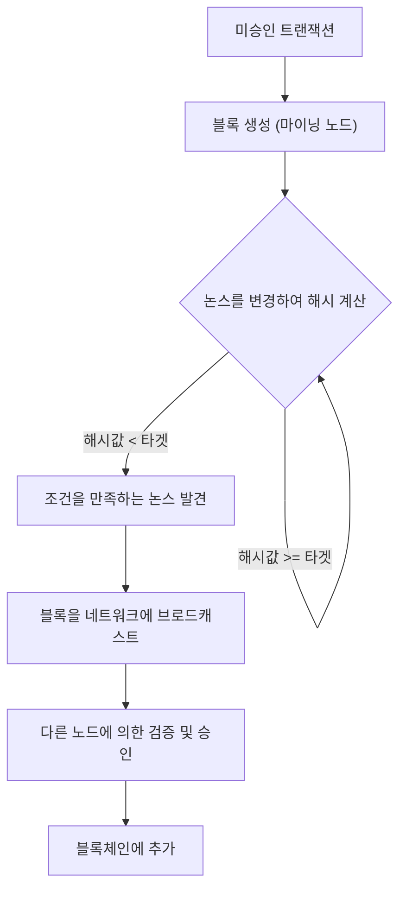
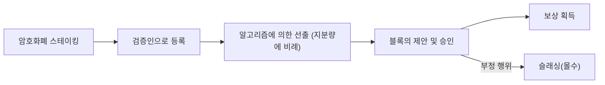
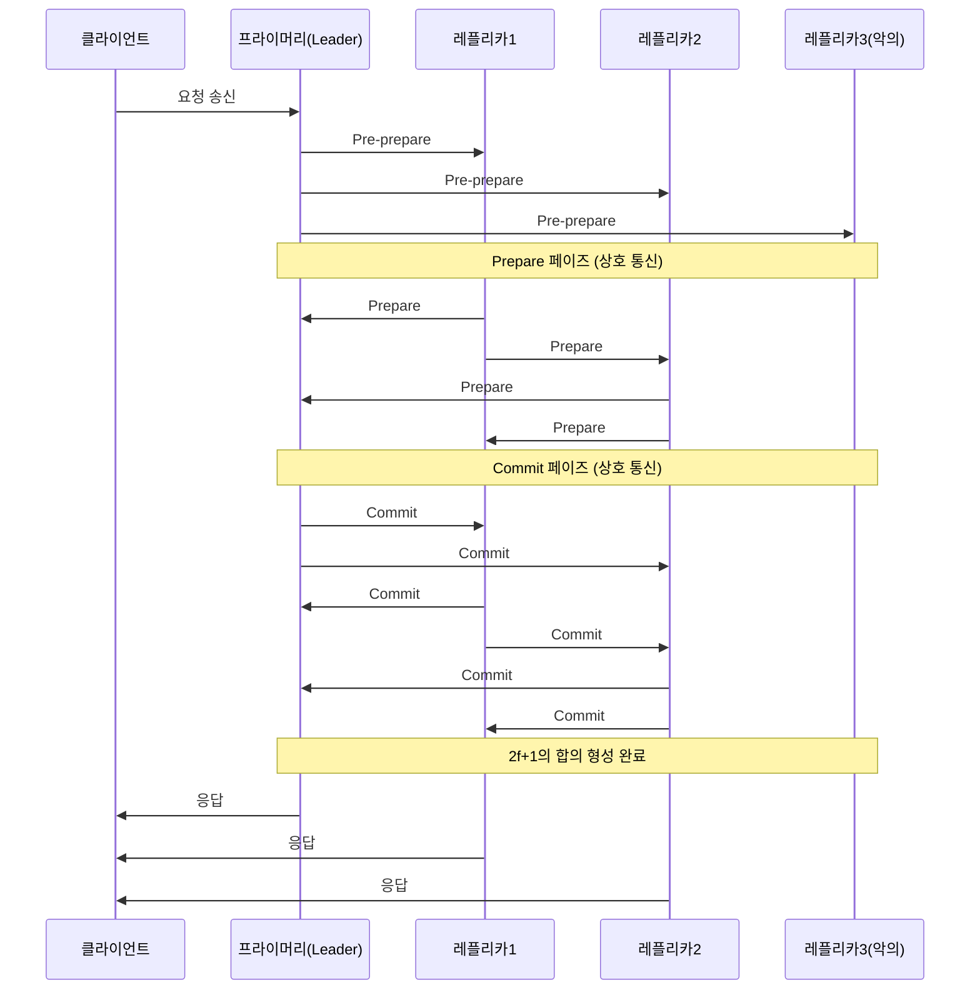

# 블록체인과 합의 알고리즘: 분산 시스템의 핵심 이해하기

현대 기술에서 '블록체인'이라는 단어를 듣지 않는 날이 없습니다. 하지만 그 근저에 있는 '합의 알고리즘(Consensus Algorithm)'이 어떻게 기능하고, 왜 그것이 혁신적인지를 깊이 이해하고 있는 사람은 많지 않습니다.

분산 시스템에서 중앙 관리자가 없는 상태로 네트워크 전체가 동일한 상태(State)를 공유하고, 악의적인 노드가 존재해도 시스템을 유지하는 것은 컴퓨터 과학에서 오랜 과제였습니다. 본 기사에서는 이 과제의 기원인 '비잔틴 장군 문제'부터 시작하여, 사토시 나카모토의 획기적인 '작업 증명(Proof of Work, PoW)', 그 진화 형태인 '지분 증명(Proof of Stake, PoS)', 그리고 컨소시엄 체인에서 활용되는 '실용적 비잔틴 장애 허용(Practical Byzantine Fault Tolerance, PBFT)'에 이르기까지 기술적, 이론적 관점에서 상세히 해설합니다.

---

## 1. 분산 시스템과 비잔틴 장애 허용(BFT)의 어려움

중앙집권형 시스템에서는 단일 서버나 데이터베이스가 절대적인 '진실'을 유지합니다. 클라이언트의 요청은 한 곳에서 처리되며, 상태의 불일치는 기본적으로 발생하지 않습니다. 하지만 분산 시스템에서는 여러 노드가 각각 독자적인 데이터를 보유하고 네트워크를 통해 통신하기 때문에 정보의 지연, 누락, 나아가 노드의 고장이나 의도적인 변조와 같은 문제에 직면하게 됩니다.

### 비잔틴 장군 문제란 무엇인가?

1982년, 레슬리 램포트(Leslie Lamport), 로버트 쇼스탁(Robert Shostak), 마셜 피스(Marshall Pease) 세 사람에 의해 '비잔틴 장군 문제(Byzantine Generals Problem)'로 정식화된 이 문제는 분산 시스템에서 합의 형성의 어려움을 상징합니다.

설정은 다음과 같습니다:
- 비잔틴 제국의 여러 장군이 적의 도시를 포위하고 있다.
- 장군들은 서로 떨어진 곳에 배치되어 있으며, 전령을 통해서만 통신할 수 있다.
- 모든 장군이 '일제 공격' 또는 '퇴각' 중 하나로 완전히 합의하지 않으면 작전은 실패하고 전멸한다.
- 문제는 장군들 중에 **배신자(비잔틴 노드)**가 섞여 있어, 의도적으로 거짓 메시지를 보내 합의를 방해하려 한다는 것이다.

배신자가 존재하는 상황에서 충성스러운 장군들이 어떻게 올바른 합의에 이를 수 있을까. 이 문제를 해결할 수 있는 능력을 가진 시스템은 '비잔틴 장애 허용(Byzantine Fault Tolerance: BFT)'을 갖추고 있다고 말합니다.

수학적, 이론적 증명에 따르면, 악의적인 노드의 수를 $f$라고 했을 때, 시스템 전체에서 올바른 합의를 형성하기 위해서는 전체 노드 수 $N$이 $N \ge 3f + 1$이어야 한다는 것을 알 수 있습니다. 즉, 네트워크의 최소 3분의 2 이상이 정상이어야만 BFT가 성립합니다.

### 비동기 네트워크에서의 FLP 불가능성

더 나아가, 1985년에 발표된 'FLP 불가능성(Fischer, Lynch, and Paterson impossibility result)'은 완전히 비동기적인 분산 시스템에서는 단 하나의 노드라도 다운(크래시)될 가능성이 있다면, 결정론적인 합의 알고리즘은 항상 합의에 도달하는 것을 보장할 수 없다고 증명했습니다.

이러한 이론적 한계로 인해 분산 시스템 연구자들은 '결정론적(반드시 합의에 이른다)'인 방법에서 '확률적(시간이 지나면 거의 확실하게 합의에 이른다)' 또는 '동기적(통신 지연에 상한을 둔다)'인 방법으로 접근 방식을 바꿀 수밖에 없었습니다. 이것이 훗날 블록체인 기술의 기초가 됩니다.

---

## 2. 사토시 나카모토의 돌파구: Proof of Work (PoW)

2008년, 사토시 나카모토라고 자칭하는 익명의 인물(또는 그룹)이 발표한 비트코인 백서는 이 BFT 문제에 대한 전혀 새로운 '확률적'인 해결책을 제시했습니다. 그것이 '작업 증명(Proof of Work)'과 '가장 긴 체인 규칙(Longest Chain Rule)'의 조합, 이른바 '나카모토 컨센서스'입니다.

### PoW의 구조: 해시 함수와 난이도 조절

PoW에서 네트워크 참여자(마이너)는 트랜잭션 묶음(블록)을 승인하고 체인에 추가하기 위해 방대한 계산을 수행합니다. 구체적으로는, 블록의 헤더 정보와 '논스(Nonce)'라고 불리는 임의의 수치를 암호학적 해시 함수(SHA-256 등)에 넣어 그 결과로 얻은 해시값이 네트워크가 정한 특정 '타겟값'보다 작아지는 논스를 찾아내는 경쟁을 합니다.

해시 함수의 성질상, 출력 결과로부터 입력을 역산하는 것은 불가능하기 때문에 조건을 만족하는 논스를 찾기 위해서는 무차별 대입(브루트 포스)으로 계산을 반복할 수밖에 없습니다. 이것이 '작업(Work)'의 증명이 됩니다.

### 가장 긴 체인 규칙에 의한 비잔틴 장애 해결

나카모토 컨센서스의 진수는 악의적인 공격자가 과거의 기록을 변조하려고 할 때의 방어 메커니즘에 있습니다.
네트워크 상에 동시에 2개의 정당한 블록이 제안된 경우(포크 발생), 노드는 처음 받은 블록을 임시로 승인하지만, 최종적으로는 **"가장 많은 계산량(PoW)이 축적된 체인(가장 긴 체인)"**을 정당한 것으로 채택합니다.

공격자가 과거의 블록을 변조하고, 그것을 정당한 것으로 네트워크에 인정받게 하려면 변조한 블록부터 현재에 이르기까지의 모든 블록의 PoW를 다시 계산하고, 나아가 네트워크 전체의 선의의 마이너들이 새로운 블록을 추가하는 속도를 앞질러야 합니다. 이를 위해서는 네트워크 전체 계산 능력의 51% 이상(51% 공격)을 장악해야 하며, 현실적으로 막대한 비용이 들기 때문에 공격할 인센티브가 사라집니다.

사토시 나카모토는 암호학과 경제적 인센티브(마이닝 보상)를 융합함으로써, 불특정 다수가 참여하는 퍼블릭 네트워크에서의 비잔틴 장애 허용을 '확률적으로' 해결한 것입니다.

---

## 3. PoW의 과제와 Proof of Stake (PoS) 의 대두

PoW는 매우 견고한 합의 알고리즘이지만, 큰 단점도 안고 있었습니다. 그것은 '방대한 에너지 소비'와 '확장성(Scalability)의 한계'입니다.

마이닝 경쟁이 치열해짐에 따라 ASIC이라 불리는 전용 하드웨어가 개발되었고, 일부 대규모 마이닝 풀이 해시레이트를 독점하게 되었습니다. 또한 지구 환경에 미치는 악영향도 무시할 수 없는 수준에 이르렀습니다.

이를 해결하기 위해 고안된 것이 '지분 증명(Proof of Stake, PoS)'입니다.

### PoS의 기본 개념

PoS에서는 계산 능력(해시레이트) 대신 네트워크의 기축 통화 보유량(지분, Stake)과 보유 기간을 바탕으로 블록 제안자(검증인, Validator)가 선출됩니다. 통화를 락업(스테이킹)함으로써 네트워크의 보안에 기여하고, 그 대가로 보상을 얻는 구조입니다.

PoW와 같은 낭비적인 계산을 하지 않기 때문에 에너지 소비는 PoW의 99% 이상 감소합니다(예: 이더리움의 The Merge 이후).

### Nothing at Stake 문제와 슬래싱

초기 PoS에는 'Nothing at Stake(잃을 것이 없다) 문제'라는 치명적인 취약성이 존재했습니다.

PoW에서 포크가 발생한 경우, 마이너는 계산 능력을 어느 한 체인에 집중해야 합니다. 양쪽을 모두 채굴하는 것은 계산력(즉, 전기세)의 분산을 의미하며 손해를 보기 때문입니다. 하지만 PoS의 경우, 포크가 발생해도 검증인은 추가 비용(계산력)을 필요로 하지 않습니다. 따라서 양쪽 체인 모두에 블록을 승인하는 것이 보상을 놓치지 않기 위한 최적의 전략이 되어버리고, 결과적으로 포크가 수렴되지 않는다는 문제입니다.

이를 해결하기 위해 현대의 PoS(예를 들어 이더리움의 Casper 등)에서는 **'슬래싱(Slashing)'**이라는 페널티 메커니즘이 도입되었습니다. 검증인이 악의적인 행동(동시에 여러 경쟁 블록을 승인하는 등)을 취한 경우, 스테이킹했던 자산의 일부 또는 전부가 몰수됩니다. 이로써 Nothing at Stake 문제는 경제적인 페널티를 통해 해결되었고, 네트워크의 안전성이 담보되고 있습니다.

---

## 4. 컨소시엄형 블록체인과 Practical Byzantine Fault Tolerance (PBFT)

PoW나 PoS는 누구나 참여할 수 있는 '퍼블릭 블록체인'에 적합한 알고리즘입니다. 하지만 기업 간의 거래나 금융 기관의 백엔드 등 참여자가 특정되거나 허가된 '컨소시엄형(허가형) 블록체인'에서는 다른 합의 알고리즘이 채택되는 경우가 많습니다. 그 대표적인 것이 'PBFT(Practical Byzantine Fault Tolerance)'입니다.

### PBFT의 구조와 3단계 페이즈

1999년 미겔 카스트로(Miguel Castro)와 바바라 리스코프(Barbara Liskov)에 의해 발표된 PBFT는 비동기 네트워크에서 효율적으로 비잔틴 장애를 견딜 수 있는 알고리즘입니다. Hyperledger Fabric과 같은 엔터프라이즈용 블록체인에서 널리 응용되고 있습니다.

PBFT는 확률적이 아닌 **결정론적**인 합의 형성을 수행합니다. 즉, 포크가 발생하지 않으며, 한 번 승인된 블록은 즉시 확정(완결성, Finality을 가짐)됩니다.

합의 프로세스는 다음의 3단계 페이즈로 진행됩니다:

1. **Pre-prepare(사전 준비) 페이즈**: 리더 노드(프라이머리)가 클라이언트로부터 요청을 받고, 다른 모든 노드(레플리카)에게 메시지를 브로드캐스트합니다.
2. **Prepare(준비) 페이즈**: 메시지를 받은 각 노드는 그 정당성을 검증하고, 다른 모든 노드에게 'Prepare' 메시지를 송신합니다. 각 노드는 $2f$개(전체의 3분의 2)의 Prepare 메시지를 수신하면 다음 페이즈로 넘어갑니다.
3. **Commit(커밋) 페이즈**: 각 노드는 'Commit' 메시지를 네트워크 전체에 송신합니다. 마찬가지로 $2f+1$개의 Commit 메시지를 수신하면 합의가 완료된 것으로 간주하고, 상태를 업데이트하여 클라이언트에게 응답합니다.

### PBFT의 장점과 단점

**장점:**
- **즉각적인 완결성(Finality)**: 계산량에 의한 확률적인 확정이 아니라, 합의한 순간에 트랜잭션이 확정됩니다.
- **높은 처리량(Throughput)**: 마이닝과 같은 의도적인 지연(계산 작업)이 없기 때문에 초당 수천 개 이상의 트랜잭션을 처리할 수 있습니다.
- **에너지 절약**: 대규모 계산을 필요로 하지 않습니다.

**단점:**
- **확장성 부족**: 노드 간에 서로 메시지를 주고받기 때문에 통신량(메시징 오버헤드)이 노드 수의 제곱에 비례하여 증가합니다. 따라서 참여 노드 수가 수십~수백 개를 넘는 대규모 네트워크에는 부적합합니다.

---

## 5. 결론: 합의 알고리즘의 미래

'비잔틴 장군 문제'라는 고전적인 분산 시스템의 난제는 사토시 나카모토의 PoW를 통한 암호경제학의 도입으로 퍼블릭 네트워크라는 가혹한 환경에서 돌파되었습니다. 그 후, 환경 부하의 경감과 확장성 향상을 목표로 하는 PoS로의 진화, 그리고 엔터프라이즈 용도로 확실성과 속도를 중시하는 PBFT에 이르기까지 블록체인 기술은 다양한 발전을 이룩하고 있습니다.

현재도 '블록체인 트릴레마(확장성, 보안, 탈중앙화 3가지를 동시에 극대화할 수 없다는 과제)'를 해결하기 위해 샤딩 기술, 레이어 2 솔루션(롤업), 그리고 DAG(Directed Acyclic Graph)를 이용한 새로운 합의 모델 등 활발한 연구 개발이 이어지고 있습니다.

합의 알고리즘은 단순한 기술적인 구조가 아니라, **"신뢰 없는 환경에서 어떻게 인간이나 기계가 협력하고, 경제적 인센티브를 통해 질서를 유지할 것인가"**라는 장대한 사회 실험의 기반인 것입니다. 그 진화를 이해하는 것은 차세대 분산형 인터넷(Web3)의 본질을 이해하는 것과 다름없습니다.
