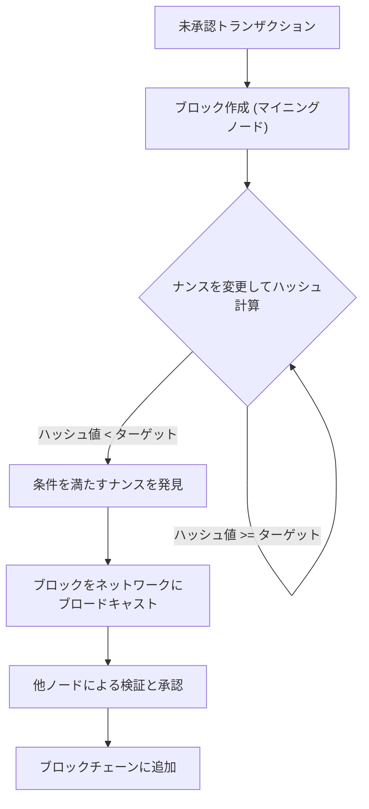
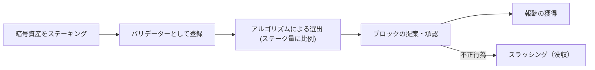
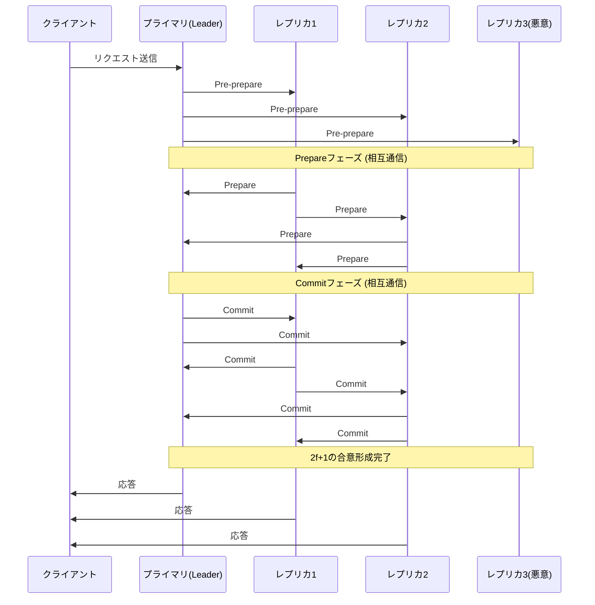

# ブロックチェーンとコンセンサスアルゴリズム：分散型システムの核を理解する

現代のテクノロジーにおいて、「ブロックチェーン」という言葉を聞かない日はありません。しかし、その根底にある「コンセンサスアルゴリズム（合意形成アルゴリズム）」がどのように機能し、なぜそれが革新的なのかを深く理解している人は多くありません。

分散システムにおいて、中央管理者が存在しない状態でネットワーク全体が同一の状態（ステート）を共有し、悪意のあるノードが存在してもシステムを維持することは、コンピューターサイエンスにおける長年の課題でした。本記事では、この課題の起源である「ビザンチン将軍問題」から始まり、サトシ・ナカモトによる画期的な「Proof of Work（PoW）」、その進化系である「Proof of Stake（PoS）」、そしてコンソーシアムチェーンで活用される「Practical Byzantine Fault Tolerance（PBFT）」に至るまで、技術的・理論的な観点から詳細に解説します。

---

## 1. 分散システムとビザンチン障害耐性（BFT）の難しさ

中央集権型のシステムでは、単一のサーバーまたはデータベースが絶対的な「真実」を保持します。クライアントからの要求は一箇所で処理され、状態の不整合は基本的には発生しません。しかし、分散システムにおいては、複数のノードがそれぞれ独自のデータを保持し、ネットワーク越しに通信を行うため、情報の遅延、欠落、さらにはノードの故障や意図的な改ざんといった問題に直面します。

### ビザンチン将軍問題とは何か？

1982年、レスリー・ランポート（Leslie Lamport）、ロバート・ショスタク（Robert Shostak）、マーシャル・ピース（Marshall Pease）の3人により「ビザンチン将軍問題（Byzantine Generals Problem）」として定式化されたこの問題は、分散システムにおける合意形成の難しさを象徴しています。

設定は以下の通りです：
- ビザンチン帝国の複数の将軍が、敵の都市を包囲している。
- 将軍たちは離れた場所に配置されており、伝令を通じてのみ通信できる。
- 全将軍が「一斉攻撃」か「撤退」のどちらかで完全に合意しなければ、作戦は失敗し全滅する。
- 問題は、将軍の中に**裏切り者（ビザンチン・ノード）**が混じっており、意図的に嘘のメッセージを送って合意を妨害しようとしていることである。

裏切り者が存在する状況下で、忠実な将軍たちがどのようにして正しい合意に至ることができるのか。この問題を解決する能力を持つシステムは、「ビザンチン障害耐性（Byzantine Fault Tolerance: BFT）」を備えていると言われます。

数学的・理論的な証明により、悪意のあるノードの数を $f$ とした場合、システム全体で正しい合意を形成するためには、全体のノード数 $N$ が $N \ge 3f + 1$ でなければならないことが分かっています。つまり、ネットワークの少なくとも3分の2以上が正常でなければ、BFTは成立しません。

### 非同期ネットワークにおけるFLP不可能性

さらに、1985年に発表された「FLP不可能性（Fischer, Lynch, and Paterson impossibility result）」は、完全に非同期な分散システムにおいては、たった1つのノードがダウン（クラッシュ）する可能性があるだけで、決定論的なコンセンサスアルゴリズムは常に合意に達することを保証できないと証明しました。

この理論的限界により、分散システムの研究者たちは「決定論的（必ず合意に至る）」な手法から、「確率的（時間が経てばほぼ確実に合意に至る）」または「同期的（通信の遅延に上限を設ける）」な手法へとアプローチを変えざるを得ませんでした。これが後のブロックチェーン技術の基礎となります。

---

## 2. サトシ・ナカモトのブレイクスルー：Proof of Work (PoW)

2008年、サトシ・ナカモトと名乗る匿名の人物（またはグループ）が発表したビットコインのホワイトペーパーは、このBFTの問題に対する全く新しい「確率的」な解決策を提示しました。それが「Proof of Work（作業証明）」と「最長チェーンルール（Longest Chain Rule）」の組み合わせ、いわゆる「ナカモト・コンセンサス」です。

### PoWの仕組み：ハッシュ関数と難易度調整

PoWにおいて、ネットワークの参加者（マイナー）は、トランザクションの束（ブロック）を承認し、チェーンに追加するために膨大な計算を行います。具体的には、ブロックのヘッダー情報と「ナンス（Nonce）」と呼ばれる任意の数値を暗号学的ハッシュ関数（SHA-256など）にかけ、その結果得られるハッシュ値がネットワークが定める特定の「ターゲット値」よりも小さくなるようなナンスを見つけ出す競争をします。

ハッシュ関数の性質上、出力結果から入力を逆算することは不可能なため、条件を満たすナンスを見つけるためには総当たり（ブルートフォース）で計算を繰り返すしかありません。これが「作業（Work）」の証明となります。

### 最長チェーンルールによるビザンチン障害の解決

ナカモト・コンセンサスの真髄は、悪意のある攻撃者が過去の履歴を改ざんしようとした際の防衛メカニズムにあります。
ネットワーク上に同時に2つの正当なブロックが提案された場合（フォークの発生）、ノードは最初に受け取ったブロックを一時的に承認しますが、最終的には**「最も多くの計算量（PoW）が蓄積されたチェーン（最長チェーン）」**を正当なものとして採用します。

攻撃者が過去のブロックを改ざんし、それを正当なものとしてネットワークに認めさせるためには、改ざんしたブロックから現在に至るまでの全てのブロックのPoWを再計算し、さらにネットワーク全体の善意のマイナーが新しいブロックを追加する速度を上回らなければなりません。これにはネットワーク全体の計算能力の51%以上（51%攻撃）を掌握する必要があり、現実的には莫大なコストがかかるため、攻撃するインセンティブが削がれます。

サトシ・ナカモトは、暗号学と経済的インセンティブ（マイニング報酬）を融合させることで、不特定多数が参加するパブリックネットワークにおけるビザンチン障害耐性を「確率的に」解決したのです。

---

## 3. PoWの課題と Proof of Stake (PoS) の台頭

PoWは非常に堅牢なコンセンサスアルゴリズムですが、大きな欠点も抱えていました。それは「膨大なエネルギー消費」と「スケーラビリティの限界」です。

マイニング競争が激化するにつれ、ASICと呼ばれる専用ハードウェアが開発され、一部の大規模なマイニングプールがハッシュレートを独占するようになりました。また、地球環境への悪影響も無視できないレベルに達しました。

これを解決するために考案されたのが「Proof of Stake（PoS：プルーフ・オブ・ステイク）」です。

### PoSの基本概念

PoSでは、計算能力（ハッシュレート）の代わりに、ネットワークの基軸通貨の保有量（ステーク）と保有期間を基に、ブロックの提案者（バリデーター）が選出されます。通貨をロックアップ（ステーキング）することで、ネットワークのセキュリティに貢献し、その見返りとして報酬を得る仕組みです。

PoWのような無駄な計算を行わないため、エネルギー消費はPoWの99%以上削減されます（例：イーサリアムのThe Merge以降）。

### Nothing at Stake問題とスラッシング

初期のPoSには「Nothing at Stake（失うものがない）問題」という致命的な脆弱性が存在しました。

PoWにおいてフォークが発生した場合、マイナーは計算能力をどちらかのチェーンに集中させる必要があります。両方を採掘することは計算力（つまり電気代）の分散を意味し、損をするからです。しかし、PoSの場合、フォークが発生してもバリデーターは追加のコスト（計算力）を必要としません。そのため、両方のチェーンにブロックを承認し続けることが、報酬を取りこぼさないための最適な戦略となってしまい、結果としてフォークが収束しなくなるという問題です。

これを解決するために現代のPoS（例えばEthereumのCasperなど）では**「スラッシング（Slashing）」**というペナルティメカニズムが導入されました。バリデーターが悪意のある行動（同時に複数の競合するブロックを承認するなど）をとった場合、ステーキングしていた資産の一部または全てが没収されます。これにより、Nothing at Stake問題は経済的なペナルティによって解決され、ネットワークの安全性が担保されています。

---

## 4. コンソーシアム型ブロックチェーンと Practical Byzantine Fault Tolerance (PBFT)

PoWやPoSは、誰でも参加できる「パブリックブロックチェーン」に適したアルゴリズムです。しかし、企業間での取引や金融機関のバックエンドなど、参加者が特定・許可されている「コンソーシアム型（許可型）ブロックチェーン」においては、別のコンセンサスアルゴリズムが採用されることが多くあります。その代表が「PBFT（Practical Byzantine Fault Tolerance）」です。

### PBFTの仕組みと3つのフェーズ

1999年にミゲル・カストロ（Miguel Castro）とバーバラ・リスコフ（Barbara Liskov）によって発表されたPBFTは、非同期ネットワークにおいて効率的にビザンチン障害に耐えうるアルゴリズムです。Hyperledger Fabricなどのエンタープライズ向けブロックチェーンで広く応用されています。

PBFTは確率的ではなく**決定論的**な合意形成を行います。つまり、フォークは発生せず、一度承認されたブロックは即座に確定（ファイナリティを持つ）します。

合意プロセスは以下の3つのフェーズで進行します：

1. **Pre-prepare（事前準備）フェーズ**: リーダーノード（プライマリ）がクライアントからリクエストを受け取り、他の全ノード（レプリカ）にメッセージをブロードキャストします。
2. **Prepare（準備）フェーズ**: メッセージを受け取った各ノードは、その正当性を検証し、他のすべてのノードに対して「Prepare」メッセージを送信します。各ノードは $2f$ 個（全体の3分の2）のPrepareメッセージを受信すると次のフェーズに進みます。
3. **Commit（コミット）フェーズ**: 各ノードは「Commit」メッセージをネットワーク全体に送信します。同様に $2f+1$ 個のCommitメッセージを受信すると、合意が完了したとみなし、状態を更新してクライアントに返答します。

### PBFTのメリットとデメリット

**メリット:**
- **即時ファイナリティ**: 計算量による確率的な確定ではなく、合意した瞬間にトランザクションが確定します。
- **高スループット**: マイニングのような意図的な遅延（計算作業）がないため、秒間数千以上のトランザクションを処理できます。
- **省エネルギー**: 大規模な計算を必要としません。

**デメリット:**
- **スケーラビリティの欠如**: ノード間で相互にメッセージを送り合うため、通信量（メッセージングオーバーヘッド）がノード数の2乗に比例して増加します。そのため、参加ノード数が数十〜数百を超える大規模ネットワークには不向きです。

---

## 5. 結論：コンセンサスアルゴリズムの未来

「ビザンチン将軍問題」という古典的な分散システムの難題は、サトシ・ナカモトのPoWによる暗号経済学の導入により、パブリックネットワークという過酷な環境で突破されました。その後、環境負荷の軽減とスケーラビリティの向上を目指すPoSへの進化、そしてエンタープライズ用途で確実性と速度を重視するPBFTへと、ブロックチェーン技術は多様な発展を遂げています。

現在でも「ブロックチェーントリレンマ（スケーラビリティ、セキュリティ、分散化の3つを同時に最大化することはできないという課題）」を解決するため、シャーディング技術、レイヤー2ソリューション（ロールアップ）、そしてDAG（Directed Acyclic Graph）を用いた新しいコンセンサスモデルなど、活発な研究開発が続いています。

コンセンサスアルゴリズムは単なる技術的な仕組みではなく、**「信頼なき環境において、いかにして人間や機械が協調し、経済的インセンティブを通じて秩序を保つか」**という壮大な社会実験の基盤なのです。その進化を理解することは、次世代の分散型インターネット（Web3）の本質を理解することに他なりません。
