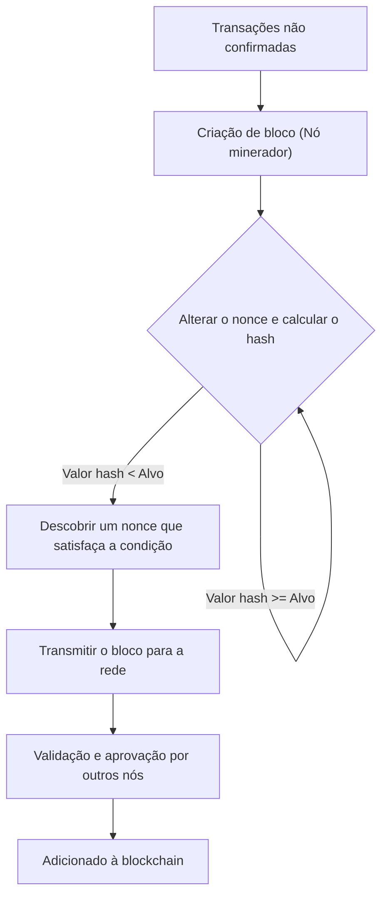
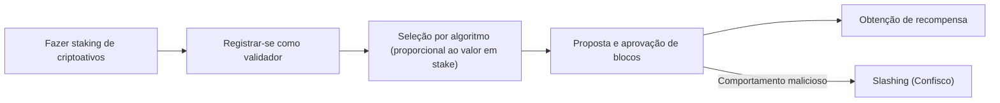
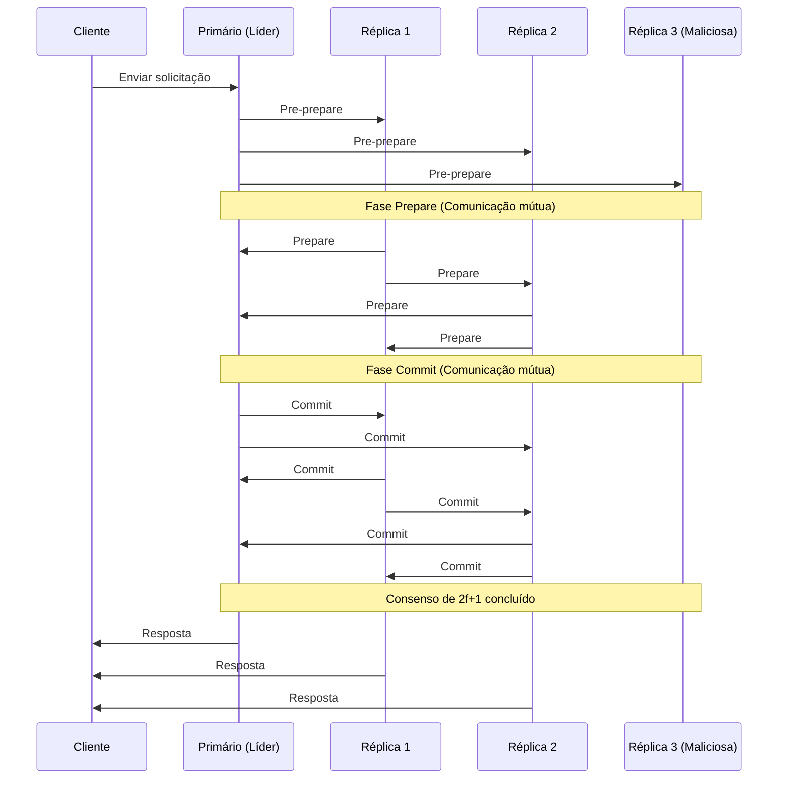

# Blockchain e Algoritmos de Consenso: Entendendo o Núcleo dos Sistemas Distribuídos

Na tecnologia moderna, não há um dia em que não ouçamos a palavra "blockchain". No entanto, não há muitas pessoas que compreendam profundamente como o "algoritmo de consenso" subjacente funciona e por que é inovador.

Em um sistema distribuído, compartilhar o mesmo estado (state) em toda a rede sem a existência de um administrador central, e manter o sistema mesmo se houver nós maliciosos, tem sido um desafio de longa data na ciência da computação. Neste artigo, explicaremos detalhadamente sob uma perspectiva técnica e teórica, começando com o "Problema dos Generais Bizantinos", que é a origem desse desafio, passando pela inovadora "Proof of Work (PoW)" de Satoshi Nakamoto, sua evolução "Proof of Stake (PoS)", e a "Practical Byzantine Fault Tolerance (PBFT)" utilizada em cadeias de consórcio.

---

## 1. Sistemas Distribuídos e a Dificuldade da Tolerância a Falhas Bizantinas (BFT)

Em um sistema centralizado, um único servidor ou banco de dados detém a "verdade" absoluta. As solicitações dos clientes são processadas em um só lugar e a inconsistência de estado basicamente não ocorre. No entanto, em sistemas distribuídos, como vários nós mantêm seus próprios dados e se comunicam pela rede, eles enfrentam problemas como atrasos, perdas de informações e até falhas de nós ou adulteração intencional.

### O que é o Problema dos Generais Bizantinos?

Formulado em 1982 por Leslie Lamport, Robert Shostak e Marshall Pease como o "Problema dos Generais Bizantinos", esse problema simboliza a dificuldade de chegar a um consenso em sistemas distribuídos.

O cenário é o seguinte:
- Vários generais do Império Bizantino estão cercando uma cidade inimiga.
- Os generais estão posicionados em locais diferentes e só podem se comunicar por meio de mensageiros.
- Se todos os generais não concordarem totalmente com um "ataque total" ou uma "retirada", a operação falhará e eles serão aniquilados.
- O problema é que há **traidores (nós bizantinos)** entre os generais, tentando sabotar o consenso enviando mensagens falsas intencionalmente.

Como os generais leais podem chegar a um consenso correto na presença de traidores? Um sistema com a capacidade de resolver esse problema é dito ter "Tolerância a Falhas Bizantinas (Byzantine Fault Tolerance: BFT)".

Por meio de provas matemáticas e teóricas, sabe-se que, se o número de nós maliciosos for $f$, o número total de nós $N$ deve ser $N \ge 3f + 1$ para formar um consenso correto em todo o sistema. Em outras palavras, o BFT não se sustenta a menos que pelo menos dois terços da rede sejam normais.

### A Impossibilidade FLP em Redes Assíncronas

Além disso, o resultado da "Impossibilidade FLP (Fischer, Lynch, and Paterson impossibility result)" publicado em 1985 provou que, em um sistema distribuído totalmente assíncrono, se houver a possibilidade de apenas um nó cair (crash), um algoritmo de consenso determinístico não pode garantir que sempre se chegará a um acordo.

Devido a essa limitação teórica, os pesquisadores de sistemas distribuídos foram forçados a mudar sua abordagem de métodos "determinísticos (sempre chegam a um acordo)" para métodos "probabilísticos (quase certamente chegam a um acordo ao longo do tempo)" ou "síncronos (com um limite superior no atraso da comunicação)". Esta se torna a base da tecnologia blockchain que viria depois.

---

## 2. O Avanço de Satoshi Nakamoto: Proof of Work (PoW)

Em 2008, o whitepaper do Bitcoin publicado por uma pessoa anônima (ou grupo) chamando a si mesmo de Satoshi Nakamoto apresentou uma solução "probabilística" completamente nova para o problema BFT. É a combinação de "Proof of Work (Prova de Trabalho)" e a "Regra da Cadeia Mais Longa (Longest Chain Rule)", o chamado "Consenso de Nakamoto".

### Como funciona a PoW: Funções Hash e Ajuste de Dificuldade

Na PoW, os participantes da rede (mineradores) realizam cálculos massivos para aprovar um lote de transações (bloco) e adicioná-lo à cadeia. Especificamente, eles pegam as informações do cabeçalho do bloco e um número arbitrário chamado "Nonce" e aplicam uma função hash criptográfica (como SHA-256), competindo para encontrar um nonce cuja saída de valor hash resultante seja menor que um determinado "valor alvo" estabelecido pela rede.

Devido à natureza das funções hash, é impossível calcular reversamente a entrada a partir do resultado da saída, então a única maneira de encontrar um nonce que satisfaça as condições é repetir o cálculo por força bruta (brute force). Isso se torna a prova do "Trabalho (Work)".

### Resolvendo Falhas Bizantinas com a Regra da Cadeia Mais Longa

A essência do Consenso de Nakamoto reside em seu mecanismo de defesa quando um invasor malicioso tenta adulterar o histórico passado.
Quando dois blocos válidos são propostos simultaneamente na rede (ocorrência de uma bifurcação ou fork), os nós aprovam temporariamente o primeiro bloco que recebem, mas, em última análise, adotam a **"cadeia com a maior quantidade de poder computacional (PoW) acumulado (a cadeia mais longa)"** como a legítima.

Para que um invasor adultere blocos anteriores e faça a rede reconhecê-los como válidos, ele deve recalcular a PoW para todos os blocos desde o bloco adulterado até o presente, e, além disso, superar a velocidade com que os mineradores honestos de toda a rede adicionam novos blocos. Isso requer controlar mais de 51% (Ataque de 51%) do poder computacional de toda a rede, o que, na realidade, custa uma quantia exorbitante, reduzindo o incentivo para atacar.

Satoshi Nakamoto resolveu "probabilisticamente" a tolerância a falhas bizantinas em redes públicas com um número não especificado de participantes ao combinar criptografia com incentivos econômicos (recompensas de mineração).

---

## 3. Os Desafios da PoW e a Ascensão do Proof of Stake (PoS)

A PoW é um algoritmo de consenso muito robusto, mas também tinha falhas significativas. Estas são o "enorme consumo de energia" e os "limites de escalabilidade".

À medida que a competição na mineração se intensificava, hardwares dedicados chamados ASICs foram desenvolvidos, e alguns pools de mineração em larga escala começaram a monopolizar a taxa de hash. Além disso, o impacto negativo no meio ambiente global atingiu um nível que não podia ser ignorado.

Para resolver isso, a "Proof of Stake (PoS: Prova de Participação)" foi inventada.

### O Conceito Básico da PoS

Na PoS, em vez do poder computacional (hash rate), o proponente do bloco (validador) é selecionado com base na quantidade da moeda base da rede mantida (stake) e no período de retenção. Ao bloquear a moeda (staking), eles contribuem para a segurança da rede e recebem recompensas em troca.

Como não realiza cálculos desnecessários como a PoW, o consumo de energia é reduzido em mais de 99% em relação à PoW (ex: após o The Merge da Ethereum).

### O Problema "Nothing at Stake" e o Slashing

No início da PoS, havia uma vulnerabilidade fatal chamada "Problema Nothing at Stake (Nada a Perder)".

Quando ocorre uma bifurcação (fork) na PoW, os mineradores devem concentrar seu poder de computação em uma das cadeias. Extrair ambas significa dispersar o poder de computação (ou seja, custo de eletricidade), resultando em perdas. No entanto, no caso da PoS, os validadores não requerem custos adicionais (poder de computação) mesmo que ocorra uma bifurcação. Portanto, continuar a aprovar blocos em ambas as cadeias torna-se a estratégia ideal para não perder recompensas, resultando no problema de que a bifurcação nunca se resolve.

Para resolver isso, a PoS moderna (por exemplo, Casper da Ethereum) introduziu um mecanismo de penalidade chamado **"Slashing"**. Se um validador tomar uma ação maliciosa (como aprovar vários blocos concorrentes ao mesmo tempo), parte ou a totalidade dos ativos em staking será confiscada. Com isso, o problema Nothing at Stake é resolvido por penalidades econômicas e a segurança da rede é garantida.

---

## 4. Blockchains de Consórcio e Practical Byzantine Fault Tolerance (PBFT)

PoW e PoS são algoritmos adequados para "blockchains públicas" das quais qualquer pessoa pode participar. No entanto, em "blockchains de consórcio (permissionadas)" onde os participantes são especificados e permitidos, como em transações interempresariais ou no back-end de instituições financeiras, muitas vezes adota-se um algoritmo de consenso diferente. O mais representativo é o "PBFT (Practical Byzantine Fault Tolerance)".

### Como funciona a PBFT e suas 3 Fases

Publicada em 1999 por Miguel Castro e Barbara Liskov, a PBFT é um algoritmo que pode tolerar eficientemente falhas bizantinas em redes assíncronas. É amplamente aplicada em blockchains corporativas como o Hyperledger Fabric.

A PBFT não é probabilística, mas sim realiza um consenso **determinístico**. Em outras palavras, não ocorrem bifurcações, e uma vez que um bloco é aprovado, ele é finalizado imediatamente (possui finalidade).

O processo de consenso prossegue nas seguintes três fases:

1. **Fase Pre-prepare (Pré-preparação)**: O nó líder (primário) recebe uma solicitação de um cliente e transmite a mensagem a todos os outros nós (réplicas).
2. **Fase Prepare (Preparação)**: Cada nó que recebe a mensagem verifica sua validade e envia uma mensagem "Prepare" a todos os outros nós. Cada nó avança para a próxima fase ao receber $2f$ (dois terços do total) mensagens Prepare.
3. **Fase Commit (Confirmação)**: Cada nó envia uma mensagem "Commit" para toda a rede. Da mesma forma, quando ele recebe $2f+1$ mensagens Commit, ele considera que o consenso foi concluído, atualiza o estado e responde ao cliente.

### Vantagens e Desvantagens da PBFT

**Vantagens:**
- **Finalidade Imediata**: As transações são confirmadas no instante do acordo, em vez de uma confirmação probabilística por meio de quantidade de computação.
- **Alto Rendimento (Throughput)**: Como não há atrasos intencionais (trabalho de computação) como na mineração, pode processar milhares ou mais transações por segundo.
- **Economia de Energia**: Não requer cálculos em larga escala.

**Desvantagens:**
- **Falta de Escalabilidade**: Como os nós enviam mensagens entre si, o tráfego de comunicação (overhead de mensagens) aumenta proporcionalmente ao quadrado do número de nós. Portanto, não é adequado para redes em grande escala onde o número de nós participantes excede dezenas ou centenas.

---

## 5. Conclusão: O Futuro dos Algoritmos de Consenso

O desafio clássico dos sistemas distribuídos, o "Problema dos Generais Bizantinos", foi superado no ambiente hostil das redes públicas através da introdução da criptoeconomia por meio da PoW de Satoshi Nakamoto. Desde então, a tecnologia blockchain vem passando por desenvolvimentos diversos, com a evolução para a PoS visando reduzir a carga ambiental e melhorar a escalabilidade, e para a PBFT que enfatiza a certeza e a velocidade em aplicações corporativas.

Mesmo hoje, a fim de resolver o "Trilema da Blockchain (o desafio de que é impossível maximizar simultaneamente escalabilidade, segurança e descentralização)", pesquisas e desenvolvimentos ativos continuam, incluindo tecnologias de sharding, soluções de camada 2 (rollups) e novos modelos de consenso usando DAGs (Directed Acyclic Graphs).

O algoritmo de consenso não é apenas um mecanismo técnico, mas a base de um grandioso experimento social sobre **"como humanos e máquinas podem cooperar e manter a ordem através de incentivos econômicos em um ambiente sem confiança (trustless)"**. Entender essa evolução é nada menos que compreender a essência da internet descentralizada de próxima geração (Web3).
