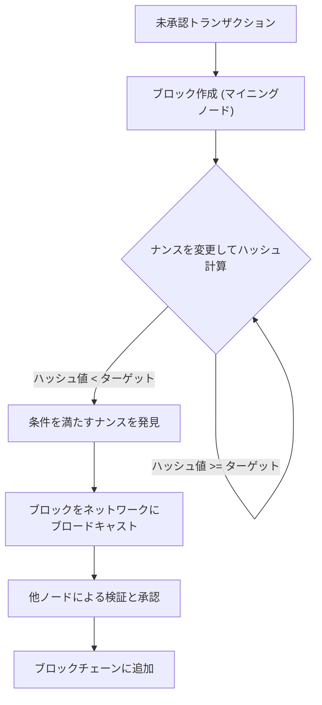
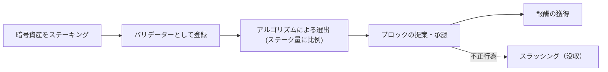
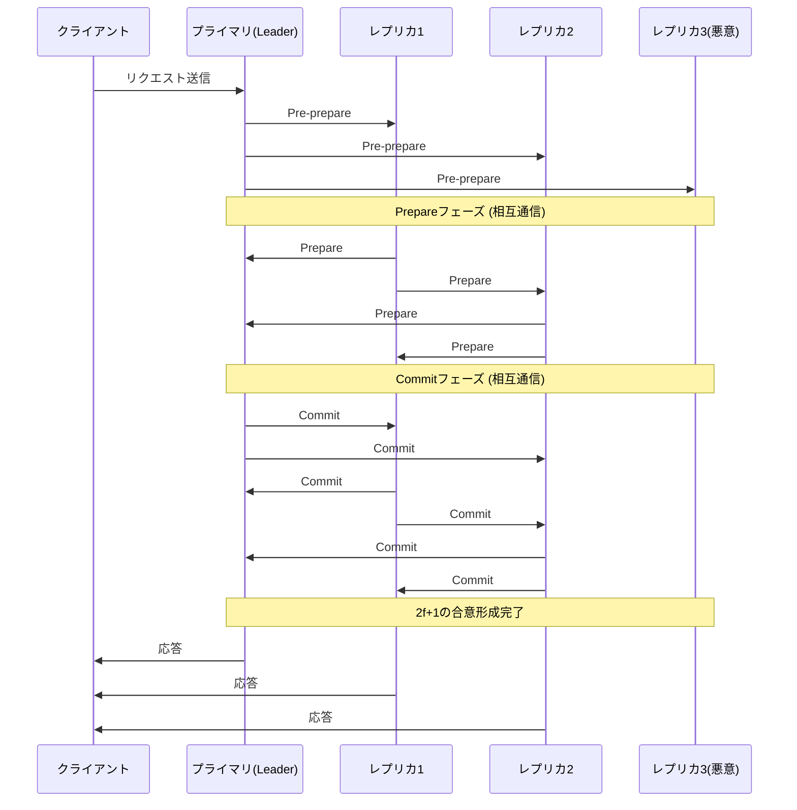

# Блокчейн и алгоритмы консенсуса: понимание ядра распределенных систем

В современных технологиях не проходит и дня без упоминания слова «блокчейн». Однако мало кто глубоко понимает, как работает лежащий в его основе «алгоритм консенсуса (алгоритм согласования)» и почему он является инновационным.

В распределенных системах совместное использование одного и того же состояния всей сетью без центрального администратора и поддержание работы системы даже при наличии вредоносных узлов было давней проблемой информатики. В этой статье мы подробно рассмотрим эту проблему с технической и теоретической точек зрения, начиная с ее истоков в «Задаче византийских генералов», переходя к прорывному «Proof of Work (PoW)» от Сатоши Накамото, его эволюции «Proof of Stake (PoS)» и заканчивая «Practical Byzantine Fault Tolerance (PBFT)», используемым в консорциумных блокчейнах.

---

## 1. Распределенные системы и сложность византийской отказоустойчивости (BFT)

В централизованных системах единственный сервер или база данных хранит абсолютную «истину». Запросы от клиентов обрабатываются в одном месте, и несоответствие состояний, как правило, не возникает. Однако в распределенных системах несколько узлов хранят собственные данные и обмениваются ими по сети, что приводит к таким проблемам, как задержка информации, потеря данных, а также сбои узлов или намеренная фальсификация.

### Что такое задача византийских генералов?

Сформулированная в 1982 году Лесли Лампортом (Leslie Lamport), Робертом Шостаком (Robert Shostak) и Маршаллом Писом (Marshall Pease), «Задача византийских генералов (Byzantine Generals Problem)» символизирует сложность достижения консенсуса в распределенных системах.

Условия следующие:
- Несколько генералов Византийской империи осаждают вражеский город.
- Генералы расположены далеко друг от друга и могут общаться только через гонцов.
- Если все генералы не придут к полному согласию либо «атаковать всем вместе», либо «отступить», операция провалится и они будут уничтожены.
- Проблема заключается в том, что среди генералов есть **предатели (византийские узлы)**, которые намеренно посылают ложные сообщения, чтобы сорвать консенсус.

Как лояльные генералы могут прийти к правильному консенсусу в условиях присутствия предателей? Система, способная решить эту проблему, считается обладающей «Византийской отказоустойчивостью (Byzantine Fault Tolerance: BFT)».

Математические и теоретические доказательства показывают, что если количество вредоносных узлов равно $f$, то для достижения правильного консенсуса в системе общее количество узлов $N$ должно быть $N \ge 3f + 1$. То есть, если по крайней мере две трети сети не работают нормально, BFT не будет достигнут.

### Невозможность FLP в асинхронных сетях

Кроме того, в 1985 году был опубликован результат о «невозможности FLP (Fischer, Lynch, and Paterson impossibility result)», который доказал, что в полностью асинхронной распределенной системе, если есть вероятность сбоя (отказа) хотя бы одного узла, детерминированный алгоритм консенсуса не может гарантировать достижение согласия всегда.

Из-за этого теоретического предела исследователям распределенных систем пришлось сменить подход с «детерминированного (консенсус всегда достигается)» на «вероятностный (консенсус почти наверняка достигается со временем)» или «синхронный (устанавливается верхний предел задержки связи)». Это стало основой для последующей технологии блокчейн.

---

## 2. Прорыв Сатоши Накамото: Proof of Work (PoW)

В 2008 году анонимный человек (или группа лиц) под псевдонимом Сатоши Накамото опубликовал White paper Биткойна, предложив совершенно новое «вероятностное» решение проблемы BFT. Это комбинация «Proof of Work (Доказательство выполнения работы)» и «правила самой длинной цепи (Longest Chain Rule)», так называемый «Накамото-консенсус».

### Как работает PoW: хеш-функции и корректировка сложности

В PoW участники сети (майнеры) выполняют огромные вычисления для подтверждения пакета транзакций (блока) и добавления его в цепочку. Конкретно, информация заголовка блока и произвольное число, называемое «Nonce (нонс)», пропускаются через криптографическую хеш-функцию (например, SHA-256), и майнеры соревнуются в поиске такого нонса, при котором полученное значение хеша будет меньше определенного «целевого значения», установленного сетью.

Из-за природы хеш-функций невозможно вычислить входные данные по выходным результатам, поэтому для поиска нонса, удовлетворяющего условиям, единственный выход — это перебор (брутфорс). Это и есть доказательство «работы (Work)».

### Решение проблемы византийских сбоев с помощью правила самой длинной цепи

Суть Накамото-консенсуса заключается в механизме защиты, когда злоумышленник пытается подделать прошлую историю.
Если в сети одновременно предлагаются два действительных блока (происходит форк), узлы временно принимают первый полученный блок, но в конечном итоге они принимают **«цепь, в которой накоплен наибольший объем вычислений (PoW) (самую длинную цепь)»** в качестве правильной.

Для того чтобы злоумышленник мог подделать прошлый блок и заставить сеть признать его легитимным, он должен пересчитать PoW всех блоков, начиная с подделанного и заканчивая текущим, и превысить скорость добавления новых блоков честными майнерами во всей сети. Это требует контроля над более чем 51% вычислительной мощности всей сети (атака 51%), что в реальности сопряжено с огромными затратами, поэтому стимулы для атаки снижаются.

Сатоши Накамото решил проблему византийской отказоустойчивости в публичной сети с участием неопределенного числа пользователей «вероятностно», объединив криптографию с экономическими стимулами (награда за майнинг).

---

## 3. Проблемы PoW и появление Proof of Stake (PoS)

PoW — это очень надежный алгоритм консенсуса, но он также имеет серьезные недостатки. Это «огромное потребление энергии» и «ограничения масштабируемости».

По мере обострения конкуренции в майнинге разрабатывалось специализированное оборудование, называемое ASIC, и несколько крупных майнинговых пулов стали монополизировать хешрейт. Кроме того, негативное воздействие на окружающую среду достигло уровня, который нельзя игнорировать.

Для решения этих проблем был разработан «Proof of Stake (PoS: Доказательство доли владения)».

### Базовая концепция PoS

В PoS вместо вычислительной мощности (хешрейта) лицо, предлагающее блок (валидатор), выбирается на основе количества удерживаемой базовой валюты сети (доли) и срока удержания. Блокируя валюту (стейкинг), вы вносите свой вклад в безопасность сети и получаете взамен вознаграждение.

Поскольку не выполняются бесполезные вычисления, как в PoW, потребление энергии снижается более чем на 99% по сравнению с PoW (пример: после The Merge в Ethereum).

### Проблема Nothing at Stake и слэшинг

Ранний PoS имел фатальную уязвимость, называемую «проблемой Nothing at Stake (нечего терять)».

В PoW, если происходит форк, майнеры должны сконцентрировать свои вычислительные мощности на одной из цепей. Добыча на обеих цепях означает распределение вычислительной мощности (и, следовательно, затрат на электроэнергию), что приводит к убыткам. Однако в случае PoS валидатор не несет дополнительных затрат (вычислительной мощности), даже если происходит форк. Следовательно, продолжение подтверждения блоков в обеих цепях становится оптимальной стратегией, чтобы не упустить вознаграждение, что приводит к тому, что форк не разрешается.

Для решения этой проблемы в современном PoS (например, Casper в Ethereum) был введен механизм штрафов под названием **«слэшинг (Slashing)»**. Если валидатор совершает злонамеренные действия (например, одобряет несколько конкурирующих блоков одновременно), часть или все активы, находящиеся в стейкинге, конфискуются. Это решает проблему Nothing at Stake с помощью экономических санкций и обеспечивает безопасность сети.

---

## 4. Консорциумные блокчейны и Practical Byzantine Fault Tolerance (PBFT)

PoW и PoS — это алгоритмы, подходящие для «публичных блокчейнов», к которым может присоединиться каждый. Однако в «консорциумных (разрешенных) блокчейнах», где участники идентифицированы и имеют разрешения (например, межкорпоративные транзакции или бэкенд финансовых учреждений), часто используются другие алгоритмы консенсуса. Представителем этого является «PBFT (Practical Byzantine Fault Tolerance)».

### Как работает PBFT и три его фазы

Представленный в 1999 году Мигелем Кастро (Miguel Castro) и Барбарой Лисков (Barbara Liskov), PBFT представляет собой алгоритм, который может эффективно противостоять византийским сбоям в асинхронных сетях. Он широко применяется в блокчейнах корпоративного уровня, таких как Hyperledger Fabric.

PBFT использует не вероятностный, а **детерминированный** консенсус. То есть форк не возникает, и блок после подтверждения мгновенно становится окончательным (имеет завершенность).

Процесс консенсуса проходит в 3 фазы:

1. **Фаза Pre-prepare (Предварительная подготовка)**: Лидерный узел (primary) получает запрос от клиента и транслирует сообщение всем остальным узлам (replica).
2. **Фаза Prepare (Подготовка)**: Каждый узел, получивший сообщение, проверяет его достоверность и отправляет сообщение «Prepare» всем остальным узлам. Когда каждый узел получает $2f$ сообщений Prepare (две трети от общего количества), он переходит к следующей фазе.
3. **Фаза Commit (Фиксация)**: Каждый узел отправляет сообщение «Commit» по всей сети. Аналогичным образом, когда он получает $2f+1$ сообщений Commit, он считает консенсус достигнутым, обновляет состояние и возвращает ответ клиенту.

### Преимущества и недостатки PBFT

**Преимущества:**
- **Мгновенная завершенность (финальность)**: Транзакции становятся окончательными в момент достижения консенсуса, а не с вероятностной достоверностью, зависящей от вычислительных мощностей.
- **Высокая пропускная способность**: Отсутствуют преднамеренные задержки (вычислительная работа), такие как майнинг, поэтому он может обрабатывать тысячи и более транзакций в секунду.
- **Энергоэффективность**: Не требует масштабных вычислений.

**Недостатки:**
- **Отсутствие масштабируемости**: Поскольку узлы отправляют сообщения друг другу, объем передаваемых данных (затраты на обмен сообщениями) увеличивается пропорционально квадрату количества узлов. Следовательно, он не подходит для крупных сетей, насчитывающих от десятков до сотен узлов.

---

## 5. Заключение: будущее алгоритмов консенсуса

Классическая проблема распределенных систем, «Задача византийских генералов», была решена в суровых условиях публичных сетей благодаря внедрению криптоэкономики с помощью PoW от Сатоши Накамото. С тех пор технология блокчейн претерпела разнообразное развитие, перейдя к PoS, нацеленному на снижение нагрузки на окружающую среду и повышение масштабируемости, а также к PBFT, ориентированному на определенность и скорость в корпоративных сценариях использования.

Даже сегодня, чтобы решить «трилемму блокчейна (проблему невозможности одновременной максимизации масштабируемости, безопасности и децентрализации)», продолжаются активные исследования и разработки новых моделей консенсуса с использованием технологий шардинга (sharding), решений второго уровня (rollups) и DAG (Directed Acyclic Graph).

Алгоритмы консенсуса — это не просто технический механизм, а фундамент масштабного социального эксперимента по тому, **«как люди и машины могут сотрудничать и поддерживать порядок с помощью экономических стимулов в среде, не требующей доверия»**. Понимание этой эволюции равнозначно пониманию сути децентрализованного интернета следующего поколения (Web3).
