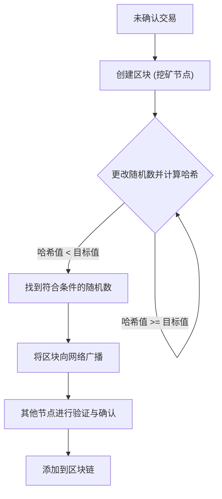
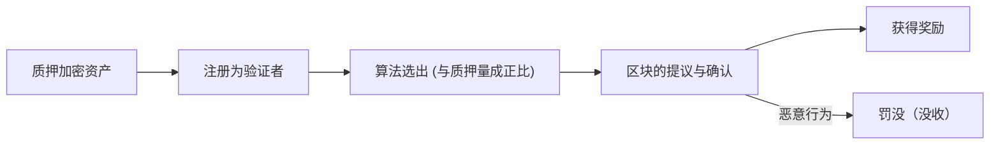
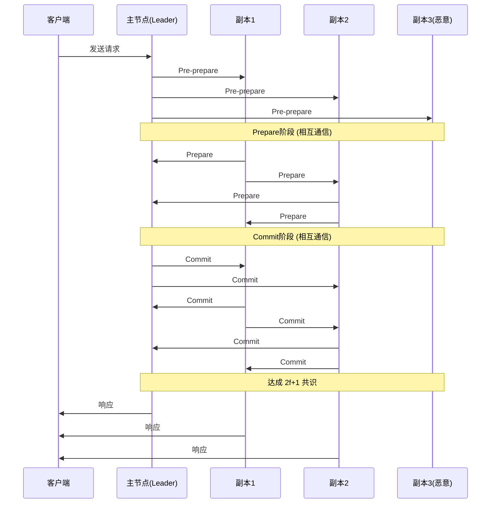

# 区块链与共识算法：理解分布式系统的核心

在现代科技领域，“区块链”这个词几乎每天都能听到。然而，很少有人能深入理解其底层的“共识算法（Consensus Algorithm）”是如何运作的，以及为什么它是革命性的。

在分布式系统中，在没有中央管理者的状态下，整个网络共享同一状态，即使存在恶意节点也能维持系统运行，这是计算机科学领域长期以来的一个难题。本文将从这一难题的起源——“拜占庭将军问题”开始，一直到中本聪（Satoshi Nakamoto）提出的具有划时代意义的“工作量证明（Proof of Work, PoW）”，其演进版本“权益证明（Proof of Stake, PoS）”，以及在联盟链中广泛应用的“实用拜占庭容错（Practical Byzantine Fault Tolerance, PBFT）”，从技术与理论的角度进行详细解析。

---

## 1. 分布式系统与拜占庭容错（BFT）的难题

在中心化系统中，单个服务器或数据库掌握着绝对的“真相”。来自客户端的请求在同一个地方被处理，状态不一致的情况基本不会发生。但是，在分布式系统中，由于多个节点各自保存着自己的数据，并通过网络进行通信，因此面临着信息延迟、丢失，甚至是节点故障或恶意篡改等问题。

### 什么是拜占庭将军问题？

1982年，由Leslie Lamport、Robert Shostak和Marshall Pease三人形式化提出的“拜占庭将军问题（Byzantine Generals Problem）”，象征着分布式系统中达成共识的困难性。

设定如下：
- 拜占庭帝国的多名将军正包围着一座敌人的城市。
- 将军们驻扎在不同的地点，只能通过信使进行通信。
- 所有将军必须在“一致进攻”或“撤退”上达成完全共识，否则行动将失败并全军覆没。
- 问题在于，将军中混有**叛徒（拜占庭节点）**，他们意图通过故意发送虚假信息来破坏共识。

在存在叛徒的情况下，忠诚的将军们如何才能达成正确的共识？具备解决此问题能力的系统，被称为具有“拜占庭容错（Byzantine Fault Tolerance: BFT）”。

通过数学与理论证明，假设恶意节点的数量为 $f$，为了使整个系统能够达成正确的共识，系统总节点数 $N$ 必须满足 $N \ge 3f + 1$。也就是说，如果网络中没有至少三分之二以上的节点是正常的，BFT就无法成立。

### 异步网络中的FLP不可能性

此外，1985年发表的“FLP不可能性（Fischer, Lynch, and Paterson impossibility result）”证明，在完全异步的分布式系统中，只要存在哪怕一个节点可能宕机（崩溃）的风险，确定性的共识算法就无法保证始终能达成共识。

由于这一理论极限，分布式系统的研究者们不得不将方法从“确定性（必定达成共识）”转向“概率性（随着时间推移几乎必定达成共识）”或“同步性（对通信延迟设定上限）”。这也成为了后来区块链技术的基础。

---

## 2. 中本聪的突破：工作量证明 (PoW)

2008年，化名为中本聪的匿名人物（或团队）发布的比特币白皮书，针对这个BFT问题提出了一种全新的“概率性”解决方案。这就是“工作量证明（Proof of Work）”与“最长链法则（Longest Chain Rule）”的结合，即所谓的“中本聪共识”。

### PoW的机制：哈希函数与难度调整

在PoW中，网络参与者（矿工）为了确认一揽子交易（区块）并将其添加到链上，会进行大量的计算。具体来说，就是将区块的头部信息和一个被称为“随机数（Nonce）”的任意数值，输入密码学哈希函数（如SHA-256）中，竞相寻找一个能使输出的哈希值小于网络规定的特定“目标值”的随机数。

由于哈希函数的特性，无法从输出结果反推输入，因此为了找到符合条件的随机数，只能通过穷举（暴力破解）的方式不断重复计算。这就是“工作（Work）”的证明。

### 通过最长链法则解决拜占庭故障

中本聪共识的精髓在于，当恶意攻击者试图篡改历史记录时的防御机制。
当网络上同时提出两个合法的区块时（发生分叉），节点会暂时确认最先接收到的区块，但最终会将**“累积了最多计算量（PoW）的链（最长链）”**采纳为合法链。

如果攻击者篡改了过去的区块，并想让网络承认其为合法区块，就必须重新计算从被篡改区块到当前所有区块的PoW，而且速度还必须超过整个网络中善意矿工添加新区块的速度。这需要掌握全网51%以上的算力（51%攻击），在现实中成本巨大，从而削弱了攻击的动机。

中本聪通过将密码学与经济激励（挖矿奖励）相融合，在不特定多数人参与的公有网络中，“概率性”地解决了拜占庭容错问题。

---

## 3. PoW的挑战与权益证明 (PoS) 的崛起

PoW是一种极其坚固的共识算法，但也存在重大缺点，即“巨大的能源消耗”与“扩展性瓶颈”。

随着挖矿竞争的加剧，被称为ASIC的专用硬件被开发出来，一些大型矿池开始垄断算力。同时，对地球环境的负面影响也达到了不可忽视的程度。

为了解决这些问题，“权益证明（Proof of Stake, PoS）”被构想出来。

### PoS的基本概念

在PoS中，区块的提议者（验证者）不再由计算能力（算力）决定，而是根据在网络中持有的基础货币数量（权益）及持有时间来选出。通过锁定货币（质押，Staking）为网络安全做贡献，并以此获得奖励。

由于不需要进行像PoW那样无意义的计算，能源消耗比PoW降低了99%以上（例如：以太坊The Merge之后）。

### Nothing at Stake问题与罚没机制

早期的PoS存在一个被称为“无利害关系（Nothing at Stake）问题”的致命漏洞。

在PoW中，如果发生分叉，矿工必须将算力集中在其中一条链上。如果同时在两条链上挖矿，意味着算力（也就是电费）的分散，将会导致亏损。然而，在PoS中，即使发生分叉，验证者也不需要额外的成本（计算力）。因此，继续在两条链上都确认区块，就成为了不遗漏奖励的最优策略，从而导致分叉无法收敛的问题。

为了解决这个问题，现代PoS（例如以太坊的Casper等）引入了**“罚没（Slashing）”**这种惩罚机制。如果验证者采取了恶意行为（例如同时确认多个竞争的区块），其质押的部分或全部资产将被没收。通过这种方式，Nothing at Stake问题通过经济惩罚得到了解决，从而保障了网络的安全性。

---

## 4. 联盟型区块链与实用拜占庭容错 (PBFT)

PoW和PoS是适用于任何人都能参与的“公有区块链”的算法。但是，在企业间交易或金融机构后端等参与者特定且受许可的“联盟型（许可型）区块链”中，通常会采用其他的共识算法。其中最具代表性的就是“PBFT（Practical Byzantine Fault Tolerance）”。

### PBFT的机制与三个阶段

1999年由Miguel Castro和Barbara Liskov提出的PBFT，是一种能够在异步网络中高效抵御拜占庭故障的算法。它被广泛应用于Hyperledger Fabric等面向企业的区块链中。

PBFT不采用概率性，而是进行**确定性**的共识形成。也就是说，不会发生分叉，区块一旦被确认就会立即敲定（具有最终性）。

共识过程按以下三个阶段进行：

1. **Pre-prepare（预准备）阶段**: 领导者节点（主节点）接收来自客户端的请求，并向所有其他节点（副本节点）广播消息。
2. **Prepare（准备）阶段**: 接收到消息的各节点验证其合法性，并向所有其他节点发送“Prepare”消息。每个节点在接收到 $2f$ 个（总数的三分之二）Prepare消息后，就会进入下一个阶段。
3. **Commit（提交）阶段**: 各节点向整个网络发送“Commit”消息。同样，在接收到 $2f+1$ 个Commit消息后，就认为共识已完成，更新状态并向客户端回复。

### PBFT的优缺点

**优点:**
- **即时最终性**: 并非基于计算量的概率性确定，而是在达成共识的瞬间交易就被敲定。
- **高吞吐量**: 没有像挖矿那样故意的延迟（计算工作），因此每秒可以处理数千次以上的交易。
- **节能**: 不需要大规模的计算。

**缺点:**
- **缺乏可扩展性**: 由于节点之间需要互相发送消息，通信量（消息传递开销）与节点数的平方成正比增加。因此，它不适合参与节点数超过数十至数百的大规模网络。

---

## 5. 结论：共识算法的未来

“拜占庭将军问题”这个经典的分布式系统难题，凭借中本聪通过PoW引入的密码经济学，在公有网络这种严苛的环境下被突破。此后，为了减轻环境负担并提高可扩展性而向PoS演进，以及在企业应用中重视确定性和速度的PBFT，区块链技术取得了多样化的发展。

时至今日，为了解决“区块链不可能三角（无法同时最大化可扩展性、安全性和去中心化）”，诸如分片技术、Layer 2解决方案（Rollup），以及使用DAG（有向无环图）的新型共识模型等，活跃的研发工作仍在持续进行。

共识算法不仅是一种技术机制，更是**“在无信任环境中，人类或机器如何协同合作，并通过经济激励维持秩序”**这一宏大社会实验的基础。理解其演进过程，无异于理解下一代分布式互联网（Web3）的本质。
