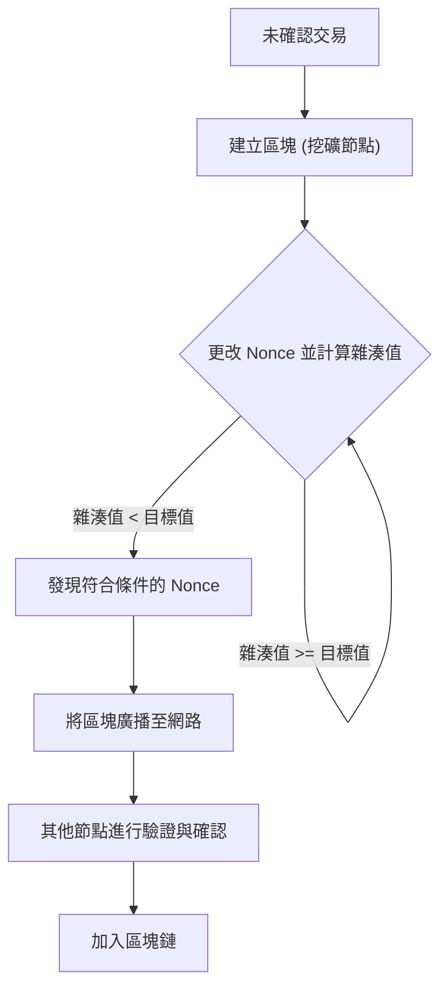
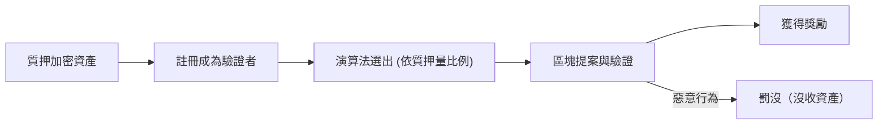
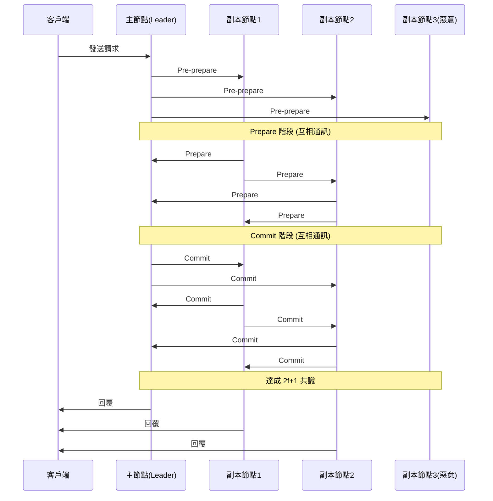

# 區塊鏈與共識演算法：理解分散式系統的核心

在現代科技中，我們幾乎每天都會聽到「區塊鏈」這個詞。然而，卻很少有人能深入理解其底層的「共識演算法（Consensus Algorithm）」是如何運作的，以及為什麼它具備革命性。

在分散式系統中，如何在沒有中央管理者的情況下讓整個網路共享相同的狀態（State），並在存在惡意節點的情況下維持系統運作，一直是電腦科學領域長久以來的難題。本文將從這個難題的起源「拜占庭將軍問題」開始，詳細解說中本聰（Satoshi Nakamoto）劃時代的「工作量證明（Proof of Work, PoW）」、其進化版「權益證明（Proof of Stake, PoS）」，以及在聯盟鏈中廣泛應用的「實用拜占庭容錯（Practical Byzantine Fault Tolerance, PBFT）」，並從技術與理論的角度進行深度解析。

---

## 1. 分散式系統與拜占庭容錯（BFT）的難題

在中心化系統中，單一伺服器或資料庫掌握著絕對的「真相」。來自客戶端的請求集中在一處處理，基本上不會發生狀態不一致的情況。然而，在分散式系統中，多個節點各自持有獨立的數據，並透過網路進行通訊，因此會面臨資訊延遲、遺失，甚至是節點故障或惡意竄改等問題。

### 什麼是拜占庭將軍問題？

1982年，由萊斯利·蘭波特（Leslie Lamport）、羅伯特·蕭斯塔克（Robert Shostak）和馬歇爾·皮斯（Marshall Pease）三人共同提出的「拜占庭將軍問題（Byzantine Generals Problem）」，象徵了分散式系統中達成共識的困難。

設定如下：
- 拜占庭帝國的多位將軍正包圍著一座敵軍城市。
- 將軍們身處不同地點，只能透過傳令兵進行通訊。
- 所有將軍必須在「全面進攻」或「撤退」上達成完全一致的共識，否則行動將會失敗並導致全軍覆沒。
- 問題在於，將軍之中混入了**叛徒（拜占庭節點）**，他們會故意發送虛假訊息來干擾共識的達成。

在存在叛徒的情況下，忠誠的將軍們該如何達成正確的共識？具備解決這個問題能力的系統，就被稱為擁有「拜占庭容錯（Byzantine Fault Tolerance, BFT）」機制。

透過數學與理論證明，假設惡意節點的數量為 $f$，為了讓整個系統能達成正確的共識，總節點數 $N$ 必須滿足 $N \ge 3f + 1$。也就是說，網路中至少需要有三分之二以上的節點是正常的，BFT 才能成立。

### 非同步網路中的 FLP 不可能定理

此外，1985 年發表的「FLP 不可能定理（Fischer, Lynch, and Paterson impossibility result）」證明了在完全非同步的分散式系統中，只要有一個節點可能發生故障（崩潰），決定性的共識演算法就無法保證永遠能達成共識。

因為這個理論上的限制，分散式系統的研究人員不得不將研究方向從「決定性（必定達成共識）」轉向「機率性（隨著時間推移幾乎肯定會達成共識）」或「同步性（對通訊延遲設定上限）」的方法。這也成為後來區塊鏈技術的基礎。

---

## 2. 中本聰的突破：工作量證明 (PoW)

2008年，一位（或一個群體）化名為中本聰（Satoshi Nakamoto）的匿名人士發表了比特幣白皮書，為 BFT 問題提出了一種全新的「機率性」解決方案。這就是「工作量證明（Proof of Work）」與「最長鏈法則（Longest Chain Rule）」的結合，即所謂的「中本聰共識（Nakamoto Consensus）」。

### PoW 的運作機制：雜湊函數與難度調整

在 PoW 中，網路參與者（礦工）為了驗證並將交易打包（區塊）加入區塊鏈中，需要進行龐大的計算。具體來說，是將區塊的標頭資訊和稱為「Nonce」的隨機數輸入密碼學雜湊函數（例如 SHA-256），礦工們競爭找出一個 Nonce，使得計算出來的雜湊值小於網路設定的特定「目標值」。

由於雜湊函數的特性，無法從輸出結果反推輸入值，因此為了找到符合條件的 Nonce，只能透過窮舉法（暴力破解）不斷重複計算。這就成為了「工作（Work）」的證明。

### 透過最長鏈法則解決拜占庭容錯

中本聰共識的精髓在於，當惡意攻擊者試圖竄改過去的歷史紀錄時所發揮的防禦機制。
當網路上同時出現兩個合法的區塊（發生分叉）時，節點會暫時承認最先接收到的區塊，但最終會選擇**「累積最多計算量（PoW）的鏈（最長鏈）」**作為正統的區塊鏈。

攻擊者如果想竄改過去的區塊，並讓網路承認其為合法的，就必須重新計算從被竄改的區塊到現在的所有區塊的 PoW，而且速度還必須超越整個網路上誠實礦工添加新區塊的速度。這需要掌握全網 51% 以上的運算能力（51% 攻擊），在現實中需要耗費極大的成本，從而削弱了攻擊的誘因。

中本聰透過結合密碼學與經濟誘因（挖礦獎勵），成功地在不特定多數人參與的公有網路中「機率性地」解決了拜占庭容錯問題。

---

## 3. PoW 的挑戰與權益證明 (PoS) 的崛起

儘管 PoW 是一種非常堅固的共識演算法，但它也存在著「龐大的能源消耗」與「擴展性限制」等重大缺點。

隨著挖礦競爭日益激烈，被稱為 ASIC 的專用硬體應運而生，導致部分大型礦池壟斷了算力。此外，對地球環境造成的負面影響也達到了無法忽視的程度。

為了解決這些問題，「權益證明（Proof of Stake, PoS）」應運而生。

### PoS 的基本概念

在 PoS 中，不再使用運算能力（算力），而是根據網路原生代幣的持有量（權益）與持有時間來選出區塊的提案者（驗證者）。透過鎖定（質押）代幣來為網路安全做出貢獻，並以此作為回報獲得獎勵。

因為不需要進行像 PoW 那樣無意義的計算，PoS 減少了 99% 以上的能源消耗（例如：以太坊的 The Merge 之後）。

### 無利害關係 (Nothing at Stake) 問題與罰沒 (Slashing)

早期的 PoS 存在一個名為「無利害關係（Nothing at Stake）」的致命漏洞。

在 PoW 中，如果發生分叉，礦工必須將算力集中在其中一條鏈上。如果同時在兩條鏈上挖礦，意味著分散了算力（也就是電費），將會導致虧損。然而，在 PoS 中，即使發生分叉，驗證者也不需要額外的成本（算力）。因此，為了不錯失獎勵，在兩條鏈上同時驗證區塊成為了最佳策略，最終導致分叉無法收斂。

為了解決這個問題，現代的 PoS（例如以太坊的 Casper 等）引入了**「罰沒（Slashing）」**的懲罰機制。如果驗證者做出惡意行為（例如同時驗證多個競爭區塊），其質押的部分或全部資產將會被沒收。透過這種經濟上的懲罰，成功解決了 Nothing at Stake 問題，並確保了網路的安全性。

---

## 4. 聯盟區塊鏈與實用拜占庭容錯 (PBFT)

PoW 和 PoS 是適合任何人都能參與的「公有鏈」演算法。然而，在參與者為特定且經過許可的「聯盟鏈（許可鏈）」中（例如企業間交易或金融機構的後台系統），通常會採用另一種共識演算法。其中最具代表性的就是「PBFT（實用拜占庭容錯）」。

### PBFT 的運作機制與三個階段

PBFT 由米格爾·卡斯特羅（Miguel Castro）與芭芭拉·里斯科夫（Barbara Liskov）於 1999 年提出，是一種在非同步網路中能有效容忍拜占庭錯誤的演算法。它被廣泛應用於 Hyperledger Fabric 等企業級區塊鏈中。

PBFT 採用的不是機率性，而是**決定性**的共識機制。也就是說，不會發生分叉，區塊一旦被驗證就會立即確定（具備最終性）。

共識過程分為以下三個階段：

1. **Pre-prepare（預準備）階段**: 領導節點（主節點）接收來自客戶端的請求，並將訊息廣播給所有其他節點（副本節點）。
2. **Prepare（準備）階段**: 接收到訊息的各個節點會驗證其合法性，並向所有其他節點發送「Prepare」訊息。當每個節點收到 $2f$ 個（全體的三分之二）Prepare 訊息時，就會進入下一個階段。
3. **Commit（提交）階段**: 各個節點向全網發送「Commit」訊息。同樣地，當收到 $2f+1$ 個 Commit 訊息時，即視為達成共識，並更新狀態後回覆給客戶端。

### PBFT 的優缺點

**優點:**
- **即時最終性 (Immediate Finality)**: 交易在達成共識的瞬間即刻確定，而非依靠算力進行機率性確定。
- **高吞吐量 (High Throughput)**: 因為沒有像挖礦那樣人為的延遲（計算工作），所以每秒能處理數千筆以上的交易。
- **節省能源**: 不需要進行大規模的運算。

**缺點:**
- **缺乏擴展性**: 由於節點間必須互相發送訊息，通訊量（訊息負載）會隨著節點數量的平方成正比增加。因此，它不適合參與節點數超過數十到數百個的大型網路。

---

## 5. 結論：共識演算法的未來

「拜占庭將軍問題」這個經典的分散式系統難題，透過中本聰在 PoW 中引入密碼經濟學，成功地在公有網路這種嚴苛的環境中獲得突破。隨後，為了減少環境負擔與提升擴展性而演進出 PoS，以及在企業應用中重視確定性與速度的 PBFT，區塊鏈技術經歷了多樣化的發展。

至今，為了解決「區塊鏈不可能的三位一體（無法同時將擴展性、安全性與去中心化這三者最大化）」的挑戰，諸如分片技術（Sharding）、第二層解決方案（Rollup），以及使用有向無環圖（DAG）的新型共識模型等研究開發依然活躍。

共識演算法不僅僅是技術機制，它更是**「在無需信任的環境中，人類與機器如何透過經濟誘因來協同合作並維持秩序」**這場宏大社會實驗的基礎。理解其演進過程，無疑是掌握次世代分散式網際網路（Web3）本質的關鍵。
