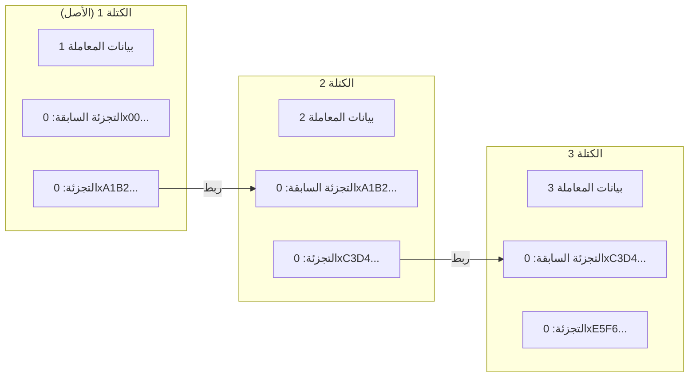
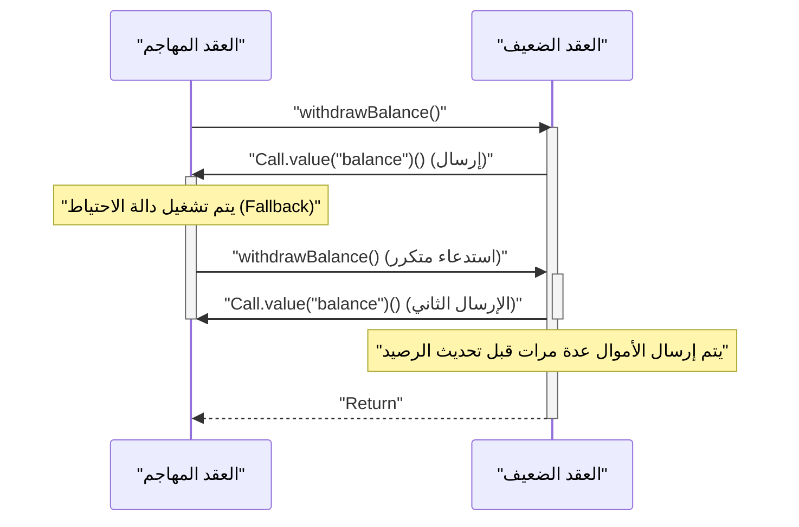

في الاقتصاد الرقمي الحديث، تُحدث تقنيات ** البلوكتشين ** و ** العقود الذكية ** تحولات جذرية في جميع الصناعات، من التمويل إلى سلاسل التوريد وإدارة الهوية. تستكشف هذه المقالة بشكل شامل وعميق المبادئ الأساسية لدفتر الأستاذ الموزع التي تدعمها، الخلفية الرياضية لخوارزميات الإجماع، البنية الداخلية لآلة الإيثريوم الافتراضية (EVM)، بالإضافة إلى تنفيذ العقود الذكية التي تعمل في العالم الحقيقي، ونقاط الضعف القاتلة التي قد تكمن فيها.

## 1. المبادئ الأساسية للبلوكتشين وتقنية دفتر الأستاذ الموزع (DLT)

البلوكتشين هو نوع من ** تقنية دفتر الأستاذ الموزع (DLT) ** حيث يشارك جميع المشاركين في الشبكة (العقد) نفس البيانات ويتحققون منها حتى بدون وجود مسؤول مركزي، مما يجعل التلاعب بها أمراً بالغ الصعوبة.

### 1.1 دوال التجزئة وتقنيات التشفير

الأساس الأمني للبلوكتشين يعتمد على ** دالة التجزئة ** التشفيرية. دالة التجزئة هي دالة تخرج سلسلة نصية ذات طول ثابت (قيمة التجزئة) من بيانات إدخال ذات طول عشوائي، وتتميز بالخصائص التالية:

1. ** الاتجاه الواحد (Pre-image Resistance) ** : من الصعب جداً عكس حساب البيانات الأصلية من قيمة التجزئة.
2. ** مقاومة الاصطدام (Collision Resistance) ** : من الصعب العثور على بيانات إدخال مختلفة تمتلك نفس قيمة التجزئة.
3. ** تغيير طفيف في الإدخال يغير الإخراج بشكل كبير (تأثير الانهيار الجليدي) ** .

في العديد من شبكات البلوكتشين مثل البيتكوين والإيثريوم، تُستخدم خوارزميات التجزئة مثل SHA-256 و Keccak-256.

### 1.2 آلية مقاومة التلاعب باستخدام سلسلة التجزئة

في البلوكتشين، يتم تجميع المعاملات (سجلات المعاملات) خلال فترة معينة في "كتلة"، والتي يتم ربطها مثل سلسلة على طول المحور الزمني. يتم إنشاء كل كتلة لتشمل قيمة التجزئة للكتلة السابقة ( ** Previous Hash ** ). تخلق هذه البنية مقاومة قوية للتلاعب تُعرف باسم ** سلسلة التجزئة ** .

يوضح الشكل التالي كيفية ربط الكتل:



إذا قام عقدة خبيثة بالتلاعب ببيانات المعاملات في ** الكتلة 1 ** السابقة، فبسبب طبيعة دالة التجزئة، ستتغير قيمة التجزئة الجديدة للكتلة 1 تماماً عن قيمتها الأصلية `0xA1B2...`. ونتيجة لذلك، لن تتطابق مع `Prev Hash` المسجلة في ** الكتلة 2 ** ، مما يدمر تناسق السلسلة. للحفاظ على التناسق، سيكون من الضروري إعادة حساب قيم التجزئة لجميع الكتل التي تلي الكتلة المعدلة. بالاقتران مع خوارزميات الإجماع مثل PoW الموضحة لاحقاً، تتطلب عملية إعادة الحساب هذه قوة حسابية فلكية (تكلفة)، مما يجعل التلاعب مستحيلاً من الناحية العملية.

## 2. استكشاف عميق لخوارزميات الإجماع

نظراً لعدم وجود مسؤول مركزي في الشبكة، فإن وجود خوارزمية للاتفاق (الإجماع) بين العقد حول "أي المعاملات صحيحة" و "من سينشئ الكتلة التالية" أمر ضروري. هذا هو المفتاح لحل ** مشكلة الجنرال البيزنطي ** في الحوسبة الموزعة.

### 2.1 إثبات العمل (PoW)

آلية ** إثبات العمل (PoW) ** المستخدمة في البيتكوين هي نظام يحصل فيه المشارك على حق إنشاء الكتلة (حق التعدين) عن طريق إثبات كمية الحسابات (العمل). يقوم المعدنون (عمال المناجم) بتمرير معلومات رأس الكتلة وقيمة عشوائية تسمى "Nonce" عبر دالة تجزئة، ويبحثون عن Nonce يجعل النتيجة أصغر من "هدف" معين تحدده الشبكة.

يتم التعبير عن العلاقة بين هدف الصعوبة $T$ وقيمة التجزئة $H$ على النحو التالي:

$$
H(\text{رأس الكتلة} \parallel \text{الرقم الخاص}) < T
$$

هنا، يتم تعديل $T$ بانتظام وفقاً لمعدل التجزئة (القوة الحسابية) للشبكة، مما يحافظ على فاصل زمني ثابت لإنشاء الكتل (حوالي 10 دقائق في حالة البيتكوين).
إذا تم التعبير عن قيمة التجزئة كعدد صحيح بحجم 256 بت، فإن احتمالية العثور على تجزئة تلبي الهدف $T$ هي كما يلي:

$$
P = \frac{T}{2^{256}}
$$

نظراً لأن احتمالية استيفاء الشرط في عملية حساب تجزئة واحدة منخفضة للغاية، يكرر المعدنون الحسابات من خلال هجوم القوة العمياء. فقط المعدن الذي يستهلك طاقة هائلة ويفوز في سباق الحساب يمكنه إضافة كتلة جديدة والحصول على مكافأة (مكافأة التعدين ورسوم المعاملات). لكي يتمكن المهاجم من التلاعب بالسلسلة، يجب عليه التحكم في أكثر من 51% من القوة الحسابية للشبكة بأكملها (هجوم 51%)، وهو أمر يتطلب تكلفة هائلة في الواقع.

### 2.2 إثبات الحصة (PoS)

تم ابتكار ** إثبات الحصة (PoS) ** لحل مشاكل العبء البيئي العالي وقابلية التوسع في PoW. انتقلت الإيثريوم من PoW إلى PoS عبر تحديث "الدمج" (The Merge).

في PoS، يتم اختيار منشئي الكتل (المدققين) بناءً على كمية الاحتفاظ (كمية الحصة) من العملة المشفرة الأصلية للشبكة (مثل ETH) وفترة القفل، وليس القوة الحسابية.
الأصول المخزنة (Staked) تعمل كضمان (خاضعة للعقوبات، وتُعرف باسم Slashing) في حال تصرف المدقق بشكل غير أمين. ونتيجة لذلك، يجب على المهاجم شراء كمية ضخمة من العملات للهجوم على الشبكة، وإذا نجح الهجوم وانهارت قيمة العملة، ستصبح أصوله أيضاً بلا قيمة، وهذه الآلية من الحوافز الاقتصادية تضمن الأمن.

### 2.3 التسامح العملي مع الأخطاء البيزنطية (PBFT)

يتم غالباً استخدام ** PBFT ** في شبكات البلوكتشين التحالفية أو الخاصة (مثل Hyperledger Fabric).
PBFT هي خوارزمية تضمن تحقيق إجماع صحيح حتى إذا كان أقل من $1/3$ من العقد في الشبكة خبيثة (خطأ بيزنطي). بعد اختيار عقدة القائد، يتم تحديد الحالة بين العقد من خلال عملية اتصال مقسمة إلى ثلاث مراحل: الإعداد المسبق (Pre-prepare)، الإعداد (Prepare)، والالتزام (Commit). على عكس النهائية الاحتمالية في PoW (حيث يقترب احتمال الانعكاس من الصفر بمرور الوقت)، فإنه يتميز بنهائية فورية (نهائية مطلقة)، لكن نظراً لارتفاع عبء الاتصالات، فهو غير مناسب للسلاسل العامة التي تحتوي على عدد كبير من العقد.

## 3. العقود الذكية و EVM (آلة الإيثريوم الافتراضية)

** العقود الذكية ** هي برامج يتم تنفيذها تلقائياً على البلوكتشين عند استيفاء شروط محددة مسبقاً. تجسد مفهوم "الرمز هو القانون" (Code is Law)، وتحقق التنفيذ التلقائي للمعاملات والعقود الموثوقة بدون وسطاء.

### 3.1 بنية EVM

البيئة التي تنفذ العقود الذكية على الإيثريوم هي ** EVM (آلة الإيثريوم الافتراضية) ** . EVM هي آلة افتراضية مكتملة حسب تورنغ تعمل على جميع العقد في الشبكة، وتعمل كـ "آلة انتقال حالة" ضخمة.

$$
S_{t+1} = \Upsilon(S_t, T)
$$

في المعادلة أعلاه، يمثل $S_t$ الحالة العالمية الحالية للإيثريوم (أرصدة كل حساب وتخزين العقود)، ويمثل $T$ المعاملة، وتمثل $\Upsilon$ دالة انتقال الحالة بواسطة EVM، ويمثل $S_{t+1}$ الحالة الجديدة بعد تنفيذ المعاملة.

تنقسم البنية الداخلية لـ EVM بشكل أساسي إلى المناطق التالية:
- ** المكدس ([Stack](https://kenji.blog/ar/p/c-language-pointers-memory-management-stack-heap/)) ** : هيكل بيانات LIFO (يدخل أخيراً يخرج أولاً) بحد أقصى 1024 عنصراً. بحجم كلمة 256 بت. يحتفظ بمعاملات العمليات المختلفة.
- ** الذاكرة (Memory) ** : مصفوفة بايتات متطايرة يتم الاحتفاظ بها مؤقتاً فقط أثناء تنفيذ المعاملة.
- ** التخزين (Storage) ** : منطقة بيانات دائمة مخصصة لكل عقد. تتكون من قاعدة بيانات بنمط المفتاح والقيمة (256 بت إلى 256 بت)، وتتطلب عمليات الكتابة تكلفة غاز (رسوم) عالية.

## 4. تنفيذ العقود الذكية باستخدام Solidity

عادةً ما تُكتب العقود الذكية بلغة عالية المستوى كائنية التوجه تسمى ** Solidity ** ، وتُجمع إلى كود بايت EVM وتُنشر.

### 4.1 مثال على تنفيذ نظام تصويت

فيما يلي مثال على كود Solidity يوضح الهيكل الأساسي لنظام تصويت موزع وآمن.

```solidity
// SPDX-License-Identifier: MIT
pragma solidity ^0.8.0;

contract Voting {
    struct Proposal {
        string name;
        uint256 voteCount;
    }

    address public chairperson;
    mapping(address => bool) public hasVoted;
    Proposal[] public proposals;

    constructor(string[] memory proposalNames) {
        chairperson = msg.sender;
        for (uint i = 0; i < proposalNames.length; i++) {
            proposals.push(Proposal({
                name: proposalNames[i],
                voteCount: 0
            }));
        }
    }

    function vote(uint proposalIndex) public {
        require(!hasVoted[msg.sender], "تم التصويت بالفعل.");
        require(proposalIndex < proposals.length, "فهرس الاقتراح غير صالح.");

        hasVoted[msg.sender] = true;
        proposals[proposalIndex].voteCount += 1;
    }

    function winningProposal() public view returns (uint winningProposalIndex) {
        uint winningVoteCount = 0;
        for (uint p = 0; p < proposals.length; p++) {
            if (proposals[p].voteCount > winningVoteCount) {
                winningVoteCount = proposals[p].voteCount;
                winningProposalIndex = p;
            }
        }
    }
}
```

في هذا الكود، يتم استخدام `mapping` لمنع التصويت المزدوج، وتحقيق تصويت عالي الشفافية على بلوكتشين غير قابل للتغيير.

### 4.2 معيار رموز ERC-20

المعيار الأكثر استخداماً كأساس للأصول المشفرة (العملات الافتراضية) هو معيار رموز ** ERC-20 ** . من خلال تنفيذ الوظائف القياسية مثل `transfer` و `balanceOf` و `approve` و `transferFrom`، يمكن التفاعل بسلاسة مع التبادلات اللامركزية (DEX) والمحافظ.

## 5. نقاط ضعف العقود الذكية والأمان

نظراً لأن الكود الموجود على البلوكتشين يتمتع بخاصية الثبات (غير قابل للتغيير) بحيث لا يمكن تعديله بسهولة بمجرد نشره، فإن الأخطاء ونقاط الضعف في الكود تؤدي مباشرة إلى تسرب مدمر للأموال (اختراق).

### 5.1 هجوم إعادة الدخول (Reentrancy Attack)

كان سبب أشهر حادثة اختراق في تاريخ الإيثريوم، وهي "حادثة The DAO"، هو ** هجوم إعادة الدخول (Reentrancy) ** . وهو هجوم يحدث عند إرسال الإيثر من عقد إلى عقد خبيث خارجي، حيث يقوم العقد الخبيث من خلال دالة الاحتياط (Fallback) الخاصة به باستدعاء دالة الإرسال الخاصة بالعقد الأصلي بشكل متكرر، مما يؤدي إلى استنزاف الأموال قبل تحديث الرصيد.

يوضح مخطط التسلسل التالي مسار هجوم إعادة الدخول.



#### مثال على كود ضعيف

```solidity
contract VulnerableBank {
    mapping(address => uint256) public balances;

    // دالة سحب ضعيفة
    function withdraw() public {
        uint256 bal = balances[msg.sender];
        require(bal > 0, "رصيد غير كاف");

        // إرسال الإيثر إلى عقد خارجي (هنا يحدث هجوم إعادة الدخول)
        (bool sent, ) = msg.sender.call{value: bal}("");
        require(sent, "فشل في إرسال الإيثر");

        // يتم تحديث الرصيد بعد الإرسال (متأخر جداً)
        balances[msg.sender] = 0;
    }
}
```

#### مثال على كود تم إصلاحه (نمط Checks-Effects-Interactions)

أفضل ممارسة لمنع إعادة الدخول (Reentrancy) هي تطبيق نمط ** Checks-Effects-Interactions ** الذي يقوم بتحديث الحالة (مثل الرصيد) قبل إجراء الاستدعاء الخارجي، أو استخدام معدّل `ReentrancyGuard` من OpenZeppelin.

```solidity
contract SecureBank {
    mapping(address => uint256) public balances;

    // دالة سحب تم إصلاحها
    function withdraw() public {
        uint256 bal = balances[msg.sender];
        require(bal > 0, "رصيد غير كاف");

        // 1. الفحوصات (Checks): تأكيد الشروط (require أعلاه)
        // 2. التأثيرات (Effects): تنفيذ تحديث الحالة أولاً
        balances[msg.sender] = 0;

        // 3. التفاعلات (Interactions): تنفيذ الاستدعاء الخارجي أخيراً
        (bool sent, ) = msg.sender.call{value: bal}("");
        require(sent, "فشل في إرسال الإيثر");
    }
}
```

### 5.2 نقاط ضعف أخرى

- ** التدفق الزائد / التدفق الناقص (Overflow / Underflow) ** : في الإصدارات السابقة لـ Solidity 0.8.0، كانت هناك نقطة ضعف حيث تلتف القيم عند إجراء حسابات تتجاوز القيم القصوى أو الدنيا للأعداد الصحيحة. حالياً، يتم حمايتها على مستوى المترجم لتصبح أخطاء ذعر (Panic).
- ** الاستباق (Front-running) ** : يتم الاحتفاظ بمعاملات البلوكتشين مؤقتاً في تجمع انتظار عام (Mempool). يراقب المهاجمون Mempool ويحددون رسوم غاز أعلى من المعاملة المستهدفة لجعل معاملتهم تُعالج أولاً، وبالتالي اقتناص الأرباح (مثل هجمات الساندويتش).

## 6. الخلاصة

تبني ** البلوكتشين ** و ** العقود الذكية ** نظام دفتر أستاذ موزع متقدم يجمع بين المتانة التشفيرية والحوافز الاقتصادية. يحافظ تكوين الإجماع من خلال PoW و PoS على شبكة غير موثوقة (Trustless)، وتسمح EVM بالتنفيذ المرن للبرامج عليها. ومع ذلك، نظراً لأن الميزات القوية للعقود الذكية تأتي مع مخاطر أمنية متقدمة مثل إعادة الدخول (Reentrancy)، فإن تصميم بنية قوية وتدقيق صارم للكود أمر ضروري في التطوير. نأمل أن تكون المبادئ والمعرفة العملية المشروحة في هذه المقالة مفيدة في تطوير تطبيقات لامركزية (dApps) للجيل القادم.
