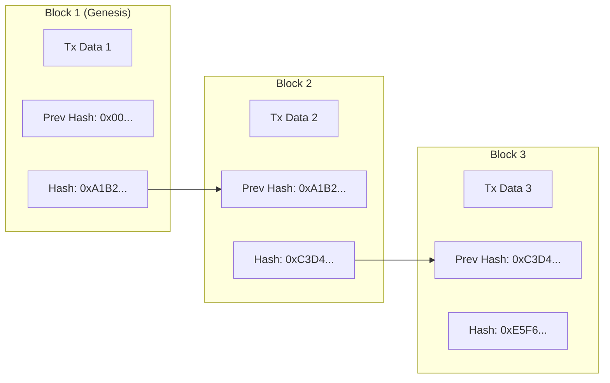
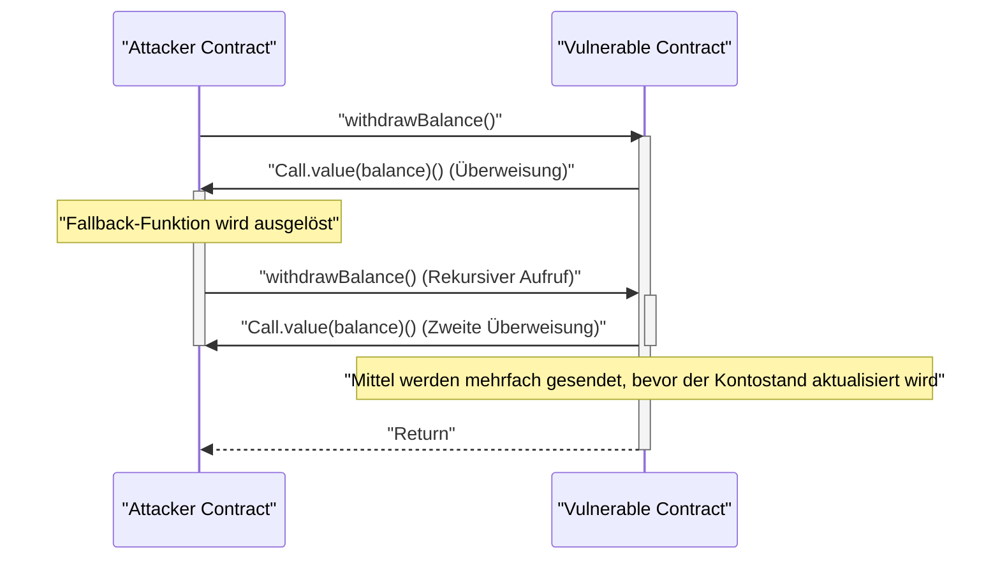

In der modernen digitalen Wirtschaft verändern die Technologien ** Blockchain ** und ** Smart Contracts ** jede Branche grundlegend, von Finanzen über Lieferketten bis hin zum Identitätsmanagement. In diesem Artikel untersuchen wir umfassend und tiefgreifend die grundlegenden Prinzipien der verteilten Ledger, die diese Technologien unterstützen, den mathematischen Hintergrund von Konsensalgorithmen, die interne Struktur der Ethereum Virtual Machine (EVM), die Implementierung von Smart Contracts in der realen Welt und die kritischen Schwachstellen, die in ihnen verborgen liegen können.

## 1. Die Grundprinzipien der Blockchain und Distributed Ledger Technology (DLT)

Eine Blockchain ist eine Art von ** Distributed Ledger Technology (DLT) ** (verteilte Ledger-Technologie), bei der alle Netzwerkteilnehmer (Knoten) dieselben Daten teilen und verifizieren, ohne dass ein zentraler Administrator vorhanden ist. Dadurch wird eine Manipulation der Daten extrem erschwert.

### 1.1 Hash-Funktionen und Kryptographie

Die Grundlage der Blockchain-Sicherheit ist die kryptographische ** Hash-Funktion **. Eine Hash-Funktion ist eine Funktion, die Eingabedaten beliebiger Länge in eine Zeichenfolge fester Länge (Hash-Wert) umwandelt und folgende Eigenschaften aufweist:

1. ** Einwegfunktion (Pre-image Resistance) **: Es ist extrem schwierig, die ursprünglichen Daten aus dem Hash-Wert zurückzurechnen.
2. ** Kollisionsresistenz (Collision Resistance) **: Es ist schwierig, zwei verschiedene Eingabedaten zu finden, die denselben Hash-Wert erzeugen.
3. ** Winzige Änderungen an der Eingabe führen zu einer großen Änderung der Ausgabe (Lawineneffekt) **.

In vielen Blockchains wie Bitcoin und Ethereum werden Hash-Algorithmen wie SHA-256 oder Keccak-256 verwendet.

### 1.2 Wie Hash-Ketten Manipulationssicherheit gewährleisten

In einer Blockchain werden "Blöcke", die Transaktionen (Transaktionsaufzeichnungen) innerhalb eines bestimmten Zeitraums gruppieren, chronologisch wie eine Kette miteinander verbunden. Jeder Block enthält den Hash-Wert des vorherigen Blocks ( ** Previous Hash ** ). Diese Struktur erzeugt eine starke Manipulationssicherheit, die ** Hash-Kette ** genannt wird.

Das folgende Diagramm zeigt, wie die Blöcke miteinander verbunden sind.



Angenommen, ein böswilliger Knoten manipuliert die Transaktionsdaten im vergangenen ** Block 1 **. Aufgrund der Natur von Hash-Funktionen ändert sich der neue Hash-Wert von Block 1 vom ursprünglichen `0xA1B2...` in einen völlig anderen Wert. Infolgedessen stimmt er nicht mehr mit dem in ** Block 2 ** aufgezeichneten `Prev Hash` überein, wodurch die Integrität der Kette zerstört wird. Um die Integrität aufrechtzuerhalten, müssen die Hash-Werte aller Blöcke nach dem manipulierten Block neu berechnet werden. In Kombination mit Konsensalgorithmen wie PoW, die später besprochen werden, erfordert diese Neuberechnung eine astronomische Rechenleistung (Kosten), wodurch eine Manipulation de facto unmöglich wird.

## 2. Eine tiefe Erkundung der Konsensalgorithmen

Da es keinen zentralen Administrator im Netzwerk gibt, ist ein Algorithmus unerlässlich, damit sich die Knoten darüber einigen (Konsens finden) können, "welche Transaktionen gültig sind" und "wer den nächsten Block generieren wird". Dies ist der Schlüssel zur Lösung des ** Problems der byzantinischen Generäle ** im verteilten Rechnen.

### 2.1 Proof of Work (PoW)

** Proof of Work (PoW) **, der in Bitcoin verwendet wird, ist ein System, bei dem das Recht zur Blockgenerierung (Mining-Recht) durch den Nachweis von Rechenleistung (Arbeit) erlangt wird. Miner lassen die Header-Informationen des Blocks und einen zufälligen Wert namens "Nonce" durch eine Hash-Funktion laufen und suchen nach einer Nonce, deren Ergebnis kleiner ist als ein vom Netzwerk definiertes "Ziel".

Die Beziehung zwischen diesem Schwierigkeitsziel $T$ und dem Hash-Wert $H$ wird wie folgt ausgedrückt:

$$
H(\text{Block-Header} \parallel \text{Nonce}) < T
$$

Hier wird $T$ regelmäßig entsprechend der Hash-Rate (Rechenleistung) des Netzwerks angepasst, um das Blockgenerierungsintervall (etwa 10 Minuten bei Bitcoin) konstant zu halten.
Wenn der Hash-Wert als 256-Bit-Ganzzahl dargestellt wird, ist die Wahrscheinlichkeit, einen Hash zu finden, der das Ziel $T$ erfüllt, wie folgt:

$$
P = \frac{T}{2^{256}}
$$

Da die Wahrscheinlichkeit, die Bedingung in einer einzigen Hash-Berechnung zu erfüllen, extrem gering ist, wiederholen die Miner die Berechnungen durch Brute-Force. Nur der Miner, der enorme Mengen an Strom verbraucht und den Berechnungswettbewerb gewinnt, kann einen neuen Block hinzufügen und Belohnungen (Mining-Belohnung und Transaktionsgebühren) erhalten. Damit ein Angreifer die Kette manipulieren kann, muss er über 51 % der Rechenleistung des gesamten Netzwerks (51 %-Angriff) kontrollieren, was in der Realität enorme Kosten verursacht.

### 2.2 Proof of Stake (PoS)

** Proof of Stake (PoS) ** wurde entwickelt, um die hohe Umweltbelastung und die Skalierbarkeitsprobleme von PoW zu lösen. Ethereum ist durch das "The Merge"-Update von PoW zu PoS übergegangen.

Bei PoS werden die Blockgeneratoren (Validatoren) nicht aufgrund von Rechenleistung, sondern basierend auf der gehaltenen Menge (Stake) und der Sperrdauer des nativen Tokens des Netzwerks (z. B. ETH) ausgewählt.
Die gestaketen Vermögenswerte dienen als Sicherheit (Gegenstand von Strafen, sogenanntes Slashing), falls ein Validator böswillig handelt. Dies stellt die Sicherheit durch einen wirtschaftlichen Anreizmechanismus sicher: Ein Angreifer muss große Mengen an Token aufkaufen, um das Netzwerk anzugreifen, und wenn der Angriff erfolgreich ist und der Token-Wert einbricht, wird das eigene Vermögen ebenfalls wertlos.

### 2.3 Practical Byzantine Fault Tolerance (PBFT)

** PBFT ** wird häufig in Konsortium- oder privaten Blockchains (wie Hyperledger Fabric) eingesetzt.
PBFT ist ein Algorithmus, der eine korrekte Konsensbildung garantiert, selbst wenn weniger als $1/3$ der Knoten im Netzwerk bösartig oder fehlerhaft (byzantinische Fehler) sind. Die Knoten bestätigen den [Zustand](https://kenji.blog/de/p/state-management-history-redux-context-recoil-zustand/) durch einen Kommunikationsprozess, der in drei Phasen unterteilt ist: Pre-prepare, Prepare und Commit, ausgehend von der Auswahl eines Leader-Knotens. Im Gegensatz zur probabilistischen Finalität bei PoW (bei der die Wahrscheinlichkeit einer Umkehrung im Laufe der Zeit gegen Null geht) zeichnet sich PBFT durch sofortige Finalität (absolute Finalität) aus. Wegen des großen Kommunikations-Overheads ist es jedoch nicht für öffentliche Blockchains mit einer großen Anzahl von Knoten geeignet.

## 3. Smart Contracts und die EVM (Ethereum Virtual Machine)

Ein ** Smart Contract ** ist ein Programm, das automatisch auf der Blockchain ausgeführt wird, wenn voreingestellte Bedingungen erfüllt sind. Er verkörpert das Konzept "Code is Law" (Code ist Gesetz) und ermöglicht die automatische Ausführung von vertrauenswürdigen Transaktionen und Verträgen ohne Vermittler.

### 3.1 Die Architektur der EVM

Die Umgebung, in der Smart Contracts auf Ethereum ausgeführt werden, ist die ** EVM (Ethereum Virtual Machine) **. Die EVM ist eine Turing-vollständige virtuelle Maschine, die auf allen Knoten im Netzwerk läuft und als riesige "Zustandsübergangsmaschine (State Transition Machine)" fungiert.

$$
S_{t+1} = \Upsilon(S_t, T)
$$

In der obigen Gleichung steht $S_t$ für den aktuellen globalen Zustand von Ethereum (die Salden jedes Kontos und der Speicher von Contracts), $T$ für eine Transaktion, $\Upsilon$ für die Zustandsübergangsfunktion der EVM und $S_{t+1}$ für den neuen Zustand nach der Ausführung der Transaktion.

Die interne Struktur der EVM ist hauptsächlich in die folgenden Bereiche unterteilt:
- ** [Stack](https://kenji.blog/de/p/c-language-pointers-memory-management-stack-heap/) (Stapel) **: Eine LIFO (Last In, First Out) Datenstruktur mit bis zu 1024 Elementen. Wortgröße von 256 Bit. Er hält die Operanden für verschiedene Operationen.
- ** Memory (Speicher) **: Ein flüchtiges Byte-Array, das nur während der Transaktionsausführung temporär gehalten wird.
- ** Storage (Speicher) **: Ein persistenter Datenbereich, der jedem Contract zugewiesen wird. Er besteht aus einer [Key-Value](https://kenji.blog/de/p/nosql-database-selection-kvs-document-graph-wide-column/) (256-Bit zu 256-Bit) Datenbank, und Schreiboperationen sind mit hohen Gaskosten (Gebühren) verbunden.

## 4. Implementierung von Smart Contracts mit Solidity

Smart Contracts werden normalerweise in ** Solidity **, einer objektorientierten Hochsprache, geschrieben und dann in den Bytecode der EVM kompiliert und bereitgestellt.

### 4.1 Beispiel für die Implementierung eines Wahlsystems

Das Folgende ist ein Beispiel für Solidity-Code, das die Grundstruktur eines sicheren, dezentralisierten Wahlsystems zeigt.

```solidity
// SPDX-License-Identifier: MIT
pragma solidity ^0.8.0;

contract Voting {
    struct Proposal {
        string name;
        uint256 voteCount;
    }

    address public chairperson;
    mapping(address => bool) public hasVoted;
    Proposal[] public proposals;

    constructor(string[] memory proposalNames) {
        chairperson = msg.sender;
        for (uint i = 0; i < proposalNames.length; i++) {
            proposals.push(Proposal({
                name: proposalNames[i],
                voteCount: 0
            }));
        }
    }

    function vote(uint proposalIndex) public {
        require(!hasVoted[msg.sender], "Already voted."); // Bereits abgestimmt.
        require(proposalIndex < proposals.length, "Invalid proposal index."); // Ungültiger Vorschlagsindex.

        hasVoted[msg.sender] = true;
        proposals[proposalIndex].voteCount += 1;
    }

    function winningProposal() public view returns (uint winningProposalIndex) {
        uint winningVoteCount = 0;
        for (uint p = 0; p < proposals.length; p++) {
            if (proposals[p].voteCount > winningVoteCount) {
                winningVoteCount = proposals[p].voteCount;
                winningProposalIndex = p;
            }
        }
    }
}
```

In diesem Code wird `mapping` verwendet, um doppelte Abstimmungen zu verhindern und transparente Abstimmungen auf einer unveränderlichen Blockchain zu realisieren.

### 4.2 Der ERC-20 Token-Standard

Der ** ERC-20 ** Token-Standard ist der am häufigsten verwendete Standard für Kryptowährungen. Durch die Implementierung standardisierter Funktionen wie `transfer`, `balanceOf`, `approve` und `transferFrom` ist eine nahtlose Integration mit DEXs (dezentralisierten Börsen) und Wallets möglich.

## 5. Schwachstellen und Sicherheit von Smart Contracts

Da Code auf der Blockchain nach der Bereitstellung aufgrund seiner Unveränderlichkeit nicht einfach geändert werden kann, führen Fehler oder Schwachstellen im Code direkt zu schwerwiegenden Mittelabflüssen (Hacks).

### 5.1 Reentrancy-Angriff (Reentrancy Attack)

Die Ursache für den "The DAO Hack", den berühmtesten Hacking-Vorfall in der Geschichte von Ethereum, war ein ** Reentrancy-Angriff **. Wenn Ether von einem Contract an einen externen bösartigen Contract gesendet wird, kann die Fallback-Funktion des bösartigen Contracts die Überweisungsfunktion des ursprünglichen Contracts rekursiv aufrufen und so die Gelder erschöpfen, bevor der Kontostand aktualisiert wird.

Das folgende Sequenzdiagramm zeigt den Ablauf eines Reentrancy-Angriffs.



#### Beispiel für anfälligen Code

```solidity
contract VulnerableBank {
    mapping(address => uint256) public balances;

    // Anfällige Auszahlungsfunktion
    function withdraw() public {
        uint256 bal = balances[msg.sender];
        require(bal > 0, "Insufficient balance"); // Unzureichendes Guthaben

        // Senden von Ether an den externen Contract (Hier findet der Reentrancy-Angriff statt)
        (bool sent, ) = msg.sender.call{value: bal}("");
        require(sent, "Failed to send Ether"); // Fehler beim Senden von Ether

        // Aktualisierung des Kontostands nach der Überweisung (zu spät)
        balances[msg.sender] = 0;
    }
}
```

#### Beispiel für behobenen Code (Checks-Effects-Interactions Pattern)

Der Best Practice zur Vermeidung von Reentrancy ist die Anwendung des ** Checks-Effects-Interactions **-Musters, bei dem der [Zustand](https://kenji.blog/de/p/state-management-history-redux-context-recoil-zustand/) (wie z. B. der Kontostand) aktualisiert wird, bevor externe Aufrufe getätigt werden, oder die Verwendung des Modifikators `ReentrancyGuard` von OpenZeppelin.

```solidity
contract SecureBank {
    mapping(address => uint256) public balances;

    // Gesicherte Auszahlungsfunktion
    function withdraw() public {
        uint256 bal = balances[msg.sender];
        require(bal > 0, "Insufficient balance"); // Unzureichendes Guthaben

        // 1. Checks: Bedingungsprüfung (oben require)
        // 2. Effects: Zustand zuerst aktualisieren
        balances[msg.sender] = 0;

        // 3. Interactions: Externer Aufruf am Ende ausführen
        (bool sent, ) = msg.sender.call{value: bal}("");
        require(sent, "Failed to send Ether"); // Fehler beim Senden von Ether
    }
}
```

### 5.2 Weitere Schwachstellen

- ** Überlauf / Unterlauf (Overflow / Underflow) **: In Solidity vor Version 0.8.0 gab es eine Schwachstelle, bei der Werte umliefen (Wrap-Around), wenn Berechnungen die Maximal- oder Minimalwerte für Integer überschritten. Jetzt wird dies auf Compiler-Ebene durch einen Panic-Fehler geschützt.
- ** Front-Running **: Blockchain-Transaktionen werden vorübergehend in einem öffentlichen Wartepool (Mempool) gehalten. Angreifer überwachen den Mempool und setzen eine höhere Gasgebühr als die Transaktion ihres Ziels an, um ihre eigene Transaktion zuerst verarbeiten zu lassen und den Gewinn abzuschöpfen (z. B. Sandwich-Angriffe).

## 6. Zusammenfassung

** Blockchain ** und ** Smart Contracts ** bilden ein hochentwickeltes verteiltes Ledger-System, das kryptographische Robustheit mit wirtschaftlichen Anreizen verbindet. Die Konsensbildung durch PoW oder PoS erhält ein vertrauenswürdiges Netzwerk aufrecht, und die EVM ermöglicht die flexible Ausführung von Programmen darauf. Die leistungsstarken Funktionen von Smart Contracts gehen jedoch mit hohen Sicherheitsrisiken wie Reentrancy einher, weshalb ein robustes Architekturdesign und strenge Code-Audits während der Entwicklung unerlässlich sind. Wir hoffen, dass die in diesem Artikel erläuterten Prinzipien und praktischen Kenntnisse bei der Entwicklung von dezentralisierten Anwendungen (dApps) der nächsten Generation hilfreich sein werden.
