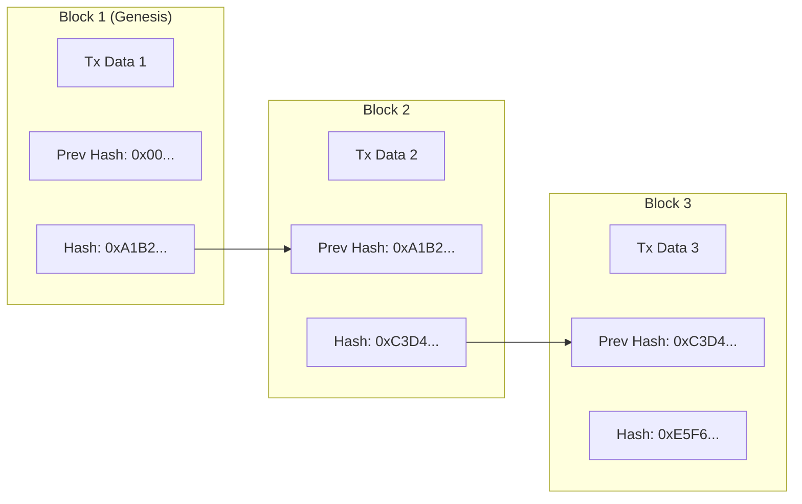
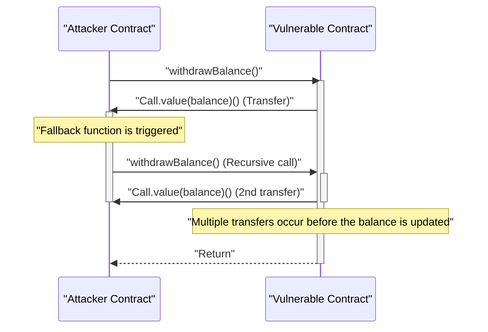

In the modern digital economy, **blockchain** and **smart contract** technologies are bringing disruptive transformations to every industry, from finance to supply chains and identity management. This article provides a comprehensive and deep exploration of the fundamental principles of distributed ledgers that support them, the mathematical background of consensus algorithms, the internal structure of the Ethereum Virtual Machine (EVM), the implementation of smart contracts operating in the real world, and the fatal vulnerabilities hidden within them.

## 1. Fundamental Principles of Blockchain and Distributed Ledger Technology (DLT)

A blockchain is a type of **Distributed Ledger Technology (DLT)** where all network participants (nodes) share and verify the same data without a centralized administrator, making tampering extremely difficult.

### 1.1 [Hash Function](https://kenji.blog/en/p/modern-cryptography-public-key-hash-signature/)s and [Cryptography](https://kenji.blog/en/p/modern-cryptography-public-key-hash-signature/)

The core of blockchain security is the cryptographic **hash function**. A hash function is a function that outputs a fixed-length string (hash value) from input data of any length and has the following characteristics:

1. **Pre-image Resistance**: It is extremely difficult to reverse-engineer the original data from the hash value.
2. **Collision Resistance**: It is difficult to find two different input data that have the same hash value.
3. **Avalanche Effect**: A slight change in the input results in a significant change in the output.

Many blockchains, such as Bitcoin and Ethereum, adopt hash algorithms like SHA-256 and Keccak-256.

### 1.2 Tamper Resistance Mechanism by Hash Chain

In a blockchain, transactions (transaction records) within a certain period are grouped into a "block" and connected like a chain along a timeline. Each block is generated including the hash value of the previous block (**Previous Hash**). This structure creates robust tamper resistance called a **hash chain**.

The following diagram shows how blocks are connected.



If a malicious node tampers with the transaction data in the past **Block 1**, due to the nature of the hash function, the new hash value of Block 1 will change completely from the original `0xA1B2...`. As a result, it will no longer match the `Prev Hash` recorded in **Block 2**, and the integrity of the chain will be destroyed. To maintain integrity, it is necessary to recalculate the hash values of all blocks after the tampered block. When combined with consensus algorithms like PoW described later, this recalculation requires astronomical computing power (cost), making tampering practically impossible.

## 2. Deep Exploration of Consensus Algorithms

Since there is no central administrator in the network, an algorithm is essential for nodes to agree (consensus) on "which transaction is correct" and "who will generate the next block." This is the key to solving the **Byzantine Generals Problem** in distributed computing.

### 2.1 Proof of Work (PoW)

**Proof of Work (PoW)**, adopted by Bitcoin, is a mechanism to obtain block generation rights (mining rights) by proving the amount of computation (work). Miners pass the block header information and a random value called a "Nonce" through a hash function, and seek a nonce whose result is smaller than a specific "target" determined by the network.

The relationship between this difficulty target $T$ and the hash value $H$ is expressed as follows:

$$
H(\text{Block Header} \parallel \text{Nonce}) < T
$$

Here, $T$ is periodically adjusted according to the network's hash rate (computing power) to keep the block generation interval (about 10 minutes for Bitcoin) constant.
If the hash value is represented by a 256-bit integer, the probability of finding a hash that satisfies the target $T$ is as follows:

$$
P = \frac{T}{2^{256}}
$$

Because the probability of satisfying the condition with a single hash calculation is extremely low, miners repeat the calculations using brute force. Only the miner who wins the calculation competition by consuming an enormous amount of electricity can add a new block and receive the reward (mining reward and transaction fees). For an attacker to tamper with the chain, they must control more than 51% of the total computing power of the network (51% attack), which is practically prohibitively expensive.

### 2.2 Proof of Stake (PoS)

**Proof of Stake (PoS)** was devised to solve the high environmental impact and scalability issues of PoW. Ethereum transitioned from PoW to PoS through "The Merge" update.

In PoS, block generators (validators) are selected based on the amount of native tokens (e.g., ETH) held (staked) or lock-up periods, rather than computational effort.
Staked assets act as collateral (subject to penalties, known as slashing) if a validator acts maliciously. Therefore, an attacker would need to buy up a large amount of tokens to attack the network, and if the attack succeeds and the token value crashes, their own assets would become worthless. This economic incentive mechanism ensures security.

### 2.3 Practical Byzantine Fault Tolerance (PBFT)

**PBFT** is often adopted by consortium or private blockchains (such as Hyperledger Fabric).
PBFT is an algorithm that guarantees correct consensus formation even if less than $1/3$ of the nodes in the network are malicious or faulty (Byzantine faults). After the leader node is selected, nodes determine the state through a communication process divided into three phases: Pre-prepare, Prepare, and Commit. Unlike the probabilistic finality of PoW (where the possibility of being overturned approaches zero over time), it features immediate finality (absolute finality), but its large communication overhead makes it unsuitable for public chains with many nodes.

## 3. Smart Contracts and the EVM (Ethereum Virtual Machine)

A **smart contract** is a program that automatically executes on the blockchain when predetermined conditions are met. It embodies the concept of "Code is Law" and enables the automatic execution of trustless transactions and contracts without intermediaries.

### 3.1 EVM Architecture

The environment for executing smart contracts on Ethereum is the **EVM (Ethereum Virtual Machine)**. The EVM is a Turing-complete virtual machine that runs on all nodes on the network and functions as a massive "State Transition Machine".

$$
S_{t+1} = \Upsilon(S_t, T)
$$

In the above equation, $S_t$ represents the current global state of Ethereum (balances of each account and contract storage), $T$ is the transaction, $\Upsilon$ is the state transition function by the EVM, and $S_{t+1}$ indicates the new state after the transaction is executed.

The internal structure of the EVM is mainly divided into the following areas:
- **Stack**: A LIFO (Last-In-First-Out) data structure with up to 1024 elements. 256-bit word size. Holds operands for various operations.
- **Memory**: A volatile byte array that is temporarily held only during transaction execution.
- **Storage**: A persistent data area allocated to each contract. It consists of a key-value (256-bit to 256-bit) database, and write operations incur high gas (fee) costs.

## 4. Smart Contract Implementation with Solidity

Smart contracts are usually written in a high-level object-oriented language called **Solidity**, compiled into EVM bytecode, and deployed.

### 4.1 Voting System Implementation Example

Below is an example of Solidity code showing the basic structure of a secure decentralized voting system.

```solidity
// SPDX-License-Identifier: MIT
pragma solidity ^0.8.0;

contract Voting {
    struct Proposal {
        string name;
        uint256 voteCount;
    }

    address public chairperson;
    mapping(address => bool) public hasVoted;
    Proposal[] public proposals;

    constructor(string[] memory proposalNames) {
        chairperson = msg.sender;
        for (uint i = 0; i < proposalNames.length; i++) {
            proposals.push(Proposal({
                name: proposalNames[i],
                voteCount: 0
            }));
        }
    }

    function vote(uint proposalIndex) public {
        require(!hasVoted[msg.sender], "Already voted.");
        require(proposalIndex < proposals.length, "Invalid proposal index.");

        hasVoted[msg.sender] = true;
        proposals[proposalIndex].voteCount += 1;
    }

    function winningProposal() public view returns (uint winningProposalIndex) {
        uint winningVoteCount = 0;
        for (uint p = 0; p < proposals.length; p++) {
            if (proposals[p].voteCount > winningVoteCount) {
                winningVoteCount = proposals[p].voteCount;
                winningProposalIndex = p;
            }
        }
    }
}
```

In this code, a `mapping` is used to prevent double voting, realizing a highly transparent vote on the immutable blockchain.

### 4.2 ERC-20 Token Standard

The **ERC-20** token standard is the most widely used foundation for crypto assets (cryptocurrencies). By implementing standardized functions such as `transfer`, `balanceOf`, `approve`, and `transferFrom`, you can seamlessly integrate with DEXs (Decentralized Exchanges) and wallets.

## 5. Smart Contract Vulnerabilities and Security

Because code on the blockchain is immutable and cannot be easily modified once deployed, bugs and vulnerabilities in the code directly lead to fatal fund leaks (hacks).

### 5.1 Reentrancy Attack

The **Reentrancy attack** was the cause of "The DAO incident", the most famous hacking incident in Ethereum history. This is an attack where, when transferring Ether from a contract to an external malicious contract, the fallback function of the malicious contract recursively calls the transfer function of the original contract, depleting the funds before the balance is updated.

The sequence diagram below shows the flow of a Reentrancy attack.



#### Vulnerable Code Example

```solidity
contract VulnerableBank {
    mapping(address => uint256) public balances;

    // Vulnerable withdrawal function
    function withdraw() public {
        uint256 bal = balances[msg.sender];
        require(bal > 0, "Insufficient balance");

        // Send Ether to an external contract (reentrancy attack occurs here)
        (bool sent, ) = msg.sender.call{value: bal}("");
        require(sent, "Failed to send Ether");

        // Updating the balance after the transfer (too late)
        balances[msg.sender] = 0;
    }
}
```

#### Secured Code Example (Checks-Effects-Interactions Pattern)

The best practice for preventing Reentrancy is to apply the **Checks-Effects-Interactions** pattern, which updates the state (e.g., balances) before making an external call, or to use OpenZeppelin's `ReentrancyGuard` modifier.

```solidity
contract SecureBank {
    mapping(address => uint256) public balances;

    // Secured withdrawal function
    function withdraw() public {
        uint256 bal = balances[msg.sender];
        require(bal > 0, "Insufficient balance");

        // 1. Checks: Condition verification (require above)
        // 2. Effects: Execute state updates first
        balances[msg.sender] = 0;

        // 3. Interactions: Execute external calls last
        (bool sent, ) = msg.sender.call{value: bal}("");
        require(sent, "Failed to send Ether");
    }
}
```

### 5.2 Other Vulnerabilities

- **Overflow / Underflow**: Prior to Solidity 0.8.0, there was a vulnerability where values would wrap around if calculations exceeded the maximum or minimum integer values. It is now protected at the compiler level, resulting in a panic error.
- **Front-running**: Blockchain transactions are temporarily held in a public waiting pool (Mempool). An attacker monitors the Mempool, sets a higher gas fee than the target's transaction, and has their transaction processed first to siphon profits (e.g., sandwich attacks).

## 6. Conclusion

**Blockchain** and **smart contracts** build a highly advanced distributed ledger system that combines cryptographic robustness and economic incentives. Consensus formation via PoW or PoS maintains a trustless network, and the EVM enables the flexible execution of programs on top of it. However, because the powerful features of smart contracts are accompanied by high-level security risks like Reentrancy, robust architecture design and strict code auditing are indispensable in development. We hope the principles and practical knowledge explained in this article will help you in developing the next generation of decentralized applications (dApps).
