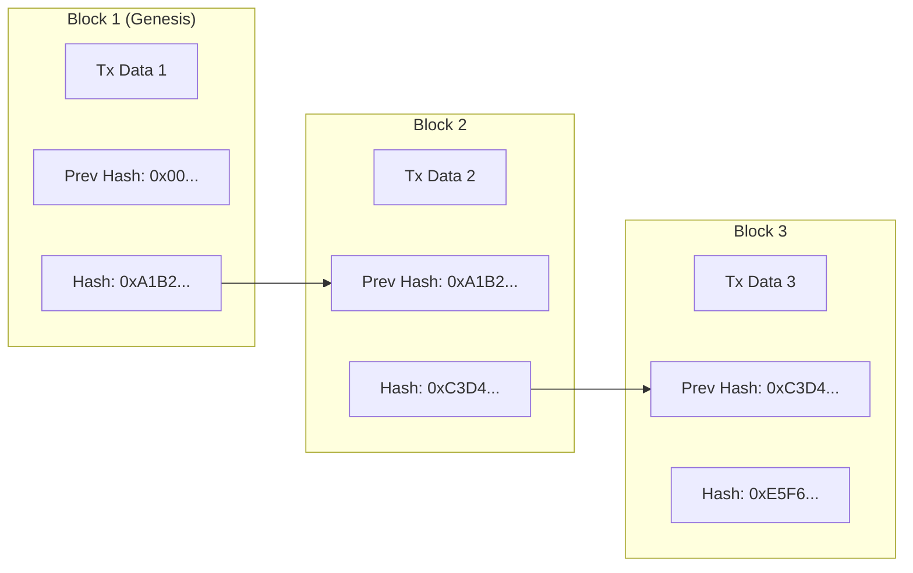
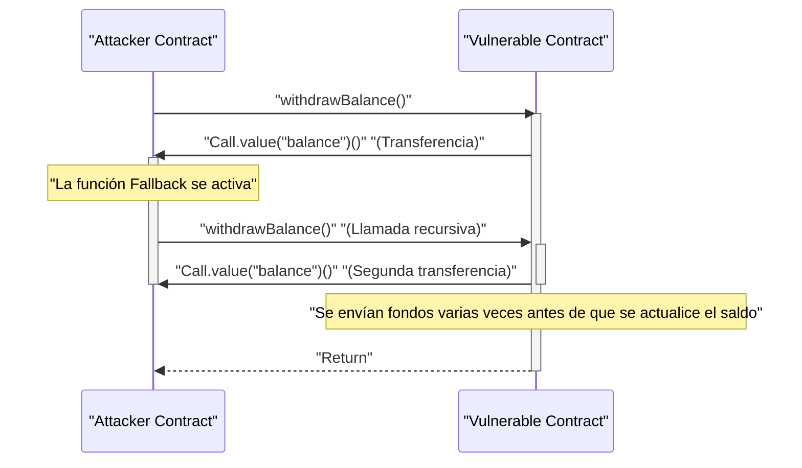

En la economía digital moderna, las tecnologías de ** blockchain ** y ** contratos inteligentes (smart contracts) ** están provocando cambios disruptivos en todo tipo de industrias, desde las finanzas hasta las cadenas de suministro y la gestión de identidades. Este artículo ofrece una explicación profunda y exhaustiva, cubriendo desde los principios fundamentales de la tecnología de libro mayor distribuido que los respalda, hasta el contexto matemático de los algoritmos de consenso, la estructura interna de la Máquina Virtual de Ethereum (EVM), la implementación de contratos inteligentes en el mundo real y las vulnerabilidades fatales ocultas en ellos.

## 1. Principios fundamentales de Blockchain y Tecnología de Libro Mayor Distribuido (DLT)

Blockchain es un tipo de ** Tecnología de Libro Mayor Distribuido (Distributed Ledger Technology: DLT) ** en la que todos los participantes de la red (nodos) comparten y verifican los mismos datos, lo que hace extremadamente difícil su alteración, incluso sin un administrador centralizado.

### 1.1 Funciones Hash y Criptografía

El núcleo de la seguridad de blockchain es la ** función hash ** criptográfica. Una función hash es una función que toma datos de entrada de cualquier longitud y genera una cadena de longitud fija (valor hash), y tiene las siguientes características:

1. ** Resistencia a la preimagen (Unidireccionalidad) **: Es extremadamente difícil calcular los datos originales a partir del valor hash.
2. ** Resistencia a colisiones **: Es difícil encontrar dos datos de entrada diferentes que tengan el mismo valor hash.
3. ** Un pequeño cambio en la entrada cambia enormemente la salida (Efecto avalancha) **.

Muchas blockchains, como Bitcoin y Ethereum, utilizan algoritmos hash como SHA-256 o Keccak-256.

### 1.2 Mecanismo de resistencia a la manipulación mediante Hash Chain

En blockchain, las transacciones (registros de operaciones) de un período de tiempo determinado se agrupan en "bloques" (blocks), que se enlazan cronológicamente como una cadena (chain). Cada bloque se genera incluyendo el valor hash del bloque anterior (** Previous Hash **). Esta estructura crea una robusta resistencia a la manipulación conocida como ** cadena hash (hash chain) **.

El siguiente diagrama muestra cómo se enlazan los bloques:



Si un nodo malicioso altera los datos de la transacción del ** Block 1 ** en el pasado. Entonces, debido a la naturaleza de la función hash, el nuevo valor hash del Block 1 cambiará a un valor completamente diferente del `0xA1B2...` original. Como resultado, ya no coincidirá con el `Prev Hash` registrado en el ** Block 2 **, destruyendo la integridad de la cadena. Para mantener la integridad, es necesario recalcular los valores hash de todos los bloques posteriores al bloque alterado. Al combinarse con algoritmos de consenso como PoW, que se explicará más adelante, este recálculo requiere un poder de cómputo (costo) astronómico, lo que hace que la manipulación sea prácticamente imposible.

## 2. Exploración profunda de los Algoritmos de Consenso

Dado que no hay un administrador central en la red, es indispensable contar con un algoritmo para que los nodos lleguen a un acuerdo (consenso) sobre "qué transacción es correcta" y "quién generará el próximo bloque". Esta es la clave para resolver el ** Problema de los Generales Bizantinos ** en la computación distribuida.

### 2.1 Proof of Work (PoW)

** Proof of Work (PoW) **, adoptado por Bitcoin, es un mecanismo para obtener el derecho a generar bloques (derecho de minería) al demostrar la cantidad de cálculos (trabajo). Los mineros (miners) pasan la información del encabezado del bloque y un valor aleatorio llamado "Nonce" a través de una función hash y buscan un nonce cuyo resultado sea menor que un "objetivo (target)" específico definido por la red.

La relación entre este objetivo de dificultad $T$ y el valor hash $H$ se expresa de la siguiente manera:

$$
H(\text{Cabecera del Bloque} \parallel \text{Nonce}) < T
$$

Donde $T$ se ajusta periódicamente según el hashrate (poder de cómputo) de la red para mantener constante el intervalo de generación de bloques (aproximadamente 10 minutos en el caso de Bitcoin).
Si el valor hash se representa mediante un entero de 256 bits, la probabilidad de encontrar un hash que cumpla con el objetivo $T$ es la siguiente:

$$
P = \frac{T}{2^{256}}
$$

Dado que la probabilidad de cumplir la condición en un solo cálculo de hash es extremadamente baja, los mineros repiten el cálculo de forma de fuerza bruta (brute-force). Solo los mineros que ganan la competencia de cálculo, consumiendo enormes cantidades de energía eléctrica, pueden agregar un nuevo bloque y obtener recompensas (recompensa de minería y tarifas de transacción). Para que un atacante pueda alterar la cadena, tendría que controlar más del 51% del poder de cómputo total de la red (ataque del 51%), lo que en la práctica requeriría costos enormes.

### 2.2 Proof of Stake (PoS)

** Proof of Stake (PoS) ** fue concebido para resolver los problemas de alto impacto ambiental y escalabilidad de PoW. Ethereum pasó de PoW a PoS a través de la actualización "The Merge".

En PoS, los generadores de bloques (validadores) se eligen no en función del volumen de cálculo, sino de la cantidad de tenencia (cantidad en stake) del token nativo de la red (por ejemplo, ETH) o el período de bloqueo.
Los activos en staking sirven como garantía (sujetos a penalizaciones, lo que se llama slashing) si el validador comete fraude. Por lo tanto, un atacante necesitaría acaparar una gran cantidad de tokens para atacar la red, y si el ataque tiene éxito y el valor del token colapsa, sus propios activos también perderían valor, garantizando la seguridad mediante este mecanismo de incentivos económicos.

### 2.3 Practical Byzantine Fault Tolerance (PBFT)

** PBFT ** se adopta a menudo en blockchains de tipo consorcio o privadas (como Hyperledger Fabric).
PBFT es un algoritmo que garantiza la formación de un consenso correcto incluso si menos de $1/3$ de los nodos de la red son maliciosos (falla bizantina). Tras la selección de un nodo líder, se confirma el estado entre los nodos a través de un proceso de comunicación dividido en 3 fases: Pre-prepare, Prepare y Commit. A diferencia de la finalidad probabilística de PoW (donde la probabilidad de reversión se acerca a cero con el tiempo), se caracteriza por tener una finalidad inmediata (finalidad absoluta), pero debido a la gran sobrecarga de comunicación, no es adecuado para cadenas públicas con una gran cantidad de nodos.

## 3. Contratos Inteligentes y EVM (Ethereum Virtual Machine)

Los ** contratos inteligentes (smart contracts) ** son programas que se ejecutan automáticamente en la blockchain cuando se cumplen condiciones preestablecidas. Representan el concepto de "el código es la ley (Code is Law)" y permiten la ejecución automática de transacciones y contratos sin intermediarios (trustless).

### 3.1 Arquitectura de la EVM

El entorno que ejecuta los contratos inteligentes en Ethereum es la ** EVM (Ethereum Virtual Machine) **. La EVM es una máquina virtual Turing completa que funciona en todos los nodos de la red y actúa como una gigantesca "máquina de transición de estado (State Transition Machine)".

$$
S_{t+1} = \Upsilon(S_t, T)
$$

En la fórmula anterior, $S_t$ es el estado global actual de Ethereum (el saldo de cada cuenta y el almacenamiento de los contratos), $T$ es la transacción, $\Upsilon$ es la función de transición de estado de la EVM y $S_{t+1}$ indica el nuevo estado después de ejecutar la transacción.

La estructura interna de la EVM se divide principalmente en las siguientes áreas:
- ** Pila ([Stack](https://kenji.blog/es/p/c-language-pointers-memory-management-stack-heap/)) **: Estructura de datos LIFO (último en entrar, primero en salir) con un máximo de 1024 elementos. Tamaño de palabra de 256 bits. Almacena los operandos para varias operaciones.
- ** Memoria (Memory) **: Arreglo de bytes volátil que se mantiene temporalmente solo durante la ejecución de la transacción.
- ** Almacenamiento (Storage) **: Área de datos persistente asignada a cada contrato. Consiste en una base de datos clave-valor (256 bits a 256 bits) y las operaciones de escritura incurren en altos costos de gas (tarifas).

## 4. Implementación de Contratos Inteligentes con Solidity

Los contratos inteligentes generalmente se escriben en ** Solidity **, un lenguaje de alto nivel orientado a objetos, se compilan en bytecode de EVM y luego se implementan.

### 4.1 Ejemplo de implementación de un sistema de votación

A continuación, se muestra un ejemplo de código en Solidity que ilustra la estructura básica de un sistema de votación descentralizado y seguro.

```solidity
// SPDX-License-Identifier: MIT
pragma solidity ^0.8.0;

contract Voting {
    struct Proposal {
        string name;
        uint256 voteCount;
    }

    address public chairperson;
    mapping(address => bool) public hasVoted;
    Proposal[] public proposals;

    constructor(string[] memory proposalNames) {
        chairperson = msg.sender;
        for (uint i = 0; i < proposalNames.length; i++) {
            proposals.push(Proposal({
                name: proposalNames[i],
                voteCount: 0
            }));
        }
    }

    function vote(uint proposalIndex) public {
        require(!hasVoted[msg.sender], "Already voted.");
        require(proposalIndex < proposals.length, "Invalid proposal index.");

        hasVoted[msg.sender] = true;
        proposals[proposalIndex].voteCount += 1;
    }

    function winningProposal() public view returns (uint winningProposalIndex) {
        uint winningVoteCount = 0;
        for (uint p = 0; p < proposals.length; p++) {
            if (proposals[p].voteCount > winningVoteCount) {
                winningVoteCount = proposals[p].voteCount;
                winningProposalIndex = p;
            }
        }
    }
}
```

En este código, el uso de `mapping` previene la doble votación y permite una votación altamente transparente en la blockchain inmutable.

### 4.2 Estándar de Token ERC-20

El estándar de token ** ERC-20 ** es el más utilizado como base para los criptoactivos (criptomonedas). Al implementar funciones estandarizadas como `transfer`, `balanceOf`, `approve` y `transferFrom`, se puede integrar de forma transparente con DEX (exchanges descentralizados) y billeteras.

## 5. Vulnerabilidades y Seguridad de los Contratos Inteligentes

Dado que el código en la blockchain tiene la inmutabilidad de no poder modificarse fácilmente una vez implementado, los errores y vulnerabilidades en el código se traducen directamente en fugas fatales de fondos (hackeos).

### 5.1 Ataque de Reentrada (Reentrancy Attack)

La causa del incidente de hackeo más famoso en la historia de Ethereum, el "Incidente The DAO", fue el ** ataque de reentrada (Reentrancy) **. Esto ocurre cuando, al transferir Ether desde un contrato a un contrato malicioso externo, se llama recursivamente a la función de envío del contrato original desde la función de respaldo (fallback) del contrato malicioso, agotando los fondos antes de que se actualice el saldo.

El siguiente diagrama de secuencia muestra el flujo de un ataque de reentrada.



#### Ejemplo de código vulnerable

```solidity
contract VulnerableBank {
    mapping(address => uint256) public balances;

    // Función de retiro vulnerable
    function withdraw() public {
        uint256 bal = balances[msg.sender];
        require(bal > 0, "Insufficient balance");

        // Transferencia de Ether a un contrato externo (Aquí ocurre el ataque de reentrada)
        (bool sent, ) = msg.sender.call{value: bal}("");
        require(sent, "Failed to send Ether");

        // El saldo se actualiza después de la transferencia (demasiado tarde)
        balances[msg.sender] = 0;
    }
}
```

#### Ejemplo de código protegido (Patrón Checks-Effects-Interactions)

La mejor práctica para prevenir la reentrada es aplicar el patrón ** Checks-Effects-Interactions **, en el cual el estado (como el saldo) se actualiza antes de realizar llamadas externas, o usar el modificador `ReentrancyGuard` de OpenZeppelin.

```solidity
contract SecureBank {
    mapping(address => uint256) public balances;

    // Función de retiro asegurada
    function withdraw() public {
        uint256 bal = balances[msg.sender];
        require(bal > 0, "Insufficient balance");

        // 1. Checks: Verificación de condiciones (el require anterior)
        // 2. Effects: Ejecutar primero las actualizaciones de estado
        balances[msg.sender] = 0;

        // 3. Interactions: Ejecutar al final las llamadas externas
        (bool sent, ) = msg.sender.call{value: bal}("");
        require(sent, "Failed to send Ether");
    }
}
```

### 5.2 Otras Vulnerabilidades

- ** Desbordamiento / Subdesbordamiento (Overflow / Underflow) **: En las versiones anteriores a Solidity 0.8.0, existía la vulnerabilidad de que los valores volvían al inicio (wrap around) si se realizaban cálculos que superaban los valores máximos o mínimos de un número entero. Actualmente, está protegido a nivel del compilador para generar un error de pánico (panic error).
- ** Front-running **: Las transacciones de blockchain se retienen temporalmente en un grupo de espera público (Mempool). Los atacantes monitorean el Mempool, configuran tarifas de gas más altas que la transacción objetivo y hacen que sus transacciones se procesen primero, robando así las ganancias (como en el ataque sándwich).

## 6. Conclusión

Las ** blockchains ** y los ** contratos inteligentes ** construyen sistemas de libros mayores distribuidos avanzados que combinan solidez criptográfica con incentivos económicos. La formación de consenso a través de PoW o PoS mantiene una red sin necesidad de confianza (trustless), y la EVM permite la ejecución de programas flexibles sobre ella. Sin embargo, las potentes funciones de los contratos inteligentes conllevan altos riesgos de seguridad, como la reentrada, por lo que el diseño de arquitecturas sólidas y las auditorías de código rigurosas son indispensables durante el desarrollo. Esperamos que los principios y el conocimiento práctico explicados en este artículo sirvan de ayuda para el desarrollo de la próxima generación de aplicaciones descentralizadas (dApps).
