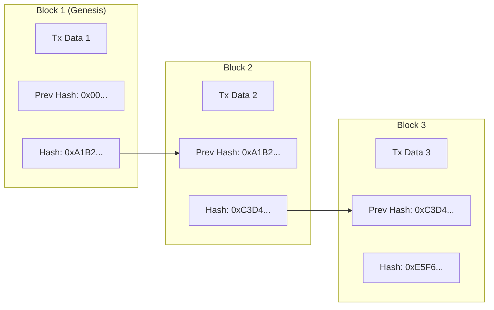
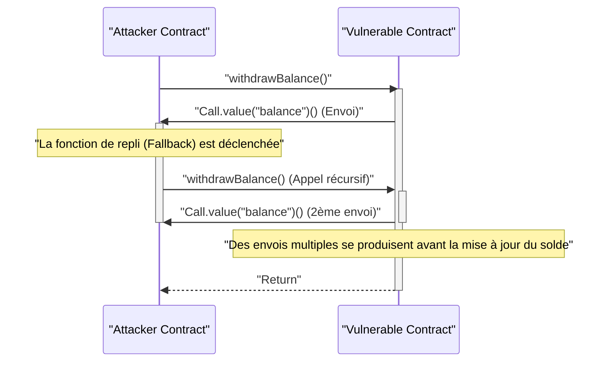

Dans l'économie numérique moderne, les technologies de la **blockchain** et des **smart contracts** apportent des changements disruptifs à toutes les industries, de la finance à la chaîne d'approvisionnement en passant par la gestion des identités. Cet article explore de manière exhaustive et approfondie les principes fondamentaux des registres distribués qui les soutiennent, le contexte mathématique des algorithmes de consensus, la structure interne de l'Ethereum Virtual Machine (EVM), ainsi que la mise en œuvre de smart contracts fonctionnant dans le monde réel et les vulnérabilités critiques qui s'y cachent.

## 1. Principes Fondamentaux de la Blockchain et Technologie des Registres Distribués (DLT)

La blockchain est un type de **Technologie de Registre Distribué (Distributed Ledger Technology : DLT)** où, même en l'absence d'un administrateur centralisé, tous les participants au réseau (nœuds) partagent et vérifient les mêmes données, ce qui rend la falsification extrêmement difficile.

### 1.1 Fonctions de Hachage et Cryptographie

Le cœur de la sécurité de la blockchain repose sur la **fonction de hachage** cryptographique. Une fonction de hachage est une fonction qui prend en entrée des données de longueur arbitraire et produit une chaîne de caractères de longueur fixe (valeur de hachage). Elle possède les caractéristiques suivantes :

1. **Résistance à la préimage (Unidirectionnalité)** : Il est extrêmement difficile de retrouver les données d'origine à partir de la valeur de hachage.
2. **Résistance aux collisions** : Il est difficile de trouver deux données d'entrée différentes ayant la même valeur de hachage.
3. **Un léger changement en entrée entraîne une grande modification en sortie (Effet avalanche)**.

De nombreuses blockchains, comme Bitcoin et Ethereum, utilisent des algorithmes de hachage tels que SHA-256 et Keccak-256.

### 1.2 Mécanisme de Résistance à la Falsification grâce à la Chaîne de Hachage

Dans la blockchain, les "blocs", qui regroupent les transactions enregistrées sur une certaine période, sont reliés chronologiquement comme une chaîne. Chaque bloc est généré en incluant la valeur de hachage du bloc précédent (**Prev Hash**). Cette structure crée une forte résistance à la falsification, appelée **chaîne de hachage**.

Le diagramme ci-dessous montre comment les blocs sont reliés.



Supposons qu'un nœud malveillant altère les données de transaction passées du **Block 1**. Alors, en raison de la nature de la fonction de hachage, la nouvelle valeur de hachage du Block 1 changera complètement de la valeur d'origine `0xA1B2...`. Par conséquent, elle ne correspondra plus au `Prev Hash` enregistré dans le **Block 2**, détruisant ainsi l'intégrité de la chaîne. Pour maintenir l'intégrité, il serait nécessaire de recalculer les valeurs de hachage de tous les blocs après le bloc altéré. Combiné avec des algorithmes de consensus tels que le PoW décrit ci-dessous, ce recalcul nécessiterait une puissance de calcul astronomique (coût), rendant la falsification pratiquement impossible.

## 2. Exploration Approfondie des Algorithmes de Consensus

Puisqu'il n'y a pas d'administrateur central dans le réseau, un algorithme pour que les nœuds s'accordent (consensus) sur "quelles transactions sont correctes" et "qui générera le prochain bloc" est essentiel. C'est la clé pour résoudre le **Problème des Généraux Byzantins** en informatique distribuée.

### 2.1 Preuve de Travail (Proof of Work - PoW)

La **Preuve de Travail (Proof of Work : PoW)**, adoptée par Bitcoin, est un mécanisme permettant d'obtenir le droit de générer des blocs (droit de minage) en prouvant la quantité de calcul (travail). Les mineurs passent les informations de l'en-tête du bloc et une valeur aléatoire appelée "Nonce" à travers une fonction de hachage, et cherchent un Nonce tel que le résultat soit inférieur à une certaine "cible" définie par le réseau.

La relation entre cette cible de difficulté $T$ et la valeur de hachage $H$ est exprimée comme suit :

$$
H(\text{En-tête du Bloc} \parallel \text{Nonce}) < T
$$

Ici, $T$ est ajusté régulièrement en fonction du taux de hachage (puissance de calcul) du réseau pour maintenir constant l'intervalle de génération des blocs (environ 10 minutes pour Bitcoin).
Si la valeur de hachage est représentée par un entier de 256 bits, la probabilité de trouver un hachage satisfaisant la cible $T$ est la suivante :

$$
P = \frac{T}{2^{256}}
$$

Puisque la probabilité de satisfaire la condition en un seul calcul de hachage est extrêmement faible, les mineurs répètent les calculs par force brute (brute-force). Seul le mineur qui remporte la compétition de calcul en consommant une énorme quantité d'électricité peut ajouter un nouveau bloc et recevoir des récompenses (récompenses de minage et frais de transaction). Pour qu'un attaquant falsifie la chaîne, il devrait contrôler plus de 51% de la puissance de calcul totale du réseau (attaque des 51%), ce qui est de manière réaliste extrêmement coûteux.

### 2.2 Preuve d'Enjeu (Proof of Stake - PoS)

Pour résoudre les problèmes de forte empreinte environnementale et d'évolutivité du PoW, la **Preuve d'Enjeu (Proof of Stake : PoS)** a été conçue. Ethereum est passé du PoW au PoS avec la mise à jour "The Merge".

Dans le PoS, au lieu de la puissance de calcul, le créateur de bloc (validateur) est sélectionné en fonction de la quantité de jetons natifs du réseau (par exemple, ETH) détenus (enjeu ou stake) ou de la durée de verrouillage.
Les actifs mis en jeu servent de garantie (soumis à une pénalité, appelée "slashing") si le validateur agit de manière malveillante. Ainsi, un attaquant devrait acheter une quantité massive de jetons pour attaquer le réseau. Si l'attaque réussit et que la valeur du jeton s'effondre, ses propres actifs deviendront également sans valeur. Ce mécanisme d'incitation économique garantit la sécurité.

### 2.3 Tolérance Pratique aux Pannes Byzantines (PBFT)

Le **PBFT (Practical Byzantine Fault Tolerance)** est souvent adopté dans les blockchains de consortium ou privées (telles que Hyperledger Fabric).
Le PBFT est un algorithme qui garantit la formation d'un consensus correct même si moins de $1/3$ des nœuds du réseau sont défectueux ou malveillants (panne byzantine). Le processus passe de l'élection d'un nœud leader à un processus de communication en trois phases (Pre-prepare, Prepare, Commit) pour déterminer l'état entre les nœuds. Contrairement à la finalité probabiliste du PoW (la probabilité d'inversion s'approche de zéro avec le temps), il se caractérise par une finalité immédiate (finalité absolue), mais en raison de la surcharge de communication élevée, il ne convient pas aux chaînes publiques avec un grand nombre de nœuds.

## 3. Smart Contracts et EVM (Ethereum Virtual Machine)

Les **smart contracts** sont des programmes qui s'exécutent automatiquement sur la blockchain lorsque des conditions prédéfinies sont remplies. Ils incarnent le concept de "Code is Law" (le code fait loi) et permettent l'exécution automatique de transactions et de contrats sans intermédiaire et de manière "trustless" (sans besoin de confiance).

### 3.1 Architecture de l'EVM

L'environnement qui exécute les smart contracts sur Ethereum est l'**EVM (Ethereum Virtual Machine)**. L'EVM est une machine virtuelle Turing-complète fonctionnant sur tous les nœuds du réseau et agissant comme une énorme "Machine à Transitions d'État" (State Transition Machine).

$$
S_{t+1} = \Upsilon(S_t, T)
$$

Dans l'équation ci-dessus, $S_t$ représente l'état global actuel d'Ethereum (soldes de chaque compte et stockage de contrats), $T$ est la transaction, $\Upsilon$ est la fonction de transition d'état par l'EVM, et $S_{t+1}$ indique le nouvel état après l'exécution de la transaction.

La structure interne de l'EVM est principalement divisée en les zones suivantes :
- **Pile ([Stack](https://kenji.blog/fr/p/c-language-pointers-memory-management-stack-heap/))** : Structure de données LIFO (Last-In, First-Out) d'un maximum de 1024 éléments. Taille de mot de 256 bits. Elle conserve les opérandes pour diverses opérations.
- **Mémoire (Memory)** : Tableau d'octets volatil conservé temporairement uniquement pendant l'exécution d'une transaction.
- **Stockage (Storage)** : Zone de données persistante allouée à chaque contrat. Composée d'une base de données clé-valeur (256 bits à 256 bits), où les opérations d'écriture entraînent des coûts en gaz (frais) élevés.

## 4. Implémentation de Smart Contracts avec Solidity

Les smart contracts sont généralement écrits dans un langage de haut niveau orienté objet appelé **Solidity**, compilés en bytecode EVM et déployés.

### 4.1 Exemple d'Implémentation d'un Système de Vote

Voici un exemple de code Solidity montrant la structure de base d'un système de vote décentralisé et sécurisé.

```solidity
// SPDX-License-Identifier: MIT
pragma solidity ^0.8.0;

contract Voting {
    struct Proposal {
        string name;
        uint256 voteCount;
    }

    address public chairperson;
    mapping(address => bool) public hasVoted;
    Proposal[] public proposals;

    constructor(string[] memory proposalNames) {
        chairperson = msg.sender;
        for (uint i = 0; i < proposalNames.length; i++) {
            proposals.push(Proposal({
                name: proposalNames[i],
                voteCount: 0
            }));
        }
    }

    function vote(uint proposalIndex) public {
        require(!hasVoted[msg.sender], "Already voted.");
        require(proposalIndex < proposals.length, "Invalid proposal index.");

        hasVoted[msg.sender] = true;
        proposals[proposalIndex].voteCount += 1;
    }

    function winningProposal() public view returns (uint winningProposalIndex) {
        uint winningVoteCount = 0;
        for (uint p = 0; p < proposals.length; p++) {
            if (proposals[p].voteCount > winningVoteCount) {
                winningVoteCount = proposals[p].voteCount;
                winningProposalIndex = p;
            }
        }
    }
}
```

Dans ce code, un `mapping` est utilisé pour empêcher le double vote, réalisant un vote hautement transparent sur une blockchain immuable.

### 4.2 Standard de Jeton ERC-20

Le standard de jeton **ERC-20** est le plus utilisé comme fondation pour les crypto-actifs (cryptomonnaies). En implémentant des fonctions standardisées telles que `transfer`, `balanceOf`, `approve` et `transferFrom`, il permet une intégration transparente avec les DEX (échanges décentralisés) et les portefeuilles.

## 5. Vulnérabilités et Sécurité des Smart Contracts

Étant donné que le code sur la blockchain a une immuabilité qui rend difficile sa modification une fois déployé, les bugs et les vulnérabilités du code conduisent directement à des fuites de fonds fatales (piratages).

### 5.1 Attaque par Réentrance (Reentrancy Attack)

L'attaque qui a causé "l'Incident de The DAO", le piratage le plus célèbre de l'histoire d'Ethereum, est l'**Attaque par Réentrance (Reentrancy)**. Il s'agit d'une attaque où, lors de l'envoi d'Ether depuis un contrat vers un contrat malveillant externe, la fonction d'envoi du contrat d'origine est appelée de manière récursive depuis la fonction de repli (fallback) du contrat malveillant, épuisant ainsi les fonds avant que le solde ne soit mis à jour.

Le diagramme de séquence suivant montre le flux d'une attaque par réentrance.



#### Exemple de Code Vulnérable

```solidity
contract VulnerableBank {
    mapping(address => uint256) public balances;

    // Fonction de retrait vulnérable
    function withdraw() public {
        uint256 bal = balances[msg.sender];
        require(bal > 0, "Insufficient balance");

        // Envoi d'Ether vers un contrat externe (l'attaque par réentrance se produit ici)
        (bool sent, ) = msg.sender.call{value: bal}("");
        require(sent, "Failed to send Ether");

        // Mise à jour du solde après l'envoi (trop tard)
        balances[msg.sender] = 0;
    }
}
```

#### Exemple de Code Sécurisé (Modèle Checks-Effects-Interactions)

La meilleure pratique pour empêcher la réentrance est d'appliquer le modèle **Checks-Effects-Interactions**, où l'état (tel que le solde) est mis à jour avant d'effectuer un appel externe, ou d'utiliser le modificateur `ReentrancyGuard` d'OpenZeppelin.

```solidity
contract SecureBank {
    mapping(address => uint256) public balances;

    // Fonction de retrait sécurisée
    function withdraw() public {
        uint256 bal = balances[msg.sender];
        require(bal > 0, "Insufficient balance");

        // 1. Checks : Vérification des conditions (require ci-dessus)
        // 2. Effects : Exécuter la mise à jour de l'état en premier
        balances[msg.sender] = 0;

        // 3. Interactions : Exécuter l'appel externe en dernier
        (bool sent, ) = msg.sender.call{value: bal}("");
        require(sent, "Failed to send Ether");
    }
}
```

### 5.2 Autres Vulnérabilités

- **Dépassement / Sous-dépassement (Overflow / Underflow)** : Avant Solidity 0.8.0, il y avait une vulnérabilité où les valeurs s'enroulaient (wrap around) si un calcul dépassait la valeur maximale ou minimale d'un entier. Actuellement, cela est protégé au niveau du compilateur, ce qui entraîne une erreur de panique (panic error).
- **Front-running** : Les transactions sur la blockchain sont temporairement conservées dans un pool d'attente public (Mempool). L'attaquant surveille le Mempool, fixe des frais de gaz plus élevés que la transaction cible pour que sa transaction soit traitée en premier, et s'empare des profits (comme dans une attaque sandwich).

## 6. Conclusion

La **blockchain** et les **smart contracts** construisent un système de registre distribué avancé qui combine robustesse cryptographique et incitations économiques. La formation de consensus via le PoW ou le PoS maintient un réseau "trustless", et l'EVM permet une exécution de programmes flexible en son sein. Cependant, les puissantes fonctionnalités des smart contracts s'accompagnent de risques de sécurité avancés tels que la réentrance. Par conséquent, une conception d'architecture robuste et un audit rigoureux du code sont essentiels au développement. Nous espérons que les principes et les connaissances pratiques expliqués dans cet article vous aideront dans le développement d'applications décentralisées (dApps) de nouvelle génération.
