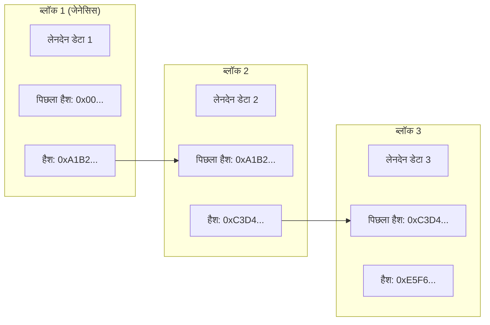
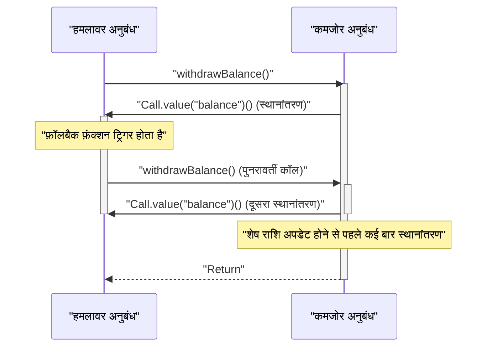

आधुनिक डिजिटल अर्थव्यवस्था में, ** ब्लॉकचेन ** और ** स्मार्ट कॉन्ट्रैक्ट ** प्रौद्योगिकियाँ वित्त से लेकर आपूर्ति श्रृंखला और पहचान प्रबंधन तक हर उद्योग में विनाशकारी बदलाव ला रही हैं। इस लेख में, हम इन प्रौद्योगिकियों का समर्थन करने वाले वितरित खाता बही के मूल सिद्धांतों, सर्वसम्मति एल्गोरिदम की गणितीय पृष्ठभूमि, इथेरियम वर्चुअल मशीन (EVM) की आंतरिक संरचना, वास्तविक दुनिया में चल रहे स्मार्ट कॉन्ट्रैक्ट के कार्यान्वयन और उनमें छिपी घातक कमजोरियों का व्यापक और गहराई से विश्लेषण करेंगे।

## 1. ब्लॉकचेन के मूल सिद्धांत और वितरित खाता बही तकनीक (DLT)

ब्लॉकचेन एक प्रकार की ** वितरित खाता बही तकनीक (Distributed Ledger Technology: DLT) ** है, जहां नेटवर्क के सभी प्रतिभागी (नोड्स) किसी केंद्रीय प्रशासक के बिना भी समान डेटा साझा और सत्यापित करते हैं, जिससे इसमें हेरफेर करना बेहद मुश्किल हो जाता है।

### 1.1 हैश फ़ंक्शन और क्रिप्टोग्राफी

ब्लॉकचेन सुरक्षा का मूल क्रिप्टोग्राफ़िक ** हैश फ़ंक्शन ** है। हैश फ़ंक्शन एक ऐसा फ़ंक्शन है जो किसी भी लंबाई के इनपुट डेटा से एक निश्चित लंबाई की स्ट्रिंग (हैश वैल्यू) आउटपुट करता है, और इसमें निम्नलिखित विशेषताएं होती हैं:

1. ** एकतरफ़ापन (Pre-image Resistance) **: हैश वैल्यू से मूल डेटा की गणना करना अत्यंत कठिन है।
2. ** टकराव प्रतिरोध (Collision Resistance) **: समान हैश वैल्यू वाले दो अलग-अलग इनपुट डेटा ढूंढना मुश्किल है।
3. ** इनपुट में मामूली बदलाव से आउटपुट में बड़ा बदलाव आता है (हिमस्खलन प्रभाव) **।

बिटकॉइन और इथेरियम जैसे कई ब्लॉकचेन में, SHA-256 और Keccak-256 जैसे हैश एल्गोरिदम अपनाए जाते हैं।

### 1.2 हैश चेन द्वारा हेरफेर प्रतिरोध का तंत्र

ब्लॉकचेन में, एक निश्चित अवधि के भीतर लेनदेन (लेनदेन रिकॉर्ड) को "ब्लॉक" में समूहीकृत किया जाता है और समय अक्ष के साथ एक श्रृंखला (चेन) की तरह जोड़ा जाता है। प्रत्येक ब्लॉक पिछले ब्लॉक की हैश वैल्यू ( ** Previous Hash ** ) को शामिल करके उत्पन्न होता है। यह संरचना ** हैश चेन ** नामक मजबूत हेरफेर प्रतिरोध पैदा करती है।

नीचे दिया गया चित्र दिखाता है कि ब्लॉक कैसे जुड़े होते हैं।



मान लीजिए कि एक दुर्भावनापूर्ण नोड पिछले ** ब्लॉक 1 ** के लेनदेन डेटा में हेरफेर करता है। फिर, हैश फ़ंक्शन की प्रकृति के कारण, ब्लॉक 1 का नया हैश वैल्यू मूल `0xA1B2...` से पूरी तरह से अलग मान में बदल जाएगा। परिणामस्वरूप, यह ** ब्लॉक 2 ** में दर्ज `Prev Hash` से मेल नहीं खाएगा, और श्रृंखला की अखंडता नष्ट हो जाएगी। अखंडता बनाए रखने के लिए, हेरफेर किए गए ब्लॉक के बाद के सभी ब्लॉकों के हैश वैल्यू की फिर से गणना करना आवश्यक है। बाद में वर्णित PoW जैसे सर्वसम्मति एल्गोरिदम के साथ संयोजन करके, इस पुनर्गणना के लिए खगोलीय कंप्यूटिंग शक्ति (लागत) की आवश्यकता होती है, जिससे हेरफेर वस्तुतः असंभव हो जाता है।

## 2. सर्वसम्मति एल्गोरिदम का गहन अन्वेषण

चूंकि नेटवर्क में कोई केंद्रीय प्रशासक नहीं है, इसलिए नोड्स के बीच सहमत (सर्वसम्मति) होने के लिए एक एल्गोरिदम आवश्यक है कि "कौन सा लेनदेन सही है" और "अगला ब्लॉक कौन बनाएगा"। यह वितरित कंप्यूटिंग में ** बीजान्टिन जनरल्स प्रॉब्लम ** को हल करने की कुंजी है।

### 2.1 काम का प्रमाण (Proof of Work: PoW)

बिटकॉइन में अपनाया गया ** काम का प्रमाण (Proof of Work: PoW) ** गणना की मात्रा (काम) को साबित करके ब्लॉक जनरेशन अधिकार (खनन अधिकार) प्राप्त करने का एक तंत्र है। खनिक (माइनर्स) ब्लॉक की हेडर जानकारी और "नॉन्स (Nonce)" नामक एक यादृच्छिक मान को हैश फ़ंक्शन के माध्यम से पास करते हैं, और एक ऐसे नॉन्स की तलाश करते हैं जिसका परिणाम नेटवर्क द्वारा निर्धारित एक विशिष्ट "लक्ष्य" से कम हो।

इस कठिनाई लक्ष्य $T$ और हैश वैल्यू $H$ के बीच संबंध निम्नानुसार व्यक्त किया गया है।

$$
H(\text{ब्लॉक हेडर} \parallel \text{नॉन्स}) < T
$$

यहाँ, ब्लॉक जनरेशन अंतराल (बिटकॉइन के मामले में लगभग 10 मिनट) को स्थिर रखने के लिए नेटवर्क की हैश रेट (कंप्यूटिंग शक्ति) के अनुसार $T$ को नियमित रूप से समायोजित किया जाता है।
जब हैश वैल्यू को 256-बिट पूर्णांक के रूप में दर्शाया जाता है, तो लक्ष्य $T$ को पूरा करने वाले हैश को खोजने की संभावना इस प्रकार है।

$$
P = \frac{T}{2^{256}}
$$

चूंकि एक ही हैश गणना में शर्तों को पूरा करने की संभावना बहुत कम है, इसलिए खनिक क्रूर बल (ब्रूट-फोर्स) द्वारा गणना दोहराते हैं। केवल वह खनिक जो भारी मात्रा में बिजली की खपत करके गणना प्रतियोगिता जीतता है, एक नया ब्लॉक जोड़ सकता है और इनाम (खनन इनाम और लेनदेन शुल्क) प्राप्त कर सकता है। एक हमलावर को श्रृंखला में हेरफेर करने के लिए पूरे नेटवर्क की 51% से अधिक कंप्यूटिंग शक्ति (51% हमला) को नियंत्रित करने की आवश्यकता होती है, जो यथार्थवादी रूप से एक बड़ी लागत वहन करता है।

### 2.2 हिस्सेदारी का प्रमाण (Proof of Stake: PoS)

** हिस्सेदारी का प्रमाण (Proof of Stake: PoS) ** को PoW के उच्च पर्यावरणीय प्रभाव और स्केलेबिलिटी के मुद्दों को हल करने के लिए तैयार किया गया था। इथेरियम "The Merge" अपडेट के माध्यम से PoW से PoS में परिवर्तित हो गया।

PoS में, ब्लॉक जनरेटर (सत्यापनकर्ता) की गणना की मात्रा के आधार पर नहीं, बल्कि नेटवर्क के मूल टोकन (उदा: ETH) की होल्डिंग राशि (स्टेक राशि) और लॉक अवधि के आधार पर चुना जाता है।
स्टेक की गई संपत्ति एक गारंटी (जुर्माने के अधीन, जिसे स्लैशिंग कहा जाता है) बन जाती है यदि कोई सत्यापनकर्ता धोखाधड़ी करता है। परिणामस्वरूप, हमलावरों को नेटवर्क पर हमला करने के लिए बड़ी मात्रा में टोकन खरीदने की आवश्यकता होती है, और यदि हमला सफल होता है और टोकन का मूल्य गिर जाता है, तो उनकी अपनी संपत्ति भी बेकार हो जाएगी। यह आर्थिक प्रोत्साहन तंत्र सुरक्षा की गारंटी देता है।

### 2.3 व्यावहारिक बीजान्टिन दोष सहिष्णुता (Practical Byzantine Fault Tolerance: PBFT)

** PBFT ** को अक्सर कंसोर्टियम-प्रकार और निजी ब्लॉकचेन (जैसे हाइपरलेजर फैब्रिक) में अपनाया जाता है।
PBFT एक एल्गोरिदम है जो सही सर्वसम्मति के निर्माण की गारंटी देता है, भले ही नेटवर्क में $1/3$ से कम नोड्स दुर्भावनापूर्ण (बीजान्टिन दोष) हों। लीडर नोड के चुनाव से, स्थिति नोड्स के बीच एक संचार प्रक्रिया के माध्यम से निर्धारित की जाती है जिसे 3 चरणों में विभाजित किया जाता है: प्री-प्रिपेयर, प्रिपेयर और कमिट। PoW जैसी संभाव्य अंतिमता (पलटने की संभावना समय के साथ शून्य के करीब पहुंचती है) के विपरीत, इसमें तत्काल अंतिमता (पूर्ण अंतिमता) होने की विशेषता है, लेकिन संचार ओवरहेड बड़ा होने के कारण यह कई नोड्स वाले सार्वजनिक ब्लॉकचेन के लिए अनुपयुक्त है।

## 3. स्मार्ट कॉन्ट्रैक्ट और EVM (इथेरियम वर्चुअल मशीन)

** स्मार्ट कॉन्ट्रैक्ट ** ऐसे प्रोग्राम होते हैं जो पूर्व-निर्धारित शर्तें पूरी होने पर ब्लॉकचेन पर स्वचालित रूप से निष्पादित होते हैं। यह "कोड इज़ लॉ (कोड ही कानून है)" की अवधारणा का प्रतीक है और मध्यस्थ के बिना विश्वासहीन लेनदेन और अनुबंधों के स्वचालित निष्पादन को महसूस करता है।

### 3.1 EVM का आर्किटेक्चर

इथेरियम में स्मार्ट कॉन्ट्रैक्ट को निष्पादित करने वाला वातावरण ** EVM (इथेरियम वर्चुअल मशीन) ** है। EVM एक ट्यूरिंग-पूर्ण वर्चुअल मशीन है जो नेटवर्क पर सभी नोड्स पर चलती है और एक विशाल "स्टेट ट्रांज़िशन मशीन" के रूप में कार्य करती है।

$$
S_{t+1} = \Upsilon(S_t, T)
$$

उपरोक्त समीकरण में, $S_t$ वर्तमान इथेरियम वैश्विक स्थिति (प्रत्येक खाते का शेष राशि और अनुबंध का भंडारण) है, $T$ एक लेनदेन है, $\Upsilon$ EVM द्वारा स्थिति संक्रमण कार्य है, और $S_{t+1}$ लेनदेन निष्पादन के बाद नई स्थिति को दर्शाता है।

EVM की आंतरिक संरचना को मुख्य रूप से निम्नलिखित क्षेत्रों में विभाजित किया गया है:
- ** स्टैक ([Stack](https://kenji.blog/hi/p/c-language-pointers-memory-management-stack-heap/)) **: अधिकतम 1024 तत्वों की LIFO (लास्ट-इन, फर्स्ट-आउट) डेटा संरचना। 256-बिट की वर्ड साइज़। विभिन्न ऑपरेशनों के ऑपरेंड रखता है।
- ** मेमोरी (Memory) **: अस्थिर बाइट ऐरे जो केवल लेनदेन के निष्पादन के दौरान अस्थायी रूप से आयोजित किया जाता है।
- ** स्टोरेज (Storage) **: प्रत्येक अनुबंध को आवंटित लगातार डेटा क्षेत्र। इसमें की-वैल्यू (256-बिट से 256-बिट) डेटाबेस होता है, और राइट ऑपरेशनों में उच्च गैस (शुल्क) लागत लगती है।

## 4. सॉलिडिटी के साथ स्मार्ट कॉन्ट्रैक्ट का कार्यान्वयन

स्मार्ट कॉन्ट्रैक्ट आमतौर पर ** Solidity ** नामक एक ऑब्जेक्ट-ओरिएंटेड उच्च-स्तरीय भाषा में लिखे जाते हैं, जिन्हें EVM बाइटकोड में संकलित और तैनात किया जाता है।

### 4.1 वोटिंग सिस्टम कार्यान्वयन उदाहरण

नीचे सॉलिडिटी कोड का एक उदाहरण दिया गया है जो एक सुरक्षित विकेंद्रीकृत मतदान प्रणाली की बुनियादी संरचना को दर्शाता है।

```solidity
// SPDX-License-Identifier: MIT
pragma solidity ^0.8.0;

contract Voting {
    struct Proposal {
        string name;
        uint256 voteCount;
    }

    address public chairperson;
    mapping(address => bool) public hasVoted;
    Proposal[] public proposals;

    constructor(string[] memory proposalNames) {
        chairperson = msg.sender;
        for (uint i = 0; i < proposalNames.length; i++) {
            proposals.push(Proposal({
                name: proposalNames[i],
                voteCount: 0
            }));
        }
    }

    function vote(uint proposalIndex) public {
        require(!hasVoted[msg.sender], "पहले ही वोट दे चुके हैं।");
        require(proposalIndex < proposals.length, "अमान्य प्रस्ताव इंडेक्स।");

        hasVoted[msg.sender] = true;
        proposals[proposalIndex].voteCount += 1;
    }

    function winningProposal() public view returns (uint winningProposalIndex) {
        uint winningVoteCount = 0;
        for (uint p = 0; p < proposals.length; p++) {
            if (proposals[p].voteCount > winningVoteCount) {
                winningVoteCount = proposals[p].voteCount;
                winningProposalIndex = p;
            }
        }
    }
}
```

इस कोड में, `mapping` का उपयोग दोहरे मतदान को रोकने और अपरिवर्तनीय ब्लॉकचेन पर अत्यधिक पारदर्शी मतदान का एहसास करने के लिए किया जाता है।

### 4.2 ERC-20 टोकन मानक

क्रिप्टो एसेट (वर्चुअल करेंसी) की नींव के रूप में सबसे अधिक उपयोग किया जाने वाला ** ERC-20 ** टोकन मानक है। `transfer`, `balanceOf`, `approve`, और `transferFrom` जैसे मानकीकृत कार्यों को लागू करके, इसे निर्बाध रूप से DEX (विकेंद्रीकृत एक्सचेंज) और वॉलेट के साथ एकीकृत किया जा सकता है।

## 5. स्मार्ट कॉन्ट्रैक्ट की कमजोरियां और सुरक्षा

चूंकि ब्लॉकचेन पर एक बार तैनात किए गए कोड में अपरिवर्तनीयता होती है जिसे आसानी से संशोधित नहीं किया जा सकता है, कोड में बग और कमजोरियां सीधे घातक धन बहिर्वाह (हैकिंग) का कारण बनती हैं।

### 5.1 रीएन्ट्रेंसी अटैक (Reentrancy Attack)

इथेरियम के इतिहास में सबसे प्रसिद्ध हैकिंग घटना, "The DAO घटना" का कारण ** रीएन्ट्रेंसी (Reentrancy) ** हमला था। यह एक ऐसा हमला है जहां एक अनुबंध से बाहरी दुर्भावनापूर्ण अनुबंध में ईथर स्थानांतरित करते समय, दुर्भावनापूर्ण अनुबंध का फ़ॉलबैक फ़ंक्शन पुनरावर्ती रूप से मूल अनुबंध के स्थानांतरण फ़ंक्शन को कॉल करता है, जिससे शेष राशि अपडेट होने से पहले ही फंड समाप्त हो जाता है।

निम्नलिखित अनुक्रम आरेख रीएन्ट्रेंसी हमले के प्रवाह को दर्शाता है।



#### कमजोर कोड उदाहरण

```solidity
contract VulnerableBank {
    mapping(address => uint256) public balances;

    // कमजोर निकासी कार्य
    function withdraw() public {
        uint256 bal = balances[msg.sender];
        require(bal > 0, "अपर्याप्त शेष राशि");

        // बाहरी अनुबंध में ईथर स्थानांतरण (रीएन्ट्रेंसी हमला यहां होता है)
        (bool sent, ) = msg.sender.call{value: bal}("");
        require(sent, "ईथर भेजने में विफल");

        // स्थानांतरण के बाद शेष राशि अपडेट हो रही है (बहुत देर हो चुकी है)
        balances[msg.sender] = 0;
    }
}
```

#### जवाबी उपाय वाला कोड उदाहरण (Checks-Effects-Interactions पैटर्न)

रीएन्ट्रेंसी को रोकने के लिए सबसे अच्छा अभ्यास ** Checks-Effects-Interactions ** पैटर्न को लागू करना है, जो बाहरी कॉल करने से पहले स्थिति (शेष राशि आदि) को अपडेट करता है, या OpenZeppelin के `ReentrancyGuard` संशोधक का उपयोग करना है।

```solidity
contract SecureBank {
    mapping(address => uint256) public balances;

    // सुरक्षित निकासी कार्य
    function withdraw() public {
        uint256 bal = balances[msg.sender];
        require(bal > 0, "अपर्याप्त शेष राशि");

        // 1. Checks: स्थिति की पुष्टि (ऊपर require)
        // 2. Effects: स्थिति अद्यतन पहले निष्पादित किया जाता है
        balances[msg.sender] = 0;

        // 3. Interactions: बाहरी कॉल अंत में निष्पादित किया जाता है
        (bool sent, ) = msg.sender.call{value: bal}("");
        require(sent, "ईथर भेजने में विफल");
    }
}
```

### 5.2 अन्य कमजोरियां

- ** ओवरफ़्लो / अंडरफ़्लो **: सॉलिडिटी 0.8.0 और इससे पहले के संस्करणों में, यदि गणना पूर्णांक के अधिकतम या न्यूनतम मान से अधिक हो जाती है, तो मान के रैपअराउंड होने की भेद्यता थी। वर्तमान में, इसे कंपाइलर स्तर पर पैनिक त्रुटि के रूप में संरक्षित किया गया है।
- ** फ्रंट-रनिंग (Front-running) **: ब्लॉकचेन लेनदेन अस्थायी रूप से सार्वजनिक प्रतीक्षा पूल (Mempool) में रखे जाते हैं। हमलावर Mempool की निगरानी करते हैं, लक्ष्य लेनदेन से अधिक गैस शुल्क निर्धारित करते हैं ताकि उनके स्वयं के लेनदेन को पहले संसाधित किया जा सके, और लाभ कमाते हैं (सैंडविच हमला, आदि)।

## 6. सारांश

** ब्लॉकचेन ** और ** स्मार्ट कॉन्ट्रैक्ट ** एक उन्नत वितरित खाता बही प्रणाली का निर्माण करते हैं जो क्रिप्टोग्राफ़िक मजबूती और आर्थिक प्रोत्साहनों को जोड़ती है। PoW और PoS के माध्यम से सर्वसम्मति का निर्माण एक विश्वासहीन नेटवर्क बनाए रखता है, और EVM इसके ऊपर लचीले कार्यक्रमों के निष्पादन को सक्षम बनाता है। हालांकि, स्मार्ट कॉन्ट्रैक्ट के शक्तिशाली कार्यों के साथ रीएन्ट्रेंसी जैसे उन्नत सुरक्षा जोखिम आते हैं, इसलिए विकास में मजबूत वास्तुकला डिजाइन और सख्त कोड ऑडिट आवश्यक हैं। हम आशा करते हैं कि इस लेख में बताए गए सिद्धांत और व्यावहारिक ज्ञान अगली पीढ़ी के विकेंद्रीकृत अनुप्रयोगों (dApps) के विकास में मदद करेंगे।
