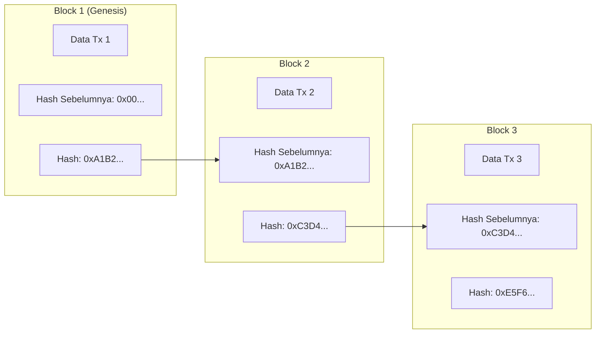
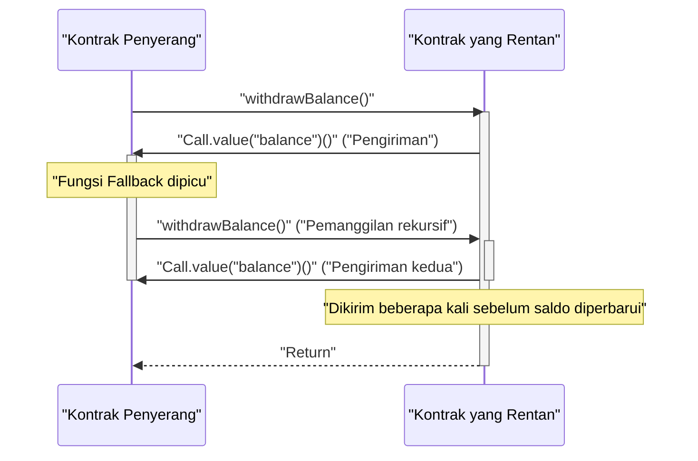

Di ekonomi digital modern, teknologi **blockchain** dan **smart contract** membawa transformasi disruptif ke berbagai industri, mulai dari keuangan hingga rantai pasokan dan manajemen identitas. Artikel ini akan membahas secara komprehensif dan mendalam mengenai prinsip dasar buku besar terdistribusi yang mendukungnya, latar belakang matematis dari algoritma konsensus, struktur internal Ethereum Virtual Machine (EVM), implementasi smart contract yang beroperasi di dunia nyata, serta kerentanan fatal yang tersembunyi di dalamnya.

## 1. Prinsip Dasar Blockchain dan Teknologi Buku Besar Terdistribusi (DLT)

Blockchain adalah sejenis **Teknologi Buku Besar Terdistribusi (Distributed Ledger Technology: DLT)** di mana seluruh peserta jaringan (node) berbagi dan memverifikasi data yang sama meskipun tanpa administrator terpusat, sehingga membuatnya sangat sulit untuk dimanipulasi.

### 1.1 Fungsi Hash dan Teknologi Kriptografi

Dasar dari keamanan blockchain adalah **fungsi hash** kriptografi. Fungsi hash adalah fungsi yang menghasilkan string dengan panjang tetap (nilai hash) dari data input dengan panjang berapapun, dan memiliki karakteristik berikut:

1. **Satu Arah (Pre-image Resistance)**: Sangat sulit untuk menghitung balik data asli dari nilai hash.
2. **Tahan Benturan (Collision Resistance)**: Sulit untuk menemukan dua data input berbeda yang memiliki nilai hash yang sama.
3. **Perubahan kecil pada input menghasilkan perubahan besar pada output (Efek Longsoran/Avalanche Effect)**.

Banyak blockchain seperti Bitcoin dan Ethereum mengadopsi algoritma hash seperti SHA-256 dan Keccak-256.

### 1.2 Mekanisme Ketahanan Manipulasi melalui Hash Chain

Dalam blockchain, transaksi (catatan transaksi) dalam periode tertentu dikumpulkan ke dalam "blok", yang kemudian dihubungkan seperti rantai (chain) seiring berjalannya waktu. Setiap blok dihasilkan dengan menyertakan nilai hash dari blok sebelumnya (**Previous Hash**). Struktur ini menghasilkan ketahanan manipulasi yang kuat yang disebut **hash chain**.

Diagram berikut menunjukkan bagaimana blok dihubungkan:



Misalkan sebuah node jahat memanipulasi data transaksi dari **Block 1** di masa lalu. Maka, berdasarkan sifat fungsi hash, nilai hash baru dari Block 1 akan berubah sepenuhnya dari `0xA1B2...` yang asli. Akibatnya, nilai tersebut tidak lagi cocok dengan `Prev Hash` yang tercatat di **Block 2**, sehingga merusak integritas rantai. Untuk mempertahankan integritas, nilai hash dari semua blok setelah blok yang dimanipulasi harus dihitung ulang. Dikombinasikan dengan algoritma konsensus seperti PoW yang dibahas kemudian, perhitungan ulang ini membutuhkan daya komputasi (biaya) yang astronomis, yang secara praktis membuat manipulasi menjadi tidak mungkin.

## 2. Eksplorasi Mendalam tentang Algoritma Konsensus

Karena tidak ada administrator terpusat di jaringan, algoritma untuk menyepakati (konsensus) antar node tentang "transaksi mana yang benar" dan "siapa yang akan menghasilkan blok berikutnya" sangat diperlukan. Ini menjadi kunci untuk menyelesaikan **Masalah Jenderal Bizantium (Byzantine Generals Problem)** dalam komputasi terdistribusi.

### 2.1 Proof of Work (PoW)

**Proof of Work (PoW)**, yang diadopsi oleh Bitcoin, adalah mekanisme untuk mendapatkan hak pembuatan blok (hak penambangan) dengan membuktikan jumlah komputasi (pekerjaan). Penambang (miner) memasukkan informasi header blok dan nilai acak yang disebut "Nonce" melalui fungsi hash, dan mencari nonce sedemikian rupa sehingga hasilnya lebih kecil dari "target" spesifik yang ditentukan oleh jaringan.

Hubungan antara target kesulitan $T$ dan nilai hash $H$ dinyatakan sebagai berikut:

$$
H(\text{Header Blok} \parallel \text{Nonce}) < T
$$

Di sini, $T$ disesuaikan secara berkala sesuai dengan hashrate (daya komputasi) jaringan, menjaga interval pembuatan blok (sekitar 10 menit untuk Bitcoin) tetap konstan.
Jika nilai hash direpresentasikan oleh bilangan bulat 256-bit, probabilitas menemukan hash yang memenuhi target $T$ adalah sebagai berikut:

$$
P = \frac{T}{2^{256}}
$$

Karena probabilitas memenuhi kondisi dalam satu perhitungan hash sangat rendah, penambang mengulangi perhitungan dengan metode brute-force. Hanya penambang yang memenangkan kompetisi perhitungan dengan mengkonsumsi energi besar yang dapat menambahkan blok baru dan mendapatkan imbalan (imbalan penambangan dan biaya transaksi). Agar penyerang dapat memanipulasi rantai, mereka harus menguasai lebih dari 51% daya komputasi dari seluruh jaringan (Serangan 51%), yang dalam kenyataannya akan memakan biaya sangat besar.

### 2.2 Proof of Stake (PoS)

**Proof of Stake (PoS)** dirancang untuk menyelesaikan beban lingkungan yang tinggi dan masalah skalabilitas dari PoW. Ethereum beralih dari PoW ke PoS melalui pembaruan "The Merge".

Dalam PoS, pembuat blok (validator) dipilih bukan berdasarkan komputasi, melainkan berdasarkan jumlah kepemilikan (jumlah stake) token asli jaringan (misalnya, ETH) atau periode penguncian.
Aset yang di-stake berfungsi sebagai jaminan (sasaran penalti, disebut slashing) jika validator melakukan kecurangan. Dengan demikian, keamanan dijamin oleh mekanisme insentif ekonomi: penyerang harus membeli token dalam jumlah besar untuk menyerang jaringan, dan jika serangan berhasil dan nilai token anjlok, aset mereka sendiri akan menjadi tidak berharga.

### 2.3 Practical Byzantine Fault Tolerance (PBFT)

**PBFT** sering diadopsi dalam blockchain tipe konsorsium atau privat (seperti Hyperledger Fabric).
PBFT adalah algoritma yang menjamin pencapaian konsensus yang benar bahkan jika kurang dari $1/3$ node dalam jaringan curang (kegagalan Bizantium). Status dikonfirmasi antar node melalui proses komunikasi 3 fase: Pre-prepare, Prepare, dan Commit, dimulai dari pemilihan node pemimpin. Tidak seperti finalitas probabilistik seperti PoW (kemungkinan untuk dibatalkan mendekati nol seiring berjalannya waktu), PBFT memiliki finalitas instan (finalitas absolut). Namun, ini tidak cocok untuk rantai publik dengan banyak node karena overhead komunikasi yang tinggi.

## 3. Smart Contract dan EVM (Ethereum Virtual Machine)

**Smart Contract** adalah program yang dieksekusi secara otomatis di blockchain ketika kondisi yang telah ditentukan terpenuhi. Ini mewujudkan konsep "Code is Law" (Kode adalah Hukum), memungkinkan eksekusi otomatis dari transaksi dan kontrak tanpa kepercayaan (trustless) tanpa perantara.

### 3.1 Arsitektur EVM

Lingkungan yang mengeksekusi smart contract di Ethereum adalah **EVM (Ethereum Virtual Machine)**. EVM adalah mesin virtual Turing-complete yang berjalan di semua node di jaringan, berfungsi sebagai "Mesin Transisi Status (State Transition Machine)" yang sangat besar.

$$
S_{t+1} = \Upsilon(S_t, T)
$$

Pada persamaan di atas, $S_t$ adalah status global Ethereum saat ini (saldo setiap akun dan penyimpanan kontrak), $T$ adalah transaksi, $\Upsilon$ adalah fungsi transisi status oleh EVM, dan $S_{t+1}$ mewakili status baru setelah eksekusi transaksi.

Struktur internal EVM terutama dibagi ke dalam area berikut:
- **[Stack](https://kenji.blog/id/p/c-language-pointers-memory-management-stack-heap/)**: Struktur data LIFO (Last-In-First-Out) dengan maksimum 1024 elemen. Ukuran word 256-bit. Menyimpan operan untuk berbagai operasi.
- **Memory**: Array byte volatil yang dipertahankan sementara hanya selama eksekusi transaksi.
- **Storage**: Area data persisten yang dialokasikan per kontrak. Terdiri dari database tipe key-value (256-bit ke 256-bit), dan operasi penulisan memiliki biaya gas yang tinggi.

## 4. Implementasi Smart Contract dengan Solidity

Smart contract biasanya ditulis dalam bahasa tingkat tinggi berorientasi objek yang disebut **Solidity**, lalu dikompilasi menjadi bytecode EVM dan di-deploy.

### 4.1 Contoh Implementasi Sistem Pemungutan Suara

Berikut adalah contoh kode Solidity yang menunjukkan struktur dasar dari sistem pemungutan suara terdistribusi yang aman.

```solidity
// SPDX-License-Identifier: MIT
pragma solidity ^0.8.0;

contract Voting {
    struct Proposal {
        string name;
        uint256 voteCount;
    }

    address public chairperson;
    mapping(address => bool) public hasVoted;
    Proposal[] public proposals;

    constructor(string[] memory proposalNames) {
        chairperson = msg.sender;
        for (uint i = 0; i < proposalNames.length; i++) {
            proposals.push(Proposal({
                name: proposalNames[i],
                voteCount: 0
            }));
        }
    }

    function vote(uint proposalIndex) public {
        require(!hasVoted[msg.sender], "Already voted.");
        require(proposalIndex < proposals.length, "Invalid proposal index.");

        hasVoted[msg.sender] = true;
        proposals[proposalIndex].voteCount += 1;
    }

    function winningProposal() public view returns (uint winningProposalIndex) {
        uint winningVoteCount = 0;
        for (uint p = 0; p < proposals.length; p++) {
            if (proposals[p].voteCount > winningVoteCount) {
                winningVoteCount = proposals[p].voteCount;
                winningProposalIndex = p;
            }
        }
    }
}
```

Dalam kode ini, `mapping` digunakan untuk mencegah pemungutan suara ganda, mewujudkan pemungutan suara dengan transparansi tinggi di atas blockchain yang tidak dapat diubah.

### 4.2 Standar Token ERC-20

Standar token **ERC-20** adalah dasar yang paling banyak digunakan untuk aset kripto (mata uang virtual). Dengan mengimplementasikan fungsi standar seperti `transfer`, `balanceOf`, `approve`, dan `transferFrom`, Anda dapat berintegrasi secara mulus dengan DEX (Bursa Terdesentralisasi) dan dompet.

## 5. Kerentanan dan Keamanan Smart Contract

Karena kode pada blockchain memiliki sifat tidak dapat diubah sehingga sulit dimodifikasi setelah di-deploy, bug atau kerentanan dalam kode secara langsung mengarah pada kebocoran dana (peretasan) yang fatal.

### 5.1 Serangan Reentrancy (Reentrancy Attack)

Penyebab "Insiden The DAO", insiden peretasan paling terkenal dalam sejarah Ethereum, adalah **Serangan Reentrancy**. Ini adalah serangan di mana, ketika mengirimkan Ether dari sebuah kontrak ke kontrak jahat eksternal, fungsi pengiriman dari kontrak asli dipanggil secara rekursif dari fungsi fallback kontrak jahat tersebut, menguras dana sebelum saldo diperbarui.

Diagram urutan berikut menunjukkan alur serangan Reentrancy.



#### Contoh Kode yang Rentan

```solidity
contract VulnerableBank {
    mapping(address => uint256) public balances;

    // Fungsi penarikan yang rentan
    function withdraw() public {
        uint256 bal = balances[msg.sender];
        require(bal > 0, "Insufficient balance");

        // Pengiriman Ether ke kontrak eksternal (serangan reentrancy terjadi di sini)
        (bool sent, ) = msg.sender.call{value: bal}("");
        require(sent, "Failed to send Ether");

        // Memperbarui saldo setelah pengiriman (terlalu lambat)
        balances[msg.sender] = 0;
    }
}
```

#### Contoh Kode yang Diperbaiki (Pola Checks-Effects-Interactions)

Praktik terbaik untuk mencegah Reentrancy adalah dengan menerapkan pola **Checks-Effects-Interactions**, yang memperbarui status (seperti saldo) sebelum melakukan pemanggilan eksternal, atau dengan menggunakan modifier `ReentrancyGuard` dari OpenZeppelin.

```solidity
contract SecureBank {
    mapping(address => uint256) public balances;

    // Fungsi penarikan yang telah diperbaiki
    function withdraw() public {
        uint256 bal = balances[msg.sender];
        require(bal > 0, "Insufficient balance");

        // 1. Checks: Konfirmasi kondisi (require di atas)
        // 2. Effects: Eksekusi pembaruan status terlebih dahulu
        balances[msg.sender] = 0;

        // 3. Interactions: Eksekusi pemanggilan ke luar pada bagian akhir
        (bool sent, ) = msg.sender.call{value: bal}("");
        require(sent, "Failed to send Ether");
    }
}
```

### 5.2 Kerentanan Lainnya

- **Overflow / Underflow**: Sebelum Solidity 0.8.0, ada kerentanan di mana nilai akan meluap (wrap around) jika perhitungan melebihi nilai maksimum atau minimum dari integer. Saat ini, hal tersebut telah dilindungi dan akan menghasilkan panic error di tingkat kompilator.
- **Front-running**: Transaksi blockchain sementara disimpan di kumpulan tunggu publik (Mempool). Penyerang memantau Mempool, menetapkan biaya gas yang lebih tinggi daripada transaksi target agar transaksi mereka diproses terlebih dahulu, dan meraup keuntungan (seperti pada Serangan Sandwich).

## 6. Kesimpulan

**Blockchain** dan **Smart Contract** membangun sistem buku besar terdistribusi tingkat lanjut yang menggabungkan ketahanan kriptografi dan insentif ekonomi. Pembentukan konsensus melalui PoW dan PoS mempertahankan jaringan trustless, dan EVM memungkinkan eksekusi program yang fleksibel di atasnya. Namun, fungsionalitas kuat dari smart contract disertai dengan risiko keamanan tingkat tinggi seperti Reentrancy, sehingga desain arsitektur yang kuat dan audit kode yang ketat sangat penting dalam pengembangannya. Kami berharap prinsip dan pengetahuan praktis yang dijelaskan dalam artikel ini dapat membantu pengembangan aplikasi terdesentralisasi (dApps) generasi berikutnya.
