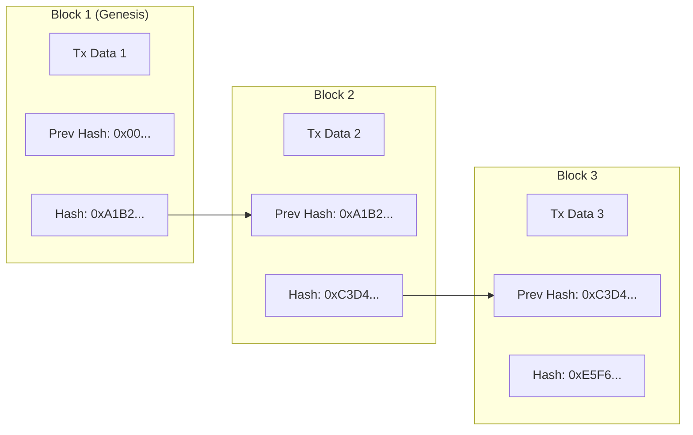
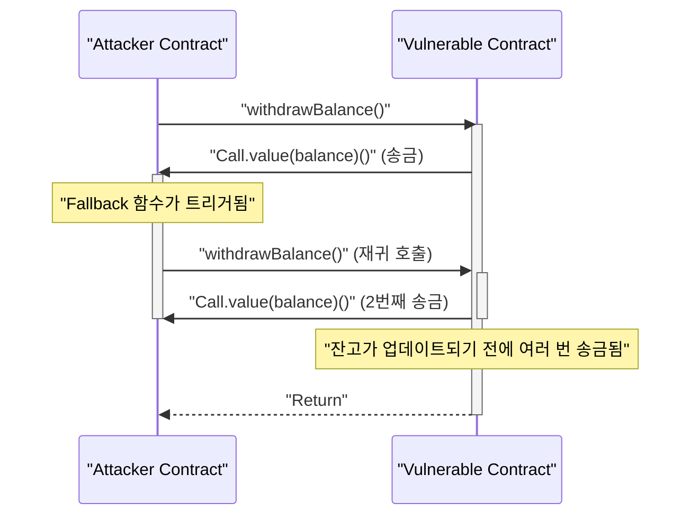

현대의 디지털 경제에서 **블록체인** 과 **스마트 컨트랙트** 기술은 금융에서부터 공급망, 신원 관리에 이르기까지 모든 산업에 파괴적인 혁신을 가져오고 있습니다. 본 기사에서는 이를 뒷받침하는 분산 원장의 근본 원리부터 합의 알고리즘의 수학적 배경, 이더리움 가상 머신(EVM)의 내부 구조, 그리고 실제 사회에서 작동하는 스마트 컨트랙트의 구현과 그 안에 숨겨진 치명적인 취약점까지 포괄적이고 깊이 있게 파헤쳐 설명합니다.

## 1. 블록체인의 근본 원리와 분산 원장 기술 (DLT)

블록체인은 중앙 집중적인 관리자가 존재하지 않아도 네트워크 참여자(노드) 전원이 동일한 데이터를 공유 및 검증하여 위조를 극히 어렵게 만드는 **분산 원장 기술 (Distributed Ledger Technology: DLT)** 의 일종입니다.

### 1.1 해시 함수와 암호 기술

블록체인 보안의 근간을 이루는 것이 암호학적 **해시 함수** 입니다. 해시 함수는 임의의 길이를 가진 입력 데이터로부터 고정된 길이의 문자열(해시값)을 출력하는 함수이며, 다음과 같은 특성을 가집니다.

1. **일방향성 (Pre-image Resistance)** : 해시값으로부터 원래 데이터를 역산하는 것이 극히 어려움.
2. **충돌 저항성 (Collision Resistance)** : 같은 해시값을 가지는 서로 다른 두 입력 데이터를 찾는 것이 어려움.
3. **약간의 입력 변화에도 출력이 크게 달라짐 (눈사태 효과)** .

비트코인이나 이더리움 등 많은 블록체인에서는 SHA-256이나 Keccak-256 같은 해시 알고리즘이 채택되어 있습니다.

### 1.2 해시 체인에 의한 위조 방지 원리

블록체인에서는 일정 기간 동안의 트랜잭션(거래 기록)을 묶은 '블록'을 시간 축을 따라 사슬(체인)처럼 연결해 나갑니다. 각 블록은 바로 앞 블록의 해시값( **Previous Hash** )을 포함하여 생성됩니다. 이 구조가 **해시 체인** 이라고 불리는 강력한 위조 방지 능력을 만들어냅니다.

다음 그림은 블록이 어떻게 연결되는지를 보여줍니다.



만약 악의적인 노드가 과거의 **Block 1** 의 트랜잭션 데이터를 조작했다고 가정해 봅시다. 그러면 해시 함수의 성질상 Block 1의 새로운 해시값은 원래의 `0xA1B2...`에서 전혀 다른 값으로 변합니다. 그 결과, **Block 2** 에 기록된 `Prev Hash`와 일치하지 않게 되어 체인의 무결성이 파괴됩니다. 무결성을 유지하려면 조작한 블록 이후의 모든 블록 해시값을 다시 계산해야 합니다. 후술할 PoW 등의 합의 알고리즘과 결합하면, 이 재계산에는 천문학적인 계산 능력(비용)이 필요해져 사실상 조작이 불가능해집니다.

## 2. 합의 알고리즘의 깊은 탐구

네트워크에 중앙 관리자가 없기 때문에 "어떤 트랜잭션이 올바른가", "다음 블록을 누가 생성할 것인가"를 노드 간에 합의(컨센서스)하기 위한 알고리즘이 필수적입니다. 이것이 분산 컴퓨팅에서 **비잔틴 장군 문제** 를 해결하기 위한 열쇠가 됩니다.

### 2.1 Proof of Work (PoW)

비트코인에서 채택된 **Proof of Work (PoW)** 는 계산량(작업)을 증명함으로써 블록 생성 권한(채굴권)을 얻는 방식입니다. 마이너(채굴자)는 블록 헤더 정보와 '논스(Nonce)'라는 무작위 값을 해시 함수에 통과시켜, 그 결과가 네트워크가 정한 특정 '타겟'보다 작아지게 하는 논스를 찾아냅니다.

이 난이도 타겟 $T$와 해시값 $H$의 관계는 다음과 같이 표현됩니다.

$$
H(\text{블록 헤더} \parallel \text{논스}) < T
$$

여기서 $T$는 네트워크의 해시레이트(계산력)에 따라 주기적으로 조정되어, 블록 생성 간격(비트코인의 경우 약 10분)을 일정하게 유지합니다.
해시값이 256비트 정수로 표현될 경우, 타겟 $T$를 만족하는 해시를 찾을 확률은 다음과 같습니다.

$$
P = \frac{T}{2^{256}}
$$

1회의 해시 계산으로 조건을 만족할 확률은 극히 낮기 때문에, 마이너는 무차별 대입(브루트 포스) 방식으로 계산을 반복합니다. 막대한 전력을 소비하여 계산 경쟁에서 이긴 마이너만이 새로운 블록을 추가하고 보상(채굴 보상 및 트랜잭션 수수료)을 얻을 수 있습니다. 공격자가 체인을 조작하려면 네트워크 전체 계산력의 51% 이상(51% 공격)을 지배해야 하며, 현실적으로 막대한 비용이 듭니다.

### 2.2 Proof of Stake (PoS)

PoW의 높은 환경 부하와 확장성 문제를 해결하기 위해 고안된 것이 **Proof of Stake (PoS)** 입니다. 이더리움은 "The Merge" 업데이트를 통해 PoW에서 PoS로 전환했습니다.

PoS에서는 계산량이 아닌 네트워크의 네이티브 토큰(예: ETH) 보유량(스테이킹 양)이나 락업 기간에 기반하여 블록 생성자(검증자)가 선출됩니다.
스테이킹된 자산은 검증자가 부정행위를 했을 경우 담보(페널티 대상, 슬래싱이라고 불림)가 됩니다. 이로 인해 공격자는 네트워크를 공격하기 위해 대량의 토큰을 매점해야 하며, 공격이 성공하여 토큰 가치가 폭락하면 자신의 자산도 무가치해진다는 경제적 인센티브 메커니즘을 통해 보안을 보장합니다.

### 2.3 Practical Byzantine Fault Tolerance (PBFT)

컨소시엄형이나 프라이빗형 블록체인(하이퍼레저 패브릭 등)에서 자주 채택되는 것이 **PBFT** 입니다.
PBFT는 네트워크 내 노드의 $1/3$ 미만이 부정(비잔틴 장애)을 저질러도 올바른 합의 형성을 보장하는 알고리즘입니다. 리더 노드 선출부터 Pre-prepare, Prepare, Commit의 3단계로 나뉜 통신 프로세스를 거쳐 노드 간에 상태를 확정짓습니다. PoW와 같은 확률적 완결성(번복될 가능성이 시간이 지남에 따라 한없이 0에 가까워짐)과는 달리 즉시 확정(절대적 완결성)을 갖는 것이 특징이지만, 통신 오버헤드가 크기 때문에 노드 수가 많은 퍼블릭 체인에는 부적합합니다.

## 3. 스마트 컨트랙트와 EVM (Ethereum Virtual Machine)

**스마트 컨트랙트** 란 미리 설정된 조건이 충족될 경우 자동으로 블록체인 상에서 실행되는 프로그램을 말합니다. "코드 이즈 로(Code is Law, 코드가 법이다)"라는 개념을 구현하여 중재자 없이 신뢰 불필요(Trustless) 환경에서의 거래나 계약의 자동 집행을 실현합니다.

### 3.1 EVM의 아키텍처

이더리움에서 스마트 컨트랙트를 실행하는 환경이 **EVM (Ethereum Virtual Machine)** 입니다. EVM은 네트워크 상의 모든 노드에서 가동되는 튜링 완전한 가상 머신이며, 거대한 "상태 전이 머신 (State Transition Machine)"으로 기능합니다.

$$
S_{t+1} = \Upsilon(S_t, T)
$$

위 수식에서 $S_t$는 현재 이더리움의 글로벌 상태(각 계정의 잔고나 컨트랙트의 스토리지), $T$는 트랜잭션, $\Upsilon$는 EVM에 의한 상태 전이 함수, 그리고 $S_{t+1}$은 트랜잭션 실행 후의 새로운 상태를 나타냅니다.

EVM의 내부 구조는 주로 다음 영역으로 나뉩니다.
- **스택 ([Stack](https://kenji.blog/ko/p/c-language-pointers-memory-management-stack-heap/))** : 최대 1024개 요소의 LIFO(후입선출) 데이터 구조. 256비트 길이의 워드 크기. 각종 연산의 피연산자를 유지합니다.
- **메모리 (Memory)** : 트랜잭션 실행 중에만 일시적으로 유지되는 휘발성 바이트 배열.
- **스토리지 (Storage)** : 컨트랙트별로 할당되는 영구적인 데이터 영역. 키-값 형식(256-bit to 256-bit)의 데이터베이스로 구성되어 있으며, 쓰기 작업에 높은 가스(수수료) 비용이 듭니다.

## 4. Solidity에 의한 스마트 컨트랙트 구현

스마트 컨트랙트는 보통 **Solidity** 라는 객체 지향형 고수준 언어로 작성되어, EVM 바이트 코드로 컴파일된 후 배포됩니다.

### 4.1 투표 시스템 구현 예시

다음은 안전한 분산형 투표 시스템의 기본 구조를 보여주는 Solidity 코드 예시입니다.

```solidity
// SPDX-License-Identifier: MIT
pragma solidity ^0.8.0;

contract Voting {
    struct Proposal {
        string name;
        uint256 voteCount;
    }

    address public chairperson;
    mapping(address => bool) public hasVoted;
    Proposal[] public proposals;

    constructor(string[] memory proposalNames) {
        chairperson = msg.sender;
        for (uint i = 0; i < proposalNames.length; i++) {
            proposals.push(Proposal({
                name: proposalNames[i],
                voteCount: 0
            }));
        }
    }

    function vote(uint proposalIndex) public {
        require(!hasVoted[msg.sender], "Already voted.");
        require(proposalIndex < proposals.length, "Invalid proposal index.");

        hasVoted[msg.sender] = true;
        proposals[proposalIndex].voteCount += 1;
    }

    function winningProposal() public view returns (uint winningProposalIndex) {
        uint winningVoteCount = 0;
        for (uint p = 0; p < proposals.length; p++) {
            if (proposals[p].voteCount > winningVoteCount) {
                winningVoteCount = proposals[p].voteCount;
                winningProposalIndex = p;
            }
        }
    }
}
```

이 코드에서는 `mapping`을 사용하여 이중 투표를 방지하고, 불변의 블록체인 상에서 투명성 높은 투표를 구현하고 있습니다.

### 4.2 ERC-20 토큰 표준

암호자산(가상화폐)의 기반으로 가장 많이 이용되는 것이 **ERC-20** 토큰 표준입니다. `transfer`나 `balanceOf`, `approve`, `transferFrom`과 같은 표준화된 함수를 구현함으로써, DEX(분산형 거래소)나 지갑과 원활하게 연동할 수 있습니다.

## 5. 스마트 컨트랙트의 취약점과 보안

블록체인 상의 코드는 한 번 배포하면 쉽게 수정할 수 없는 불변성을 가지기 때문에, 코드의 버그나 취약점은 치명적인 자금 유출(해킹)로 직결됩니다.

### 5.1 재진입 공격 (Reentrancy Attack)

이더리움 역사상 가장 유명한 해킹 사건인 'The DAO 사건'의 원인이 된 것이 **재진입 공격 (Reentrancy)** 입니다. 이는 컨트랙트에서 외부의 악의적인 컨트랙트로 Ether를 송금할 때, 악의적인 컨트랙트의 폴백(Fallback) 함수에서 원래 컨트랙트의 송금 함수를 재귀적으로 호출함으로써 잔고가 업데이트되기 전에 자금을 고갈시키는 공격입니다.

다음 시퀀스 다이어그램은 Reentrancy 공격의 흐름을 보여줍니다.



#### 취약한 코드 예시

```solidity
contract VulnerableBank {
    mapping(address => uint256) public balances;

    // 취약한 출금 함수
    function withdraw() public {
        uint256 bal = balances[msg.sender];
        require(bal > 0, "Insufficient balance");

        // 외부 컨트랙트로의 Ether 송금 (여기서 재진입 공격이 발생함)
        (bool sent, ) = msg.sender.call{value: bal}("");
        require(sent, "Failed to send Ether");

        // 송금 후 잔고를 업데이트하고 있음 (너무 늦음)
        balances[msg.sender] = 0;
    }
}
```

#### 대응된 코드 예시 (Checks-Effects-Interactions 패턴)

Reentrancy를 방지하기 위한 모범 사례는 외부 호출을 수행하기 전에 상태(잔고 등)를 업데이트하는 **Checks-Effects-Interactions** 패턴을 적용하거나, OpenZeppelin의 `ReentrancyGuard` 제어자를 사용하는 것입니다.

```solidity
contract SecureBank {
    mapping(address => uint256) public balances;

    // 대응된 출금 함수
    function withdraw() public {
        uint256 bal = balances[msg.sender];
        require(bal > 0, "Insufficient balance");

        // 1. Checks: 조건 확인 (위의 require)
        // 2. Effects: 상태 업데이트를 먼저 실행
        balances[msg.sender] = 0;

        // 3. Interactions: 외부로의 호출을 마지막에 실행
        (bool sent, ) = msg.sender.call{value: bal}("");
        require(sent, "Failed to send Ether");
    }
}
```

### 5.2 기타 취약점

- **오버플로우 / 언더플로우** : Solidity 0.8.0 이전에는 정수의 최대값·최소값을 초과하는 계산이 수행되면 값이 랩어라운드(Wrap-around)되는 취약점이 있었습니다. 현재는 컴파일러 수준에서 패닉 에러가 발생하도록 보호되고 있습니다.
- **프론트 러닝 (Front-running)** : 블록체인의 트랜잭션은 일시적으로 공개 대기 풀(Mempool)에 유지됩니다. 공격자는 Mempool을 모니터링하다가 대상 트랜잭션보다 높은 가스비를 설정하여 자신의 트랜잭션을 먼저 처리되게 함으로써 이익을 가로챕니다(샌드위치 공격 등).

## 6. 요약

**블록체인** 과 **스마트 컨트랙트** 는 암호학적인 견고함과 경제적 인센티브가 융합된 고도의 분산 원장 시스템을 구축합니다. PoW나 PoS를 통한 합의 형성은 신뢰가 필요 없는(Trustless) 네트워크를 유지하며, EVM은 그 위에서 유연한 프로그램의 실행을 가능하게 합니다. 하지만 스마트 컨트랙트의 강력한 기능에는 Reentrancy와 같은 고도의 보안 위험이 따르기 때문에, 개발에 있어서 견고한 아키텍처 설계와 엄격한 코드 감사가 필수적입니다. 본 기사에서 설명한 원리와 실천적인 지식이 차세대 분산형 애플리케이션(dApps) 개발에 도움이 되기를 바랍니다.
