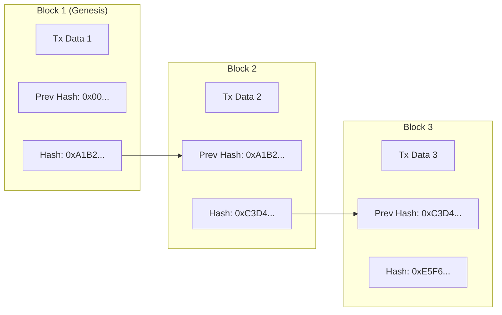
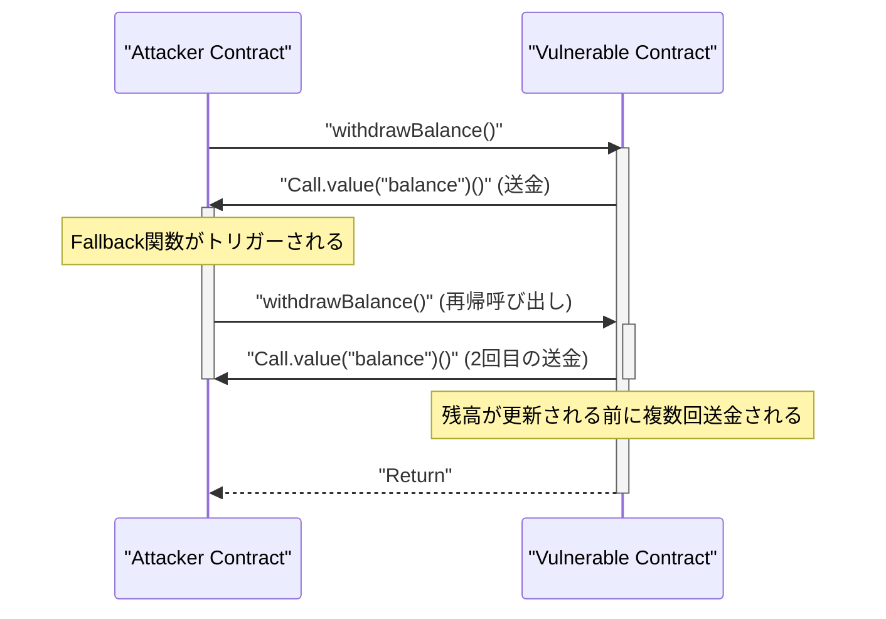

現代のデジタル経済において、 ** ブ[ロック](https://kenji.blog/p/rdbms-transaction-acid-isolation-level-lock/)チェーン ** と ** スマートコントラクト ** の技術は、金融からサプライチェーン、アイデンティティ管理に至るまで、あらゆる産業に破壊的な変革をもたらしています。本記事では、これらを支える分散型台帳の根本原理から、コンセンサスアルゴリズムの数学的背景、Ethereum Virtual Machine (EVM) の内部構造、そして実社会で稼働するスマートコントラクトの実装と、それらに潜む致命的な[脆弱性](https://kenji.blog/p/web-application-vulnerability-owasp-top-10/)までを網羅的かつ深く掘り下げて解説します。

## 1. ブ[ロック](https://kenji.blog/p/rdbms-transaction-acid-isolation-level-lock/)チェーンの根本原理と分散型台帳技術 (DLT)

ブロックチェーンは、中央集権的な管理者が存在せずとも、ネットワーク参加者（ノード）全員で同一のデータを共有・検証し、改ざんを極めて困難にする ** 分散型台帳技術 (Distributed Ledger Technology: DLT) ** の一種です。

### 1.1 ハッシュ関数と暗号技術

ブロックチェーンのセキュリティの根幹を成すのが、暗号学的 ** ハッシュ関数 ** です。ハッシュ関数は、任意の長さの入力データから固定長の文字列（ハッシュ値）を出力する関数であり、以下の特性を持ちます。

1. ** 一方向性 (Pre-image Resistance) ** ：ハッシュ値から元のデータを逆算することが極めて困難。
2. ** 衝突耐性 (Collision Resistance) ** ：同じハッシュ値を持つ異なる2つの入力データを見つけることが困難。
3. ** わずかな入力の変化で出力が大きく変わる (雪崩効果) ** 。

ビットコインやイーサリアムなど多くのブロックチェーンでは、SHA-256やKeccak-256といったハッシュアルゴリズムが採用されています。

### 1.2 ハッシュチェーンによる改ざん耐性の仕組み

ブロックチェーンでは、一定期間内の[トランザクション](https://kenji.blog/p/rdbms-transaction-acid-isolation-level-lock/)（取引記録）をまとめた「ブロック」を、時間軸に沿って鎖（チェーン）のようにつなげていきます。各ブロックは、一つ前のブロックのハッシュ値（ ** Previous Hash ** ）を含んで生成されます。この構造が ** ハッシュチェーン ** と呼ばれる強固な改ざん耐性を生み出します。

以下の図は、ブロックがどのように連結されるかを示しています。



もし悪意のあるノードが過去の ** Block 1 ** の[トランザクション](https://kenji.blog/p/rdbms-transaction-acid-isolation-level-lock/)データを改ざんしたとします。すると、ハッシュ関数の性質上、Block 1の新しいハッシュ値は元の `0xA1B2...` から全く別の値に変化します。その結果、 ** Block 2 ** に記録されている `Prev Hash` と一致しなくなり、チェーンの整合性が破壊されます。整合性を保つためには、改ざんしたブ[ロック](https://kenji.blog/p/rdbms-transaction-acid-isolation-level-lock/)以降のすべてのブロックのハッシュ値を再計算し直す必要があります。後述するPoWなどのコンセンサスアルゴリズムと組み合わせることで、この再計算には天文学的な計算能力（コスト）が必要となり、事実上改ざんは不可能となります。

## 2. コンセンサスアルゴリズムの深い探究

ネットワークに中央管理者がいないため、「どの[トランザクション](https://kenji.blog/p/rdbms-transaction-acid-isolation-level-lock/)が正しいか」「次のブロックを誰が生成するか」をノード間で合意（コンセンサス）するためのアルゴリズムが不可欠です。これが分散コンピューティングにおける ** [ビザンチン将軍問題](/p/byzantine-generals-problem/) ** を解決するための鍵となります。

### 2.1 Proof of Work (PoW)

ビットコインで採用されている ** Proof of Work (PoW) ** は、計算量（ワーク）を証明することでブロック生成権（マイニング権）を得る仕組みです。マイナー（採掘者）は、ブロックのヘッダー情報と「ナンス (Nonce)」と呼ばれるランダムな値をハッシュ関数に通し、その結果がネットワークが定めた特定の「ターゲット」より小さくなるようなナンスを探し求めます。

この難易度ターゲット $T$ とハッシュ値 $H$ の関係は次のように表されます。

$$
H(\text{Block Header} \parallel \text{Nonce}) < T
$$

ここで、$T$ はネットワークのハッシュレート（計算力）に応じて定期的に調整され、ブロック生成間隔（ビットコインの場合は約10分）を一定に保ちます。
ハッシュ値が256ビットの整数で表現される場合、ターゲット $T$ を満たすハッシュを見つける確率は以下の通りです。

$$
P = \frac{T}{2^{256}}
$$

1回のハッシュ計算で条件を満たす確率は極めて低いため、マイナーは総当たり戦（ブルートフォース）で計算を繰り返します。莫大な電力を消費して計算競争に勝ったマイナーのみが、新しいブロックを追加し、報酬（マイニング報酬と[トランザクション](/p/rdbms-transaction-acid-isolation-level-lock/)手数料）を得ることができます。攻撃者がチェーンを改ざんするには、ネットワーク全体の計算力の51%以上（51%攻撃）を支配する必要があり、現実的には莫大なコストがかかります。

### 2.2 Proof of Stake (PoS)

PoWの環境負荷の高さとスケーラビリティの課題を解決するために考案されたのが ** Proof of Stake (PoS) ** です。イーサリアムは "The Merge" アップデートにより、PoWからPoSへと移行しました。

PoSでは、計算量ではなく、ネットワークのネイティブトークン（例：ETH）の保有量（ステーク量）やロック期間に基づいて、ブロック生成者（バリデーター）が選出されます。
ステーキングされた資産は、バリデーターが不正を働いた場合の担保（ペナルティの対象、スラッシングと呼ばれる）となります。これにより、攻撃者はネットワークを攻撃するために大量のトークンを買い占める必要があり、攻撃が成功してトークン価値が暴落すれば自身の資産も無価値になるという経済的インセンティブのメカニズムによって、セキュリティを担保しています。

### 2.3 Practical Byzantine Fault Tolerance (PBFT)

コンソーシアム型やプライベート型のブロックチェーン（Hyperledger Fabricなど）でよく採用されるのが ** PBFT ** です。
PBFTは、ネットワーク内のノードの $1/3$ 未満が不正（ビザンチン障害）であっても、正しい合意形成を保証するアルゴリズムです。リーダーノードの選出から、Pre-prepare, Prepare, Commitの3フェーズに分かれた通信プロセスを経て、ノード間で状態を確定させます。PoWのような確率的なファイナリティ（覆る可能性が時間とともに限りなくゼロに近づく）とは異なり、即時確定（絶対的ファイナリティ）を持つのが特徴ですが、通信オーバーヘッドが大きいため、ノード数が多いパブリックチェーンには不向きです。

## 3. スマートコントラクトとEVM (Ethereum Virtual Machine)

** スマートコントラクト ** とは、あらかじめ設定された条件が満たされた場合に、自動的にブロックチェーン上で実行されるプログラムのことです。「コード・イズ・ロー（コードが法律である）」という概念を体現し、仲介者なしでトラストレスな取引や契約の自動執行を実現します。

### 3.1 EVMのアーキテクチャ

イーサリアムにおいてスマートコントラクトを実行する環境が ** EVM (Ethereum Virtual Machine) ** です。EVMは、ネットワーク上のすべてのノードで稼働する、チューリング完全な仮想マシンであり、巨大な「状態遷移マシン (State Transition Machine)」として機能します。

$$
S_{t+1} = \Upsilon(S_t, T)
$$

上記の式において、$S_t$ は現在のイーサリアムのグローバルな状態（各アカウントの残高やコントラクトのストレージ）、$T$ は[トランザクション](/p/rdbms-transaction-acid-isolation-level-lock/)、$\Upsilon$ はEVMによる状態遷移関数、そして $S_{t+1}$ は[トランザクション](/p/rdbms-transaction-acid-isolation-level-lock/)実行後の新しい状態を示します。

EVMの内部構造は、主に以下の領域に分かれています。
- ** [スタック](https://kenji.blog/p/c-language-pointers-memory-management-stack-heap/) ([Stack](https://kenji.blog/p/c-language-pointers-memory-management-stack-heap/)) ** : 最大1024要素のLIFO（後入れ先出し）データ構造。256ビット長のワードサイズ。各種演算のオペランドを保持します。
- ** メモリ (Memory) ** : [トランザクション](/p/rdbms-transaction-acid-isolation-level-lock/)実行中のみ一時的に保持される揮発性のバイト配列。
- ** ストレージ (Storage) ** : コントラクトごとに割り当てられる永続的なデータ領域。キー・バリュー型（256-bit to 256-bit）のデータベースで構成されており、書き込み操作に高いガス（手数料）コストがかかります。

## 4. Solidityによるスマートコントラクトの実装

スマートコントラクトは、通常 ** Solidity ** という[オブジェクト指向](https://kenji.blog/p/object-oriented-programming-oop-solid-principles/)型の高級言語で記述され、EVMのバイトコードにコンパイルされてデプロイされます。

### 4.1 投票システムの実装例

以下は、安全な分散型投票システムの基本構造を示すSolidityのコード例です。

```solidity
// SPDX-License-Identifier: MIT
pragma solidity ^0.8.0;

contract Voting {
    struct Proposal {
        string name;
        uint256 voteCount;
    }

    address public chairperson;
    mapping(address => bool) public hasVoted;
    Proposal[] public proposals;

    constructor(string[] memory proposalNames) {
        chairperson = msg.sender;
        for (uint i = 0; i < proposalNames.length; i++) {
            proposals.push(Proposal({
                name: proposalNames[i],
                voteCount: 0
            }));
        }
    }

    function vote(uint proposalIndex) public {
        require(!hasVoted[msg.sender], "Already voted.");
        require(proposalIndex < proposals.length, "Invalid proposal index.");

        hasVoted[msg.sender] = true;
        proposals[proposalIndex].voteCount += 1;
    }

    function winningProposal() public view returns (uint winningProposalIndex) {
        uint winningVoteCount = 0;
        for (uint p = 0; p < proposals.length; p++) {
            if (proposals[p].voteCount > winningVoteCount) {
                winningVoteCount = proposals[p].voteCount;
                winningProposalIndex = p;
            }
        }
    }
}
```

このコードでは、`mapping` を用いて二重投票を防ぎ、不変のブ[ロック](https://kenji.blog/p/rdbms-transaction-acid-isolation-level-lock/)チェーン上で透明性の高い投票を実現しています。

### 4.2 ERC-20トークン標準

暗号資産（仮想通貨）の基盤として最も利用されているのが ** ERC-20 ** トークン標準です。`transfer` や `balanceOf`、`approve`、`transferFrom` といった標準化された関数を実装することで、DEX（分散型取引所）やウォレットとシームレスに連携できます。

## 5. スマートコントラクトの[脆弱性](https://kenji.blog/p/web-application-vulnerability-owasp-top-10/)とセキュリティ

ブ[ロック](https://kenji.blog/p/rdbms-transaction-acid-isolation-level-lock/)チェーン上のコードは一度デプロイすると簡単に修正できない[不変性](https://kenji.blog/p/functional-programming-concepts-pure-functions-monads/)を持つため、コードのバグや脆弱性は致命的な資金流出（ハッキング）に直結します。

### 5.1 再入攻撃 (Reentrancy Attack)

Ethereum史上最も有名なハッキング事件「The DAO事件」の原因となったのが ** 再入攻撃 (Reentrancy) ** です。これは、コントラクトから外部の悪意あるコントラクトへEtherを送金する際、悪意あるコントラクトのフォールバック関数から、元のコントラクトの送金関数を再帰的に呼び出すことで、残高が更新される前に資金を枯渇させる攻撃です。

以下のシーケンス図は、Reentrancy攻撃の流れを示しています。



#### 脆弱なコード例

```solidity
contract VulnerableBank {
    mapping(address => uint256) public balances;

    // 脆弱な出金関数
    function withdraw() public {
        uint256 bal = balances[msg.sender];
        require(bal > 0, "Insufficient balance");

        // 外部コントラクトへのEther送金（ここで再入攻撃が起こる）
        (bool sent, ) = msg.sender.call{value: bal}("");
        require(sent, "Failed to send Ether");

        // 送金後に残高を更新している（遅すぎる）
        balances[msg.sender] = 0;
    }
}
```

#### 対策済みのコード例 (Checks-Effects-Interactionsパターン)

Reentrancyを防ぐためのベストプラクティスは、外部呼び出しを行う前に状態（残高など）を更新する ** Checks-Effects-Interactions ** パターンを適用すること、あるいはOpenZeppelinの `ReentrancyGuard` 修飾子を使用することです。

```solidity
contract SecureBank {
    mapping(address => uint256) public balances;

    // 対策済みの出金関数
    function withdraw() public {
        uint256 bal = balances[msg.sender];
        require(bal > 0, "Insufficient balance");

        // 1. Checks: 条件確認 (上記 require)
        // 2. Effects: 状態の更新を先に実行
        balances[msg.sender] = 0;

        // 3. Interactions: 外部への呼び出しを最後に実行
        (bool sent, ) = msg.sender.call{value: bal}("");
        require(sent, "Failed to send Ether");
    }
}
```

### 5.2 その他の[脆弱性](https://kenji.blog/p/web-application-vulnerability-owasp-top-10/)

- ** オーバーフロー / アンダーフロー ** : Solidity 0.8.0以前では、整数の最大値・最小値を超えた計算が行われると値がラップアラウンドする脆弱性がありました。現在ではコンパイラレベルでパニックエラーとなるよう保護されています。
- ** フロントランニング (Front-running) ** : ブ[ロック](https://kenji.blog/p/rdbms-transaction-acid-isolation-level-lock/)チェーンの[トランザクション](https://kenji.blog/p/rdbms-transaction-acid-isolation-level-lock/)は一時的に公開の待機プール（Mempool）に保持されます。攻撃者はMempoolを監視し、ターゲットの[トランザクション](/p/rdbms-transaction-acid-isolation-level-lock/)よりも高いガス代を設定して自身の[トランザクション](/p/rdbms-transaction-acid-isolation-level-lock/)を先に処理させ、利益をかすめ取ります（サンドイッチ攻撃など）。

## 6. まとめ

** ブロックチェーン ** と ** スマートコントラクト ** は、暗号学的な堅牢性と経済的インセンティブが融合した高度な分散型台帳システムを構築します。PoWやPoSによるコンセンサス形成はトラストレスなネットワークを維持し、EVMはその上で柔軟なプログラムの実行を可能にします。しかし、スマートコントラクトの強力な機能には、Reentrancyのような高度なセキュリティリスクが伴うため、開発においては堅牢なアーキテクチャ設計と厳密なコード監査が不可欠です。本記事で解説した原理と実践的な知識が、次世代の分散型アプリケーション（dApps）開発の一助となれば幸いです。
