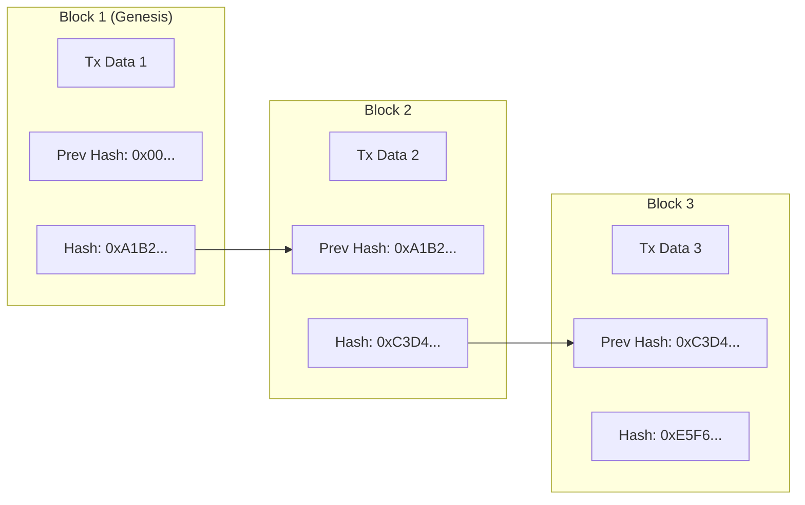
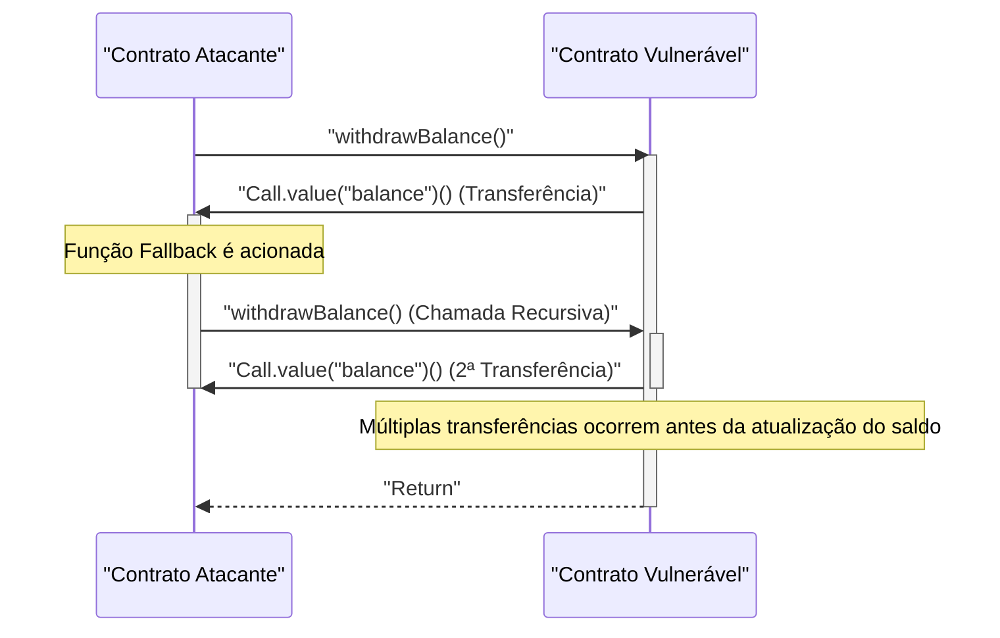

Na economia digital moderna, as tecnologias de ** blockchain ** e ** smart contracts ** estão trazendo transformações disruptivas para todas as indústrias, desde finanças até cadeias de suprimentos e gerenciamento de identidade. Neste artigo, exploraremos de forma abrangente e profunda os princípios fundamentais da tecnologia de ledger distribuído que as sustenta, os fundamentos matemáticos dos algoritmos de consenso, a estrutura interna da Ethereum Virtual Machine (EVM), a implementação de smart contracts operando no mundo real e as vulnerabilidades fatais que se escondem neles.

## 1. Princípios Fundamentais da Blockchain e Tecnologia de Ledger Distribuído (DLT)

A blockchain é um tipo de ** Tecnologia de Ledger Distribuído (Distributed Ledger Technology: DLT) ** onde, mesmo sem um administrador centralizado, todos os participantes da rede (nós) compartilham e verificam os mesmos dados, tornando a adulteração extremamente difícil.

### 1.1 Funções Hash e Criptografia

A base da segurança da blockchain é a ** função hash ** criptográfica. Uma função hash é uma função que produz uma string de comprimento fixo (valor de hash) a partir de dados de entrada de qualquer tamanho, e possui as seguintes características:

1. ** Resistência à Preimagem (Pre-image Resistance) **: É extremamente difícil calcular os dados originais a partir de um valor de hash.
2. ** Resistência à Colisão (Collision Resistance) **: É difícil encontrar dois dados de entrada diferentes que tenham o mesmo valor de hash.
3. ** Uma pequena alteração na entrada muda significativamente a saída (Efeito Avalanche) **.

Muitas blockchains, como Bitcoin e Ethereum, adotam algoritmos de hash como SHA-256 e Keccak-256.

### 1.2 Mecanismo de Resistência a Adulteração por Hash Chain

Na blockchain, transações (registros de negociação) dentro de um certo período são agrupadas em um "bloco" e conectadas como uma cadeia (chain) ao longo do tempo. Cada bloco é gerado incluindo o valor de hash do bloco anterior ( ** Previous Hash ** ). Esta estrutura cria uma forte resistência à adulteração chamada ** hash chain **.

O diagrama a seguir mostra como os blocos são conectados.



Se um nó malicioso alterar os dados de transação anteriores do ** Block 1 **, pela natureza da função hash, o novo valor de hash do Block 1 mudará de `0xA1B2...` para um valor completamente diferente. Como resultado, não coincidirá mais com o `Prev Hash` registrado no ** Block 2 **, destruindo a consistência da cadeia. Para manter a consistência, é necessário recalcular todos os valores de hash dos blocos subsequentes ao bloco adulterado. Ao combinar isso com algoritmos de consenso como o PoW (descrito abaixo), esse recálculo exige uma capacidade computacional astronômica (custo), tornando a adulteração praticamente impossível.

## 2. Exploração Profunda dos Algoritmos de Consenso

Como não há um administrador central na rede, um algoritmo para que os nós concordem (consenso) sobre "quais transações estão corretas" e "quem irá gerar o próximo bloco" é essencial. Essa é a chave para resolver o ** Problema dos Generais Bizantinos ** na computação distribuída.

### 2.1 Proof of Work (PoW)

O ** Proof of Work (PoW) **, adotado no Bitcoin, é um mecanismo para obter o direito de geração de blocos (direito de mineração) provando o volume de cálculos (trabalho). Os mineradores passam as informações do cabeçalho do bloco e um valor aleatório chamado "Nonce" pela função hash e buscam um Nonce que resulte em um valor menor que um determinado "alvo" definido pela rede.

A relação entre este alvo de dificuldade $T$ e o valor de hash $H$ é expressa da seguinte forma:

$$
H(\text{Cabeçalho do Bloco} \parallel \text{Nonce}) < T
$$

Aqui, $T$ é ajustado regularmente de acordo com o hashrate (poder de computação) da rede para manter o intervalo de geração de blocos (cerca de 10 minutos para o Bitcoin) constante.
Quando o valor de hash é representado por um número inteiro de 256 bits, a probabilidade de encontrar um hash que satisfaça o alvo $T$ é a seguinte:

$$
P = \frac{T}{2^{256}}
$$

Como a probabilidade de satisfazer a condição em um único cálculo de hash é extremamente baixa, os mineradores repetem os cálculos usando força bruta. Apenas o minerador que vence a competição de cálculo, consumindo uma quantidade enorme de energia elétrica, pode adicionar um novo bloco e ganhar a recompensa (recompensa de mineração e taxas de transação). Para um invasor adulterar a cadeia, ele precisaria controlar mais de 51% do poder computacional de toda a rede (ataque de 51%), o que, de forma realista, custa uma quantidade enorme de dinheiro.

### 2.2 Proof of Stake (PoS)

Para resolver os problemas de alta carga ambiental e escalabilidade do PoW, foi idealizado o ** Proof of Stake (PoS) **. O Ethereum mudou de PoW para PoS através da atualização "The Merge".

No PoS, os geradores de blocos (validadores) são selecionados não com base no volume de cálculos, mas com base na quantidade de posse (quantidade de stake) e período de bloqueio do token nativo da rede (ex: ETH).
Os ativos em stake servem como garantia (sujeitos a penalidade, chamada de slashing) caso o validador aja de má fé. Com isso, os invasores precisariam comprar uma grande quantidade de tokens para atacar a rede, e se o ataque fosse bem sucedido e o valor do token despencasse, seus próprios ativos também se tornariam sem valor; esse mecanismo de incentivo econômico garante a segurança.

### 2.3 Practical Byzantine Fault Tolerance (PBFT)

O ** PBFT ** é frequentemente adotado em blockchains de consórcio ou privados (como o Hyperledger Fabric).
O PBFT é um algoritmo que garante a formação correta de consenso mesmo que menos de $1/3$ dos nós na rede sejam maliciosos (falha bizantina). A partir da seleção de um nó líder, ele passa por um processo de comunicação dividido em três fases: Pre-prepare, Prepare e Commit, para confirmar o estado entre os nós. Ao contrário da finalidade probabilística como no PoW (onde a probabilidade de ser revertido se aproxima de zero com o tempo), ele é caracterizado por ter confirmação imediata (finalidade absoluta), mas devido à grande sobrecarga de comunicação, é inadequado para blockchains públicos com um grande número de nós.

## 3. Smart Contracts e EVM (Ethereum Virtual Machine)

** Smart Contracts ** são programas executados automaticamente na blockchain quando condições pré-definidas são atendidas. Eles incorporam o conceito de "o código é a lei (code is law)" e realizam execução automática de negociações e contratos sem intermediários (trustless).

### 3.1 Arquitetura da EVM

O ambiente que executa smart contracts no Ethereum é a ** EVM (Ethereum Virtual Machine) **. A EVM é uma máquina virtual Turing-completa que roda em todos os nós da rede e funciona como uma gigante "Máquina de Transição de Estado (State Transition Machine)".

$$
S_{t+1} = \Upsilon(S_t, T)
$$

Na equação acima, $S_t$ é o estado global atual do Ethereum (saldos de cada conta e armazenamento de contratos), $T$ é uma transação, $\Upsilon$ é a função de transição de estado pela EVM e $S_{t+1}$ indica o novo estado após a execução da transação.

A estrutura interna da EVM é dividida principalmente nas seguintes áreas:
- ** Pilha ([Stack](https://kenji.blog/pt/p/c-language-pointers-memory-management-stack-heap/)) **: Estrutura de dados LIFO (o último a entrar é o primeiro a sair) com no máximo 1024 elementos. Tamanho de palavra de 256 bits. Mantém os operandos de várias operações.
- ** Memória (Memory) **: Um array de bytes volátil mantido temporariamente apenas durante a execução de uma transação.
- ** Armazenamento (Storage) **: Área de dados persistente alocada para cada contrato. É composto por um banco de dados chave-valor (256 bits para 256 bits), e as operações de escrita incorrem em altos custos de gas (taxas).

## 4. Implementação de Smart Contracts em Solidity

Smart contracts são geralmente escritos em uma linguagem de alto nível orientada a objetos chamada ** Solidity **, compilados para bytecode da EVM e depois implantados.

### 4.1 Exemplo de Implementação de Sistema de Votação

Abaixo está um exemplo de código Solidity mostrando a estrutura básica de um sistema de votação descentralizado seguro.

```solidity
// SPDX-License-Identifier: MIT
pragma solidity ^0.8.0;

contract Voting {
    struct Proposal {
        string name;
        uint256 voteCount;
    }

    address public chairperson;
    mapping(address => bool) public hasVoted;
    Proposal[] public proposals;

    constructor(string[] memory proposalNames) {
        chairperson = msg.sender;
        for (uint i = 0; i < proposalNames.length; i++) {
            proposals.push(Proposal({
                name: proposalNames[i],
                voteCount: 0
            }));
        }
    }

    function vote(uint proposalIndex) public {
        require(!hasVoted[msg.sender], "Already voted.");
        require(proposalIndex < proposals.length, "Invalid proposal index.");

        hasVoted[msg.sender] = true;
        proposals[proposalIndex].voteCount += 1;
    }

    function winningProposal() public view returns (uint winningProposalIndex) {
        uint winningVoteCount = 0;
        for (uint p = 0; p < proposals.length; p++) {
            if (proposals[p].voteCount > winningVoteCount) {
                winningVoteCount = proposals[p].voteCount;
                winningProposalIndex = p;
            }
        }
    }
}
```

Neste código, o `mapping` é usado para evitar votos duplos, realizando uma votação altamente transparente em uma blockchain imutável.

### 4.2 Padrão de Token ERC-20

O padrão de token mais utilizado como base para criptoativos (criptomoedas) é o padrão ** ERC-20 **. Ao implementar funções padronizadas como `transfer`, `balanceOf`, `approve` e `transferFrom`, ele pode se integrar perfeitamente a DEXs (exchanges descentralizadas) e carteiras.

## 5. Vulnerabilidades e Segurança de Smart Contracts

Como o código na blockchain tem a propriedade da imutabilidade e não pode ser facilmente modificado uma vez implantado, bugs e vulnerabilidades no código levam diretamente a vazamentos fatais de fundos (hacks).

### 5.1 Ataque de Reentrada (Reentrancy Attack)

A causa do incidente de hack mais famoso da história do Ethereum, o "Incidente The DAO", foi um ** Ataque de Reentrada (Reentrancy) **. Trata-se de um ataque onde, ao transferir Ether do contrato para um contrato malicioso externo, a função de transferência do contrato original é chamada recursivamente a partir da função de fallback do contrato malicioso, drenando os fundos antes que o saldo seja atualizado.

O diagrama de sequência a seguir mostra o fluxo do ataque de Reentrancy.



#### Exemplo de Código Vulnerável

```solidity
contract VulnerableBank {
    mapping(address => uint256) public balances;

    // Função de saque vulnerável
    function withdraw() public {
        uint256 bal = balances[msg.sender];
        require(bal > 0, "Insufficient balance");

        // Transferência de Ether para contrato externo (o ataque de reentrada ocorre aqui)
        (bool sent, ) = msg.sender.call{value: bal}("");
        require(sent, "Failed to send Ether");

        // Atualização do saldo ocorre após a transferência (tarde demais)
        balances[msg.sender] = 0;
    }
}
```

#### Exemplo de Código Corrigido (Padrão Checks-Effects-Interactions)

A melhor prática para prevenir Reentrancy é aplicar o padrão ** Checks-Effects-Interactions **, que atualiza o estado (como saldo) antes de fazer uma chamada externa, ou usar o modificador `ReentrancyGuard` da OpenZeppelin.

```solidity
contract SecureBank {
    mapping(address => uint256) public balances;

    // Função de saque corrigida
    function withdraw() public {
        uint256 bal = balances[msg.sender];
        require(bal > 0, "Insufficient balance");

        // 1. Checks: Confirmação de condição (require acima)
        // 2. Effects: Executa a atualização de estado primeiro
        balances[msg.sender] = 0;

        // 3. Interactions: Executa a chamada externa por último
        (bool sent, ) = msg.sender.call{value: bal}("");
        require(sent, "Failed to send Ether");
    }
}
```

### 5.2 Outras Vulnerabilidades

- ** Overflow / Underflow **: Antes do Solidity 0.8.0, havia uma vulnerabilidade de wraparound de valor quando cálculos excediam os valores máximos ou mínimos dos números inteiros. Agora é protegido por erros de pânico (panic errors) a nível de compilador.
- ** Front-running **: Transações de blockchain são mantidas temporariamente em um pool de espera público (Mempool). O invasor monitora o Mempool, define um preço de gás mais alto do que a transação alvo para que sua transação seja processada primeiro e lucra com isso (ataques sanduíche, etc.).

## 6. Conclusão

A tecnologia de ** blockchain ** e os ** smart contracts ** constroem um sistema de ledger distribuído avançado que funde robustez criptográfica e incentivos econômicos. A formação de consenso por PoW ou PoS mantém uma rede trustless, e a EVM permite a execução flexível de programas em cima dela. No entanto, as funcionalidades poderosas dos smart contracts vêm acompanhadas de altos riscos de segurança, como Reentrancy, tornando projetos de arquitetura robusta e auditorias de código rigorosas indispensáveis durante o desenvolvimento. Esperamos que os princípios e o conhecimento prático explicados neste artigo o ajudem no desenvolvimento de aplicações descentralizadas (dApps) de próxima geração.
