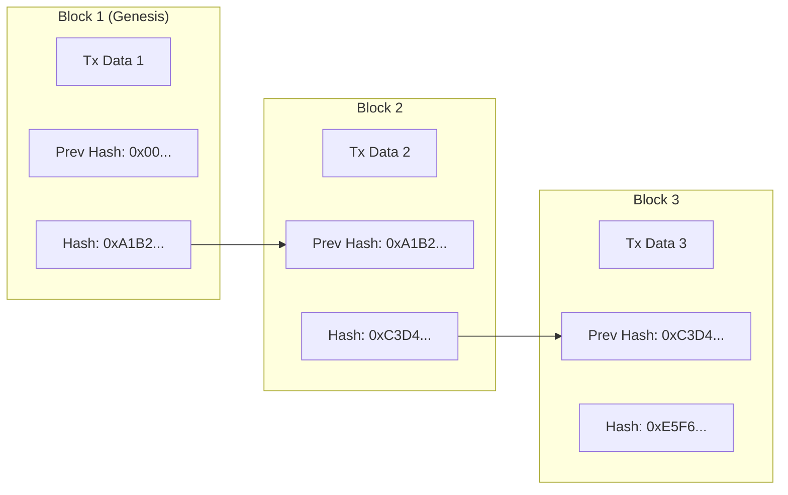
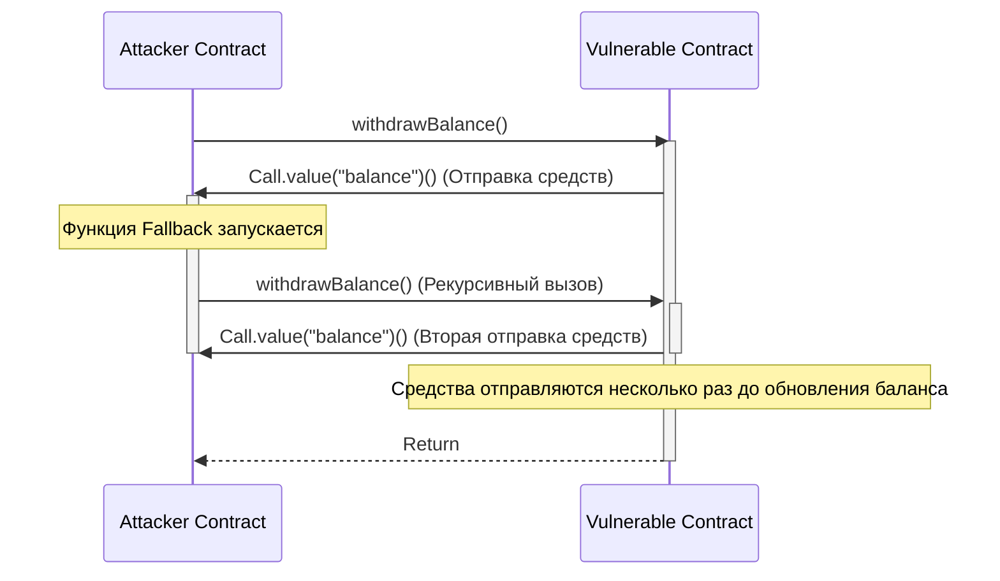

В современной цифровой экономике технологии ** блокчейн ** и ** смарт-контрактов ** вносят разрушительные изменения в любую отрасль, начиная от финансов и цепочек поставок и заканчивая управлением идентификацией. В этой статье мы всесторонне и глубоко рассмотрим фундаментальные принципы распределенного реестра, поддерживающего их, математическую подоплеку алгоритмов консенсуса, внутреннюю структуру Ethereum Virtual Machine (EVM), а также реализацию смарт-контрактов, работающих в реальном мире, и фатальные уязвимости, которые могут в них скрываться.

## 1. Фундаментальные принципы блокчейна и технология распределенного реестра (DLT)

Блокчейн — это разновидность ** технологии распределенного реестра (Distributed Ledger Technology: DLT) **, при которой все участники сети (узлы) совместно используют и проверяют одни и те же данные, даже при отсутствии централизованного администратора, что делает подделку данных крайне сложной задачей.

### 1.1 Хеш-функции и криптография

Основой безопасности блокчейна является криптографическая ** хеш-функция **. Хеш-функция — это функция, которая выводит строку фиксированной длины (хеш-значение) из входных данных произвольной длины, и обладает следующими характеристиками:

1. ** Необратимость (Pre-image Resistance) **: крайне сложно восстановить исходные данные из хеш-значения.
2. ** Устойчивость к коллизиям (Collision Resistance) **: сложно найти два разных входных данных, имеющих одно и то же хеш-значение.
3. ** Небольшое изменение на входе приводит к сильному изменению на выходе (Лавинный эффект) **.

Во многих блокчейнах, таких как Bitcoin и Ethereum, используются алгоритмы хеширования, такие как SHA-256 и Keccak-256.

### 1.2 Механизм защиты от подделки с помощью хеш-цепочки

В блокчейне транзакции (записи о сделках) за определенный период времени объединяются в "блок" и связываются друг с другом в виде цепи (цепочки) вдоль оси времени. Каждый блок генерируется, включая хеш-значение предыдущего блока (** Previous Hash **). Эта структура создает надежную защиту от подделки, которая называется ** хеш-цепочкой **.

Следующая диаграмма показывает, как блоки связаны друг с другом.



Предположим, что вредоносный узел подделал данные транзакции из прошлого ** Block 1 **. Тогда, из-за природы хеш-функции, новое хеш-значение Block 1 изменится с исходного `0xA1B2...` на совершенно другое значение. В результате оно больше не будет совпадать с `Prev Hash`, записанным в ** Block 2 **, и целостность цепочки будет нарушена. Чтобы сохранить целостность, необходимо пересчитать хеш-значения всех блоков, начиная с измененного блока. В сочетании с алгоритмами консенсуса, такими как PoW, которые будут описаны позже, этот перерасчет потребует астрономической вычислительной мощности (затрат), что делает подделку практически невозможной.

## 2. Глубокое изучение алгоритмов консенсуса

Поскольку в сети нет центрального администратора, необходим алгоритм, с помощью которого узлы могут прийти к соглашению (консенсусу) о том, «какая транзакция правильная» и «кто будет генерировать следующий блок». Это является ключом к решению ** Задачи византийских генералов ** в распределенных вычислениях.

### 2.1 Proof of Work (PoW)

** Proof of Work (PoW) **, принятый в Bitcoin, — это механизм получения права на создание блоков (права на майнинг) путем доказательства объема вычислений (работы). Майнеры (добытчики) пропускают информацию заголовка блока и случайное значение, называемое "нонс (Nonce)", через хеш-функцию, и ищут такой нонс, результат которого будет меньше определенной "цели (Target)", установленной сетью.

Зависимость между этой целью сложности $T$ и хеш-значением $H$ выражается следующим образом:

$$
H(\text{Заголовок блока} \parallel \text{Нонс}) < T
$$

Здесь $T$ периодически корректируется в зависимости от хешрейта (вычислительной мощности) сети, чтобы поддерживать постоянный интервал генерации блоков (около 10 минут в случае Bitcoin).
Если хеш-значение представлено как 256-битное целое число, вероятность нахождения хеша, удовлетворяющего цели $T$, выглядит следующим образом:

$$
P = \frac{T}{2^{256}}
$$

Поскольку вероятность выполнения условия за одно вычисление хеша крайне мала, майнеры повторяют вычисления методом полного перебора (brute-force). Только майнер, выигравший вычислительную гонку с потреблением огромного количества электроэнергии, может добавить новый блок и получить вознаграждение (вознаграждение за майнинг и комиссию за транзакции). Чтобы злоумышленник мог подделать цепочку, он должен контролировать 51% или более вычислительной мощности всей сети (атака 51%), что в реальности сопряжено с колоссальными затратами.

### 2.2 Proof of Stake (PoS)

Для решения проблем высокой экологической нагрузки и масштабируемости PoW был разработан ** Proof of Stake (PoS) **. С обновлением "The Merge" Ethereum перешел с PoW на PoS.

В PoS создатели блоков (валидаторы) выбираются не на основе вычислительной мощности, а на основе количества собственных токенов сети (например, ETH), которыми они владеют (стейк), и периода их блокировки.
Застейканные активы служат залогом (субъектом штрафа, называемого слэшингом) на случай недобросовестных действий валидатора. В результате безопасность гарантируется экономическим механизмом стимулов: злоумышленнику пришлось бы скупить огромное количество токенов для атаки на сеть, и если атака увенчается успехом и стоимость токена рухнет, его собственные активы также станут бесполезными.

### 2.3 Practical Byzantine Fault Tolerance (PBFT)

** PBFT ** часто используется в консорциумных и приватных блокчейнах (например, Hyperledger Fabric).
PBFT — это алгоритм, который гарантирует правильное достижение консенсуса, даже если менее $1/3$ узлов в сети являются вредоносными (византийский отказ). Состояние определяется между узлами через процесс связи, который разделен на 3 фазы: Pre-prepare, Prepare и Commit, после выбора узла-лидера. В отличие от вероятностной финализации, как в PoW (где вероятность отмены стремится к нулю со временем), он характеризуется немедленной финализацией (абсолютной финализацией), но из-за больших накладных расходов на связь он не подходит для публичных сетей с большим количеством узлов.

## 3. Смарт-контракты и EVM (Ethereum Virtual Machine)

** Смарт-контракт ** — это программа, которая автоматически выполняется в блокчейне при выполнении заранее заданных условий. Он воплощает концепцию «код есть закон» (Code is Law) и реализует бездоверительные транзакции и автоматическое исполнение контрактов без посредников.

### 3.1 Архитектура EVM

Среда, в которой выполняются смарт-контракты в Ethereum — это ** EVM (Ethereum Virtual Machine) **. EVM — это полная по Тьюрингу виртуальная машина, работающая на всех узлах сети, которая функционирует как огромная «машина переходов состояний (State Transition Machine)».

$$
S_{t+1} = \Upsilon(S_t, T)
$$

В приведенном выше уравнении $S_t$ — текущее глобальное состояние Ethereum (баланс каждого аккаунта и хранилище контрактов), $T$ — транзакция, $\Upsilon$ — функция перехода состояния с помощью EVM, а $S_{t+1}$ — новое состояние после выполнения транзакции.

Внутренняя структура EVM в основном разделена на следующие области:
- ** Стек ([Stack](https://kenji.blog/ru/p/c-language-pointers-memory-management-stack-heap/)) **: структура данных LIFO (последним пришел - первым вышел) с максимумом 1024 элемента. Размер слова 256 бит. Хранит операнды для различных операций.
- ** Память (Memory) **: энергозависимый массив байтов, который временно хранится только во время выполнения транзакции.
- ** Хранилище (Storage) **: постоянная область данных, выделяемая каждому контракту. Она состоит из базы данных типа ключ-значение (256 бит на 256 бит), и операции записи требуют высоких затрат газа (комиссий).

## 4. Реализация смарт-контрактов на Solidity

Смарт-контракты обычно пишутся на высокоуровневом объектно-ориентированном языке под названием ** Solidity **, компилируются в байт-код EVM и развертываются.

### 4.1 Пример реализации системы голосования

Ниже приведен пример кода на Solidity, демонстрирующий базовую структуру безопасной децентрализованной системы голосования.

```solidity
// SPDX-License-Identifier: MIT
pragma solidity ^0.8.0;

contract Voting {
    struct Proposal {
        string name;
        uint256 voteCount;
    }

    address public chairperson;
    mapping(address => bool) public hasVoted;
    Proposal[] public proposals;

    constructor(string[] memory proposalNames) {
        chairperson = msg.sender;
        for (uint i = 0; i < proposalNames.length; i++) {
            proposals.push(Proposal({
                name: proposalNames[i],
                voteCount: 0
            }));
        }
    }

    function vote(uint proposalIndex) public {
        require(!hasVoted[msg.sender], "Уже проголосовал.");
        require(proposalIndex < proposals.length, "Неверный индекс предложения.");

        hasVoted[msg.sender] = true;
        proposals[proposalIndex].voteCount += 1;
    }

    function winningProposal() public view returns (uint winningProposalIndex) {
        uint winningVoteCount = 0;
        for (uint p = 0; p < proposals.length; p++) {
            if (proposals[p].voteCount > winningVoteCount) {
                winningVoteCount = proposals[p].voteCount;
                winningProposalIndex = p;
            }
        }
    }
}
```

Этот код использует `mapping` для предотвращения двойного голосования и обеспечения прозрачного голосования в неизменяемом блокчейне.

### 4.2 Стандарт токена ERC-20

Наиболее широко используемым стандартом в качестве основы для криптоактивов (виртуальных валют) является стандарт токена ** ERC-20 **. Реализуя стандартизированные функции, такие как `transfer`, `balanceOf`, `approve` и `transferFrom`, вы можете легко интегрироваться с DEX (децентрализованными биржами) и кошельками.

## 5. Уязвимости смарт-контрактов и безопасность

Поскольку код в блокчейне обладает свойством неизменяемости (его нельзя легко исправить после развертывания), ошибки или уязвимости в коде напрямую приводят к фатальным утечкам средств (взломам).

### 5.1 Атака повторного входа (Reentrancy Attack)

Причиной самого известного хакерского инцидента в истории Ethereum, "Инцидента The DAO", стала ** атака повторного входа (Reentrancy) **. Это атака, при которой во время отправки Ether из контракта во внешний вредоносный контракт резервная функция (fallback) вредоносного контракта рекурсивно вызывает функцию отправки исходного контракта, истощая средства до обновления баланса.

Следующая диаграмма последовательности показывает процесс атаки Reentrancy.



#### Пример уязвимого кода

```solidity
contract VulnerableBank {
    mapping(address => uint256) public balances;

    // Уязвимая функция снятия средств
    function withdraw() public {
        uint256 bal = balances[msg.sender];
        require(bal > 0, "Недостаточно средств");

        // Отправка Ether во внешний контракт (здесь происходит атака повторного входа)
        (bool sent, ) = msg.sender.call{value: bal}("");
        require(sent, "Не удалось отправить Ether");

        // Обновление баланса после отправки средств (слишком поздно)
        balances[msg.sender] = 0;
    }
}
```

#### Пример исправленного кода (Паттерн Checks-Effects-Interactions)

Лучшая практика для предотвращения Reentrancy заключается в применении паттерна ** Checks-Effects-Interactions **, который обновляет состояние (например, баланс) перед выполнением внешних вызовов, или в использовании модификатора `ReentrancyGuard` от OpenZeppelin.

```solidity
contract SecureBank {
    mapping(address => uint256) public balances;

    // Безопасная функция снятия средств
    function withdraw() public {
        uint256 bal = balances[msg.sender];
        require(bal > 0, "Недостаточно средств");

        // 1. Checks: Проверка условий (require выше)
        // 2. Effects: Сначала выполняем обновление состояния
        balances[msg.sender] = 0;

        // 3. Interactions: Внешний вызов выполняется в последнюю очередь
        (bool sent, ) = msg.sender.call{value: bal}("");
        require(sent, "Не удалось отправить Ether");
    }
}
```

### 5.2 Другие уязвимости

- ** Переполнение / Исчерпание (Overflow / Underflow) **: В Solidity до версии 0.8.0 существовала уязвимость, когда вычисления, превышающие максимальные/минимальные целочисленные значения, приводили к циклическому возврату значений (wrap-around). В настоящее время это защищено на уровне компилятора путем выдачи ошибки паники (panic error).
- ** Опережающие сделки (Front-running) **: Транзакции блокчейна временно хранятся в открытом пуле ожидания (Mempool). Злоумышленник отслеживает Mempool и устанавливает более высокую плату за газ, чем в транзакции жертвы, чтобы его собственная транзакция была обработана первой, извлекая выгоду (например, атака сэндвич).

## 6. Заключение

** Блокчейн ** и ** смарт-контракты ** создают передовую систему распределенного реестра, которая сочетает криптографическую надежность и экономические стимулы. Достижение консенсуса через PoW или PoS поддерживает бездоверительную сеть, а EVM обеспечивает гибкое выполнение программ поверх нее. Однако мощные функции смарт-контрактов сопровождаются высокими рисками безопасности, такими как Reentrancy, поэтому при разработке необходимы надежная архитектура и строгий аудит кода. Мы надеемся, что принципы и практические знания, изложенные в этой статье, помогут в разработке распределенных приложений следующего поколения (dApps).
