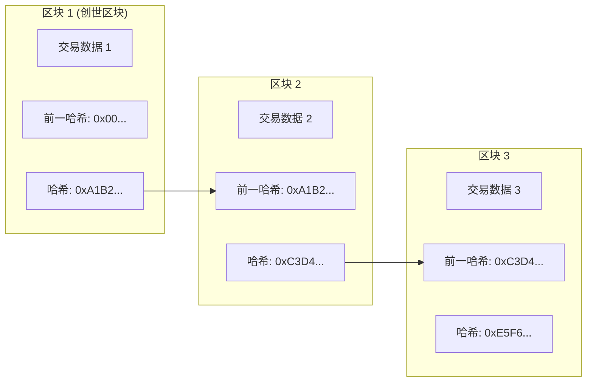
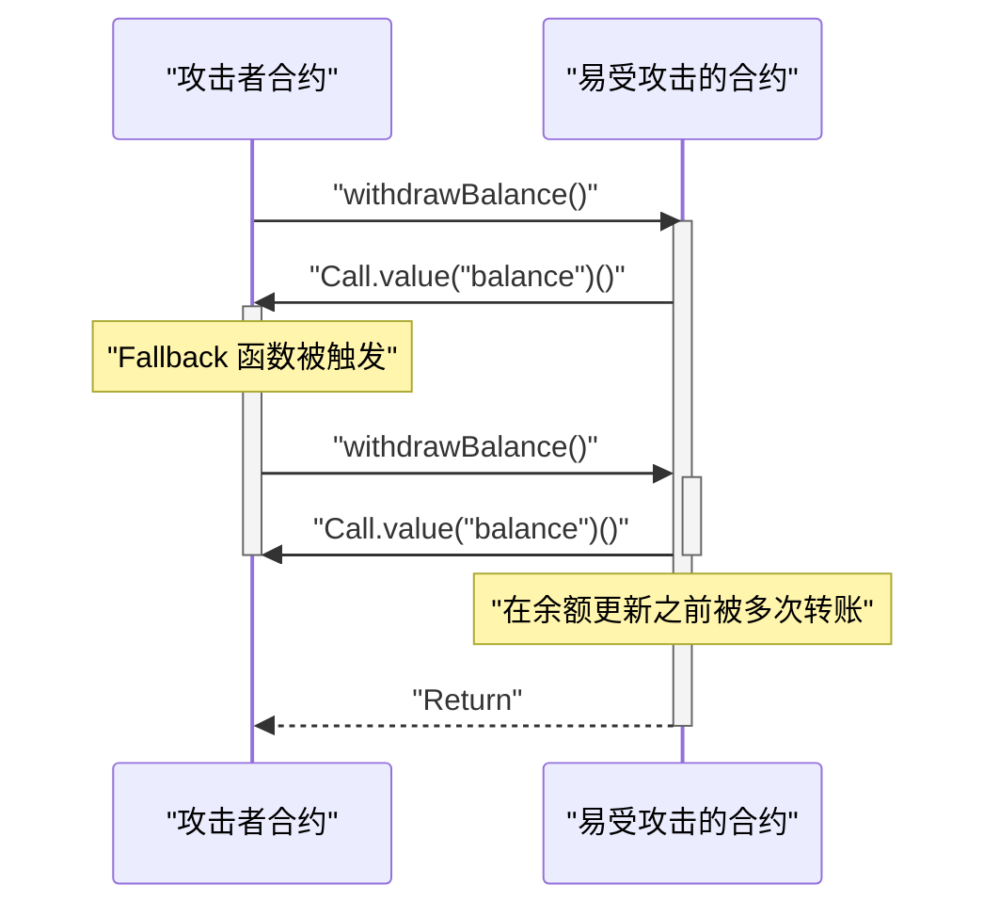

在现代数字经济中， **区块链** 和 **智能合约** 技术正为从金融、供应链到身份管理的各个行业带来颠覆性的变革。本文将全面而深入地探讨支撑这些技术的分布式账本基本原理、共识算法的数学背景、以太坊虚拟机 (EVM) 的内部结构、现实世界中运行的智能合约实现，以及其中潜藏的致命漏洞。

## 1. 区块链的基本原理与分布式账本技术 (DLT)

区块链是一种 **分布式账本技术 (Distributed Ledger Technology: DLT)** ，即使没有中心化的管理者，网络中的所有参与者（节点）也能共享和验证相同的数据，使篡改变得极其困难。

### 1.1 哈希函数与密码学技术

构成区块链安全基础的是密码学 **哈希函数** 。哈希函数是一种将任意长度的输入数据转换为固定长度字符串（哈希值）的函数，具有以下特性：

1. **单向性 (Pre-image Resistance)** ：极难从哈希值反推原始数据。
2. **抗碰撞性 (Collision Resistance)** ：极难找到具有相同哈希值的两个不同输入数据。
3. **微小的输入变化会导致输出发生巨大变化（雪崩效应）** 。

在比特币和以太坊等许多区块链中，采用了 SHA-256 和 Keccak-256 等哈希算法。

### 1.2 基于哈希链的防篡改机制

在区块链中，将一定时间内汇总的交易（交易记录）的“区块”沿着时间轴像链条一样连接起来。每个区块在生成时都包含前一个区块的哈希值（ **Previous Hash** ）。这种结构被称为 **哈希链** ，它产生了强大的防篡改能力。

下图展示了区块是如何连接的。



假设恶意节点篡改了过去 **区块 1** 的交易数据。那么，由于哈希函数的特性，区块 1 的新哈希值将从原本的 `0xA1B2...` 变成完全不同的值。结果，它将与 **区块 2** 中记录的 `Prev Hash` 不匹配，从而破坏了链的完整性。为了保持完整性，必须重新计算被篡改区块之后所有区块的哈希值。结合后文提到的 PoW 等共识算法，这种重新计算需要天文数字般的计算能力（成本），使得篡改在实际上变得不可能。

## 2. 深入探讨共识算法

由于网络中没有中心管理者，因此节点之间必须有一种算法来就“哪些交易是正确的”以及“由谁生成下一个区块”达成一致（共识）。这是解决分布式计算中 **拜占庭将军问题** 的关键。

### 2.1 工作量证明 (PoW)

比特币采用的 **工作量证明 (Proof of Work: PoW)** 是一种通过证明计算量（工作量）来获得区块生成权（挖矿权）的机制。矿工（采矿者）将区块头信息和一个称为“随机数 (Nonce)”的随机值通过哈希函数，寻找使结果小于网络设定的特定“目标值”的随机数。

这个难度目标值 $T$ 和哈希值 $H$ 的关系可以表示如下：

$$
H(\text{区块头} \parallel \text{随机数}) < T
$$

这里，$T$ 会根据网络的算力（哈希率）定期调整，以保持区块生成间隔（比特币约为 10 分钟）不变。
当哈希值表示为 256 位整数时，找到满足目标 $T$ 的哈希的概率如下：

$$
P = \frac{T}{2^{256}}
$$

由于一次哈希计算满足条件的概率极低，矿工会通过穷举法（暴力破解）重复计算。只有消耗巨大电力并在计算竞争中获胜的矿工，才能添加新区块并获得奖励（挖矿奖励和交易手续费）。攻击者若要篡改链条，需要控制全网 51% 以上的算力（51% 攻击），这在现实中成本极为高昂。

### 2.2 权益证明 (PoS)

为了解决 PoW 环境负荷高和可扩展性等问题，人们提出了 **权益证明 (Proof of Stake: PoS)** 。以太坊通过 "The Merge" 升级，从 PoW 迁移到了 PoS。

在 PoS 中，决定区块生成者（验证者）的不是计算量，而是基于网络原生代币（例如：ETH）的持有量（质押量）或锁定时间。
质押的资产作为验证者作恶时的担保（成为惩罚对象，称为 Slash）。这样一来，攻击者若要攻击网络，必须囤积大量代币，而如果攻击成功导致代币价值暴跌，其自身资产也将变得一文不值。通过这种经济激励机制来保证安全性。

### 2.3 实用拜占庭容错 (PBFT)

联盟链或私有链（如 Hyperledger Fabric）中经常采用的是 **PBFT** 。
PBFT 是一种即使网络中少于 $1/3$ 的节点存在作恶（拜占庭故障），也能保证正确达成共识的算法。它通过从选出领导节点开始，经过 Pre-prepare、Prepare、Commit 三个阶段的通信过程，在节点间确定状态。与 PoW 这种概率性最终性（被推翻的可能性随着时间推移无限趋近于零）不同，它的特点是具有即时确定性（绝对最终性），但由于通信开销大，不适合节点数量众多的公有链。

## 3. 智能合约与 EVM (以太坊虚拟机)

**智能合约** 是指当满足预设条件时，在区块链上自动执行的程序。它体现了“代码即法律 (Code is Law)”的理念，在没有中介的情况下实现了无需信任的交易和合约的自动执行。

### 3.1 EVM 的架构

在以太坊中执行智能合约的环境就是 **EVM (Ethereum Virtual Machine)** 。EVM 是在网络上所有节点中运行的图灵完备的虚拟机，作为一个巨大的“状态转换机 (State Transition Machine)”运作。

$$
S_{t+1} = \Upsilon(S_t, T)
$$

在上述公式中，$S_t$ 是以太坊当前的全局状态（各账户的余额及合约的存储），$T$ 是交易，$\Upsilon$ 是 EVM 的状态转换函数，而 $S_{t+1}$ 表示交易执行后的新状态。

EVM 的内部结构主要分为以下区域：
- **栈 ([Stack](https://kenji.blog/zh-cn/p/c-language-pointers-memory-management-stack-heap/))** ：最大 1024 个元素的 LIFO（后进先出）数据结构。字长为 256 位。保存各种运算的操作数。
- **内存 (Memory)** ：仅在交易执行期间临时保存的易失性字节数组。
- **存储 (Storage)** ：为每个合约分配的永久性数据区域。由键值对（256-bit 到 256-bit）的数据库组成，写入操作需要消耗较高的 Gas（手续费）成本。

## 4. 使用 Solidity 实现智能合约

智能合约通常使用 **Solidity** 这种面向对象的高级语言编写，被编译为 EVM 的字节码并部署。

### 4.1 投票系统实现示例

以下是展示安全的去中心化投票系统基本结构的 Solidity 代码示例。

```solidity
// SPDX-License-Identifier: MIT
pragma solidity ^0.8.0;

contract Voting {
    struct Proposal {
        string name;
        uint256 voteCount;
    }

    address public chairperson;
    mapping(address => bool) public hasVoted;
    Proposal[] public proposals;

    constructor(string[] memory proposalNames) {
        chairperson = msg.sender;
        for (uint i = 0; i < proposalNames.length; i++) {
            proposals.push(Proposal({
                name: proposalNames[i],
                voteCount: 0
            }));
        }
    }

    function vote(uint proposalIndex) public {
        require(!hasVoted[msg.sender], "Already voted."); // 已经投过票
        require(proposalIndex < proposals.length, "Invalid proposal index."); // 无效的提案索引

        hasVoted[msg.sender] = true;
        proposals[proposalIndex].voteCount += 1;
    }

    function winningProposal() public view returns (uint winningProposalIndex) {
        uint winningVoteCount = 0;
        for (uint p = 0; p < proposals.length; p++) {
            if (proposals[p].voteCount > winningVoteCount) {
                winningVoteCount = proposals[p].voteCount;
                winningProposalIndex = p;
            }
        }
    }
}
```

这段代码利用 `mapping` 防止重复投票，并在不可变的区块链上实现了高透明度的投票。

### 4.2 ERC-20 代币标准

作为加密资产（虚拟货币）基石被最广泛使用的便是 **ERC-20** 代币标准。通过实现 `transfer`、`balanceOf`、`approve`、`transferFrom` 等标准化函数，可以与 DEX（去中心化交易所）和钱包无缝集成。

## 5. 智能合约的漏洞与安全

部署在区块链上的代码由于具有不可变性而难以修改，因此代码中的漏洞或缺陷将直接导致致命的资金流失（黑客攻击）。

### 5.1 重入攻击 (Reentrancy Attack)

导致以太坊历史上最著名的黑客攻击事件“The DAO 事件”的原因正是 **重入攻击 (Reentrancy)** 。当从一个合约向外部的恶意合约发送以太币时，恶意合约的回退函数（Fallback）递归地调用原合约的转账函数，从而在余额更新之前耗尽资金，这就是重入攻击。

以下的时序图展示了重入攻击的流程。



#### 易受攻击的代码示例

```solidity
contract VulnerableBank {
    mapping(address => uint256) public balances;

    // 易受攻击的提款函数
    function withdraw() public {
        uint256 bal = balances[msg.sender];
        require(bal > 0, "Insufficient balance"); // 余额不足

        // 向外部合约发送以太币（这里发生重入攻击）
        (bool sent, ) = msg.sender.call{value: bal}("");
        require(sent, "Failed to send Ether"); // 发送以太币失败

        // 转账后才更新余额（太迟了）
        balances[msg.sender] = 0;
    }
}
```

#### 已防御的代码示例 (Checks-Effects-Interactions 模式)

防止重入攻击的最佳实践是，在进行外部调用之前先更新状态（例如余额）的 **Checks-Effects-Interactions** 模式，或者使用 OpenZeppelin 的 `ReentrancyGuard` 修饰符。

```solidity
contract SecureBank {
    mapping(address => uint256) public balances;

    // 已防御的提款函数
    function withdraw() public {
        uint256 bal = balances[msg.sender];
        require(bal > 0, "Insufficient balance"); // 余额不足

        // 1. Checks: 条件确认 (上述 require)
        // 2. Effects: 优先执行状态的更新
        balances[msg.sender] = 0;

        // 3. Interactions: 最后执行对外部的调用
        (bool sent, ) = msg.sender.call{value: bal}("");
        require(sent, "Failed to send Ether"); // 发送以太币失败
    }
}
```

### 5.2 其他漏洞

- **溢出 / 下溢** ：在 Solidity 0.8.0 之前，当计算超过整数的最大值或最小值时，存在数值环绕的漏洞。现在编译器层面已对其进行保护，遇到此类情况会引发恐慌错误（Panic Error）。
- **抢先交易 (Front-running)** ：区块链的交易会暂时保存在公开的待处理池 (Mempool) 中。攻击者通过监控 Mempool，为其交易设置更高的 Gas 费用，使其交易优先被处理，从而攫取利益（如三明治攻击等）。

## 6. 总结

**区块链** 和 **智能合约** 构筑了融合密码学坚固性与经济激励机制的高级分布式账本系统。通过 PoW 和 PoS 形成的共识维持了无需信任的网络，而 EVM 则在此之上实现了灵活的程序执行。然而，智能合约强大的功能也伴随着诸如重入攻击等高级安全风险，因此在开发过程中，稳健的架构设计和严格的代码审计不可或缺。希望本文所讲解的原理与实践知识能为下一代去中心化应用 (dApps) 的开发提供帮助。
