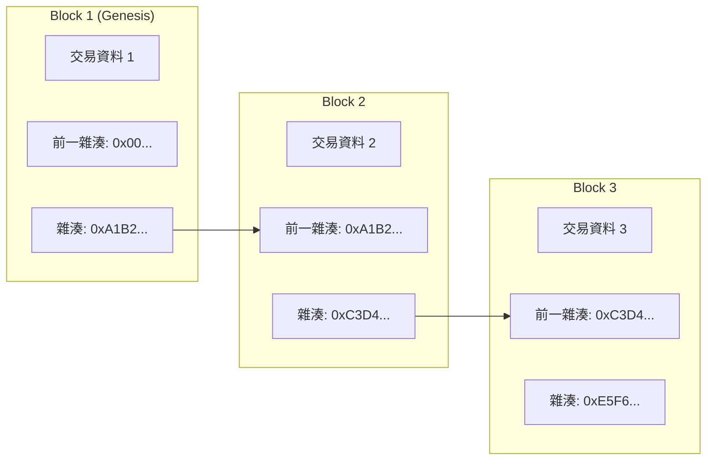
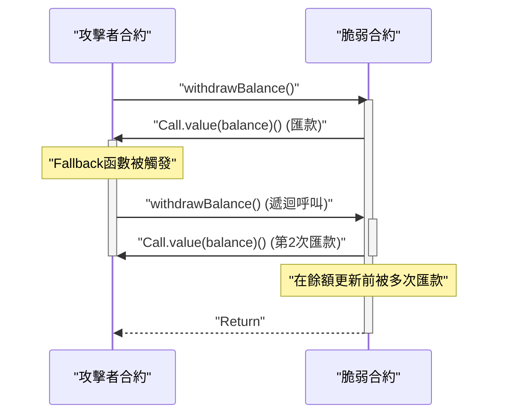

在現代數位經濟中， ** 區塊鏈 ** 與 ** 智能合約 ** 技術正為從金融到供應鏈、再到身分管理等各大產業帶來顛覆性的變革。本文將全面且深入地探討支撐這些技術的分散式帳本基本原理，共識演算法的數學背景，以太坊虛擬機 (EVM) 的內部結構，以及在現實社會中運行的智能合約實作，與其中潛藏的致命漏洞。

## 1. 區塊鏈的基本原理與分散式帳本技術 (DLT)

區塊鏈是一種即使沒有中央集權的管理者存在，也能讓所有網路參與者（節點）共享並驗證相同的資料，使篡改變得極為困難的 ** 分散式帳本技術 (Distributed Ledger Technology: DLT) ** 。

### 1.1 雜湊函數與密碼學技術

構成區塊鏈安全基礎的是密碼學的 ** 雜湊函數 ** 。雜湊函數是一種能將任意長度的輸入資料轉換為固定長度字串（雜湊值）輸出的函數，並具備以下特性：

1. ** 單向性 (Pre-image Resistance) ** ：從雜湊值反推原始資料是極為困難的。
2. ** 抗碰撞性 (Collision Resistance) ** ：尋找兩個具有相同雜湊值的不同輸入資料是困難的。
3. ** 微小的輸入變化會導致輸出大幅改變（雪崩效應） ** 。

在比特幣或以太坊等許多區塊鏈中，皆採用了 SHA-256 或 Keccak-256 等雜湊演算法。

### 1.2 透過雜湊鏈實現抗篡改的機制

在區塊鏈中，將一定期間內的交易（交易紀錄）打包成「區塊」，並沿著時間軸如鎖鏈般連結起來。每個區塊在生成時都會包含前一個區塊的雜湊值（ ** Previous Hash ** ）。這種結構產生了被稱為 ** 雜湊鏈 ** 的強大抗篡改性。

下圖展示了區塊是如何被連結的。



若有惡意節點篡改了過去 ** Block 1 ** 的交易資料。由於雜湊函數的特性，Block 1 的新雜湊值將從原本的 `0xA1B2...` 變成完全不同的值。結果，它將與記錄在 ** Block 2 ** 中的 `Prev Hash` 不符，導致鏈的完整性遭到破壞。為了維持完整性，必須重新計算被篡改區塊之後所有區塊的雜湊值。搭配後述的 PoW 等共識演算法，這種重新計算需要天文數字般的運算能力（成本），實際上要進行篡改是不可能的。

## 2. 深入探討共識演算法

由於網路中沒有中央管理者，因此必須要有演算法來讓節點間達成共識（合意），決定「哪筆交易是正確的」以及「下一個區塊由誰來生成」。這便是解決分散式運算中 ** 拜占庭將軍問題 ** 的關鍵。

### 2.1 工作量證明 (Proof of Work, PoW)

比特幣所採用的 ** 工作量證明 (PoW) ** ，是一種透過證明運算量（工作）來獲得區塊生成權（挖礦權）的機制。礦工（採礦者）將區塊標頭資訊與被稱為「隨機數 (Nonce)」的隨機值輸入雜湊函數中，並尋找能使結果小於網路所設定之特定「目標值」的隨機數。

此難度目標 $T$ 與雜湊值 $H$ 的關係可表示如下：

$$
H(\text{區塊標頭} \parallel \text{隨機數}) < T
$$

在此，$T$ 會根據網路的雜湊率（運算力）定期進行調整，以維持固定的區塊生成間隔（在比特幣的情況下約為 10 分鐘）。
若雜湊值以 256 位元的整數表示，找到符合目標 $T$ 的雜湊值的機率如下：

$$
P = \frac{T}{2^{256}}
$$

由於單次雜湊運算符合條件的機率極低，礦工們會以暴力破解法（Brute-force）不斷重複運算。只有消耗龐大電力並在運算競爭中獲勝的礦工，才能新增區塊並獲得獎勵（挖礦獎勵與交易手續費）。攻擊者若想篡改區塊鏈，必須掌控整個網路 51% 以上的運算力（51% 攻擊），這在現實中需要花費極其龐大的成本。

### 2.2 權益證明 (Proof of Stake, PoS)

為了解決 PoW 高環境負擔與可擴展性的問題， ** 權益證明 (PoS) ** 應運而生。以太坊透過 "The Merge" 升級，已從 PoW 轉移至 PoS。

在 PoS 中，區塊生成者（驗證者）並非依賴運算量，而是根據網路原生代幣（例如：ETH）的持有量（權益量）與鎖倉期間來選出。
被質押的資產在驗證者進行惡意行為時，會作為擔保品（成為懲罰對象，稱為沒收或 Slashing）。因此，攻擊者若要攻擊網路，必須收購大量的代幣，而一旦攻擊成功導致代幣價值崩跌，其自身資產也會變得毫無價值；PoS 即是透過這種經濟誘因的機制來確保安全性。

### 2.3 實用拜占庭容錯 (Practical Byzantine Fault Tolerance, PBFT)

在聯盟鏈或私有鏈（如 Hyperledger Fabric 等）中，經常採用的是 ** PBFT ** 。
PBFT 是一種即使網路中有少於 $1/3$ 的節點發生惡意行為（拜占庭錯誤），也能保證達成正確共識的演算法。從選出領導節點開始，經過 Pre-prepare、Prepare、Commit 三個階段的通訊流程後，節點間便會確立狀態。與 PoW 那種機率性的最終性（被推翻的可能性隨時間趨近於零）不同，其特徵在於具有即時確定性（絕對的最終性），但由於通訊負擔較大，不適合節點數眾多的公有鏈。

## 3. 智能合約與 EVM (以太坊虛擬機)

** 智能合約 ** 是一種當預先設定的條件被滿足時，便會在區塊鏈上自動執行的程式。它體現了「程式碼即法律 (Code is Law)」的概念，實現了無需仲介者、無需信任的交易與合約的自動執行。

### 3.1 EVM 的架構

在以太坊中執行智能合約的環境便是 ** EVM (Ethereum Virtual Machine) ** 。EVM 是在網路上所有節點中運行的圖靈完備虛擬機，作為一個巨大的「狀態轉換機 (State Transition Machine)」發揮作用。

$$
S_{t+1} = \Upsilon(S_t, T)
$$

在上述公式中，$S_t$ 代表目前以太坊的全域狀態（各帳戶餘額與合約儲存空間），$T$ 代表交易，$\Upsilon$ 是 EVM 的狀態轉換函數，而 $S_{t+1}$ 則表示執行交易後的新狀態。

EVM 的內部結構主要分為以下區域：
- ** 堆疊 (Stack) ** : 最大 1024 個元素的 LIFO（後進先出）資料結構。256 位元字長。用來保存各種運算的運算元。
- ** 記憶體 (Memory) ** : 僅在交易執行期間暫時保留的揮發性位元組陣列。
- ** 儲存空間 (Storage) ** : 分配給每個合約的永久性資料區域。由鍵值對（256-bit to 256-bit）的資料庫組成，寫入操作會消耗很高的 Gas（手續費）成本。

## 4. 透過 Solidity 實作智能合約

智能合約通常使用名為 ** Solidity ** 的物件導向高階語言撰寫，編譯成 EVM 的位元組碼後進行部署。

### 4.1 投票系統實作範例

以下是展示安全分散式投票系統基本架構的 Solidity 程式碼範例：

```solidity
// SPDX-License-Identifier: MIT
pragma solidity ^0.8.0;

contract Voting {
    struct Proposal {
        string name;
        uint256 voteCount;
    }

    address public chairperson;
    mapping(address => bool) public hasVoted;
    Proposal[] public proposals;

    constructor(string[] memory proposalNames) {
        chairperson = msg.sender;
        for (uint i = 0; i < proposalNames.length; i++) {
            proposals.push(Proposal({
                name: proposalNames[i],
                voteCount: 0
            }));
        }
    }

    function vote(uint proposalIndex) public {
        require(!hasVoted[msg.sender], "Already voted.");
        require(proposalIndex < proposals.length, "Invalid proposal index.");

        hasVoted[msg.sender] = true;
        proposals[proposalIndex].voteCount += 1;
    }

    function winningProposal() public view returns (uint winningProposalIndex) {
        uint winningVoteCount = 0;
        for (uint p = 0; p < proposals.length; p++) {
            if (proposals[p].voteCount > winningVoteCount) {
                winningVoteCount = proposals[p].voteCount;
                winningProposalIndex = p;
            }
        }
    }
}
```

在這段程式碼中，使用了 `mapping` 來防止重複投票，並在不可竄改的區塊鏈上實現了高透明度的投票。

### 4.2 ERC-20 代幣標準

作為加密資產（虛擬貨幣）基礎，最被廣泛使用的是 ** ERC-20 ** 代幣標準。透過實作 `transfer`、`balanceOf`、`approve`、`transferFrom` 等標準化函數，能與 DEX（去中心化交易所）和錢包無縫整合。

## 5. 智能合約的漏洞與安全性

由於區塊鏈上的程式碼一旦部署便具備難以輕易修改的不可篡改性，程式碼中的錯誤或漏洞將直接導致致命的資金外流（駭客攻擊）。

### 5.1 重入攻擊 (Reentrancy Attack)

造成以太坊史上最著名的駭客事件「The DAO 事件」的元兇便是 ** 重入攻擊 (Reentrancy) ** 。這是指當合約向外部惡意合約發送以太幣時，惡意合約的 fallback 函數會遞迴地呼叫原合約的匯款函數，在餘額更新前將資金抽乾的攻擊。

以下循序圖展示了 Reentrancy 攻擊的流程。



#### 脆弱的程式碼範例

```solidity
contract VulnerableBank {
    mapping(address => uint256) public balances;

    // 脆弱的提款函數
    function withdraw() public {
        uint256 bal = balances[msg.sender];
        require(bal > 0, "Insufficient balance");

        // 向外部合約發送以太幣（這裡會發生重入攻擊）
        (bool sent, ) = msg.sender.call{value: bal}("");
        require(sent, "Failed to send Ether");

        // 發送後更新餘額（太遲了）
        balances[msg.sender] = 0;
    }
}
```

#### 已採取對策的程式碼範例 (Checks-Effects-Interactions 模式)

防止重入攻擊的最佳實踐是，在進行外部呼叫前先更新狀態（如餘額等），即套用 ** Checks-Effects-Interactions ** 模式，或是使用 OpenZeppelin 的 `ReentrancyGuard` 修飾符。

```solidity
contract SecureBank {
    mapping(address => uint256) public balances;

    // 已採取對策的提款函數
    function withdraw() public {
        uint256 bal = balances[msg.sender];
        require(bal > 0, "Insufficient balance");

        // 1. Checks: 條件確認（如上述的 require）
        // 2. Effects: 先執行狀態的更新
        balances[msg.sender] = 0;

        // 3. Interactions: 最後執行對外部的呼叫
        (bool sent, ) = msg.sender.call{value: bal}("");
        require(sent, "Failed to send Ether");
    }
}
```

### 5.2 其他漏洞

- ** 溢出 / 下溢 (Overflow / Underflow) ** : 在 Solidity 0.8.0 之前，當運算超過整數的最大值或最小值時，會發生值迴繞（Wrap around）的漏洞。目前在編譯器層級已受保護，會導致 Panic 錯誤。
- ** 搶跑攻擊 (Front-running) ** : 區塊鏈的交易會暫時保留在公開的待處理池（Mempool）中。攻擊者會監視 Mempool，設定比目標交易更高的 Gas 費用，讓自己的交易先被處理，藉此掠奪利益（如三明治攻擊等）。

## 6. 總結

** 區塊鏈 ** 與 ** 智能合約 ** 結合了密碼學的堅固性與經濟誘因，建構了高度先進的分散式帳本系統。透過 PoW 或 PoS 的共識機制維持了無須信任的網路，而 EVM 則在其上實現了具彈性的程式執行。然而，智能合約強大的功能也伴隨著如重入攻擊等高度的資安風險，因此在開發時，堅固的架構設計與嚴格的程式碼審計是不可或缺的。希望本文所解說的原理與實用知識，能為開發次世代的分散式應用程式（dApps）提供一臂之力。
