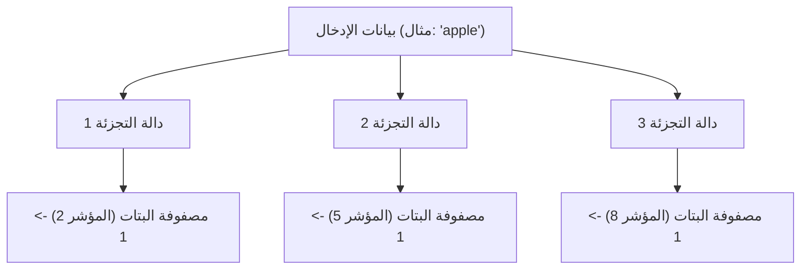
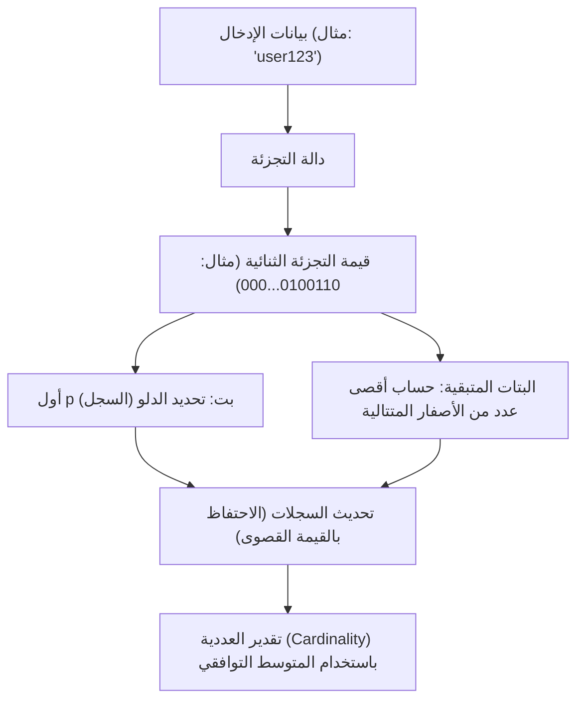

# أعجوبة هياكل البيانات الاحتمالية: Bloom Filter و HyperLogLog

في عصر البيانات الضخمة، يتزايد حجم البيانات التي نتعامل معها بشكل انفجاري. خدمات الويب التي تستقبل ملايين الزيارات في الثانية، أو الشبكات الاجتماعية التي تضم مليارات المستخدمين، أو تدفقات البيانات المستمرة الناتجة عن مستشعرات إنترنت الأشياء (IoT). عند معالجة هذه الكميات الهائلة من البيانات، فإن أحد أكبر الجدران التي نواجهها هو "حدود الذاكرة".

إذا حاولنا استخدام هياكل البيانات التقليدية (مثل جداول التجزئة أو أشجار البحث الثنائية) للاحتفاظ بجميع العناصر بدقة في الذاكرة للبحث أو الحساب، فستنفد الذاكرة لدينا بسرعة. إن تخزين عشرات المليارات من المعرفات الفريدة لتحديد "هل هذا المعرف موجود بالفعل؟" أو حساب "كم عدد المعرفات الفريدة الموجودة؟" هو أمر صعب للغاية من منظور الموارد المادية.

لحل هذه المشكلة، تم إنشاء **هياكل البيانات الاحتمالية (Probabilistic Data Structures)**. هياكل البيانات الاحتمالية هي خوارزميات تضحي بـ "الدقة بنسبة 100٪" مقابل الحصول على "استهلاك ذاكرة منخفض للغاية" و "سرعة معالجة عالية". في حالات الاستخدام التي يكون فيها بعض الخطأ (الإيجابيات الكاذبة أو التقريبات) مقبولاً، فإنها تعمل كالسحر.

في هذا المقال، سنتعمق في الآليات المذهلة، والخلفيات الرياضية، وحالات الاستخدام الفعلية لاثنين من أشهر الخوارزميات وأكثرها عملية بين هياكل البيانات الاحتمالية: **Bloom Filter** و **HyperLogLog**.

---

## Bloom Filter: توفير الذاكرة لفحوصات التواجد

### ما هو Bloom Filter؟
إن Bloom Filter عبارة عن هيكل بيانات احتمالي اخترعه بيرتون هوارد بلوم في عام 1970، ويُستخدم لتحديد "ما إذا كان عنصر معين متضمنًا في مجموعة" بسرعة وكفاءة في استهلاك الذاكرة.

الخصائص الرئيسية لـ Bloom Filter هي كما يلي:
1. **إذا تم تحديد العنصر على أنه "موجود"، فهذا يعني أنه "من المحتمل أن يكون موجودًا" (إمكانية حدوث إيجابيات كاذبة).**
2. **إذا تم تحديد العنصر على أنه "غير موجود"، فهذا يعني أنه "بالتأكيد غير موجود" (لا توجد سلبيات كاذبة على الإطلاق).**

باختصار، يمكن لـ Bloom Filter أن يقول بشكل قاطع "إنه غير موجود"، ولكن إذا قال "إنه موجود"، فهناك فرصة ضئيلة لأن يكون مخطئًا. باستخدام هذه الخاصية، يُستخدم على نطاق واسع كـ "مرشح أولي" لمنع الوصول غير الضروري إلى قواعد البيانات الضخمة.

### كيف يعمل Bloom Filter

يتكون Bloom Filter من مصفوفة بتات (Bit Array) بطول $m$ (تبدأ جميعها بـ 0) و $k$ دوال تجزئة مختلفة.

#### إضافة عنصر (Add)
عند إضافة عنصر، يتم تمريره عبر $k$ دوال تجزئة. تُخرج كل دالة تجزئة مؤشرًا (Index) من $0$ إلى $m-1$. ثم يتم تعيين البتات عند تلك المؤشرات في مصفوفة البتات إلى `1`. حتى لو أشارت دوال تجزئة متعددة إلى نفس المؤشر، أو إذا تم تعيينه بالفعل إلى `1` بواسطة عنصر آخر، فإنه يتم ببساطة الكتابة فوقه بـ `1` (أي يظل `1`).

#### فحص عنصر (Check)
عند التحقق مما إذا كان العنصر موجودًا، يتم تمرير العنصر عبر $k$ دوال تجزئة بنفس الطريقة المتبعة عند الإضافة. ثم يتم فحص قيم مصفوفة البتات عند جميع المؤشرات الناتجة.
- **إذا كانت جميعها `1`:** يتم تحديد العنصر على أنه "من المحتمل أن يكون موجودًا".
- **إذا تم تضمين ولو `0` واحد:** يتم تحديد العنصر على أنه "بالتأكيد غير موجود".

لماذا "من المحتمل أن يكون موجودًا"؟ لأنه حتى لو لم تتم إضافة العنصر الذي تريد التحقق منه مطلقًا، فهناك احتمال أن تصبح جميع مؤشرات التجزئة لهذا العنصر بالصدفة `1` نتيجة لإضافة عناصر أخرى. هذه هي الطبيعة الحقيقية لـ "الإيجابية الكاذبة" (False Positive).

### معدل الإيجابيات الكاذبة وتحسين المعلمات

عند تصميم Bloom Filter، فإن التوازن بين طول مصفوفة البتات $m$، والعدد المتوقع للعناصر المراد إضافتها $n$، وعدد دوال التجزئة $k$ هو أمر بالغ الأهمية.

يُعطى معدل الإيجابية الكاذبة $p$ تقريبًا بالصيغة التالية:
$$ p \approx (1 - e^{-kn/m})^k $$

كما يتضح من هذه الصيغة، كلما كانت مصفوفة البتات أكبر (زيادة $m$)، انخفض معدل الإيجابيات الكاذبة، وكلما زاد عدد العناصر ($n$)، ارتفع معدل الإيجابيات الكاذبة. أيضًا، يتم إعطاء العدد الأمثل لدوال التجزئة $k$ بالصيغة التالية:
$$ k = \frac{m}{n} \ln 2 $$

على سبيل المثال، إذا كنت تتوقع إضافة 100 مليون عنصر وتريد الحفاظ على معدل إيجابية كاذبة عند 1٪ (0.01)، فيمكنك حساب حجم الذاكرة المطلوب ($m$) والعدد الأمثل لدوال التجزئة ($k$). ونتيجة لذلك، باستخدام حوالي 120 ميجابايت فقط من الذاكرة و 7 دوال تجزئة، يصبح من الممكن التحقق من وجود 100 مليون عنصر. إذا حاولت تنفيذ ذلك باستخدام جدول تجزئة، فستحتاج إلى عدة جيجابايت إلى أكثر من اثني عشر جيجابايت من الذاكرة.

### حالات استخدام Bloom Filter

تعتبر Bloom Filters أدوات قوية لتقليل المعالجة المهدرة في الأنظمة الخلفية وقواعد البيانات.

1. **تقليل عمليات الإدخال والإخراج لقرص قاعدة البيانات (Cassandra و HBase وما إلى ذلك):**
   عند التحقق مما إذا كانت البيانات المقابلة لمفتاح معين موجودة، يتم الاستعلام من Bloom Filter الموجود في الذاكرة قبل الوصول إلى القرص. إذا تم تحديد أنها "غير موجودة"، فيمكن تخطي الوصول إلى القرص تمامًا، مما يؤدي إلى تحسين الأداء بشكل جذري.
2. **شبكات توصيل المحتوى (CDNs) وأنظمة التخزين المؤقت:**
   تُستخدم Bloom Filters لمنع تخزين "العجائب ذات الضربة الواحدة" (الموارد التي يتم الوصول إليها مرة واحدة فقط) في ذاكرة التخزين المؤقت. يتم تسجيل الوصول الأول فقط في Bloom Filter ولا يتم تخزينه مؤقتًا، ولا يتم تخزينه مؤقتًا إلا عند الوصول الثاني (عند تحديد وجوده في Bloom Filter)، مما يؤدي إلى تحسين كفاءة الذاكرة للتخزين المؤقت.
3. **تصفية عناوين URL الضارة:**
   عندما يتحقق المتصفح من قائمة بمواقع الويب الضارة، فإنه يستخدم Bloom Filter بدلاً من تنزيل القائمة بأكملها. إنه لا يجري سوى استعلامات مفصلة للخادم إذا حدد Bloom Filter أنه "موجود (يحتمل أن يكون ضارًا)".

---

## HyperLogLog: أقصى درجات تقدير العددية (Cardinality)

### ما هو HyperLogLog؟
بينما يتخصص Bloom Filter في "فحص تواجد العنصر"، فإن **HyperLogLog (HLL)** هو هيكل بيانات احتمالي متخصص في "تقدير العددية (عدد العناصر الفريدة)". تم تقديمه بواسطة Flajolet وآخرين في عام 2007.

على سبيل المثال، لنفترض أنك تريد حساب "كم عدد المستخدمين الفريدين (UU) الذين زاروا موقع الويب هذا؟" عادةً، ستحتاج إلى حفظ جميع معرفات المستخدمين في هيكل بيانات مثل Set وقياس حجمه. ومع ذلك، على مستوى Google أو Twitter، يصل عدد العناصر الفريدة إلى المليارات أو عشرات المليارات، مما يجعل من المستحيل الاحتفاظ بها جميعًا في الذاكرة.

يعد HyperLogLog خوارزمية سحرية حقًا تؤدي هذا الحساب باستخدام **بضعة كيلوبايتات فقط (على سبيل المثال، حوالي 12 كيلوبايت)** من الذاكرة مع هامش خطأ صغير (خطأ قياسي يبلغ حوالي 0.81٪).

### رمي العملة المعدنية والنموذج الرياضي للاحتمالات

لفهم كيفية عمل HyperLogLog، دعونا أولاً نفكر في "نموذج رمي العملة" البديهي.

لنفترض أنك ترمي عملة معدنية وتحسب عدد المرات التي يظهر فيها "وجه" بشكل متتالي.
- احتمال الحصول على "ظهر" في الرمية الأولى: 1/2
- احتمال الحصول على "وجه" مرتين متتاليتين، ثم "ظهر" في المرة الثالثة: 1/8
- احتمال الحصول على "وجه" $k$ من المرات المتتالية: $1/2^k$

إذا قال أحدهم: "لقد رميت عملة معدنية، وحصلت على وجه 10 مرات متتالية"، فمن المحتمل أن تخمن أن الشخص "لابد أنه رمى العملة مرات عديدة جدًا (حوالي $2^{10} = 1024$ مرة)". لأن احتمال الحصول على وجه 10 مرات متتالية مع عدد قليل من المحاولات منخفض للغاية.

يطبق HyperLogLog هذه الخاصية التي تنص على أن "احتمال حدوث نمط معين بشكل متتالي يعتمد على عدد المحاولات" على قيم التجزئة للبيانات.

### خوارزمية HyperLogLog

1. **تجزئة البيانات:**
   يتم تمرير بيانات الإدخال (مثل معرفات المستخدم) عبر دالة تجزئة للحصول على رقم ثنائي طويل موزع بشكل موحد (على سبيل المثال، 64 بت).
2. **التقسيم إلى دلاء (سجلات):**
   لتقليل التباين، يتم استخدام أول $p$ بت من قيمة التجزئة لتوزيع البيانات في $m = 2^p$ من الدلاء (السجلات).
3. **عد الأصفار المتتالية:**
   بالنسبة للبتات المتبقية من قيمة التجزئة، نحسب "عدد الأصفار المتتالية التي تستمر من البداية". لنسمي هذا $\rho(x)$. وهذا يتوافق مع "عدد الوجوه المتتالية" في رمي العملة.
4. **تحديث السجلات:**
   يخزن كل دلو (سجل) فقط **القيمة القصوى** لـ $\rho(x)$ التي تمت ملاحظتها حتى الآن.
5. **حساب القيمة المقدرة بواسطة المتوسط التوافقي:**
   يتم تقدير العددية الكلية من القيم القصوى لجميع السجلات. نظرًا لأن المتوسط الحسابي البسيط يتأثر بشدة بالقيم المتطرفة (القيم التي استمرت فيها أصفار طويلة بشكل استثنائي بالصدفة)، يستخدم HyperLogLog **المتوسط التوافقي (Harmonic Mean)**.

صيغة حساب القيمة المقدرة $E$ هي كما يلي:
$$ E = \alpha_m \cdot m^2 \cdot \left( \sum_{j=1}^{m} 2^{-M[j]} \right)^{-1} $$
هنا، $m$ هو عدد الدلاء، و $M[j]$ هي القيمة القصوى المخزنة في السجل $j$، و $\alpha_m$ هو ثابت لتصحيح التحيز.

### كفاءة مذهلة في استخدام الذاكرة

تكمن عظمة HyperLogLog في كفاءته القصوى في استهلاك الذاكرة.
على سبيل المثال، إذا كان $p = 14$، فإن عدد الدلاء هو $2^{14} = 16384$. عند استخدام تجزئة 64 بت، يكون عدد الأصفار المتتالية على الأكثر 64، وبالتالي فإن حجم السجل لتخزينه لا يحتاج إلا إلى أن يكون 6 بتات ($2^6 = 64$).

إجمالي استهلاك الذاكرة:
$$ 16384 \text{ سجلاً} \times 6 \text{ بتات} = 98304 \text{ بت} = 12288 \text{ بايت} \approx 12 \text{ كيلوبايت} $$

باستخدام هذا الحجم الضئيل البالغ 12 كيلوبايت فقط من الذاكرة، يمكن تقدير عدد العناصر الفريدة التي تتراوح بمئات الملايين أو المليارات بهامش خطأ يقل عن 1٪. بالمقارنة مع هيكل بيانات Set القياسي الذي يستهلك مئات الجيجابايت من الذاكرة، فإن الاختلاف يقع حرفيًا على مستوى آخر.

### حالات استخدام HyperLogLog

أصبح HyperLogLog تقنية لا غنى عنها في البنية التحتية لتحليل البيانات الضخمة.

1. **حساب المستخدمين الفريدين (UU) في الوقت الفعلي:**
   يُستخدم في أدوات تحليل الوصول ولوحات المعلومات لحساب الزوار والمشاهدين في الوقت الفعلي. تحتوي أنظمة KVS الموجودة في الذاكرة مثل Redis على HyperLogLog كتمثيل قياسي عبر أوامر مثل `PFADD` و `PFCOUNT`.
2. **تحليل وتجميع مجموعات البيانات الضخمة:**
   في محركات SQL الموزعة مثل BigQuery و Amazon Redshift و Presto، يُستخدم HyperLogLog (أو خوارزمياته المشتقة) لتسريع الاستعلامات مثل `COUNT(DISTINCT column_name)`.
3. **إدارة الحالة في معالجة التدفق:**
   في أطر عمل معالجة التدفق مثل Apache Kafka و Apache Flink، يتم استخدامه لحساب عددية تدفقات البيانات المتدفقة بلا نهاية دون استنفاد الذاكرة.

---

## الخلاصة: اختراقات جلبتها التقريبات

لقد اخترق كل من Bloom Filter و HyperLogLog "جدار الذاكرة" في علوم الكمبيوتر من خلال قبول المفاضلة المتمثلة في "التخلي عن الدقة بنسبة 100٪".

- يعمل **Bloom Filter** كحارس لمخازن البيانات الضخمة، حيث يمنع الوصول المهدر من خلال التمييز بين "من المحتمل أن يكون موجودًا" و "بالتأكيد غير موجود".
- يقوم **HyperLogLog** بحساب عناصر يضاهي عددها النجوم في الكون باستخدام بضعة كيلوبايتات فقط من الذاكرة من خلال الجمع بذكاء بين الطبيعة الاحتمالية لرمي العملة والمتوسط التوافقي.

وراء كواليس خدمات الويب عالية السرعة التي نستخدمها كأمر مسلم به كل يوم وأنظمة تحليل البيانات الضخمة التي تعيد النتائج في ثوانٍ، تختبئ النماذج الرياضية الجميلة والإبداع الهندسي لهياكل البيانات الاحتمالية هذه. تجلب قوة الخوارزميات أحيانًا اختراقات تتجاوز حتى القيود المادية (سعة الذاكرة).
