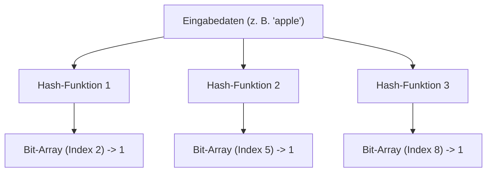
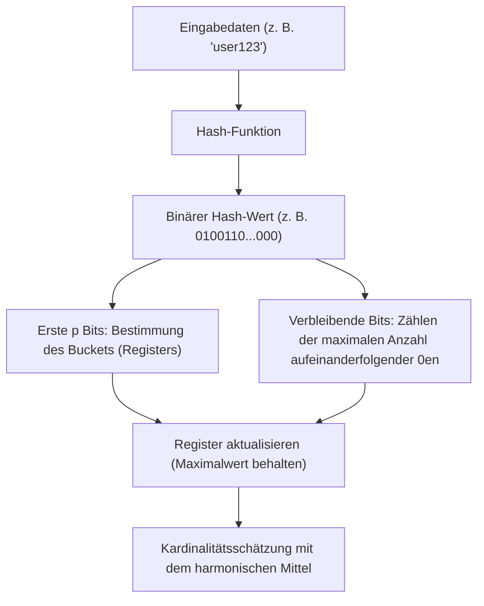

# Das Wunder der probabilistischen Datenstrukturen: Bloom Filter und HyperLogLog

Im Zeitalter von Big Data explodiert die Datenmenge, die wir verarbeiten, förmlich. Webdienste mit Millionen von Zugriffen pro Sekunde, soziale Netzwerke mit Milliarden von Nutzern oder kontinuierliche Datenströme von IoT-Sensoren. Bei der Verarbeitung solch enormer Datenmengen ist eine der größten Hürden, vor denen wir stehen, das "Speicherlimit".

Wenn wir versuchen, herkömmliche Datenstrukturen (wie Hash-Tabellen oder binäre Suchbäume) zu verwenden, um alle Elemente zur Suche oder Zählung exakt im Speicher zu halten, wird der Speicherplatz schnell erschöpft sein. Es ist aus Sicht der physischen Ressourcen extrem schwierig, zig Milliarden einzigartige IDs zu speichern, um festzustellen: "Gibt es diese ID bereits?" oder zu zählen: "Wie viele einzigartige IDs gibt es?".

Um dieses Problem zu lösen, wurden **probabilistische Datenstrukturen (Probabilistic Data Structures)** entwickelt. Probabilistische Datenstrukturen sind Algorithmen, die "100%ige Genauigkeit" opfern und im Gegenzug "extrem geringen Speicherverbrauch" sowie "hohe Verarbeitungsgeschwindigkeiten" bieten. In Anwendungsfällen, in denen gewisse Fehler (falsch-positive Ergebnisse oder Näherungswerte) akzeptabel sind, wirken sie wie Magie.

In diesem Artikel werden wir tief in die erstaunlichen Mechanismen, die mathematischen Hintergründe und die tatsächlichen Anwendungsfälle zweier der bekanntesten und praktischsten Algorithmen unter den probabilistischen Datenstrukturen eintauchen: **Bloom Filter** und **HyperLogLog**.

---

## Bloom Filter: Speicherplatz bei Existenzprüfungen sparen

### Was ist ein Bloom Filter?
Ein Bloom Filter ist eine 1970 von Burton Howard Bloom erfundene probabilistische Datenstruktur, die verwendet wird, um schnell und speichereffizient festzustellen, "ob ein bestimmtes Element in einer Menge enthalten ist".

Die Hauptmerkmale eines Bloom Filters sind wie folgt:
1. **Wenn ein Element als "vorhanden" bestimmt wird, bedeutet dies, dass es "wahrscheinlich vorhanden" ist (Möglichkeit von False Positives).**
2. **Wenn ein Element als "nicht vorhanden" bestimmt wird, bedeutet dies, dass es "definitiv nicht vorhanden" ist (absolut keine False Negatives).**

Kurz gesagt, ein Bloom Filter kann mit Sicherheit sagen, dass "es nicht da ist", aber wenn er sagt, dass "es da ist", besteht eine geringe Chance, dass er falsch liegt. Unter Ausnutzung dieser Eigenschaft wird er häufig als "Vorfilter" eingesetzt, um unnötige Zugriffe auf riesige Datenbanken zu verhindern.

### Wie ein Bloom Filter funktioniert

Ein Bloom Filter besteht aus einem Bit-Array der Länge $m$ (anfänglich alle 0) und $k$ verschiedenen Hash-Funktionen.

#### Hinzufügen eines Elements (Add)
Beim Hinzufügen eines Elements durchläuft dieses die $k$ Hash-Funktionen. Jede Hash-Funktion gibt einen Index von $0$ bis $m-1$ aus. Anschließend werden die Bits an diesen Indizes im Bit-Array auf `1` gesetzt. Selbst wenn mehrere Hash-Funktionen auf denselben Index verweisen oder dieser bereits durch ein anderes Element auf `1` gesetzt wurde, wird er einfach mit `1` überschrieben (d. h. bleibt `1`).

#### Suchen eines Elements (Check)
Beim Überprüfen, ob ein Element vorhanden ist, wird das Element auf die gleiche Weise wie beim Hinzufügen durch die $k$ Hash-Funktionen geleitet. Dann werden die Werte des Bit-Arrays an allen ausgegebenen Indizes überprüft.
- **Wenn alle `1` sind:** Das Element wird als "wahrscheinlich vorhanden" eingestuft.
- **Wenn auch nur eine `0` enthalten ist:** Das Element wird als "definitiv nicht vorhanden" eingestuft.

Warum "wahrscheinlich vorhanden"? Weil selbst dann, wenn das zu überprüfende Element nie hinzugefügt wurde, die Möglichkeit besteht, dass alle Hash-Indizes für dieses Element zufällig aufgrund des Hinzufügens anderer Elemente zu `1` wurden. Dies ist das Wesen eines "False Positive".

### Falsch-Positiv-Rate und Parameteroptimierung

Beim Entwurf eines Bloom Filters ist das Gleichgewicht zwischen der Länge des Bit-Arrays $m$, der erwarteten Anzahl hinzuzufügender Elemente $n$ und der Anzahl der Hash-Funktionen $k$ entscheidend.

Die Falsch-Positiv-Rate $p$ lässt sich durch folgende Formel annähern:
$$ p \approx (1 - e^{-kn/m})^k $$

Wie aus dieser Formel ersichtlich ist, sinkt die Falsch-Positiv-Rate, je größer das Bit-Array ist (größeres $m$), und steigt, je mehr Elemente vorhanden sind ($n$). Zudem lässt sich die optimale Anzahl der Hash-Funktionen $k$ mit folgender Formel berechnen:
$$ k = \frac{m}{n} \ln 2 $$

Wenn Sie beispielsweise 100 Millionen Elemente hinzufügen möchten und die Falsch-Positiv-Rate bei 1 % (0,01) halten wollen, können Sie die erforderliche Speichergröße ($m$) und die optimale Anzahl an Hash-Funktionen ($k$) berechnen. Das Ergebnis: Mit nur etwa 120 MB Speicherplatz und 7 Hash-Funktionen ist es möglich, die Existenz von 100 Millionen Elementen zu überprüfen. Würde man dies mit einer Hash-Tabelle implementieren wollen, bräuchte man mehrere bis über ein Dutzend Gigabyte Speicher.

### Anwendungsfälle für Bloom Filter

Bloom Filter sind leistungsstarke Werkzeuge, um unnötige Verarbeitungsschritte in Backend-Systemen und Datenbanken zu vermeiden.

1. **Reduzierung der Datenbank-Festplatten-I/O (Cassandra, HBase usw.):**
   Bei der Überprüfung, ob Daten zu einem bestimmten Schlüssel existieren, wird vor dem Festplattenzugriff der In-Memory Bloom Filter abgefragt. Wird ermittelt, dass die Daten "nicht existieren", kann der Festplattenzugriff vollständig übersprungen werden, was die Leistung drastisch verbessert.
2. **CDNs und Cache-Systeme:**
   Bloom Filter werden verwendet, um zu verhindern, dass "One-Hit Wonders" (Ressourcen, auf die nur einmal zugegriffen wird) im Cache gespeichert werden. Der erste Zugriff wird nur im Bloom Filter verzeichnet und nicht zwischengespeichert. Erst beim zweiten Zugriff (wenn festgestellt wird, dass er im Bloom Filter existiert) wird das Element im Cache abgelegt, was die Speichereffizienz des Caches erhöht.
3. **Filtern schädlicher URLs:**
   Wenn ein Browser URLs mit einer Liste bösartiger Websites abgleicht, verwendet er einen Bloom Filter, anstatt die gesamte Liste herunterzuladen. Nur wenn der Bloom Filter feststellt, dass die URL "existiert (potenziell bösartig)", werden detaillierte Anfragen an den Server gesendet.

---

## HyperLogLog: Die ultimative Kardinalitätsschätzung

### Was ist HyperLogLog?
Während der Bloom Filter auf "Existenzprüfungen von Elementen" spezialisiert ist, ist **HyperLogLog (HLL)** eine probabilistische Datenstruktur, die auf die "Schätzung der Kardinalität (Anzahl einzigartiger Elemente)" spezialisiert ist. Sie wurde 2007 von Flajolet et al. eingeführt.

Angenommen, Sie möchten berechnen: "Wie viele Unique Users (UU) haben diese Website besucht?". Normalerweise müssten Sie alle Benutzer-IDs in einer Datenstruktur wie einem Set (Menge) speichern und deren Größe messen. Auf der Skala von Google oder Twitter erreicht die Anzahl der einzigartigen Elemente jedoch Milliarden oder zig Milliarden, was es unmöglich macht, sie alle im Speicher zu halten.

HyperLogLog ist ein wahrhaft magischer Algorithmus, der diese Berechnung mit **nur wenigen Kilobyte (z. B. etwa 12 KB)** Speicherplatz und einer kleinen Fehlermarge (Standardfehler von ca. 0,81 %) durchführt.

### Münzwurf und das mathematische Wahrscheinlichkeitsmodell

Um zu verstehen, wie HyperLogLog funktioniert, betrachten wir zunächst ein intuitives "Münzwurf-Modell".

Angenommen, Sie werfen eine Münze und zählen, wie oft hintereinander "Kopf" erscheint.
- Wahrscheinlichkeit, beim ersten Wurf Zahl zu erhalten: 1/2
- Wahrscheinlichkeit, 2 Mal hintereinander Kopf und dann Zahl zu erhalten: 1/8
- Wahrscheinlichkeit, $k$-mal hintereinander Kopf zu erhalten: $1/2^k$

Wenn jemand sagt: "Ich habe eine Münze geworfen und 10 Mal hintereinander Kopf bekommen", würden Sie wahrscheinlich raten, dass diese Person "die Münze ziemlich oft geworfen haben muss (ungefähr $2^{10} = 1024$ Mal)". Denn die Wahrscheinlichkeit, bei einer geringen Anzahl von Versuchen 10 Mal hintereinander Kopf zu bekommen, ist extrem gering.

HyperLogLog wendet diese Eigenschaft, dass "die Wahrscheinlichkeit des aufeinanderfolgenden Auftretens eines bestimmten Musters von der Anzahl der Versuche abhängt", auf die Hash-Werte von Daten an.

### Der HyperLogLog-Algorithmus

1. **Hashen von Daten:**
   Eingabedaten (wie Benutzer-IDs) werden durch eine Hash-Funktion geleitet, um eine gleichmäßig verteilte, lange Binärzahl (z. B. 64 Bit) zu erhalten.
2. **Aufteilung in Buckets (Register):**
   Um die Varianz zu verringern, werden die ersten $p$ Bits des Hash-Werts verwendet, um die Daten auf $m = 2^p$ Buckets (Register) zu verteilen.
3. **Zählen aufeinanderfolgender Nullen:**
   Für die verbleibenden Bits des Hash-Werts zählen wir, "wie viele aufeinanderfolgende Nullen ab dem Anfang fortgesetzt werden". Nennen wir dies $\rho(x)$. Dies entspricht der "Anzahl der aufeinanderfolgenden Köpfe" bei einem Münzwurf.
4. **Aktualisierung der Register:**
   Jeder Bucket (jedes Register) speichert nur den bisher beobachteten **Maximalwert** von $\rho(x)$.
5. **Berechnung des Schätzwertes durch das harmonische Mittel:**
   Die Gesamtkardinalität wird aus den Maximalwerten aller Register geschätzt. Da ein einfaches arithmetisches Mittel stark von Ausreißern beeinflusst wird (Werte, bei denen zufällig außergewöhnlich lange Nullenreihen auftraten), verwendet HyperLogLog das **harmonische Mittel**.

Die Formel zur Berechnung des Schätzwertes $E$ lautet wie folgt:
$$ E = \alpha_m \cdot m^2 \cdot \left( \sum_{j=1}^{m} 2^{-M[j]} \right)^{-1} $$
Hierbei ist $m$ die Anzahl der Buckets, $M[j]$ der im $j$-ten Register gespeicherte Maximalwert und $\alpha_m$ eine Konstante zur Bias-Korrektur.

### Erstaunliche Speichereffizienz

Die Größe von HyperLogLog liegt in seiner extremen Speichereffizienz.
Wenn beispielsweise $p = 14$ ist, beträgt die Anzahl der Buckets $2^{14} = 16384$. Bei Verwendung eines 64-Bit-Hashes beträgt die Anzahl aufeinanderfolgender Nullen höchstens 64, sodass die Größe des Registers zur Speicherung dieses Wertes nur 6 Bit ($2^6 = 64$).

Gesamtspeicherverbrauch:
$$ 16384 \text{ Register} \times 6 \text{ Bit} = 98304 \text{ Bit} = 12288 \text{ Byte} \approx 12 \text{ KB} $$

Mit diesen bescheidenen 12 KB Speicher kann die Anzahl einzigartiger Elemente, die in die Hunderte von Millionen oder Milliarden geht, mit einem Fehler von weniger als 1 % geschätzt werden. Im Vergleich zu einer Standard-Set-Datenstruktur, die Hunderte von Gigabyte an Speicherplatz verbraucht, ist der Unterschied buchstäblich in einer anderen Dimension.

### Anwendungsfälle für HyperLogLog

HyperLogLog ist zu einer unverzichtbaren Technologie in der Infrastruktur für Big-Data-Analysen geworden.

1. **Echtzeit-Zählung von Unique Users (UU):**
   Wird in Zugriffsanalyse-Tools und Dashboards verwendet, um Besucher und Zuschauer in Echtzeit zu zählen. In-Memory-KVS wie Redis haben HyperLogLog standardmäßig als Befehle wie `PFADD` und `PFCOUNT` implementiert.
2. **Analyse und Aggregation riesiger Datensätze:**
   In verteilten SQL-Engines wie BigQuery, Amazon Redshift und Presto wird HyperLogLog (oder davon abgeleitete Algorithmen) verwendet, um Abfragen wie `COUNT(DISTINCT column_name)` zu beschleunigen.
3. **Statusverwaltung bei der Stream-Verarbeitung:**
   In Stream-Verarbeitungs-Frameworks wie Apache Kafka und Apache Flink wird es eingesetzt, um die Kardinalität unendlich fließender Datenströme zu berechnen, ohne den Speicherplatz zu erschöpfen.

---

## Fazit: Durchbrüche durch Näherungsverfahren

Sowohl Bloom Filter als auch HyperLogLog haben die "Speicherwand" in der Informatik durchbrochen, indem sie den Kompromiss akzeptierten, "auf 100%ige Genauigkeit zu verzichten".

- **Bloom Filter** fungiert als Türsteher für riesige Datenspeicher und verhindert unnötige Zugriffe, indem er zwischen "wahrscheinlich vorhanden" und "definitiv nicht vorhanden" unterscheidet.
- **HyperLogLog** zählt Elemente in der Größenordnung der Sterne im Universum mit nur wenigen Kilobyte Speicherplatz, indem es geschickt die probabilistische Natur eines Münzwurfs und das harmonische Mittel kombiniert.

Hinter den Kulissen der pfeilschnellen Webdienste, die wir jeden Tag ganz selbstverständlich nutzen, und der Big-Data-Analysesysteme, die in Sekundenbruchteilen Ergebnisse liefern, verbergen sich die wunderschönen mathematischen Modelle und der technische Einfallsreichtum solch probabilistischer Datenstrukturen. Die Kraft von Algorithmen bringt manchmal Durchbrüche hervor, die selbst physische Grenzen (wie die Speicherkapazität) überwinden.
