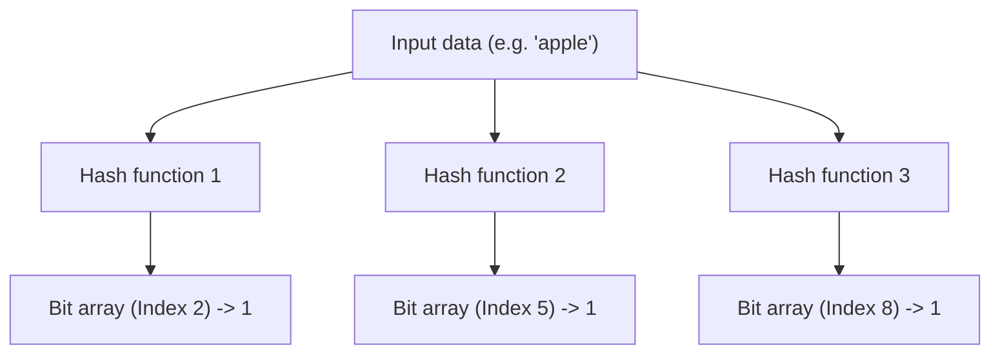
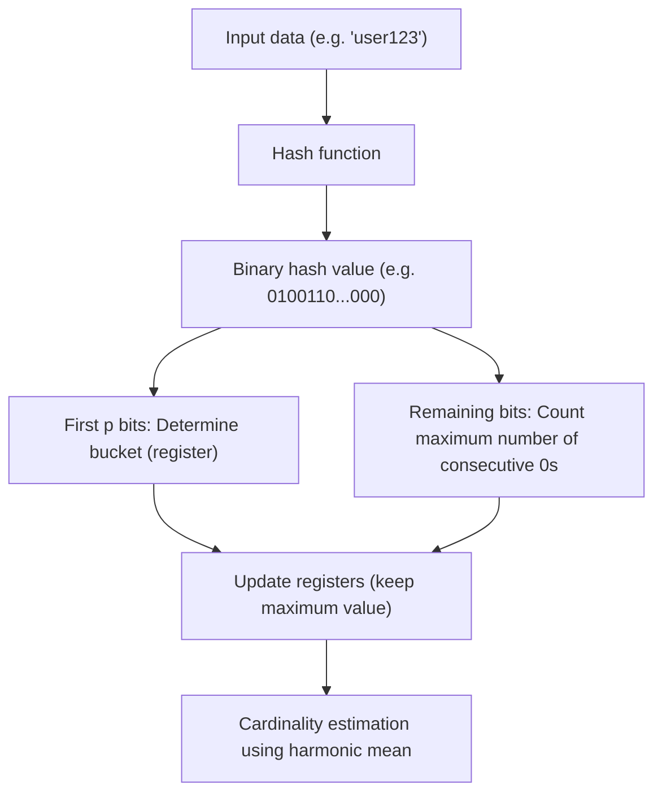

# The Marvel of Probabilistic Data Structures: Bloom Filter and HyperLogLog

In the big data era, the amount of data we handle is exploding exponentially. Web services with millions of accesses per second, social networks with billions of users, or continuous stream data generated by IoT sensors. When processing such enormous amounts of data, one of the biggest walls we face is the "limit of memory."

If we try to use traditional data structures (such as hash tables or binary search trees) to keep all elements accurately in memory for searching or counting, we will quickly run out of memory. Storing tens of billions of unique IDs to determine "Does this ID already exist?" or counting "How many unique IDs are there?" is extremely difficult from the perspective of physical resources.

To solve this problem, **Probabilistic Data Structures** were created. Probabilistic data structures are algorithms that sacrifice "100% accuracy" in exchange for "extremely low memory consumption" and "high processing speed." In use cases where some error (false positives or approximations) is acceptable, they work like magic.

In this article, we will delve deep into the astonishing mechanisms, mathematical backgrounds, and actual use cases of two of the most famous and practical algorithms among probabilistic data structures: **Bloom Filter** and **HyperLogLog**.

---

## Bloom Filter: Saving Memory for Existence Checks

### What is a Bloom Filter?
A Bloom Filter is a probabilistic data structure invented by Burton Howard Bloom in 1970, used to quickly and memory-efficiently determine "whether a certain element is included in a set."

The main characteristics of a Bloom Filter are as follows:
1. **If an element is determined to "exist", it means it "probably exists" (possibility of False Positives).**
2. **If an element is determined "not to exist", it means it "definitely does not exist" (absolutely no False Negatives).**

In short, a Bloom Filter can definitively say "it is not there," but if it says "it is there," there is a slight chance it might be wrong. Utilizing this property, it is widely used as an "initial filter" to prevent unnecessary accesses to huge databases.

### How a Bloom Filter Works

A Bloom Filter consists of a bit array of length $m$ (initially all 0s) and $k$ different hash functions.

#### Adding an Element (Add)
When adding an element, it is passed through $k$ hash functions. Each hash function outputs an index from $0$ to $m-1$. Then, the bits at those indices in the bit array are set to `1`. Even if multiple hash functions point to the same index, or if it has already been set to `1` by another element, it is simply overwritten with `1` (i.e., remains `1`).

#### Checking an Element (Check)
When checking whether an element exists, the element is passed through the $k$ hash functions in the same way as when adding. Then, the values of the bit array at all the output indices are checked.
- **If all are `1`:** The element is determined to "probably exist."
- **If even one `0` is included:** The element is determined to "definitely not exist."

Why "probably exist"? Because even if the element you want to check has never been added, there is a possibility that all the hash indices for that element coincidentally became `1` as a result of adding other elements. This is the true nature of a "False Positive".

### False Positive Rate and Parameter Optimization

When designing a Bloom Filter, the balance of the bit array length $m$, the expected number of elements to add $n$, and the number of hash functions $k$ is crucial.

The false positive rate $p$ is approximately given by the following formula:
$$ p \approx (1 - e^{-kn/m})^k $$

As can be seen from this formula, the larger the bit array (increasing $m$), the lower the false positive rate, and the more elements ($n$), the higher the false positive rate. Also, the optimal number of hash functions $k$ is given by the following formula:
$$ k = \frac{m}{n} \ln 2 $$

For example, if you expect to add 100 million elements and want to keep the false positive rate at 1% (0.01), you can calculate the required memory size ($m$) and the optimal number of hash functions ($k$). As a result, with only about 120MB of memory and 7 hash functions, it is possible to check the existence of 100 million elements. If you tried to implement this with a hash table, you would need several to over a dozen gigabytes of memory.

### Bloom Filter Use Cases

Bloom Filters are powerful tools for eliminating wasteful processing in backend systems and databases.

1. **Reducing Database Disk I/O (Cassandra, HBase, etc.):**
   When checking whether data corresponding to a specific key exists, the in-memory Bloom Filter is queried before accessing the disk. If it is determined that it "does not exist," disk access can be completely skipped, drastically improving performance.
2. **CDNs and Cache Systems:**
   Bloom Filters are used to prevent "One-hit Wonders" (resources accessed only once) from being cached. The first access is only recorded in the Bloom Filter and not cached, and it is only cached upon the second access (when determined to exist in the Bloom Filter), improving the memory efficiency of the cache.
3. **Filtering Malicious URLs:**
   When a browser checks against a list of malicious websites, it uses a Bloom Filter instead of downloading the entire list. It only makes detailed queries to the server if the Bloom Filter determines it "exists (potentially malicious)."

---

## HyperLogLog: The Ultimate in Cardinality Estimation

### What is HyperLogLog?
While the Bloom Filter specializes in "element existence checking," **HyperLogLog (HLL)** is a probabilistic data structure specializing in "cardinality (number of unique elements) estimation." It was introduced by Flajolet et al. in 2007.

For example, suppose you want to calculate "How many unique users (UU) accessed this website?" Normally, you would need to save all user IDs in a data structure like a Set and measure its size. However, at the scale of Google or Twitter, the number of unique elements reaches billions or tens of billions, making it impossible to keep them all in memory.

HyperLogLog is a truly magical algorithm that performs this calculation with **just a few kilobytes (e.g., about 12KB)** of memory and a small margin of error (standard error of about 0.81%).

### Coin Toss and Mathematical Model of Probability

To understand how HyperLogLog works, let's first consider an intuitive "coin toss model."

Suppose you toss a coin and count the number of times "heads" appears consecutively.
- Probability of getting tails on the 1st toss: 1/2
- Probability of getting heads 2 times in a row, then tails on the 3rd: 1/8
- Probability of getting heads $k$ times in a row: $1/2^k$

If someone says, "I tossed a coin, and I got heads 10 times in a row," you would probably guess that the person "must have flipped the coin quite a lot of times (roughly $2^{10} = 1024$ times)." Because the probability of getting heads 10 times in a row with a small number of trials is extremely low.

HyperLogLog applies this property that "the probability of a specific pattern occurring consecutively depends on the number of trials" to the hash values of data.

### HyperLogLog Algorithm

1. **Hashing Data:**
   Input data (such as user IDs) is passed through a hash function to obtain a uniformly distributed long binary number (e.g., 64 bits).
2. **Dividing into Buckets (Registers):**
   To reduce variance, the first $p$ bits of the hash value are used to distribute the data into $m = 2^p$ buckets (registers).
3. **Counting Consecutive 0s:**
   For the remaining bits of the hash value, we count "how many consecutive 0s continue from the beginning." Let this be $\rho(x)$. This corresponds to the "number of consecutive heads" in a coin toss.
4. **Updating Registers:**
   Each bucket (register) only stores the **maximum value** of $\rho(x)$ observed so far.
5. **Calculating Estimation Value by Harmonic Mean:**
   The overall cardinality is estimated from the maximum values of all registers. Since a simple arithmetic mean is greatly affected by outliers (values where exceptionally long 0s happened to continue), HyperLogLog uses the **Harmonic Mean**.

The formula to calculate the estimated value $E$ is as follows:
$$ E = \alpha_m \cdot m^2 \cdot \left( \sum_{j=1}^{m} 2^{-M[j]} \right)^{-1} $$
Here, $m$ is the number of buckets, $M[j]$ is the maximum value stored in the $j$-th register, and $\alpha_m$ is a constant for bias correction.

### Astounding Memory Efficiency

The greatness of HyperLogLog lies in its extreme memory efficiency.
For example, if $p = 14$, the number of buckets is $2^{14} = 16384$. When using a 64-bit hash, the number of consecutive 0s is at most 64, so the size of the register to store it only needs to be 6 bits ($2^6 = 64$).

Total memory consumption:
$$ 16384 \text{ registers} \times 6 \text{ bits} = 98304 \text{ bits} = 12288 \text{ bytes} \approx 12 \text{ KB} $$

With this mere 12KB of memory, the number of unique elements ranging in the hundreds of millions or billions can be estimated with an error of less than 1%. Compared to a standard Set data structure that consumes hundreds of gigabytes of memory, the difference is literally on another level.

### HyperLogLog Use Cases

HyperLogLog has become an indispensable technology in big data analytics infrastructure.

1. **Real-time Unique User (UU) Counting:**
   Used in access analysis tools and dashboards to count visitors and viewers in real-time. In-memory KVS like Redis have HyperLogLog implemented as a standard feature with commands like `PFADD` and `PFCOUNT`.
2. **Analyzing and Aggregating Huge Datasets:**
   In distributed SQL engines like BigQuery, Amazon Redshift, and Presto, HyperLogLog (or its derived algorithms) is used to accelerate queries like `COUNT(DISTINCT column_name)`.
3. **State Management in Stream Processing:**
   In stream processing frameworks like Apache Kafka and Apache Flink, it is utilized to calculate the cardinality of infinitely flowing data streams without exhausting memory.

---

## Conclusion: Breakthroughs Brought by Approximations

Both Bloom Filter and HyperLogLog have broken through the "memory wall" in computer science by accepting the trade-off of "giving up 100% accuracy."

- **Bloom Filter** acts as a gatekeeper for huge data stores, preventing wasteful access by distinguishing between "probably exists" and "definitely does not exist."
- **HyperLogLog** counts elements numbering like the stars in the universe with only a few kilobytes of memory by cleverly combining the probabilistic nature of a coin toss and the harmonic mean.

Behind the scenes of the high-speed web services we use as a matter of course every day and the big data analytics systems that return results in seconds, hide the beautiful mathematical models and engineering ingenuity of such probabilistic data structures. The power of algorithms sometimes brings breakthroughs that transcend even physical limitations (memory capacity).
