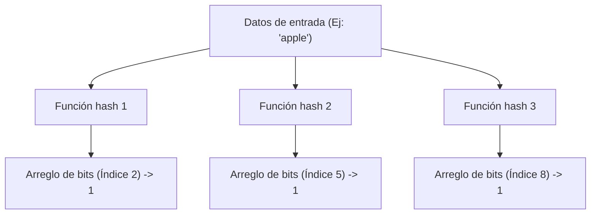
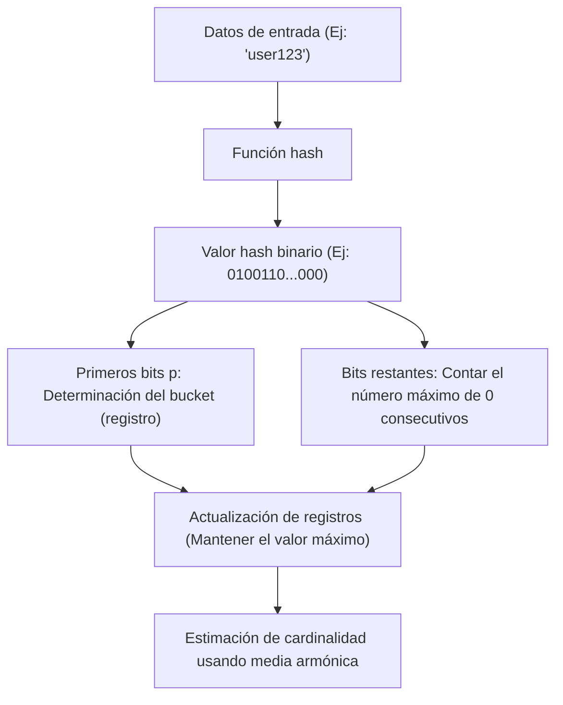

# Las maravillas de las estructuras de datos probabilísticas: Bloom Filter y HyperLogLog

En la era del big data, la cantidad de datos que manejamos está creciendo de manera explosiva. Servicios web con millones de accesos por segundo, redes sociales con miles de millones de usuarios, o el flujo constante de datos generados por sensores IoT. Al procesar tal cantidad de datos, uno de los mayores obstáculos a los que nos enfrentamos es el "límite de memoria".

Si utilizamos estructuras de datos tradicionales (como tablas hash o árboles binarios de búsqueda) e intentamos mantener todos los elementos con precisión en la memoria para realizar búsquedas o conteos, la memoria se agotaría rápidamente. Guardar decenas de miles de millones de ID únicos en su totalidad para determinar "¿ya existe este ID?" o contar "¿cuántos ID únicos existen?" es extremadamente difícil desde el punto de vista de los recursos físicos.

Para resolver este problema, se crearon las **estructuras de datos probabilísticas (Probabilistic Data Structures)**. Las estructuras de datos probabilísticas son algoritmos que sacrifican el "100% de precisión" a cambio de un "consumo de memoria extremadamente bajo" y una "velocidad de procesamiento rápida". En casos de uso donde se puede tolerar un cierto margen de error (falsos positivos o valores aproximados), estas demuestran tener un efecto mágico.

En este artículo, profundizaremos en dos de los algoritmos más famosos y prácticos entre estas estructuras de datos probabilísticas, el **Bloom Filter** y el **HyperLogLog**, explorando sus increíbles mecanismos, antecedentes matemáticos y casos de uso en el mundo real.

---

## Bloom Filter: Ahorro de memoria en la verificación de existencia

### ¿Qué es un Bloom Filter?
Un Bloom Filter es una estructura de datos probabilística ideada por Burton Howard Bloom en 1970, y se utiliza para determinar "si un determinado elemento está incluido en un conjunto" a alta velocidad y con bajo consumo de memoria.

Las características principales de un Bloom Filter son las siguientes:
1. **Si se determina que un elemento "existe", esto significa que "probablemente exista" (existe la posibilidad de un falso positivo: False Positive).**
2. **Si se determina que un elemento "no existe", esto significa que "definitivamente no existe" (absolutamente no hay falsos negativos: False Negative).**

En otras palabras, un Bloom Filter puede afirmar con certeza que algo "absolutamente no existe", pero si dice que "existe", hay una pequeña posibilidad de que esté equivocado. Aprovechando esta propiedad, se utiliza ampliamente como un "filtro previo" para evitar accesos innecesarios a bases de datos gigantes.

### Mecanismo de un Bloom Filter

La esencia de un Bloom Filter es un arreglo de bits de longitud $m$ (con todos los valores iniciales en 0) y $k$ funciones hash diferentes.

#### Adición de elementos (Add)
Al agregar un elemento, este se ingresa en las $k$ funciones hash. Cada función hash genera un índice desde $0$ hasta $m-1$. Luego, las posiciones de esos índices en el arreglo de bits se establecen en `1`. Incluso si múltiples funciones hash apuntan al mismo índice o si ya se había establecido en `1` por otro elemento, simplemente se sobrescribe con `1` (es decir, permanece en `1`).

#### Búsqueda de elementos (Check)
Al comprobar si existe un elemento, se ingresa el elemento en las $k$ funciones hash del mismo modo que al agregarlo. Luego, se verifica el valor en el arreglo de bits para todos los índices generados.
- **Si todos son `1`:** Se determina que el elemento "probablemente existe".
- **Si hay aunque sea un `0`:** Se determina que el elemento "definitivamente no existe".

¿Por qué "probablemente existe"? Esto se debe a que, aunque el elemento que queremos buscar nunca se haya agregado, los resultados de agregar otros elementos podrían hacer que accidentalmente los índices del valor hash de ese elemento se hayan establecido todos en `1`. Esta es la naturaleza de los "falsos positivos (False Positives)".

### Tasa de falsos positivos y optimización de parámetros

Al diseñar un Bloom Filter, el equilibrio entre la longitud del arreglo de bits $m$, el número esperado de elementos a agregar $n$ y el número de funciones hash $k$ es crucial.

La tasa de falsos positivos $p$ se aproxima usando la siguiente fórmula:
$$ p \approx (1 - e^{-kn/m})^k $$

Como muestra esta fórmula, cuanto más grande sea el arreglo de bits (aumentando $m$), menor será la tasa de falsos positivos, y a medida que aumenta el número de elementos ($n$), la tasa de falsos positivos se eleva. Además, el número óptimo de funciones hash $k$ se puede calcular con la siguiente fórmula:
$$ k = \frac{m}{n} \ln 2 $$

Por ejemplo, asumiendo que se agregarán 100 millones de elementos y queriendo mantener la tasa de falsos positivos al 1% (0.01), podemos calcular el tamaño de memoria requerido ($m$) y el número óptimo de funciones hash ($k$). Como resultado, se hace posible la verificación de existencia para 100 millones de elementos con solo unos 120 MB de memoria y 7 funciones hash. Si intentáramos implementar esto con una tabla hash, requeriría desde varios gigabytes hasta más de diez gigabytes de memoria.

### Casos de uso de un Bloom Filter

El Bloom Filter es una herramienta poderosa en sistemas backend y bases de datos para eliminar procesos innecesarios.

1. **Redución de E/S de disco en bases de datos (Cassandra, HBase, etc.):**
   Al verificar si existen datos correspondientes a una clave específica, se consulta al Bloom Filter en la memoria antes de acceder al disco. Si determina que "no existe", se puede omitir el acceso al disco por completo, mejorando drásticamente el rendimiento.
2. **CDN y sistemas de caché:**
   Para evitar almacenar en caché "One-hit Wonders" (recursos a los que solo se accede una vez), se utiliza un Bloom Filter. El primer acceso simplemente se registra en el Bloom Filter sin almacenarlo en caché, y solo al segundo acceso (si el Bloom Filter indica que existe) se almacena en caché, lo que aumenta la eficiencia de memoria del caché.
3. **Filtrado de URL maliciosas:**
   Cuando un navegador verifica en contra de una lista de sitios web maliciosos, utiliza un Bloom Filter en lugar de descargar la lista completa. Solo se realizan consultas detalladas al servidor si el Bloom Filter determina que "existe (posiblemente sea malicioso)".

---

## HyperLogLog: El pináculo de la estimación de la cardinalidad

### ¿Qué es HyperLogLog?
Mientras que el Bloom Filter se especializa en "verificar la existencia de elementos", el **HyperLogLog (HLL)** es una estructura de datos probabilística especializada en "estimar la cardinalidad (el número de elementos únicos)". Fue presentado por Flajolet y sus colegas en 2007.

Por ejemplo, suponga que desea calcular "¿Cuántos usuarios únicos (UU) han visitado este sitio web?". Normalmente, necesitaría guardar todos los ID de usuario en una estructura de datos como un Conjunto (Set) y medir su tamaño. Sin embargo, a la escala de Google o Twitter, el número de elementos únicos alcanza miles de millones y decenas de miles de millones, siendo imposible mantener todo en memoria.

HyperLogLog es un algoritmo verdaderamente mágico que puede realizar este cálculo utilizando **solo unos pocos kilobytes (aproximadamente 12 KB, etc.)** de memoria, con un pequeño margen de error de un pequeño porcentaje (error estándar de aprox. 0.81%).

### Modelo matemático de lanzamiento de monedas y probabilidad

Para entender cómo funciona HyperLogLog, primero consideremos un "modelo de lanzamiento de moneda" intuitivo.

Suponga que lanza una moneda y cuenta el número de veces que sale "cara" consecutivamente.
- Probabilidad de que salga cruz en el primer intento: 1/2
- Probabilidad de que salgan 2 caras seguidas y cruz en el tercer intento: 1/8
- Probabilidad de que salgan caras $k$ veces seguidas: $1/2^k$

Si alguien le dice "Lanzé una moneda y salieron caras 10 veces seguidas", podría adivinar que "deben haber lanzado la moneda un gran número de veces (aproximadamente $2^{10} = 1024$ veces)". Porque la probabilidad de sacar 10 caras seguidas en un número bajo de intentos es extremadamente baja.

HyperLogLog aplica esta propiedad de que "la probabilidad de un patrón específico consecutivo depende del número de intentos" a los valores hash de los datos.

### Algoritmo HyperLogLog

1. **Hashing de datos:**
   Se pasan los datos de entrada (como un ID de usuario) a través de una función hash para obtener un número binario largo distribuido uniformemente (ej. 64 bits).
2. **División de buckets (registros):**
   Para reducir la varianza, se utilizan los primeros $p$ bits del valor hash para distribuir los datos en $m = 2^p$ buckets (registros).
3. **Conteo de 0 consecutivos:**
   Para los bits restantes del valor hash, se cuenta "cuántos 0 continuos hay desde el principio". A esto lo llamaremos $\rho(x)$. Es el equivalente al "número de veces consecutivas que sale cara" al lanzar una moneda.
4. **Actualización de registros:**
   En cada bucket (registro), solo se guarda el **valor máximo** de $\rho(x)$ observado hasta ahora.
5. **Cálculo de la estimación mediante media armónica:**
   A partir de los valores máximos de todos los registros, se estima la cardinalidad total. Debido a que una media aritmética simple se vería fuertemente afectada por valores atípicos (un número excepcionalmente largo de ceros consecutivos por azar), HyperLogLog utiliza la **media armónica (Harmonic Mean)**.

La fórmula para calcular el valor estimado $E$ es la siguiente:
$$ E = \alpha_m \cdot m^2 \cdot \left( \sum_{j=1}^{m} 2^{-M[j]} \right)^{-1} $$
Donde $m$ es el número de buckets, $M[j]$ es el valor máximo guardado en el $j$-ésimo registro, y $\alpha_m$ es una constante para corregir el sesgo.

### Increíble eficiencia de memoria

La maravilla del HyperLogLog radica en su extrema eficiencia de memoria.
Por ejemplo, si $p = 14$, el número de buckets será de $2^{14} = 16384$. Cuando se utiliza un hash de 64 bits, el número máximo de ceros consecutivos es como máximo 64, por lo que el tamaño de un registro para guardar eso es de solo 6 bits ($2^6 = 64$).

Consumo total de memoria:
$$ 16384 \text{ registros} \times 6 \text{ bits} = 98304 \text{ bits} = 12288 \text{ bytes} \approx 12 \text{ KB} $$

Con solo estos 12 KB de memoria, puede estimar el número de elementos únicos de cientos de millones o miles de millones con un error menor al 1%. En comparación con una estructura de datos Set regular que consumiría cientos de GB de memoria, la diferencia es literalmente de otra dimensión.

### Casos de uso de HyperLogLog

HyperLogLog se ha convertido en una tecnología indispensable en la infraestructura de análisis de big data.

1. **Conteo de usuarios únicos (UU) en tiempo real:**
   Se utiliza en herramientas de análisis y paneles para contar el número de visitantes o espectadores en tiempo real. En sistemas in-memory KVS como Redis, HyperLogLog está implementado de forma estándar mediante comandos como `PFADD` y `PFCOUNT`.
2. **Análisis y agregación de enormes conjuntos de datos:**
   En motores de SQL distribuido como BigQuery, Amazon Redshift o Presto, se utiliza HyperLogLog (o sus derivados) para acelerar consultas como `COUNT(DISTINCT column_name)`.
3. **Gestión de estado en procesamiento de streams:**
   En frameworks de procesamiento de flujos de datos como Apache Kafka y Apache Flink, se emplea para calcular la cardinalidad de flujos de datos infinitos sin agotar la memoria.

---

## Conclusión: Los avances que traen las aproximaciones

Tanto Bloom Filter como HyperLogLog han roto el "muro de memoria" en las ciencias de la computación aceptando la concesión de "renunciar a la precisión del 100%".

- **Bloom Filter** actúa como un guardián de grandes almacenes de datos previniendo accesos innecesarios al distinguir entre "probablemente existe" y "definitivamente no existe".
- **HyperLogLog** cuenta elementos tan numerosos como las estrellas del universo con solo unos pocos kilobytes de memoria al combinar hábilmente la naturaleza probabilística del lanzamiento de monedas con la media armónica.

Detrás de los servicios web de alta velocidad que damos por sentado todos los días y los sistemas de análisis de big data que devuelven resultados en segundos, se esconden estos hermosos modelos matemáticos y el ingenio de la ingeniería de las estructuras de datos probabilísticas. El poder de los algoritmos a veces nos brinda avances que trascienden los límites físicos (capacidad de memoria).
