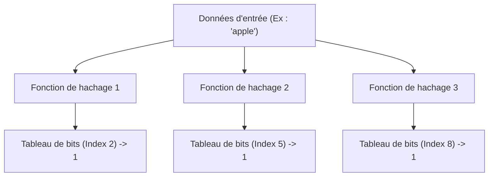
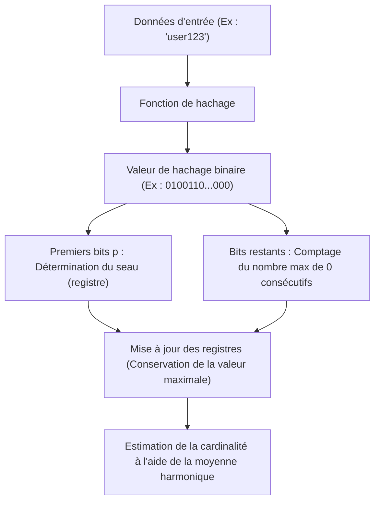

# Les merveilles des structures de données probabilistes : Bloom Filter et HyperLogLog

À l'ère du Big Data, le volume de données que nous manipulons connaît une croissance explosive. Des services web avec des millions d'accès par seconde, des réseaux sociaux comptant des milliards d'utilisateurs, ou des flux continus de données générés par des capteurs IoT. Lors du traitement d'une telle quantité de données, l'un des plus grands obstacles auxquels nous sommes confrontés est la « limite de mémoire ».

Si nous utilisons des structures de données traditionnelles (telles que des tables de hachage ou des arbres binaires de recherche) pour conserver tous les éléments avec précision en mémoire pour la recherche et le comptage, la mémoire s'épuiserait rapidement. Enregistrer des dizaines de milliards d'ID uniques en totalité pour déterminer « cet ID existe-t-il déjà ? » ou compter « combien de types d'ID uniques existent ? » est extrêmement difficile du point de vue des ressources physiques.

Les **structures de données probabilistes (Probabilistic Data Structures)** ont été créées pour résoudre ce problème. Les structures de données probabilistes sont des algorithmes qui sacrifient « 100 % d'exactitude » en échange d'une « consommation de mémoire extrêmement faible » et d'une « vitesse de traitement rapide ». Dans les cas d'utilisation où une légère marge d'erreur (faux positifs ou valeurs approximatives) est acceptable, elles offrent des résultats presque magiques.

Dans cet article, nous plongerons au cœur de deux des algorithmes les plus célèbres et pratiques parmi ces structures de données probabilistes, le **Bloom Filter** et l'**HyperLogLog**, en explorant leurs incroyables mécanismes, leurs fondements mathématiques et leurs cas d'utilisation réels.

---

## Bloom Filter : Économie de mémoire dans la vérification d'existence

### Qu'est-ce qu'un Bloom Filter ?
Un Bloom Filter est une structure de données probabiliste inventée par Burton Howard Bloom en 1970, utilisée pour déterminer « si un certain élément est inclus dans un ensemble » à grande vitesse et avec une faible consommation de mémoire.

Les principales caractéristiques d'un Bloom Filter sont les suivantes :
1. **Si un élément est déterminé comme « existant », cela signifie qu'il « existe probablement » (possibilité de faux positif : False Positive).**
2. **Si un élément est déterminé comme « inexistant », cela signifie qu'il « n'existe absolument pas » (il n'y a absolument aucun faux négatif : False Negative).**

En d'autres termes, un Bloom Filter peut affirmer avec certitude que quelque chose « n'existe pas », mais s'il dit que quelque chose « existe », il y a une faible possibilité qu'il se trompe. En tirant parti de cette propriété, il est largement utilisé comme « filtre préalable » pour empêcher les accès inutiles à d'énormes bases de données.

### Mécanisme d'un Bloom Filter

L'essence d'un Bloom Filter est un tableau de bits de longueur $m$ (avec toutes les valeurs initiales à 0) et $k$ fonctions de hachage différentes.

#### Ajout d'éléments (Add)
Lors de l'ajout d'un élément, celui-ci est passé par les $k$ fonctions de hachage. Chaque fonction de hachage génère un index de $0$ à $m-1$. Ensuite, les positions de ces index dans le tableau de bits sont définies sur `1`. Même si plusieurs fonctions de hachage pointent vers le même index ou s'il a déjà été défini sur `1` par un autre élément, il est simplement écrasé par `1` (c'est-à-dire qu'il reste à `1`).

#### Recherche d'éléments (Check)
Lors de la vérification de l'existence d'un élément, l'élément est passé dans les $k$ fonctions de hachage, tout comme lors de l'ajout. Ensuite, la valeur dans le tableau de bits est vérifiée pour tous les index générés.
- **Si tous sont à `1` :** L'élément est déterminé comme « existant probablement ».
- **S'il y a un seul `0` :** L'élément est déterminé comme « n'existant absolument pas ».

Pourquoi « existe probablement » ? C'est parce que, même si l'élément que vous souhaitez vérifier n'a jamais été ajouté, l'ajout d'autres éléments a pu par coïncidence définir tous les index de valeur de hachage de cet élément à `1`. C'est la nature des « faux positifs (False Positives) ».

### Taux de faux positifs et optimisation des paramètres

Lors de la conception d'un Bloom Filter, l'équilibre entre la longueur du tableau de bits $m$, le nombre attendu d'éléments à ajouter $n$, et le nombre de fonctions de hachage $k$ est crucial.

Le taux de faux positifs $p$ est approximé par la formule suivante :
$$ p \approx (1 - e^{-kn/m})^k $$

Comme le montre cette formule, plus le tableau de bits est grand (augmentation de $m$), plus le taux de faux positifs diminue, et plus le nombre d'éléments ($n$) augmente, plus le taux de faux positifs augmente. De plus, le nombre optimal de fonctions de hachage $k$ peut être calculé avec la formule suivante :
$$ k = \frac{m}{n} \ln 2 $$

Par exemple, en supposant que 100 millions d'éléments seront ajoutés et que l'on souhaite maintenir le taux de faux positifs à 1 % (0,01), nous pouvons calculer la taille de mémoire requise ($m$) et le nombre optimal de fonctions de hachage ($k$). En conséquence, il est possible de vérifier l'existence de 100 millions d'éléments avec seulement environ 120 Mo de mémoire et 7 fonctions de hachage. Si nous essayions de l'implémenter avec une table de hachage, cela nécessiterait de plusieurs gigaoctets à plus d'une dizaine de gigaoctets de mémoire.

### Cas d'utilisation d'un Bloom Filter

Le Bloom Filter est une arme puissante dans les systèmes backend et les bases de données pour éliminer les traitements inutiles.

1. **Réduction des E/S disque des bases de données (Cassandra, HBase, etc.) :**
   Lors de la vérification de l'existence de données correspondant à une clé spécifique, on interroge le Bloom Filter en mémoire avant d'accéder au disque. S'il détermine que la donnée « n'existe pas », l'accès au disque peut être totalement ignoré, améliorant ainsi considérablement les performances.
2. **CDN et systèmes de cache :**
   Pour éviter de mettre en cache les « One-hit Wonders » (ressources auxquelles on n'accède qu'une seule fois), on utilise un Bloom Filter. Le premier accès est simplement enregistré dans le Bloom Filter sans être mis en cache, et c'est seulement au deuxième accès (si le Bloom Filter indique qu'il existe) qu'il est mis en cache, ce qui augmente l'efficacité de la mémoire du cache.
3. **Filtrage d'URL malveillantes :**
   Lorsqu'un navigateur effectue une vérification par rapport à une liste de sites web malveillants, il utilise un Bloom Filter au lieu de télécharger toute la liste. Les requêtes détaillées au serveur ne sont effectuées que si le Bloom Filter détermine que le site « existe (est potentiellement malveillant) ».

---

## HyperLogLog : Le summum de l'estimation de la cardinalité

### Qu'est-ce que l'HyperLogLog ?
Alors que le Bloom Filter est spécialisé dans « la vérification de l'existence d'éléments », l'**HyperLogLog (HLL)** est une structure de données probabiliste spécialisée dans « l'estimation de la cardinalité (le nombre d'éléments uniques) ». Il a été introduit par Flajolet et ses collègues en 2007.

Par exemple, supposons que vous vouliez calculer : « Combien d'utilisateurs uniques (UU) ont visité ce site web ? ». Normalement, vous devriez enregistrer tous les ID utilisateur dans une structure de données telle qu'un Ensemble (Set) et mesurer sa taille. Cependant, à l'échelle de Google ou de Twitter, le nombre d'éléments uniques atteint des milliards et des dizaines de milliards, ce qui rend impossible leur maintien en mémoire.

HyperLogLog est un algorithme véritablement magique qui peut effectuer ce calcul en utilisant **seulement quelques kilo-octets (environ 12 Ko, par exemple)** de mémoire, avec une petite marge d'erreur de quelques pour cent (erreur type d'environ 0,81 %).

### Modèle mathématique du tirage à pile ou face et probabilités

Pour comprendre le fonctionnement de l'HyperLogLog, considérons d'abord un « modèle de tirage à pile ou face » intuitif.

Supposons que vous lanciez une pièce de monnaie et comptiez le nombre de fois où vous obtenez consécutivement « face ».
- Probabilité d'obtenir pile au premier essai : 1/2
- Probabilité d'obtenir face deux fois de suite, puis pile au troisième : 1/8
- Probabilité d'obtenir face $k$ fois de suite : $1/2^k$

Si quelqu'un vous dit : « J'ai lancé une pièce et j'ai obtenu face 10 fois de suite », vous pourriez deviner que cette personne « a dû lancer la pièce un grand nombre de fois (environ $2^{10} = 1024$ fois) ». En effet, la probabilité d'obtenir 10 faces consécutives sur un petit nombre de lancers est extrêmement faible.

HyperLogLog applique cette propriété, à savoir que « la probabilité d'une séquence spécifique continue dépend du nombre d'essais », aux valeurs de hachage des données.

### L'algorithme HyperLogLog

1. **Hachage des données :**
   Les données d'entrée (comme un ID utilisateur) passent par une fonction de hachage pour obtenir un long nombre binaire uniformément distribué (par ex. 64 bits).
2. **Division en seaux (registres) :**
   Pour réduire la variance, les $p$ premiers bits de la valeur de hachage sont utilisés pour répartir les données dans $m = 2^p$ seaux (registres).
3. **Comptage des 0 consécutifs :**
   Pour les bits restants de la valeur de hachage, on compte « combien de 0 continus il y a depuis le début ». Nous appellerons cela $\rho(x)$. C'est l'équivalent du « nombre de fois consécutives où l'on obtient face » lors du lancer de la pièce.
4. **Mise à jour des registres :**
   Dans chaque seau (registre), on ne conserve que la **valeur maximale** de $\rho(x)$ observée jusqu'à présent.
5. **Calcul de l'estimation par moyenne harmonique :**
   À partir des valeurs maximales de tous les registres, on estime la cardinalité totale. Étant donné qu'une simple moyenne arithmétique serait fortement affectée par des valeurs aberrantes (un nombre exceptionnellement long de zéros consécutifs par hasard), l'HyperLogLog utilise la **moyenne harmonique (Harmonic Mean)**.

La formule pour calculer la valeur estimée $E$ est la suivante :
$$ E = \alpha_m \cdot m^2 \cdot \left( \sum_{j=1}^{m} 2^{-M[j]} \right)^{-1} $$
Où $m$ est le nombre de seaux, $M[j]$ est la valeur maximale stockée dans le $j$-ème registre, et $\alpha_m$ est une constante pour corriger le biais.

### Une efficacité de mémoire incroyable

La merveille de l'HyperLogLog réside dans son extrême efficacité de la mémoire.
Par exemple, si $p = 14$, le nombre de seaux sera de $2^{14} = 16384$. Lors de l'utilisation d'un hachage de 64 bits, le nombre maximum de zéros consécutifs est au plus de 64, donc la taille d'un registre pour enregistrer cela n'est que de 6 bits ($2^6 = 64$).

Consommation totale de mémoire :
$$ 16384 \text{ registres} \times 6 \text{ bits} = 98304 \text{ bits} = 12288 \text{ octets} \approx 12 \text{ Ko} $$

Avec seulement ces 12 Ko de mémoire, vous pouvez estimar le nombre d'éléments uniques parmi des centaines de millions ou des milliards avec une erreur de moins de 1 %. Comparé à une structure de données Set ordinaire qui consommerait des centaines de Go de mémoire, la différence se situe littéralement dans une autre dimension.

### Cas d'utilisation de l'HyperLogLog

L'HyperLogLog est devenu une technologie indispensable dans les infrastructures d'analyse du Big Data.

1. **Comptage d'utilisateurs uniques (UU) en temps réel :**
   Il est utilisé dans les outils d'analyse et les tableaux de bord pour compter le nombre de visiteurs ou de spectateurs en temps réel. Dans les systèmes KVS en mémoire comme Redis, l'HyperLogLog est implémenté en standard avec des commandes comme `PFADD` and `PFCOUNT`.
2. **Analyse et agrégation d'énormes jeux de données :**
   Dans les moteurs SQL distribués comme BigQuery, Amazon Redshift ou Presto, l'HyperLogLog (ou ses dérivés) est utilisé pour accélérer des requêtes telles que `COUNT(DISTINCT column_name)`.
3. **Gestion d'état dans le traitement des flux (Stream processing) :**
   Dans les frameworks de traitement de flux de données tels qu'Apache Kafka et Apache Flink, il est utilisé pour calculer la cardinalité des flux de données infinis sans épuiser la mémoire.

---

## Conclusion : Les percées apportées par l'approximation

Le Bloom Filter et l'HyperLogLog ont tous deux franchi le « mur de la mémoire » en informatique en acceptant le compromis de « renoncer à une précision de 100 % ».

- Le **Bloom Filter** agit comme un gardien pour d'immenses magasins de données en empêchant les accès inutiles par la distinction entre ce qui « existe probablement » et ce qui « n'existe absolument pas ».
- L'**HyperLogLog** compte des éléments aussi nombreux que les étoiles dans l'univers avec seulement quelques kilo-octets de mémoire, en combinant habilement la nature probabiliste du lancer de pièces avec la moyenne harmonique.

Derrière les services web à grande vitesse que nous tenons pour acquis au quotidien et les systèmes d'analyse Big Data qui renvoient des résultats en quelques secondes, se cachent ces magnifiques modèles mathématiques et l'ingéniosité des structures de données probabilistes. La puissance des algorithmes nous offre parfois des percées qui transcendent même les limites physiques (la capacité de mémoire).
