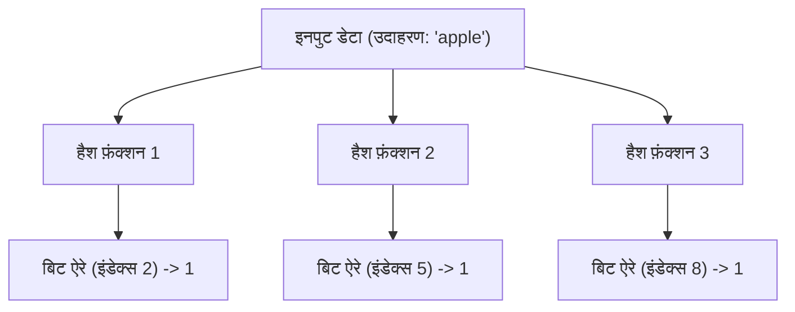
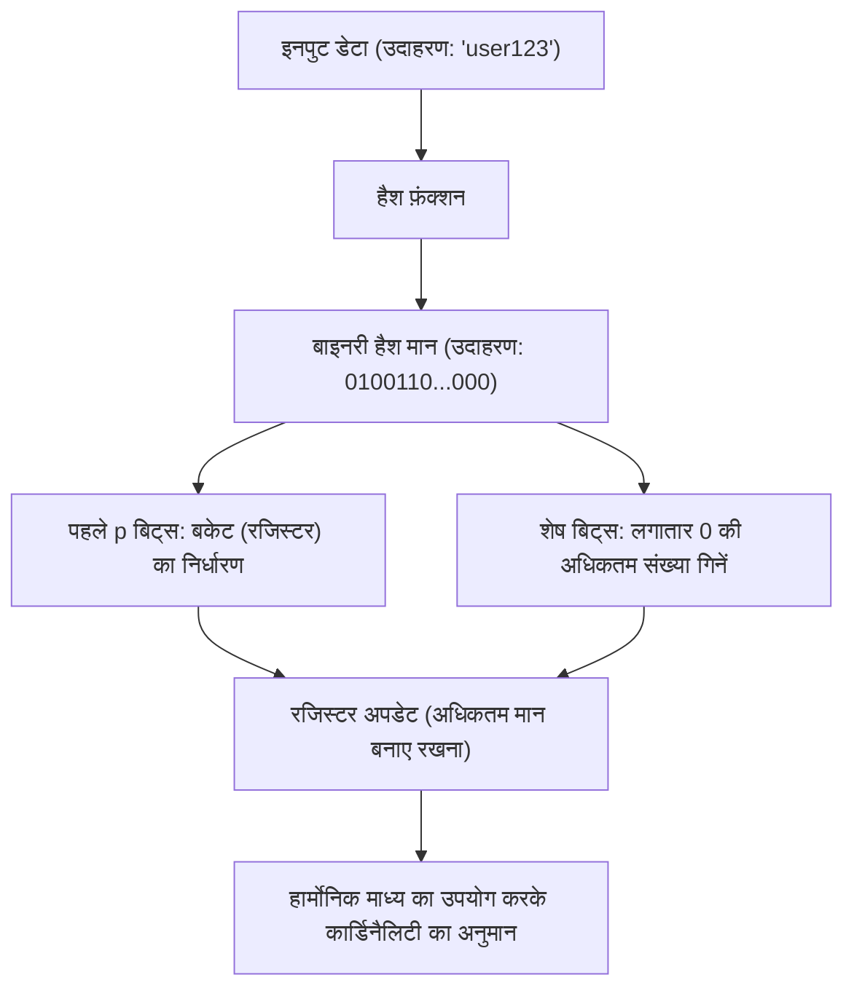

# संभाव्य डेटा संरचनाओं के चमत्कार: Bloom Filter और HyperLogLog

बिग डेटा के युग में, हमारे द्वारा प्रबंधित किए जाने वाले डेटा की मात्रा विस्फोटक रूप से बढ़ रही है। वेब सेवाएँ जिन पर प्रति सेकंड लाखों एक्सेस होते हैं, अरबों उपयोगकर्ताओं वाले सोशल नेटवर्क, या IoT सेंसर द्वारा लगातार उत्पन्न डेटा स्ट्रीम। इतनी बड़ी मात्रा में डेटा को प्रोसेस करते समय, हमारे सामने आने वाली सबसे बड़ी बाधाओं में से एक "मेमोरी की सीमा" है。

यदि हम पारंपरिक डेटा संरचनाओं (जैसे हैश टेबल या बाइनरी सर्च ट्री) का उपयोग करते हैं और खोज या गिनती करने के लिए सभी तत्वों को मेमोरी में सटीकता के साथ रखने का प्रयास करते हैं, तो मेमोरी जल्दी खत्म हो जाएगी। भौतिक संसाधनों के दृष्टिकोण से यह निर्धारित करने के लिए कि "क्या यह आईडी पहले से मौजूद है?" या यह गिनने के लिए कि "कितने अद्वितीय (unique) आईडी मौजूद हैं?" दसियों अरबों अद्वितीय आईडी को पूरी तरह से सहेजना अत्यंत कठिन है।

इस समस्या को हल करने के लिए **संभाव्य डेटा संरचनाएँ (Probabilistic Data Structures)** बनाई गई थीं। संभाव्य डेटा संरचनाएँ ऐसे एल्गोरिदम हैं जो "अत्यंत कम मेमोरी खपत" और "तीव्र प्रोसेसिंग गति" के बदले "100% सटीकता" का त्याग करते हैं। उन उपयोग मामलों (use cases) में जहाँ त्रुटि के एक छोटे अंतर (जैसे फ़ॉल्स पज़िटिव या अनुमानित मान) को सहन किया जा सकता है, वे जादुई प्रभाव दिखाते हैं।

इस लेख में, हम इन संभाव्य डेटा संरचनाओं में से दो सबसे प्रसिद्ध और व्यावहारिक एल्गोरिदम, **Bloom Filter** और **HyperLogLog** की गहराई में जाएंगे, और उनके अद्भुत तंत्र, गणितीय पृष्ठभूमि और वास्तविक दुनिया के उपयोग मामलों का पता लगाएंगे।

---

## Bloom Filter: अस्तित्व की जाँच में मेमोरी की बचत

### Bloom Filter क्या है?
Bloom Filter एक संभाव्य डेटा संरचना है जिसे 1970 में बर्टन हॉवर्ड ब्लूम द्वारा तैयार किया गया था, और इसका उपयोग उच्च गति और कम मेमोरी खपत के साथ यह निर्धारित करने के लिए किया जाता है कि "क्या कोई निश्चित तत्व किसी सेट में शामिल है या नहीं"।

Bloom Filter की मुख्य विशेषताएं इस प्रकार हैं:
1. **यदि किसी तत्व के "मौजूद" होने का निर्धारण किया जाता है, तो इसका अर्थ है कि यह "शायद मौजूद है" (फ़ॉल्स पज़िटिव की संभावना: False Positive)।**
2. **यदि किसी तत्व के "मौजूद नहीं" होने का निर्धारण किया जाता है, तो इसका अर्थ है कि यह "निश्चित रूप से मौजूद नहीं है" (फ़ॉल्स नेगेटिव की बिल्कुल संभावना नहीं है: False Negative)।**

दूसरे शब्दों में, एक Bloom Filter निश्चितता के साथ कह सकता है कि कोई चीज़ "बिल्कुल मौजूद नहीं है", लेकिन यदि यह कहता है कि कोई चीज़ "मौजूद है", तो इस बात की थोड़ी संभावना है कि वह गलत हो। इस गुण का लाभ उठाते हुए, इसका व्यापक रूप से विशाल डेटाबेस तक अनावश्यक पहुंच को रोकने के लिए "प्री-फ़िल्टर" के रूप में उपयोग किया जाता है।

### Bloom Filter का तंत्र

Bloom Filter का मूल रूप से $m$ लंबाई की एक बिट ऐरे (प्रारंभिक मान सभी 0 हैं) और $k$ भिन्न हैश फ़ंक्शन होते हैं।

#### तत्व जोड़ना (Add)
तत्व जोड़ते समय, तत्व को $k$ हैश फ़ंक्शंस में इनपुट किया जाता है। प्रत्येक हैश फ़ंक्शन $0$ से $m-1$ तक एक इंडेक्स आउटपुट करता है। फिर, बिट ऐरे में उन इंडेक्स की स्थिति `1` पर सेट कर दी जाती है। भले ही कई हैश फ़ंक्शन एक ही इंडेक्स की ओर इशारा करते हों या यह किसी अन्य तत्व द्वारा पहले से ही `1` पर सेट कर दिया गया हो, इसे बस `1` के साथ ओवरराइट किया जाता है (यानी यह `1` ही रहता है)।

#### तत्व खोजना (Check)
किसी तत्व के अस्तित्व की जाँच करते समय, तत्व को $k$ हैश फ़ंक्शंस में उसी तरह इनपुट किया जाता है जैसे जोड़ते समय किया जाता है। फिर, उत्पन्न सभी इंडेक्स के लिए बिट ऐरे में मान की जाँच की जाती है।
- **यदि सभी `1` हैं:** तो तत्व "शायद मौजूद है" माना जाता है।
- **यदि एक भी `0` शामिल है:** तो तत्व को "निश्चित रूप से मौजूद नहीं है" माना जाता है।

"शायद मौजूद है" ऐसा क्यों है? इसका कारण यह है कि भले ही आप जिस तत्व की खोज करना चाहते हैं, उसे कभी जोड़ा न गया हो, अन्य तत्वों को जोड़ने के परिणामस्वरूप उस तत्व के हैश मान के इंडेक्स संयोग से सभी `1` पर सेट हो सकते हैं। यही "फ़ॉल्स पज़िटिव (False Positives)" की प्रकृति है।

### फ़ॉल्स पज़िटिव दर और पैरामीटर अनुकूलन

Bloom Filter डिज़ाइन करते समय, बिट ऐरे की लंबाई $m$, जोड़े जाने वाले तत्वों की अपेक्षित संख्या $n$, और हैश फ़ंक्शंस की संख्या $k$ के बीच का संतुलन महत्वपूर्ण है।

फ़ॉल्स पज़िटिव दर $p$ का अनुमान निम्नलिखित सूत्र द्वारा लगाया जाता है:
$$ p \approx (1 - e^{-kn/m})^k $$

जैसा कि इस सूत्र से पता चलता है, बिट ऐरे जितना बड़ा होगा ($m$ बढ़ाने पर), फ़ॉल्स पज़िटिव दर उतनी ही कम होगी, और तत्वों की संख्या ($n$) बढ़ने पर फ़ॉल्स पज़िटिव दर बढ़ जाएगी। इसके अलावा, इष्टतम हैश फ़ंक्शन $k$ की संख्या की गणना निम्नलिखित सूत्र से की जा सकती है:
$$ k = \frac{m}{n} \ln 2 $$

उदाहरण के लिए, यह मानकर कि 100 मिलियन तत्व जोड़े जाएंगे और हम फ़ॉल्स पज़िटिव दर को 1% (0.01) पर रखना चाहते हैं, हम आवश्यक मेमोरी आकार ($m$) और इष्टतम हैश फ़ंक्शंस ($k$) की संख्या की गणना कर सकते हैं। परिणामस्वरूप, केवल लगभग 120 एमबी मेमोरी और 7 हैश फ़ंक्शंस के साथ 100 मिलियन तत्वों के अस्तित्व की जाँच संभव हो जाती है। यदि हम इसे हैश टेबल के साथ लागू करने का प्रयास करते हैं, तो इसमें कई गीगाबाइट से लेकर दस गीगाबाइट से अधिक मेमोरी की आवश्यकता होगी।

### Bloom Filter के उपयोग के मामले

अनावश्यक प्रसंस्करण (processing) को खत्म करने के लिए बैकएंड सिस्टम और डेटाबेस में Bloom Filter एक शक्तिशाली हथियार है।

1. **डेटाबेस डिस्क I/O में कमी (Cassandra, HBase आदि):**
   यह जाँचते समय कि किसी विशिष्ट कुंजी (key) के अनुरूप डेटा मौजूद है या नहीं, डिस्क तक पहुँचने से पहले इन-मेमोरी Bloom Filter से पूछताछ की जाती है। यदि यह निर्धारित होता है कि डेटा "मौजूद नहीं है", तो डिस्क एक्सेस को पूरी तरह से छोड़ा जा सकता है, जिससे प्रदर्शन में नाटकीय रूप से सुधार होता है।
2. **CDN और कैश (Cache) सिस्टम:**
   "वन-हिट वंडर्स" (संसाधन जिन्हें केवल एक बार एक्सेस किया जाता है) को कैशिंग करने से बचने के लिए, एक Bloom Filter का उपयोग किया जाता है। पहले एक्सेस को कैश किए बिना केवल Bloom Filter में रिकॉर्ड किया जाता है, और केवल दूसरे एक्सेस पर (यदि Bloom Filter इंगित करता है कि यह मौजूद है) इसे कैश किया जाता है, जो कैश की मेमोरी दक्षता को बढ़ाता है।
3. **दुर्भावनापूर्ण URL की फ़िल्टरिंग:**
   जब कोई ब्राउज़र दुर्भावनापूर्ण वेबसाइटों की सूची की जाँच करता है, तो पूरी सूची डाउनलोड करने के बजाय वह Bloom Filter का उपयोग करता है। सर्वर से विस्तृत पूछताछ केवल तभी की जाती है जब Bloom Filter निर्धारित करता है कि साइट "मौजूद है (संभावित रूप से दुर्भावनापूर्ण है)"।

---

## HyperLogLog: कार्डिनैलिटी (Cardinality) अनुमान का शिखर

### HyperLogLog क्या है?
जबकि Bloom Filter "तत्वों के अस्तित्व की जाँच" में माहिर है, **HyperLogLog (HLL)** एक संभाव्य डेटा संरचना है जो "कार्डिनैलिटी का अनुमान लगाने (अद्वितीय तत्वों की संख्या)" में विशिष्ट है। इसे 2007 में Flajolet और उनके सहयोगियों द्वारा पेश किया गया था।

उदाहरण के लिए, मान लें कि आप गणना करना चाहते हैं: "कितने अद्वितीय उपयोगकर्ताओं (UU) ने इस वेबसाइट का दौरा किया है?" आम तौर पर, आपको सभी उपयोगकर्ता आईडी को सेट (Set) जैसी डेटा संरचना में सहेजना होगा और उसके आकार को मापना होगा। हालाँकि, Google या Twitter के पैमाने पर, अद्वितीय तत्वों की संख्या अरबों और दसियों अरबों तक पहुँच जाती है, जिससे सब कुछ मेमोरी में रखना असंभव हो जाता है।

HyperLogLog एक वास्तव में जादुई एल्गोरिदम है जो कुछ प्रतिशत की छोटी त्रुटि (लगभग 0.81% की मानक त्रुटि) के साथ, मेमोरी के **केवल कुछ किलोबाइट (जैसे लगभग 12 KB)** का उपयोग करके इस गणना को निष्पादित कर सकता है।

### सिक्का उछालने का गणितीय मॉडल और प्रायिकता

HyperLogLog कैसे काम करता है यह समझने के लिए, आइए पहले एक सहज "सिक्का उछालने (Coin Toss) के मॉडल" पर विचार करें।

मान लीजिए कि आप एक सिक्का उछालते हैं और लगातार "हेड्स (चित)" आने की संख्या गिनते हैं।
- पहले प्रयास में टेल्स (पट) आने की प्रायिकता: 1/2
- लगातार 2 बार हेड्स आने और तीसरे प्रयास में टेल्स आने की प्रायिकता: 1/8
- लगातार $k$ बार हेड्स आने की प्रायिकता: $1/2^k$

अगर कोई आपसे कहता है, "मैंने एक सिक्का उछाला और लगातार 10 बार हेड्स आया", तो आप अनुमान लगा सकते हैं कि "उस व्यक्ति ने बहुत अधिक बार (लगभग $2^{10} = 1024$ बार) सिक्का उछाला होगा"। ऐसा इसलिए है क्योंकि कम संख्या में प्रयासों में लगातार 10 बार हेड्स आने की प्रायिकता बहुत कम होती है।

HyperLogLog इसी गुण को डेटा के हैश मानों पर लागू करता है कि "लगातार एक विशिष्ट पैटर्न के प्रकट होने की संभावना प्रयासों की संख्या पर निर्भर करती है"।

### HyperLogLog एल्गोरिदम

1. **डेटा की हैशिंग:**
   एक समान रूप से वितरित लंबा बाइनरी नंबर (जैसे 64 बिट्स) प्राप्त करने के लिए इनपुट डेटा (जैसे यूज़र आईडी) को हैश फ़ंक्शन के माध्यम से पारित किया जाता है।
2. **बकेट (रजिस्टर) का विभाजन:**
   प्रसरण (variance) को कम करने के लिए, डेटा को $m = 2^p$ बकेट्स (रजिस्टरों) में वितरित करने के लिए हैश मान के पहले $p$ बिट्स का उपयोग किया जाता है।
3. **लगातार 0 की गिनती:**
   हैश मान के शेष बिट्स के लिए, यह गिना जाता है कि "शुरुआत से कितने लगातार 0 हैं"। इसे हम $\rho(x)$ कहेंगे। यह सिक्का उछालने पर "लगातार हेड्स आने की संख्या" के समतुल्य है।
4. **रजिस्टर का अपडेट:**
   प्रत्येक बकेट (रजिस्टर) में, अब तक देखी गई $\rho(x)$ का केवल **अधिकतम मान** सहेजा जाता है।
5. **हार्मोनिक माध्य द्वारा अनुमान की गणना:**
   सभी रजिस्टरों के अधिकतम मानों से, कुल कार्डिनैलिटी का अनुमान लगाया जाता है। चूँकि एक साधारण अंकगणितीय माध्य (arithmetic mean) आउटलायर (संयोग से लगातार शून्य की असाधारण रूप से लंबी संख्या) से काफी प्रभावित होगा, इसलिए HyperLogLog **हार्मोनिक माध्य (Harmonic Mean)** का उपयोग करता है।

अनुमानित मान $E$ की गणना करने का सूत्र इस प्रकार है:
$$ E = \alpha_m \cdot m^2 \cdot \left( \sum_{j=1}^{m} 2^{-M[j]} \right)^{-1} $$
जहाँ $m$ बकेट्स की संख्या है, $M[j]$ $j$-वें रजिस्टर में सहेजा गया अधिकतम मान है, और $\alpha_m$ पूर्वाग्रह (bias) को सही करने के लिए एक स्थिरांक है।

### अविश्वसनीय मेमोरी दक्षता

HyperLogLog का कमाल इसकी अत्यधिक मेमोरी दक्षता में निहित है।
उदाहरण के लिए, यदि $p = 14$ है, तो बकेट्स की संख्या $2^{14} = 16384$ होगी। 64-बिट हैश का उपयोग करते समय, लगातार शून्य की अधिकतम संख्या अधिक से अधिक 64 होती है, इसलिए इसे सहेजने के लिए एक रजिस्टर का आकार केवल 6 बिट्स ($2^6 = 64$) होता है।

कुल मेमोरी खपत:
$$ 16384 \text{ रजिस्टर} \times 6 \text{ बिट्स} = 98304 \text{ बिट्स} = 12288 \text{ बाइट्स} \approx 12 \text{ KB} $$

मेमोरी के केवल इन 12 KB के साथ, आप 1% से कम की त्रुटि के साथ करोड़ों या अरबों अद्वितीय तत्वों की संख्या का अनुमान लगा सकते हैं। सैकड़ों जीबी मेमोरी की खपत करने वाली सामान्य सेट डेटा संरचना की तुलना में, यह अंतर सचमुच दूसरे आयाम में है।

### HyperLogLog के उपयोग के मामले

HyperLogLog बिग डेटा विश्लेषण के बुनियादी ढांचे में एक अनिवार्य तकनीक बन गया है।

1. **रीयल-टाइम अद्वितीय उपयोगकर्ता (UU) गणना:**
   इसका उपयोग रीयल-टाइम में आगंतुकों या दर्शकों की संख्या गिनने के लिए विश्लेषण टूल और डैशबोर्ड में किया जाता है। Redis जैसे इन-मेमोरी KVS में, HyperLogLog को `PFADD` और `PFCOUNT` जैसे कमांड के रूप में मानक रूप में लागू किया गया है।
2. **विशाल डेटा सेट का विश्लेषण और एकत्रीकरण:**
   BigQuery, Amazon Redshift या Presto जैसे वितरित SQL इंजन में, HyperLogLog (या इसके व्युत्पन्न) का उपयोग `COUNT(DISTINCT column_name)` जैसी क्वेरी को गति देने के लिए किया जाता है।
3. **स्ट्रीम प्रोसेसिंग में स्थिति प्रबंधन:**
   Apache Kafka और Apache Flink जैसे डेटा स्ट्रीम प्रोसेसिंग फ्रेमवर्क में, इसका उपयोग मेमोरी को समाप्त किए बिना अनंत डेटा स्ट्रीम की कार्डिनैलिटी की गणना करने के लिए किया जाता है।

---

## निष्कर्ष: अनुमान से आने वाली सफलताएं

Bloom Filter और HyperLogLog दोनों ने "100% सटीकता छोड़ने" के समझौते को स्वीकार करके कंप्यूटर विज्ञान में "मेमोरी की दीवार" को तोड़ दिया है।

- **Bloom Filter** "शायद मौजूद है" और "निश्चित रूप से मौजूद नहीं है" के बीच अंतर करके अनावश्यक पहुंच को रोककर विशाल डेटा स्टोर के लिए द्वारपाल (gatekeeper) के रूप में कार्य करता है।
- **HyperLogLog** सिक्का उछालने की संभाव्य प्रकृति और हार्मोनिक माध्य को कुशलतापूर्वक जोड़कर मेमोरी के केवल कुछ किलोबाइट के साथ ब्रह्मांड के सितारों के समान असंख्य तत्वों को गिनता है।

हम जिन हाई-स्पीड वेब सेवाओं को हर दिन हल्के में लेते हैं और कुछ ही सेकंड में परिणाम देने वाले बिग डेटा एनालिटिक्स सिस्टम के पीछे, संभाव्य डेटा संरचनाओं के ये सुंदर गणितीय मॉडल और इंजीनियरिंग सरलता छिपी हुई है। एल्गोरिदम की शक्ति कभी-कभी हमें ऐसी सफलताएं दिलाती है जो भौतिक सीमाओं (मेमोरी क्षमता) को भी पार कर जाती हैं।
