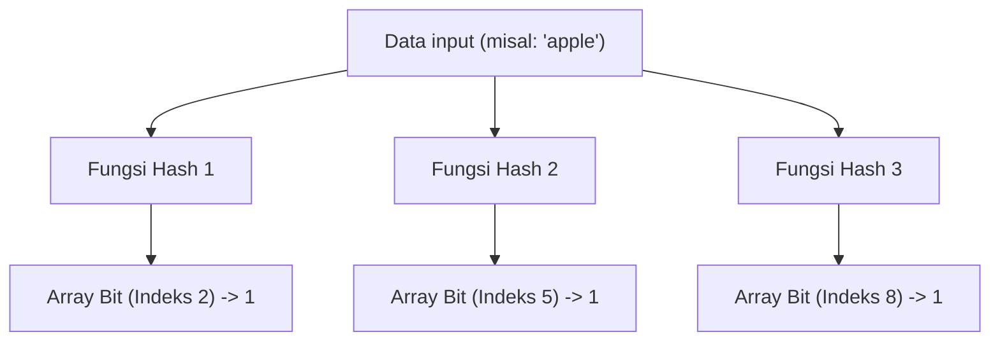
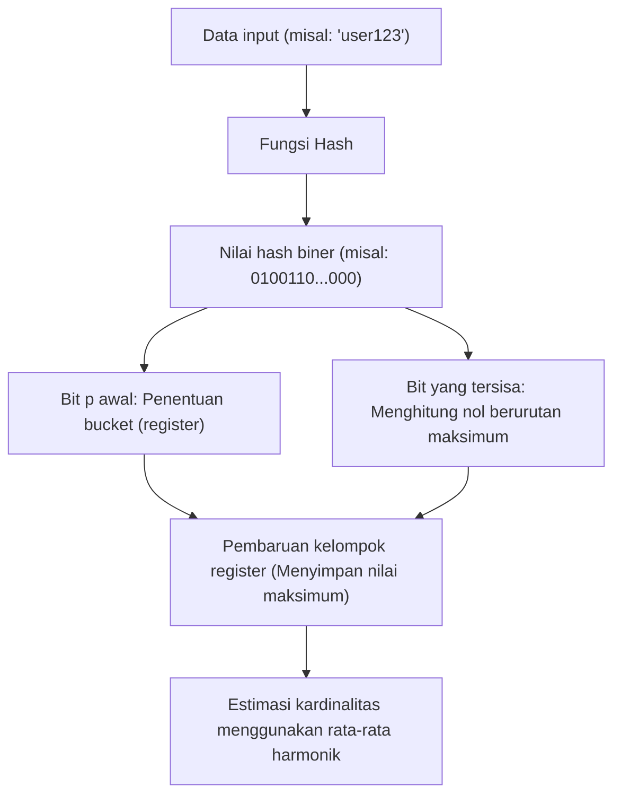

# Keajaiban Struktur Data Probabilistik: Bloom Filter dan HyperLogLog

Di era big data, jumlah data yang kita tangani meningkat secara eksplosif. Layanan web dengan jutaan akses per detik, jejaring sosial dengan miliaran pengguna, atau aliran data sensor IoT yang terus menerus dihasilkan. Saat memproses data yang begitu besar, salah satu hambatan terbesar yang kita hadapi adalah "batas memori".

Jika kita mencoba menyimpan semua elemen secara akurat di memori dan melakukan pencarian atau penghitungan menggunakan struktur data tradisional (seperti tabel hash atau pohon pencarian biner), memori akan cepat habis. Sangat sulit secara sumber daya fisik untuk menyimpan puluhan miliar ID unik untuk memeriksa "apakah ID ini sudah ada?" atau menghitung "berapa banyak ID unik yang ada?".

**Struktur Data Probabilistik (Probabilistic Data Structures)** diciptakan untuk memecahkan masalah ini. Struktur data probabilistik adalah algoritma yang mengorbankan "akurasi 100%" demi mencapai "konsumsi memori yang sangat rendah" dan "kecepatan pemrosesan yang tinggi". Pada kasus penggunaan di mana margin kesalahan tertentu (positif palsu atau nilai perkiraan) dapat ditoleransi, struktur ini bekerja seperti sihir.

Pada artikel ini, kita akan menggali lebih dalam tentang dua algoritma yang paling terkenal dan praktis dari struktur data probabilistik ini: **Bloom Filter** dan **HyperLogLog**, mengenai cara kerja mereka yang luar biasa, latar belakang matematika, dan kasus penggunaan di dunia nyata.

---

## Bloom Filter: Menghemat Memori untuk Pemeriksaan Keberadaan

### Apa itu Bloom Filter?
Bloom Filter adalah struktur data probabilistik yang diciptakan oleh Burton Howard Bloom pada tahun 1970, digunakan untuk memeriksa "apakah suatu elemen termasuk dalam suatu himpunan" dengan kecepatan tinggi dan memori rendah.

Karakteristik utama Bloom Filter adalah sebagai berikut:
1. **Jika elemen dinilai "ada", artinya "kemungkinan besar ada" (ada kemungkinan positif palsu: False Positive).**
2. **Jika elemen dinilai "tidak ada", artinya "pasti tidak ada" (tidak mungkin negatif palsu: False Negative).**

Dengan kata lain, Bloom Filter dapat menyatakan dengan pasti bahwa "pasti tidak ada", tetapi jika ia mengatakan "ada", ada kemungkinan kecil itu salah. Memanfaatkan properti ini, ia banyak digunakan sebagai "filter awal" untuk mencegah akses yang tidak perlu ke basis data yang besar.

### Cara Kerja Bloom Filter

Bloom Filter pada dasarnya adalah array bit dengan panjang $m$ (semua nilai awal adalah 0) dan $k$ fungsi hash yang berbeda.

#### Menambahkan Elemen (Add)
Saat menambahkan elemen, elemen tersebut dimasukkan ke dalam $k$ fungsi hash. Setiap fungsi hash akan mengeluarkan indeks dari $0$ hingga $m-1$. Kemudian, posisi indeks tersebut dalam array bit diatur menjadi `1`. Bahkan jika beberapa fungsi hash menunjuk ke indeks yang sama, atau jika sudah menjadi `1` karena elemen lain, itu hanya akan ditimpa dengan `1` (yaitu tetap `1`).

#### Mencari Elemen (Check)
Saat memeriksa apakah sebuah elemen ada, elemen tersebut dimasukkan ke dalam $k$ fungsi hash sama seperti saat penambahan. Kemudian, periksa nilai array bit untuk semua indeks yang dihasilkan.
- **Jika semuanya `1`:** Elemen diputuskan "kemungkinan besar ada".
- **Jika ada setidaknya satu `0`:** Elemen diputuskan "pasti tidak ada".

Mengapa "kemungkinan besar ada"? Itu karena, bahkan jika Anda belum pernah menambahkan elemen yang ingin diperiksa, hasil dari penambahan elemen lain mungkin secara kebetulan membuat semua indeks nilai hash elemen tersebut menjadi `1`. Inilah identitas dari "Positif Palsu (False Positive)".

### Tingkat Positif Palsu dan Optimasi Parameter

Dalam mendesain Bloom Filter, keseimbangan antara panjang array bit $m$, perkiraan jumlah elemen yang ditambahkan $n$, dan jumlah fungsi hash $k$ sangatlah penting.

Tingkat positif palsu $p$ dapat diperkirakan dengan rumus berikut:
$$ p \approx (1 - e^{-kn/m})^k $$

Seperti yang terlihat dari rumus ini, semakin besar array bit ($m$), semakin rendah tingkat positif palsu, dan semakin banyak elemen ($n$), semakin tinggi tingkat positif palsu. Selain itu, jumlah fungsi hash optimal $k$ dapat dihitung dengan rumus berikut:
$$ k = \frac{m}{n} \ln 2 $$

Sebagai contoh, jika Anda mengasumsikan akan menambahkan 100 juta elemen dan ingin menjaga tingkat positif palsu pada 1% (0.01), Anda dapat menghitung ukuran memori yang dibutuhkan ($m$) dan jumlah fungsi hash yang optimal ($k$). Hasilnya, dengan hanya sekitar 120MB memori dan 7 fungsi hash, dimungkinkan untuk memeriksa keberadaan 100 juta elemen. Jika Anda mencoba mengimplementasikannya dengan tabel hash, itu akan membutuhkan memori dari beberapa GB hingga belasan GB.

### Kasus Penggunaan Bloom Filter

Bloom Filter adalah senjata ampuh untuk mengurangi pemrosesan yang tidak perlu di sistem backend dan basis data.

1. **Pengurangan I/O Disk Basis Data (Cassandra, HBase, dll.):**
   Saat memeriksa apakah data yang sesuai dengan kunci tertentu ada, sistem menanyakan Bloom Filter di dalam memori sebelum mengakses disk. Jika dinilai "tidak ada", akses disk dapat sepenuhnya dilewati, yang secara drastis meningkatkan kinerja.
2. **CDN dan Sistem Cache:**
   Digunakan untuk mencegah "One-hit Wonder (sumber daya yang hanya diakses sekali)" masuk ke dalam cache. Akses pertama hanya dicatat di Bloom Filter dan tidak di-cache; akses kedua (jika diputuskan ada di Bloom Filter) baru di-cache, sehingga meningkatkan efisiensi memori cache.
3. **Penyaringan URL Berbahaya:**
   Saat browser memeriksa daftar situs web berbahaya, alih-alih mengunduh seluruh daftar, Bloom Filter digunakan. Hanya ketika Bloom Filter menilai URL tersebut "ada (kemungkinan berbahaya)", pertanyaan terperinci dikirim ke server.

---

## HyperLogLog: Puncak Estimasi Kardinalitas (Jumlah Unik)

### Apa itu HyperLogLog?
Berbeda dengan Bloom Filter yang berfokus pada "pemeriksaan keberadaan elemen", **HyperLogLog (HLL)** adalah struktur data probabilistik yang khusus digunakan untuk "estimasi kardinalitas (jumlah unik: jumlah elemen unik)". Diperkenalkan oleh Flajolet dkk. pada tahun 2007.

Misalnya, kita ingin menghitung "berapa banyak jumlah unique user (UU) yang mengakses website ini?". Biasanya, semua ID pengguna perlu disimpan dalam struktur data seperti Set, dan kemudian mengukur ukurannya. Namun, pada skala seperti Google atau Twitter, jumlah elemen unik bisa mencapai miliaran atau puluhan miliar, menjadikannya mustahil untuk menyimpan semuanya di dalam memori.

HyperLogLog dapat menjalankan perhitungan ini dengan memori **hanya beberapa kilobyte (sekitar 12KB)**, dengan margin kesalahan kecil (kesalahan standar sekitar 0,81%). Benar-benar algoritma yang ajaib.

### Lempar Koin dan Model Matematika Probabilitas

Untuk memahami cara kerja HyperLogLog, mari kita pertimbangkan "model lempar koin" secara intuitif.

Misalkan Anda melempar koin dan menghitung berapa kali "Angka" muncul berturut-turut.
- Probabilitas mendapatkan Gambar pada lemparan pertama: 1/2
- Probabilitas mendapatkan Angka 2 kali berturut-turut, lalu Gambar pada lemparan ke-3: 1/8
- Probabilitas mendapatkan Angka $k$ kali berturut-turut: $1/2^k$

Jika seseorang memberi tahu Anda, "Saya melempar koin, dan Angka muncul 10 kali berturut-turut," Anda dapat berasumsi bahwa orang tersebut "pasti telah melempar koin cukup banyak (sekitar $2^{10} = 1024$ kali)". Mengapa? Karena probabilitas mendapatkan Angka 10 kali berturut-turut dengan sedikit percobaan sangatlah rendah.

HyperLogLog menerapkan properti ini—bahwa "probabilitas pola tertentu muncul secara berurutan bergantung pada jumlah percobaan"—ke nilai hash data.

### Algoritma HyperLogLog

1. **Hashing data:**
   Data input (seperti ID pengguna) dilewatkan melalui fungsi hash untuk mendapatkan angka biner panjang (misal: 64-bit) dengan distribusi seragam.
2. **Pembagian Bucket (Register):**
   Untuk mengurangi varian, $p$ bit pertama dari nilai hash digunakan untuk mendistribusikan data ke dalam $m = 2^p$ bucket (register).
3. **Menghitung Angka Nol Berurutan:**
   Untuk sisa bit dari nilai hash, kita hitung "berapa banyak nol berturut-turut yang berlanjut dari awal". Misalkan ini $\rho(x)$. Ini setara dengan "jumlah Angka yang muncul berturut-turut" dalam lemparan koin.
4. **Pembaruan Register:**
   Setiap bucket (register) hanya menyimpan nilai **maksimum** dari $\rho(x)$ yang pernah diamati sejauh ini.
5. **Menghitung Estimasi dengan Rata-rata Harmonik:**
   Kardinalitas keseluruhan diestimasi dari nilai maksimum di semua register. Karena rata-rata aritmatika sederhana akan sangat terpengaruh oleh outlier (nilai kebetulan dengan urutan nol yang sangat panjang), HyperLogLog menggunakan **Rata-rata Harmonik (Harmonic Mean)**.

Rumus untuk mendapatkan nilai perkiraan $E$ adalah sebagai berikut:
$$ E = \alpha_m \cdot m^2 \cdot \left( \sum_{j=1}^{m} 2^{-M[j]} \right)^{-1} $$
Di mana $m$ adalah jumlah bucket, $M[j]$ adalah nilai maksimum yang disimpan di register ke-$j$, dan $\alpha_m$ adalah konstanta untuk mengoreksi bias.

### Efisiensi Memori yang Luar Biasa

Kehebatan HyperLogLog terletak pada efisiensi memorinya yang ekstrem.
Misalnya, jika $p = 14$, jumlah bucket adalah $2^{14} = 16384$. Saat menggunakan hash 64-bit, jumlah nol berturut-turut paling banyak adalah 64, jadi ukuran register untuk menyimpannya hanya membutuhkan 6 bit ($2^6 = 64$).

Total konsumsi memori:
$$ 16384 \text{ register} \times 6 \text{ bit} = 98304 \text{ bit} = 12288 \text{ byte} \approx 12 \text{ KB} $$

Hanya dengan 12KB memori ini, algoritma dapat mengestimasi jumlah elemen unik hingga ratusan juta atau miliaran dengan kesalahan kurang dari 1%. Dibandingkan dengan struktur data Set biasa yang akan mengkonsumsi ratusan GB memori, perbedaannya benar-benar berada pada dimensi yang berbeda.

### Kasus Penggunaan HyperLogLog

HyperLogLog telah menjadi teknologi esensial dalam platform analisis big data.

1. **Penghitungan Unique User (UU) secara Real-time:**
   Digunakan dalam alat analisis web dan dasbor untuk menghitung jumlah pengunjung atau pemirsa secara real-time. Pada KVS in-memory seperti Redis, HyperLogLog diimplementasikan sebagai standar melalui perintah `PFADD` dan `PFCOUNT`.
2. **Menganalisis dan Mengagregasi Kumpulan Data Besar:**
   Pada mesin SQL terdistribusi seperti BigQuery, Amazon Redshift, atau Presto, HyperLogLog (atau algoritma turunannya) digunakan untuk mempercepat kueri seperti `COUNT(DISTINCT column_name)`.
3. **Manajemen Status dalam Pemrosesan Stream:**
   Dalam kerangka kerja pemrosesan stream seperti Apache Kafka atau Apache Flink, ini digunakan untuk menghitung kardinalitas aliran data yang mengalir tanpa batas, tanpa menguras memori.

---

## Kesimpulan: Terobosan melalui Aproksimasi

Baik Bloom Filter maupun HyperLogLog menembus "batas memori" dalam ilmu komputer dengan menerima pengorbanan "menyerah pada akurasi 100%".

- **Bloom Filter** bertindak sebagai penjaga gerbang ke penyimpanan data yang besar, mencegah akses yang tidak perlu dengan membedakan antara "kemungkinan besar ada" dan "pasti tidak ada".
- **HyperLogLog** dengan cerdik menggabungkan sifat probabilistik lemparan koin dan rata-rata harmonik untuk menghitung elemen sebanyak bintang di alam semesta dengan hanya beberapa kilobyte memori.

Di balik layanan web berkecepatan tinggi yang kita gunakan dengan biasa setiap hari, dan sistem analisis big data yang mengembalikan hasil dalam hitungan detik, tersembunyi model matematika yang indah dari struktur data probabilistik dan kecerdikan rekayasa perangkat lunak ini. Kekuatan algoritma terkadang membawa terobosan yang bahkan melampaui batas fisik (kapasitas memori).
