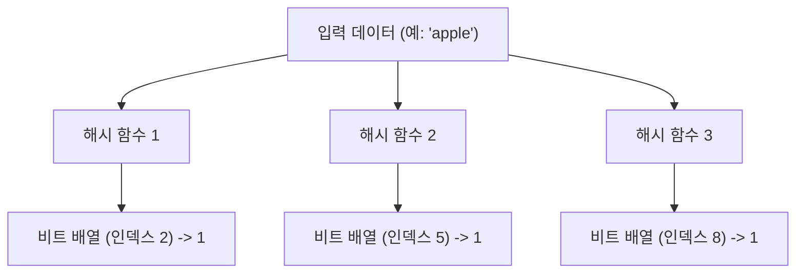
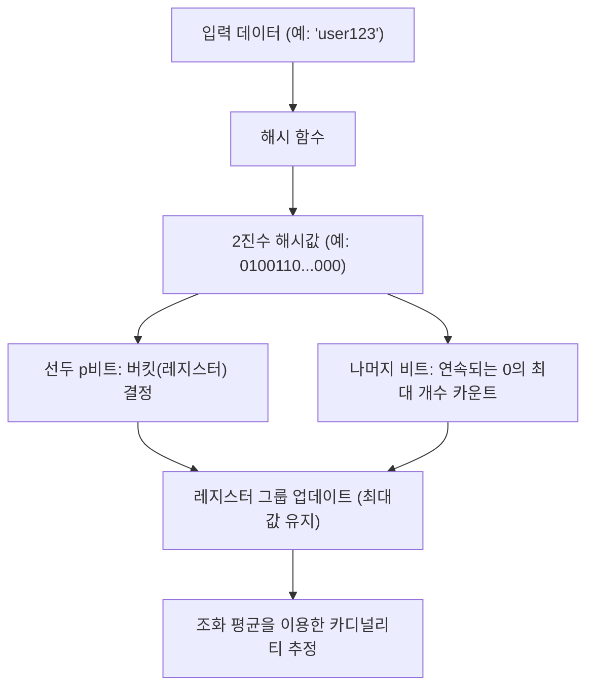

# 확률적 자료 구조의 경이로움: 블룸 필터와 하이퍼로그로그

빅데이터 시대에 우리가 다루는 데이터의 양은 폭발적으로 증가하고 있습니다. 초당 수백만 건의 접속이 발생하는 웹 서비스, 수십억 명의 사용자를 보유한 소셜 네트워크, 혹은 끊임없이 생성되는 IoT 센서의 스트림 데이터 등입니다. 이렇게 방대한 데이터를 처리할 때 우리가 직면하는 가장 큰 장벽 중 하나가 바로 '메모리의 한계'입니다.

기존의 자료 구조(예: 해시 테이블이나 이진 탐색 트리 등)를 사용하여 모든 요소를 메모리에 정확히 유지하고 검색이나 계산을 시도하면, 메모리는 순식간에 고갈되고 맙니다. 수백억 개의 고유한 ID를 모두 저장하여 "이 ID가 이미 존재하는가?"를 판별하거나, "몇 가지 종류의 고유한 ID가 존재하는가?"를 세는 것은 물리적인 리소스 관점에서 매우 어렵습니다.

이 문제를 해결하기 위해 고안된 것이 **확률적 자료 구조(Probabilistic Data Structures)**입니다. 확률적 자료 구조는 '100%의 정확성'을 희생하는 대신, '극히 적은 메모리 소비량'과 '빠른 처리 속도'를 달성하는 알고리즘입니다. 약간의 오차(위양성이나 근사치)를 허용할 수 있는 사용 사례에서 이것들은 마법과 같은 효과를 발휘합니다.

본 기사에서는 이 확률적 자료 구조 중에서도 특히 유명하고 실용적인 두 가지 알고리즘, **블룸 필터(Bloom Filter)**와 **하이퍼로그로그(HyperLogLog)**에 대해 그 경이로운 원리와 수학적 배경, 그리고 실제 사용 사례를 깊이 파헤쳐 보겠습니다.

---

## 블룸 필터: 존재 판별의 메모리 절약

### 블룸 필터란 무엇인가?
블룸 필터는 1970년 Burton Howard Bloom에 의해 고안된 확률적 자료 구조로, "어떤 요소가 집합에 포함되어 있는지 여부"를 빠르고 메모리 효율적으로 판별하는 데 사용됩니다.

블룸 필터의 가장 큰 특징은 다음과 같습니다.
1. **요소가 "존재한다"고 판별된 경우, 이는 "아마도 존재할 것이다"라는 의미입니다 (위양성: False Positive의 가능성 있음).**
2. **요소가 "존재하지 않는다"고 판별된 경우, 이는 "확실히 존재하지 않는다"라는 의미입니다 (위음성: False Negative는 절대 없음).**

즉, 블룸 필터는 "절대 없다"고 단언할 수는 있지만, "있다"고 했을 때는 틀릴 가능성이 약간 있습니다. 이 성질을 이용하여 거대한 데이터베이스에 대한 불필요한 접근을 방지하는 '사전 필터'로 널리 사용되고 있습니다.

### 블룸 필터의 원리

블룸 필터의 실체는 길이 $m$의 비트 배열(초기값은 모두 0)과 $k$개의 서로 다른 해시 함수입니다.

#### 요소 추가 (Add)
요소를 추가할 때, 그 요소를 $k$개의 해시 함수에 입력합니다. 각각의 해시 함수는 $0$에서 $m-1$까지의 인덱스를 출력합니다. 그리고 비트 배열의 해당 인덱스 위치를 `1`로 설정합니다. 여러 해시 함수가 동일한 인덱스를 가리키거나 다른 요소로 인해 이미 `1`이 되어 있어도, 단순히 `1`로 덮어씁니다(즉 `1`을 유지합니다).

#### 요소 검색 (Check)
요소가 존재하는지 조사할 때도 추가 시와 마찬가지로 $k$개의 해시 함수에 요소를 입력합니다. 그리고 출력된 모든 인덱스에 대해 비트 배열의 값을 확인합니다.
- **모두 `1`인 경우:** 요소는 "아마도 존재할 것이다"라고 판별합니다.
- **하나라도 `0`이 포함된 경우:** 요소는 "확실히 존재하지 않는다"라고 판별합니다.

왜 "아마도 존재할 것이다"일까요? 그것은 확인하려는 요소를 한 번도 추가하지 않았더라도, 다른 요소를 추가한 결과로 우연히 그 요소의 해시값 인덱스가 모두 `1`이 되어 있을 가능성이 있기 때문입니다. 이것이 바로 '위양성(False Positive)'의 정체입니다.

### 위양성률과 파라미터 최적화

블룸 필터를 설계할 때 비트 배열의 길이 $m$, 추가할 요소의 예상 수 $n$, 그리고 해시 함수의 수 $k$의 균형이 중요합니다.

위양성률 $p$는 대략 다음 공식으로 근사됩니다.
$$ p \approx (1 - e^{-kn/m})^k $$

이 공식에서 알 수 있듯이 비트 배열을 크게 할수록($m$을 늘릴수록) 위양성률은 낮아지고, 요소 수($n$)가 늘어날수록 위양성률은 높아집니다. 또한 최적의 해시 함수 수 $k$는 다음 공식으로 구할 수 있습니다.
$$ k = \frac{m}{n} \ln 2 $$

예를 들어, 1억 개의 요소를 추가한다고 가정하고 위양성률을 1%(0.01)로 억제하고 싶은 경우, 필요한 메모리 크기($m$)와 최적의 해시 함수 수($k$)를 계산할 수 있습니다. 결과적으로 불과 120MB 정도의 메모리와 7개의 해시 함수만으로 1억 개 요소의 존재 판별이 가능해집니다. 만약 이것을 해시 테이블로 구현하려고 하면 수 GB에서 십수 GB의 메모리가 필요할 것입니다.

### 블룸 필터의 사용 사례

블룸 필터는 백엔드 시스템이나 데이터베이스에서 불필요한 처리를 줄이기 위한 강력한 무기입니다.

1. **데이터베이스의 디스크 I/O 절감 (Cassandra, HBase 등):**
   특정 키에 해당하는 데이터가 존재하는지 조사할 때 디스크에 접근하기 전에 인메모리의 블룸 필터에 질의합니다. "존재하지 않는다"고 판별되면 디스크 접근을 완전히 건너뛸 수 있으므로 성능이 극적으로 향상됩니다.
2. **CDN 및 캐시 시스템:**
   "One-hit Wonder(한 번만 접근되는 리소스)"를 캐시에 올리지 않기 위해 블룸 필터를 사용합니다. 첫 번째 접근은 블룸 필터에 기록만 하고 캐시하지 않으며, 두 번째 접근(블룸 필터에 존재한다고 판별된 경우)에서 처음으로 캐시함으로써 캐시의 메모리 효율을 높입니다.
3. **악의적인 URL 필터링:**
   브라우저가 악의적인 웹사이트 목록과 대조할 때, 목록 전체를 다운로드하는 대신 블룸 필터를 사용합니다. 블룸 필터에서 "존재한다(악의적일 가능성이 있다)"고 판별된 경우에만 서버에 자세한 질의를 수행합니다.

---

## 하이퍼로그로그: 카디널리티(고유값 수) 추정의 극치

### 하이퍼로그로그란 무엇인가?
블룸 필터가 '요소의 존재 판별'에 특화되어 있는 반면, **하이퍼로그로그(HLL)**는 '카디널리티(고유값 수: 유니크한 요소의 수)의 추정'에 특화된 확률적 자료 구조입니다. Flajolet 등에 의해 2007년에 발표되었습니다.

예를 들어, "이 웹사이트에 접속한 순 방문자(UU) 수는 몇 명인가?"를 계산하고 싶다고 합시다. 통상적이라면 모든 사용자 ID를 집합(Set) 등의 자료 구조에 저장하고 그 크기를 측정해야 합니다. 하지만 Google이나 Twitter와 같은 규모가 되면 고유한 요소 수는 수십억, 수백억에 달해 모든 것을 메모리에 유지하는 것은 불가능합니다.

하이퍼로그로그는 이 계산을 **불과 몇 킬로바이트(약 12KB 등)**의 메모리로, 수 퍼센트 정도의 작은 오차(표준 오차 약 0.81%)로 실행해 내는야말로 마법 같은 알고리즘입니다.

### 동전 던지기와 확률의 수학적 모델

하이퍼로그로그의 원리를 이해하기 위해, 우선 직관적인 '동전 던지기 모델'을 생각해 봅시다.

당신이 동전을 던져 '앞면'이 계속해서 나오는 횟수를 센다고 가정합니다.
- 1번째에 뒷면이 나올 확률: 1/2
- 2번 연속 앞면이 나오고, 3번째에 뒷면이 나올 확률: 1/8
- $k$번 연속 앞면이 나올 확률: $1/2^k$

만약 누군가가 "동전을 던졌는데 앞면이 10번 연속으로 나왔어"라고 말한다면, 당신은 그 사람이 "꽤 많은 횟수(대략 $2^{10} = 1024$번 정도) 동전 던지기를 시도했음에 틀림없다"고 추측할 수 있을 것입니다. 왜냐하면 적은 횟수의 시도로 10번 연속 앞면이 나올 확률은 극히 낮기 때문입니다.

하이퍼로그로그는 이 "연속해서 특정 패턴이 나올 확률은 시도 횟수에 의존한다"는 성질을 데이터의 해시값에 응용하고 있습니다.

### 하이퍼로그로그 알고리즘

1. **데이터의 해시화:**
   입력 데이터(사용자 ID 등)를 해시 함수에 통과시켜 균등 분포하는 긴 2진수(예: 64비트)를 얻습니다.
2. **버킷(레지스터) 분할:**
   분산을 줄이기 위해 해시값의 선두 $p$ 비트를 사용하여 데이터를 $m = 2^p$개의 버킷(레지스터)으로 나눕니다.
3. **연속되는 0 카운트:**
   해시값의 나머지 비트에 대해 "선두부터 연속해서 0이 몇 개 이어지는지"를 셉니다. 이것을 $\rho(x)$라고 합니다. 동전 던지기에서 '앞면이 연속해서 나오는 횟수'에 해당합니다.
4. **레지스터 업데이트:**
   각 버킷(레지스터)에는 지금까지 관측된 $\rho(x)$의 **최대값**만을 저장합니다.
5. **조화 평균을 통한 추정치 산출:**
   모든 레지스터의 최대값으로부터 전체의 카디널리티를 추정합니다. 단순한 산술 평균은 이상치(우연히 극단적으로 길게 0이 연속된 값)의 영향을 크게 받기 때문에, 하이퍼로그로그에서는 **조화 평균(Harmonic Mean)**을 사용합니다.

추정치 $E$를 구하는 공식은 다음과 같습니다.
$$ E = \alpha_m \cdot m^2 \cdot \left( \sum_{j=1}^{m} 2^{-M[j]} \right)^{-1} $$
여기서 $m$은 버킷 수, $M[j]$는 $j$번째 레지스터에 저장된 최대값, $\alpha_m$은 편향을 보정하기 위한 상수입니다.

### 경이로운 메모리 효율

하이퍼로그로그의 대단함은 그 극단적인 메모리 효율에 있습니다.
예를 들어, $p = 14$라고 하면 버킷 수는 $2^{14} = 16384$개가 됩니다. 64비트 해시를 사용하는 경우 연속되는 0의 수는 최대 64개이므로, 그것을 저장하기 위한 레지스터의 크기는 단 6비트($2^6 = 64$)면 충분합니다.

전체 메모리 소비량:
$$ 16384 \text{ registers} \times 6 \text{ bits} = 98304 \text{ bits} = 12288 \text{ bytes} \approx 12 \text{ KB} $$

이 단 12KB의 메모리로 수억, 수십억 개의 고유한 요소의 수를 오차 1% 미만으로 추정할 수 있는 것입니다. 수백 GB의 메모리를 소비하는 일반적인 Set 자료 구조와 비교하면 그 차이는 말 그대로 차원이 다릅니다.

### 하이퍼로그로그의 사용 사례

하이퍼로그로그는 빅데이터 분석 기반에서 필수 불가결한 기술이 되었습니다.

1. **실시간 순 방문자(UU) 카운트:**
   접속 분석 도구나 대시보드에서 실시간으로 방문자 수나 열람자 수를 세는 데 사용됩니다. Redis와 같은 인메모리 KVS에는 `PFADD`나 `PFCOUNT`라는 명령어로 하이퍼로그로그가 표준 구현되어 있습니다.
2. **거대한 데이터 세트의 분석 및 집계:**
   BigQuery나 Amazon Redshift, Presto와 같은 분산 SQL 엔진에서 `COUNT(DISTINCT column_name)`과 같은 쿼리를 고속화하기 위해 하이퍼로그로그(또는 그 파생 알고리즘)가 사용되고 있습니다.
3. **스트림 처리에서의 상태 관리:**
   Apache Kafka나 Apache Flink 등의 스트림 처리 프레임워크에서 메모리를 고갈시키지 않고 무한히 흘러들어오는 데이터 스트림의 카디널리티를 계산하기 위해 이용됩니다.

---

## 요약: 근사가 가져오는 혁신

블룸 필터와 하이퍼로그로그는 모두 "100%의 정확성을 포기한다"는 절충안을 받아들임으로써 컴퓨터 과학에서의 '메모리 장벽'을 돌파했습니다.

- **블룸 필터**는 "아마도 존재할 것이다"와 "확실히 존재하지 않는다"를 구별함으로써 거대한 데이터 저장소의 문지기 역할을 하여 불필요한 접근을 방지합니다.
- **하이퍼로그로그**는 동전 던지기의 확률적 성질과 조화 평균을 교묘하게 조합하여, 단 몇 킬로바이트의 메모리로 우주의 별의 수만큼 많은 요소를 세어냅니다.

우리가 매일 당연하게 이용하고 있는 고속 웹 서비스나 몇 초 만에 결과를 반환하는 빅데이터 분석 시스템의 이면에는 이러한 확률적 자료 구조의 아름다운 수학적 모델과 엔지니어링의 노력이 숨겨져 있는 것입니다. 알고리즘의 힘은 때로 물리적인 한계(메모리 용량)조차 뛰어넘는 혁신을 가져다줍니다.
