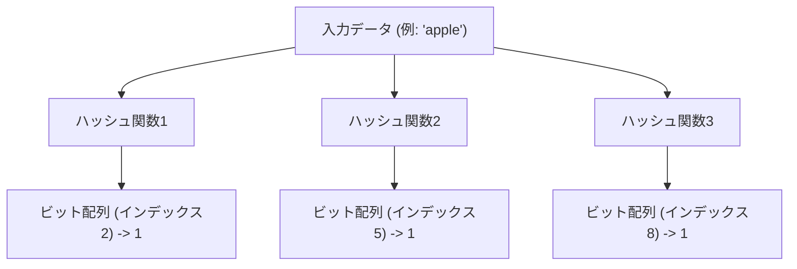
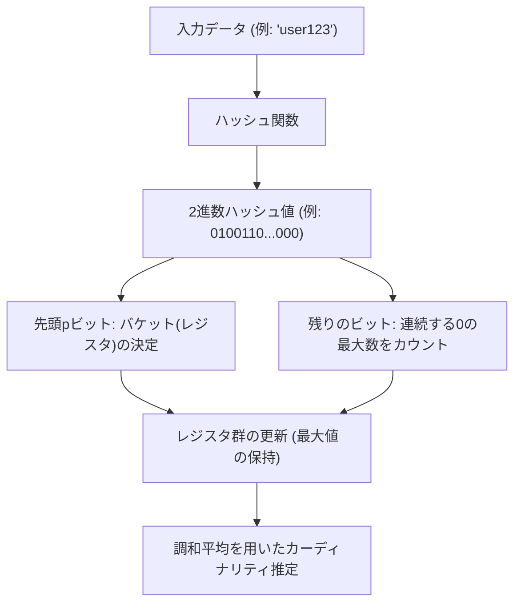

# 確率的データ構造の驚異：Bloom FilterとHyperLogLog

ビッグデータ時代において、私たちの扱うデータ量は爆発的に増加しています。毎秒何百万件ものアクセスがあるウェブサービス、数十億のユーザーを抱えるソーシャルネットワーク、あるいは絶え間なく生成されるIoTセンサーのストリームデータ。これほどまでに膨大なデータを処理する際、私たちが直面する最大の壁の一つが「メモリの限界」です。

従来のデータ構造（例えばハッシュテーブルや二分探索木など）を用いて、すべての要素を正確にメモリ上に保持し、検索やカウントを行おうとすると、たちまちメモリが枯渇してしまいます。数百億のユニークなIDをすべて保存して「このIDはすでに存在するか？」を判定したり、「何種類のユニークなIDが存在するか？」を数えたりすることは、物理的なリソースの観点から非常に困難です。

この問題を解決するために生み出されたのが**確率的データ構造（Probabilistic Data Structures）**です。確率的データ構造は、「100%の正確性」を犠牲にする代わりに、「極めて少ないメモリ消費量」と「高速な処理速度」を実現するアルゴリズムです。多少の誤差（偽陽性や近似値）を許容できるユースケースにおいて、これらは魔法のような効果を発揮します。

本記事では、この確率的データ構造の中でも特に有名で実用的な2つのアルゴリズム、**Bloom Filter（ブルームフィルタ）** と **HyperLogLog（ハイパーログログ）** について、その驚異的な仕組みと数学的背景、そして実際のユースケースを深く掘り下げていきます。

---

## Bloom Filter：存在判定の省メモリ化

### Bloom Filterとは何か？
Bloom Filterは1970年にBurton Howard Bloomによって考案された確率的データ構造で、「ある要素が集合に含まれているかどうか」を高速かつ省メモリで判定するために使用されます。

Bloom Filterの最大の特徴は以下の通りです。
1. **要素が「存在する」と判定された場合、それは「おそらく存在する」という意味である（偽陽性：False Positiveの可能性あり）。**
2. **要素が「存在しない」と判定された場合、それは「確実に存在しない」という意味である（偽陰性：False Negativeは絶対にない）。**

つまり、Bloom Filterは「絶対にない」と言い切ることはできますが、「ある」と言った場合は間違っている可能性がわずかにあります。この性質を利用して、巨大なデータベースへの不要なアクセスを防ぐための「事前フィルタ」として広く使われています。

### Bloom Filterの仕組み

Bloom Filterの実体は、長さ $m$ のビット配列（初期値はすべて0）と、$k$ 個の異なるハッシュ関数です。

#### 要素の追加（Add）
要素を追加する際、その要素を $k$ 個のハッシュ関数に入力します。それぞれのハッシュ関数は $0$ から $m-1$ までのインデックスを出力します。そして、ビット配列のそれらのインデックスの位置を `1` にセットします。複数のハッシュ関数が同じインデックスを指し示したり、別の要素で既に `1` になっていたりしても、単に `1` で上書きする（つまり `1` のままにする）だけです。

#### 要素の検索（Check）
要素が存在するかどうかを調べる際も、追加時と同じように $k$ 個のハッシュ関数に要素を入力します。そして、出力されたすべてのインデックスについて、ビット配列の値を確認します。
- **すべてが `1` の場合：** 要素は「おそらく存在する」と判定します。
- **一つでも `0` が含まれる場合：** 要素は「確実に存在しない」と判定します。

なぜ「おそらく存在する」なのでしょうか？それは、調べたい要素を一度も追加していなくても、他の要素を追加した結果として、偶然その要素のハッシュ値のインデックスがすべて `1` になっている可能性があるからです。これが「偽陽性（False Positive）」の正体です。

### 偽陽性率とパラメータの最適化

Bloom Filterを設計する上で、ビット配列の長さ $m$、追加する要素の予想数 $n$、そしてハッシュ関数の数 $k$ のバランスが重要になります。

偽陽性率 $p$ はおよそ以下の式で近似されます。
$$ p \approx (1 - e^{-kn/m})^k $$

この式からわかるように、ビット配列を大きくする（$m$ を増やす）ほど偽陽性率は下がり、要素数（$n$）が増えるほど偽陽性率は上がります。また、最適なハッシュ関数の数 $k$ は以下の式で求められます。
$$ k = \frac{m}{n} \ln 2 $$

例えば、1億個の要素を追加する想定で、偽陽性率を1%（0.01）に抑えたい場合、必要なメモリサイズ（$m$）と最適なハッシュ関数（$k$）の数を計算できます。結果として、わずか120MB程度のメモリと7つのハッシュ関数で、1億要素の存在判定が可能になります。もしこれをハッシュテーブルで実装しようとすれば、数GBから十数GBのメモリが必要になるでしょう。

### Bloom Filterのユースケース

Bloom Filterは、バックエンドシステムやデータベースにおいて、無駄な処理を省くための強力な武器です。

1. **データベースのディスクI/O削減（Cassandra, HBaseなど）：**
   特定のキーに対応するデータが存在するかどうかを調べる際、ディスクにアクセスする前にオンメモリのBloom Filterに問い合わせます。「存在しない」と判定されれば、ディスクアクセスを完全にスキップできるため、パフォーマンスが劇的に向上します。
2. **CDNやキャッシュシステム：**
   「One-hit Wonder（一度しかアクセスされないリソース）」をキャッシュに載せないようにするために、Bloom Filterを使用します。1回目のアクセスはBloom Filterに記録するだけでキャッシュせず、2回目のアクセス（Bloom Filterに存在すると判定された場合）で初めてキャッシュすることで、キャッシュのメモリ効率を高めます。
3. **悪意のあるURLのフィルタリング：**
   ブラウザが悪意のあるウェブサイトのリストと照合する際、リスト全体をダウンロードする代わりにBloom Filterを使用します。Bloom Filterで「存在する（悪意がある可能性がある）」と判定された場合のみ、サーバーに詳細な問い合わせを行います。

---

## HyperLogLog：カーディナリティ（異なり数）推定の極致

### HyperLogLogとは何か？
Bloom Filterが「要素の存在判定」に特化しているのに対し、**HyperLogLog（HLL）**は「カーディナリティ（異なり数：ユニークな要素の数）の推定」に特化した確率的データ構造です。Flajoletらによって2007年に発表されました。

例えば、「このウェブサイトにアクセスしたユニークユーザー（UU）数は何人か？」を計算したいとします。通常であれば、すべてのユーザーIDをセット（Set）などのデータ構造に保存し、そのサイズを測る必要があります。しかし、GoogleやTwitterのような規模になると、ユニークな要素数は数十億、数百億に達し、すべてをメモリに保持することは不可能です。

HyperLogLogは、この計算を**わずか数キロバイト（約12KBなど）**のメモリで、数%程度の小さな誤差（標準誤差約0.81%）で実行してのける、まさに魔法のようなアルゴリズムです。

### コイントスと確率の数学的モデル

HyperLogLogの仕組みを理解するために、まずは直感的な「コイントスのモデル」を考えてみましょう。

あなたがコイントスを行い、「表」が出続ける回数を数えるとします。
- 1回目で裏が出る確率：1/2
- 2回連続で表が出て、3回目で裏が出る確率：1/8
- $k$回連続で表が出る確率：$1/2^k$

もし誰かが「コイントスをしたら、表が10回連続で出たよ」と言った場合、あなたはその人が「かなり多くの回数（大体 $2^{10} = 1024$ 回くらい）コイントスを試行したに違いない」と推測できるはずです。なぜなら、少ない回数の試行で10回連続で表が出る確率は極めて低いからです。

HyperLogLogは、この「連続して特定のパターンが出る確率は、試行回数に依存する」という性質をデータのハッシュ値に応用しています。

### HyperLogLogのアルゴリズム

1. **データのハッシュ化：**
   入力データ（ユーザーIDなど）をハッシュ関数にかけ、一様分布する長めの2進数（例：64ビット）を得ます。
2. **バケット（レジスタ）の分割：**
   分散を小さくするために、ハッシュ値の先頭 $p$ ビットを使って、データを $m = 2^p$ 個のバケット（レジスタ）に振り分けます。
3. **連続する0のカウント：**
   ハッシュ値の残りのビットについて、「先頭から連続して 0 がいくつ続くか」を数えます。これを $\rho(x)$ とします。コイントスの「表が連続して出る回数」に相当します。
4. **レジスタの更新：**
   各バケット（レジスタ）には、これまで観測された $\rho(x)$ の**最大値**のみを保存します。
5. **調和平均による推定値の算出：**
   すべてのレジスタの最大値から、全体のカーディナリティを推定します。単純な算術平均では外れ値（たまたま極端に長い0が連続した値）の影響を大きく受けてしまうため、HyperLogLogでは**調和平均（Harmonic Mean）**を使用します。

推定値 $E$ を求める公式は以下のようになります。
$$ E = \alpha_m \cdot m^2 \cdot \left( \sum_{j=1}^{m} 2^{-M[j]} \right)^{-1} $$
ここで、$m$ はバケット数、$M[j]$ は $j$ 番目のレジスタに保存された最大値、$\alpha_m$ はバイアスを補正するための定数です。

### 驚異的なメモリ効率

HyperLogLogの凄さは、その極端なメモリ効率にあります。
例えば、$p = 14$ とすると、バケット数は $2^{14} = 16384$ 個になります。64ビットハッシュを使用する場合、連続する0の数は最大でも64なので、それを保存するためのレジスタのサイズはたったの 6ビット（$2^6 = 64$）で済みます。

全体のメモリ消費量：
$$ 16384 \text{ registers} \times 6 \text{ bits} = 98304 \text{ bits} = 12288 \text{ bytes} \approx 12 \text{ KB} $$

このたった12KBのメモリで、数億、数十億というユニーク要素の数を、誤差1%未満で推定できるのです。数百GBのメモリを消費する通常のSetデータ構造と比較すると、その差は文字通り次元が異なります。

### HyperLogLogのユースケース

HyperLogLogは、ビッグデータの分析基盤において不可欠な技術となっています。

1. **リアルタイムのユニークユーザー（UU）カウント：**
   アクセス解析ツールやダッシュボードにおいて、リアルタイムで訪問者数や閲覧者数をカウントするために使われます。RedisなどのインメモリKVSには `PFADD` や `PFCOUNT` というコマンドとしてHyperLogLogが標準実装されています。
2. **巨大なデータセットの分析・集計：**
   BigQueryやAmazon Redshift、Prestoなどの分散SQLエンジンにおいて、`COUNT(DISTINCT column_name)` のようなクエリを高速化するためにHyperLogLog（またはその派生アルゴリズム）が使われています。
3. **ストリーム処理における状態管理：**
   Apache KafkaやApache Flinkなどのストリーム処理フレームワークにおいて、メモリを枯渇させることなく、無限に流れてくるデータストリームのカーディナリティを計算するために利用されます。

---

## まとめ：近似がもたらすブレイクスルー

Bloom FilterとHyperLogLogは、どちらも「100%の正確性を諦める」というトレードオフを受け入れることで、コンピュータサイエンスにおける「メモリの壁」を突破しました。

- **Bloom Filter**は、「おそらく存在する」と「確実に存在しない」を見分けることで、巨大なデータストアの門番として無駄なアクセスを防ぎます。
- **HyperLogLog**は、コイントスの確率的性質と調和平均を巧みに組み合わせることで、たった数キロバイトのメモリで宇宙の星の数ほどの要素をカウントします。

私たちが日々当たり前のように利用している高速なウェブサービスや、数秒で結果を返すビッグデータ分析システムの裏側には、こうした確率的データ構造の美しい数学的モデルとエンジニアリングの工夫が隠されているのです。アルゴリズムの力は、時に物理的な限界（メモリ容量）をも超越するブレイクスルーをもたらしてくれます。
