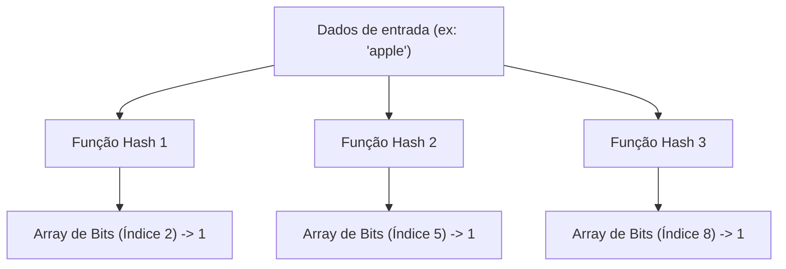
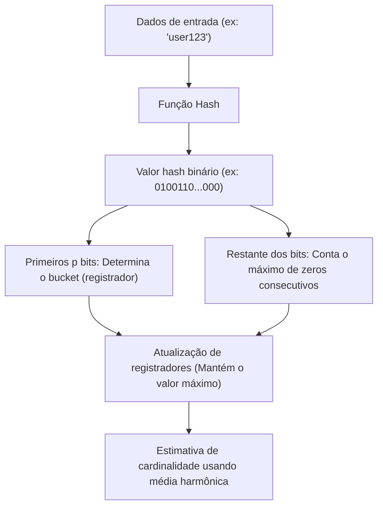

# A Maravilha das Estruturas de Dados Probabilísticas: Bloom Filter e HyperLogLog

Na era do big data, a quantidade de dados que manipulamos está aumentando explosivamente. Serviços web com milhões de acessos por segundo, redes sociais com bilhões de usuários ou fluxos de dados gerados continuamente por sensores IoT. Ao processar um volume tão imenso de dados, uma das maiores barreiras que enfrentamos é o "limite de memória".

Se tentarmos manter todos os elementos com precisão na memória e realizar buscas ou contagens usando estruturas de dados tradicionais (como tabelas hash ou árvores de busca binária), a memória se esgotará rapidamente. É muito difícil, do ponto de vista de recursos físicos, armazenar dezenas de bilhões de IDs únicos para determinar "Este ID já existe?" ou contar "Quantos IDs únicos existem?".

Para resolver este problema, foram criadas as **Estruturas de Dados Probabilísticas (Probabilistic Data Structures)**. Estruturas de dados probabilísticas são algoritmos que sacrificam "100% de precisão" em troca de alcançar "consumo de memória extremamente baixo" e "alta velocidade de processamento". Em casos de uso onde uma pequena margem de erro (falsos positivos ou valores aproximados) pode ser tolerada, essas estruturas funcionam como mágica.

Neste artigo, aprofaremos em dois dos algoritmos mais famosos e práticos dessas estruturas de dados probabilísticas: **Bloom Filter** e **HyperLogLog**, analisando seus funcionamentos incríveis, fundamentos matemáticos e casos de uso no mundo real.

---

## Bloom Filter: Economia de Memória para Verificação de Existência

### O que é um Bloom Filter?
O Bloom Filter é uma estrutura de dados probabilística inventada por Burton Howard Bloom em 1970, usada para determinar "se um determinado elemento está contido em um conjunto" com alta velocidade e baixo uso de memória.

As principais características do Bloom Filter são as seguintes:
1. **Quando um elemento é avaliado como "existente", significa que "provavelmente existe" (possibilidade de Falso Positivo).**
2. **Quando um elemento é avaliado como "não existente", significa que "certamente não existe" (sem possibilidade de Falso Negativo).**

Em outras palavras, o Bloom Filter pode afirmar categoricamente que "absolutamente não existe", mas se disser que "existe", há uma pequena chance de estar errado. Aproveitando essa propriedade, ele é amplamente utilizado como um "filtro prévio" para evitar acessos desnecessários a bancos de dados enormes.

### Como funciona o Bloom Filter

O núcleo de um Bloom Filter é um array de bits de comprimento $m$ (com valor inicial de 0 para todos) e $k$ funções hash diferentes.

#### Adicionando Elementos (Add)
Ao adicionar um elemento, esse elemento é inserido em $k$ funções hash. Cada função hash gera um índice de $0$ a $m-1$. Em seguida, as posições desses índices no array de bits são definidas como `1`. Mesmo que várias funções hash apontem para o mesmo índice, ou se ele já tiver se tornado `1` por causa de outro elemento, ele será simplesmente sobrescrito com `1` (ou seja, permanecerá `1`).

#### Buscando Elementos (Check)
Ao verificar se um elemento existe, o elemento é inserido em $k$ funções hash, assim como no momento da adição. Então, o valor do array de bits é verificado para todos os índices gerados.
- **Se todos forem `1`:** O elemento é determinado como "provavelmente existente".
- **Se contiver pelo menos um `0`:** O elemento é determinado como "certamente não existente".

Por que "provavelmente existente"? Isso ocorre porque, mesmo que você nunca tenha adicionado o elemento que deseja verificar, o resultado da adição de outros elementos pode ter feito com que todos os índices do valor hash desse elemento se tornassem `1` por acaso. Esta é a identidade de um "Falso Positivo".

### Taxa de Falsos Positivos e Otimização de Parâmetros

Ao projetar um Bloom Filter, o equilíbrio entre o comprimento do array de bits $m$, o número estimado de elementos a serem adicionados $n$ e o número de funções hash $k$ é importante.

A taxa de falsos positivos $p$ é aproximada pela seguinte fórmula:
$$ p \approx (1 - e^{-kn/m})^k $$

Como se pode ver por esta fórmula, quanto maior o array de bits (aumentando $m$), menor a taxa de falsos positivos, e quanto mais elementos ($n$) são adicionados, maior a taxa de falsos positivos. Além disso, o número ideal de funções hash $k$ pode ser calculado pela seguinte fórmula:
$$ k = \frac{m}{n} \ln 2 $$

Por exemplo, se você assumir que adicionará 100 milhões de elementos e desejar manter a taxa de falsos positivos em 1% (0.01), poderá calcular o tamanho de memória necessário ($m$) e o número ideal de funções hash ($k$). Como resultado, com apenas cerca de 120 MB de memória e 7 funções hash, torna-se possível verificar a existência de 100 milhões de elementos. Se você tentasse implementar isso com uma tabela hash, seriam necessários vários GB até mais de uma dezena de GB de memória.

### Casos de Uso do Bloom Filter

O Bloom Filter é uma ferramenta poderosa para reduzir processamentos desnecessários em sistemas de back-end e bancos de dados.

1. **Redução de I/O de disco em banco de dados (Cassandra, HBase, etc.):**
   Ao verificar se existem dados correspondentes a uma chave específica, o sistema consulta o Bloom Filter em memória antes de acessar o disco. Se for julgado como "não existente", o acesso ao disco pode ser ignorado completamente, melhorando drasticamente o desempenho.
2. **CDN e Sistemas de Cache:**
   É usado para evitar que recursos que são acessados apenas uma vez ("One-hit Wonders") sejam armazenados em cache. O primeiro acesso é registrado apenas no Bloom Filter e não é armazenado em cache; no segundo acesso (se o Bloom Filter determinar que ele existe), ele finalmente entra no cache, melhorando a eficiência da memória de cache.
3. **Filtragem de URLs Maliciosas:**
   Quando o navegador verifica uma lista de sites maliciosos, em vez de baixar a lista inteira, usa-se um Bloom Filter. Apenas se o Bloom Filter julgar que o site "existe (pode ser malicioso)", uma consulta detalhada é feita ao servidor.

---

## HyperLogLog: O Ápice da Estimativa de Cardinalidade (Contagem de Distintos)

### O que é o HyperLogLog?
Enquanto o Bloom Filter se especializa na "verificação da existência de elementos", o **HyperLogLog (HLL)** é uma estrutura de dados probabilística focada em "estimativa de cardinalidade (contagem de distintos: o número de elementos únicos)". Foi apresentado por Flajolet et al. em 2007.

Por exemplo, suponha que você queira calcular "Qual é o número de usuários únicos (UU) que acessaram este site?". Normalmente, todos os IDs de usuários teriam que ser salvos em uma estrutura de dados como um Conjunto (Set) e o tamanho seria medido. No entanto, em escalas como Google ou Twitter, o número de elementos únicos chega a bilhões ou dezenas de bilhões, sendo impossível manter todos na memória.

O HyperLogLog pode executar esse cálculo com **apenas alguns kilobytes (como cerca de 12KB)** de memória e uma pequena margem de erro (erro padrão em torno de 0,81%), o que o torna um algoritmo verdadeiramente mágico.

### Cara ou Coroa e o Modelo Matemático Probabilístico

Para entender o mecanismo do HyperLogLog, vamos primeiro considerar intuitivamente o "modelo de jogar uma moeda".

Suponha que você jogue uma moeda e conte quantas vezes "Cara" sai consecutivamente.
- Probabilidade de sair Coroa no 1º lançamento: 1/2
- Probabilidade de dar Cara duas vezes seguidas e Coroa no 3º: 1/8
- Probabilidade de dar Cara $k$ vezes seguidas: $1/2^k$

Se alguém disser "Eu joguei a moeda e deu Cara 10 vezes seguidas", você pode deduzir que essa pessoa "deve ter tentado um número bem grande de vezes (aproximadamente $2^{10} = 1024$ vezes)". Isso porque a probabilidade de conseguir 10 Caras seguidas com um pequeno número de tentativas é extremamente baixa.

O HyperLogLog aplica esta propriedade — de que "a probabilidade de um padrão específico aparecer consecutivamente depende do número de tentativas" — ao valor hash dos dados.

### O Algoritmo HyperLogLog

1. **Hashing de Dados:**
   Os dados de entrada (como o ID do usuário) são passados por uma função hash para obter um número binário longo e distribuído uniformemente (por exemplo: 64 bits).
2. **Divisão de Buckets (Registradores):**
   Para diminuir a variância, os primeiros $p$ bits do valor hash são usados para distribuir os dados em $m = 2^p$ buckets (registradores).
3. **Contagem de Zeros Consecutivos:**
   Para os bits restantes do valor hash, nós contamos "quantos 0s consecutivos continuam a partir do início". Vamos chamar isso de $\rho(x)$. Isso equivale ao "número de vezes que Cara aparece consecutivamente" ao jogar a moeda.
4. **Atualização de Registradores:**
   Cada bucket (registrador) salva apenas o valor **máximo** de $\rho(x)$ observado até o momento.
5. **Cálculo da Estimativa por Média Harmônica:**
   A cardinalidade total é estimada a partir dos valores máximos em todos os registradores. Uma vez que a média aritmética simples seria muito afetada por valores atípicos (valores longos de zeros contínuos por mero acaso), o HyperLogLog usa a **Média Harmônica (Harmonic Mean)**.

A fórmula para obter a estimativa $E$ é a seguinte:
$$ E = \alpha_m \cdot m^2 \cdot \left( \sum_{j=1}^{m} 2^{-M[j]} \right)^{-1} $$
Onde $m$ é o número de buckets, $M[j]$ é o valor máximo armazenado no $j$-ésimo registrador, e $\alpha_m$ é uma constante para corrigir o viés.

### Eficiência de Memória Incrível

A maravilha do HyperLogLog está na sua eficiência de memória extrema.
Por exemplo, se $p = 14$, o número de buckets se torna $2^{14} = 16384$. Ao usar um hash de 64 bits, o número de zeros consecutivos é no máximo 64, então o tamanho do registrador para salvá-lo requer apenas 6 bits ($2^6 = 64$).

Consumo total de memória:
$$ 16384 \text{ registradores} \times 6 \text{ bits} = 98304 \text{ bits} = 12288 \text{ bytes} \approx 12 \text{ KB} $$

Com apenas 12 KB de memória, é possível estimar o número de centenas de milhões ou bilhões de elementos únicos com erro menor que 1%. Em comparação com uma estrutura de dados de Conjunto (Set) normal que consumiria centenas de GB de memória, a diferença é literalmente de outra dimensão.

### Casos de Uso do HyperLogLog

O HyperLogLog se tornou uma tecnologia indispensável em plataformas de análise de big data.

1. **Contagem em tempo real de Usuários Únicos (UU):**
   É usado em ferramentas analíticas e dashboards para contar o número de visitantes ou espectadores em tempo real. Em armazenamentos chave-valor (KVS) em memória, como o Redis, o HyperLogLog é implementado nativamente com comandos como `PFADD` e `PFCOUNT`.
2. **Análise e Agregação de Conjuntos de Dados Enormes:**
   Em motores SQL distribuídos como BigQuery, Amazon Redshift ou Presto, o HyperLogLog (ou seus algoritmos derivados) é usado para acelerar consultas como `COUNT(DISTINCT column_name)`.
3. **Gerenciamento de Estado no Processamento de Fluxo:**
   Em frameworks de processamento de fluxo (stream), como Apache Kafka e Apache Flink, ele é utilizado para calcular a cardinalidade de um fluxo de dados infinito sem esgotar a memória.

---

## Conclusão: Avanços Trazidos pela Aproximação

O Bloom Filter e o HyperLogLog romperam a "barreira da memória" na ciência da computação ao aceitar o compromisso de "abrir mão de 100% de precisão".

- O **Bloom Filter** atua como um guardião de enormes armazenamentos de dados para evitar acessos desnecessários, distinguindo entre "provavelmente existe" e "certamente não existe".
- O **HyperLogLog** combina de forma inteligente a natureza probabilística do cara ou coroa e a média harmônica para contar um número de elementos tão grande quanto as estrelas do universo com apenas alguns kilobytes de memória.

Por trás dos serviços de alta velocidade na web que tomamos como garantidos todos os dias, e dos sistemas de análise de big data que retornam resultados em segundos, estão os belos modelos matemáticos e a engenhosidade de engenharia dessas estruturas de dados probabilísticas. O poder dos algoritmos às vezes traz avanços que transcendem até os limites físicos (capacidade de memória).
