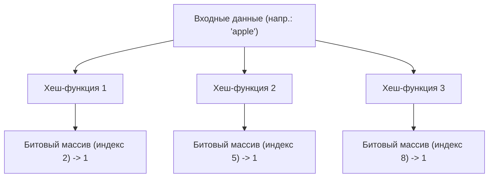
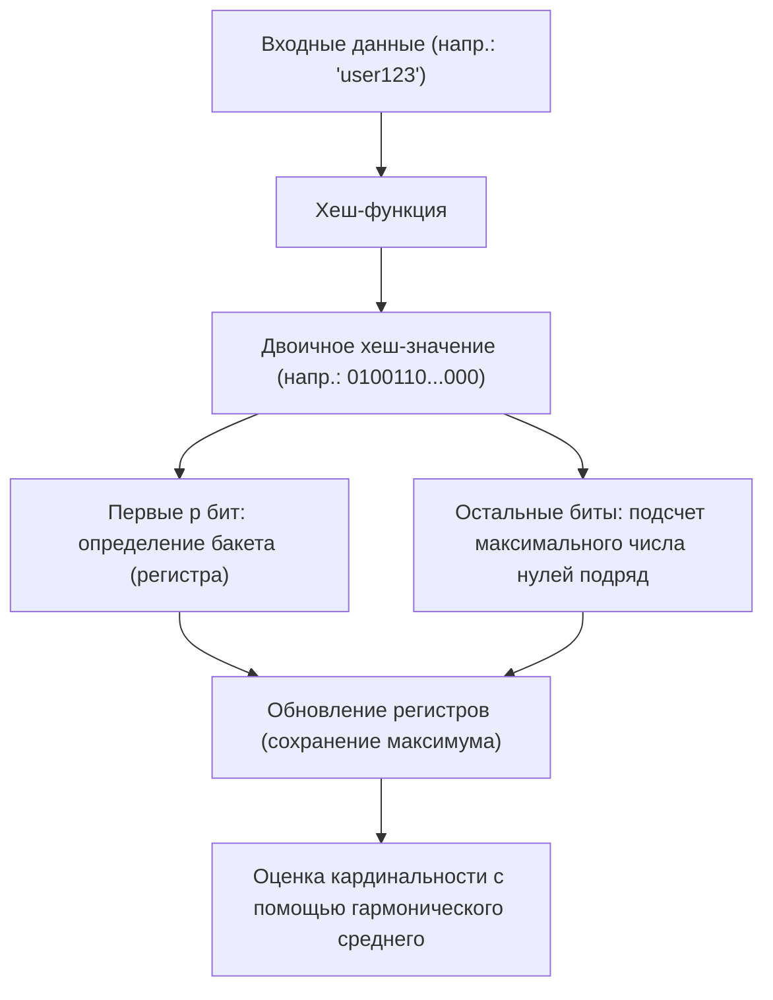

# Чудеса вероятностных структур данных: Фильтр Блума и HyperLogLog

В эпоху больших данных объем обрабатываемой нами информации растет взрывными темпами. Веб-сервисы с миллионами запросов в секунду, социальные сети с миллиардами пользователей или непрерывно генерируемые потоковые данные с датчиков IoT. При обработке столь колоссальных объемов данных одним из главных барьеров, с которым мы сталкиваемся, является «ограничение памяти».

Если попытаться использовать традиционные структуры данных (такие как хеш-таблицы или бинарные деревья поиска) для точного хранения всех элементов в памяти в целях их поиска или подсчета, память быстро исчерпается. Сохранить десятки миллиардов уникальных идентификаторов, чтобы определить, «существует ли уже этот ID?», или подсчитать, «сколько уникальных ID существует?», крайне сложно с точки зрения физических ресурсов.

Для решения этой проблемы были созданы **вероятностные структуры данных (Probabilistic Data Structures)**. Вероятностные структуры данных — это алгоритмы, которые жертвуют «100% точностью» ради «чрезвычайно низкого потребления памяти» и «высокой скорости обработки». В случаях, когда допускается небольшая погрешность (ложноположительные результаты или приближенные значения), они творят настоящие чудеса.

В этой статье мы подробно рассмотрим два самых известных и практичных алгоритма среди вероятностных структур данных — **Фильтр Блума (Bloom Filter)** и **HyperLogLog**, изучим их удивительное устройство, математическую основу и реальные варианты применения.

---

## Фильтр Блума: Экономия памяти при проверке существования

### Что такое Фильтр Блума?
Фильтр Блума — это вероятностная структура данных, изобретенная Бертоном Говардом Блумом в 1970 году. Она используется для быстрой и экономящей память проверки того, «содержится ли определенный элемент во множестве».

Главные особенности Фильтра Блума заключается в следующем:
1. **Если определено, что элемент «существует», это означает, что он «вероятно существует» (возможен ложноположительный результат: False Positive).**
2. **Если определено, что элемент «не существует», это означает, что его «точно нет» (ложноотрицательный результат, False Negative, абсолютно исключен).**

Другими словами, Фильтр Блума может с уверенностью сказать «абсолютно нет», но если он говорит «да», есть небольшая вероятность ошибки. Благодаря этому свойству он широко используется как «предварительный фильтр» для предотвращения ненужных обращений к огромным базам данных.

### Как работает Фильтр Блума

Суть Фильтра Блума — это битовый массив длины $m$ (все начальные значения равны 0) и $k$ различных хеш-функций.

#### Добавление элемента (Add)
При добавлении элемента он подается на вход $k$ хеш-функций. Каждая хеш-функция выдает индекс от $0$ до $m-1$. Затем позиции по этим индексам в битовом массиве устанавливаются в `1`. Даже если несколько хеш-функций указывают на один и тот же индекс, или если он уже был установлен в `1` другим элементом, он просто перезаписывается `1` (то есть остается `1`).

#### Поиск элемента (Check)
При проверке существования элемента он подается на вход $k$ хеш-функций так же, как и при добавлении. Затем проверяются значения битового массива по всем полученным индексам.
- **Если все равны `1`:** Считается, что элемент «вероятно существует».
- **Если есть хотя бы один `0`:** Считается, что элемент «точно не существует».

Почему «вероятно существует»? Потому что даже если искомый элемент никогда не добавлялся, возможно, что индексы его хеш-значений оказались равны `1` случайно, в результате добавления других элементов. Это и есть природа «ложноположительного результата (False Positive)».

### Доля ложноположительных результатов и оптимизация параметров

При проектировании Фильтра Блума важен баланс между длиной битового массива $m$, ожидаемым количеством добавляемых элементов $n$ и количеством хеш-функций $k$.

Доля ложноположительных результатов $p$ приблизительно оценивается по следующей формуле:
$$ p \approx (1 - e^{-kn/m})^k $$

Как видно из этой формулы, чем больше битовый массив (увеличение $m$), тем ниже доля ложноположительных результатов, а чем больше элементов ($n$), тем она выше. Оптимальное количество хеш-функций $k$ вычисляется по следующей формуле:
$$ k = \frac{m}{n} \ln 2 $$

Например, если мы предполагаем добавить 100 миллионов элементов и хотим ограничить долю ложноположительных результатов до 1% (0.01), мы можем вычислить необходимый объем памяти ($m$) и оптимальное количество хеш-функций ($k$). В результате, имея всего около 120 МБ памяти и 7 хеш-функций, мы сможем проверять наличие 100 миллионов элементов. Если бы мы попытались реализовать это с помощью хеш-таблицы, нам потребовалось бы от нескольких до более чем десятка гигабайт памяти.

### Варианты использования Фильтра Блума

Фильтр Блума — мощный инструмент для исключения лишней работы в бэкенд-системах и базах данных.

1. **Сокращение дискового ввода-вывода в базах данных (Cassandra, HBase и др.):**
   При проверке существования данных для определенного ключа, перед обращением к диску выполняется запрос к Фильтру Блума в памяти. Если он определяет, что данные «не существуют», доступ к диску можно полностью пропустить, что кардинально повышает производительность.
2. **CDN и системы кэширования:**
   Чтобы избежать помещения в кэш «One-hit Wonder» (ресурсов, к которым обращаются лишь однажды), используется Фильтр Блума. При первом обращении ресурс только регистрируется в Фильтре Блума, но не кэшируется. Кэширование происходит только при втором обращении (когда Фильтр Блума подтверждает его наличие), что повышает эффективность использования памяти кэшем.
3. **Фильтрация вредоносных URL:**
   Когда браузер сверяется со списком вредоносных веб-сайтов, вместо скачивания всего списка он использует Фильтр Блума. Только если Фильтр Блума говорит, что URL «существует (возможно, вредоносный)», браузер отправляет подробный запрос к серверу.

---

## HyperLogLog: Вершина оценки кардинальности (количества уникальных элементов)

### Что такое HyperLogLog?
Если Фильтр Блума специализируется на «проверке существования элементов», то **HyperLogLog (HLL)** — это вероятностная структура данных, специализирующаяся на «оценке кардинальности (количества уникальных элементов)». Она была представлена Филиппом Флажоле и его коллегами в 2007 году.

Например, предположим, вы хотите подсчитать: «Сколько уникальных пользователей (UU) посетило этот сайт?». Обычно для этого потребовалось бы сохранить все ID пользователей в структуре данных, такой как множество (Set), и измерить ее размер. Однако в масштабах таких компаний, как Google или Twitter, число уникальных элементов достигает десятков миллиардов, и сохранить их все в памяти невозможно.

HyperLogLog выполняет эти вычисления с использованием **всего нескольких килобайт памяти (около 12 КБ)** и с небольшой погрешностью в пару процентов (стандартная ошибка около 0.81%). Это поистине волшебный алгоритм.

### Подбрасывание монеты и математическая модель вероятности

Чтобы понять, как работает HyperLogLog, давайте сначала рассмотрим интуитивную «модель подбрасывания монеты».

Представьте, что вы подбрасываете монету и считаете, сколько раз подряд выпадает «орел».
- Вероятность того, что с первого раза выпадет «решка»: 1/2
- Вероятность того, что «орел» выпадет два раза подряд, а на третий раз — «решка»: 1/8
- Вероятность того, что «орел» выпадет $k$ раз подряд: $1/2^k$

Если кто-то скажет вам: «Я бросал монету, и орел выпал 10 раз подряд», вы наверняка предположите, что этот человек «должно быть, бросал монету очень много раз (примерно $2^{10} = 1024$ раза)». Это связано с тем, что вероятность выпадения орла 10 раз подряд при малом количестве попыток крайне низка.

HyperLogLog применяет это свойство — «вероятность непрерывного появления определенного паттерна зависит от количества попыток» — к хеш-значениям данных.

### Алгоритм HyperLogLog

1. **Хеширование данных:**
   Входные данные (например, ID пользователя) пропускаются через хеш-функцию для получения длинного двоичного числа (например, 64-битного) с равномерным распределением.
2. **Разделение на бакеты (регистры):**
   Чтобы уменьшить дисперсию, используются первые $p$ бит хеш-значения для распределения данных по $m = 2^p$ бакетам (регистрам).
3. **Подсчет идущих подряд нулей:**
   В оставшихся битах хеш-значения подсчитывается, «сколько нулей идут подряд с самого начала». Обозначим это как $\rho(x)$. Это эквивалентно «количеству выпадений орла подряд» при подбрасывании монеты.
4. **Обновление регистра:**
   В каждом бакете (регистре) сохраняется только **максимальное значение** $\rho(x)$, наблюдавшееся до сих пор.
5. **Вычисление оценочного значения с помощью гармонического среднего:**
   Общая кардинальность оценивается на основе максимальных значений из всех регистров. Поскольку простое арифметическое среднее сильно подвержено влиянию выбросов (случайно длинных последовательностей нулей), в HyperLogLog используется **гармоническое среднее (Harmonic Mean)**.

Формула для вычисления оценки $E$ выглядит следующим образом:
$$ E = \alpha_m \cdot m^2 \cdot \left( \sum_{j=1}^{m} 2^{-M[j]} \right)^{-1} $$
Где $m$ — количество бакетов, $M[j]$ — максимальное значение, сохраненное в $j$-м регистре, а $\alpha_m$ — константа для коррекции смещения.

### Поразительная эффективность памяти

Прелесть HyperLogLog заключается в ее экстремальной эффективности использования памяти.
Например, если $p = 14$, то количество бакетов будет равно $2^{14} = 16384$. При использовании 64-битного хеша максимальное количество нулей подряд равно 64, поэтому размер регистра для его хранения составляет всего 6 бит ($2^6 = 64$).

Общее потребление памяти:
$$ 16384 \text{ registers} \times 6 \text{ bits} = 98304 \text{ bits} = 12288 \text{ bytes} \approx 12 \text{ KB} $$

Всего лишь с этими 12 КБ памяти можно оценить количество уникальных элементов, исчисляемое сотнями миллионов и миллиардами, с погрешностью менее 1%. Если сравнить со структурой данных Set, которая потребляла бы сотни гигабайт памяти, разница буквально лежит в другом измерении.

### Варианты использования HyperLogLog

HyperLogLog стала незаменимой технологией в инфраструктуре анализа больших данных.

1. **Подсчет уникальных пользователей (UU) в реальном времени:**
   Используется в инструментах веб-аналитики и на дашбордах для подсчета числа посетителей и просмотров в реальном времени. В in-memory KVS хранилищах, таких как Redis, HyperLogLog реализована стандартными командами, например `PFADD` и `PFCOUNT`.
2. **Анализ и агрегация огромных наборов данных:**
   В распределенных SQL-движках, таких как BigQuery, Amazon Redshift и Presto, HyperLogLog (или ее производные алгоритмы) используется для ускорения запросов типа `COUNT(DISTINCT column_name)`.
3. **Управление состоянием в потоковой обработке:**
   Во фреймворках потоковой обработки, таких как Apache Kafka и Apache Flink, она применяется для подсчета кардинальности бесконечно поступающих потоков данных без исчерпания памяти.

---

## Заключение: Прорывы, обусловленные аппроксимацией

И Фильтр Блума, и HyperLogLog пробили «барьер памяти» в информатике, приняв компромисс — «отказ от 100% точности».

- **Фильтр Блума** предотвращает ненужные обращения, выступая в роли привратника для огромных хранилищ данных, различая состояния «вероятно существует» и «точно не существует».
- **HyperLogLog**, умело сочетая вероятностные свойства подбрасывания монеты и гармоническое среднее, позволяет подсчитывать количество элементов, сравнимое с числом звезд во Вселенной, используя всего несколько килобайт памяти.

За высокоскоростными веб-сервисами, которые мы используем ежедневно как нечто само собой разумеющееся, и системами анализа больших данных, возвращающими результаты за секунды, скрываются прекрасные математические модели и инженерные решения этих вероятностных структур данных. Мощь алгоритмов порой приносит прорывы, выходящие даже за рамки физических ограничений (объема памяти).
