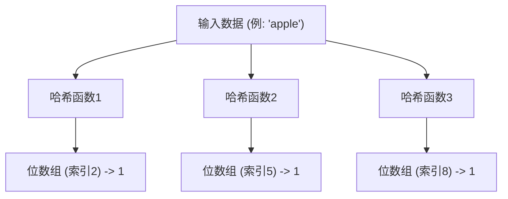
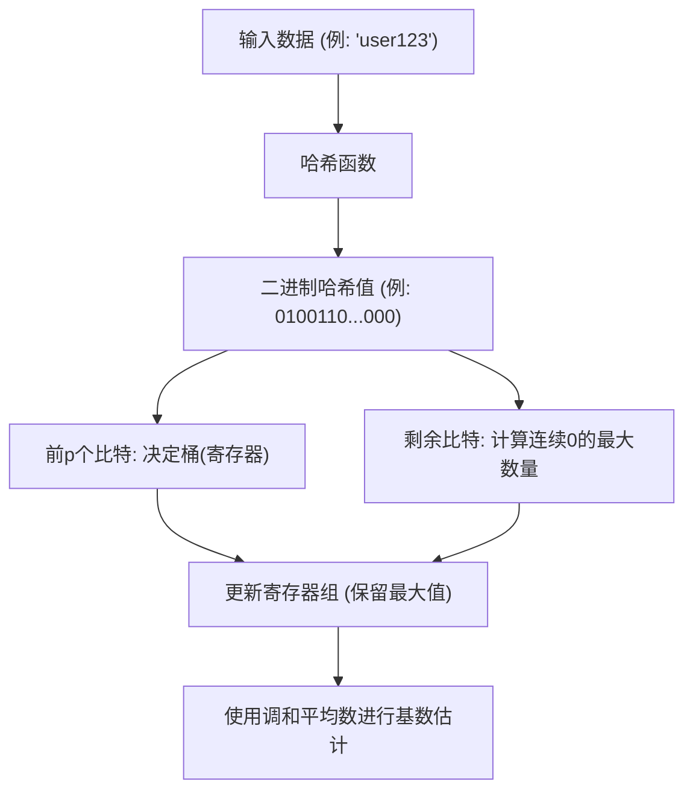

# 概率数据结构的奇迹：布隆过滤器与 HyperLogLog

在大数据时代，我们处理的数据量正呈爆炸式增长。无论是每秒拥有数百万次访问的网络服务，拥有数十亿用户的社交网络，还是不断生成的物联网传感器流数据。在处理如此庞大的数据时，我们面临的最大障碍之一就是“内存的限制”。

如果试图使用传统数据结构（例如哈希表或二叉搜索树）将所有元素准确地保留在内存中以进行搜索或计数，内存将很快被耗尽。从物理资源的角度来看，保存数百亿个唯一 ID 以判断“该 ID 是否已经存在？”或计算“存在多少种唯一 ID？”是非常困难的。

为了解决这个问题，**概率数据结构（Probabilistic Data Structures）**应运而生。概率数据结构是一种以牺牲“100% 准确性”为代价，实现“极低内存消耗”和“高速处理速度”的算法。在可以容忍一定误差（误报或近似值）的用例中，它们能发挥出如同魔法般的效果。

本文将深入探讨概率数据结构中最为著名且实用的两种算法——**布隆过滤器（Bloom Filter）**与 **HyperLogLog**，了解它们惊人的原理、数学背景以及实际应用案例。

---

## 布隆过滤器：存在性判断的内存优化

### 什么是布隆过滤器？
布隆过滤器是 Burton Howard Bloom 在 1970 年提出的一种概率数据结构，用于快速且节省内存地判断“某个元素是否包含在集合中”。

布隆过滤器的最大特点如下：
1. **如果判定元素“存在”，它的意思是“可能存在”（有可能出现误报：False Positive）。**
2. **如果判定元素“不存在”，它的意思是“绝对不存在”（绝不会出现漏报：False Negative）。**

也就是说，布隆过滤器可以断言“绝对没有”，但如果它说“有”，则存在微小的出错可能性。利用这一特性，它被广泛用作“预过滤器”，以防止对大型数据库进行不必要的访问。

### 布隆过滤器的原理

布隆过滤器的本质是一个长度为 $m$ 的位数组（初始值全为 0）和 $k$ 个不同的哈希函数。

#### 添加元素（Add）
添加元素时，将该元素输入到 $k$ 个哈希函数中。每个哈希函数会输出一个从 $0$ 到 $m-1$ 的索引。然后，将位数组中这些索引位置的值设置为 `1`。如果多个哈希函数指向同一个索引，或者该位置已被其他元素设置为 `1`，只需简单地用 `1` 覆盖（即保持为 `1`）即可。

#### 查找元素（Check）
在检查元素是否存在时，同样将该元素输入到 $k$ 个哈希函数中。然后，检查输出的所有索引对应的位数组的值。
- **如果全部为 `1`：** 判定元素“可能存在”。
- **如果包含任何一个 `0`：** 判定元素“绝对不存在”。

为什么说是“可能存在”呢？这是因为，即使我们从未添加过要查找的元素，由于添加了其他元素，该元素的哈希值对应的索引也可能偶然地都变成了 `1`。这就是“误报（False Positive）”的真相。

### 误报率与参数优化

在设计布隆过滤器时，位数组的长度 $m$、预期添加的元素数量 $n$ 以及哈希函数的数量 $k$ 之间的平衡非常重要。

误报率 $p$ 大致可以通过以下公式近似计算：
$$ p \approx (1 - e^{-kn/m})^k $$

从该公式可以看出，位数组越大（增大 $m$），误报率越低；元素数量（$n$）增加，误报率就会上升。此外，最佳的哈希函数数量 $k$ 可以通过以下公式求得：
$$ k = \frac{m}{n} \ln 2 $$

例如，假设要添加 1 亿个元素，且希望将误报率控制在 1%（0.01），我们就可以计算出所需的内存大小（$m$）和最佳哈希函数数量（$k$）。结果表明，只需约 120MB 的内存和 7 个哈希函数，即可实现对 1 亿个元素的存在性判断。如果试图用哈希表来实现，则需要几 GB 到十几 GB 的内存。

### 布隆过滤器的用例

布隆过滤器是后端系统和数据库中用于省去无效处理的强大武器。

1. **减少数据库的磁盘 I/O（如 Cassandra, HBase 等）：**
   在检查与特定键对应的数据是否存在时，在访问磁盘之前会先查询内存中的布隆过滤器。如果判定“不存在”，则可以完全跳过磁盘访问，从而显著提高性能。
2. **CDN 与缓存系统：**
   为了避免将“One-hit Wonder（仅被访问一次的资源）”加载到缓存中，可以使用布隆过滤器。第一次访问仅记录在布隆过滤器中而不进行缓存，只有在第二次访问时（布隆过滤器判定其存在）才开始缓存，从而提高缓存的内存效率。
3. **恶意 URL 过滤：**
   浏览器在核对恶意网站列表时，可以不下载整个列表，而是使用布隆过滤器。只有当布隆过滤器判定“存在（可能存在恶意）”时，才会向服务器发送详细的查询请求。

---

## HyperLogLog：基数（不重复数）估计的极致

### 什么是 HyperLogLog？
与布隆过滤器专门用于“元素的存在性判断”不同，**HyperLogLog（HLL）** 是一种专门用于“估计基数（不重复数：独特元素的数量）”的概率数据结构。由 Flajolet 等人于 2007 年提出。

例如，假设你想计算“访问该网站的独立访客（UU）数是多少？”通常情况下，需要将所有用户 ID 保存在集合（Set）等数据结构中并计算其大小。然而，如果达到 Google 或 Twitter 这样的规模，独特的元素数量将达到数十亿甚至数百亿，将它们全部保存在内存中是不可能的。

HyperLogLog 只需**几千字节（例如约 12KB）**的内存，就能以百分之几的微小误差（标准误差约 0.81%）完成这一计算，简直如同魔法一般的算法。

### 抛硬币与概率的数学模型

为了理解 HyperLogLog 的原理，我们先来想象一个直观的“抛硬币模型”。

假设你在抛硬币，并计算连续出现“正面”的次数。
- 第 1 次出现反面的概率：1/2
- 连续 2 次出现正面，第 3 次出现反面的概率：1/8
- 连续 $k$ 次出现正面的概率：$1/2^k$

如果有人说：“我抛硬币，连续出现了 10 次正面”，你应该可以推测这个人“一定尝试了非常多次（大约 $2^{10} = 1024$ 次左右）的抛硬币”。因为在少量的尝试中连续出现 10 次正面的概率是极低的。

HyperLogLog 将这种“连续出现特定模式的概率取决于尝试次数”的特性应用到了数据的哈希值上。

### HyperLogLog 的算法

1. **数据哈希化：**
   将输入数据（如用户 ID）通过哈希函数处理，得到一个均匀分布的较长二进制数（例如 64 位）。
2. **桶（寄存器）的划分：**
   为了减小方差，使用哈希值的前 $p$ 个比特，将数据分配到 $m = 2^p$ 个桶（寄存器）中。
3. **计算连续的 0：**
   对于哈希值的剩余比特，计算“从头开始连续出现多少个 0”。将其记为 $\rho(x)$。这相当于抛硬币中“连续出现正面的次数”。
4. **寄存器更新：**
   在每个桶（寄存器）中，仅保存迄今为止观察到的 $\rho(x)$ 的**最大值**。
5. **通过调和平均数计算估计值：**
   根据所有寄存器的最大值，估计整体的基数。由于简单的算术平均会受到异常值（偶然出现极长的连续 0）的很大影响，因此 HyperLogLog 使用**调和平均数（Harmonic Mean）**。

求解估计值 $E$ 的公式如下所示：
$$ E = \alpha_m \cdot m^2 \cdot \left( \sum_{j=1}^{m} 2^{-M[j]} \right)^{-1} $$
其中，$m$ 是桶的数量，$M[j]$ 是保存在第 $j$ 个寄存器中的最大值，$\alpha_m$ 是用于校正偏差的常数。

### 惊人的内存效率

HyperLogLog 的厉害之处在于其极端的内存效率。
例如，假设 $p = 14$，那么桶的数量就是 $2^{14} = 16384$ 个。如果使用 64 位哈希，连续 0 的数量最多也就 64 个，因此保存它所需的寄存器大小只需 6 个比特（$2^6 = 64$）。

整体的内存消耗量：
$$ 16384 \text{ registers} \times 6 \text{ bits} = 98304 \text{ bits} = 12288 \text{ bytes} \approx 12 \text{ KB} $$

仅用这 12KB 的内存，就能以不到 1% 的误差估计出数亿、数十亿个独特元素的数量。与需要消耗数百 GB 内存的普通 Set 数据结构相比，两者的差距简直是跨维度的。

### HyperLogLog 的用例

HyperLogLog 已经成为大数据分析平台中不可或缺的技术。

1. **实时计算独立访客（UU）：**
   在访问分析工具或数据大屏中，用于实时统计访客或浏览者的数量。像 Redis 等内存键值存储系统中，就标配了基于 HyperLogLog 的 `PFADD` 和 `PFCOUNT` 命令。
2. **超大型数据集的分析与聚合：**
   在 BigQuery、Amazon Redshift、Presto 等分布式 SQL 引擎中，利用 HyperLogLog（或其衍生算法）来加速类似于 `COUNT(DISTINCT column_name)` 的查询。
3. **流处理中的状态管理：**
   在 Apache Kafka、Apache Flink 等流处理框架中，它被用于在不耗尽内存的情况下，计算无限数据流的基数。

---

## 总结：近似带来的突破

布隆过滤器与 HyperLogLog 都通过接受“放弃 100% 准确性”这种权衡，突破了计算机科学中的“内存壁垒”。

- **布隆过滤器**通过区分“可能存在”与“绝对不存在”，充当大型数据存储的守门人，从而防止无效的访问。
- **HyperLogLog**巧妙地结合了抛硬币的概率性质与调和平均数，仅用几千字节的内存就能计算出多如繁星的元素数量。

我们日常理所当然使用的高速网络服务，以及在几秒内返回结果的大数据分析系统，其背后都隐藏着这些概率数据结构优美的数学模型与工程巧思。算法的力量，有时能够带来超越物理限制（内存容量）的突破。
