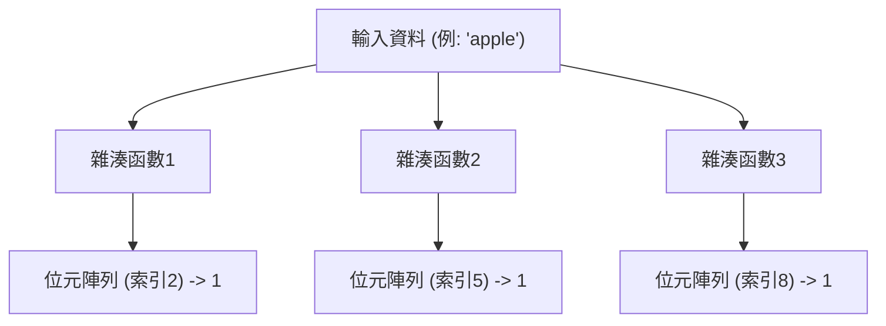
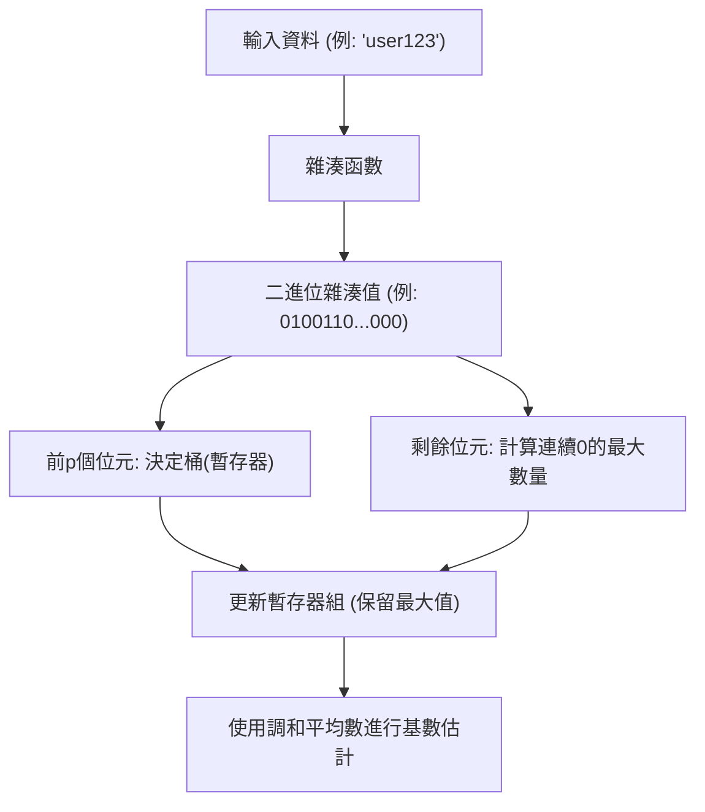

# 機率資料結構的奇蹟：布隆過濾器與 HyperLogLog

在大數據時代，我們處理的資料量正呈爆炸性成長。無論是每秒擁有數百萬次存取的網路服務，擁有數十億使用者的社群網路，還是不斷生成的物聯網感測器串流資料。在處理如此龐大的資料時，我們面臨的最大障礙之一就是「記憶體的限制」。

如果試圖使用傳統資料結構（例如雜湊表或二元搜尋樹）將所有元素準確地保留在記憶體中以進行搜尋或計數，記憶體將很快被耗盡。從實體資源的角度來看，保存數百億個唯一 ID 以判斷「該 ID 是否已經存在？」或計算「存在多少種唯一 ID？」是非常困難的。

為了解決這個問題，**機率資料結構（Probabilistic Data Structures）**應運而生。機率資料結構是一種以犧牲「100% 準確性」為代價，實現「極低記憶體消耗」和「高速處理速度」的演算法。在可以容忍一定誤差（誤報或近似值）的應用場景中，它們能發揮出如同魔法般的效果。

本文將深入探討機率資料結構中最為著名且實用的兩種演算法——**布隆過濾器（Bloom Filter）**與 **HyperLogLog**，了解它們驚人的原理、數學背景以及實際應用案例。

---

## 布隆過濾器：存在性判斷的記憶體最佳化

### 什麼是布隆過濾器？
布隆過濾器是 Burton Howard Bloom 在 1970 年提出的一種機率資料結構，用於快速且節省記憶體地判斷「某個元素是否包含在集合中」。

布隆過濾器的最大特點如下：
1. **如果判定元素「存在」，它的意思是「可能存在」（有可能出現誤報：False Positive）。**
2. **如果判定元素「不存在」，它的意思是「絕對不存在」（絕不會出現漏報：False Negative）。**

也就是說，布隆過濾器可以斷言「絕對沒有」，但如果它說「有」，則存在微小的出錯可能性。利用這一特性，它被廣泛用作「預過濾器」，以防止對大型資料庫進行不必要的存取。

### 布隆過濾器的原理

布隆過濾器的本質是一個長度為 $m$ 的位元陣列（初始值全為 0）和 $k$ 個不同的雜湊函數。

#### 添加元素（Add）
加入元素時，將該元素輸入到 $k$ 個雜湊函數中。每個雜湊函數會輸出一個從 $0$ 到 $m-1$ 的索引。然後，將位元陣列中這些索引位置的值設定為 `1`。如果多個雜湊函數指向同一個索引，或者該位置已被其他元素設定為 `1`，只需簡單地用 `1` 覆寫（即保持為 `1`）即可。

#### 尋找元素（Check）
在檢查元素是否存在時，同樣將該元素輸入到 $k$ 個雜湊函數中。然後，檢查輸出的所有索引對應的位元陣列的值。
- **如果全部為 `1`：** 判定元素「可能存在」。
- **如果包含任何一個 `0`：** 判定元素「絕對不存在」。

為什麼說是「可能存在」呢？這是因為，即使我們從未加入過要尋找的元素，由於加入了其他元素，該元素的雜湊值對應的索引也可能偶然地都變成了 `1`。這就是「誤報（False Positive）」的真相。

### 誤報率與參數最佳化

在設計布隆過濾器時，位元陣列的長度 $m$、預期加入的元素數量 $n$ 以及雜湊函數的數量 $k$ 之間的平衡非常重要。

誤報率 $p$ 大致可以透過以下公式近似計算：
$$ p \approx (1 - e^{-kn/m})^k $$

從該公式可以看出，位元陣列越大（增大 $m$），誤報率越低；元素數量（$n$）增加，誤報率就會上升。此外，最佳的雜湊函數數量 $k$ 可以透過以下公式求得：
$$ k = \frac{m}{n} \ln 2 $$

例如，假設要加入 1 億個元素，且希望將誤報率控制在 1%（0.01），我們就可以計算出所需的記憶體大小（$m$）和最佳雜湊函數數量（$k$）。結果表明，只需約 120MB 的記憶體和 7 個雜湊函數，即可實現對 1 億個元素的存在性判斷。如果試圖用雜湊表來實現，則需要數 GB 到十幾 GB 的記憶體。

### 布隆過濾器的使用案例

布隆過濾器是後端系統和資料庫中用於省去無效處理的強大武器。

1. **減少資料庫的磁碟 I/O（如 Cassandra, HBase 等）：**
   在檢查與特定鍵對應的資料是否存在時，在存取磁碟之前會先查詢記憶體中的布隆過濾器。如果判定「不存在」，則可以完全跳過磁碟存取，從而顯著提高效能。
2. **CDN 與快取系統：**
   為了避免將「One-hit Wonder（僅被存取一次的資源）」加載到快取中，可以使用布隆過濾器。第一次存取僅記錄在布隆過濾器中而不進行快取，只有在第二次存取時（布隆過濾器判定其存在）才開始快取，從而提高快取的記憶體效率。
3. **惡意 URL 過濾：**
   瀏覽器在核對惡意網站清單時，可以不下載整個清單，而是使用布隆過濾器。只有當布隆過濾器判定「存在（可能存在惡意）」時，才會向伺服器發送詳細的查詢請求。

---

## HyperLogLog：基數（不重複數）估計的極致

### 什麼是 HyperLogLog？
與布隆過濾器專門用於「元素的存在性判斷」不同，**HyperLogLog（HLL）** 是一種專門用於「估計基數（不重複數：獨特元素的數量）」的機率資料結構。由 Flajolet 等人於 2007 年提出。

例如，假設你想計算「存取該網站的獨立訪客（UU）數是多少？」通常情況下，需要將所有使用者 ID 保存在集合（Set）等資料結構中並計算其大小。然而，如果達到 Google 或 Twitter 這樣的規模，獨特的元素數量將達到數十億甚至數百億，將它們全部保存在記憶體中是不可能的。

HyperLogLog 只需**幾千位元組（例如約 12KB）**的記憶體，就能以百分之幾的微小誤差（標準誤差約 0.81%）完成這一計算，簡直如同魔法一般的演算法。

### 擲硬幣與機率的數學模型

為了理解 HyperLogLog 的原理，我們先來想像一個直觀的「擲硬幣模型」。

假設你在擲硬幣，並計算連續出現「正面」的次數。
- 第 1 次出現反面的機率：1/2
- 連續 2 次出現正面，第 3 次出現反面的機率：1/8
- 連續 $k$ 次出現正面的機率：$1/2^k$

如果有人說：「我擲硬幣，連續出現了 10 次正面」，你應該可以推測這個人「一定嘗試了非常多次（大約 $2^{10} = 1024$ 次左右）的擲硬幣」。因為在少量的嘗試中連續出現 10 次正面的機率是極低的。

HyperLogLog 將這種「連續出現特定模式的機率取決於嘗試次數」的特性應用到了資料的雜湊值上。

### HyperLogLog 的演算法

1. **資料雜湊化：**
   將輸入資料（如使用者 ID）透過雜湊函數處理，得到一個均勻分佈的較長二進位數（例如 64 位元）。
2. **桶（暫存器）的劃分：**
   為了減小變異數，使用雜湊值的前 $p$ 個位元，將資料分配到 $m = 2^p$ 個桶（暫存器）中。
3. **計算連續的 0：**
   對於雜湊值的剩餘位元，計算「從頭開始連續出現多少個 0」。將其記為 $\rho(x)$。這相當於擲硬幣中「連續出現正面的次數」。
4. **暫存器更新：**
   在每個桶（暫存器）中，僅保存迄今為止觀察到的 $\rho(x)$ 的**最大值**。
5. **透過調和平均數計算估計值：**
   根據所有暫存器的最大值，估計整體的基數。由於簡單的算術平均會受到異常值（偶然出現極長的連續 0）的很大影響，因此 HyperLogLog 使用**調和平均數（Harmonic Mean）**。

求解估計值 $E$ 的公式如下所示：
$$ E = \alpha_m \cdot m^2 \cdot \left( \sum_{j=1}^{m} 2^{-M[j]} \right)^{-1} $$
其中，$m$ 是桶的數量，$M[j]$ 是保存在第 $j$ 個暫存器中的最大值，$\alpha_m$ 是用於校正偏差的常數。

### 驚人的記憶體效率

HyperLogLog 的厲害之處在於其極端的記憶體效率。
例如，假設 $p = 14$，那麼桶的數量就是 $2^{14} = 16384$ 個。如果使用 64 位元雜湊，連續 0 的數量最多也就 64 個，因此保存它所需的暫存器大小只需 6 個位元（$2^6 = 64$）。

整體的記憶體消耗量：
$$ 16384 \text{ registers} \times 6 \text{ bits} = 98304 \text{ bits} = 12288 \text{ bytes} \approx 12 \text{ KB} $$

僅用這 12KB 的記憶體，就能以不到 1% 的誤差估計出數億、數十億個獨特元素的數量。與需要消耗數百 GB 記憶體的普通 Set 資料結構相比，兩者的差距簡直是跨維度的。

### HyperLogLog 的使用案例

HyperLogLog 已經成為大數據分析平台中不可或缺的技術。

1. **即時計算獨立訪客（UU）：**
   在存取分析工具或數據儀表板中，用於即時統計訪客或瀏覽者的數量。像 Redis 等記憶體鍵值儲存系統中，就標配了基於 HyperLogLog 的 `PFADD` 和 `PFCOUNT` 指令。
2. **超大型資料集的分析與聚合：**
   在 BigQuery、Amazon Redshift、Presto 等分散式 SQL 引擎中，利用 HyperLogLog（或其衍生演算法）來加速類似於 `COUNT(DISTINCT column_name)` 的查詢。
3. **串流處理中的狀態管理：**
   在 Apache Kafka、Apache Flink 等串流處理框架中，它被用於在不耗盡記憶體的情況下，計算無限資料流的基數。

---

## 總結：近似帶來的突破

布隆過濾器與 HyperLogLog 都透過接受「放棄 100% 準確性」這種權衡，突破了計算機科學中的「記憶體壁壘」。

- **布隆過濾器**透過區分「可能存在」與「絕對不存在」，充當大型資料儲存的守門員，從而防止無效的存取。
- **HyperLogLog**巧妙地結合了擲硬幣的機率性質與調和平均數，僅用幾千位元組的記憶體就能計算出多如繁星的元素數量。

我們日常理所當然使用的高速網路服務，以及在幾秒內返回結果的大數據分析系統，其背後都隱藏著這些機率資料結構優美的數學模型與工程巧思。演算法的力量，有時能夠帶來超越實體限制（記憶體容量）的突破。
