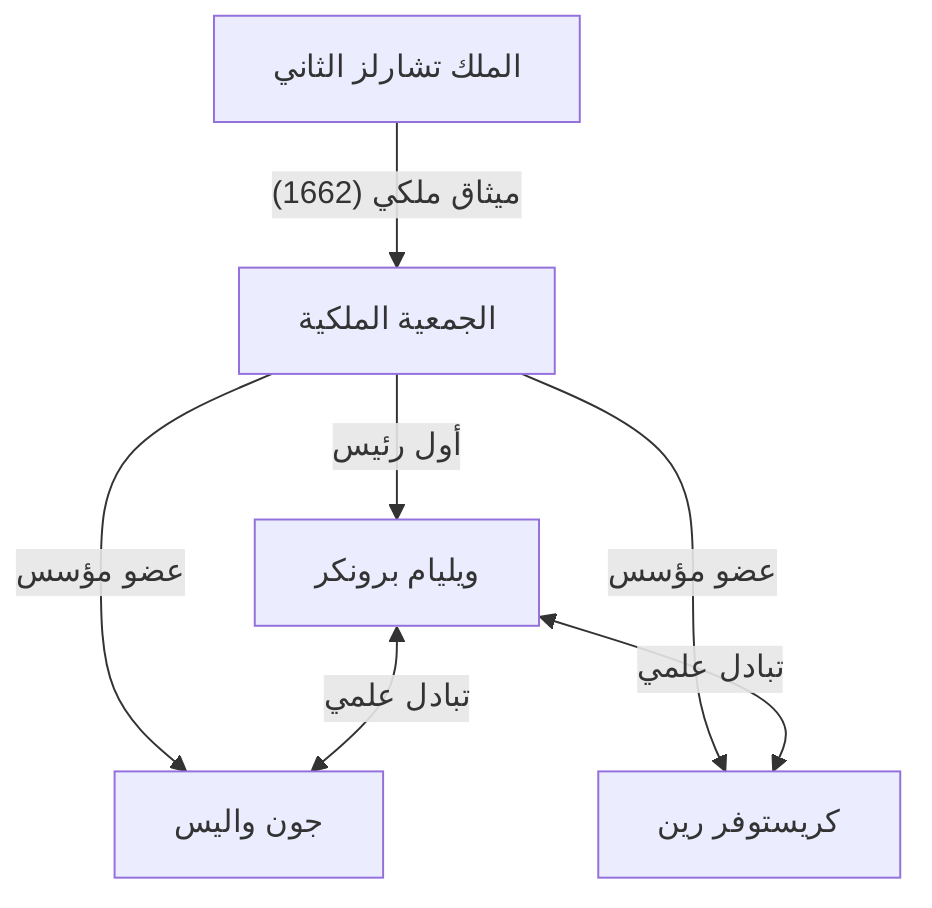
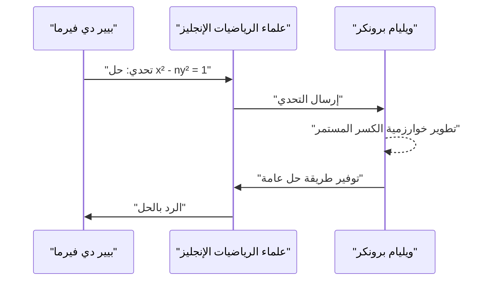

## 1. مقدمة

كانت أوروبا في القرن السابع عشر في خضم ثورة علمية. لقد كان عصرًا حققت فيه الرياضيات والفيزياء قفزات هائلة إلى الأمام، كما يتجسد ذلك في اكتشاف التفاضل والتكامل على يد إسحاق نيوتن وغوتفريد فيلهيلم لايبنتز. وفي خضم ذلك، كانت المؤسسة التي لعبت دورًا مركزيًا في تطوير الأوساط الأكاديمية البريطانية هي **الجمعية الملكية** (The Royal Society).

يقدم هذا المقال شرحًا مفصلاً عن حياة وإنجازات **ويليام برونكر** الرياضية الرائعة، والذي شغل منصب أول رئيس للجمعية الملكية وترك بصمته في التاريخ كعالم رياضيات من خلال "تمثيل الكسر المستمر لباي" و "حل معادلة بيل". تفاعل برونكر مع كبار العقول في أوروبا في ذلك الوقت وتصدى للعديد من المشاكل الصعبة. ساهمت إنجازاته بشكل كبير في إرساء الأساس للمعالجة الرياضية الصارمة لمفهوم اللانهاية.

## 2. النشأة والمسيرة المبكرة

وُلد ويليام برونكر (1620 - 5 أبريل 1684) كابن أكبر لويليام برونكر، الفيكونت برونكر الأول، ووينيفريد لي. في حين أن هناك العديد من التفاصيل المجهولة حول مكان ولادته الدقيق وتعليمه المبكر، يُعتقد أنه درس في جامعة أكسفورد، حيث طور مهارات لغوية ممتازة وحسًا رياضيًا. في عام 1645، بعد وفاة والده، أصبح الفيكونت برونكر الثاني.

في ذلك الوقت، كانت إنجلترا في الفترة الفوضوية للثورة التطهيرية (الحرب الأهلية الإنجليزية)، لكن برونكر كرس نفسه للعالم الأكاديمي أكثر من المسرح السياسي. كان لديه اهتمام قوي بشكل خاص بالرياضيات والموسيقى، وبدأ في بناء نظرياته الخاصة. في عام 1647، حصل على درجة دكتور في الطب من جامعة أكسفورد، لكن اهتمامه الرئيسي ظل دائمًا في العلوم الدقيقة. وكان شقيقه الأصغر، هنري برونكر، معروفًا أيضًا بنشاطه في العالم السياسي والملكي مع الحفاظ على اهتمامه بالشطرنج والرياضيات.

## 3. الأنشطة كأول رئيس للجمعية الملكية

الجمعية الملكية هي واحدة من أقدم الجمعيات العلمية في العالم، ومكرسة لتحسين المعرفة الطبيعية. تكمن أصولها في تجمع تشكل بعد محاضرة ألقاها كريستوفر رين في لندن عام 1660، وانطلقت رسميًا في عام 1662 بعد حصولها على ميثاق ملكي من الملك تشارلز الثاني.

وتم انتخاب ويليام برونكر **كأول رئيس** لهذه الجمعية التاريخية. وفي خضم تشكيل الجمعية من خلال جهود روبرت موراي وآخرين، عمل برونكر كرئيس لفترة طويلة بلغت 15 عامًا، من 1662 إلى 1677، مكرسًا نفسه لبناء أسس الجمعية.

لعب برونكر دورًا حاسمًا في الجمع بين علماء بارزين مثل روبرت بويل وروبرت هوك، وفي تأسيس منهجية علمية جديدة تؤكد على التحقق التجريبي. وقد شارك بنشاط في التجارب المتعلقة بحركة البندولات ووزن الغلاف الجوي، حيث قدم العديد من التقارير في اجتماعات الجمعية. كما عمل كقناة اتصال مع العائلة المالكة، مما ساهم بشكل كبير في الاستقرار المالي والاجتماعي للجمعية.

## 4. الإنجاز الرياضي: تمثيل الكسر المستمر لباي

يعد اكتشاف الكسر المستمر المعمم لنسبة المحيط $\pi$ أشهر إنجاز رياضي لبرونكر. تم تقديم هذا في كتاب *Arithmetica Infinitorum* (1655) من قبل عالم الرياضيات المعاصر جون واليس، مما جعله معروفًا على نطاق واسع.

### صيغة واليس وتحويل برونكر

كان واليس قد اكتشف الضرب اللانهائي التالي (صيغة واليس) بخصوص باي:

$$
\frac{\pi}{2} = \frac{2}{1} \cdot \frac{2}{3} \cdot \frac{4}{3} \cdot \frac{4}{5} \cdot \frac{6}{5} \cdot \frac{6}{7} \cdot \frac{8}{7} \cdots
$$

عرض واليس هذه النتيجة على برونكر وسأله عما إذا كان يمكن التعبير عنها بشكل مختلف. ردًا على ذلك، وبواسطة التلاعب الجبري ومفهوم ذكي للحدود، حوّل برونكر هذه المعادلة ببراعة إلى كسر مستمر. هذه هي **صيغة برونكر** التالية:

$$
\frac{4}{\pi} = 1 + \frac{1^2}{2 + \frac{3^2}{2 + \frac{5^2}{2 + \frac{7^2}{2 + \ddots}}}}
$$

### أهمية الصيغة ونظرة عامة على الإثبات

لقد أسر هذا الكسر المستمر العديد من علماء الرياضيات بجماله وانتظامه. فهو يمتلك بنية أنيقة بشكل ملحوظ حيث تظهر مربعات الأعداد الفردية بشكل مستمر في البسوط، ويكون الجزء الصحيح من المقامات دائمًا $2$. أثبت هذا الاكتشاف أن العدد المتسامي باي مضمن ضمن انتظام بسيط للأعداد الطبيعية.

الكسور المستمرة هي أدوات قوية للغاية لتقريب الأعداد غير النسبية. على الرغم من أن صيغة برونكر تتقارب ببطء شديد وبالتالي كانت غير مناسبة للحساب العملي لـ باي، إلا أنها كان لها تأثير هائل على الرياضيات اللاحقة كمثال رائد لتوسع الكسر المستمر في التحليل. قام أويلر لاحقًا بتعميم هذه الصيغة بشكل أكبر، مما أدى إلى تطوير نظرية الكسور المستمرة بعمق.

## 5. الإنجاز الرياضي: حل معادلة بيل

إنجاز مهم آخر هو حل ما يسمى بـ **معادلة بيل**. معادلة بيل هي معادلة ديوفانتية (معادلة متعددة الحدود بمعاملات صحيحة) من الشكل التالي لعدد صحيح موجب $n$ ليس مربعًا كاملاً:

$$
x^2 - n y^2 = 1 \quad (\text{حيث } x, y \text{ أعداد صحيحة})
$$

### تحدي من فيرما

في عام 1657، أرسل عالم الرياضيات الفرنسي العظيم بيير دي فيرما تحديًا لعلماء الرياضيات الإنجليز لإيجاد حلول صحيحة لهذه المعادلة. استشهد فيرما بحالات صعبة مثل $n=61$ كأمثلة.

### خوارزمية برونكر

واليس وبرونكر هما من واجها هذا التحدي. طور برونكر على وجه الخصوص طريقة تعادل تقريبًا الخوارزمية المعروفة اليوم باسم "طريقة الكسر المستمر"، مؤسسًا إجراءً لإيجاد أصغر حل صحيح موجب للمعادلة لأي عدد غير مربع $n$.

يتضمن نهج برونكر حساب توسع الكسر المستمر لـ $\sqrt{n}$ وبناء الحل باستخدام كسوره التقاربية. على سبيل المثال، في حالة $n=2$، تصبح المعادلة $x^2 - 2y^2 = 1$. توسع الكسر المستمر لـ $\sqrt{2}$ هو $[1; 2, 2, 2, \dots]$، وبحساب تقارباتها، يمكننا الحصول على الحل الأدنى $x=3, y=2$. في الواقع، $3^2 - 2 \cdot 2^2 = 9 - 8 = 1$ صحيحة.

في حالة $n=61$ التي قدمها فيرما، فإن الحل الأدنى كبير بشكل غير عادي:

$$
x = 1766319049, \quad y = 226153980
$$

أثبت برونكر أنه يمكن استنتاج حتى هذه الحلول العملاقة بشكل منهجي باستخدام طريقته. ومن المفارقات، وبسبب سوء فهم من قبل ليونهارت أويلر، سُميت هذه المعادلة لاحقًا باسم عالم الرياضيات الإنجليزي جون بيل، لكن المساهمة الأكبر في تأسيس طريقة الحل تعود بلا شك إلى برونكر.

## 6. إنجازات أخرى والسنوات اللاحقة

### مساهمات في نظرية الموسيقى

لم يكن برونكر مهتمًا بالرياضيات فحسب، بل بنظرية الموسيقى أيضًا. قام بترجمة كتاب رينيه ديكارت *Musicae Compendium* إلى اللغة الإنجليزية ونشره دون الكشف عن هويته. وعند القيام بذلك، لم يكتف بترجمته فحسب، بل أضاف ملحقًا يقترح نظامه الخاص للضبط (17 نغمة متساوية المزاج) والذي قسّم الأوكتاف إلى 17 فترة متساوية. كانت هذه محاولة رائدة لتحليل السلالم الموسيقية رياضيًا باستخدام اللوغاريتمات.

### تربيع القطع المكافئ والمنحنى اللوغاريتمي

علاوة على ذلك، أجرى أبحاثًا مهمة حول تربيع (إيجاد المساحة) القطع الزائد. ابتكر طريقة لحساب مساحة القطع الزائد باستخدام متسلسلات لانهائية، مما أدى إلى توسع متسلسلة الدالة اللوغاريتمية. ومعاصرة لنيكولاس ميركاتور، أدرك فائدة المتسلسلات اللانهائية في حساب اللوغاريتمات الطبيعية. كان هذا خطوة حاسمة في التطور اللاحق لحساب التفاضل والتكامل.

### المقذوفات والميكانيكا

في مجال الميكانيكا، أجرى بحثًا حول ارتداد البنادق وتحقق من نظرية كريستيان هوغنس حول تساوت زمن البندولات. يوضح ذلك أنه لم يكن لديه عين للاستكشاف النظري فحسب، بل أيضًا للتطبيقات العملية والعسكرية.

في سنواته الأخيرة، وحتى بعد تنحيه عن رئاسة الجمعية الملكية، شغل برونكر مناصب عامة مثل مفوض مجلس البحرية. يظهر اسم برونكر بشكل متكرر في مذكرات صموئيل بيبس الشهيرة كزميل قادر في الإدارة البحرية. ظل غير متزوج طوال حياته وتوفي في منزله في لندن عام 1684.

## 7. خاتمة

كان ويليام برونكر قائدًا متميزًا وعالم رياضيات أصليًا قاد المجتمع العلمي البريطاني في القرن السابع عشر. إنجازاته في إرساء أسس العلم الحديث كأول رئيس للجمعية الملكية لا تقدر بثمن. بالإضافة إلى ذلك، أصبحت إنجازاته الرياضية، مثل تمثيل الكسر المستمر لـ باي وحل معادلة بيل، معالم مهمة في تطور التحليل، الذي يتعامل مع مفهوم اللانهاية، ونظرية الأعداد.

يرمز نهجه إلى الفترة الانتقالية من الهندسة الصارمة إلى التحليل باستخدام الجبر والمتسلسلات اللانهائية. في حين أن اسمه غالبًا ما يطغى عليه عمالقة مثل نيوتن وفيرما، بدون وجود **برونكر**، لا يمكن مناقشة ثراء الرياضيات اليوم. يستمر فضوله الفكري وروح البحث في التألق أمامنا كجمال للرياضيات حتى بعد مئات السنين.
