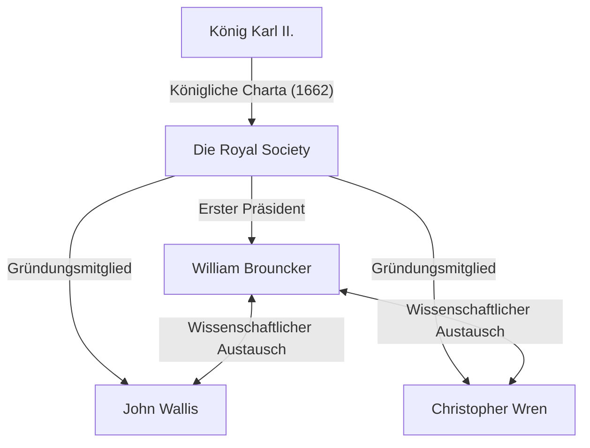
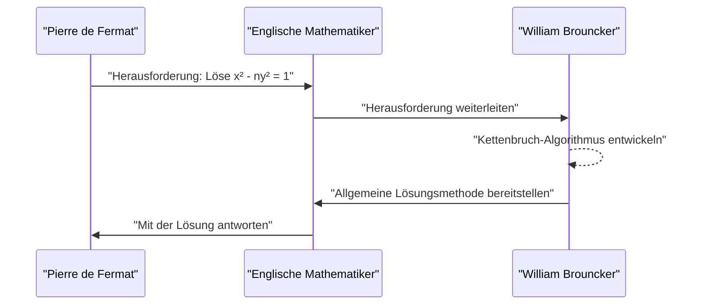

## 1. Einleitung

Das Europa des 17. Jahrhunderts befand sich inmitten einer wissenschaftlichen Revolution. Es war eine Ära, in der Mathematik und Physik dramatische Sprünge nach vorne machten, wie die Entdeckung der Infinitesimalrechnung durch [Isaac Newton](https://kenji.blog/de/p/newton/) und Gottfried Wilhelm Leibniz verdeutlicht. Inmitten dieser Entwicklung war die Institution, die eine zentrale Rolle in der Entwicklung der britischen akademischen Welt spielte, die **Royal Society**.

Dieser Artikel bietet eine detaillierte Erklärung des Lebens und der bemerkenswerten mathematischen Errungenschaften von **[William Brouncker](https://kenji.blog/de/p/brouncker/)**, der als erster Präsident der Royal Society fungierte und in der Geschichte als Mathematiker mit seiner „Kettenbruchdarstellung von Pi“ und der „Lösung der Pellschen Gleichung“ seine Spuren hinterließ. [Brouncker](https://kenji.blog/de/p/brouncker/) interagierte mit den klügsten Köpfen Europas seiner Zeit und nahm sich zahlreicher herausfordernder Probleme an. Seine Errungenschaften trugen maßgeblich dazu bei, den Grundstein für die mathematisch strenge Behandlung des Unendlichkeitsbegriffs zu legen.

## 2. Frühes Leben und Karriere

[William Brouncker](https://kenji.blog/de/p/brouncker/) (1620 - 5. April 1684) wurde als ältester Sohn von William Brouncker, 1. Viscount Brouncker, und Winifred Leigh geboren. Obwohl viele Details über seinen genauen Geburtsort und seine frühe Bildung unbekannt sind, wird angenommen, dass er an der Universität Oxford studierte und dort exzellente sprachliche Fähigkeiten und ein mathematisches Gespür entwickelte. Im Jahr 1645 wurde er nach dem Tod seines Vaters der 2. Viscount [Brouncker](https://kenji.blog/de/p/brouncker/).

Zu dieser Zeit befand sich England in der chaotischen Phase der Puritanischen Revolution (Englischer Bürgerkrieg), aber [Brouncker](https://kenji.blog/de/p/brouncker/) widmete sich mehr der akademischen Welt als der politischen Bühne. Er hatte ein besonders starkes Interesse an Mathematik und Musik und begann, seine eigenen Theorien aufzustellen. Im Jahr 1647 wurde ihm ein Doktortitel in Medizin von der Universität Oxford verliehen, aber sein Hauptinteresse galt stets den exakten Wissenschaften. Sein jüngerer Bruder, Henry [Brouncker](https://kenji.blog/de/p/brouncker/), war ebenfalls dafür bekannt, in der politischen und höfischen Welt aktiv zu sein, während er ein Interesse an Schach und Mathematik beibehielt.

## 3. Aktivitäten als erster Präsident der Royal Society

Die Royal Society ist eine der ältesten wissenschaftlichen Gesellschaften der Welt, die sich der Verbesserung des naturwissenschaftlichen Wissens widmet. Ihre Ursprünge liegen in einer Versammlung, die sich nach einem Vortrag von Christopher Wren in London im Jahr 1660 bildete. Sie wurde offiziell 1662 nach Erhalt einer königlichen Charta (Royal Charter) von König Karl II. gegründet.

Zum **ersten Präsidenten** dieser historischen Gesellschaft wurde [William Brouncker](https://kenji.blog/de/p/brouncker/) gewählt. Während die Gesellschaft durch die Bemühungen von Robert Moray und anderen Gestalt annahm, diente [Brouncker](https://kenji.blog/de/p/brouncker/) 15 Jahre lang, von 1662 bis 1677, als Präsident und widmete sich dem Aufbau der Fundamente der Gesellschaft.

[Brouncker](https://kenji.blog/de/p/brouncker/) spielte eine entscheidende Rolle dabei, herausragende Wissenschaftler wie Robert Boyle und Robert Hooke zusammenzubringen und eine neue wissenschaftliche Methodik zu etablieren, die experimentelle Überprüfungen betonte. Er selbst nahm aktiv an Experimenten über die Bewegung von Pendeln und das Gewicht der Atmosphäre teil und präsentierte zahlreiche Berichte auf den Treffen der Gesellschaft. Er fungierte auch als Verbindung zum Königshaus und trug wesentlich zur finanziellen und sozialen Stabilität der Gesellschaft bei.

## 4. Mathematische Errungenschaft: Kettenbruchdarstellung von Pi

[Brouncker](https://kenji.blog/de/p/brouncker/)s berühmteste mathematische Errungenschaft ist die Entdeckung des verallgemeinerten Kettenbruchs für die Kreiszahl $\pi$. Diese wurde in dem Buch *Arithmetica Infinitorum* (1655) des zeitgenössischen Mathematikers [John Wallis](https://kenji.blog/de/p/wallis/) vorgestellt, was sie weithin bekannt machte.

### [Wallis](https://kenji.blog/de/p/wallis/)' Formel und [Brouncker](https://kenji.blog/de/p/brouncker/)s Transformation

[Wallis](https://kenji.blog/de/p/wallis/) hatte das folgende unendliche Produkt ([Wallis](https://kenji.blog/de/p/wallis/)sches Produkt) bezüglich Pi entdeckt:

$$
\frac{\pi}{2} = \frac{2}{1} \cdot \frac{2}{3} \cdot \frac{4}{3} \cdot \frac{4}{5} \cdot \frac{6}{5} \cdot \frac{6}{7} \cdot \frac{8}{7} \cdots
$$

[Wallis](https://kenji.blog/de/p/wallis/) zeigte Brouncker dieses Ergebnis und fragte, ob es in einer anderen Form ausgedrückt werden könnte. Als Antwort darauf wandelte Brouncker diese Gleichung durch algebraische Manipulationen und ein cleveres Konzept von Grenzwerten meisterhaft in einen Kettenbruch um. Dies ist die folgende **[Brouncker](https://kenji.blog/de/p/brouncker/)-Formel**:

$$
\frac{4}{\pi} = 1 + \frac{1^2}{2 + \frac{3^2}{2 + \frac{5^2}{2 + \frac{7^2}{2 + \ddots}}}}
$$

### Bedeutung der Formel und Beweisübersicht

Dieser Kettenbruch faszinierte viele Mathematiker durch seine Schönheit und Regelmäßigkeit. Er besitzt eine bemerkenswert elegante Struktur, bei der die Quadrate der ungeraden Zahlen kontinuierlich in den Zählern erscheinen und der ganzzahlige Teil der Nenner immer $2$ ist. Diese Entdeckung zeigte, dass die transzendente Zahl Pi in eine einfache Regelmäßigkeit natürlicher Zahlen eingebettet ist.

Kettenbrüche sind sehr mächtige Werkzeuge zur Approximation irrationaler Zahlen. Obwohl [Brouncker](https://kenji.blog/de/p/brouncker/)s Formel sehr langsam konvergiert und daher für praktische Berechnungen von Pi ungeeignet war, hatte sie als wegweisendes Beispiel für die Kettenbruchentwicklung in der Analysis einen massiven Einfluss auf die spätere Mathematik. Euler sollte diese Formel später weiter verallgemeinern und die Theorie der Kettenbrüche tiefgreifend entwickeln.

## 5. Mathematische Errungenschaft: Lösung der Pellschen Gleichung

Eine weitere bedeutende Errungenschaft ist die Lösung der sogenannten **Pellschen Gleichung**. Die [Pellsche Gleichung](https://kenji.blog/de/p/pell-equation/) ist eine diophantische Gleichung (eine Polynomgleichung mit ganzzahligen Koeffizienten) in folgender Form für eine positive ganze Zahl $n$, die keine Quadratzahl ist:

$$
x^2 - n y^2 = 1 \quad (\text{wobei } x, y \text{ ganze Zahlen sind})
$$

### [Fermat](https://kenji.blog/de/p/fermat/)s Herausforderung

Im Jahr 1657 schickte der große französische Mathematiker [Pierre de Fermat](https://kenji.blog/de/p/fermat/) eine Herausforderung an die englischen Mathematiker, ganzzahlige Lösungen für diese Gleichung zu finden. [Fermat](https://kenji.blog/de/p/fermat/) nannte als Beispiele schwierige Fälle wie $n=61$.

### [Brouncker](https://kenji.blog/de/p/brouncker/)s Algorithmus

Es waren [Wallis](https://kenji.blog/de/p/wallis/) und Brouncker, die sich dieser Herausforderung stellten. Insbesondere [Brouncker](https://kenji.blog/de/p/brouncker/) entwickelte eine Methode, die praktisch dem heute als "Kettenbruchmethode" bekannten Algorithmus entsprach, und etablierte ein Verfahren, um die minimale positive ganzzahlige Lösung der Gleichung für jede Nicht-Quadratzahl $n$ zu finden.

[Brouncker](https://kenji.blog/de/p/brouncker/)s Ansatz beinhaltet die Berechnung der Kettenbruchentwicklung von $\sqrt{n}$ und die Konstruktion der Lösung unter Verwendung seiner Näherungsbrüche (Hauptnäherungsbrüche). Zum Beispiel wird im Fall $n=2$ die Gleichung zu $x^2 - 2y^2 = 1$. Die Kettenbruchentwicklung von $\sqrt{2}$ ist $[1; 2, 2, 2, \dots]$, und durch Berechnung ihrer Näherungsbrüche können wir die Minimallösung $x=3, y=2$ erhalten. Tatsächlich gilt $3^2 - 2 \cdot 2^2 = 9 - 8 = 1$.

Im Fall des von [Fermat](https://kenji.blog/de/p/fermat/) präsentierten $n=61$ ist die Minimallösung außerordentlich groß:

$$
x = 1766319049, \quad y = 226153980
$$

[Brouncker](https://kenji.blog/de/p/brouncker/) demonstrierte, dass mit seiner Methode selbst solch gigantische Lösungen systematisch abgeleitet werden können. Ironischerweise wurde diese Gleichung später aufgrund eines Missverständnisses von [Leonhard Euler](/de/p/euler/) nach dem englischen Mathematiker John Pell benannt, aber der größte Beitrag zur Etablierung der Lösungsmethode gehört unbestreitbar [Brouncker](https://kenji.blog/de/p/brouncker/).

## 6. Weitere Errungenschaften und späte Jahre

### Beiträge zur Musiktheorie

[Brouncker](https://kenji.blog/de/p/brouncker/) interessierte sich nicht nur für Mathematik, sondern auch für Musiktheorie. Er übersetzte [René Descartes](https://kenji.blog/de/p/descartes/)' *Musicae Compendium* ins Englische und veröffentlichte es anonym. Dabei übersetzte er es nicht nur, sondern fügte einen Anhang hinzu, in dem er sein eigenes Stimmungssystem (17-stufige gleichschwebende Stimmung) vorschlug, das eine Oktave in 17 gleiche Intervalle unterteilte. Dies war ein wegweisender Versuch, Tonleitern mithilfe von Logarithmen mathematisch zu analysieren.

### Quadratur der Parabel und logarithmische Kurve

Darüber hinaus führte er wichtige Forschungen zur Quadratur (Flächenberechnung) der Hyperbel durch. Er entwickelte eine Methode zur Berechnung der Fläche einer Hyperbel unter Verwendung unendlicher Reihen, was zur Reihenentwicklung der Logarithmusfunktion führte. Zeitgleich mit Nicholas Mercator erkannte er den Nutzen unendlicher Reihen bei der Berechnung natürlicher Logarithmen. Dies war ein entscheidender Schritt in der späteren Entwicklung der Infinitesimalrechnung.

### Ballistik und Mechanik

Im Bereich der Mechanik forschte er am Rückstoß von Schusswaffen und verifizierte Christiaan Huygens' Theorie zum Isochronismus von Pendeln. Dies zeigt, dass er nicht nur ein Auge für theoretische Erkundungen hatte, sondern auch für praktische und militärische Anwendungen.

In seinen späteren Jahren, selbst nach seinem Rücktritt als Präsident der Royal Society, hatte [Brouncker](https://kenji.blog/de/p/brouncker/) öffentliche Ämter wie das eines Kommissars des Navy Board inne. [Brouncker](https://kenji.blog/de/p/brouncker/)s Name taucht im berühmten Tagebuch von Samuel Pepys häufig als fähiger Kollege in der Marineverwaltung auf. Er blieb zeitlebens unverheiratet und verstarb 1684 in seinem Haus in London.

## 7. Fazit

[William Brouncker](https://kenji.blog/de/p/brouncker/) war ein herausragender Anführer und origineller Mathematiker, der die britische wissenschaftliche Gemeinschaft im 17. Jahrhundert vorantrieb. Seine Verdienste bei der Grundsteinlegung der modernen Wissenschaft als erster Präsident der Royal Society sind unermesslich. Darüber hinaus wurden seine mathematischen Errungenschaften, wie die Kettenbruchdarstellung von Pi und die Lösung der Pellschen Gleichung, zu bedeutenden Meilensteinen in der Entwicklung der Analysis, die sich mit dem Unendlichkeitsbegriff befasst, und der Zahlentheorie.

Sein Ansatz symbolisiert die Übergangsphase von der strengen Geometrie zur Analysis unter Verwendung von Algebra und unendlichen Reihen. Während sein Name oft von Giganten wie Newton und [Fermat](https://kenji.blog/de/p/fermat/) in den Schatten gestellt wird, lässt sich der Reichtum der heutigen Mathematik ohne die Existenz von **[Brouncker](https://kenji.blog/de/p/brouncker/)** nicht diskutieren. Seine intellektuelle Neugier und sein Forscherdrang leuchten auch nach Hunderten von Jahren als Schönheit der Mathematik vor uns.
