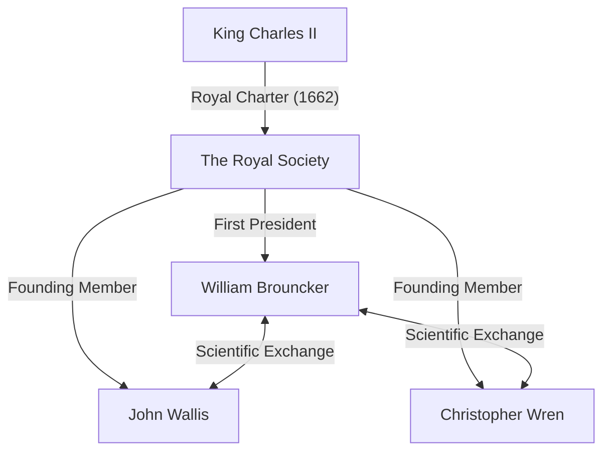

## 1. Introduction

17th-century Europe was in the midst of a scientific revolution. It was an era when mathematics and physics made dramatic leaps forward, as epitomized by the discovery of calculus by [Isaac Newton](https://kenji.blog/en/p/newton/) and Gottfried Wilhelm Leibniz. Amidst this, the institution that played a central role in the development of British academia was **The Royal Society**.

This article provides a detailed explanation of the life and remarkable mathematical achievements of **[William Brouncker](https://kenji.blog/en/p/brouncker/)**, who served as the first President of the Royal Society and made his mark in history as a mathematician with his "continued fraction representation of Pi" and "solution to Pell's equation". Brouncker interacted with the top minds of Europe at the time and tackled numerous challenging problems. His achievements contributed significantly to laying the foundation for mathematically rigorous treatment of the concept of infinity.

## 2. Early Life and Career

[William Brouncker](https://kenji.blog/en/p/brouncker/) (1620 - April 5, 1684) was born as the eldest son of [William Brouncker](https://kenji.blog/en/p/brouncker/), 1st Viscount Brouncker, and Winifred Leigh. While there are many unknown details about his exact birthplace and early education, it is believed he studied at Oxford University, cultivating excellent language skills and a mathematical sense. In 1645, following his father's death, he became the 2nd Viscount Brouncker.

At the time, England was in the chaotic period of the Puritan Revolution (English Civil War), but Brouncker devoted himself more to the world of academia than to the political front stage. He had a particularly strong interest in mathematics and music, beginning to construct his own theories. In 1647, he was awarded a Doctor of Medicine degree from Oxford University, but his primary interest always remained in the exact sciences. His younger brother, Henry Brouncker, was also known to be active in the political and courtly world while maintaining an interest in chess and mathematics.

## 3. Activities as the First President of the Royal Society

The Royal Society is one of the oldest scientific societies in the world, dedicated to improving natural knowledge. Its origins lie in a gathering formed after a lecture by Christopher Wren in London in 1660, and it officially launched in 1662 after receiving a Royal Charter from King Charles II.

Elected as the **First President** of this historic society was [William Brouncker](https://kenji.blog/en/p/brouncker/). Amidst the society taking shape through the efforts of Robert Moray and others, Brouncker served as president for a long period of 15 years from 1662 to 1677, devoting himself to building the foundation of the society.

Brouncker played a crucial role in bringing together outstanding scientists like Robert Boyle and Robert Hooke, and in establishing a new scientific methodology that emphasized experimental verification. He himself actively participated in experiments concerning the motion of pendulums and the weight of the atmosphere, presenting numerous reports at society meetings. He also functioned as a conduit to the royal family, contributing greatly to the society's financial and social stability.

## 4. Mathematical Achievement: Continued Fraction Representation of Pi

Brouncker's most famous mathematical achievement is the discovery of the generalized continued fraction for the circumference ratio $\pi$. This was introduced in the book *Arithmetica Infinitorum* (1655) by contemporary mathematician [John Wallis](https://kenji.blog/en/p/wallis/), which made it widely known.

### Wallis's Formula and Brouncker's Transformation

Wallis had discovered the following infinite product (Wallis's formula) regarding Pi:

$$
\frac{\pi}{2} = \frac{2}{1} \cdot \frac{2}{3} \cdot \frac{4}{3} \cdot \frac{4}{5} \cdot \frac{6}{5} \cdot \frac{6}{7} \cdot \frac{8}{7} \cdots
$$

Wallis showed this result to Brouncker and asked if it could be expressed in a different form. In response, Brouncker, using algebraic manipulation and a clever concept of limits, masterfully transformed this equation into a continued fraction. This is the following **Brouncker's formula**:

$$
\frac{4}{\pi} = 1 + \frac{1^2}{2 + \frac{3^2}{2 + \frac{5^2}{2 + \frac{7^2}{2 + \ddots}}}}
$$

### Significance of the Formula and Proof Outline

This continued fraction captivated many mathematicians with its beauty and regularity. It possesses a remarkably elegant structure where the squares of odd numbers continuously appear in the numerators, and the integer part of the denominators is always $2$. This discovery demonstrated that the transcendental number Pi is embedded within a simple regularity of natural numbers.

Continued fractions are highly powerful tools for approximating irrational numbers. While Brouncker's formula converges very slowly and was therefore unsuited for practical calculation of Pi, it had a massive impact on later mathematics as a pioneering example of continued fraction expansion in analysis. Euler would later generalize this formula further, deeply developing the theory of continued fractions.

## 5. Mathematical Achievement: Solving [Pell's Equation](https://kenji.blog/en/p/pell-equation/)

Another significant achievement is the solution to the so-called **Pell's equation**. Pell's equation is a Diophantine equation (a polynomial equation with integer coefficients) of the following form for a positive integer $n$ that is not a perfect square:

$$
x^2 - n y^2 = 1 \quad (\text{where } x, y \text{ are integers})
$$

### Challenge from Fermat

In 1657, the great French mathematician [Pierre de Fermat](https://kenji.blog/en/p/fermat/) sent a challenge to English mathematicians to find integer solutions to this equation. Fermat cited difficult cases like $n=61$ as examples.

### Brouncker's Algorithm

It was Wallis and Brouncker who stood up to this challenge. Brouncker in particular developed a method virtually equivalent to the algorithm known today as the "continued fraction method," establishing a procedure to find the minimum positive integer solution to the equation for any non-square number $n$.

Brouncker's approach involves calculating the continued fraction expansion of $\sqrt{n}$ and constructing the solution using its convergent fractions (principal convergents). For example, in the case of $n=2$, the equation becomes $x^2 - 2y^2 = 1$. The continued fraction expansion of $\sqrt{2}$ is $[1; 2, 2, 2, \dots]$, and by calculating its convergents, we can obtain the minimal solution $x=3, y=2$. Indeed, $3^2 - 2 \cdot 2^2 = 9 - 8 = 1$ holds true.

In the case of $n=61$ presented by Fermat, the minimal solution is extraordinarily large:

$$
x = 1766319049, \quad y = 226153980
$$

Brouncker demonstrated that even such gigantic solutions could be systematically derived using his method. Ironically, due to a misunderstanding by [Leonhard Euler](https://kenji.blog/en/p/euler/), this equation was later named after English mathematician John Pell, but the greatest contribution to establishing the solution method undeniably belongs to Brouncker.

## 6. Other Achievements and Later Years

### Contributions to Music Theory

Brouncker was interested not only in mathematics but also in music theory. He translated [René Descartes](https://kenji.blog/en/p/descartes/)'s *Musicae Compendium* into English and published it anonymously. In doing so, he did not just translate it but added an appendix proposing his own tuning system (17-tone equal temperament) that divided an octave into 17 equal intervals. This was a pioneering attempt to analyze musical scales mathematically using logarithms.

### Quadrature of the Parabola and Logarithmic Curve

Furthermore, he conducted important research on the quadrature (finding the area) of the hyperbola. He devised a method to calculate the area of a hyperbola using infinite series, which led to the series expansion of the logarithmic function. Contemporary with Nicholas Mercator, he recognized the usefulness of infinite series in calculating natural logarithms. This was a crucial step in the later development of calculus.

### Ballistics and Mechanics

In the field of mechanics, he conducted research on the recoil of guns and verified Christiaan Huygens's theory on the isochronism of pendulums. It shows that he had an eye not only for theoretical exploration but also for practical and military applications.

In his later years, even after stepping down as President of the Royal Society, Brouncker served in public offices such as a commissioner of the Navy Board. Brouncker's name frequently appears in Samuel Pepys's famous diary as a capable colleague in naval administration. He remained unmarried throughout his life and passed away at his home in London in 1684.

## 7. Conclusion

[William Brouncker](https://kenji.blog/en/p/brouncker/) was an outstanding leader and an original mathematician who drove the 17th-century British scientific community. His achievements in laying the foundations of modern science as the first President of the Royal Society are immeasurable. In addition, his mathematical achievements, such as the continued fraction representation of Pi and the solution to Pell's equation, became significant milestones in the development of analysis, which deals with the concept of infinity, and number theory.

His approach symbolizes the transition period from rigorous geometry to analysis utilizing algebra and infinite series. While his name is often overshadowed by giants like Newton and Fermat, without the existence of **Brouncker**, the richness of mathematics today cannot be discussed. His intellectual curiosity and spirit of inquiry continue to shine before us as the beauty of mathematics even hundreds of years later.
